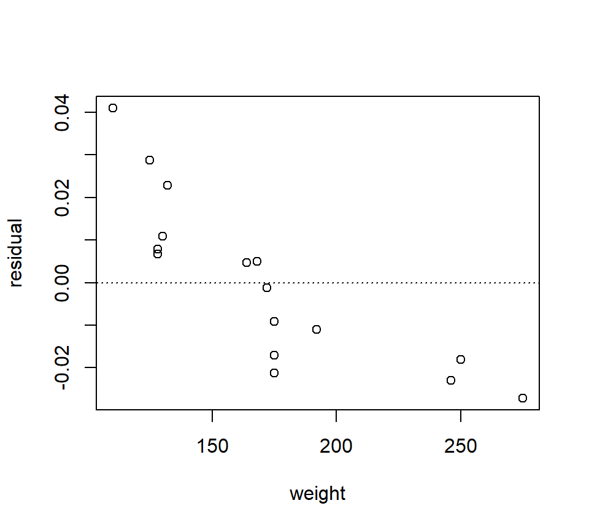
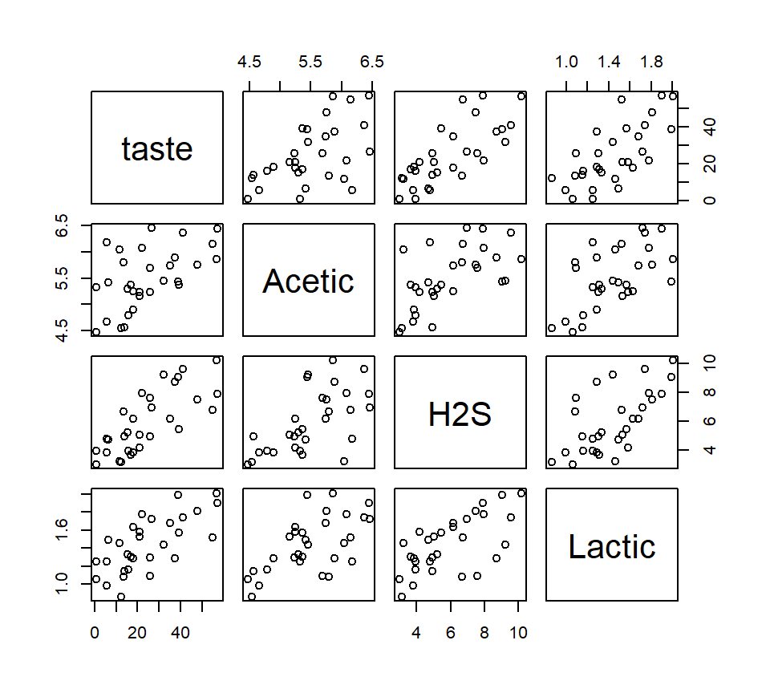
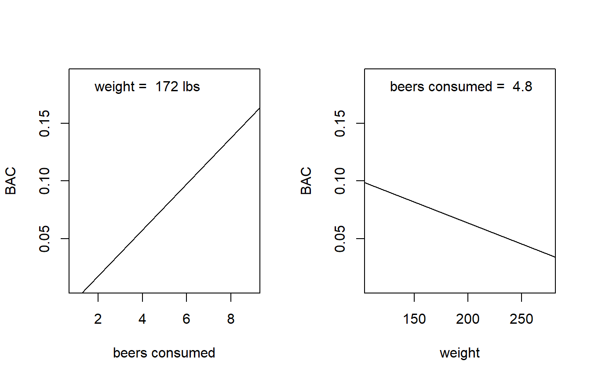
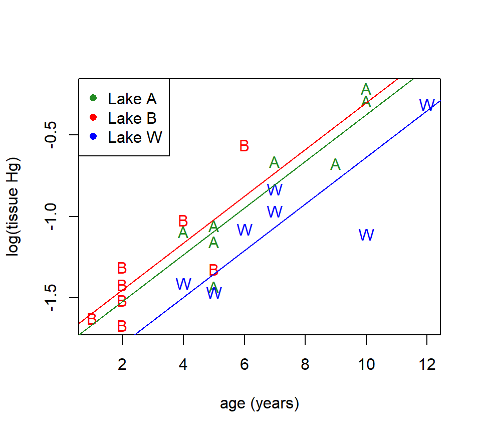
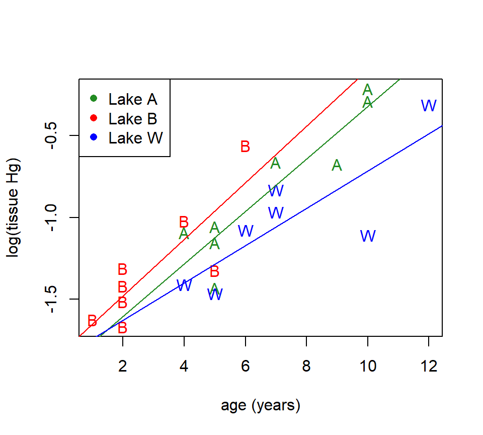
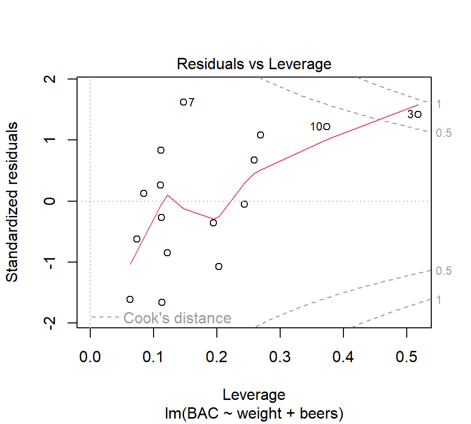

# Multiple regression


In this chapter, we examine regression models that contain several predictor variables.  Thankfully, many of the ideas from the simple linear regression also apply to regression models with several predictors.  After an overview of the basics, this chapter will focus on the new aspects of regression modeling that arise when considering several predictors.

## Multiple regression basics

### The multiple regression model

Just as SLR was used to characterize the relationship between a single predictor and a response, multiple regression can be used to characterize the relationship between several predictors and a response.

*Example.*  In the BAC data, we also know each individual's weight and gender:

``` r
beer <- read.csv("data/beer2.csv", head = T, stringsAsFactors = T)
head(beer)
```

```
##     BAC weight beers
## 1 0.100    132     5
## 2 0.030    128     2
## 3 0.190    110     9
## 4 0.120    192     8
## 5 0.040    172     3
## 6 0.095    250     7
```
A plot of the residuals from the BAC vs. beers consumed model against weight strongly suggests that some of the variation in BAC is attributable to differences in weight:

``` r
fm1 <- with(beer, lm(BAC ~ beers))
plot(x = beer$weight, y = resid(fm1), xlab = "weight", ylab = "residual")
abline(h = 0, lty = "dotted")
```

<div class="figure" style="text-align: center">

<p class="caption">(\#fig:unnamed-chunk-2)SLR residuals vs. weight.</p>
</div>

To simultaneously characterize the effect that the variables "beers" and "weight" have on BAC, we might want to entertain a model with both predictors.  In words, the model is
\[
\mbox{BAC} = \mbox{intercept} + \mbox{(parameter associated with beers)} \times \mbox{beers}  + \mbox{(parameter associated with weight)} \times \mbox{weight} + \mbox{error}
\]
where (for the moment)  we are intentionally vague about what we mean by "parameter associated with beers".  As in SLR, the error term can be interpreted as a catch-all term that includes all the variation not accounted for by the linear associations betwen the response and the predictors  "beers" and "weight".

In mathematical notation, we can write the model as
\begin{equation}
y = \beta_0 +\beta_1 x_1 +\beta_2 x_2 +\varepsilon 
(\#eq:beer-two-predictors)
\end{equation}
We use subscripts to distinguish different predictors.  In this case, $x_1$ is the number of beers consumed and $x_2$ is the individual's weight.  Of course, the order in which we designate the predictors is arbitrary.

There are a variety of ways to think about this model.  As in SLR, we can separate this model into a mean or signal component $\beta_0 +\beta_1 x_1 +\beta_2 x_2$ and an error component $\varepsilon$.  Note that the mean component is now a function of two variables, and suggests that the relationship between the average response and either predictor is linear.  If we wish to make statistical inferences about the parameters $\beta_0$, $\beta_1$ and $\beta_2$ (which we do), then we need to place the standard assumptions on the error component: independence, constant variance, and normality.  In notation, $\varepsilon \sim \mathcal{N}\left(0,\sigma_{\varepsilon}^2 \right)$.

We can also think about this model geometrically.  Recall that in SLR, we could interpret the SLR model as a line passing through a cloud of data points.  With 2 predictors, we are now fitting a plane to data points that "exist" in a three- dimensional data cloud. 
<!-- ```{r fig.height = 3, echo = FALSE} -->
<!-- knitr::include_graphics("images/regression-schematic.png", dpi = 100) -->
<!-- ``` -->
As in SLR, we use the least squares criteria to find the best-fitting parameter estimates.  That is to say, we will agree that the best estimates of the parameters $\beta_0$, $\beta_1$ and $\beta_2$ are the values that minimize
\begin{eqnarray*}
SSE & = & \sum_{i=1}^n e_i^2 \\
 & = & \sum_{i=1}^n \left(y_i -\hat{y}_i \right)^2 \\
 & = & \sum_{i=1}^n\left(y_i -\left[\hat{\beta}_0 +\hat{\beta}_1 x_{i1} +\hat{\beta}_{2} x_{i2} \right]\right)^2  
\end{eqnarray*}
In R, we can fit this model by adding a new term to the right-hand side of the model formula in the call to the function 'lm':

``` r
fm2 <- lm(BAC ~ beers + weight, data = beer)
summary(fm2)
```

```
## 
## Call:
## lm(formula = BAC ~ beers + weight, data = beer)
## 
## Residuals:
##        Min         1Q     Median         3Q        Max 
## -0.0162968 -0.0067796  0.0003985  0.0085287  0.0155621 
## 
## Coefficients:
##               Estimate Std. Error t value Pr(>|t|)    
## (Intercept)  3.986e-02  1.043e-02   3.821  0.00212 ** 
## beers        1.998e-02  1.263e-03  15.817 7.16e-10 ***
## weight      -3.628e-04  5.668e-05  -6.401 2.34e-05 ***
## ---
## Signif. codes:  0 '***' 0.001 '**' 0.01 '*' 0.05 '.' 0.1 ' ' 1
## 
## Residual standard error: 0.01041 on 13 degrees of freedom
## Multiple R-squared:  0.9518,	Adjusted R-squared:  0.9444 
## F-statistic: 128.3 on 2 and 13 DF,  p-value: 2.756e-09
```
Thus, we see that the LSEs are $\hat{\beta}_0 = 0.040\%$, $\hat{\beta}_1 = 0.020\%$ per beer consumed, and $\hat{\beta}_{2} = -0.0003\%$ per pound of body weight.

As in SLR, we can define the fitted value associated with the $i$th data point as $\hat{y}_i =\hat{\beta}_0 +\hat{\beta}_1 x_{i1} +\hat{\beta}_{2} x_{i2}$, and the residual associated with the $i$th data point as $e_i =y_i -\hat{y}_i$.  Here, we require a double subscripting of the $x$'s, with the first subscript is used to distinguish the individual observations and the second subscript is used to distinguish different predictors.  For example, $x_{i2}$ is the value of the second predictor for the $i$th data point. 

*Example.* Find the fitted value and residual for the first observation in the data set, a $x_2=132$ lb person who drank $x_1=5$ beers and had a BAC of $y=0.1$.  Answer: $\hat{y}_1 =0.092$ and $e_1 =0.008$.

We can define the error sum of squares as $SSE=\sum_{i=1}^n e_i^2 = \sum_{i=1}^n \left(y_i -\hat{y}_i \right)^2$.   How many df are associated with the SSE?  In this model, there are $n-3$ df associated with the SSE, because 3 parameters are needed to determine the mean component of the model.  As in SLR, we can estimate the error variance $\sigma_{\varepsilon}^2$ with the MSE, although now we must be careful to divide by the appropriate df:
\[
s_\varepsilon^2 = MSE = \frac{SSE}{n-3}.
\] 
For the model above, $s_\varepsilon = 0.010\%$.

In general, the equation for an MLR model with any number of predictors can be written:  
\[
y_i =\beta_0 +\beta_1 x_{i1} +\beta_2 x_{i2} +\ldots +\beta_k x_{ik} +\varepsilon_i 
\] 
The error term is subject to the standard assumptions of independence, constant variance, and normality.  We will use the notation that $k$ is the number of parameters that need to be estimated in the mean component of the model excluding the intercept.  (When counting parameters, some texts include the intercept, while others do not.  If you consult a text, check to make sure you know what definition is being used.)  The SSE will be associated with $n - (k + 1)$ df.  Thus, the estimate of $\sigma_{\varepsilon}^2$ will be
\[
s_\varepsilon^2 = MSE = \frac{SSE}{n-(k+1)}.
\] 

#### Sums of squares decomposition and $R^2$.  
The sums-of-squares decomposition also carries over from SLR.  We still have ${\rm SS(Total)} = \sum_{i=1}^n \left(y_i -\bar{y}\right)^2$, ${\rm SS(Regression)} = \sum_{i=1}^n \left(\hat{y}_i -\bar{y}\right)^2$, and ${\rm SS(Total) = SS(Regression) + SSE}$.  Thus, we can define $R^2$ using the same formula:
\[
R^2 = \frac{{\rm SS(Regression)}}{{\rm SS(Total)}} = 1- \frac{{\rm SSE}}{{\rm SS(Total)}} 
\] 
We still interpret $R^2$ as a measure of the proportion of variability in the response that is explained by the regression model.  In the BAC example, $R^2=0.952$.

### Interpreting partial regression coefficients.
The $\hat{\beta}$'s in a MLR model are called partial regression coefficients (or partial regression slopes).  Their interpretation is subtly different from SLR regression slopes.  Misinterpretation of partial regression coefficients is one of the most common sources of statistical confusion in the scientific literature.

We can interpret the partial regression coefficients geometrically.  In this interpretation, $\beta_j$ is the slope of the regression plane in the direction of the predictor $x_j$.  Imagine taking a "slice" of the regression plane.  In the terminology of calculus, $\beta_j$ is also the partial derivative of the regression plane with respect to the predictor $x_j$ (hence the term "partial regression coefficient").

Another ways to express this same idea in everyday language is that $\beta_j$ quantifies the linear association between predictor $j$ and the response when the other predictors are held constant, or while controlling for the effects of the other predictors. This is different from an SLR slope, which we can interpret as the slope of the linear association between $y$ and $x_j$ while ignoring all other predictors.  Thus, the interpretation of a partial regression coefficient *depends on the model in which the parameter is found*.  

Compare the estimated regression coefficients for the number of beers consumed in the SLR model and the MLR model that includes weight.

* Estimated SLR coefficient for no. of beers consumed: 0.018
* Estimated MLR coefficient for no. of beers consumed: 0.020

The coefficients differ because they estimate different parameters that mean different things.  The SLR coefficient estimates a slope that does not account for the effect of weight, while the MLR coefficient estimates a slope that does account for the effect of weight.

@gelman2020regression's interpretation of regression coefficients extends nicely here.  Recall that we interpreted the SLR slope as saying that if we compare two individuals who consume different numbers of beers (call those values $x_1$ and $x_2$), then the average difference in the individuals' BAC equals $0.018 \times (x_1 - x_2)$.  In a multiple regression context, we would now say that if we compare two individuals *who weigh the same* but who consume different numbers of beers, then the average difference in the individuals' BAC equals $0.020 \times (x_1 - x_2)$.  Thus, the partial regression coefficient tells us something different than the simple regression coefficient.  Therefore, we are not surprised that the values differ.

As a final point, note that our interpretation of the partial regression coefficient 0.020 above does not depend on the particular weight of the two individuals that we are comparing; all that matters is that the two individuals compared weigh the same.  Thus, if we are comparing two 100-pound individuals, one of whom has comsumed 1 beer and the other who has consumed 3 beers, then we estimate that the person who drank 3 beers would have a BAC 0.040 larger than the person who drank 1 beer.  Under the current model, this would also be true if we compared two 250-point individuals, one of whom had comsumed 1 beer and the other who had consumed 3 beers.  All that matters, so far, is that the individuals to be compared weigh the same.  That said, knowing what we do about human physiology, we might that this value should differ depending on whether we are comparing two 100-pound individuals or two 250-pound individuals.  This idea --- that the association between one predictor and the response depends on the value of another predictor --- is the idea of a *statistical interaction*.  We will encounter interactions soon.

Here's another example from the world of food science.  As cheese ages, various chemical processes take place that determine the taste of the final product.  These data are from the @moore1989introduction.  The response variable is the taste scores averaged from several tasters.  There are three predictors that describe the chemical content of the cheese.  They are:

* acetic: the natural log of acetic acid concentration
* h2s: the natural log of hydrogen sulfide concentration
* lactic: the concentration of lactic acid

Here is a "pairs plot" of the data.  In this plot, each panel is a scatterplot showing the relationship between two of the four variables in the model.  Pairs plots are useful ways to gain a quick grasp of the structure in the data and how the constituent variables are related to one another.

``` r
cheese <- read.table("data/cheese.txt", head = T, stringsAsFactors = T)
pairs(cheese)
```


Let's entertain a model that uses all three predictors.  

``` r
cheese_regression <- lm(taste ~ Acetic + H2S + Lactic, data = cheese)
summary(cheese_regression)
```

```
## 
## Call:
## lm(formula = taste ~ Acetic + H2S + Lactic, data = cheese)
## 
## Residuals:
##     Min      1Q  Median      3Q     Max 
## -17.390  -6.612  -1.009   4.908  25.449 
## 
## Coefficients:
##             Estimate Std. Error t value Pr(>|t|)   
## (Intercept) -28.8768    19.7354  -1.463  0.15540   
## Acetic        0.3277     4.4598   0.073  0.94198   
## H2S           3.9118     1.2484   3.133  0.00425 **
## Lactic       19.6705     8.6291   2.280  0.03108 * 
## ---
## Signif. codes:  0 '***' 0.001 '**' 0.01 '*' 0.05 '.' 0.1 ' ' 1
## 
## Residual standard error: 10.13 on 26 degrees of freedom
## Multiple R-squared:  0.6518,	Adjusted R-squared:  0.6116 
## F-statistic: 16.22 on 3 and 26 DF,  p-value: 3.81e-06
```

Compare this MLR model with each of the three possible SLR models:

``` r
slr1 <- lm(taste ~ Acetic, data = cheese)
summary(slr1)
```

```
## 
## Call:
## lm(formula = taste ~ Acetic, data = cheese)
## 
## Residuals:
##     Min      1Q  Median      3Q     Max 
## -29.642  -7.443   2.082   6.597  26.581 
## 
## Coefficients:
##             Estimate Std. Error t value Pr(>|t|)   
## (Intercept)  -61.499     24.846  -2.475  0.01964 * 
## Acetic        15.648      4.496   3.481  0.00166 **
## ---
## Signif. codes:  0 '***' 0.001 '**' 0.01 '*' 0.05 '.' 0.1 ' ' 1
## 
## Residual standard error: 13.82 on 28 degrees of freedom
## Multiple R-squared:  0.302,	Adjusted R-squared:  0.2771 
## F-statistic: 12.11 on 1 and 28 DF,  p-value: 0.001658
```

``` r
slr2 <- lm(taste ~ H2S, data = cheese)
summary(slr2)
```

```
## 
## Call:
## lm(formula = taste ~ H2S, data = cheese)
## 
## Residuals:
##     Min      1Q  Median      3Q     Max 
## -15.426  -7.611  -3.491   6.420  25.687 
## 
## Coefficients:
##             Estimate Std. Error t value Pr(>|t|)    
## (Intercept)  -9.7868     5.9579  -1.643    0.112    
## H2S           5.7761     0.9458   6.107 1.37e-06 ***
## ---
## Signif. codes:  0 '***' 0.001 '**' 0.01 '*' 0.05 '.' 0.1 ' ' 1
## 
## Residual standard error: 10.83 on 28 degrees of freedom
## Multiple R-squared:  0.5712,	Adjusted R-squared:  0.5558 
## F-statistic: 37.29 on 1 and 28 DF,  p-value: 1.374e-06
```

``` r
slr3 <- lm(taste ~ Lactic, data = cheese)
summary(slr3)
```

```
## 
## Call:
## lm(formula = taste ~ Lactic, data = cheese)
## 
## Residuals:
##      Min       1Q   Median       3Q      Max 
## -19.9439  -8.6839  -0.1095   8.9998  27.4245 
## 
## Coefficients:
##             Estimate Std. Error t value Pr(>|t|)    
## (Intercept)  -29.859     10.582  -2.822  0.00869 ** 
## Lactic        37.720      7.186   5.249 1.41e-05 ***
## ---
## Signif. codes:  0 '***' 0.001 '**' 0.01 '*' 0.05 '.' 0.1 ' ' 1
## 
## Residual standard error: 11.75 on 28 degrees of freedom
## Multiple R-squared:  0.4959,	Adjusted R-squared:  0.4779 
## F-statistic: 27.55 on 1 and 28 DF,  p-value: 1.405e-05
```

What do you make of the fact that an SLR analysis suggests that there is a (statistically significant) positive relationship between acetic acid concentration and taste, yet the partial regression coefficient associated with acetic acid concentration is not statistically significant in the MLR model?

---

<span style="color: gray;"> The fact that the interpretation of regression parameters depends on the context of the model in which they are found cannot be overemphasized.  I speculate that much of the confusion surrounding this point flows from the arguably deficient notation that we use to write regression models.  Consider the beer data.  When we compare the simple regression model $y = \beta_0 + \beta_1 x_1 + \varepsilon$ and the multiple regression model $y = \beta_0 + \beta_1 x_1 + \beta_2 x_2 + \varepsilon$, it seems natural to conclude that the parameter $\beta_1$ means the same thing in both models.  But the parameters differ, as we have seen.  In a different world, we might imagine notation that makes this context-dependence explicit, by writing something like $\beta_1(x_1)$ for the regression coefficient associated with $x_1$ in a model that includes only $x_1$, and $\beta_1(x_1, x_2)$ for the regression coefficient associated with $x_1$ in a model that includes both $x_1$ and $x_2$.  But such notation would quickly become unwieldy.  So we are stuck with the notation that we have, and must avoid the confusion that it can create.</span>

---

### Visualizing a multiple regression model

How do you visualize a multiple regression model?  With two predictors (as in our current BAC model), the regression fit is a (rigid) plane in three-dimensional space.  So, we have a fighting chance of making a picture of the model fit if we have good graphics software handy.  However, once we enocunter models with more than two predictors, the regression fits become increasingly high-dimensional objects that we humans won't be able to visualize in full.  So the best we can do in general is to think about the bivariate relationship implied between each predictor and the response.

We'll continue to use the BAC model as an example.  For starters, we might consider plotting the implied relationship between the predicted response and a predictor when the other predictors are set at their average value.  In the BAC model, that means plotting the relationship between the predicted BAC and beers consumed for an individual of average weight, where by average weight we mean equal to the average weight of the individuals in the data set.  We can couple this with a plot of predicted BAC vs weight for an individual who has consumed an average number of beers, where again we determine this average based on the average value that appears in the data set.  Here are those plots for the BAC model:


``` r
par(mfrow = c(1, 2))

b.hat <- coefficients(fm2)  # extract LSEs of regression coefficients
avg.beers <- mean(beer$beers)
avg.weight <- mean(beer$weight)

plot(BAC ~ beers, type = "n", xlab = "beers consumed", data = beer)  # set up axes
abline(a = b.hat[1] + b.hat[3] * avg.weight, b = b.hat[2])  # predicted BAC for average weight individual
legend("topleft", leg = paste("weight = ", round(avg.weight, 0), "lbs"), bty = "n")

plot(BAC ~ weight, type = "n", data = beer)  # set up axes
abline(a = b.hat[1] + b.hat[2] * avg.beers, b = b.hat[3])  # predicted BAC for average weight individual
legend("topleft", leg = paste("beers consumed = ", round(avg.beers, 1)), bty = "n")
```



It's not clear whether we should overlay the data on these plots.  Data are helpful, but showing the data points would suggest that the fitted line is a simple regression fit.  We want to be clear that it isn't.

### Statistical inference for partial regression coefficients

Statistical inference for partial regression coefficients proceeds in the same way as statistical inference for SLR slopes.  Standard errors for both partial regression coefficients are provided in the R output: $s_{\hat{\beta}_1 }$= 0.0013, $s_{\hat{\beta}_{2} }$= 0.000057.  Under the standard regression assumptions, the quantity $t=(\hat{\beta}_i -\beta _i )/s_{\hat{\beta}_i }$ has a $t$-distribution.  The number of degrees of freedom is the number of df associated with the SSE.  This fact can be used to construct confidence intervals and hypothesis tests.

Most software will do the needed math for us.  For example, to find 99\% CIs for the partial regression coefficients in the BAC model, we can use

``` r
confint(fm2, level = 0.99)
```

```
##                     0.5 %        99.5 %
## (Intercept)  0.0084354279  0.0712912780
## beers        0.0161715108  0.0237799132
## weight      -0.0005335564 -0.0001920855
```
Thus a 99\% CI for the partial regression coefficient associated with weight is given by the interval from -0.00053 to -0.00019.

Most statistical software will automatically provide tests of the null $H_0$: $\beta_i =0$ vs. the alternative $H_a$: $\beta_i \ne 0$.  For example, the R output above tells us that the $p$-value associated with this test for the partial regression coefficient associated with weight is $p = 0.000023$. 

If we were reporting this analysis in scientific writing, we might say that when comparing people who have consumed the same number of beers, every 1-lb increase in weight is associated with an average BAC decrease of 3.6% $\times$ 10$^{-4}$ (s.e. 5.7% $\times$ 10$^{-5}$). This association is statistically significant ($t_{13} =-6.40$, $p < .001$).

### Prediction

As in SLR, we distinguish between predictions of the average response of the population at a new value of the predictors vs.\ the value of a single future observation.  The point estimates of the two predictions are identical, but the value of a single future observation is more uncertain.  Therefore, we use a prediction interval for a single observation and a confidence interval for a population average.  The width of a PI or CI is affected by the same factors as in SLR.  In MLR, the width of the PI or CI depends on the distance between the new observation and the "center of mass" of the predictors in the data set.  For example, if we now use the BAC model to predict the BAC of a 170-lb individual who consumes 4 beers:


``` r
new.data <- data.frame(weight = 170, beers = 4)
predict(fm2, newdata = new.data, interval = "prediction")
```

```
##          fit        lwr        upr
## 1 0.05808664 0.03480226 0.08137103
```

``` r
predict(fm2, newdata = new.data, interval = "confidence")
```

```
##          fit        lwr        upr
## 1 0.05808664 0.05205732 0.06411596
```

## $F$-tests for several regression coefficients {#F-test}

### Basic machinery

Consider a general multiple regression model with $k$ predictors:
\[
y=\beta_0 +\beta_1 x_1 +\beta_2 x_2 +...+\beta_k x_k +\varepsilon 
\] 
So far, we've seen how to test whether any one individual partial regression coefficient is equal to zero, i.e., $H_0 :\beta_j =0$  vs.  $H_a :\beta_j \ne 0$.   We will now discuss how to generalize this idea to test if multiple partial regression coefficients are simultaneously equal to zero.  The statistical method that we will use is an $F$-test.  

Unfortunately, we don't yet have a great context for motivating $F$-tests.  We will see more compelling motivations for $F$-tests soon when we consider [categorical predictors](#categorical-predictors).  For now, we'll consider our multiple regression model for the BAC data with the two predictors "beers consumed" and "weight".  Recall that the equation for this model is given in eq. \@ref(eq:beer-two-predictors).  Let's suppose that we were interested in testing the null hypothesis that neither of the predictors have a linear association with the response, versus the alternative hypothesis that at least one predictor (and perhaps both) has a linear association with the response.  In symbols, we would write the null hypothesis as $H_0 :\beta_1 =\beta_2 =0$ and the alternative as $H_a :\beta_1 \ne 0{\rm \; or\; }\beta_2 \ne 0$.  

$F$-tests are essentially comparisons between models.  The model that provides the context for the null hypothesis is the "full" model, in the sense that it will prove to be the more flexible of our two models to be compared.  In the context of our present example, the full model is given by \@ref(eq:beer-two-predictors). The full model is then compared to a "reduced" model, which is the full model constrained by the null hypothesis.  In the present example, when we constrain the full model by the null hypothesis $\beta_1 =\beta_2 =0$, we are left with a reduced model that includes only the intercept:
\begin{equation}
y = \beta_0 + \varepsilon.
\end{equation}

Formally, it is important to note that the reduced model is a special case of the full model.  The statistical jargon for this observation is that the reduced model is "nested" in the full model, or (to say it in the active voice) the full model "nests" the reduced model.

Because the full model nests the reduced model, we know that the full model is guaranteed to explain at least as much of the variation in the response as the reduced model. The operative question is whether the improvement obtained by the full model is statistically significant, that is, whether it is more of an improvement than we would expect by random chance.

An $F$-test proceeds by fitting both the full and reduced model, and for each model recording the SSE and the df associated with the SSE.  An $F$-statistic is then calculated as  
\[
F=\frac{\left[SSE_{reduced} -SSE_{full} \right]/\left[df_{reduced} -df_{full} \right]}{{SSE_{full} / df_{full} }} 
\]
where by $df_{full}$ and $df_{reduced}$ we mean the df associated with the SSE of the full and reduced models, respectively.  Roughly, the numerator of the $F$-statistic quantifies the improvement in fit that the full model provides relative to the reduced model.  The denominator quantifies the variation in the response left unexplained by the full model.  Both numerator and denominator are standardized by their associated df to create an apples-to-apples comparison. The larger the numerator is relative to the denominator, the less likely it is that the improvement in fit was strictly due to random chance.

For the BAC data, we could compute the $F$-statistic "manually" by first fitting both models and extracting the SSE:

``` r
full.model <- lm(BAC ~ beers + weight, data = beer)
(sse.full <- sum(resid(full.model)^2))
```

```
## [1] 0.001408883
```

``` r
reduced.model <- lm(BAC ~ 1, data = beer)
(sse.full <- sum(resid(reduced.model)^2))
```

```
## [1] 0.029225
```
Then our $F$-statistic evaluates to:
\[
F=\frac{\left[0.0292 - 0.0014 \right]/\left[15 - 13 \right]}{{0.0014 / 13 }} = 128.3 
\]

If the null hypothesis is true, then the $F$-statistic will be drawn from an $F$ distribution with numerator df equal to $df_{reduced} -df_{full}$, and denominator df equal to $df_{full}$.  Evidence against the null and in favor of the alternative comes from large values of the $F$-statistic.  The $p$-value associated with the test is the probability of observing an $F$-statistic at least as large as the one observed if the null hypothesis is true.  

In R, this $p$-values can be found with the command `pf`.

``` r
pf(128.3, df1 = 2, df2 = 13, lower = FALSE)
```

```
## [1] 2.760276e-09
```
Thus, our $p$-value is infinitesimal.  In light of these data, it is almost completely implausible that there is no linear association between BAC and both the number of beers consumed and the individual's weight.

We've taken the above calculations slowly so that we can understand their logic.  In R, we can use the `anova` command to execute the $F$-test in one fell swoop.

``` r
anova(reduced.model, full.model)
```

```
## Analysis of Variance Table
## 
## Model 1: BAC ~ 1
## Model 2: BAC ~ beers + weight
##   Res.Df       RSS Df Sum of Sq      F    Pr(>F)    
## 1     15 0.0292250                                  
## 2     13 0.0014089  2  0.027816 128.33 2.756e-09 ***
## ---
## Signif. codes:  0 '***' 0.001 '**' 0.01 '*' 0.05 '.' 0.1 ' ' 1
```

### Model utility test {#model utility test}

The test that we have just conducted for the BAC data turns out to be a type of $F$-test called the *model utility test*.  In general, with the general regression model
\[
y=\beta_0 +\beta_1 x_1 +\beta_2 x_2 +...+\beta_k x_k +\varepsilon 
\] 
the model utility test is a test of the null hypothesis that all the regression coefficients equal zero, that is, $H_0 :\beta_1 =\beta_2 =...=\beta_k =0$ vs.\ the alternative that at least one of the partial regression coefficients is not equal to zero.  In other words, it is a test of whether the regression model provides a significant improvement in fit compared a simpler model that assumes the $y$'s are a simple random sample from a Gaussian distirbution.  The model utility test is easy for computer programmers to automate, so it is usually included as part of the standard regression output.  In the R `summary` of a regression model, we can find it at the very end of the output.

``` r
full.model <- lm(BAC ~ beers + weight, data = beer)
summary(full.model)
```

```
## 
## Call:
## lm(formula = BAC ~ beers + weight, data = beer)
## 
## Residuals:
##        Min         1Q     Median         3Q        Max 
## -0.0162968 -0.0067796  0.0003985  0.0085287  0.0155621 
## 
## Coefficients:
##               Estimate Std. Error t value Pr(>|t|)    
## (Intercept)  3.986e-02  1.043e-02   3.821  0.00212 ** 
## beers        1.998e-02  1.263e-03  15.817 7.16e-10 ***
## weight      -3.628e-04  5.668e-05  -6.401 2.34e-05 ***
## ---
## Signif. codes:  0 '***' 0.001 '**' 0.01 '*' 0.05 '.' 0.1 ' ' 1
## 
## Residual standard error: 0.01041 on 13 degrees of freedom
## Multiple R-squared:  0.9518,	Adjusted R-squared:  0.9444 
## F-statistic: 128.3 on 2 and 13 DF,  p-value: 2.756e-09
```

Although the model utility test has a grandiose name, it is rarely interesting.  Rejecting the null in the model utility test is usually not an impressive conclusion (@quinn2002experimental).  You may have also noticed that in SLR the model utility test always provided a $p$-value that was exactly equal to the $p$-value generated for the test of $H_0$: $\beta_1 =0$ vs. $H_a$: $\beta_1 \ne 0$.  Can you figure out why this is so?

<!-- ### More on the relationship between $t$-tests and $F$-tests. -->

<!-- This section started to seem unnecessary.  Maybe revisit later and condense to something much shorter? -->

<!-- In linear statistical models (regression and ANOVA), we encounter predominantly two types of tests, $t$-tests and $F$-tests.  We have already seen how $t$-tests work.  $t$-tests are used to test null hypotheses that have a single equality.  In general notation, if we have a generic parameter $\theta$, a $t$-test tests $H_0$: $\theta = \theta_0$ vs. either the two-sided alternative $H_a$: $\theta \ne \theta_0$ or either of the one-sided alternatives $H_a$: $\theta < \theta_0$ or $H_a$: $\theta > \theta_0$.  One calculates a one- or two-tailed $p$-value based on whether the alternative hypothesis is one- or two-sided. -->

<!-- $F$-tests are used to test null hypotheses that either multiple parameters or multiple combinations of parameters are simultaneously equal to 0.  For example, in the fish data, we have just tested hypotheses $H_0 :\beta_2 =\beta_3 =0$ vs. $H_a :\beta_2 \ne 0{\rm \; or\; }\beta_3 \ne 0$.  The mechanics of an $F$-test are such that the only viable alternative is a two-sided alternative.  (This is actually not entirely true, but we can take it as true for our purposes in these notes.)  $P$-values are found by comparing $F$-statistics to $F$-distributions.  $F$-distributions are specified by two separate degrees of freedom, which we call the numerator degrees of freedom (ndf) and the denominator degrees of freedom (ddf).  The ndf will typically be the number of equalities needed to specify the null hypothesis, and the denominator df will be the number of df associated with the SSE for the full model.  -->

<!-- Note that $F$-statistics take only positive values.  The larger the value of the $F$-statistic, the more evidence the data provide against the null.  Thus, with an $F$-test, the $p$-value is always the area to the right of the observed statistic, or the probability of observing a test statistic at least as large as the value observed.  Consequently, the terminology associated with an $F$-test can be mildly confusing: the $p$-value is always a one-tailed $p$-value, but it is used to test a two-sided alternative hypothesis. -->

<!-- Finally, $F$-tests can also be used to test null hypotheses with single equalities.  That is, we can use an $F$-test to test $H_0$: $\theta = \theta_0$, but with an $F$-test we can only consider the two-sided alternative $H_a$: $\theta \ne \theta_0$. (To put this more in the form of an $F$-test, we might re-write the hypotheses as $H_0$: $\theta - \theta_0 = 0$ and $H_a$: $\theta - \theta_0 \ne 0$.)  Thus, in some sense, an $F$-test is a generalization of a $t$-test.  However, only a $t$-test can be used to test $H_0$: $\theta =\theta_0$ vs. the one-sided alternatives $H_a$: $\theta < \theta_0$ or $H_a$: $\theta > \theta_0$.   -->

## Categorical predictors {#categorical-predictors}

So far, we have dealt exclusively with quantitative predictors. Although we haven’t given it much thought, a key feature of quantitative predictors is that their values can be ordered, and that the distance between ordered values is meaningful. For example, in the BAC data, a predictor value of $x=3$ beers consumed is greater than $x=2$ beers consumed. Moreover, the difference between $x=2$ and $x=3$ beers consumed is exactly one-half of the distance between $x=2$ and $x=4$ beers consumed. Another way to think about quantitative predictors is that we could sensibly place all of their values on a number line.

Categorical variables are variables whose values cannot be sensibly placed on a number line. Examples include ethnicity or brand of manufacture. We use indicator variables as devices to include categorical predictors in regression models.^[Whether a variable should be treated as quantitative or categorical is not always clear cut.  For example, consider an individual's political leaning, and suppose that for the sake of argument we could classify each individual's political leaning as either conservative, moderate, or liberal.  Most everyone would agree that these three values have a natural ordering, with moderates occupying a middle ground between conservatives and liberals.  However, the operative question for the analyst is whether to assume that moderates are exactly halfway between conservatives and liberals.  In other words, is the difference between conservatives and moderates exactly the same size as the difference between moderates and liberals?  If we are willing to make this assumption, then we could code political leaning with a quantitative variable, taking values (say) 0, 1, and 2 for conservatives, moderates, and liberals, respectively. If we weren't willing to make this assumption, then we should treat political leaning as a categorical variable with three levels.  There is scope here for thoughtful analysts to disagree.]

*Example.* D. K. Sackett investigated mercury accumulation in the tissues of large-mouth bass (a species of fish) in several lakes in the Raleigh, NC area (@sackett2013influence).  We will examine data from three lakes: Adger, Bennett's Millpond, and Waterville.  From each lake, several fish were sampled, and the mercury (Hg) content of their tissues was measured.  Because fish are known to accumulate mercury in their tissues as they age, the age of each fish (in years) was also determined.  The plot below shows the mercury content (in mg / kg) for each fish plotted vs.\ age, with different plotting symbols used for the three lakes.  To stabilize the variance, we will use the log of mercury content as the response variable.  There are $n=23$ data points in this data set.

``` r
fish <- read.table("data/fish-mercury.txt", head = T, stringsAsFactors = T)

with(fish, plot(log(hg) ~ age, xlab = "age (years)", ylab = "log(tissue Hg)", type = "n"))
with(subset(fish, site == "Adger"), points(log(hg) ~ age, pch = "A"))
with(subset(fish, site == "Bennett"), points(log(hg) ~ age, pch = "B"))  
with(subset(fish, site == "Waterville"), points(log(hg) ~ age, pch = "W"))
```


With these data, we would like to ask: when comparing fish of the same age, is there evidence that tissue mercury content in fish differs among the three lakes?  To do so, we need to develop a set of $indicator$ variables to capture the differences among the lakes.  As is often the case, one has options here.  If you wish, you can construct the indicator variables manually, perhaps using a spreadsheet program.  Alternatively, most computer programs, including R, will create indicator variables automatically.  We'll sketch out the ideas behind indicator variables first and then see how R creates them.

To create a set of indicator variables, we first need to choose one level of the variable as the reference level or baseline. While the scientific context of a problem will sometimes make it more natural to designate one level as a reference, the choice is often arbitrary.  In all cases, the choice of a reference level will not affect the ensuing analysis. For every level other than the reference, we create a separate indicator variable that is equal to 1 for that level and is equal to 0 for all levels. Thus, to include a categorical variable with $c$ different levels, we need $c−1$ indicator variables.

To see how R constructs indicator variables, we can use the `contrast` command^[The `contrast` command does much more than report how indicator variables are coded for a categorical variable, as we will see later.]

``` r
contrasts(fish$site)
```

```
##            Bennett Waterville
## Adger            0          0
## Bennett          1          0
## Waterville       0          1
```
In the R output above, each column represents an indicator variable, the rows give the levels of the categorical variable, and the numbers give the coding of each indicator variable.  We see that R has created two indicator variables (as we'd expect), and labeled them "Bennett" and "Waterville".  The names of the indicator variables provide strong hints about their coding, but to be completely sure we can inspect the numerical coding given below.  The indicator labeled "Bennett" takes the value of 1 when `site` equals `Bennett` and takes the value of zero otherwise.  In other words, it is the indicator for Bennett.  The indicator labeled "Waterville" takes the value of 1 when `site` equals `Waterville` and takes the value of zero for the other two sites.  In other words, it is the indicator for Waterville.  Adger, therefore, is the reference site.^[If we prefer, it is easy enough to select a different reference level in R.  Suppose we wanted Bennett to serve as the reference site.  We could do so with the code `contrasts(fish$site) <- contr.treatment(n = 3, base = 2)` See the R documentation for `contr.treatment` for more details.]

Now let's fit a regression model with both `age` and `site` as predictors.

``` r
fish_model <- lm(log(hg) ~ age + site, data = fish)
summary(fish_model)
```

```
## 
## Call:
## lm(formula = log(hg) ~ age + site, data = fish)
## 
## Residuals:
##      Min       1Q   Median       3Q      Max 
## -0.47117 -0.08896  0.03796  0.13910  0.31327 
## 
## Coefficients:
##                Estimate Std. Error t value Pr(>|t|)    
## (Intercept)    -1.80618    0.15398 -11.730 3.80e-10 ***
## age             0.14309    0.01967   7.276 6.66e-07 ***
## siteBennett     0.07107    0.12910   0.550   0.5884    
## siteWaterville -0.26105    0.10817  -2.413   0.0261 *  
## ---
## Signif. codes:  0 '***' 0.001 '**' 0.01 '*' 0.05 '.' 0.1 ' ' 1
## 
## Residual standard error: 0.2084 on 19 degrees of freedom
## Multiple R-squared:  0.7971,	Adjusted R-squared:  0.765 
## F-statistic: 24.88 on 3 and 19 DF,  p-value: 8.58e-07
```
The R output gives us information about the partial regression coefficients associated with `age` and with each of the indicator variables for `site`.  In an equation, we could write this model as
\[
y=\beta_0 +\beta_1 x_1 +\beta_2 x_2 +\beta_3 x_3 +\varepsilon 
\] 
where $x_1$ gives the age of the fish and $x_2$ and $x_3$ are the indicator variables for Bennett and Waterville, respectively. 

While the R output gives us tests of the significance of the individual regression coefficients, we want to determine whether there are significant differences among the three sites when comparing fish of the same age.  To answer this question, we need to test the hypothesis $H_0: \beta_2 = \beta_3 = 0$.  We can do this with an [$F$-test](#F-test).

``` r
fish_model_full <- lm(log(hg) ~ age + site, data = fish)
fish_model_reduced <- lm(log(hg) ~ age, data = fish)
anova(fish_model_reduced, fish_model_full)
```

```
## Analysis of Variance Table
## 
## Model 1: log(hg) ~ age
## Model 2: log(hg) ~ age + site
##   Res.Df     RSS Df Sum of Sq      F  Pr(>F)  
## 1     21 1.17251                              
## 2     19 0.82529  2   0.34722 3.9969 0.03558 *
## ---
## Signif. codes:  0 '***' 0.001 '**' 0.01 '*' 0.05 '.' 0.1 ' ' 1
```
Thus, we see that there are significant differences among the sites, when comparing fish of the same age ($F_{2, 19} = 4.00$, $p = 0.036$). 

For what it's worth, we also could have obtained this test by running the `anova` command on the full model.

``` r
anova(fish_model_full)
```

```
## Analysis of Variance Table
## 
## Response: log(hg)
##           Df  Sum Sq Mean Sq F value   Pr(>F)    
## age        1 2.89448 2.89448 66.6374 1.24e-07 ***
## site       2 0.34722 0.17361  3.9969  0.03558 *  
## Residuals 19 0.82529 0.04344                     
## ---
## Signif. codes:  0 '***' 0.001 '**' 0.01 '*' 0.05 '.' 0.1 ' ' 1
```
The `anova` command also gives an $F$-test for the null hypothesis of no association between age and the response when comparing fish from the same lake, that is, that $\beta_1 = 0$.  This $F$-test gives the same result as the $t$-test provided in the earlier `summary`, because the two tests are identical.  Arguably, for single regression coefficients, the output from `summary` is more useful, because it gives us the estimate of $\beta_1$, while the  `anova` output only gives us an $F$-test.

Finally, now that we have established that there are significant differences among the sites when comparing fish of the same age, we can go back and make sense of the estimates of $\beta_2$ and $\beta_3$ in the full model.  The partial regression coefficients associated with an indicator variable quantify the difference between the level that the variable is an indicator for and the reference.  In other words, for the fish data, the value $\hat{\beta}_2 = 0.071$ tells us that if we compare two fish of the same age, then a fish from Bennett will have a response that is on average 0.071 larger than a fish from Adger (the reference site).  The value $\hat{\beta}_3 = -0.261$ tells us that, on average, a fish from Waterville will have a response that is 0.261 less than a similarly aged-fish from Adger.  Note that these values also give us enough information to compute the average difference in $y$ between two similarly aged fish from Bennett and Waterville, even though that value isn't directly included in the output.

---

<span style="color: gray;"> Indicator variables may seem like a bit of an awkward device.  Why can't we just fit a model with a separate intercept for each lake?  In fact, we can.  In `R`, the program `lm` includes the intercept $\beta_0$ in any model by default, because most regression models include it.  However, if we instruct `lm` to omit the baseline intercept $\beta_0$, then the program will parameterize the model by the lake-specific intercepts.  We instruct `lm` to omit the intercept by including a `-1` on the right-hand side of the model formula as follows:</span>


``` r
fish_model_alt <- lm(log(hg) ~ age + site - 1, data = fish)
summary(fish_model_alt)
```

```
## 
## Call:
## lm(formula = log(hg) ~ age + site - 1, data = fish)
## 
## Residuals:
##      Min       1Q   Median       3Q      Max 
## -0.47117 -0.08896  0.03796  0.13910  0.31327 
## 
## Coefficients:
##                Estimate Std. Error t value Pr(>|t|)    
## age             0.14309    0.01967   7.276 6.66e-07 ***
## siteAdger      -1.80618    0.15398 -11.730 3.80e-10 ***
## siteBennett    -1.73511    0.09440 -18.381 1.47e-13 ***
## siteWaterville -2.06723    0.16351 -12.643 1.07e-10 ***
## ---
## Signif. codes:  0 '***' 0.001 '**' 0.01 '*' 0.05 '.' 0.1 ' ' 1
## 
## Residual standard error: 0.2084 on 19 degrees of freedom
## Multiple R-squared:  0.9721,	Adjusted R-squared:  0.9662 
## F-statistic: 165.2 on 4 and 19 DF,  p-value: 1.781e-14
```

<span style="color: gray;"> The model is now parameterized by the lake-specific intercepts and the common slope.  While this parameterization is more straightforward, note that the $R^2$ value and the model utility test are now wrong.  The software's routine for calculating $R^2$ and the model utility test assumes that the intercept $\beta_0$ will be present in the model.  Of course, it's easy to use our original parameterization to get the correct $R^2$ value (and model utility test) and use the alternative parameterization to get the lake-specific slopes.  We just have to be careful with regard to the rest of the output when the baseline intercept is omitted.</span>

<span style="color: gray;"> None of this behavior is unique to `R`.  In SAS, PROC GLM has a similar option for reparameterizing the model without the common intercept, but it will cause the computation of $R^2$ and the model utility test to break there as well.</span>

---

Models that combine a single numerical predictor and a single categorical predictor can be visualized by plotting the trend lines for each level of the categorical predictor.  In making this plot, it is easier to use the alternative parameterization of the model described in the gray text above.


``` r
with(fish, plot(log(hg) ~ age, xlab = "age (years)", ylab = "log(tissue Hg)", type = "n"))
with(subset(fish, site == "Adger"), points(log(hg) ~ age, pch = "A", col = "forestgreen"))
with(subset(fish, site == "Bennett"), points(log(hg) ~ age, pch = "B", col = "red"))  
with(subset(fish, site == "Waterville"), points(log(hg) ~ age, pch = "W", col = "blue"))
abline(a = fish_model_alt$coefficients[2], b = fish_model_alt$coefficients[1], col = "forestgreen")
abline(a = fish_model_alt$coefficients[3], b = fish_model_alt$coefficients[1], col = "red")
abline(a = fish_model_alt$coefficients[4], b = fish_model_alt$coefficients[1], col = "blue")
legend("topleft", legend = c("Lake A", "Lake B", "Lake W"), pch = 16, col = c("forestgreen", "red", "blue"))
```



## Interactions between predictors {#regression-interactions}

Consider (again) the BAC data, with our working model
\[
y =\beta_0 +\beta_1 x_1 +\beta_2 x_2 +\varepsilon 
\] 
where $y$ is the response (BAC), $x_1$ is beers consumed, $x_2$ is weight, and $\varepsilon$ is iid normal error.  This is an *additive* model, in the sense that the joint association between beers consumed and weight (as a pair) and BAC can be found by adding together the individual associations between each of the two predictors and the response.  However, we might instead want to allow for the possibility that the association between one predictor and the response itself depends on the value of a second predictor.  This state of affairs is called a *statistical interaction*.  More specifically, we call it a statistical interaction between the two predictors with respect to their association with the response.  Note that whether or not two predictors interact has nothing to do with whether the predictors themselves are associated.^[While the possibility of correlations among predictors is important, that is not what we are discussing here.  Instead, correlations among predictors are the subject of *collinearity*.]

An *interaction* between the two predictors allows the effect of beers consumed to depend on weight, and vice versa.  A model with an interaction can be written as:
\[
y =\beta_0 +\beta_1 x_1 +\beta_2 x_2 +\beta_3 x_1 x_2 +\varepsilon 
(\#eq:beer-interaction)
\] 
There are two equally good ways to code this model in R:

``` r
fm1 <- lm(BAC ~ beers + weight + beers:weight, data = beer)
```
or

``` r
fm2 <- lm(BAC ~ beers * weight, data = beer)
```
In the first notation, the colon (:) tells R to include the interaction between the predictors that appear on either side of the colon.  In the second notation, the asterisk (*) is shorthand for both the individual predictors and their interaction.  

``` r
summary(fm2)
```

```
## 
## Call:
## lm(formula = BAC ~ beers * weight, data = beer)
## 
## Residuals:
##        Min         1Q     Median         3Q        Max 
## -0.0169998 -0.0070909  0.0008463  0.0084267  0.0164373 
## 
## Coefficients:
##                Estimate Std. Error t value Pr(>|t|)   
## (Intercept)   3.010e-02  3.495e-02   0.861  0.40601   
## beers         2.162e-02  5.760e-03   3.754  0.00275 **
## weight       -2.993e-04  2.241e-04  -1.336  0.20646   
## beers:weight -1.066e-05  3.627e-05  -0.294  0.77393   
## ---
## Signif. codes:  0 '***' 0.001 '**' 0.01 '*' 0.05 '.' 0.1 ' ' 1
## 
## Residual standard error: 0.0108 on 12 degrees of freedom
## Multiple R-squared:  0.9521,	Adjusted R-squared:  0.9402 
## F-statistic: 79.57 on 3 and 12 DF,  p-value: 3.453e-08
```

*Interpreting the interaction*.  
The partial regression coefficient associated with an interaction between two predictors (call them "A" and "B") quantifies the effect that predictor A has on the linear association between predictor B and the response.  Or, equivalently, the same partial regression coefficient quantifies the effect that predictor B has on the linear association between predictor A and the response. (It may not be obvious right away that the same regression coefficient permits both interpretations, but you might be able to convince yourself that this is true by doing some algebra with the regression model.)  Thus, if we reject the null hypothesis that a partial regression coefficient associated with an interaction equals zero, then we conclude that the effects of the two predictors depend on one another.  With the BAC data, the interaction term is not statistically significant.  Thus, these data provide no evidence that the association between beers consumed and BAC depends on weight, or vice versa.  

For the sake of argument, let's examine the estimate of the interaction between beers consumed and weight, despite the fact that it is not statistically significant.  How can we interpret the value $\hat{\beta}_3 = -1.07 \times 10^{-5}$?  This value tells us how the association between beers consumed and BAC changes as weight changes.  In other words, the model predicts that a heavier person's BAC will increase less for each additional beer consumed, compared to a lighter person.  How much less?  If the heavier person weighs 1 lb more than the lighter person, then one additional beer will increase the heavier person's BAC by $1.07 \times 10^{-5}$ less than it increases the lighter person's BAC.  This agrees with our expectations, but these data do not provide enough evidence to declare that this interaction is statistically significant.  Alternatively, $\beta_3$ also tells us how the association between weight and BAC changes as the number of beers consumed changes.  That is, as the number of beers consumed increases, then the association between weight and BAC becomes more steeply negative.  Again, this coincides with our expectation, despite the lack of statistical significance.

*Interpreting partial regression coefficients in the presence of an interaction.*  
There is a major and unexpected complication that ensues from including an interaction term in a regression model.  This complication concerns how we interpret the partial regression coefficients associated with the individual predictors engaged in the interaction, that is, the regression coefficients $\beta_1$ and $\beta_2$ in eq. \@ref(eq:beer-interaction).  It turns out that, in \@ref(eq:beer-interaction), the partial regression coefficient associated with an individual predictor quantifies the relationship between that predictor and the response when the other predictor involved in the interaction equals 0.   Sometimes this interpretation is scientifically meaningful, but usually it isn't.

For example, in the BAC model that includes the interaction above, the parameter $\beta_1$ now quantifies the association between beers consumed and BAC for people who weigh 0 lbs.  Obviously, this is a meaningless quantity.  Alternatively, the parameter $\beta_2$ quantifies the association between weight and BAC for people who have consumed 0 beers.  This is a bit less ridiculous --- in fact, it makes a lot of sense --- but still requires extrapolating the model fit outside the range of the observed data, because there are no data points here for people who have had 0 beers.^[To take this argument a little further, we don't expect an association between weight and BAC for people who have not drunk any beers.  Thus, it is perhaps not surprising that we cannot reject $H_0: \beta_2 = 0$ in favor of $H_0: \beta_2 \ne 0$ in the model that includes the interaction between weight and beers consumed.]

To summarize, the subtlety here is that if we compare the additive model
\[
y =\beta_0 +\beta_1 x_1 +\beta_2 x_2 +\varepsilon
\] 
with the model that includes an interaction
\[
y =\beta_0 +\beta_1 x_1 +\beta_2 x_2 +\beta_3 x_1 x_2 +\varepsilon, 
\] 
the parameters $\beta_1$ and $\beta_2$ have **completely different meanings** in these two models.  In other words, adding an interaction between two predictors changes the meaning of the regression coefficient associated with the individual predictors involved in the interaction.  This is a subtlety that routinely confuses even top investigators.  It's a hard point to grasp, but essential for interpreting models that include interactions correctly.

We can ease the interpretation of partial regression coefficients in a model that includes an interaction by [centering the predictors](#centering-the-predictors).  Recall that centering the predictors means creating new versions of each predictor by subtracting off their respective averages.  For the BAC data, we could create centered versions of the two predictors by:
\[
\begin{array}{l} {x_1^{ctr} =x_1 -\bar{x}_1 } \\ {x_2^{ctr} =x_2 -\bar{x}_{2} } \end{array}
\] 
We then fit the model with the interaction, using the centered predictors instead:

``` r
beer$beers.c <- beer$beers - mean(beer$beers)
beer$weight.c <- beer$weight - mean(beer$weight)
head(beer)
```

```
##     BAC weight beers beers.c weight.c
## 1 0.100    132     5  0.1875 -39.5625
## 2 0.030    128     2 -2.8125 -43.5625
## 3 0.190    110     9  4.1875 -61.5625
## 4 0.120    192     8  3.1875  20.4375
## 5 0.040    172     3 -1.8125   0.4375
## 6 0.095    250     7  2.1875  78.4375
```

``` r
fm3 <- lm(BAC ~ beers.c * weight.c, data = beer)
summary(fm3)
```

```
## 
## Call:
## lm(formula = BAC ~ beers.c * weight.c, data = beer)
## 
## Residuals:
##        Min         1Q     Median         3Q        Max 
## -0.0169998 -0.0070909  0.0008463  0.0084267  0.0164373 
## 
## Coefficients:
##                    Estimate Std. Error t value Pr(>|t|)    
## (Intercept)       7.402e-02  2.849e-03  25.984 6.45e-12 ***
## beers.c           1.980e-02  1.447e-03  13.685 1.10e-08 ***
## weight.c         -3.506e-04  7.206e-05  -4.865 0.000388 ***
## beers.c:weight.c -1.066e-05  3.627e-05  -0.294 0.773927    
## ---
## Signif. codes:  0 '***' 0.001 '**' 0.01 '*' 0.05 '.' 0.1 ' ' 1
## 
## Residual standard error: 0.0108 on 12 degrees of freedom
## Multiple R-squared:  0.9521,	Adjusted R-squared:  0.9402 
## F-statistic: 79.57 on 3 and 12 DF,  p-value: 3.453e-08
```
Note that centering the predictors does not change the estimated interaction or its statistical significance.  The main advantage of centering the predictors is that the partial regression coefficients associated with the centered versions of the predictors have a nice interpretation.  Now, the partial regression coefficients associated with the main effects quantify the relationship between the predictor and the response when the other predictor involved in the interaction equals its average value.  

While we're at it, we can also return to the fish data to ask if fish accumulate mercury in their tissues at different rates in the three lakes.

``` r
fish_model_interaction <- lm(log(hg) ~ age * site, data = fish)
fish_model_additive <- lm(log(hg) ~ age + site, data = fish)
anova(fish_model_additive, fish_model_interaction)
```

```
## Analysis of Variance Table
## 
## Model 1: log(hg) ~ age + site
## Model 2: log(hg) ~ age * site
##   Res.Df     RSS Df Sum of Sq      F Pr(>F)
## 1     19 0.82529                           
## 2     17 0.75322  2   0.07207 0.8133 0.4599
```
The interaction between age and lake is not significant ($F_{2, 17} = 0.81$, $p=0.46$).  There is no evidence that the rate at which fish accumulate mercury in their tissues differs among the three lakes.

Just for fun, we can plot the model with the interaction to see how the plot differs from the additive model that we considered earlier.  As we did before, we'll use the trick of fitting the model without the baseline intercept to make it easier to extract the slopes and intercepts of the lake-specific trend lines.

``` r
fish_model_alt <- lm(log(hg) ~ site + age:site - 1, data = fish)
with(fish, plot(log(hg) ~ age, xlab = "age (years)", ylab = "log(tissue Hg)", type = "n"))
with(subset(fish, site == "Adger"), points(log(hg) ~ age, pch = "A", col = "forestgreen"))
with(subset(fish, site == "Bennett"), points(log(hg) ~ age, pch = "B", col = "red"))  
with(subset(fish, site == "Waterville"), points(log(hg) ~ age, pch = "W", col = "blue"))
abline(a = fish_model_alt$coefficients[1], b = fish_model_alt$coefficients[4], col = "forestgreen")
abline(a = fish_model_alt$coefficients[2], b = fish_model_alt$coefficients[5], col = "red")
abline(a = fish_model_alt$coefficients[3], b = fish_model_alt$coefficients[6], col = "blue")
legend("topleft", legend = c("Lake A", "Lake B", "Lake W"), pch = 16, col = c("forestgreen", "red", "blue"))
```



A picture may be worth a thousand words, but it isn't worth a test!  The plot of the model suggests that fish in lake W accumulate mercury more slowly than fish in the other two lakes, but the differences among the slopes are no more greater we would have expected from random variation.

## (Multi-)Collinearity {#collinearity}

Collinearity (or what is sometimes also called multi-collinearity) refers to correlations among predictors, or among weighted sums of predictors.  In a designed experiment, collinearity should not be an issue: The experimenter should be able to assign predictors in such a way that predictors are not strongly correlated with one another, or even better, are perfectly uncorrelated.^[Indeed, if the predictors are perfectly uncorrelated with one another, then the multiple regression coefficients will be identical to the slopes from individual simple regression models.]  With observational data, however, collinearity is often the rule more than the exception.  This is especially true when the number of predictors becomes large relative to the number of data points.  For example, the problem is especially acute in genomic studies, in which one may seek to find genetic correlates of phenotypic differences with a sample of a few dozen genomes, each of which contains genotypes at several thousand or more loci.  In this section, we will explain what collinearity is, how it affects regression modeling, how it can be measured, and what (if anything) can be done about it.

To illustrate, we'll use a data set that details the tar content, nicotine content, weight, and carbon monoxide content of a couple dozen brands of cigarettes.  I found these data in @mcintyre1994using, who offers the following context:

> The Federal Trade Commission annually rates varieties of domestic cigarettes according to their tar, nicotine, and carbon monoxide content. The United States Surgeon General considers each of these substances hazardous to a smoker's health. Past studies have shown that increases in the tar and nicotine content of a cigarette are accompanied by an increase in the carbon monoxide emitted from the cigarette smoke.

> The dataset presented here contains measurements of weight and tar, nicotine, and carbon monoxide (CO) content for 25 brands of cigarettes. The data were taken from @mendenhall1992statistics. The original source of the data is the Federal Trade Commission.”


``` r
cig <- read.table("data/cigarettes.txt", head = T)
head(cig)
```

```
##           Brand  tar nicotine weight   co
## 1        Alpine 14.1     0.86 0.9853 13.6
## 2 Benson&Hedges 16.0     1.06 1.0938 16.6
## 3    BullDurham 29.8     2.03 1.1650 23.5
## 4   CamelLights  8.0     0.67 0.9280 10.2
## 5       Carlton  4.1     0.40 0.9462  5.4
## 6  Chesterfield 15.0     1.04 0.8885 15.0
```

(Note that the first variable in the data set is a character string that gives the brand name of each cigarette.  In this case, we do not want to treat this as a categorical predictor, so we exclude the `stringsAsFactors = T` argument from the `read.table` command.)

Here is a pairs plot of the data:

``` r
pairs(cig[, 2:5])
```


We wish to use tar content, nicotine content, and weight to build a predictive model of carbon monoxide content.^[Another feature of these data that immediately catches the eye is that there is one cigarette --- Bull Durham brand --- that has noticeably larger values of all variables.  There is also a brand --- Now brand --- that has noticeably lower values of all variables.  These two data points will have large leverage, and we might wonder to what extent the fit will be driven by these two data points alone.  That's a fair question, and one that we should ask in a complete analysis of these data.  But it's beside the point for the present purposes, so we won't engage with it here.]  Let's first observe that, when considered on their own, both tar content and nicotine content have strongly significant associations with carbon monoxide content, as the pairs plot suggests.

``` r
summary(lm(co ~ tar, data = cig))
```

```
## 
## Call:
## lm(formula = co ~ tar, data = cig)
## 
## Residuals:
##     Min      1Q  Median      3Q     Max 
## -3.1124 -0.7167 -0.3754  1.0091  2.5450 
## 
## Coefficients:
##             Estimate Std. Error t value Pr(>|t|)    
## (Intercept)  2.74328    0.67521   4.063 0.000481 ***
## tar          0.80098    0.05032  15.918 6.55e-14 ***
## ---
## Signif. codes:  0 '***' 0.001 '**' 0.01 '*' 0.05 '.' 0.1 ' ' 1
## 
## Residual standard error: 1.397 on 23 degrees of freedom
## Multiple R-squared:  0.9168,	Adjusted R-squared:  0.9132 
## F-statistic: 253.4 on 1 and 23 DF,  p-value: 6.552e-14
```

``` r
summary(lm(co ~ nicotine, data = cig))
```

```
## 
## Call:
## lm(formula = co ~ nicotine, data = cig)
## 
## Residuals:
##     Min      1Q  Median      3Q     Max 
## -3.3273 -1.2228  0.2304  1.2700  3.9357 
## 
## Coefficients:
##             Estimate Std. Error t value Pr(>|t|)    
## (Intercept)   1.6647     0.9936   1.675    0.107    
## nicotine     12.3954     1.0542  11.759 3.31e-11 ***
## ---
## Signif. codes:  0 '***' 0.001 '**' 0.01 '*' 0.05 '.' 0.1 ' ' 1
## 
## Residual standard error: 1.828 on 23 degrees of freedom
## Multiple R-squared:  0.8574,	Adjusted R-squared:  0.8512 
## F-statistic: 138.3 on 1 and 23 DF,  p-value: 3.312e-11
```

Yet in a model that includes all three predictors, only tar content seems to be statistically significant:

``` r
cig.model <- lm(co ~ tar + nicotine + weight, data = cig)
summary(cig.model)
```

```
## 
## Call:
## lm(formula = co ~ tar + nicotine + weight, data = cig)
## 
## Residuals:
##      Min       1Q   Median       3Q      Max 
## -2.89261 -0.78269  0.00428  0.92891  2.45082 
## 
## Coefficients:
##             Estimate Std. Error t value Pr(>|t|)    
## (Intercept)   3.2022     3.4618   0.925 0.365464    
## tar           0.9626     0.2422   3.974 0.000692 ***
## nicotine     -2.6317     3.9006  -0.675 0.507234    
## weight       -0.1305     3.8853  -0.034 0.973527    
## ---
## Signif. codes:  0 '***' 0.001 '**' 0.01 '*' 0.05 '.' 0.1 ' ' 1
## 
## Residual standard error: 1.446 on 21 degrees of freedom
## Multiple R-squared:  0.9186,	Adjusted R-squared:  0.907 
## F-statistic: 78.98 on 3 and 21 DF,  p-value: 1.329e-11
```

The multiple regression model suggests that if we compare cigarettes with the same nicotine content (and weight), then there will be a (strongly) significant statistical association between tar content and carbon monoxide content.   On the other hand, if we compare cigarettes with the same tar content (and weight), then there will not be a significant association between the nicotine content and the carbon monoxide content.  This seems like a strong distinction.  Do we trust it?

The issue here is that tar and nicotine content are strongly correlated with one another, raising legitimate questions about whether we can separate the associations between one of the predictors and the response from the other.  Indeed, in light of the strong correlation between tar content and nicotine content, does our comparative interpretation of the regression coefficients even make sense?  If two cigarettes have the same nicotine content and weight, then by how much can their tar content differ?

This is the issue of collinearity.  Perfect collinearity occurs when two predictors are perfectly correlated with one another.  Perfect collinearity is rare (unless the number of predictors exceeds the number of data points, in which case it is inevitable).  However, if predictors are strongly (but nor perfectly) correlated, trouble still lurks.  Indeed, collinearity is not just caused by strong correlations between pairs of predictors: It can also be caused by strong correlations between weighted sums of predictors.  For this reason, when there are many predictors relative to the number of data points, collinearity is nearly inevitable.

The usual guidance is that collinearity makes the estimated regression coefficients unreliable or unstable, in the sense that small changes in the data set can trigger large changes in the model fit (@bowerman1990linear).  This sensitivity to small changes makes it difficult, if not impossible, to have confidence in our inferences about the estimated partial regression coefficients. 

Collinearity is not a problem for prediction, however.  As @quinn2002experimental (p. 127) say:

> As long as we are not extrapolating beyond the range of our predictor variables and we are making predictions from data with a similar pattern of collinearity as the data to which we fitted our model, collinearity doesn't necessarily prevent us from estimating a regression model that fits the data well and has good predictive power (@rawlings1998applied).  It does, however, mean that we are not confident in our estimates of the model parameters.  A different sample from the same population of observations, even using the same values of the predictor variables, might produce very different parameter estimates.

In other words, we can still use our regression model for prediction, as long as we supply values of tar content and nicotine content that are consistent with the strong correlation between those two variables in the original data set.

Collinearity is usually assessed by a variance inflation factor (VIF).  The VIF is so named because it measures the amount by which the correlations among the predictors increase the standard error (and thus the variance) of the estimated regression coefficients.  A separate VIF can be calculated for each predictor in the model.  There is a relatively simple recipe for calculating VIFs that is somewhat edifying, although it's easier to let the software compute the VIFs for you.  Here's the recipe if you are interested:

To calculate the VIF for predictor $x_j$, do the following:

1. Regress $x_j$ against all other predictors.  That is, fit a new regression model in which $x_j$ is the response.  Note that the actual response $y$ is not included in this model.

2. Calculate $R^2$.

3.  The VIF associated with predictor $x_j$ is $1/\left(1-R^2 \right)$.

The interesting feature of the recipe is that it depends only on the values of the predictors --- the response $y$ plays no part.  The recipe also has a certain logic, in the sense that if a predictor is strongly collinear with the other predictors in the model, then we should be able to predict that predictor well using the other predictors in the model. The reason why the VIF is calculated as $1/\left(1-R^2 \right)$ in the last step is a bit of a mystery, and has to do with the fact that VIFs were originally developed to measure the increase in the variance of the regression coefficients caused by the collinearity.

Here, we'll use the `vif` function found in the `car` package to compute the VIFs for the cigarette model:

``` r
car::vif(cig.model)
```

```
##       tar  nicotine    weight 
## 21.630706 21.899917  1.333859
```

Larger values of VIF indicate stronger collinearity.  For the cigarette data, the VIFs tell us that both tar and nicotine are strongly collinear with the other predictors in the model, but weight is not strongly collinear with tar and nicotine.

So that's the good news: that collinearity is readily measured.  The bad news is two-fold.  First, VIFs are a continuous measure.  The natural question is how large the VIF needs to be before one needs to worry about it.  There's no bright line to be found here. Most texts suggests that a VIF $\geq$ 10 indicates strong enough collinearity that additional measures should be taken.  As always, don't take the bright-line aspect of this rule too seriously; a VIF of 9.9 is not meaningfully different from a VIF of 10.1.

The second half of the bad news is that there's no easy fix for collinearity.  In some sense, this is just a statement of common sense:  If two predictors and a response vary together, then it is difficult (if not impossible) to tease apart the effect of one predictor on the response from the effect of the other predictor with a statistical model.  With the cigarette data, for example, if we really wanted to characterize the effects of tar and nicotine content separately, then we'd need to find some cigarettes with high tar content and low nicotine content, or vice versa.

The usual recommendations for coping with collinearity attempt to stabilize the estimated partial regression coefficients at the expense of accepting a (hopefully) small bias.^[Here, we use "bias" in its technical sense, meaning the difference between the average of a sampling distribution of an estimate, and the parameter we are trying to estimate.  All else being equal, we prefer estimators that are unbiased.  However, sometimes a small amount of bias may be acceptable if it leads to big improvements in other properties of the estimator.]  Here are two:

1. Omit predictors that are highly correlated with other predictors in the model.  The rationale here is that highly correlated predictors may just be redundant measures of the same thing.  As an example, in the cigarette data, tar content and nicotine content may both be driven by the same underlying features of the cigarette's ingredients.  If this is true, there is little to be gained by including both variables as predictors in a regression model.

2. Use principal components analysis (PCA) to reduce the number of predictors, and use principal components as predictors.  PCA is a multivariate statistical method that takes several variables and produces a smaller number of new variables (the "principal components") that contain the majority of the information in the original variables.  The advantage of using a principal component as a predictor is that different principal components are guaranteed to be independent of one another, by virtue of how they are calculated.  The major disadvantage of using principal components is that the newly created predictors (the principal components) are amalgams of the original variables, and thus it is more difficult to assign a scientific interpretation to the partial regression coefficients associated with each.  So, using PCA to find new predictors yields a more robust statistical model, albeit at the expense of reduced interpretability. 

## Variable selection: Choosing the best model

So far, we've learned how to construct and fit regression models that can potentially include many different types of terms, including multiple predictors, transformations of the predictors, indicator variables for categorical predictors, interactions, and polynomial terms.  Even a small set of possible predictors can produce a large array of possible models.  How do we go about choosing the "best" model?

First, we have to define what we mean by a "best" model.  What are the qualities of a good model?

1. *Parsimony*. We seek a model that adequately captures the "signal" in the data, and no more.  There are both philosophical and statistical reasons for seeking a parsimonious model.  The statistical motivation is that a model with too many unnecessary predictors is prone to detect spurious patterns that would not appear in repeated samples from the same population.  We call this phenomenon "overfitting" or "fitting the noise".  In technical terms, fitting a model with too many unnecessary predictors increases the standard errors of the parameter estimates.

2. *Interpretability*.  We often want to use regression models to understand associations between predictors and the response and to shed light on the data-generating process.  This argues for keeping models simple.  There are occasions where the sole goal of regression modeling is prediction and in this case interpretability is less important.  This is often the case in so-called "big data" applications, where prediction is the primary goal and understanding is only secondary.  

3. *Statistical inference*.  As scientists, we are not interested merely in describing patterns in our data set.  Instead, we want to use the data to draw inferences about the population from which the sample was drawn.  Therefore, we want a model that meets the assumptions of regression so that we can use regression theory to draw statistical inferences.

In statistical jargon, the process of choosing which predictors to include in a regression model and which to leave out is called *variable selection*.  More generally, beyond a regression context, the problem of identifying the best statistical model is called *model selection*.

We will look at several automated routines for choosing the best model.  Helpful as these routines are, they are no substitute for intelligent analysis.  Feel free to use an automated variable selection route to get started, but don't throw your brain out the window in the process.  Also, remember that there is a hierarchy among model terms in regression.  Most automated variable selection routines do not incorporate this hierarchy, so we must impose it ourselves.  In most cases, the following rules should be followed:

1. Models that include an interaction between predictors should also include the predictors individually.
2. Models that include polynomial powers of a predictor should include all lower-order terms of that predictor.

Automated variable selection routines can be grouped into two types: ranking methods and sequential methods.  Cross-validation is a type of ranking method that is popular in machine learning.  It is important enough that we will study it in more depth.  But first we need a word of caution.

### Model selection and inference

Model selection of any sort destroys the opportunity for statistical inference, because any model that has been identified through model selection is bound to have predictors that are associated with the response.  Inference procedures only have their nominal properties (coverage rates for confidence intervals, error rates for hypothesis tests) when the plan for statistical analysis is determined *before* looking at the data.  

A thought experiment makes this clear.  Consider a hypothetical data set with a single response and a large number (10? 100? 1000?) of candidate predictors that are perfectly uncorrelated with the response in the population from which the data are sampled.  In any sample from that population, model selection will identify the predictors that are spuriously correlated with the response in that particular sample.  If one then conducts the usual hypothesis tests on those predictors in the best-fitting model, the chances that the predictors will be spuriously statistically significant will be much larger than the nominal error rate of the test.

This seems to present a problem for practical analysis.  To be sure, there are some particular instances in which analyses are specified before data are observed, namely studies in which either the government or the analyst's scruples motivate them to preregister the study beforehand.  In these cases, the inference procedures have their nominal properties, and accordingly we may place great faith in the results.  In all other cases, though, most statistical analysis follows some sort of model selection, whether that selection is conducted formally using the methods such as those described below or informally via a casual glance at the data.  Indeed, this is likely the norm in academic science.  When inference follows model selection, any subsequent statistical inferences should be regarded as descriptive with unknown statistical properties (@berry2016p).

### Ranking methods

Ranking methods work best when it is computationally feasible to fit every possible candidate model.  In these situations, we calculate a metric that quantifies the model's adequacy, and select the model that scores the best with respect to that metric.  There are several possible metrics to choose from, and they don't always point to the same best model.  We will look at three different metric that enjoy wide use.

Throughout this section, we will refer to the number of predictors in a model, and denote this quantity by $k$.  To remove ambiguity, what we mean in this case is the number of partial regression coefficients to be estimated.  So, for example, we would say that the model $y = \beta_0 + \beta_1 x_1 + \beta_2 x_2 + \beta_3 x_1^2 + \beta_4 x_1 x_2 + \varepsilon$ has $k = 4$ predictors.

Before beginning, we should note that $R^2$ is *not* a good choice for a ranking metric.  This is because adding a predictor will never decrease $R^2$.  Therefore, $R^2$ can only be used to compare models that have the same number of predictors.

#### Adjusted $R^2$.  

Adjusted $R^2$ is a penalized version of $R^2$ that imposes a penalty for each additional parameter added to the model.  Recall that the formula for (unadjusted) $R^2$ can be written as
\[
R^2 = 1 - \dfrac{SSE}{SSTotal}.
\]
Adjusted $R^2$ ``adjusts'' both sums-of-squares based on their associated df.  That is, the formula for adjusted $R^2$ is
\[
{\rm Adj-}R^2 =1-\dfrac{SSE / (n - (k + 1))}{SSTotal / (n - 1)}.
\] 
Although it isn't easy to see from the formula, the effect of the adjustment is to impose a penalty on the $R^2$ term that increases as the number of predictors ($k$) increases.  The model with the largest Adj-$R^2$ is considered best.

It is easy to see that we can rewrite the formula for adjusted $R^2$ as
\[
{\rm Adj-}R^2 =1-\dfrac{s^2_\varepsilon}{SSTotal / (n - 1)}.
\] 
Thus, the model with the largest adjusted $R^2$ will be exactly the model with the smallest residual variance (or mean-squared error) $s^2_\varepsilon$.
	
#### AIC (Akaike's Information Criterion)
	
AIC is also a penalized goodness-of-fit measure, like adjusted $R^2$.  AIC enjoys a bit more theoretical support than adjusted $R^2$ and is more versatile, although its derivation is a bit more opaque.  (As the name suggests, AIC has its roots in information theory.)  The general form of AIC involves math that is beyond the scope of ST 512, but we can write down the specific formula for regression models, which is
\[
AIC=n\ln \left[\frac{SSE}{n} \right]+2\left(k+1\right)
\] 
The smallest value of AIC is best. (Smaller here means algebraically smaller --- that is, further to the left on the number line --- not closer to zero.)   Despite its theoretical support, AIC tends to favor models with too many predictors.

<!-- Example of various ranking criteria with the cheese data: -->
<!-- \begin{center} -->
<!-- \begin{tabular}{|p{1.2in}|p{0.7in}|p{0.7in}|p{0.7in}|p{0.6in}|} \hline  -->
<!-- 	predictors & $R^2$ & Adj-$R^2$ & PRESS & AIC \\ \hline  -->
<!-- 	acetic & .302 & .277 & 5140 & 159.5 \\ \hline  -->
<!-- 	H2S & .571 & .556 & 3135 & 144.9 \\ \hline  -->
<!-- 	lactic & .496 & .478 & 3695 & 149.8 \\ \hline  -->
<!-- 	acetic, H2S & .582 & .551 & 3011 & 146.1 \\ \hline  -->
<!-- 	acetic, lactic & .520 & .485 & 3461 & 150.3 \\ \hline  -->
<!-- 	H2S, lactic & .6517 & \textbf{\underbar{.626}} & 2510 & \textbf{\underbar{140.6}} \\ \hline  -->
<!-- 	acetic, H2S, lactic & .6518 & .612 & \textbf{\underbar{2471}} & 142.6 \\ \hline  -->
<!-- \end{tabular}\end{center} -->

---

<span style="color: gray;"> Here's a bit more about the idea behind AIC.  To understand AIC, we first have to understand the notion of Kullback-Leibler (KL) divergence from the field of information theory.  Suppose we have a data set in hand.  In a very abstract way, we can think about the collection of all possible processes that could have generated those data.  Somewhere in that collection is the true data-generating process.  While we have no hope of ever finding the true data-generating process, we can propose models for that process, and those models are also in the abstract collection of all possible processes that could have generated our data.  The KL divergence is a measure of how much each of the models that we might propose diverges from the true data-generating process.  Smaller divergence values mean that the model is closer to the true process.</span>

<span style="color: gray;"> If we could measure the KL divergence from the truth to each of our candidate models, then we would favor the model with the smallest divergence.  But we can't measure the KL divergence, because we can never find the true data-generating process.  Akaike's genius was to show that we could develop an asymptotically unbiased estimate of the KL divergence plus an unknown constant that depends only on the data set in hand.  ("Unbiased" in this sense means that the estimate is neither systematically too big or systematically too small.  "Asymptotically unbiased" means that the bias of the estimate only vanishes as the data set becomes large.  We'll say more about this below.)  Akaike named this value AIC, for "an information criterion", although today the "A" is often understood to stand for Akaike, in his honor.</span>

<span style="color: gray;"> Because AIC only estimates the KL divergence plus some unknown constant, any one value of AIC is meaningless, because we never know the value of that constant that is baked in.  But if our goal is to compare several models and determine which one has the smallest KL divergence, then we can compare AIC values for models fit to the same data set, because the unknown constant --- whatever it is --- will be the same for all the models that we compare.  Thus, if we compute the AIC values for several models fit to the same data, we should favor the model with the smallest AIC.</span>

<span style="color: gray;"> There are a number of important caveats to using AIC, all of which are foreshadowed  by the explanation above.  First, AIC values cannot be compared between models fit to different data sets.  Those comparisons have no meaning.  Second, AIC is only an estimate of the KL divergence.  Like any estimate, it is contaminated with error, yet (to the best of my knowledge) no one has ever come up with a good method for quantifying that error.  (In other words, there's a standard error associated with AIC, but no one knows how to compute it.)  Third, AIC is only "asymptotically unbiased".  Asymptotic unbiasedness is a quality that we hope all good statistical estimators possess, because it assures us that our estimates will get better as we collect more data.  But it is a weak desideratum nevertheless, because it only guarantees that AIC will accurately estimate the KL divergence for very large data sets.  With small data sets, all bets are basically off, but this doesn't usually faze anyone from using AIC for small data sets.^[Indeed, this isn't just true for AIC.  There are many estimators in statistics that are only asymptotically unbiased but which are routinely used for small data sets anyway, without any guarantees that those estimators behave well or predictably for small data sets.]  There is a small-sample correction available for AIC, known as AICc (the second "c" stands for corrected), but the properties of AICc are only known for normally distributed data.  How small is small in this case?  That's a good question, and it lacks a satisfying answer.</span>

---

#### Cross-validation

Cross validation is a type of ranking method that is popular in machine learning.  The appeal of cross validation is that it doesn't rely on any abstract statistical ideas; instead, the ideas flow directly from common sense.  The difficulty lies in the fact that implementing a cross-validation procedure requires a small bit of programming chops.  As of this writing, there seem to be several `R` packages that implement cross-validation, including one called `cv`.  Cross-validation is most compelling when we wish to use our regression model primarily for prediction.

The basic idea of cross-validation is that a good regression model (especially a good predictive mode) should make accurate predictions.  At first, this may not seem like a useful observation: it's usually hard to collect new data that we can use to evaluate how well our candidate models make predictions.  The genius of cross-validation is that if we have enough data to begin with, we don't have to collect new data to evaluate predictive performance.  Instead, we can mimic the collection of new data by splitting our data into two subsets, fitting the model to the first subset, and then using that fit to predict the responses in the second subset.  Hence the name "cross-validation": we are validating our model by seeing how well it predicts data that we already have in hand.

The important point to note here is that we do *not* use the same data both for fitting and for prediction.  Doing so would be circular and would exaggerate the predictive ability of the model.  Of course a model should make good predictions for the data that were used to fit the model in the first place!  

When we split the data, the subset to which the data are fit is called the training subset, and the subset which are held out for prediction is called the testing subset.  Usually the training subset is larger than the testing subset.  Of course, if we can split the data once, then we can split it many times, and we obtain a better idea of how well our model makes predictions by averaging its predictive performance over many splits.  To quantify predictive performance at each split, we can use any sensible measure of predictive accuracy such as the mean-squared error of the predictions (or more commonly the square root of the mean squared error) or mean absolute error of the predictions.  The averaged predictive performance over many splits provides a measure of prediction accuracy that we can use to rank candidate models.

There are many variations on this theme.  $K$-fold cross-validation splits the data into $k$ different subsets (or folds) of roughly equal size, and then uses each fold once as the testing subset, for a total of $k$ different splits.  Leave-one-out cross validation is $k$-fold cross validation with $k=n$ folds.  In other words, each data point constitutes its own fold.  Leave-one-out cross validation combined with the use the sum of squared prediction errors as the measure of predictive performance produces a special statistic that SAS dubbed the PRESS statistic (an acronym for [pre]dicted [s]um of [s]quares); it isn't clear to me whether this term is used much nowadays.  It's also worth noting that $k$-fold cross-validation doesn't actually require going to the trouble of splitting the data and re-fitting the model $k$ times; some clever math can be used to compute the mean-squared error for the $k$-fold cross-validation without manually performing all the splits and refits, which speeds up the computation time considerably.  

For more on cross-validation using `R`, see the vignette [here](https://cran.r-project.org/web/packages/cv/vignettes/cv.html).

### Sequential methods

Sequential methods work best for problems where the set of candidate models is so vast that fitting all the candidate models is not feasible.  Because computers are faster today than they were years ago, it is now feasible to fit a large number of candidate models quickly, and thus sequential methods are less necessary today than they were years ago.  Nevertheless, the ideas are straightforward.

There are three different types of sequential methods, based on the direction in which the model is built.  In *forward selection*, we begin with the simplest possible model (namely, $y = \beta_0 + \varepsilon$), and grow the model by adding predictors to it.  In *backwards elimination*, we start with the most expansive possible model and shrink it by removing unnecessary predictors.  In *stepwise selection*, we start with the simplest possible model (namely, $y = \beta_0 + \varepsilon$) and then merge forwards and backwards steps, either growing and shrinking the model until converging on one that cannot be improved.  Stepwise selection is used more often than the other two variations.  Each of the three procedures could possibly lead to a different best model.

Here is the algorithm for forward selection:

1. Initiation step: Start with the model $y=\beta_0 +\varepsilon$.  This is the initial "working" model.

2. Iteration step: Fit a set of candidate models, each of which differs from the working model by the inclusion of a single additional model term.  Be aware that the set of candidate models must abide our rules of thumb about hierarchy.  (That is, we wouldn't consider a model like $y = \beta_0 + \beta_1 x_1 x_2 + \varepsilon$.)

3. Ask: Do any of the candidate models improve upon the working model?  
	+ If the answer to this question is "yes", then choose the model that improves upon the working model the most.  Making this model the working model, and begin a new iteration (return to step 2).
	+ (Termination step): If the answer to this question is "no", then stop.  The current working model is the final model. 

The algorithm for backwards elimination is similar:

1. Initiation step: Start with the most expansive possible model.  Usually, this will be the model with all possible predictors, and potentially with all possible first- (and conceivably second-) order interactions.  Note that we can consider a quadratic term to be an interaction of a predictor with itself in this context.  This is the initial "working" model.

2. Iteration step: Fit a set of candidate models, each of which differs from the working model by the elimination of a single model term.  Again, be aware that the set of candidate models must abide our rules of thumb about hierarchy, so (for example) we wouldn't consider a model that removes $x_1$ if the interaction $x_1 x_2$ is still in the model.

3. (Same as forward selection.)  Ask: Do any of the candidate models improve upon the working model?  
	+ If the answer to this question is "yes", then choose the model that improves upon the working model the most.  Making this model the working model, and begin a new iteration (return to step 2).
	+ (Termination step): If the answer to this question is "no", then stop.  The current working model is the final model. 
	
The algorithm for stepwise selection initiates the algorithm with $y=\beta_0 +\varepsilon$, and then forms a set of candidate models that differ from the working model by either the addition or elimination of a single model term.  The algorithm proceeds until the working model cannot be improved either by a single addition or elimination.

So far, we have been silent about how we determine whether a candidate model improves on the working model, and if so, how to find the candidate model that offers the most improvement.  We can use any of our ranking methods at this step.  Historically, $p$-values have often been used to determine whether a candidate model improves on the working model, though this practice has largely been discontinued.  The argument against it is that using $p$-values for variable selection destroys their interpretation in the context of hypothesis testing.  This being said, *any* statistical tests can only be regarded as descriptive if the tests occur in the context of a model that has been identified by model selection.  Statistical tests only have their advertised properties if decisions about which predictors to include are made *before* looking at the data.

The `step' routine in R uses AIC as its default criterion for adding or dropping terms in stepwise selection.  Here is an example of stepwise selection with the cheese data, considering only models without interactions or polynomial terms. 

``` r
fm0 <- lm(taste ~ 1, data = cheese)  # the initial model y = b0 + eps
step(fm0, taste ~ Acetic + H2S + Lactic, data = cheese)  
```

```
## Start:  AIC=168.29
## taste ~ 1
## 
##          Df Sum of Sq    RSS    AIC
## + H2S     1    4376.7 3286.1 144.89
## + Lactic  1    3800.4 3862.5 149.74
## + Acetic  1    2314.1 5348.7 159.50
## <none>                7662.9 168.29
## 
## Step:  AIC=144.89
## taste ~ H2S
## 
##          Df Sum of Sq    RSS    AIC
## + Lactic  1     617.2 2669.0 140.65
## <none>                3286.1 144.89
## + Acetic  1      84.4 3201.7 146.11
## - H2S     1    4376.7 7662.9 168.29
## 
## Step:  AIC=140.65
## taste ~ H2S + Lactic
## 
##          Df Sum of Sq    RSS    AIC
## <none>                2669.0 140.65
## + Acetic  1      0.55 2668.4 142.64
## - Lactic  1    617.18 3286.1 144.89
## - H2S     1   1193.52 3862.5 149.74
```

```
## 
## Call:
## lm(formula = taste ~ H2S + Lactic, data = cheese)
## 
## Coefficients:
## (Intercept)          H2S       Lactic  
##     -27.592        3.946       19.887
```

There is no prescription for building models automatically.  (If there were, someone would have written a computer package implementing the procedure and would be filthy rich.)  Here is one cycle of steps for building a regression model, courtesy of Dr. Roger Woodard, formerly of NCSU:

1. Examine univariate (ST 511) summaries of the data (summary statistics, boxplots, etc.).  Identify unusual values or possible problems.  (Don't take it on faith that your data are all correct!)

2. Examine scatterplots with all variables.  Find variables that are closely correlated with the response and with each other.

3. Candidate model selection: Identify a model that includes relevant variables.  Use automated selection procedures if you wish.

4. Assumption checking: Check (standardized) residuals.  Determine if polynomial terms or transformations may be needed.

5. Examine collinearity diagnostics.  Inspect VIFs and pairwise correlations between variables.  Decide if some variables may be removed or added.

6. Revision.  Add or remove terms based on steps 4-5.  Return to step 3.

7. Prediction and testing: Consider validating the model with a sample that was not included in building the model.


## Leverage, influential points, and standardized residuals

### Leverage

Recall that in SLR, a data point can have undue influence on the regression model if the value of the predictor, $x$, is for away from $\bar{x}$.  The same notion applies in MLR: data points can be unduly influential if their combination of predictors lies far away from the "center of mass" of the other predictors.  However, with multiple predictors, it is harder to detect influential points visually.  The *leverage* of a data point is a measure of its distance from the center of mass of the predictors, and hence its influence.  The formula for calculating leverages is complicated, so we'll use a computer to calculate them.  Leverages are usually denoted with the letter $h$, so the leverage for the $i$th data point is $h_i$.  If we looked at the equation for a leverage, however, we would discover that leverages are strictly functions of the predictors, and do not depend on th response.

To calculate leverages in R, first pass the regression model object to the function `influence.lm`.  This function returns several diagnostic measures; the leverages are contained in the component called `hat`.  To extract the leverages, use code like the following:


``` r
fm1 <- lm(BAC ~ weight + beers, data = beer)
fm1.diagnostics <- lm.influence(fm1)
lev <- fm1.diagnostics$hat
```
Here is a look at some of the leverage values for the BAC data:

``` r
head(cbind(beer, lev))
```

```
##     BAC weight beers beers.c weight.c       lev
## 1 0.100    132     5  0.1875 -39.5625 0.1118535
## 2 0.030    128     2 -2.8125 -43.5625 0.1948842
## 3 0.190    110     9  4.1875 -61.5625 0.5176556
## 4 0.120    192     8  3.1875  20.4375 0.2029871
## 5 0.040    172     3 -1.8125   0.4375 0.1111125
## 6 0.095    250     7  2.1875  78.4375 0.2588899
```
Not surprisingly, the point with the greatest leverage is the 110-lb person who drank 9 beers.

What qualifies as a large leverage? It can be shown that, in a regression model with $k$ predictors, the total of the leverages for all the data points must equal $k+1$. Therefore, a typical leverage value will be $(k+1)/n$.  

<!-- For what it's worth, @hoaglin1978hat suggest that data points with leverages greater than twice this value (that is, greater than $2\left(k+1\right)/n$) should be checked, although it is not abundantly clear what it means to check a data point in this context. -->

### Standardized residuals

Data points associated with large leverages tend to have smaller (raw) residuals.  A better choice than analyzing the raw residuals is to analyze the standardized residuals.  The formula for a standardized residual is:
\[
e_i^{(s)} =\frac{e_i}{s_\varepsilon \sqrt{1-h_i} } 
\]

The benefit of standardized residuals is that if our model assumptions are appropriate, then they should behave like an iid sample from a normal distribution with mean 0 and variance 1.  That is to say, most standardized residuals should be between -2 and +2, and only a few should be $< -3$ or $> +3$.  Some texts call these "studentized residuals" instead of standardized residuals.

R does not have a built-in function for calculating standardized residuals.  However, there is a library of functions called the `MASS` library that contains the function `stdres`.  (MASS is an acronym for \textit{Modern Applied Statistics with S-Plus}, which is one of the original advanced texts for using R.  It is written by W.N. Venables and B.D. Ripley.)

``` r
MASS::stdres(fm1)
```

```
##          1          2          3          4          5          6          7 
##  0.8307561 -0.3611695  1.4198337 -1.0767727  0.2664003  0.6708175  1.6189097 
##          8          9         10         11         12         13         14 
## -1.6125272 -1.6623992  1.2179975 -0.2650284  0.1241508 -0.8509379 -0.0485307 
##         15         16 
##  1.0854287 -0.6259662
```

### Cook's distance
Leverages and standardized residuals can be combined into various quantities that measure the influence each observation has on the fitted regression line.  One of the most popular of these are Cook's distance, $D_i$.  In R, if you pass a regression model to the command `plot`, it will produce four (somewhat sophisticated) diagnostic plots.  The last of these shows Cook's distance.

``` r
plot(fm1)
```


Observations with large values of Cook's distance merit greater scrutiny.

## Appendix: Regression as a linear algebra problem {-}

This section assumes familiarity with linear algebra.  

Ultimately, the linear statistical model (that encompasses regression and ANOVA) is a linear-algebra problem.  In short, the least-squares estimates are found by projecting the data vector (an element of $\mathcal{R}^n$) onto the linear subspace of $\mathcal{R}^n$ spanned by the predictors.  

In matrix notation, the regression equations for a model with $k$ predictors can be written compactly as 
\[
\vecy = \X \vecb + \veceps
\] 
where
\[
\vecy = \left[\begin{array}{c} y_1 \\ y_2 \\ \vdots  \\ y_n \end{array}\right],
\]
\[
\X = \left[\begin{array}{cccc} 1 & x_{11} & \cdots & x_{1k} \\ 1 & x_{21} & \cdots& x_{2k} \\ \vdots & \vdots & \vdots & \vdots  \\ 1 & x_{n1} & \cdots &  x_{nk} \end{array}\right],
\]
\[
\vecb =\left[\begin{array}{c} \beta_0  \\ \beta_1 \\ \vdots \\ \beta_k  \end{array}\right],
\]
\[
\veceps =\left[\begin{array}{c} \varepsilon_1 \\ \varepsilon_2  \\ \vdots \\ \varepsilon_n  \end{array}\right].
\] 
The most important component of the above equation is the $\X$ matrix, also called the design matrix.  Here are the first few rows of the design matrix for the BAC regression that includes beers consumed and weight as the two predictors:
\[
\X=\left[\begin{array}{ccc} {1} & {5} & {132} \\ {1} & {2} & {128} \\ {1} & {9} & {110} \\ {1} & {8} & {192} \\ {\vdots } & {\vdots } & {\vdots } \end{array}\right]
\]

The short of the long is that the vector of least-squares estimates can be found by the matrix equation
\[
\vecbhat = \left(\X'\X \right)^{-1} \X'\vecy
\] 

### Singular, or pathological, design matrices {-}

The power and beauty of the equation $\vecbhat = \left(\X'\X \right)^{-1} \X'\vecy$ is that it works for any regression or ANOVA model, not just SLR.  However, the matrix inverse $\left(\X'\X \right)^{-1}$ does not exist for every possible choice of $\X$ matrices.  Roughly, there are some pathological $\X$ matrices for which trying to find the matrix inverse $\left(\X'\X \right)^{-1}$ is equivalent to dividing by zero.  For example, suppose you are studying the effect of temperature on weight gain in fish, and measure temperature in both degrees Fahrenheit and Centigrade.  (Recall that one can convert between Fahrenheit and Centigrade by the equation F = (9/5) C + 32.)  The design matrix might be
\[
\X=\left[\begin{array}{ccc} {1} & {5} & {41} \\ {1} & {10} & {50} \\ {1} & {15} & {59} \\ {1} & {20} & {68} \end{array}\right]
\] 
where the predictor in the 2$^{nd}$ column is degrees Centigrade and the predictor in the 3$^{rd}$ column is degrees Fahrenheit.  Let's try to fit a regression model in R for some made up values of $y$:

``` r
bad.data <- data.frame(y    = c(2.4, 6.1, 4.4, 7.0),
                       degC = c(5, 10, 15, 20),
                       degF = c(41, 50, 59, 68))
summary(lm(y ~ degC + degF, data = bad.data))
```

```
## 
## Call:
## lm(formula = y ~ degC + degF, data = bad.data)
## 
## Residuals:
##     1     2     3     4 
## -0.76  1.73 -1.18  0.21 
## 
## Coefficients: (1 not defined because of singularities)
##             Estimate Std. Error t value Pr(>|t|)
## (Intercept)   1.9500     1.9378   1.006    0.420
## degC          0.2420     0.1415   1.710    0.229
## degF              NA         NA      NA       NA
## 
## Residual standard error: 1.582 on 2 degrees of freedom
## Multiple R-squared:  0.5938,	Adjusted R-squared:  0.3908 
## F-statistic: 2.924 on 1 and 2 DF,  p-value: 0.2294
```

The `NA` values for the partial regression coefficient associated with degrees Fahrenheit tells us that something has gone awry.

While this may seem to be cause for concern, all that is happening here is that the model contains two predictors that are perfectly correlated with one another.  (Actually, $\left(\X'\X \right)^{-1}$ will fail to exist if the regression contains two different weighted sums of predictors that are perfectly correlated with one another.)  When regression models contain perfectly correlated predictors (or perfectly correlated weighted sums of predictors), then there is no way to separate the linear associations between each of the (combinations of) predictors and the response.  Thus, the inability to find least-squares regression estimates in some cases is just the logical consequence of the fact that it is impossible to separate the effects of two perfectly correlated predictors on a single response.

Unfortunately, the computer output doesn't provide a plain-language explanation of the problem.  Each software package behaves a bit differently when faced with a case where the matrix inverse $\left(\X'\X \right)^{-1}$ does not exist.  In R, the program `lm` lops off columns of the design matrix (starting from the right-most column) until it obtains a design matrix where the inverse $\left(\X'\X \right)^{-1}$ does exist, and the computations can proceed.  This is why the output above does not provide values for the regression coefficient associated with degrees Fahrenheit.  There is nothing about degrees Fahrenheit as opposed to degrees Celsius that makes degrees Fahrenheit a problematic predictor.  It is simply that the two predictors are perfectly correlated, so `lm` responds by deleting the last predictor given --- in this case degrees Fahrenheit --- and proceeding.

<!-- What is the common feature of design matrices that allows us to determine whether or not $\left(\X'\X\right)^{-1}$ exists?  In mathematical terms, the matrix inverse $\left(\X'\X \right)^{-1}$ will not exist if the columns of the design matrix contain a *linear dependency*.  Let's write each column of the design matrix as the vector $\vecx$, i.e., for the temperature example above,  -->
<!-- \[ -->
<!-- x_0 =\left[\begin{array}{c} {1} \\ {1} \\ {1} \\ {1} \end{array}\right],x_1 =\left[\begin{array}{c} {5} \\ {10} \\ {15} \\ {20} \end{array}\right],x_2 =\left[\begin{array}{c} {41} \\ {50} \\ {59} \\ {68} \end{array}\right] -->
<!-- \]  -->
<!-- A design matrix with $k+1$ columns has a linear dependency if and only if there exist a set of constants $\lambda_0 ,\lambda_1 ,\lambda_2 ,\ldots ,\lambda_k$ such that  -->
<!-- \[ -->
<!-- \lambda_0 x_0 +\lambda_1 x_1 +...+\lambda_k x_k =\left[\begin{array}{c} {0} \\ {0} \\ {\vdots } \\ {0} \end{array}\right] -->
<!-- \]  -->
<!-- and at least one of the $\lambda$'s is $\ne 0$.  Thus, the temperature example has a linear dependency because -->
<!-- \[ -->
<!-- -32\left[\begin{array}{c} {1} \\ {1} \\ {1} \\ {1} \end{array}\right]-\frac{9}{5} \left[\begin{array}{c} {5} \\ {10} \\ {15} \\ {20} \end{array}\right]+\left[\begin{array}{c} {41} \\ {50} \\ {59} \\ {68} \end{array}\right]=\left[\begin{array}{c} {0} \\ {0} \\ {0} \\ {0} \end{array}\right]. -->
<!-- \]  -->

### Additional results {-}

We can derive additional results by using using the theory of multivariate normal random variables.  The distributional assumptions of the regression model are encapsulated in the assumption that $\veceps$ has a multivariate normal distribution with mean $\mathbf{0}$ (a vector of 0's) and variance matrix $\sigma^2_\varepsilon \mathbf{I}$, where $\mathbf{I}$ is the ($n$-by-$n$) identity matrix.  (Recall that a variance matrix includes variances on the diagonal and covariances in the off-diagonal elements.  Thus, the statement $\bf{\Sigma} = \sigma^2_\varepsilon \mathbf{I}$ says that every component of $\veceps$ has variance $\sigma^2_\varepsilon$, and that the covariance between any two components is 0.)  Or, using $\mathcal{N}$ to denote a (univariate or multivariate) normal distribution, we can write
\[
\veceps \sim \mathcal{N}(\mathbf{0}, \sigma^2_\varepsilon \mathbf{I}).
\]
It then follows that
\[
\vecy \sim \mathcal{N}(\X \vecb, \sigma^2_\varepsilon \mathbf{I}).
\]
Let $\Exp{\cdot}$ and $\Var{\cdot}$ denote the expectation (mean) and variance of a random variable, respectively.  First, we can show that $\vecbhat$ is an ``unbiased'' estimate of $\vecb$, using the linearity of expectations:
\begin{eqnarray*}
\Exp{\vecbhat} & = & \Exp{\left(\X'\X \right)^{-1} \X'\vecy} \\
& = & \left(\X'\X \right)^{-1} \X'\Exp{\vecy} \hspace{0.5in} \mbox{(linearity)}\\
& = & \left(\X'\X \right)^{-1} \X' \X \vecb\\
& = & \vecb.
\end{eqnarray*}
Next, we can find the variance of $\vecbhat$ using a result for the variance of linear combinations of random variables:
\begin{eqnarray*}
	\Var{\vecbhat} & = & \Var{\left(\X'\X \right)^{-1} \X'\vecy} \\
	& = & \left(\X'\X \right)^{-1} \X' \Var{\vecy} \X \left(\X'\X \right)^{-1} \\
	& = & \sigma^2_{\varepsilon} \left(\X'\X \right)^{-1} \X' \X \left(\X'\X \right)^{-1} \\
	& = & \sigma^2_{\varepsilon} \left(\X'\X \right)^{-1}.
\end{eqnarray*}
The second equality above is a quadratic form, and uses the fact that $\left(\X'\X \right)^{-1}$ is symmetric (and thus equal to its transpose).  The final result, $\Var{\vecbhat} = \sigma^2_{\varepsilon} \left(\X'\X \right)^{-1}$, shows that the variances of the least squares estimates (and thus their standard errors) are proportional to the diagonal elements of $\left(\X'\X \right)^{-1}$.  

<!-- This result is important for thinking about multicollinearity.  Mathematically, calculating $\left(\X'\X\right)^{-1}$ with strong (but not perfect) collinearity is numerically unstable, and tends to magnify rounding errors (think of dividing by a number very close to, but not equal to zero).  Geometrically, the "plane" that we are trying to fit to the cloud of data points is not well anchored.  It is unstable, in the sense that small changes in the data can have large impacts on the estimated regression coefficients.    -->

Finally, let $\vecyhat$ be a vector of fitted values, i.e., $\vecyhat = \left[ \hat{y}_1, \hat{y_2}, \ldots, \hat{y_n} \right]'$.  We can find an experssion for $\vecyhat$ simply as:
\begin{eqnarray*}
\vecyhat & = & \X \vecbhat \\
 & = & \X \left(\X'\X \right)^{-1} \X' \vecy 
\end{eqnarray*}
The matrix $\X \left(\X'\X \right)^{-1} \X'$ (sometimes called the hat matrix, because it maps $\vecy$ to $\vecyhat$) is a projection matrix, and thus the fitted values are the orthogonal projection of $\vecy$ onto the columnspace of $\X$.  The right-triangle that results from the vectors $\vecy$ (the hypotenuse), $\vecyhat$, and $\vece = \vecy - \vecyhat$ gives rise to the sum-of-squares decomposition behind $R^2$.  

There are many good texts that present the linear-algebra formulation of the linear statistical model, including @sen1997regression and @monahan2008primer.
