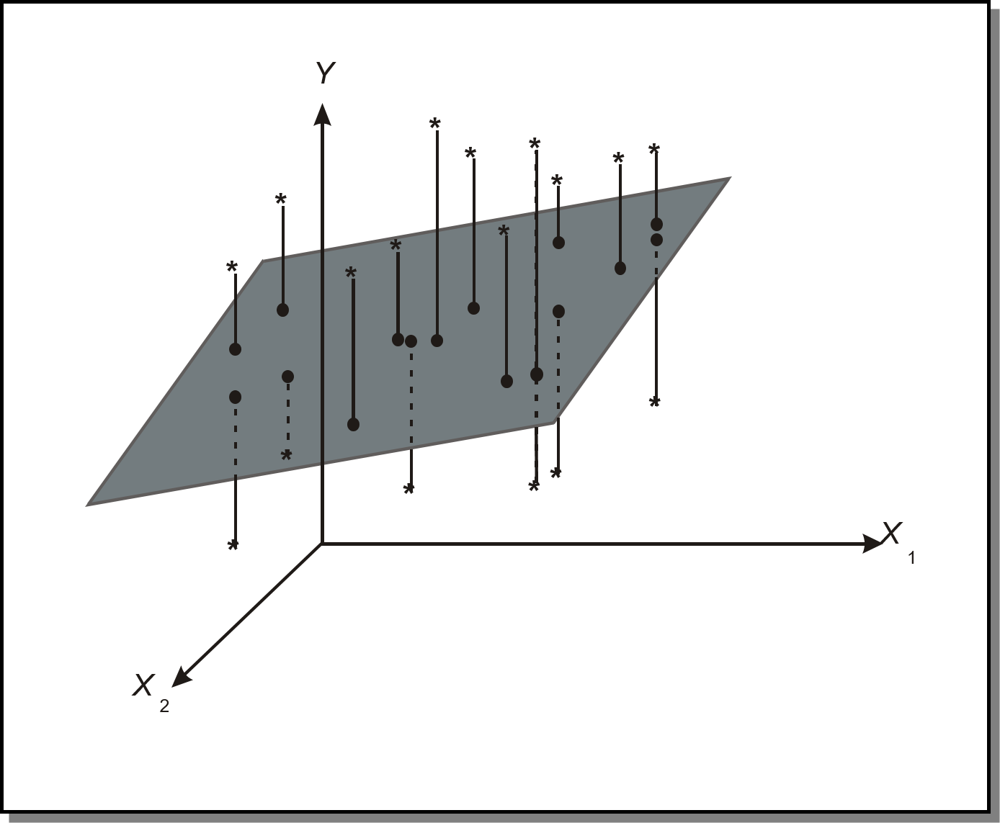
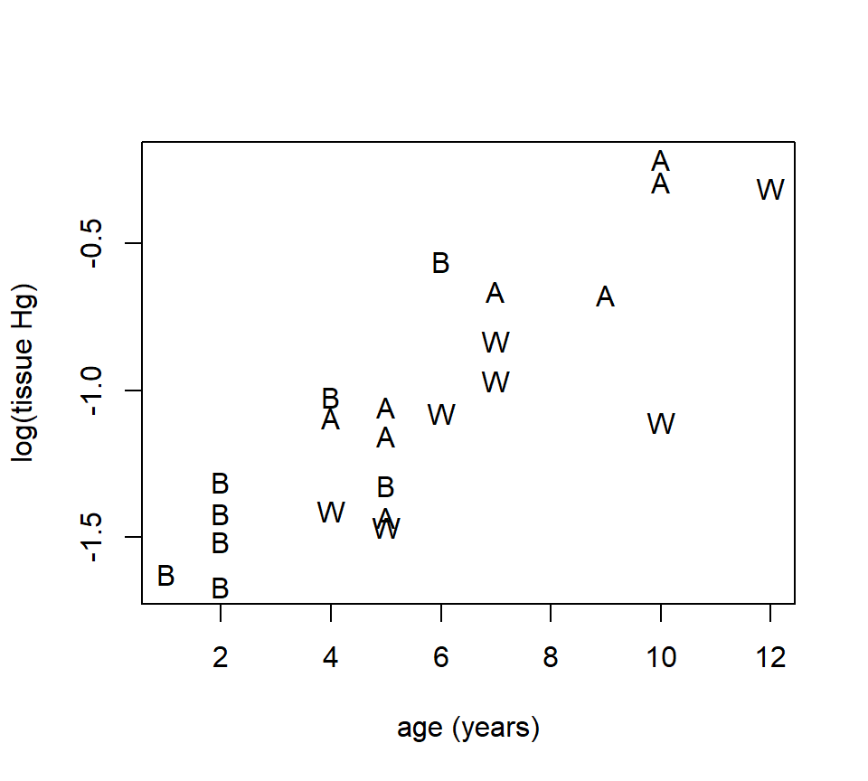
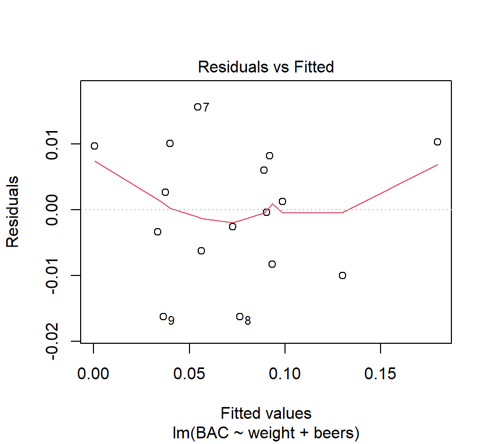
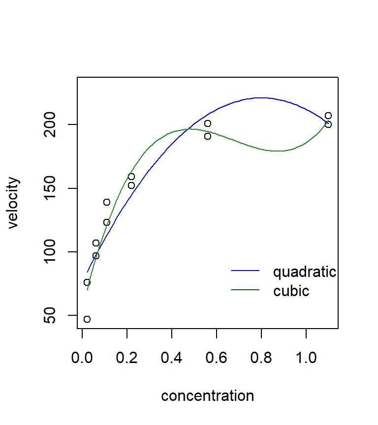

# Multiple regression


## Multiple regression for associating multiple predictor variables with a single response

Just as SLR was used to characterize the relationship between a single predictor and a response, multiple regression can be used to characterize the relationship between several predictors and a response.

*Example.*  In the BAC data, we also know each individual's weight and gender:

```r
beer <- read.csv("data/beer2.csv", head = T, stringsAsFactors = T)
head(beer)
```

```
##     BAC weight gender beers
## 1 0.100    132 female     5
## 2 0.030    128 female     2
## 3 0.190    110 female     9
## 4 0.120    192   male     8
## 5 0.040    172   male     3
## 6 0.095    250 female     7
```
A plot of the residuals from the BAC vs. beers consumed model against weight strongly suggests that some of the variation in BAC is attributable to differences in weight:

```r
fm1 <- with(beer, lm(BAC ~ beers))
plot(x = beer$weight, y = resid(fm1), xlab = "weight", ylab = "residual")
abline(h = 0, lty = "dotted")
```

<div class="figure" style="text-align: center">

<p class="caption">(\#fig:unnamed-chunk-3)SLR residuals vs. weight.</p>
</div>

To simultaneously characterize the effect that the variables "beers" and "weight" have on BAC, we might want to entertain a model with both predictors.  In words, the model is
\[
\mbox{BAC} = \mbox{intercept} + \mbox{(parameter associated with beers)} \times \mbox{beers}  + \mbox{(parameter associated with weight)} \times \mbox{weight} + \mbox{error}
\]
where (for the moment)  we are intentionally vague about what we mean by "parameter associated with beers".  As in SLR, the error term can be interpreted as a catch-all term that includes all the variation not accounted for by the predictors  "beers" and "weight".

In mathematical notation, we can write the model as
\[
y_i = \beta_0 +\beta_1 x_{1i} +\beta_2 x_{2i} +\epsilon_i 
\] 
Note that to distinguish individual observations, we require a double subscripting of the $x$'s, with the first subscript is used to distinguish different predictors and the second subscript is used to distinguish individual observations.  For example, $x_{2i}$ is the value of the second predictor for the $i$th observation. 

There are a variety of ways to think about this model.  As in SLR, we can separate this model into a mean or signal component $\beta_0 +\beta_1 x_1 +\beta_2 x_2$ and an error component $\epsilon_i$.  Note that the mean component is now a function of two variables, and suggests that the relationship between the average response and either predictor is linear.  If we wish to make statistical inferences about the parameters $\beta_0$, $\beta_1$ and $\beta_2$ (which we do), then we need to place the standard assumptions on the error component: independence, constant variance, and normality.  In notation, $\epsilon_i \sim \mathcal{N}\left(0,\sigma_{\epsilon}^2 \right)$.

We can also think about this model geometrically.  Recall that in SLR, we could interpret the SLR model as a line passing through a cloud of data points.  With 2 predictors, we are now fitting a plane to data points that "exist" in a three- dimensional data cloud. 

As in SLR, we use the least squares criteria to find the best-fitting parameter estimates.  That is to say, we will agree that the best estimates of the parameters $\beta_0$, $\beta_1$ and $\beta_2$ are the values that minimize
\begin{eqnarray*}
SSE & = & \sum_{i=1}^n e_i^2 \\
 & = & \sum_{i=1}^n \left(y_i -\hat{y}_i \right)^2 \\
 & = & \sum_{i=1}^n\left(y_i -\left[\hat{\beta}_0 +\hat{\beta}_1 x_{1i} +\hat{\beta}_{2} x_{2i} \right]\right)^2  
\end{eqnarray*}
In R, we can fit this model by adding a new term to the right-hand side of the model formula in the call to the function 'lm':

```r
fm2 <- lm(BAC ~ beers + weight, data = beer)
summary(fm2)
```

```
## 
## Call:
## lm(formula = BAC ~ beers + weight, data = beer)
## 
## Residuals:
##        Min         1Q     Median         3Q        Max 
## -0.0162968 -0.0067796  0.0003985  0.0085287  0.0155621 
## 
## Coefficients:
##               Estimate Std. Error t value Pr(>|t|)    
## (Intercept)  3.986e-02  1.043e-02   3.821  0.00212 ** 
## beers        1.998e-02  1.263e-03  15.817 7.16e-10 ***
## weight      -3.628e-04  5.668e-05  -6.401 2.34e-05 ***
## ---
## Signif. codes:  0 '***' 0.001 '**' 0.01 '*' 0.05 '.' 0.1 ' ' 1
## 
## Residual standard error: 0.01041 on 13 degrees of freedom
## Multiple R-squared:  0.9518,	Adjusted R-squared:  0.9444 
## F-statistic: 128.3 on 2 and 13 DF,  p-value: 2.756e-09
```
Thus, we see that the LSEs are $\widehat{\beta}_0 = 0.040$, $\widehat{\beta}_1 = 0.020$, and $\widehat{\beta}_{2} = -0.00036$.

As in SLR, we can define the fitted value associated with the $i$th data point as $\hat{y}_i =\hat{\beta}_0 +\hat{\beta}_1 x_{1i} +\hat{\beta}_{2} x_{2i}$, and the residual associated with the $i$th data point as $e_i =y_i -\hat{y}_i$.

*Example.* Find the fitted value and residual for the first observation in the data set, a $x_2=132$ lb woman who drank $x_1=5$ beers and had a BAC of $y=0.1$.  Answer: $\hat{y}_1 =0.092$ and $e_1 =0.008$.

We can define the error sum of squares as $SSE=\sum_{i=1}^n e_i^2 = \sum_{i=1}^n \left(y_i -\hat{y}_i \right)^2$.   How many df are associated with the SSE?  In this model, there are $n-3$ df associated with the SSE, because there were 3 parameters that needed to be estimated in the mean component of the model.  As in SLR, we can estimate the error variance $\sigma_{\epsilon}^2$ with the MSE, although now we must be careful to divide by the appropriate df:
\[
s_\epsilon^2 = MSE = \frac{SSE}{n-3}.
\] 
For the model above, $s_\epsilon = 0.010$.

In general, the equation for an MLR model with any number of predictors can be written:  
\[
y_i =\beta_0 +\beta_1 x_{1i} +\beta_2 x_{2i} +\ldots +\beta_k x_{ki} +\epsilon_i 
\] 
The error term is subject to the standard assumptions of independence, constant variance, and normality.  We will use the notation that $k$ is the number of parameters that need to be estimated in the mean component of the model excluding the intercept.  (When counting parameters, some texts include the intercept, while others do not.  If you consult a text, check to make sure you know what definition is being used.)  The SSE will be associated with $n - (k + 1)$ df.  Thus, the estimate of $\sigma_{\epsilon}^2$ will be
\[
s_\epsilon^2 = MSE = \frac{SSE}{n-(k+1)}.
\] 

### Sums of squares decomposition and $R^2$.  
The sums-of-squares decomposition also carries over from SLR.  We still have ${\rm SS(Total)} = \sum_{i=1}^n \left(y_i -\bar{y}\right)^2$, ${\rm SS(Regression)} = \sum_{i=1}^n \left(\hat{y}_i -\bar{y}\right)^2$, and ${\rm SS(Total) = SS(Regression) + SSE}$.  Thus, we can define $R^2$ using the same formula:
\[
R^2 = \frac{{\rm SS(Regression)}}{{\rm SS(Total)}} = 1- \frac{{\rm SSE}}{{\rm SS(Total)}} 
\] 
We still interpret $R^2$ as a measure of the proportion of variability in the response that is explained by the regression model.  In the BAC example, $R^2=0.952$.

### Partial regression coefficients.
The $\widehat{\beta}$'s in a MLR model are called partial regression coefficients (or partial regression slopes).  Their interpretation is subtly different from SLR regression slopes.  Misinterpretation of partial regression coefficients is one of the most common sources of statistical confusion in the scientific literature.

We can interpret the partial regression coefficients geometrically.  In this interpretation, $\beta_j$ is the slope of the regression plane in the direction of the predictor $x_j$.  Imagine taking a "slice" of the regression plane.  In the terminology of calculus, $\beta_j$ is also the partial derivative of the regression plane with respect to the predictor $x_j $ (hence the term "partial regression coefficient").

Verbal interpretation:  The partial regression coefficient $\beta_j$ associated with the predictor $x_j$ is the slope of the linear association between $y$ and $x_j$ \textit{while accounting for the (linear) effects of the other predictors in the model}.  Other ways to express this same idea include that $\beta_j$ is the quantifies the linear effect of predictor $j$ while holding the other predictors constant, or while controlling for the effects of the other predictors. This is different from an SLR slope, which we can interpret as the slope of the linear association between $y$ and $x_j$ while ignoring all other predictors.  Thus, the value of a multiple regression coefficient \textit{depends on the other predictors included in the model}.

Compare the estimated regression coefficients for the number of beers consumed in the SLR model and the MLR model that includes weight.

* Estimated SLR coefficient for no. of beers consumed: 0.018
* Estimated MLR coefficient for no. of beers consumed: 0.020

The coefficients differ because they estimate different parameters that mean different things.  The SLR coefficient estimates a slope that does not account for the effect of weight, while the MLR coefficient estimates a slope that does account for the effect of weight.

*Another example*.  As cheese ages, various chemical processes take place that determine the taste of the final product.  These data are from the @moore1989introduction.  We will call these the cheese data.  The response variable is the taste scores averaged from several tasters.  There are three predictors that describe the chemical content of the cheese.  They are:

* acetic: the natural log of acetic acid concentration
* h2s: the natural log of hydrogen sulfide concentration
* lactic: the concentration of lactic acid

Here is a "pairs plot" of the data.  In this plot, each panel is a scatterplot showing the relationship between two of the four variables in the model.  Pairs plots are useful ways to gain a quick grasp of the structure in the data and how the constituent variables are related to one another.

```r
cheese <- read.table("data/cheese.txt", head = T, stringsAsFactors = T)
pairs(cheese)
```


Let's entertain a model that uses all three predictors.  

```r
fm1 <- lm(taste ~ Acetic + H2S + Lactic, data = cheese)
summary(fm1)
```

```
## 
## Call:
## lm(formula = taste ~ Acetic + H2S + Lactic, data = cheese)
## 
## Residuals:
##     Min      1Q  Median      3Q     Max 
## -17.390  -6.612  -1.009   4.908  25.449 
## 
## Coefficients:
##             Estimate Std. Error t value Pr(>|t|)   
## (Intercept) -28.8768    19.7354  -1.463  0.15540   
## Acetic        0.3277     4.4598   0.073  0.94198   
## H2S           3.9118     1.2484   3.133  0.00425 **
## Lactic       19.6705     8.6291   2.280  0.03108 * 
## ---
## Signif. codes:  0 '***' 0.001 '**' 0.01 '*' 0.05 '.' 0.1 ' ' 1
## 
## Residual standard error: 10.13 on 26 degrees of freedom
## Multiple R-squared:  0.6518,	Adjusted R-squared:  0.6116 
## F-statistic: 16.22 on 3 and 26 DF,  p-value: 3.81e-06
```

Compare this MLR model with each of the three possible SLR models:

```r
slr1 <- lm(taste ~ Acetic, data = cheese)
summary(slr1)
```

```
## 
## Call:
## lm(formula = taste ~ Acetic, data = cheese)
## 
## Residuals:
##     Min      1Q  Median      3Q     Max 
## -29.642  -7.443   2.082   6.597  26.581 
## 
## Coefficients:
##             Estimate Std. Error t value Pr(>|t|)   
## (Intercept)  -61.499     24.846  -2.475  0.01964 * 
## Acetic        15.648      4.496   3.481  0.00166 **
## ---
## Signif. codes:  0 '***' 0.001 '**' 0.01 '*' 0.05 '.' 0.1 ' ' 1
## 
## Residual standard error: 13.82 on 28 degrees of freedom
## Multiple R-squared:  0.302,	Adjusted R-squared:  0.2771 
## F-statistic: 12.11 on 1 and 28 DF,  p-value: 0.001658
```

```r
slr2 <- lm(taste ~ H2S, data = cheese)
summary(slr2)
```

```
## 
## Call:
## lm(formula = taste ~ H2S, data = cheese)
## 
## Residuals:
##     Min      1Q  Median      3Q     Max 
## -15.426  -7.611  -3.491   6.420  25.687 
## 
## Coefficients:
##             Estimate Std. Error t value Pr(>|t|)    
## (Intercept)  -9.7868     5.9579  -1.643    0.112    
## H2S           5.7761     0.9458   6.107 1.37e-06 ***
## ---
## Signif. codes:  0 '***' 0.001 '**' 0.01 '*' 0.05 '.' 0.1 ' ' 1
## 
## Residual standard error: 10.83 on 28 degrees of freedom
## Multiple R-squared:  0.5712,	Adjusted R-squared:  0.5558 
## F-statistic: 37.29 on 1 and 28 DF,  p-value: 1.374e-06
```

```r
slr3 <- lm(taste ~ Lactic, data = cheese)
summary(slr3)
```

```
## 
## Call:
## lm(formula = taste ~ Lactic, data = cheese)
## 
## Residuals:
##      Min       1Q   Median       3Q      Max 
## -19.9439  -8.6839  -0.1095   8.9998  27.4245 
## 
## Coefficients:
##             Estimate Std. Error t value Pr(>|t|)    
## (Intercept)  -29.859     10.582  -2.822  0.00869 ** 
## Lactic        37.720      7.186   5.249 1.41e-05 ***
## ---
## Signif. codes:  0 '***' 0.001 '**' 0.01 '*' 0.05 '.' 0.1 ' ' 1
## 
## Residual standard error: 11.75 on 28 degrees of freedom
## Multiple R-squared:  0.4959,	Adjusted R-squared:  0.4779 
## F-statistic: 27.55 on 1 and 28 DF,  p-value: 1.405e-05
```

What do you make of the fact that an SLR analysis suggests that there is a (statistically significant) positive relationship between acetic acid concentration and taste, yet the partial regression coefficient associated with acetic acid concentration is not statistically significant in the MLR model?

## Statistical inference for partial regression coefficients

Statistical inference for partial regression coefficients proceeds in the same way as statistical inference for SLR slopes.  Standard errors for both partial regression coefficients are provided in the R output: $s_{\widehat{\beta}_1 }$= 0.0013, $s_{\widehat{\beta}_{2} }$= 0.000057.  Under the standard regression assumptions, the quantity $t=(\hat{\beta}_i -\beta _i )/s_{\hat{\beta}_i }$ has a $t$-distribution.  The number of degrees of freedom is the number of df associated with the SSE.  This fact can be used to construct confidence intervals and hypothesis tests.

*Example* Form a 99\% CI for $\beta_2$, the partial regression coefficient associated with weight.  First we find the critical value in R:

```r
qt(.005, df = 13, lower = FALSE)
```

```
## [1] 3.012276
```
Solution: (-0.00053, -0.00019)

*Example* Test $H_0$: $\beta_2 =0$ vs. H$_{a}$: $\beta_2 \ne 0$ at the $\alpha$=5\% significance level.

Solution: $t_{13} =-6.40$, $p$ = 0.000023, reject $H_0$: $\beta_2 =0$ in favor of $H_a$: $\beta_2 \ne 0$ at the $\alpha$=5\% significance level. 

If we were reporting this analysis in scientific writing, we might state that after accounting for the effect of the number of beers consumed, BAC decreases 3.6 $\times$ 10$^{-4}$ (s.e. 5.7 $\times$ 10$^{-5}$) for every 1-lb increase in weight ($t_{13} =-6.40$, $p < .001$).

In MLR, hypothesis tests of the form $H_0$: $\beta_i =0$ vs. $H_a$: $\beta_i \ne 0$ are almost always interesting (and are easy for a computer to calculate).  Therefore, most computer packages provide them automatically.  Most scientists interpret these tests as a measure of whether or not the associated predictor has a statistically significant (linear) association with the response after accounting for the (linear) effects of the other predictors in the model.  For example, in the BAC model, we might conclude that both (a) the number of beers consumed has a statistically significant association with BAC after accounting for the effect of weight, and (b) weight has a statistically significant association with BAC after accounting for the effect of the number of beers consumed.

### Prediction

As in SLR, we distinguish between predictions of the average response of the population at a new value of the predictors vs.\ the value of a single future observation.  The point estimates of the two predictions are identical, but the value of a single future observation is more uncertain.  Therefore, we use a prediction interval for a single observation and a confidence interval for a population average.  The width of a PI or CI is affected by the same factors as in SLR.  In MLR, the width of the PI or CI depends on the distance between the new observation and the "center of mass" of the predictors in the data set.  For example, if we now use the BAC model to predict the BAC of a 170-lb individual who consumes 4 beers:


```r
new.data <- data.frame(weight = 170, beers = 4)
predict(fm2, newdata = new.data, interval = "prediction")
```

```
##          fit        lwr        upr
## 1 0.05808664 0.03480226 0.08137103
```

```r
predict(fm2, newdata = new.data, interval = "confidence")
```

```
##          fit        lwr        upr
## 1 0.05808664 0.05205732 0.06411596
```

## Indicator variables

So far, we have dealt exclusively with numeric (quantitative) predictors.  Although we haven't given it much thought, a key feature of quantitative predictors is that their values can be ordered, and that the distance between ordered values is meaningful.  For example, in the BAC data, a predictor value of $x=3$ beers consumed is greater than $x=2$ beers consumed.  Moreover, the difference between $x=2$  and $x=3$ beers consumed is exactly one-half of the distance between $x=2$ and $x=4$ beers consumed. Another way to think about quantitative predictors is that we could sensibly place all of their values on a number line.

**Categorical variables** are variables that cannot be sensibly placed on a number line.  Examples include gender, ethnicity, or brand of manufacture.  We use **indicator variables** as devices to include categorical variables as predictors in regression models.  

*Constructing indicator variables.* Choose one level of the categorical variable as the reference level.  Sometimes, the scientific context of a problem will suggest that one level should serve as the reference level.  Oftentimes, though, the choice of the reference level is arbitrary.  In all cases, the choice of the reference level will have no effect on the ensuing analysis.  For every other level, create a separate indicator variable that is equal to 1 for that level, and is equal to 0 for all levels.  Thus, to include a categorical variable with $c$ levels, we need $c - 1$ indicator variables.

If R recognizes that a variable is categorical, it will construct indicators on its own.  However, it takes a little detective work to find out what the reference level is.  For example, in the BAC data, there is a separate variable called 'gender' that takes the values 'male' and 'female'.  If we tried the model


```r
fm3 <- lm(BAC ~ beers + weight + gender, data = beer)
summary(fm3)
```

```
## 
## Call:
## lm(formula = BAC ~ beers + weight + gender, data = beer)
## 
## Residuals:
##       Min        1Q    Median        3Q       Max 
## -0.018125 -0.005713  0.001501  0.007896  0.014655 
## 
## Coefficients:
##               Estimate Std. Error t value Pr(>|t|)    
## (Intercept)  3.871e-02  1.097e-02   3.528 0.004164 ** 
## beers        1.990e-02  1.309e-03  15.196 3.35e-09 ***
## weight      -3.444e-04  6.842e-05  -5.034 0.000292 ***
## gendermale  -3.240e-03  6.286e-03  -0.515 0.615584    
## ---
## Signif. codes:  0 '***' 0.001 '**' 0.01 '*' 0.05 '.' 0.1 ' ' 1
## 
## Residual standard error: 0.01072 on 12 degrees of freedom
## Multiple R-squared:  0.9528,	Adjusted R-squared:  0.941 
## F-statistic: 80.81 on 3 and 12 DF,  p-value: 3.162e-08
```
To determine how to interpret the sign of the estimated coefficient for 'gendermale', we need to know what level R chose as the reference.  To find out, we need to use the contrasts function:

```r
contrasts(beer$gender)
```

```
##        male
## female    0
## male      1
```
This tell us that the model is
\[
y=\beta_0 +\beta_1 x_1 +\beta_2 x_2 + \beta_3 x_3 +\epsilon 
\] 
where 
\[
x_3 =\left\{\begin{array}{cc} {1} & {{\rm male}} \\ {0} & {{\rm female}} \end{array}\right. 
\] 
Thus the regression coefficient $\beta_3$ quantifies the difference in BAC for men vs. women after controlling for the effects of the number of beers consumed and weight.

Interpretation: If we consider a man and a woman, both of whom weigh the same and have consumed the same number of beers, then the model estimates that the man's BAC will be 0.0032 lower.  However, this effect is not statistically significant.  That is, the data are consistent with the null hypothesis that the true size of the effect of gender is 0 ($p=0.62$).  Consequently, after controlling for the effects of beers consumed and weight on BAC, there is no evidence for a further effect of gender on BAC.

<!-- *Example*  Here is an example of a data set that includes a categorical predictor variable with more than two levels.   The data set *cars* contains the following observations for 140 vehicles, all manufactured in 1999: -->

<!-- * displacement: a measure of volume -->
<!-- * hp: horsepower -->
<!-- * drive: a categorical variable with 3 levels: "4-wheel", "front", and "rear" -->
<!-- * weight: weight of the vehicle  -->
<!-- * mpgcity: fuel efficiency (miles per gallon) in the city -->
<!-- * mpghw: fuel efficiency (miles per gallon) on the highway -->

<!-- Here is an R summary of the data: -->

<!-- ```{r} -->
<!-- cars <- read.table("data/cars.txt", head = T, stringsAsFactors = T) -->
<!-- summary(cars) -->
<!-- ``` -->

## The MLR model in matrix notation

Here are the first few rows of the design matrix for the BAC regression that includes beers consumed and weight as the two predictors:
\[
\X=\left[\begin{array}{ccc} {1} & {5} & {132} \\ {1} & {2} & {128} \\ {1} & {9} & {110} \\ {1} & {8} & {192} \\ {\vdots } & {\vdots } & {\vdots } \end{array}\right]
\] 

We can use the standard equation $\vecbhat=\left(\X'\X\right)^{-1} \X'\vecy$ to find the least-squares estimates of the regression parameters. 

Note that the order of the columns in the design matrix is arbitrary.  We could also have written the design matrix as 
\[
\X = \left[\begin{array}{ccc} {1} & {132} & {5} \\ {1} & {128} & {2} \\ {1} & {110} & {9} \\ {1} & {192} & {8} \\ {\vdots } & {\vdots } & {\vdots } \end{array}\right]
\] 

The only difference this would make is that it changes the order in which the estimated partial regression coefficients appear in the vector $\vecbhat$.

Recall that some design matrices are pathological, in the sense that the matrix inverse $\left(\X'\X\right)^{-1}$ does not exist.  In MLR, you are more likely to encounter these pathological matrices.  Here are two separate examples in which such a matrix might be encountered:

*Example*. You are studying the effect of temperature on weight gain in fish, and measure temperature in both degrees Fahrenheit and Centigrade.  (Recall that one can convert between Fahrenheit and Centigrade by the equation F = (9/5) C + 32.)  The design matrix is
\[
\X=\left[\begin{array}{ccc} {1} & {5} & {41} \\ {1} & {10} & {50} \\ {1} & {15} & {59} \\ {1} & {20} & {68} \end{array}\right]
\] 
where the predictor in the 2$^{nd}$ column is degrees Centigrade and the predictor in the 3$^{rd}$ column is degrees Fahrenheit.

*Example 2*  With the beer data, suppose we created indicator variables for both males and females, and entertained the model:
\[
y_i =\beta_0 +\beta_1 x_{1i} +\beta_2 x_{2i} +\beta_3 x_{3i} +\epsilon_i 
\] 
where $x_1$ is the number of beers consumed,  $x_2$ is an indicator variable for "male" and $x_3$ is an indicator variable for "female":
\[
x_2 =\left\{\begin{array}{cc} {1} & {{\rm male}} \\ {0} & {{\rm female}} \end{array}\right.
\]
\[
x_3 =\left\{\begin{array}{cc} {0} & {{\rm male}} \\ {1} & {{\rm female}} \end{array}\right.
\] 
For the sake of illustration, suppose we were fitting this model to just the first 5 data points in the data set.  The design matrix would be
\[
\X=\left[\begin{array}{cccc} {1} & {5} & {0} & {1} \\ {1} & {2} & {0} & {1} \\ {1} & {9} & {0} & {1} \\ {1} & {8} & {1} & {0} \\ {1} & {3} & {1} & {0} \end{array}\right]
\] 
In both of these examples, it is impossible to fit the regression model because the matrix  $\left(\X'\X\right)^{-1}$ does not exist. 

<!-- Here is an example of what happens if we tried to fit the temperature model to a made-up data set: -->
<!-- \renewcommand{\baselinestretch}{1} -->
<!-- \begin{verbatim} -->
<!-- > fm1 <- lm(y ~ tempF + tempC, data = silly) -->
<!-- > summary(fm1) -->

<!-- Coefficients: (1 not defined because of singularities) -->

<!-- Estimate Std. Error t value Pr(>|t|) -->
<!-- (Intercept) -50.1667    10.1064  -4.964    0.127 -->
<!-- tempF         0.7500     0.1443   5.196    0.121 -->
<!-- tempC             NA         NA      NA       NA -->
<!-- \end{verbatim} -->
<!-- \renewcommand{\baselinestretch}{1.5} -->

What is the common feature of these design matrices that allows us to determine whether or not $\left(\X'\X\right)^{-1}$ exists?  In mathematical terms, we say that each matrix contains a \textit{linear dependency}.  Let's write each column of the design matrix as the vector $\vecx$, i.e., for the temperature example above, 
\[
x_0 =\left[\begin{array}{c} {1} \\ {1} \\ {1} \\ {1} \end{array}\right],x_1 =\left[\begin{array}{c} {5} \\ {10} \\ {15} \\ {20} \end{array}\right],x_2 =\left[\begin{array}{c} {41} \\ {50} \\ {59} \\ {68} \end{array}\right]
\] 
A design matrix with $k+1$ columns has a linear dependency if and only if there exist a set of constants $\lambda_0 ,\lambda_1 ,\lambda_2 ,\ldots ,\lambda_k $ such that 
\[
\lambda_0 x_0 +\lambda_1 x_1 +...+\lambda_k x_k =\left[\begin{array}{c} {0} \\ {0} \\ {\vdots } \\ {0} \end{array}\right]
\] 
and at least one of the $\lambda$'s is $\ne 0$.  Thus, the temperature example has a linear dependency because
\[
-32\left[\begin{array}{c} {1} \\ {1} \\ {1} \\ {1} \end{array}\right]-\frac{9}{5} \left[\begin{array}{c} {5} \\ {10} \\ {15} \\ {20} \end{array}\right]+\left[\begin{array}{c} {41} \\ {50} \\ {59} \\ {68} \end{array}\right]=\left[\begin{array}{c} {0} \\ {0} \\ {0} \\ {0} \end{array}\right].
\] 
Now the logic for constructing $c-1$ indicator variables to represent a categorical variable with $c$ different levels is clear.  If we tried to create a separate indicator for every level of a categorical variable, then the $c$ columns of the design matrix representing those indicators would add together to produce a column of 1's.  Because every design matrix must already contain a column of 1's to correspond to the intercept, including $c$ separate indicators would produce a design matrix that contained a linear dependency among its columns.  

## Interactions between predictors

Consider (again) the BAC data, with our working model
\[
y_i =\beta_0 +\beta_1 x_{1i} +\beta_2 x_{2i} +\epsilon_i 
\] 
where $y$ is the response (BAC), $x_1$ is beers consumed, $x_2$ is weight, and $\epsilon$ is iid normal error.  This model assumes that there is no "interaction" between the number of beers consumed and weight, in the sense that the association between beers consumed and BAC the same for everyone regardless of weight, and the association between weight and BAC is the same for everyone regardless of how many beers the person has consumed.  In other words, the model above assumes that the effect of beers consumed on BAC does not depend on weight, and the effect of weight on BAC does not depend on the number of beers consumed.  We might call this model an *additive* model, because the effects of beers consumed and weight on BAC add together in the mean or signal component of the model.  (Note that a statistical interaction has nothing to do with whether there is an association between beers consumed and weight.)

An *interaction term* between the two predictors would allow the effect of beers consumed to depend on weight, and vice versa.  A model with an interaction can be written as:
\[
y_i =\beta_0 +\beta_1 x_{1i} +\beta_2 x_{2i} +\beta_3 x_{1i} x_{2i} +\epsilon_i 
\] 
There are two equally good ways to code this model in R:

```r
fm1 <- lm(BAC ~ beers + weight + beers:weight, data = beer)
```
or

```r
fm2 <- lm(BAC ~ beers * weight, data = beer)
```
In the first notation, the colon (:) tells R to include the interaction between the predictors that appear on either side of the colon.  In the second notation, the asterisk (*) is shorthand for both the individual predictors and their interaction.  

```r
summary(fm2)
```

```
## 
## Call:
## lm(formula = BAC ~ beers * weight, data = beer)
## 
## Residuals:
##        Min         1Q     Median         3Q        Max 
## -0.0169998 -0.0070909  0.0008463  0.0084267  0.0164373 
## 
## Coefficients:
##                Estimate Std. Error t value Pr(>|t|)   
## (Intercept)   3.010e-02  3.495e-02   0.861  0.40601   
## beers         2.162e-02  5.760e-03   3.754  0.00275 **
## weight       -2.993e-04  2.241e-04  -1.336  0.20646   
## beers:weight -1.066e-05  3.627e-05  -0.294  0.77393   
## ---
## Signif. codes:  0 '***' 0.001 '**' 0.01 '*' 0.05 '.' 0.1 ' ' 1
## 
## Residual standard error: 0.0108 on 12 degrees of freedom
## Multiple R-squared:  0.9521,	Adjusted R-squared:  0.9402 
## F-statistic: 79.57 on 3 and 12 DF,  p-value: 3.453e-08
```

*Interpreting the interaction*.  The partial regression coefficient associated with an interaction between two predictors (call them "A" and "B") quantifies the effect that predictor A has on the linear association between predictor B and the response.  Or, equivalently, the same partial regression coefficient quantifies the effect that predictor B has on the linear association between predictor A and the response. (It may not be obvious right away that the same regression coefficient permits both interpretations, but you might be able to convince yourself that this is true by doing some algebra with the regression model.)  Thus, if we reject the null hypothesis that a partial regression coefficient associated with an interaction equals zero, then we conclude that the effects of the two predictors depend on one another.  With the BAC data, the interaction term is not statistically significant.  Thus, these data provide no evidence that the effect of beers consumed on BAC depends on weight, or vice versa.  In other words, there is no evidence of an interaction between the effects of beer consumption and weight on BAC.

For the sake of argument, let's set aside for the moment the fact that the interaction between beers consumed and weight is not statistically significant.  How can we interpret the value $\hat{\beta}_3 = -1.07 \times 10^{-5}$?  This value tells us how the association between beers consumed and BAC changes as weight changes.  In other words, the model predicts that a heavier person's BAC will increase less for each additional beer consumed, compared to a lighter person.  How much less?  If the heavier person weighs 1 lb more than the lighter person, then one additional beer will increase the heavier person's BAC by $1.07 \times 10^{-5}$ less than it increases the lighter person's BAC.  This agrees with our expectations, but these data do not provide enough evidence to declare that this interaction is statistically significant.  Alternatively, $\beta_3$ also tells us how the association between weight and BAC changes as the number of beers consumed changes.  That is, as the number of beers consumed increases, then the association between weight and BAC becomes more steeply negative.  Again, this coincides with our expectation, despite the lack of statistical significance.

*Interpreting partial regression coefficients in the presence of an interaction.*  In the presence of an interaction, the partial regression coefficients associated with individual predictors are often called the "main effects" of those predictors.  When an interaction is present, the interpretation of these main effects is subtle.  In this case, the partial regression coefficient associated with the individual predictor quantifies the relationship between the predictor and the response when the other predictor involved in the interaction equals 0.   Sometimes this interpretation is scientifically meaningful, but usually it isn't.

For example, in the BAC model that includes the interaction above, the parameter $\beta_1$ now quantifies the association between beers consumed and BAC for people who weigh 0 lbs.  Obviously, this is a meaningless quantity.  Alternatively, the parameter $\beta_2$ quantifies the association between weight and BAC for people who have consumed 0 beers.  This is a bit less ridiculous --- in fact, it makes a lot of sense --- but still requires extrapolating the model fit outside the range of the observed data, because there are no data points here for people who have had 0 beers.^[To take this argument a little further, we don't expect an association between weight and BAC for people who have not drunk any beers.  Thus, it is perhaps not surprising that we cannot reject $H_0: \beta_2 = 0$ in favor of $H_0: \beta_2 \ne 0$ in the model that includes the interaction between weight and beers consumed.]

To summarize, the subtlety here is that if we compare the additive model
\[
y =\beta_0 +\beta_1 x_1 +\beta_2 x_2 +\epsilon
\] 
with the model that includes an interaction
\[
y =\beta_0 +\beta_1 x_1 +\beta_2 x_2 +\beta_3 x_1 x_2 +\epsilon, 
\] 
the parameters $\beta_1$ and $\beta_2$ have *completely different meanings* in these two models.  In other words, adding an interaction between two predictors changes the meaning of the regression coefficient associated with the individual predictors involved in the interaction.  This is a subtlety that routinely confuses even top investigators.  It's a hard point to grasp, but essential for interpreting models that include interactions correctly.

A useful technique for easing the interpretation of partial regression coefficients in a model that includes an interaction is to "center" the predictors by subtracting off their means.  For the BAC data, we could create centered versions of the two predictors by:
\[
\begin{array}{l} {x_1^{c} =x_1 -\bar{x}_1 } \\ {x_2^{c} =x_2 -\bar{x}_{2} } \end{array}
\] 
We then fit the model with the interaction, using the centered predictors instead:

```r
beer$beers.c <- beer$beers - mean(beer$beers)
beer$weight.c <- beer$weight - mean(beer$weight)
head(beer)
```

```
##     BAC weight gender beers beers.c weight.c
## 1 0.100    132 female     5  0.1875 -39.5625
## 2 0.030    128 female     2 -2.8125 -43.5625
## 3 0.190    110 female     9  4.1875 -61.5625
## 4 0.120    192   male     8  3.1875  20.4375
## 5 0.040    172   male     3 -1.8125   0.4375
## 6 0.095    250 female     7  2.1875  78.4375
```

```r
fm3 <- lm(BAC ~ beers.c * weight.c, data = beer)
summary(fm3)
```

```
## 
## Call:
## lm(formula = BAC ~ beers.c * weight.c, data = beer)
## 
## Residuals:
##        Min         1Q     Median         3Q        Max 
## -0.0169998 -0.0070909  0.0008463  0.0084267  0.0164373 
## 
## Coefficients:
##                    Estimate Std. Error t value Pr(>|t|)    
## (Intercept)       7.402e-02  2.849e-03  25.984 6.45e-12 ***
## beers.c           1.980e-02  1.447e-03  13.685 1.10e-08 ***
## weight.c         -3.506e-04  7.206e-05  -4.865 0.000388 ***
## beers.c:weight.c -1.066e-05  3.627e-05  -0.294 0.773927    
## ---
## Signif. codes:  0 '***' 0.001 '**' 0.01 '*' 0.05 '.' 0.1 ' ' 1
## 
## Residual standard error: 0.0108 on 12 degrees of freedom
## Multiple R-squared:  0.9521,	Adjusted R-squared:  0.9402 
## F-statistic: 79.57 on 3 and 12 DF,  p-value: 3.453e-08
```
Note that centering the predictors does not change the estimated interaction or its statistical significance.  The main advantage of centering the predictors is that the partial regression coefficients associated with the centered versions of the predictors have a nice interpretation.  Now, the partial regression coefficients associated with the main effects quantify the relationship between the predictor and the response when the other predictor involved in the interaction equals its average value.   

Perhaps there is an interaction between gender and the number of beers consumed, with respect to their effect on BAC.^[Of course, we haven't yet found a statistically significant difference between the BAC of men vs.\ women in these data, but it is still edifying to work through this model.]   We test for such an association by including an interaction between the indicator for `male' and the number of beers consumed.  The model equation is:
\[
y=\beta_0 +\beta_1 x_1 +\beta_2 x_2 +\beta_3 x_3 + \beta_4 x_1 x_3 +\epsilon 
\] 
Compare this model for males:
\[
y=\left(\beta_0 +\beta_3 \right)+\left(\beta_1 +\beta_4 \right)x_1 +\beta_2 x_2 +\epsilon 
\] 
and females:
\[
y=\beta_0 +\beta_1 x_1 +\beta_2 x_2 +\epsilon 
\] 
Thus, we see that the coefficient $\beta_4$ will quantify how the relationship between beers consumed and BAC differs for men vs.\ women (after accounting for the effect of weight).  We fit the model in R:

```r
fm4 <- lm(BAC ~ beers + weight + gender + beers:gender, data = beer)
summary(fm4)
```

```
## 
## Call:
## lm(formula = BAC ~ beers + weight + gender + beers:gender, data = beer)
## 
## Residuals:
##        Min         1Q     Median         3Q        Max 
## -0.0152421 -0.0032845  0.0006456  0.0043247  0.0181410 
## 
## Coefficients:
##                    Estimate Std. Error t value Pr(>|t|)    
## (Intercept)       2.820e-02  1.203e-02   2.345 0.038861 *  
## beers             2.173e-02  1.646e-03  13.201 4.34e-08 ***
## weight           -3.323e-04  6.426e-05  -5.171 0.000308 ***
## gendermale        1.518e-02  1.251e-02   1.213 0.250523    
## beers:gendermale -3.946e-03  2.368e-03  -1.666 0.123824    
## ---
## Signif. codes:  0 '***' 0.001 '**' 0.01 '*' 0.05 '.' 0.1 ' ' 1
## 
## Residual standard error: 0.01 on 11 degrees of freedom
## Multiple R-squared:  0.9623,	Adjusted R-squared:  0.9486 
## F-statistic: 70.28 on 4 and 11 DF,  p-value: 9.248e-08
```
(Note that we usually don't center indicator variables.)  Thus, we see that after controlling for the effect of weight, there is no evidence for an interaction between beers consumed and gender ($t_{11} =-1.67$, $p = 0.12$).  We could interpret this to mean that the relationship between beers consumed and BAC is the same for men and women, or to mean that the difference in BAC between men and women doesn't depend on the number of beers consumed.

<!-- Note: When we included the beer:gender interaction in the model, we also included the indicator male.id alone.  To not have done so would have constrained the model to have the same intercept for men and women, despite the fact that the slopes with respect to the number of beers consumed could have differed.  Such a constraint makes little sense.  This is an example of a general rule of thumb, which is:  If a model includes an interaction between two predictors, it must include each of the individual predictors as well. -->

<!-- %{\em Example:} Amanieu et al. (1989; {\em Oceanologica Acta} 12: 189-199) studied 20 sites in the Thau lagoon in southern France, and at each site measured concentrations of two types of bacteria and three environmental variables.  Here, we focus on the relationship between the concentration between one type of bacteria (`bna', as measured by the concentration of colonies grown on nutrient-rich agar) and two predictors: the total DNA production of all bacteria (`bact'), and the east-west position of the sites, as measured by a location variable `x'.  (Although it isn't entirely clear from the data, one would assume that more negative values of x correspond to more westerly locations, and more positive values of x correspond to more easterly locations.)  The first few records of the data set are: -->
<!-- % -->
<!-- %\renewcommand{\baselinestretch}{1} -->
<!-- %\begin{verbatim} -->
<!-- %    bna  bact     x -->
<!-- %    1 4.615 0.274 -8.75 -->
<!-- %    2 5.226 0.213 -6.75 -->
<!-- %    3 5.081 0.134 -5.75 -->
<!-- %    4 5.278 0.177 -5.75 -->
<!-- %    5 5.756 0.091 -3.75 -->
<!-- %    6 5.328 0.272 -2.75 -->
<!-- %    ... -->
<!-- %\end{verbatim} -->
<!-- %\renewcommand{\baselinestretch}{1.5} -->
<!-- %A model with both predictors and an interaction suggest that the effect of bacterial productivity on the response changes as one moves from west to east: -->
<!-- %\renewcommand{\baselinestretch}{1} -->
<!-- %\begin{verbatim} -->
<!-- %Coefficients: -->
<!-- % -->
<!-- %            Estimate Std. Error t value Pr(>|t|)     -->
<!-- %(Intercept)  5.94209    0.17113  34.723 9.56e-16 *** -->
<!-- %bact        -2.48767    0.57673  -4.313 0.000615 *** -->
<!-- %x           -0.01395    0.03768  -0.370 0.716323     -->
<!-- %bact:x       0.32766    0.13222   2.478 0.025583 *   -->
<!-- %\end{verbatim} -->
<!-- %\renewcommand{\baselinestretch}{1.5} -->

<!-- %% Add visualization here? -->

## Polynomial regression

The machinery of MLR can be used to model a non-linear relationship between a predictor and a response.  This is called *polynomial regression*.  A $k^{th}$ order polynomial regression model is
\[
y=\beta_0 +\beta_1 x+\beta_2 x^2 +\beta_3 x^{3} +\ldots +\beta_k x^{k} +\epsilon 
\] 
where the error term is subject to the standard regression assumptions.  In practice, the most commonly used models are quadratic ($k=2$) and cubic ($k=3$) polynomials.

Before proceeding, a historical note is worthwhile.  It used to be that polynomial regression was the only way to accommodate non-linear relationships in regression models.  In the present day, non-linear regression (see the later section in these notes) allows us to fit a much richer set of non-linear models to data.  However, in complex models (especially complex ANOVA models for designed experiments), there are still cases where it is easier to add a quadratic term to accommodate a non-linear association than it is to adopt the machinery of non-linear regression.  Thus, it is still worthwhile to know a little bit about polynomial regression, but don't shoehorn every non-linear association into a polynomial regression if an alternative non-linear model is more suitable.

*Example.* In the cars data, the relationship between highway mpg and vehicle weight is clearly non-linear:

```r
cars <- read.table("data/cars.txt", head = T, stringsAsFactors = T)
with(cars, plot(mpghw ~ weight, xlab = "Vehicle weight (lbs)", ylab = "Highway mpg"))
```


To fit a quadratic model, we could manually create a predictor equal to weight-squared.  Or, in R, we could create the weight-squared predictor within the call to "lm" by using the following syntax:

```r
quad <- lm(mpghw ~ weight + I(weight^2), data = cars)
summary(quad)
```

```
## 
## Call:
## lm(formula = mpghw ~ weight + I(weight^2), data = cars)
## 
## Residuals:
##      Min       1Q   Median       3Q      Max 
## -13.4386  -1.8216   0.1789   2.3617   7.5031 
## 
## Coefficients:
##               Estimate Std. Error t value Pr(>|t|)    
## (Intercept)  9.189e+01  6.332e+00  14.511  < 2e-16 ***
## weight      -2.293e-02  3.119e-03  -7.353 1.64e-11 ***
## I(weight^2)  1.848e-06  3.739e-07   4.942 2.24e-06 ***
## ---
## Signif. codes:  0 '***' 0.001 '**' 0.01 '*' 0.05 '.' 0.1 ' ' 1
## 
## Residual standard error: 3.454 on 136 degrees of freedom
## Multiple R-squared:  0.7634,	Adjusted R-squared:  0.7599 
## F-statistic: 219.4 on 2 and 136 DF,  p-value: < 2.2e-16
```
In the quadratic regression $y=\beta_0 +\beta_1 x+\beta_2 x^2 +\epsilon$, the test of $H_0$: $\beta_2=0$ vs.\ $H_a$: $\beta_2 \ne 0$ is tantamount to a test of whether the quadratic model provides a significantly better fit than the linear model.  I this case, we can conclusively reject $H_0$: $\beta_2=0$ in favor of $H_a$: $\beta_2 \ne 0$ , and thus conclude that the quadratic model provides a significantly better fit than the linear model.

However, in the context of the quadratic model, the test of $H_0$: $\beta_1=0$ vs.\ $H_a$: $\beta_1 \ne 0$ doesn't give us much useful information.  In the context of the quadratic model, the null hypothesis $H_0$: $\beta_1=0$  is equivalent to the model  $y=\beta_0 +\beta_2 x^2 +\epsilon$.  This is a strange model, and there is no reason why we should consider it.  Thus, we disregard the inference for $\beta_1$, and (by similar logic) we disregard the inference for $\beta_0$ as well.\footnote{Another way to think of this is that the quadratic term $x^2$ is tantamount to an interaction of $x$ with itself.  Thus, in the same way that including an interaction changes the interpretation of $\beta_1$ and $\beta_2$ in the model $y=\beta_0 +\beta_1 x_1 +\beta_2 x_2 +\beta_3 x_1 x_2 +\epsilon$, including a quadratic term changes the interpretation of $\beta_1$ in the model $y=\beta_0 +\beta_1 x +\beta_2 x^2 +\epsilon$.}

If a quadratic model is good, will the cubic model $y=\beta_0 +\beta_1 x+\beta_2 x^2 +\beta_3 x^{3} +\epsilon$ be even better? Let's see:

```r
cubic <- lm(mpghw ~ weight + I(weight^2) + I(weight^3), data = cars)
summary(cubic)
```

```
## 
## Call:
## lm(formula = mpghw ~ weight + I(weight^2) + I(weight^3), data = cars)
## 
## Residuals:
##     Min      1Q  Median      3Q     Max 
## -13.247  -1.759   0.281   2.411   7.225 
## 
## Coefficients:
##               Estimate Std. Error t value Pr(>|t|)    
## (Intercept)  1.164e+02  2.697e+01   4.318 3.03e-05 ***
## weight      -4.175e-02  2.033e-02  -2.054    0.042 *  
## I(weight^2)  6.504e-06  4.984e-06   1.305    0.194    
## I(weight^3) -3.715e-10  3.966e-10  -0.937    0.351    
## ---
## Signif. codes:  0 '***' 0.001 '**' 0.01 '*' 0.05 '.' 0.1 ' ' 1
## 
## Residual standard error: 3.456 on 135 degrees of freedom
## Multiple R-squared:  0.7649,	Adjusted R-squared:  0.7597 
## F-statistic: 146.4 on 3 and 135 DF,  p-value: < 2.2e-16
```

In the cubic model, the test of $H_0$: $\beta_3=0$ vs.\ $H_a$: $\beta_3 \ne 0$ is tantamount to a test of whether the cubic model provides a significantly better fit than the quadratic model.  The $p$-value associated with the cubic term suggests that the cubic model does not provide a statistically significant improvement in fit compared to the quadratic model.  

At this point, you might wonder if we are limited only to comparing models of adjacent orders, that is, quadratic vs. linear, cubic vs. quadratic, etc.  The answer is no --- we can, for example, test whether a cubic model provides a significantly better fit than a linear model. To do so, we would have to test $H_0$: $\beta_2 = \beta_3 = 0$ in the cubic model.  We can test this null hypothesis with an $F$-test, which we will learn how to do later.

Note that, even though as cubic model does not offer a significantly better fit than a quadratic model, we have not necessarily ruled out the possibility that a higher-order polynomial model might provide a significantly better fit.  However, higher-order polynomials (beyond a cubic) are typically difficult to justify on scientific grounds, and offend our sense of parsimony.  Plus, a plot of the quadratic model and the associated residuals suggest that a quadratic model captures the trend in the data well:

```r
with(cars, plot(mpghw ~ weight, xlab = "Vehicle weight (lbs)", ylab = "Highway mpg"))
  
quad <- with(cars, lm(mpghw ~ weight + I(weight^2)))
quad.coef <- as.vector(coefficients(quad))

quad.fit <- function(x) quad.coef[1] + quad.coef[2] * x + quad.coef[3] * x^2
  
curve(quad.fit, from = min(cars$weight), to = max(cars$weight), add = TRUE, col = "red")
```



```r
plot(x = fitted(quad), y = resid(quad), xlab = "Fitted values", ylab = "Residuals")
abline(h = 0, lty = "dashed")
```


Therefore, the quadratic model clearly provides the best low-order polynomial fit to these data.

Finally, it doesn't make sense to consider models that include higher-order terms without lower-order terms.  For example, we wouldn't usually consider a cubic model without an intercept, or a quadratic model without a linear term.  Geometrically, these models are constrained in particular ways.  If such a constraint makes sense scientifically, entertaining the model may be warranted, but this situation arises only rarely.  Thus, our strategy for fitting polynomial models is to choose the lowest-order model that provides a reasonable fit to the data, and whose highest-order term is statistically significant.

<!-- %[A word about terminology:  The term {\em linear} in MLR indicates that the mean component of the model is linear in the unknown model parameters (the $\beta$'s), not linear in the predictors.  The model  $y=\beta_0 +\beta_1 x+\beta_2 x^2 +\epsilon $ can be fit using MLR because the mean component $\beta_0 +\beta_1 x+\beta_2 x^2 $  is a linear function of its unknown parameters.  An example of a non-linear model that we wouldn't be able to estimate using MLR is $y=e^{\beta_1 x} +\epsilon $. ] -->

<!-- %## Variable selection in polynomial regression: The Goldilocks problem} -->
<!-- % -->
<!-- %% Note: I've commented this section out for the time being because I don't have the R code to recreate the figure.   -->
<!-- % -->
<!-- %Polynomial regression provides a convenient framework to discuss the costs of making a model too "big" (i.e., having too many terms) or too "small" (too few terms).  Statisticians refer to the tension between models that are too big and models that are too small as a \textbf{bias-variance trade-off.} -->
<!-- % -->
<!-- %Each of the data sets below were generated with the model $y=20-4x+x^2 +\epsilon $.  There are three different data sets, one per column.  In the top row, the data are fitted with a linear regression.  In the middle row, the data are fitted with a quadratic regression.  In the bottom row, the data are fitted with a 5$^{th}$-order polynomial. -->
<!-- % -->
<!-- %In the top row, the signal component of the statistical model is not sufficiently flexible to capture the quadratic relationship between the predictor and the response.  Thus, if we tried to use this model for prediction, predictions made at (say) \textit{x }= 2 would routinely be overestimates.  In the statistical jargon, we would say that these predictions are biased (in this case, they are negatively biased at \textit{x }= 2.) -->
<!-- % -->
<!-- %In the bottom row, the signal component of the statistical model is too flexible.  These models "overfit" the data, in the sense that they treat some of the "error" as "signal", resulting in bumps and dips in the fitted curve that are not "real".  Thus, if we used these models to predict future observations, the predictions would not be systematically biased, but they would be highly variable from one data set to the next. -->
<!-- % -->
<!-- %This phenomenon is characteristic of all statistical models, not just polynomial regression.  In statistics, the tendency of models that are too "small" to be biased, and of models that are too "big" to lead to highly variable out-of-sample prediction is called the bias-variance trade-off.  There is a premium on finding a model that is neither too big nor too small, and thus properly partitions signal from noise.  Of course, this is not easy, because we never know what the true model actually is!  Techniques for choosing models that are neither too big nor too small are called model selection methods.  We will have more to say about model selection later. -->

## Testing multiple regression coefficients at once

Consider a general multiple regression model with $k$ predictors:
\[
y=\beta_0 +\beta_1 x_1 +\beta_2 x_2 +...+\beta_k x_k +\epsilon 
\] 
So far, we've seen how to test whether any one individual partial regression coefficient is equal to zero, i.e., $H_0 :\beta_j =0$  vs.  $H_a :\beta_j \ne 0$.   We will now discuss how to generalize this idea to test if multiple partial regression coefficients are simultaneously equal to zero.  This is particularly useful when we have a categorical variable with more than 2 levels.

*Example.* D. L. Sackett investigated mercury accumulation in the tissues of large-mouth bass (a species of fish) in several lakes in the Raleigh area.  The data that we will examine are samples of fish from three lakes: Adger, Bennett's Millpond, and Waterville.  From each lake, several fish were sampled, and the mercury (Hg) content of their tissues was measured.  Because fish are known to accumulate mercury in their tissues as they age, the age of each fish (in years) was also determined.  The plot below shows the mercury content (in mg / kg) for each fish plotted vs.\ age, with different plotting symbols used for the three lakes.  To stabilize the variance, we will take the log of mercury content as the response variable (shown in the right panel).  There are $n=23$ data points in this data set.

```r
fish <- read.table("data/fish-mercury.txt", head = T, stringsAsFactors = T)

with(fish, plot(log(hg) ~ age, xlab = "age (years)", ylab = "log(tissue Hg)", type = "n"))
with(subset(fish, site == "Adger"), points(log(hg) ~ age, pch = "A"))
with(subset(fish, site == "Bennett"), points(log(hg) ~ age, pch = "B"))  
with(subset(fish, site == "Waterville"), points(log(hg) ~ age, pch = "W"))
```


With these data, we would like to ask: after accounting for the effect of age, is there evidence that tissue mercury content in fish differs among the three lakes?  To do so, we will consider the model
\[
y=\beta_0 +\beta_1 x_1 +\beta_2 x_2 +\beta_3 x_3 +\epsilon 
\] 
where $y$ is the log of tissue mercury content, $x_1$ is age (in years) and $x_2$ and $x_3$ are indicator variables to code for the differences among the three lakes.  To learn about how R codes the indicator variables, we can use

```r
contrasts(fish$site)
```

```
##            Bennett Waterville
## Adger            0          0
## Bennett          1          0
## Waterville       0          1
```

To test for a difference among the lakes, we want to test the hypotheses $H_0 :\beta_2 =\beta_3 =0$ vs. $H_a :\beta_2 \ne 0{\rm \; or\; }\beta_3 \ne 0$.  Here, the null hypothesis embodies the idea that there is no difference among the lakes, after accounting for the effect of age.

Here is the recipe for testing a general null hypothesis about the parameters in a regression model, illustrated with the fish data.  

1. Fit the "full" model.  The full model is the one provides the context for the hypothesis test.  Record the SSE and the df for error.

```r
full.model <- lm(log(hg) ~ age + site, data = fish)
summary(full.model)
```

```
## 
## Call:
## lm(formula = log(hg) ~ age + site, data = fish)
## 
## Residuals:
##      Min       1Q   Median       3Q      Max 
## -0.47117 -0.08896  0.03796  0.13910  0.31327 
## 
## Coefficients:
##                Estimate Std. Error t value Pr(>|t|)    
## (Intercept)    -1.80618    0.15398 -11.730 3.80e-10 ***
## age             0.14309    0.01967   7.276 6.66e-07 ***
## siteBennett     0.07107    0.12910   0.550   0.5884    
## siteWaterville -0.26105    0.10817  -2.413   0.0261 *  
## ---
## Signif. codes:  0 '***' 0.001 '**' 0.01 '*' 0.05 '.' 0.1 ' ' 1
## 
## Residual standard error: 0.2084 on 19 degrees of freedom
## Multiple R-squared:  0.7971,	Adjusted R-squared:  0.765 
## F-statistic: 24.88 on 3 and 19 DF,  p-value: 8.58e-07
```

```r
(sse.full <- sum(resid(full.model)^2))
```

```
## [1] 0.8252884
```

2. Fit a "reduced" model.  The reduced model is found by taking the full model and imposing the null hypothesis on it.  In the fish example, the reduced model is $y=\beta_0 +\beta_1 x_1 +\epsilon$.   Record the SSE and the df for error.


```r
reduced.model <- lm(log(hg) ~ age, data = fish)
summary(reduced.model)
```

```
## 
## Call:
## lm(formula = log(hg) ~ age, data = fish)
## 
## Residuals:
##      Min       1Q   Median       3Q      Max 
## -0.57944 -0.11907 -0.02226  0.16972  0.44691 
## 
## Coefficients:
##             Estimate Std. Error t value Pr(>|t|)    
## (Intercept) -1.73344    0.10668  -16.25 2.28e-13 ***
## age          0.12054    0.01674    7.20 4.27e-07 ***
## ---
## Signif. codes:  0 '***' 0.001 '**' 0.01 '*' 0.05 '.' 0.1 ' ' 1
## 
## Residual standard error: 0.2363 on 21 degrees of freedom
## Multiple R-squared:  0.7117,	Adjusted R-squared:  0.698 
## F-statistic: 51.84 on 1 and 21 DF,  p-value: 4.271e-07
```

```r
(sse.reduced <- sum(resid(reduced.model)^2))
```

```
## [1] 1.172507
```
3. Calculate an $F$-statistic.  The formula for the $F$-statistic is:
\[
F=\frac{\left[SSE_{reduced} -SSE_{full} \right]/\left[df_{reduced} -df_{full} \right]}{{SSE_{full} / df_{full} }} 
\]
For the fish data, this test statistic evaluates to:
\[
F=\frac{\left[1.1725 - 0.8253 \right]/\left[21 - 19 \right]}{{1.1725 / 21 }} = 3.997 
\]

4.  If the null hypothesis is true, then the $F$-statistic calculated in step 3 will have an $F$ distribution with numerator df equal to $df_{reduced} -df_{full}$, and denominator df equal to $df_{full}$.  Evidence against the null and in favor of the alternative comes from large values of the $F$-statistic.  The $p$-value associated with the test is the probability of observing an $F$-statistic at least as large as the one observed if the null hypothesis is true.  

In R, obtain these $p$-values can be found with the command "pf", which works much like "pt".

```r
pf(3.997, df1 = 2, df2 = 19, lower = FALSE)
```

```
## [1] 0.03557299
```
Thus, our $p$-value is $p = 0.036$.  At the customary $\alpha = 0.05$ level of significance, we would reject the null hypothesis that there is no difference among the lakes, after accounting for the effect of age.  In other words, we have found a statistically significant difference in the mercury content of fish across the three lakes.

We can conduct this $F$-test in R using the "anova" function:

```r
anova(reduced.model, full.model)
```

```
## Analysis of Variance Table
## 
## Model 1: log(hg) ~ age
## Model 2: log(hg) ~ age + site
##   Res.Df     RSS Df Sum of Sq      F  Pr(>F)  
## 1     21 1.17251                              
## 2     19 0.82529  2   0.34722 3.9969 0.03558 *
## ---
## Signif. codes:  0 '***' 0.001 '**' 0.01 '*' 0.05 '.' 0.1 ' ' 1
```

*An extended discussion of $t$-tests and $F$-tests.*  In ST512, we will encounter predominantly two types of tests, $t$-tests and $F$-tests.  We have already seen how $t$-tests work.  $t$-tests are used to test null hypotheses that have a single equality.  In general notation, if we have a generic parameter $\theta$, a $t$-test tests $H_0$: $\theta = \theta_0$ vs. either the two-sided alternative $H_a$: $\theta \ne \theta_0$ or either of the one-sided alternatives $H_a$: $\theta < \theta_0$ or $H_a$: $\theta > \theta_0$.  One calculates a one- or two-tailed $p$-value based on whether the alternative hypothesis is one- or two-sided.

$F$-tests are used to test null hypotheses that either multiple parameters or multiple combinations of parameters are simultaneously equal to 0.  For example, in the fish data, we have just tested hypotheses $H_0 :\beta_2 =\beta_3 =0$ vs. $H_a :\beta_2 \ne 0{\rm \; or\; }\beta_3 \ne 0$.  The mechanics of an $F$-test are such that the only viable alternative is a two-sided alternative.  (This is actually not entirely true, but we can take it as true for our purposes in ST512.)  $P$-values are found by comparing $F$-statistics to $F$-distributions.  $F$-distributions are specified by two separate degrees of freedom, which we call the numerator degrees of freedom (ndf) and the denominator degrees of freedom (ddf).  The ndf will typically be the number of equalities needed to specify the null hypothesis, and the denominator df will be the number of df associated with the SSE for the full model. 

Note that $F$-statistics take only positive values.  The larger the value of the $F$-statistic, the more evidence the data provide against the null.  Thus, with an $F$-test, the $p$-value is always the area to the right of the observed statistic, or the probability of observing a test statistic at least as large as the value observed.  Consequently, the terminology associated with an $F$-test can be mildly confusing: the $p$-value is always a one-tailed $p$-value, but it is used to test a two-sided alternative hypothesis.

Finally, $F$-tests can also be used to test null hypotheses with single equalities.  That is, we can use an $F$-test to test $H_0$: $\theta = \theta_0$, but with an $F$-test we can only consider the two-sided alternative $H_a$: $\theta \ne \theta_0$. (To put this more in the form of an $F$-test, we might re-write the hypotheses as $H_0$: $\theta - \theta_0 = 0$ and $H_a$: $\theta - \theta_0 \ne 0$.)  Thus, in some sense, an $F$-test is a generalization of a $t$-test.  However, only a $t$-test can be used to test $H_0$: $\theta =\theta_0$ vs. the one-sided alternatives $H_a$: $\theta < \theta_0$ or $H_a$: $\theta > \theta_0$.  

### Model utility tests

We have just seen how $F$-tests can be used in the multiple regression model to test whether any subset of the partial regression coefficients are simultaneously equal to zero.  There's nothing stopping us from using the same idea to test whether *all* of the partial regression coefficients in a multiple regression model are simultaneously equal to zero.  That is, in the general regression model
\[
y=\beta_0 +\beta_1 x_1 +\beta_2 x_2 +...+\beta_k x_k +\epsilon 
\] 
we can test $H_0 :\beta_1 =\beta_2 =...=\beta_k =0$ vs.\ the alternative that at least one of the partial regression coefficients is not equal to zero.  In this case, the reduced model is just the model $y=\beta_0 +\epsilon $, that is, one in which the response has no linear relationship with any of the predictors.  This particular test is called the *model utility test*.  Most statistical software packages, including R, calculate this test automatically.  In R, the model utility test appears in the last line of output provided by a summary of a linear model.  For example, consider again the full model from the fish example:

```r
full.model <- lm(log(hg) ~ age + site, data = fish)
summary(full.model)
```

```
## 
## Call:
## lm(formula = log(hg) ~ age + site, data = fish)
## 
## Residuals:
##      Min       1Q   Median       3Q      Max 
## -0.47117 -0.08896  0.03796  0.13910  0.31327 
## 
## Coefficients:
##                Estimate Std. Error t value Pr(>|t|)    
## (Intercept)    -1.80618    0.15398 -11.730 3.80e-10 ***
## age             0.14309    0.01967   7.276 6.66e-07 ***
## siteBennett     0.07107    0.12910   0.550   0.5884    
## siteWaterville -0.26105    0.10817  -2.413   0.0261 *  
## ---
## Signif. codes:  0 '***' 0.001 '**' 0.01 '*' 0.05 '.' 0.1 ' ' 1
## 
## Residual standard error: 0.2084 on 19 degrees of freedom
## Multiple R-squared:  0.7971,	Adjusted R-squared:  0.765 
## F-statistic: 24.88 on 3 and 19 DF,  p-value: 8.58e-07
```

Here, the last line of output tells us that the $F$-statistic for the model utility test is $F_{3, 19} = 24.88$.  If we compare this to an $F$-distribution with 3 and 19 df, the $p$-value is infinitesimal, suggesting that there is overwhelming evidence against the null hypothesis that neither age nor lake are associated with mercury content in fish. 

Although the model utility test is commonly computed by statistical software and has a grandiose name, it is rarely an interesting test.  Rejecting the null in the model utility test is usually not an impressive conclusion.  You may have also noticed that in SLR the model utility test always provided a $p$-value that was exactly equal to the $p$-value generated for the test of $H_0$: $\beta_1 =0$ vs. $H_a$: $\beta_1 \ne 0$.  Can you figure out why this is so?

## (Multi-)Collinearity

*What is collinearity?* To quote the Quinn \& Keough text (p. 127), "One important issue in multiple linear regression analysis, and one that seems to be ignored by many biologists who fit multiple regression models to their data, is the impact of correlated predictor variables on the estimates of parameters and hypothesis tests.  If the predictors are correlated, then the data are said to be effected by (multi)collinearity. ... Lack of collinearity is also very difficult to meet with real biological data"

Perfect collinearity occurs when there is a linear dependency in the design matrix.  That is to say, one of the predictors is exactly equal to a linear combination of the other predictors.  Assuming that you are on your toes, you should be able to detect and avoid perfect collinearity.  However, if predictors are strongly (but nor perfectly) correlated, trouble still lurks.  Even worse, when there are many predictors relative to the number of data points, collinearity is nearly inevitable.

Mathematically, calculating $\left(\X'\X\right)^{-1}$ with strong (but not perfect) collinearity is numerically unstable, and tends to magnify rounding errors (think of dividing by a number very close to, but not equal to zero).  Geometrically, the "plane" that we are trying to fit to the cloud of data points is not well anchored.  It is unstable, in the sense that small changes in the data can have large impacts on the estimated regression coefficients.  As Quinn \& Keough say in their text (p.\ 127): "Small changes in data or adding or deleting one of the predictor variables can change the estimated regression coefficients considerably, even changing their sign (Bowerman \& O'Connell 1990)".  This instability is not the hallmark of a trustworthy model.  As a consequence of this instability, the standard errors of the partial regression coefficients can be large.  This makes it difficult, if not impossible, to have confidence in our inferences about the estimated partial regression coefficients. 

Collinearity is *not* a problem for prediction, however.  Quoting Quinn \& Keough once more (p. 127) "as long as we are not extrapolating beyond the range of our predictor variables and we are making predictions from data with a similar pattern of collinearity as the data to which we fitted our model, collinearity doesn't necessarily prevent us from estimating a regression model that fits the data well and has good predictive power (Rawlings et al. 1998).  It does, however, mean that we are not confident in our estimates of the model parameters.  A different sample from the same population of observations, even using the same values of the predictor variables, might produce very different parameter estimates."

Collinearity is usually assessed by a variance inflation factor (VIF).  A separate VIF is calculated for each predictor in the model.  To calculate the VIF for predictor $x_j$, do the following:

1. Regress $x_j$ against all other predictors.  That is, fit a new regression model in which $x_j$ is the response.  Note that the actual response $y$ is not included in this model.
	
2. Calculate $R^2$.
	
3.  The VIF associated with predictor $x_j$ is 
\[
1/\left(1-R^2 \right)
\] 
The usual rule of thumb is that a VIF $\geq$ 10 indicates strong enough collinearity that additional measures should be taken.  As always, don't take the bright-line aspect of this rule too seriously; a VIF of 9.9 is not meaningfully different from a VIF of 10.1.^[Students often wonder why the VIF is calculated as $1/\left(1-R^2 \right)$.  Why not just use the $R^2$ value directly?  This is an understandable question.  The reason for using the VIF is that collinearity really does inflate the variance of the sampling distribution of $\beta_j$, and it inflates it by a factor equal to the VIF.  It just so happens that the VIF can be expressed in terms of the $R^2$ from a regression model in which $x_j$ is the response.  This provides a bit of a computational short-cut, and also helps develop intuition regarding the circumstances that are likely to produce a large VIF.]

There is no magic solution to collinearity.  If two predictors and a response vary in concert, then it is difficult (if not impossible) to tease apart the effect of one predictor on the response from the effect of the other predictor with a statistical model.  Each of the following techniques tries to stabilize the estimated partial regression coefficients at the expense of accepting a (hopefully) small bias.^[Here, we use "bias" in its technical sense, meaning the difference between the average of a sampling distribution of an estimate, and the parameter we are trying to estimate.  All else being equal, we prefer estimators that are unbiased.  However, sometimes a small amount of bias may be acceptable if it leads to big improvements in other properties of the estimator.]

1. Omit predictors that are highly correlated with other predictors in the model.  The justification usually offered here is that highly correlated predictors may just be redundant measures of the same thing.  As an example, if we are studying lakes, the amount of sediment in the water and the clarity of the water may be two different variables that are measuring the same characteristic.  If this is true, there is little to be gained by including both variables as predictors in a regression model.

2. Use principal components analysis (PCA) to reduce the number of predictors, and use principal components as predictors.  PCA is a multivariate statistical method that takes several variables and produces a smaller number of new variables (the "principal components") that contain the majority of the information in the original variables.  The advantage of using a principal component as a predictor is that different principal components are guaranteed to be independent of one another, by virtue of how they are calculated.  The major disadvantage of using principal components is that the newly created predictors (the principal components) are amalgams of the original variables, and thus it is more difficult to assign a scientific interpretation to the partial regression coefficients associated with each.  So, using PCA to find new predictors yields a more robust statistical model, albeit at the expense of reduced interpretability. 

## Variable selection: Choosing the best model

So far, we've learned how to construct and fit regression models that can potentially include many different types of terms, including multiple predictors, transformations of the predictors, indicator variables for categorical predictors, interactions, and polynomial terms.  Even a small set of possible predictors can produce a large array of possible models.  How do we go about choosing the "best" model?

First, we have to define what we mean by a "best" model.  What are the qualities of a good model?

1. *Parsimony*. We seek a model that adequately captures the "signal" in the data, and no more.  There are both philosophical and statistical reasons for seeking a parsimonious model.  The statistical motivation is that a model with too many unnecessary predictors is too flexible, and prone to detect spurious patterns that would not appear in repeated samples from the same population.  We call this phenomenon "overfitting", or "fitting the noise".  In technical terms, fitting a model with too many unnecessary predictors increases the standard errors of the parameter estimates.

2. *Interpretability*.  We often want to use regression models to understand associations between predictors and the response, and to shed light on the data-generating process.  This argues for keeping models simple.  There are occasions where the sole goal of regression modeling is prediction, and in this case interpretability is less important.  This is often the case in so-called "big data" applications, where prediction is the primary goal, and understanding is only secondary.  

3.*Statistical inference*.  As scientists, we are not interested merely in describing patterns in our data set.  Instead, we want to use the data to draw inferences about the population from which the sample was drawn.  Therefore, we want a model that meets the assumptions of regression, so that we can use regression theory to draw statistical inferences.

In statistical jargon, the process of choosing which predictors to include in a regression model and which to leave out is called *variable selection*.  More generally, beyond a regression context, the problem of identifying the best statistical model is called *model selection*.

We will look at several automated routines for choosing the best model.  Helpful as these routines are, they are no substitute for intelligent analysis.  Feel free to use an automated variable selection route to get started, but don't throw your brain out the window in the process.  Also, remember that there is a hierarchy among model terms in regression.  Most automated variable selection routines do not incorporate this hierarchy, so we must impose it ourselves.  In most cases, the following rules should be followed:

1. Models that include an interaction between predictors should also include the predictors individually.
2. Models that include polynomial powers of a predictor should include all lower-order terms of that predictor.

Automated variable selection routines can be grouped into two types: ranking methods and sequential methods. 

### Ranking methods

Ranking methods work best when it is computationally feasible to fit every possible candidate model.  In these situations, we calculate a metric that quantifies the model's adequacy, and select the model that scores the best with respect to that metric.  There are several possible metrics to choose from, and they don't always point to the same best model.  We will look at three different metric that enjoy wide use.

Throughout this section, we will refer to the number of predictors in a model, and denote this quantity by $k$.  To remove ambiguity, what we mean in this case is the number of partial regression coefficients to be estimated.  So, for example, we would say that the model $y = \beta_0 + \beta_1 x_1 + \beta_2 x_2 + \beta_3 x_1^2 + \beta_4 x_1 x_2 + \epsilon$ has $k = 4$ predictors.

Before beginning, we should note that $R^2$ is {\em not} a good choice for a ranking metric.  This is because adding a predictor will never decrease $R^2$.  Therefore, $R^2 $ can only be used to compare models that have the same number of predictors.

1. Adjusted $R^2$.  Adjusted $R^2$ is a penalized version of $R^2$ that imposes a penalty for each additional parameter added to the model.  The (rather opaque) formula for adjusted $R^2$ is
	\[
	{\rm Adj-}R^2 =1-\frac{n-1}{n-\left(k+1\right)} \left(1-R^2 \right)
	\] 
	The model with the largest Adj-$R^2 $ is considered best.
	
2. PRESS statistic (PRESS = PRedicted Sum of Squares)
	
	+ Step 1.Remove the first data point.
		
	+ Step 2: Fit the model to the remaining data.
		
  + Step 3. Use the model from step 2 to predict the removed data point, $\hat{y}_1^* $.
		
	+ Step 4.  Add the first data point back to the data set.  
		
	+ Step 5.  Repeat steps 1-4 for each data point in turn.
	
	The PRESS statistic is $\sum_{i=1}^n\left(y_i -\hat{y}_i^* \right)^2  $.  The model with the smallest PRESS statistic is considered best.
	
	The PRESS statistic is interesting because it is an example of a more general idea called *cross-validation*.  The idea of cross-validation is to remove one or more points from a data set, fit the model to the remaining data, and use the fitted model to predict the data point(s) that were removed.  A good model should accurately predict the removed data point(s).  There are many variations on the idea of cross-validation, including schemes that remove a subset of the data instead of just a single data point.  The removed data are often called the "testing data", and the data to which the model are fit (i.e., the data that are not removed) are called the "training data". 
	
3. AIC (Akaike's Information Criterion)
	
	AIC is also a penalized goodness-of-fit measure, like adjusted $R^2$.  AIC enjoys a bit more theoretical support than adjusted $R^2$, and is more versatile, although its derivation is a bit more opaque.  (As the name suggests, AIC has its roots in information theory.)  The general form of AIC involves math that is beyond the scope of ST 512, but we can write down the specific formula for regression models, which is
	\[
	AIC=n\ln \left[\frac{SSE}{n} \right]+2\left(k+1\right)
	\] 
	The smallest value of AIC is best. (Smaller here means algebraically smaller --- that is, further to the left on the number line --- not closer to zero.)   Despite its theoretical support, AIC tends to favor models with too many predictors.

<!-- Example of various ranking criteria with the cheese data: -->
<!-- \begin{center} -->
<!-- \begin{tabular}{|p{1.2in}|p{0.7in}|p{0.7in}|p{0.7in}|p{0.6in}|} \hline  -->
<!-- 	predictors & $R^2$ & Adj-$R^2$ & PRESS & AIC \\ \hline  -->
<!-- 	acetic & .302 & .277 & 5140 & 159.5 \\ \hline  -->
<!-- 	H2S & .571 & .556 & 3135 & 144.9 \\ \hline  -->
<!-- 	lactic & .496 & .478 & 3695 & 149.8 \\ \hline  -->
<!-- 	acetic, H2S & .582 & .551 & 3011 & 146.1 \\ \hline  -->
<!-- 	acetic, lactic & .520 & .485 & 3461 & 150.3 \\ \hline  -->
<!-- 	H2S, lactic & .6517 & \textbf{\underbar{.626}} & 2510 & \textbf{\underbar{140.6}} \\ \hline  -->
<!-- 	acetic, H2S, lactic & .6518 & .612 & \textbf{\underbar{2471}} & 142.6 \\ \hline  -->
<!-- \end{tabular}\end{center} -->

### Sequential methods

Sequential methods work best for problems where the set of candidate models is so vast that fitting all the candidate models is not feasible.  Because computers are faster today than they were years ago, it is now feasible to fit a large number of candidate models quickly, and thus sequential methods are less necessary today than they were years ago.  Nevertheless, the ideas are straightforward.

There are three different types of sequential methods, based on the direction in which the model is built.  In *forward selection*, we begin with the simplest possible model (namely, $y = \beta_0 + \epsilon$), and grow the model by adding predictors to it.  In *backwards elimination*, we start with the most expansive possible model, and shrink it by removing unnecessary predictors.  In *stepwise selection*, we start with the simplest possible model (namely, $y = \beta_0 + \epsilon$), and then merge forwards and backwards steps, either growing and shrinking the model until converging on one that cannot be improved.  Stepwise selection is used more often than the other two variants.  Each of the three procedures could possibly lead to a different best model.

Here is the algorithm for forward selection:

1. Initiation step: Start with the model $y=\beta_0 +\epsilon$.  This is the initial "working" model.
2. Iteration step: Fit a set of candidate models, each of which differs from the working model by the inclusion of a single additional model term.  Be aware that the set of candidate models must abide our rules of thumb about hierarchy.  (That is, we wouldn't consider a model like $y = \beta_0 + \beta_1 x_1 x_2 + \epsilon$.)
3. Ask: Do any of the candidate models improve upon the working model?  
	+ If the answer to this question is "yes", then choose the model that improves upon the working model the most.  Making this model the working model, and begin a new iteration (return to step 2).
	+ (Termination step): If the answer to this question is "no", then stop.  The current working model is the final model. 

The algorithm for backwards elimination is similar:

1. Initiation step: Start with the most expansive possible model.  Usually, this will be the model with all possible predictors, and potentially with all possible first- (and conceivably second-)order interactions.  Note that we can consider a quadratic term to be an interaction of a predictor with itself in this context.  This is the initial "working" model.
2. Iteration step: Fit a set of candidate models, each of which differs from the working model by the elimination of a single model term.  Again, be aware that the set of candidate models must abide our rules of thumb about hierarchy, so (for example) we wouldn't consider a model that removes $x_1$ if the interaction $x_1 x_2$ is still in the model.
3. (Same as forward selection.)  Ask: Do any of the candidate models improve upon the working model?  
	+ If the answer to this question is "yes", then choose the model that improves upon the working model the most.  Making this model the working model, and begin a new iteration (return to step 2).
	+ (Termination step): If the answer to this question is "no", then stop.  The current working model is the final model. 
	
The algorithm for stepwise selection initiates the algorithm with $y=\beta_0 +\epsilon$, and then forms a set of candidate models that differ from the working model by either the addition or elimination of a single model term.  The algorithm proceeds until the working model cannot be improved either by a single addition or elimination.

So far, we have been silent about how we determine whether a candidate model improves on the working model, and if so, how to find the candidate model that offers the most improvement.  We can use any of our ranking methods at this step.  Historically, $p$-values have often been used to determine whether a candidate model improves on the working model, though this practice has largely been discontinued.  The argument against it is that using $p$-values for variable selection destroys their interpretation in the context of hypothesis testing.  This being said, *any* statistical tests can only be regarded as descriptive if the tests occur in the context of a model that has been identified by model selection.  Statistical tests only have their advertised properties if decisions about which predictors to include are made *before* looking at the data.

The `step' routine in R uses AIC as its default criterion for adding or dropping terms in stepwise selection.  Here is an example of stepwise selection with the cheese data, considering only models without interactions or polynomial terms. 

```r
fm0 <- lm(taste ~ 1, data = cheese)  # the initial model y = b0 + eps
step(fm0, taste ~ Acetic + H2S + Lactic, data = cheese)  
```

```
## Start:  AIC=168.29
## taste ~ 1
## 
##          Df Sum of Sq    RSS    AIC
## + H2S     1    4376.7 3286.1 144.89
## + Lactic  1    3800.4 3862.5 149.74
## + Acetic  1    2314.1 5348.7 159.50
## <none>                7662.9 168.29
## 
## Step:  AIC=144.89
## taste ~ H2S
## 
##          Df Sum of Sq    RSS    AIC
## + Lactic  1     617.2 2669.0 140.65
## <none>                3286.1 144.89
## + Acetic  1      84.4 3201.7 146.11
## - H2S     1    4376.7 7662.9 168.29
## 
## Step:  AIC=140.65
## taste ~ H2S + Lactic
## 
##          Df Sum of Sq    RSS    AIC
## <none>                2669.0 140.65
## + Acetic  1      0.55 2668.4 142.64
## - Lactic  1    617.18 3286.1 144.89
## - H2S     1   1193.52 3862.5 149.74
```

```
## 
## Call:
## lm(formula = taste ~ H2S + Lactic, data = cheese)
## 
## Coefficients:
## (Intercept)          H2S       Lactic  
##     -27.592        3.946       19.887
```

There is no prescription for building models automatically.  (If there were, someone would have written a computer package implementing the procedure and would be filthy rich.)  Here is one cycle of steps for building a regression model, courtesy of Dr. Roger Woodard, formerly of NCSU:

1. Examine univariate (ST 511) summaries of the data (summary statistics, boxplots, etc.).  Identify unusual values or possible problems.  (Don't take it on faith that your data are all correct!)

2. Examine scatterplots with all variables.  Find variables that are closely correlated with the response and with each other.

3. Candidate model selection: Identify a model that includes relevant variables.  Use automated selection procedures if you wish.

4: Assumption checking: Check (standardized) residuals.  Determine if polynomial terms or transformations may be needed.

5: Examine collinearity diagnostics.  Inspect VIFs and pairwise correlations between variables.  Decide if some variables may be removed or added.

6: Revision.  Add or remove terms based on steps 4-5.  Return to step 3.

7: Prediction and testing: Consider validating the model with a sample that was not included in building the model.

## Non-linear regression

We have shown how transformations and polynomial regression can be used to fit non-linear relationships between two variables using the machinery of linear regression.  However, machinery now exists to fit fundamentally non-linear models to data using the same least-squares criterion that we use to estimate parameters in the linear model.  The computation involved in fitting a non-linear model is fundamentally different from the computation involved in a linear model.  A primary difference is that there is no all-purpose formula like $\vecbhat=\left(\X'\X\right)^{-1} \X'\vecy$ available for the non-linear model.  Therefore, parameter estimates (and their standard errors) have to be found using a numerical algorithm.  (We'll see more about what this means in a moment.)  However, these algorithms are sufficiently well developed that they now appear in most common statistical software packages, such as R, SAS, or others.  In R, the command that we use to fit a non-linear model is `nls', for [n]on-linear [l]east [s]quares.   In SAS, non-linear models can be fit using PROC NLIN.

*Ex. Puromycin.*  This example is taken directly from the text \textit{Nonlinear regression analysis and its applications}, by D.M. Bates and D.G. Watts @bates1988nonlinear.  The data themselves are from Treloar (1974, MS Thesis, Univ of Toronto), who studied the relationship between the velocity of an enzymatic reaction (the response, measured in counts / minute$^2$) vs. the concentration of a particular substrate (the predictor, measured in parts per million).  The experiment was conducted in the presence of the puromycin Puromycin.  The data are shown below.

```r
puromycin <- read.table("data/puromycin.txt", head = T, stringsAsFactors = T)
with(puromycin, plot(velocity ~ conc, xlab = "concentration", ylab = "velocity"))
```



It is hypothesized that these data can be described by the Michaelis-Menten model for puromycin kinetics.  The Michaelis-Menten model is:
\[
y=\frac{\theta_1 x}{\theta_2 +x} +\epsilon 
\] 
We continue to assume that the errors are iid normal with mean 0 and unknown but constant variance, i.e., $\epsilon_i \sim \mathcal{N}\left(0,\sigma_{\epsilon}^2 \right)$. 

With non-linear models, it is helpful if one can associate each of the parameters with a particular feature of the best-fitting curve.  With these data, it seems that the best fitting curve is one that will increase at a decelerating rate until it approaches an asymptote.  A little algebra shows that we can interpret $\theta_1$ directly as the asymptote (that is, the limiting value of the curve as $x$ gets large), and $\theta_2$ as the value of the predictor at which the fitted curve reaches one-half of its asymptotic value.  

To estimate parameters, we can define a least-squares criterion just as before.  That is to say, the least-squares estimates of $\theta_1$ and $\theta_2$ will be the values that minimize 
\[
SSE=\sum_{i=1}^ne_i^2 = \sum_{i=1}^n\left(y_i -\hat{y}_i \right)^2  =\sum_{i=1}^n\left(y_i -\left[\frac{\hat{\theta }_1 x_i }{\hat{\theta }_{2} +x_i } \right]\right)^2  
\] 
However, unlike with the linear model, there is no formula that can be solved directly to find the least-squares estimates.  Instead, the least-squares estimates (and their standard errors) must be found using a numerical minimization algorithm.  That is, the computer will use a routine to iteratively try different parameter values (in an intelligent manner) and proceed until it thinks it has found a set of parameter values that minimize the SSE (within a certain tolerance).  

While we can trust that the numerical minimization routine implemented by R or SAS is a reasonably good one, all numerical minimization routines rely critically on finding a good set of starting values for the parameters.  That is, unlike in a linear model, we must initiate the algorithm with a reasonable guess of the parameter values that is in the ballpark of the least-squares estimates.  Here is where it is especially beneficial to have direct interpretations of the model parameters.  Based on our previous analysis, we might choose a starting values of (say) $\theta_1 = 200$ and $\theta_2 = 0.1$.  (Note that R will try to find starting values if they aren't provided.  However, the documentation to nls says that these starting values are a "very cheap guess".)

Equipped with our choice of starting values, we are ready to find the least-squares estimates using 'nls':

```r
fm1 <- nls(velocity ~ theta1 * conc / (theta2 + conc), data = puromycin, 
             start = list(theta1 = 200, theta2 = 0.1))
summary(fm1)
```

```
## 
## Formula: velocity ~ theta1 * conc/(theta2 + conc)
## 
## Parameters:
##         Estimate Std. Error t value Pr(>|t|)    
## theta1 2.127e+02  6.947e+00  30.615 3.24e-11 ***
## theta2 6.412e-02  8.281e-03   7.743 1.57e-05 ***
## ---
## Signif. codes:  0 '***' 0.001 '**' 0.01 '*' 0.05 '.' 0.1 ' ' 1
## 
## Residual standard error: 10.93 on 10 degrees of freedom
## 
## Number of iterations to convergence: 6 
## Achieved convergence tolerance: 6.085e-06
```

In the call to 'nls', the first argument is a formula where we specify the non-linear model that we wish to fit.  In this data set, "velocity" is the response and "conc" is the predictor.  The last argument to nls is a list of starting values.  The list contains one starting value for each parameter in the model.   (R note: In R, `lists' are like vectors, except that lists can contain things other than numbers.)

The output shows that the least squares estimates are $\hat{\theta}_1 =212.7$ and $\hat{\theta}_2 =0.064$.  We also get estimated standard errors for each of the parameters, as well as $t$-tests of $H_0$: $\theta =0$ vs.\ $H_a$: $\theta \ne 0$.  Note that the $t$-tests are not particularly useful in this case --- there's no reason why we would entertain the possibility that either $\theta_1$ or $\theta_2$ are equal to 0.

The last portion of the output from nls tells us about the performance of the numerical algorithm that was used to find the least-squares estimates.  We won't delve into this information here, but if you need to use non-linear least squares for something important, be sure to acquaint yourself with what this output means.  Like linear least-squares, there are cases where non-linear least squares will not work (or will not work well), and it is this portion of the output that will give you a clue when you've encountered one of these cases.

We can examine the model fit by overlaying a fitted curve:

```r
xvals <- seq(from = min(puromycin$conc), to = max(puromycin$conc), length = 100)
with(puromycin, plot(velocity ~ conc, xlab = "concentration", ylab = "velocity"))
lines(xvals, predict(fm1, newdata = data.frame(conc = xvals)), col = "red")
```



It is instructive to compare the fit of this non-linear model with the fit from a few polynomial regressions.  Neither the quadratic nor the cubic models fits very well in this case.  Polynomial models often have a difficult time handling a data set with an asymptote.  In this case, the Michaelis-Menten model clearly seems preferable.

```r
quad <- lm(velocity ~ conc + I(conc^2), data = puromycin)
cubic <- lm(velocity ~ conc + I(conc^2) + I(conc^3), data = puromycin)

quad.coef <- as.vector(coefficients(quad))
quad.fit <- function(x) quad.coef[1] + quad.coef[2] * x + quad.coef[3] * x^2

cubic.coef <- as.vector(coefficients(cubic))
cubic.fit <- function(x) cubic.coef[1] + cubic.coef[2] * x + cubic.coef[3] * x^2 + cubic.coef[4] * x^3
  
with(puromycin, plot(velocity ~ conc, xlab = "concentration", ylab = "velocity", ylim = c(min(velocity), 230)))
curve(quad.fit, from = min(puromycin$conc), to = max(puromycin$conc), add = TRUE, col = "blue")
curve(cubic.fit, from = min(puromycin$conc), to = max(puromycin$conc), add = TRUE, col = "forestgreen")
  
legend(x = 0.6, y = 100, legend = c("quadratic", "cubic"), col = c("blue", "darkgreen"), lty = "solid", bty = "n")
```


## Leverage, influential points, and standardized residuals

Recall that in SLR, a data point can have undue influence on the regression model if the value of the predictor, $x$, is for away from $\bar{x}$.  The same notion applies in MLR: data points can be unduly influential if their combination of predictors lies far away from the "center of mass" of the other predictors.  However, with multiple predictors, it is harder to detect influential points visually.  The *leverage* of a data point is a measure of its distance from the center of mass of the predictors, and hence its influence.  The formula for calculating leverages is complicated, so we'll use a computer to calculate them.  Leverages are usually denoted with the letter $h$, so the leverage for the $i$th data point is $h_i$.  If we looked at the equation for a leverage, however, we would discover that leverages are strictly functions of the predictors, and do not depend on th response.

To calculate leverages in R, first pass the regression model object to the function "influence.lm".  This function returns several diagnostic measures; the leverages are contained in the component called "hat".  To extract the leverages, use code like the following:


```r
fm1 <- lm(BAC ~ weight + beers, data = beer)
fm1.diagnostics <- lm.influence(fm1)
lev <- fm1.diagnostics$hat
```
Here is a look at some of the leverage values for the BAC data:

```r
head(cbind(beer, lev))
```

```
##     BAC weight gender beers beers.c weight.c       lev
## 1 0.100    132 female     5  0.1875 -39.5625 0.1118535
## 2 0.030    128 female     2 -2.8125 -43.5625 0.1948842
## 3 0.190    110 female     9  4.1875 -61.5625 0.5176556
## 4 0.120    192   male     8  3.1875  20.4375 0.2029871
## 5 0.040    172   male     3 -1.8125   0.4375 0.1111125
## 6 0.095    250 female     7  2.1875  78.4375 0.2588899
```
Not surprisingly, the point with the greatest leverage is the 110-lb person who drank 9 beers.

What qualifies as a large leverage?  Quinn \& Keough's text, p. 95, gives one possible rule of thumb:  "a useful criterion is that any observation with a leverage value greater than $2\left(k+1\right)/n$ should be checked (Hoaglin \& Welsch 1978)."  

{\em Standardized residuals}

Data points associated with large leverages tend to have smaller (raw) residuals.  A better choice than analyzing the raw residuals is to analyze the standardized residuals.  The formula for a standardized residual is:
\[
e_i^{(s)} =\frac{e_i}{s_\epsilon \sqrt{1-h_i} } 
\]

The benefit of standardized residuals is that if our model assumptions are appropriate, then they should behave like an iid sample from a normal distribution with mean 0 and variance 1.  That is to say, most standardized residuals should be between -2 and +2, and only a few should be $< -3$ or $> +3$.  Some texts call these "studentized residuals" instead of standardized residuals.

R does not have a built-in function for calculating standardized residuals.  However, there is a library of functions called the MASS library that contains the function "stdres".  (MASS is an acronym for \textit{Modern Applied Statistics with S-Plus}, which is one of the standard more advanced texts for using R.  It is written by W.N. Venables and B.D. Ripley.)

```r
library(MASS)
stdres(fm1)
```

```
##          1          2          3          4          5          6          7 
##  0.8307561 -0.3611695  1.4198337 -1.0767727  0.2664003  0.6708175  1.6189097 
##          8          9         10         11         12         13         14 
## -1.6125272 -1.6623992  1.2179975 -0.2650284  0.1241508 -0.8509379 -0.0485307 
##         15         16 
##  1.0854287 -0.6259662
```

*Cook's distance.*  Leverages and standardized residuals can be combined into various quantities that measure the influence each observation has on the fitted regression line.  One of the most popular of these are Cook's distance, $D_i$.  In R, if you pass a regression model to the command "plot", it will produce four (rather sophisticated) diagnostic plots.  The last of these shows Cook's distance.

```r
plot(fm1)
```


Observations with large values of Cook's distance merit greater scrutiny.

