# Non-linear regression and smoothing


In this chapter, we examine several methods for characterizing non-linear associations between a predictor variable and the response.  To keep things simple, we return to focusing on settings with a single predictor.  However, the ideas in this chapter can readily be incorporated into models with several predictor variables.

## Polynomial regression

Polynomial regression uses the machinery of multiple regression to model non-linear relationships.   A $k^{th}$ order polynomial regression model is
\[
y=\beta_0 +\beta_1 x+\beta_2 x^2 +\beta_3 x^{3} +\ldots +\beta_k x^{k} +\varepsilon 
\] 
where the error term is subject to the standard regression assumptions.  In practice, the most commonly used models are quadratic ($k=2$) and cubic ($k=3$) polynomials.

Before proceeding, a historical note is worthwhile.  It used to be that polynomial regression was the only way to accommodate non-linear relationships in regression models.  In the present day, [non-linear least squares](#nls) allows us to fit a much richer set of non-linear models to data.  However, in complex models (especially complex ANOVA models for designed experiments), there are still cases where it is easier to add a quadratic term to accommodate a non-linear association than it is to adopt the machinery of non-linear least squares.  Thus, it is still worthwhile to know a little bit about polynomial regression, but don't shoehorn every non-linear association into a polynomial regression if an alternative non-linear model is more suitable.

*Example.* In the cars data, the relationship between highway mpg and vehicle weight is clearly non-linear:

``` r
cars <- read.table("data/cars.txt", head = T, stringsAsFactors = T)
with(cars, plot(mpghw ~ weight, xlab = "Vehicle weight (lbs)", ylab = "Highway mpg"))
```


To fit a quadratic model, we could manually create a predictor equal to weight-squared.  Or, in R, we could create the weight-squared predictor within the call to "lm" by using the following syntax:

``` r
quad <- lm(mpghw ~ weight + I(weight^2), data = cars)
summary(quad)
```

```
## 
## Call:
## lm(formula = mpghw ~ weight + I(weight^2), data = cars)
## 
## Residuals:
##      Min       1Q   Median       3Q      Max 
## -13.4386  -1.8216   0.1789   2.3617   7.5031 
## 
## Coefficients:
##               Estimate Std. Error t value Pr(>|t|)    
## (Intercept)  9.189e+01  6.332e+00  14.511  < 2e-16 ***
## weight      -2.293e-02  3.119e-03  -7.353 1.64e-11 ***
## I(weight^2)  1.848e-06  3.739e-07   4.942 2.24e-06 ***
## ---
## Signif. codes:  0 '***' 0.001 '**' 0.01 '*' 0.05 '.' 0.1 ' ' 1
## 
## Residual standard error: 3.454 on 136 degrees of freedom
## Multiple R-squared:  0.7634,	Adjusted R-squared:  0.7599 
## F-statistic: 219.4 on 2 and 136 DF,  p-value: < 2.2e-16
```
In the quadratic regression $y=\beta_0 +\beta_1 x+\beta_2 x^2 +\varepsilon$, the test of $H_0$: $\beta_2=0$ vs.\ $H_a$: $\beta_2 \ne 0$ is tantamount to a test of whether the quadratic model provides a significantly better fit than the linear model.  In this case, we can conclusively reject $H_0$: $\beta_2=0$ in favor of $H_a$: $\beta_2 \ne 0$ , and thus conclude that the quadratic model provides a significantly better fit than the linear model.

However, in the context of the quadratic model, the test of $H_0$: $\beta_1=0$ vs.\ $H_a$: $\beta_1 \ne 0$ doesn't give us much useful information.  In the context of the quadratic model, the null hypothesis $H_0$: $\beta_1=0$  is equivalent to the model  $y=\beta_0 +\beta_2 x^2 +\varepsilon$.  This is a strange model, and there is no reason why we should consider it.  Thus, we disregard the inference for $\beta_1$, and (by similar logic) we disregard the inference for $\beta_0$ as well.\footnote{Another way to think of this is that the quadratic term $x^2$ is tantamount to an interaction of $x$ with itself.  Thus, in the same way that including an interaction changes the interpretation of $\beta_1$ and $\beta_2$ in the model $y=\beta_0 +\beta_1 x_1 +\beta_2 x_2 +\beta_3 x_1 x_2 +\varepsilon$, including a quadratic term changes the interpretation of $\beta_1$ in the model $y=\beta_0 +\beta_1 x +\beta_2 x^2 +\varepsilon$.}

If a quadratic model is good, will the cubic model $y=\beta_0 +\beta_1 x+\beta_2 x^2 +\beta_3 x^{3} +\varepsilon$ be even better? Let's see:

``` r
cubic <- lm(mpghw ~ weight + I(weight^2) + I(weight^3), data = cars)
summary(cubic)
```

```
## 
## Call:
## lm(formula = mpghw ~ weight + I(weight^2) + I(weight^3), data = cars)
## 
## Residuals:
##     Min      1Q  Median      3Q     Max 
## -13.247  -1.759   0.281   2.411   7.225 
## 
## Coefficients:
##               Estimate Std. Error t value Pr(>|t|)    
## (Intercept)  1.164e+02  2.697e+01   4.318 3.03e-05 ***
## weight      -4.175e-02  2.033e-02  -2.054    0.042 *  
## I(weight^2)  6.504e-06  4.984e-06   1.305    0.194    
## I(weight^3) -3.715e-10  3.966e-10  -0.937    0.351    
## ---
## Signif. codes:  0 '***' 0.001 '**' 0.01 '*' 0.05 '.' 0.1 ' ' 1
## 
## Residual standard error: 3.456 on 135 degrees of freedom
## Multiple R-squared:  0.7649,	Adjusted R-squared:  0.7597 
## F-statistic: 146.4 on 3 and 135 DF,  p-value: < 2.2e-16
```

In the cubic model, the test of $H_0$: $\beta_3=0$ vs.\ $H_a$: $\beta_3 \ne 0$ is tantamount to a test of whether the cubic model provides a significantly better fit than the quadratic model.  The $p$-value associated with the cubic term suggests that the cubic model does not provide a statistically significant improvement in fit compared to the quadratic model.  

At this point, you might wonder if we are limited only to comparing models of adjacent orders, that is, quadratic vs. linear, cubic vs. quadratic, etc.  The answer is no --- we can, for example, test whether a cubic model provides a significantly better fit than a linear model. To do so, we would have to test $H_0$: $\beta_2 = \beta_3 = 0$ in the cubic model.  We can test this null hypothesis with an $F$-test.

Even though as cubic model does not offer a significantly better fit than a quadratic model, we have not necessarily ruled out the possibility that a higher-order polynomial model might provide a significantly better fit.  However, higher-order polynomials (beyond a cubic) are typically difficult to justify on scientific grounds, and offend our sense of parsimony.  Plus, a plot of the quadratic model and the associated residuals suggest that a quadratic model captures the trend in the data well:

``` r
with(cars, plot(mpghw ~ weight, xlab = "Vehicle weight (lbs)", ylab = "Highway mpg"))
  
quad <- with(cars, lm(mpghw ~ weight + I(weight^2)))
quad.coef <- as.vector(coefficients(quad))

quad.fit <- function(x) quad.coef[1] + quad.coef[2] * x + quad.coef[3] * x^2
  
curve(quad.fit, from = min(cars$weight), to = max(cars$weight), add = TRUE, col = "red")
```


``` r
plot(x = fitted(quad), y = resid(quad), xlab = "Fitted values", ylab = "Residuals")
abline(h = 0, lty = "dashed")
```


Therefore, the quadratic model clearly provides the best low-order polynomial fit to these data.

Finally, it doesn't make sense to consider models that include higher-order terms without lower-order terms.  For example, we wouldn't usually consider a cubic model without an intercept, or a quadratic model without a linear term.  Geometrically, these models are constrained in particular ways.  If such a constraint makes sense scientifically, entertaining the model may be warranted, but this situation arises only rarely.  Thus, our strategy for fitting polynomial models is to choose the lowest-order model that provides a reasonable fit to the data, and whose highest-order term is statistically significant.

<!-- %[A word about terminology:  The term {\em linear} in MLR indicates that the mean component of the model is linear in the unknown model parameters (the $\beta$'s), not linear in the predictors.  The model  $y=\beta_0 +\beta_1 x+\beta_2 x^2 +\varepsilon $ can be fit using MLR because the mean component $\beta_0 +\beta_1 x+\beta_2 x^2 $  is a linear function of its unknown parameters.  An example of a non-linear model that we wouldn't be able to estimate using MLR is $y=e^{\beta_1 x} +\varepsilon $. ] -->

<!-- %## Variable selection in polynomial regression: The Goldilocks problem} -->
<!-- % -->
<!-- %% Note: I've commented this section out for the time being because I don't have the R code to recreate the figure.   -->
<!-- % -->
<!-- %Polynomial regression provides a convenient framework to discuss the costs of making a model too "big" (i.e., having too many terms) or too "small" (too few terms).  Statisticians refer to the tension between models that are too big and models that are too small as a \textbf{bias-variance trade-off.} -->
<!-- % -->
<!-- %Each of the data sets below were generated with the model $y=20-4x+x^2 +\varepsilon $.  There are three different data sets, one per column.  In the top row, the data are fitted with a linear regression.  In the middle row, the data are fitted with a quadratic regression.  In the bottom row, the data are fitted with a 5$^{th}$-order polynomial. -->
<!-- % -->
<!-- %In the top row, the signal component of the statistical model is not sufficiently flexible to capture the quadratic relationship between the predictor and the response.  Thus, if we tried to use this model for prediction, predictions made at (say) \textit{x }= 2 would routinely be overestimates.  In the statistical jargon, we would say that these predictions are biased (in this case, they are negatively biased at \textit{x }= 2.) -->
<!-- % -->
<!-- %In the bottom row, the signal component of the statistical model is too flexible.  These models "overfit" the data, in the sense that they treat some of the "error" as "signal", resulting in bumps and dips in the fitted curve that are not "real".  Thus, if we used these models to predict future observations, the predictions would not be systematically biased, but they would be highly variable from one data set to the next. -->
<!-- % -->
<!-- %This phenomenon is characteristic of all statistical models, not just polynomial regression.  In statistics, the tendency of models that are too "small" to be biased, and of models that are too "big" to lead to highly variable out-of-sample prediction is called the bias-variance trade-off.  There is a premium on finding a model that is neither too big nor too small, and thus properly partitions signal from noise.  Of course, this is not easy, because we never know what the true model actually is!  Techniques for choosing models that are neither too big nor too small are called model selection methods.  We will have more to say about model selection later. -->

## Non-linear least squares {#nls}

Today, software is readily available to fit non-linear models to data using the same least-squares criterion that we use to estimate parameters in the linear model.  The computation involved in fitting a non-linear model is fundamentally different from the computation involved in a linear model.  A primary difference is that there is no all-purpose formula like $\vecbhat=\left(\X'\X\right)^{-1} \X'\vecy$ available for the non-linear model.  Therefore, parameter estimates (and their standard errors) have to be found using a numerical algorithm.  (We'll see more about what this means in a moment.)  However, these algorithms are sufficiently well developed that they now appear in most common statistical software packages, such as R, SAS, or others.  In R, the command that we use to fit a non-linear model is `nls`, for [n]on-linear [l]east [s]quares.   In SAS, non-linear models can be fit using PROC NLIN.

*Ex. Puromycin.*  This example is taken directly from the text *Nonlinear regression analysis and its applications*, by D.M. Bates and D.G. Watts @bates1988nonlinear.  The data themselves are from Treloar (1974, MS Thesis, Univ of Toronto), who studied the relationship between the velocity of an enzymatic reaction (the response, measured in counts / minute$^2$) vs. the concentration of a particular substrate (the predictor, measured in parts per million).  The experiment was conducted in the presence of the antibiotic Puromycin.  The data are shown below.

``` r
puromycin <- read.table("data/puromycin.txt", head = T, stringsAsFactors = T)
with(puromycin, plot(velocity ~ conc, xlab = "concentration", ylab = "velocity"))
```


It is hypothesized that these data can be described by the Michaelis-Menten model for puromycin kinetics.  The Michaelis-Menten model is:
\[
y=\frac{\theta_1 x}{\theta_2 +x} +\varepsilon 
\] 
We continue to assume that the errors are iid normal with mean 0 and unknown but constant variance, i.e., $\varepsilon_i \sim \mathcal{N}\left(0,\sigma_{\varepsilon}^2 \right)$. 

With non-linear models, it is helpful if one can associate each of the parameters with a particular feature of the best-fitting curve.  With these data, it seems that the best fitting curve is one that will increase at a decelerating rate until it approaches an asymptote.  A little algebra shows that we can interpret $\theta_1$ directly as the asymptote (that is, the limiting value of the curve as $x$ gets large), and $\theta_2$ as the value of the predictor at which the fitted curve reaches one-half of its asymptotic value.  

To estimate parameters, we can define a least-squares criterion just as before.  That is to say, the least-squares estimates of $\theta_1$ and $\theta_2$ will be the values that minimize 
\[
SSE=\sum_{i=1}^ne_i^2 = \sum_{i=1}^n\left(y_i -\hat{y}_i \right)^2  =\sum_{i=1}^n\left(y_i -\left[\frac{\hat{\theta }_1 x_i }{\hat{\theta }_{2} +x_i } \right]\right)^2  
\] 

<!-- The commented code below was an attempt to draw an SSE surface using ChatGPT. ChatGPT generated the figure, but it's ugly here.  Not going to try to sort it out. -->

<!-- The left panel of the plot below shows the $SSE$ as a function of $\theta_1$ and $\theta_2$, with a contour plot lying in the $(\theta_1, \theta_2)$ plane.  The right panel shows just the a contour plot. The red X shows the position of the parameter values that minimizes the SSE. -->

<!-- ```{r echo = FALSE} -->
<!-- # code from ChatGPT 5 -->

<!-- th1_hat <- 212.7 -->
<!-- th2_hat <- 0.06412 -->

<!-- sse_fun <- function(th1, th2) { -->

<!--   x <- puromycin$conc -->
<!--   y <- puromycin$velocity -->

<!--   yhat <- th1 * x / (th2 + x) -->
<!--   sum((y - yhat)^2) -->
<!-- } -->

<!-- th1_seq <- seq(150, 260, length.out = 140) -->
<!-- th2_seq <- seq(0.01, 0.50, length.out = 140) -->

<!-- ZZ <- outer(th1_seq, th2_seq, Vectorize(function(a, b) sse_fun(a, b))) -->
<!-- zmin <- min(ZZ) -->

<!-- ## 3D surface -->
<!-- pr <- persp(th1_seq, th2_seq, t(ZZ), -->
<!--             xlab = expression(theta[1]), -->
<!--             ylab = expression(theta[2]), -->
<!--             zlab = "ESS", -->
<!--             theta = 40, phi = 25, ticktype = "detailed", -->
<!--             main = "SSE surface with LSE and floor contours") -->

<!-- ## LSE point and a drop line to the floor -->
<!-- z_hat <- sse_fun(th1_hat, th2_hat) -->
<!-- p_hat  <- trans3d(th1_hat, th2_hat, z_hat, pmat = pr) -->
<!-- p_floor <- trans3d(th1_hat, th2_hat, zmin, pmat = pr) -->
<!-- points(p_hat, pch = 19, cex = 1.2) -->
<!-- segments(p_hat$x, p_hat$y, p_floor$x, p_floor$y, lty = 1) -->

<!-- ## Shadow (floor) contours: compute contour lines, then project with trans3d() -->
<!-- cls <- contourLines(th1_seq, th2_seq, t(ZZ), nlevels = 15) -->
<!-- for (cl in cls) { -->
<!--   tp <- trans3d(cl$x, cl$y, rep(zmin, length(cl$x)), pmat = pr) -->
<!--   lines(tp, lwd = 0.6) -->
<!-- } -->
<!-- ``` -->

Unlike with the linear model, there is no formula that can be solved directly to find the least-squares estimates.  Instead, the least-squares estimates (and their standard errors) must be found using a numerical minimization algorithm.  That is, the computer will use a routine to iteratively try different parameter values (in an intelligent manner) and proceed until it thinks it has found a set of parameter values that minimize the SSE (within a certain tolerance).  

While we can trust that the numerical minimization routine implemented by R or SAS is a reasonably good one, all numerical minimization routines rely critically on finding a good set of starting values for the parameters.  That is, unlike in a linear model, we must initiate the algorithm with a reasonable guess of the parameter values that is in the ballpark of the least-squares estimates.  Here is where it is especially beneficial to have direct interpretations of the model parameters.  Based on our previous analysis, we might choose a starting values of (say) $\theta_1 = 200$ and $\theta_2 = 0.1$.  (Note that R will try to find starting values if they aren't provided.  However, the documentation to nls says that these starting values are a "very cheap guess".)

Equipped with our choice of starting values, we are ready to find the least-squares estimates using `nls`:

``` r
fm1 <- nls(velocity ~ theta1 * conc / (theta2 + conc), data = puromycin, 
             start = list(theta1 = 200, theta2 = 0.1))
summary(fm1)
```

```
## 
## Formula: velocity ~ theta1 * conc/(theta2 + conc)
## 
## Parameters:
##         Estimate Std. Error t value Pr(>|t|)    
## theta1 2.127e+02  6.947e+00  30.615 3.24e-11 ***
## theta2 6.412e-02  8.281e-03   7.743 1.57e-05 ***
## ---
## Signif. codes:  0 '***' 0.001 '**' 0.01 '*' 0.05 '.' 0.1 ' ' 1
## 
## Residual standard error: 10.93 on 10 degrees of freedom
## 
## Number of iterations to convergence: 6 
## Achieved convergence tolerance: 6.093e-06
```

In the call to `nls`, the first argument is a formula where we specify the non-linear model that we wish to fit.  In this data set, "velocity" is the response and "conc" is the predictor.  The last argument to `nls` is a list of starting values.  The list contains one starting value for each parameter in the model.   (In R, "lists" are like vectors, except that lists can contain things other than numbers.)

The output shows that the least squares estimates are $\hat{\theta}_1 =212.7$ and $\hat{\theta}_2 =0.064$.  We also get estimated standard errors for each of the parameters, as well as $t$-tests of $H_0$: $\theta =0$ vs.\ $H_a$: $\theta \ne 0$.  Note that the $t$-tests are not particularly useful in this case --- there's no reason why we would entertain the possibility that either $\theta_1$ or $\theta_2$ are equal to 0.

The last portion of the output from nls tells us about the performance of the numerical algorithm that was used to find the least-squares estimates.  We won't delve into this information here, but if you need to use non-linear least squares for something important, be sure to acquaint yourself with what this output means.  Like linear least-squares, there are cases where non-linear least squares will not work (or will not work well), and it is this portion of the output that will give you a clue when you've encountered one of these cases.

We can examine the model fit by overlaying a fitted curve:

``` r
with(puromycin, plot(velocity ~ conc, xlab = "concentration", ylab = "velocity"))
mm.fit <- function(x) (212.7 * x) / (0.06412 + x)
curve(mm.fit, from = min(puromycin$conc), to = max(puromycin$conc), col = "red", add = TRUE)
```


It is instructive to compare the fit of this non-linear model with the fit from a few polynomial regressions.  Neither the quadratic nor the cubic models fits very well in this case.  Polynomial models often have a difficult time handling a data set with an asymptote.  In this case, the Michaelis-Menten model clearly seems preferable.

``` r
quad <- lm(velocity ~ conc + I(conc^2), data = puromycin)
cubic <- lm(velocity ~ conc + I(conc^2) + I(conc^3), data = puromycin)

quad.coef <- as.vector(coefficients(quad))
quad.fit <- function(x) quad.coef[1] + quad.coef[2] * x + quad.coef[3] * x^2

cubic.coef <- as.vector(coefficients(cubic))
cubic.fit <- function(x) cubic.coef[1] + cubic.coef[2] * x + cubic.coef[3] * x^2 + cubic.coef[4] * x^3
  
with(puromycin, plot(velocity ~ conc, xlab = "concentration", ylab = "velocity", ylim = c(min(velocity), 230)))
curve(quad.fit, from = min(puromycin$conc), to = max(puromycin$conc), add = TRUE, col = "blue")
curve(cubic.fit, from = min(puromycin$conc), to = max(puromycin$conc), add = TRUE, col = "forestgreen")
  
legend(x = 0.6, y = 100, legend = c("quadratic", "cubic"), col = c("blue", "darkgreen"), lty = "solid", bty = "n")
```


## *$^\star$Smoothing methods*

Sometimes, all we want to do is to generate a curve that characterizes the relationship between two variables, and we don't necessarily care about describing that curve with a parameterized equation.  This section describes several methods for doing so with a single predictor.  (Many of these methods can be naturally extended to have several predictors.)  This section illustrates some of these ideas.  This section is in an early stage of development.

As a running example, we will consider a data set originally published by @gillibrand2007deep, and analyzed extensively in the textbook by @zuur2009mixed.  Zuur et al. say that these data describe the number of sources of "pelagic bioluminescence along a depth gradient in the northeast Atlantic Ocean."  We focus particulary on the data at station 16.  The pattern that we wish to characterize is shown below.


``` r
## download the data from the book's website
isit <- read.table("data/ISIT.txt", head = T)

## extract the data from station 16

st16 <- subset(isit, Station == 16)

## retain just the variables that we want, and rename

st16 <- st16[, c("SampleDepth", "Sources")]
names(st16) <- c("depth", "sources")
with(st16, plot(sources ~ depth))
```


### Nearest-neighbor methods

<!-- Some coding assistance in this section from ChatGPT 5. -->

The simplest of all possible smoothing methods is a $k$-nearest neighbor method.  For this method, the value of the smooth at a target depth ($x$) is given by the average of the response ($y$) values of the $k$ nearest observed depths to $x$. We implement this with `kknn::kknn()` using `kernel = "rectangular"`, which assigns equal weights to the `k` nearest neighbors.


``` r
depth_grid <- data.frame(depth = seq(min(st16$depth), max(st16$depth), length.out = 300))

fit_knn_grid <- function(train_df, new_df, k) {
  mod <- kknn::kknn(
    formula = sources ~ depth,
    train = train_df,
    test  = new_df,
    k     = k,
    kernel = "rectangular"
  )
  data.frame(depth = new_df$depth, fit = fitted(mod))
}
```


``` r
Ks_demo <- c(5, 15, 31)
cols <- 1:length(Ks_demo)  # base palette

par(mfrow = c(1, 3))

for (i in seq_along(Ks_demo)) {
  # Base scatter
  with(st16, plot(depth, sources, pch = 19, cex = 0.7,
       xlab = "Depth", ylab = "Sources"))
  
# Add k-NN smooth lines

  k <- Ks_demo[i]
  pred <- fit_knn_grid(st16, depth_grid, k)
  lines(pred$depth, pred$fit, lwd = 2, col = cols[i])
}

legend("topright", legend = paste("k =", Ks_demo),
       col = cols, lwd = 2, bty = "n")
```

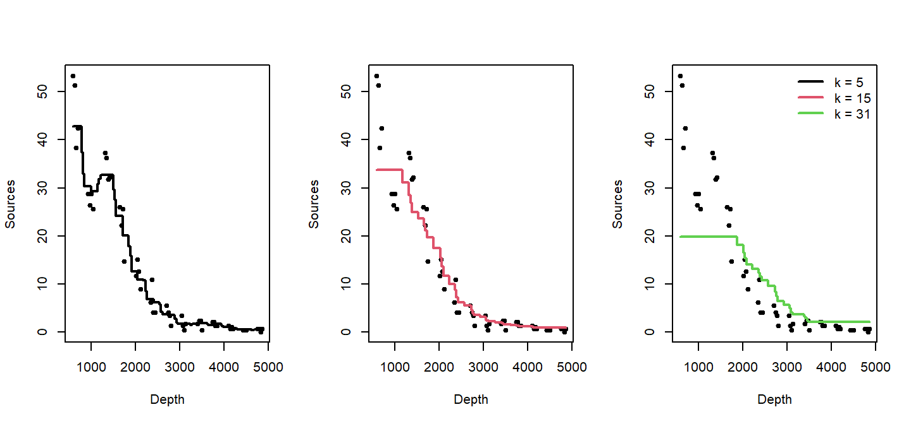

As $k$ increases, the trend becomes smoother.

To find the best `k`, we use cross-validation.  Here, we evaluate a set of odd `k` values with 10-fold cross-validation and choose the `k` that minimizes out-of-fold SSE.  


``` r
set.seed(1)

n <- nrow(st16)
Kfold <- 10
fold_id <- sample(rep(1:Kfold, length.out = n))

# Compute the minimum possible training size across folds
fold_sizes <- as.numeric(table(fold_id))
min_train_size <- min(n - fold_sizes)  # worst-case training rows

# Cap k by this minimum training size (and by 61 as before), and use odd k >= 3
max_k_allowed <- max(3, min(61, min_train_size))
Ks <- seq(3, max_k_allowed, by = 2)

cv_mse <- numeric(length(Ks))
names(cv_mse) <- Ks

for (j in seq_along(Ks)) {
  k <- Ks[j]
  mse_fold <- numeric(Kfold)
  for (f in 1:Kfold) {
    train_df <- st16[fold_id != f, , drop = FALSE]
    test_df  <- st16[fold_id == f, , drop = FALSE]
    if (nrow(test_df) == 0 || nrow(train_df) < k) { 
      mse_fold[f] <- NA_real_; 
      next 
    }
    mod <- kknn::kknn(sources ~ depth, train = train_df, test = test_df,
                      k = k, kernel = "rectangular")
    mse_fold[f] <- mean((test_df$sources - as.numeric(fitted(mod)))^2, na.rm = TRUE)
  }
  cv_mse[j] <- mean(mse_fold, na.rm = TRUE)
}

best_k <- as.integer(names(cv_mse)[which.min(cv_mse)])
best_k
```

```
## [1] 3
```


``` r
plot(as.integer(names(cv_mse)), cv_mse, type = "b",
     xlab = "Number of Neighbors (k)", ylab = "Out-of-fold MSE",
     main = "10-fold CV to Choose k")
grid()
abline(v = best_k, lty = 2)
text(best_k, min(cv_mse, na.rm = TRUE), labels = paste("best k =", best_k),
     pos = 4, cex = 0.9)
```

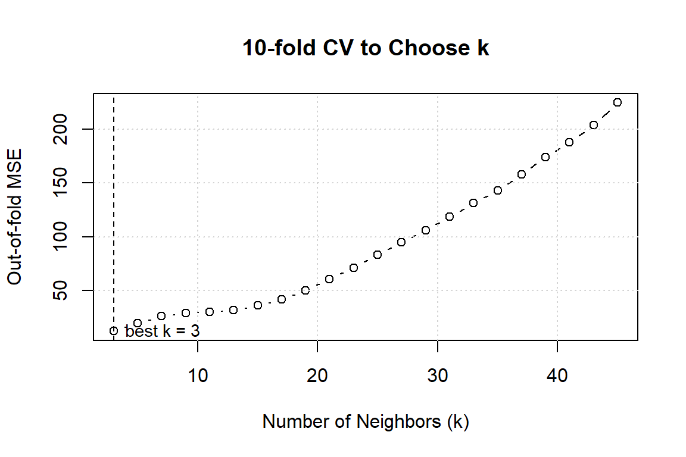

In this case, cross-validations suggests we should set $k=3$!.  Here's the final fit with $k=3$.


``` r
pred_final <- fit_knn_grid(st16, depth_grid, best_k)

plot(st16$depth, st16$sources, pch = 19, cex = 0.7,
     xlab = "Depth", ylab = "Sources",
     main = paste("k-NN Smoother with CV-selected k =", best_k))
lines(pred_final$depth, pred_final$fit, lwd = 2)
```

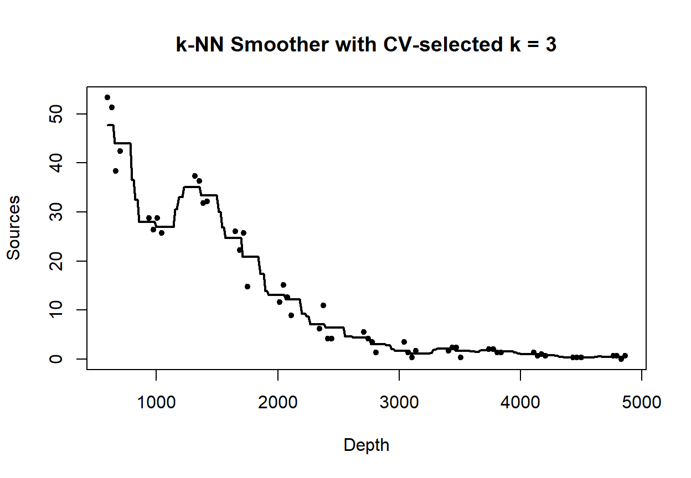

### Loess smoothers

A loess smoother takes the logic of $k$-nearest neighbor fitting one step further. Now, instead of simply averaging the $k$ nearest neighbors, we fit a regression model to the nearest neighbors, and use the predicted value of the regression trend as our smooth.  "Loess" is an acronym for [lo]cal regr[ess]ion.  Nomenclature can be a bit frustrating with loess models. As we will see later, some versions of loess models use weighted least squares instead of ordinary least squares, and are called "lowess" models to emphasize the use of weighted least squares.   However, the basic `R` routine for fitting lo(w)ess models is called `loess`, but uses the weighted least-squares fitting with its default factory settings.  

Fit a loess smoother using the factory settings:


``` r
st16.lo <- loess(sources ~ depth, data = st16)
summary(st16.lo)
```

```
## Call:
## loess(formula = sources ~ depth, data = st16)
## 
## Number of Observations: 51 
## Equivalent Number of Parameters: 4.33 
## Residual Standard Error: 4.18 
## Trace of smoother matrix: 4.73  (exact)
## 
## Control settings:
##   span     :  0.75 
##   degree   :  2 
##   family   :  gaussian
##   surface  :  interpolate	  cell = 0.2
##   normalize:  TRUE
##  parametric:  FALSE
## drop.square:  FALSE
```

Plot the fit, this takes a little work

``` r
depth.vals <- with(st16, seq(from   = min(depth), 
                             to     = max(depth), 
                             length = 100))

st16.fit <- predict(object  = st16.lo,
                    newdata = depth.vals,
                    se      = TRUE)

with(st16, plot(sources ~ depth))
lines(x = depth.vals, y = st16.fit$fit, col = "blue")

# add 95% error bars
lines(x   = depth.vals, 
      y   = st16.fit$fit + st16.fit$se.fit * qt(p = .975, df = st16.fit$df),
      col = "blue",
      lty = "dashed")

lines(x   = depth.vals, 
      y   = st16.fit$fit - st16.fit$se.fit * qt(p = .975, df = st16.fit$df),
      col = "blue",
      lty = "dashed")
```


Examine the residuals:

``` r
## see what the fit returns; maybe the residuals are already there

names(st16.lo)  # they are!
```

```
##  [1] "n"         "fitted"    "residuals" "enp"       "s"         "one.delta"
##  [7] "two.delta" "trace.hat" "divisor"   "robust"    "pars"      "kd"       
## [13] "call"      "terms"     "xnames"    "x"         "y"         "weights"
```

``` r
plot(st16.lo$residuals ~ st16$depth)
abline(h = 0, lty = "dotted")
```

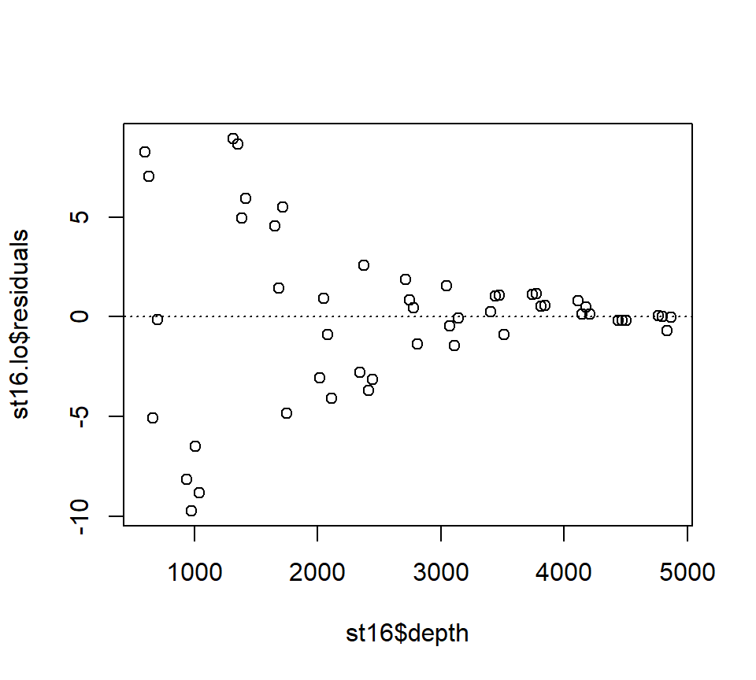

Let's look at how changing the span changes the fit.  We'll write a custom function to fit a LOESS curve, and then call the function with various values for the span.


``` r
PlotLoessFit <- function(x, y, return.fit = FALSE, ...){
  
  # Caluclates a loess fit with the 'loess' function, and makes a plot
  #
  # Args:
  #   x: predictor
  #   y: response
  #   return.fit: logical
  #   ...: Optional arguments to loess
  #
  # Returns:
  #   the loess fit
  
  my.lo <- loess(y ~ x, ...)
  
  x.vals <- seq(from = min(x), to = max(x), length = 100)
  
  my.fit <- predict(object  = my.lo,
                    newdata = x.vals,
                    se      = TRUE)
  
  plot(x, y)
  lines(x = x.vals, y = my.fit$fit, col = "blue")
  
  lines(x   = x.vals, 
        y   = my.fit$fit + my.fit$se.fit * qt(p = .975, df = my.fit$df),
        col = "blue",
        lty = "dashed")
  
  lines(x   = x.vals, 
        y   = my.fit$fit - my.fit$se.fit * qt(p = .975, df = my.fit$df),
        col = "blue",
        lty = "dashed")
  
  if (return.fit) {
    return(my.lo)
  }
}
```

Now we'll call the function several times, each time chanigng the value of the `span` argument to the `loess` function:


``` r
PlotLoessFit(x = st16$depth, y = st16$sources, span = 0.5)
```


``` r
PlotLoessFit(x = st16$depth, y = st16$sources, span = 0.25)
```


``` r
PlotLoessFit(x = st16$depth, y = st16$sources, span = 0.1)
```


Let's try a loess fit with a locally linear regression:


``` r
PlotLoessFit(x = st16$depth, y = st16$sources, span = 0.25, degree = 1)
```


### Splines

We'll use the `gam` function in the `mgcv` package to fit splines and additive models.  The name of the package is an acronym for "Mixed GAM Computation Vehicle".  GAM is an acronym for Generalized Additive Model.  **Warning**.  I do not understand much of the functionality of `mgcv::gam`.  What follows is my best guess of how the procedure works.

The code below fits a regression spline to the bioluminescence data.  Actually, the code fits an additive model with the spline as the only predictor. We will say more about additive models later.  For now, it is sufficient to think about an additive model as a type of regression in which the linear effect of the predictor has been replaced by a spline.  In other words, in terms of a word equation, the model can be represented as
$$
\mbox{response = intercept + spline + error}
$$

The `s()` component of the model formula designates a spline, and specifies details about the particular type of spline to be fit.  The `fx = TRUE` component of the formula indicates that the amount of smoothing is fixed.  The default value for the `fx` argument is `fx = FALSE`, in which case the amount of smoothing is determined by (generalized) cross-validation.  When `fx = TRUE`, the parameter `k` determines the dimensionality (degree of flexibility) of the spline.  Larger values of `k` correspond to greater flexibility, and a less smooth fit.  I think that the number of knots is $k-4$, such that setting $k=4$ fits a familiar cubic polynomial with no knots.  Setting $k=5$ then fits a regression spline with one knot, etc.  I have not been able to figure out where the knots are placed.

In any case, we'll fit a regression spline with two knots:


``` r
library(mgcv)
```

```
## Loading required package: nlme
```

```
## This is mgcv 1.9-3. For overview type 'help("mgcv-package")'.
```

``` r
st16.rspline <- mgcv::gam(sources ~ s(depth, k = 6, fx = TRUE), data = st16)
plot(st16.rspline, se = TRUE)
```


Note that the plot includes only the portion of the model attributable to the covariate effect.  This is because we have actually fit an additive model (e.g., a GAM).  

The plot shows only the spline component, which thus does not include the intercept. To visualize the fit, we'll need to do a bit more work.

``` r
with(st16, plot(sources ~ depth))  

st16.fit <- predict(st16.rspline, 
                    newdata = data.frame(depth = depth.vals), 
                    se      = TRUE)

lines(x = depth.vals, y = st16.fit$fit)

## add +/- 2 SE following Zuur; this is only approximate.
## should probably use a critical value from a t-dist with n - edf df, that is, 51 - 5 = 46 df

lines(x = depth.vals, y = st16.fit$fit + 2 * st16.fit$se.fit, lty = "dashed")
lines(x = depth.vals, y = st16.fit$fit - 2 * st16.fit$se.fit, lty = "dashed")
```

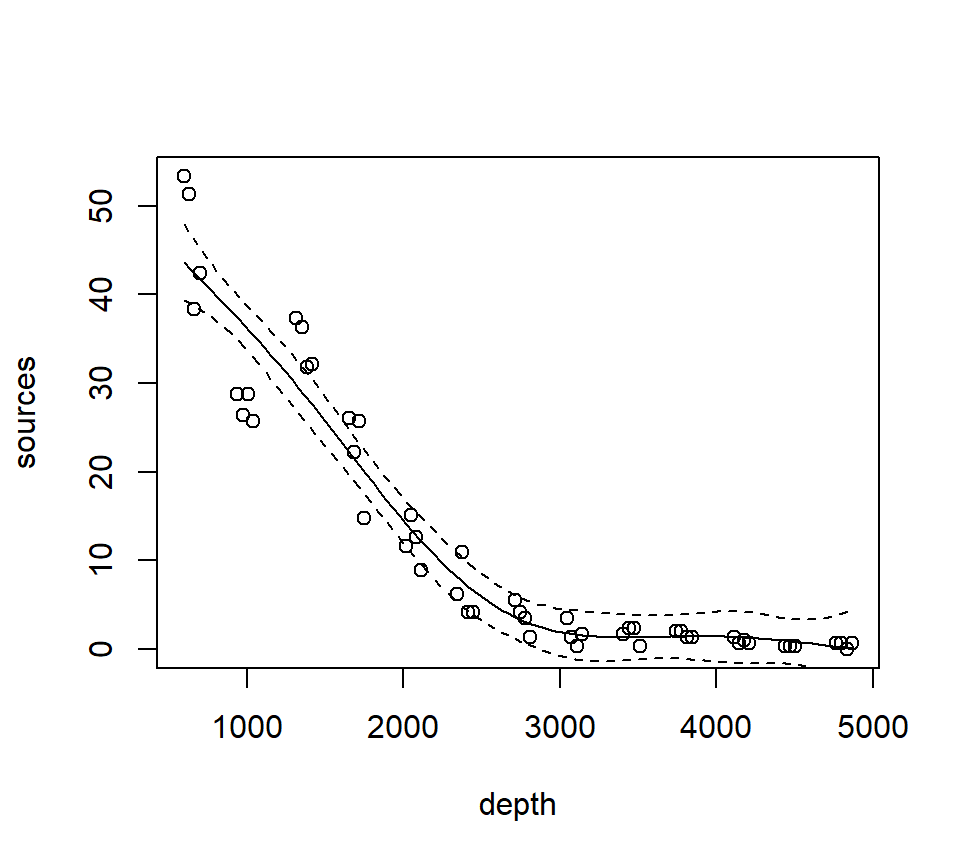

We see that this particular fit is not flexible enough to capture the trend in luminescence at low depth.

Let's take a look at the information produced by a call to `summary`:


``` r
summary(st16.rspline)
```

```
## 
## Family: gaussian 
## Link function: identity 
## 
## Formula:
## sources ~ s(depth, k = 6, fx = TRUE)
## 
## Parametric coefficients:
##             Estimate Std. Error t value Pr(>|t|)    
## (Intercept)  12.4771     0.5858    21.3   <2e-16 ***
## ---
## Signif. codes:  0 '***' 0.001 '**' 0.01 '*' 0.05 '.' 0.1 ' ' 1
## 
## Approximate significance of smooth terms:
##          edf Ref.df     F p-value    
## s(depth)   5      5 122.6  <2e-16 ***
## ---
## Signif. codes:  0 '***' 0.001 '**' 0.01 '*' 0.05 '.' 0.1 ' ' 1
## 
## R-sq.(adj) =  0.924   Deviance explained = 93.2%
## GCV = 19.837  Scale est. = 17.503    n = 51
```

This summary requires a bit more explanation as well.  In this GAM, the spline component of the model effectively creates a set of new predictor variables.  A regression spline with $x$ knots requires $x+3$ new regression predictors to fit the spline.  In this fit, there are two knots, so the spline requires 5 new predictor variables. Because the predictors are determined in advance with regression splines, we can use the usual theory of $F$-tests from regression to assess the statistical significance of the spline terms.  In the section of the output labeled "Approximate significance of smooth terms", we see that these 5 predictors together provide a significantly better fit than a model that does not include the spline.  I believe this test is actually exact.  I think that it is labeled "approximate" because the default behavior of `mgcv::gam` is to fit a smoothing spline, for which the test is indeed only approximate.  We'll discuss this more when we study a smoothing spline fit.

Now we'll fit and plot a smoothing spline.  A smoothing spline differs from a regression spline by using generalized cross-validation to determine the appropriate smoothness.

``` r
st16.spline <- mgcv::gam(sources ~ s(depth), data = st16)
plot(st16.spline, se = TRUE)  # note that the plot does not include the intercept
```


Again, we make a plot that includes both the points and the fit


``` r
with(st16, plot(sources ~ depth))  

st16.fit <- predict(st16.spline, 
                    newdata = data.frame(depth = depth.vals), 
                    se      = TRUE)

lines(x = depth.vals, y = st16.fit$fit)

## add +/- 2 SE following Zuur; this is only approximate.
## should probably use a critical value from a t-dist with n - edf df, that is, 51 - 9.81 = 41.19 df

lines(x = depth.vals, y = st16.fit$fit + 2 * st16.fit$se.fit, lty = "dashed")
lines(x = depth.vals, y = st16.fit$fit - 2 * st16.fit$se.fit, lty = "dashed")
```


Let's ask for a summary:

``` r
summary(st16.spline)
```

```
## 
## Family: gaussian 
## Link function: identity 
## 
## Formula:
## sources ~ s(depth)
## 
## Parametric coefficients:
##             Estimate Std. Error t value Pr(>|t|)    
## (Intercept)  12.4771     0.3921   31.82   <2e-16 ***
## ---
## Signif. codes:  0 '***' 0.001 '**' 0.01 '*' 0.05 '.' 0.1 ' ' 1
## 
## Approximate significance of smooth terms:
##            edf Ref.df     F p-value    
## s(depth) 8.813   8.99 158.2  <2e-16 ***
## ---
## Signif. codes:  0 '***' 0.001 '**' 0.01 '*' 0.05 '.' 0.1 ' ' 1
## 
## R-sq.(adj) =  0.966   Deviance explained = 97.2%
## GCV = 9.7081  Scale est. = 7.8402    n = 51
```

Note especially the `edf` component in the "Approximate significance of smooth terms" section.  The label `edf` stands for effective degrees of freedom.  We can think of the edf as the effective number of new predictors that have been added to the model to accommodate the spline.  For a smoothing spline, the number and values of the newly created predictors are determined by fitting the model to the data.  Because the predictors are calculated in this way, the usual theory of $F$-testing does not apply.  This is why the $F$-test shown for the smoothing spline is labeled as "approximate".  

Find the AIC for the smoothing spline fit:


``` r
AIC(st16.spline)
```

```
## [1] 260.4811
```
Here's a small detail.  Notice that the syntax of the call to `predict` is slightly different when making a prediction for a `loess`  object vs.\ making a prediction for a `gam` object (which the spline fit is).  For a call to `predict` with a `loess` object, the new predictor values can be provided in the form of a vector.  So, we were able to use

``` r
depth.vals <- with(st16, seq(from   = min(depth), 
                             to     = max(depth), 
                             length = 100))

st16.fit <- predict(object  = st16.lo,
                    newdata = depth.vals,
                    se      = TRUE)
```

However, for a call to `predict` with a `gam` object, the new predictor values must be provided in the form of a new data frame, with variable names that match the variables in the `gam` model.  So, to get predicted values for the spline fit, we needed to use the more cumbersome


``` r
depth.vals <- with(st16, seq(from   = min(depth), 
                             to     = max(depth), 
                             length = 100))

st16.fit <- predict(st16.spline, 
                    newdata = data.frame(depth = depth.vals), 
                    se      = TRUE)
```

### Generalized additive models (GAMs)

Generalized additive models replace the usual linear terms that appear in multiple regression models with splines.  That is, suppose we seek to model the relationship between a response $y$ and two predictors, $x_1$ and $x_2$.  A standard regression model without polynomial effects or interactions would be written as 
$$
y = \beta_0 + \beta_1 x_1 +\beta_2 x_2 + \varepsilon
$$
where $\varepsilon$ is assumed to be an iid Gaussian random variate with variance $\sigma^2_\varepsilon$.  This is an additive model, in the sense that the combined effects of the two predictors equal the sum of their individual effects.  

A generalized additive model (GAM) replaces the individual regression terms with splines.  Continuing with the generic example, a GAM would instead model the effects of the two predictors as
$$
y = \beta_0 + s(x_1) +s(x_2) + \varepsilon
$$
where $s(\cdot)$ represents a spline.  We continue to assume that, conditional on the covariate effects, the responses are normally distributed with constant variance $\sigma^2_\varepsilon$.  

We will illustrate additive modeling using the bird data found in Appendix A of @zuur2009mixed.  Zuur et al. report that these data originally appeared in Loyn (1987) and were featured in Quinn & Keough (2002)'s text.  Zuur et al. describe these data in the following way:

> Forest bird densities were measured in 56 forest patches in south-eastern Victoria, Australia. The aim of the study was to relate bird densities to six habitat variables; size of the forest patch, distance to the nearest patch, distance to the nearest larger patch, mean altitude of the patch, year of isolation by clearing, and an index of stock grazing history (1 = light, 5 = intensive).

We first read the data and perform some light exploratory analysis and housekeeping.


``` r
rm(list = ls())
require(mgcv)

bird <- read.table("data/Loyn.txt", head = T)

summary(bird)
```

```
##       Site           ABUND            AREA              DIST       
##  Min.   : 1.00   Min.   : 1.50   Min.   :   0.10   Min.   :  26.0  
##  1st Qu.:14.75   1st Qu.:12.40   1st Qu.:   2.00   1st Qu.:  93.0  
##  Median :28.50   Median :21.05   Median :   7.50   Median : 234.0  
##  Mean   :28.50   Mean   :19.51   Mean   :  69.27   Mean   : 240.4  
##  3rd Qu.:42.25   3rd Qu.:28.30   3rd Qu.:  29.75   3rd Qu.: 333.2  
##  Max.   :56.00   Max.   :39.60   Max.   :1771.00   Max.   :1427.0  
##      LDIST           YR.ISOL         GRAZE            ALT       
##  Min.   :  26.0   Min.   :1890   Min.   :1.000   Min.   : 60.0  
##  1st Qu.: 158.2   1st Qu.:1928   1st Qu.:2.000   1st Qu.:120.0  
##  Median : 338.5   Median :1962   Median :3.000   Median :140.0  
##  Mean   : 733.3   Mean   :1950   Mean   :2.982   Mean   :146.2  
##  3rd Qu.: 913.8   3rd Qu.:1966   3rd Qu.:4.000   3rd Qu.:182.5  
##  Max.   :4426.0   Max.   :1976   Max.   :5.000   Max.   :260.0
```

``` r
# get rid of the 'Site' variable; it is redundant with the row label

bird <- bird[, -1]

# log-transform area, distance, ldistance, to remove right-skew

bird$L.AREA <- log(bird$AREA)
bird$L.DIST <- log(bird$DIST)
bird$L.LDIST <- log(bird$LDIST)

# change YR.ISOL to years since isolation (study was published in 1987)

bird$YR.ISOL <- 1987 - bird$YR.ISOL

# keep the only the variables we want

bird <- bird[, c("ABUND", "L.AREA", "L.DIST", "L.LDIST", "YR.ISOL", "ALT", "GRAZE")]
summary(bird)
```

```
##      ABUND           L.AREA            L.DIST         L.LDIST     
##  Min.   : 1.50   Min.   :-2.3026   Min.   :3.258   Min.   :3.258  
##  1st Qu.:12.40   1st Qu.: 0.6931   1st Qu.:4.533   1st Qu.:5.064  
##  Median :21.05   Median : 2.0127   Median :5.455   Median :5.824  
##  Mean   :19.51   Mean   : 2.1459   Mean   :5.102   Mean   :5.859  
##  3rd Qu.:28.30   3rd Qu.: 3.3919   3rd Qu.:5.809   3rd Qu.:6.816  
##  Max.   :39.60   Max.   : 7.4793   Max.   :7.263   Max.   :8.395  
##     YR.ISOL           ALT            GRAZE      
##  Min.   :11.00   Min.   : 60.0   Min.   :1.000  
##  1st Qu.:21.00   1st Qu.:120.0   1st Qu.:2.000  
##  Median :24.50   Median :140.0   Median :3.000  
##  Mean   :37.25   Mean   :146.2   Mean   :2.982  
##  3rd Qu.:59.50   3rd Qu.:182.5   3rd Qu.:4.000  
##  Max.   :97.00   Max.   :260.0   Max.   :5.000
```

Our first attempt at a GAM will entertain smoothing splines for all of the continuous predictors in the model.  We will use a linear term for GRAZE because there are too few unique values to support a smooth term:

``` r
bird.gam1 <- mgcv::gam(ABUND ~ s(L.AREA) + s(L.DIST) + s(L.LDIST) + s(YR.ISOL) + GRAZE + s(ALT), data = bird)

summary(bird.gam1)
```

```
## 
## Family: gaussian 
## Link function: identity 
## 
## Formula:
## ABUND ~ s(L.AREA) + s(L.DIST) + s(L.LDIST) + s(YR.ISOL) + GRAZE + 
##     s(ALT)
## 
## Parametric coefficients:
##             Estimate Std. Error t value Pr(>|t|)    
## (Intercept)  25.4443     2.7798   9.153 9.42e-12 ***
## GRAZE        -1.9885     0.8968  -2.217   0.0318 *  
## ---
## Signif. codes:  0 '***' 0.001 '**' 0.01 '*' 0.05 '.' 0.1 ' ' 1
## 
## Approximate significance of smooth terms:
##              edf Ref.df      F  p-value    
## s(L.AREA)  2.446  3.089 12.635 3.98e-06 ***
## s(L.DIST)  3.693  4.559  0.855    0.461    
## s(L.LDIST) 1.000  1.000  0.386    0.538    
## s(YR.ISOL) 1.814  2.238  1.231    0.262    
## s(ALT)     1.000  1.000  0.629    0.432    
## ---
## Signif. codes:  0 '***' 0.001 '**' 0.01 '*' 0.05 '.' 0.1 ' ' 1
## 
## R-sq.(adj) =   0.72   Deviance explained = 77.6%
## GCV = 40.987  Scale est. = 32.238    n = 56
```

The output reports the partial regression coefficient for the lone quantitative predictor GRAZE, and approximate significance tests for the smooth terms for each of the other predictors.  We can visualize these smooth terms with a call to `plot`:

``` r
plot(bird.gam1)
```

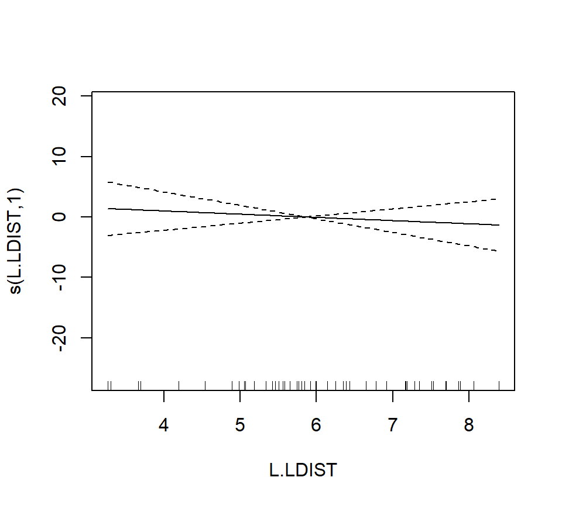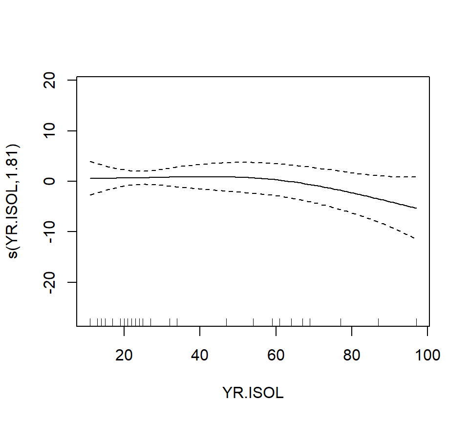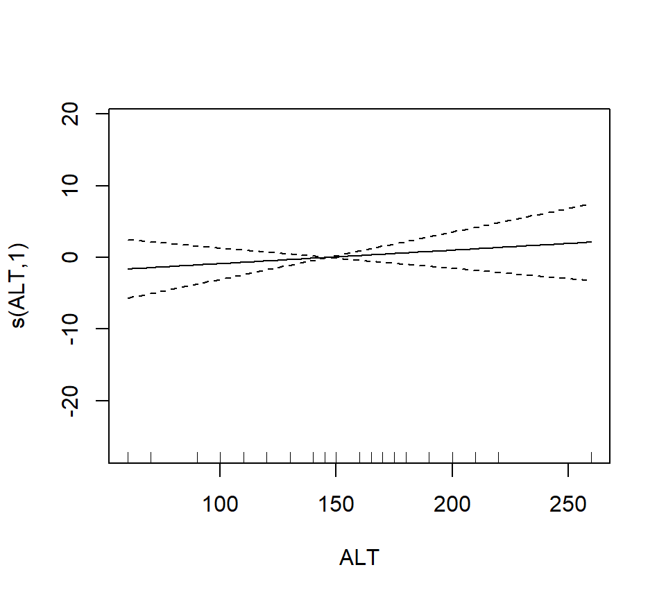

In the interest of time, we take a casual approach to variable selection here.  We'll drop smooth terms that are clearly not significant to obtain:

``` r
bird.gam2 <- mgcv::gam(ABUND ~ s(L.AREA) + GRAZE, data = bird)
summary(bird.gam2)
```

```
## 
## Family: gaussian 
## Link function: identity 
## 
## Formula:
## ABUND ~ s(L.AREA) + GRAZE
## 
## Parametric coefficients:
##             Estimate Std. Error t value Pr(>|t|)    
## (Intercept)   28.400      2.201  12.903  < 2e-16 ***
## GRAZE         -2.980      0.686  -4.344 6.56e-05 ***
## ---
## Signif. codes:  0 '***' 0.001 '**' 0.01 '*' 0.05 '.' 0.1 ' ' 1
## 
## Approximate significance of smooth terms:
##             edf Ref.df     F p-value    
## s(L.AREA) 2.284  2.903 13.18 3.4e-06 ***
## ---
## Signif. codes:  0 '***' 0.001 '**' 0.01 '*' 0.05 '.' 0.1 ' ' 1
## 
## R-sq.(adj) =   0.68   Deviance explained = 69.9%
## GCV = 39.992  Scale est. = 36.932    n = 56
```

``` r
plot(bird.gam2)
```

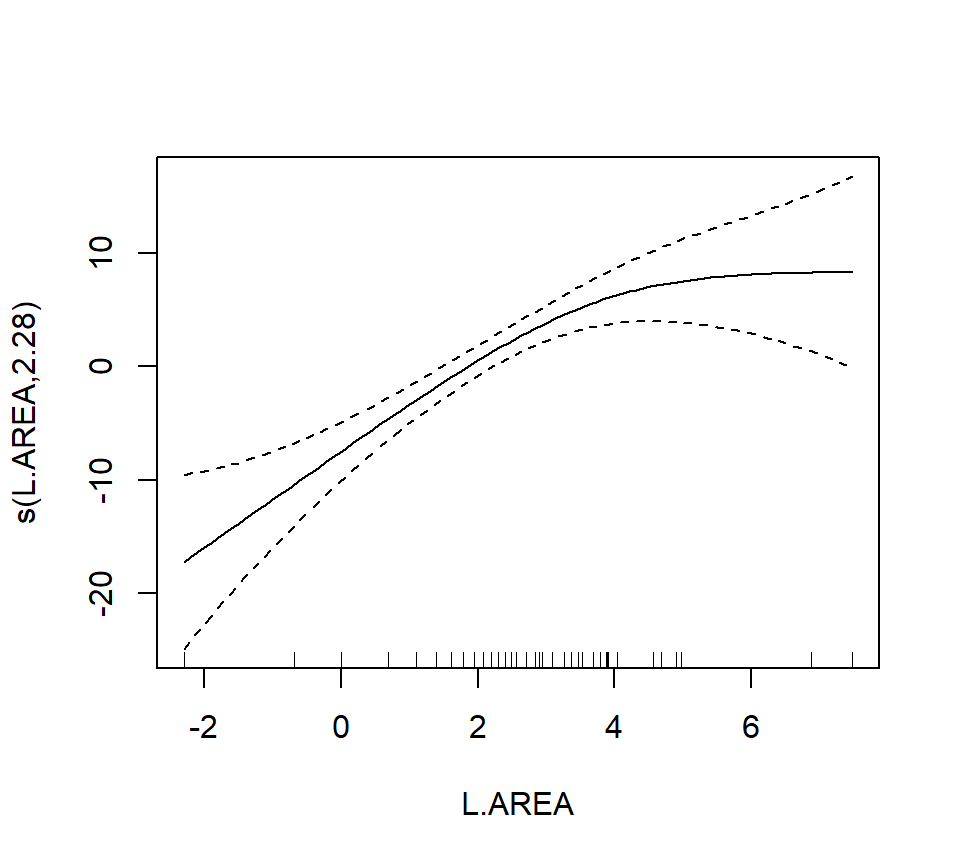

Note that the GRAZE variable is currently treated as a numerical predictor.  We'll try fitting a model with GRAZE as a factor.  First we'll create a new variable that treats GRAZE as a factor.  We'll use the `summary` command to confirm that the new variable fGRAZE is indeed a factor.

``` r
bird$fGRAZE <- as.factor(bird$GRAZE)
summary(bird)
```

```
##      ABUND           L.AREA            L.DIST         L.LDIST     
##  Min.   : 1.50   Min.   :-2.3026   Min.   :3.258   Min.   :3.258  
##  1st Qu.:12.40   1st Qu.: 0.6931   1st Qu.:4.533   1st Qu.:5.064  
##  Median :21.05   Median : 2.0127   Median :5.455   Median :5.824  
##  Mean   :19.51   Mean   : 2.1459   Mean   :5.102   Mean   :5.859  
##  3rd Qu.:28.30   3rd Qu.: 3.3919   3rd Qu.:5.809   3rd Qu.:6.816  
##  Max.   :39.60   Max.   : 7.4793   Max.   :7.263   Max.   :8.395  
##     YR.ISOL           ALT            GRAZE       fGRAZE
##  Min.   :11.00   Min.   : 60.0   Min.   :1.000   1:13  
##  1st Qu.:21.00   1st Qu.:120.0   1st Qu.:2.000   2: 8  
##  Median :24.50   Median :140.0   Median :3.000   3:15  
##  Mean   :37.25   Mean   :146.2   Mean   :2.982   4: 7  
##  3rd Qu.:59.50   3rd Qu.:182.5   3rd Qu.:4.000   5:13  
##  Max.   :97.00   Max.   :260.0   Max.   :5.000
```

Now we'll proceed to fit the model

``` r
bird.gam3 <- gam(ABUND ~ s(L.AREA) + fGRAZE, data = bird)
plot(bird.gam3)
```

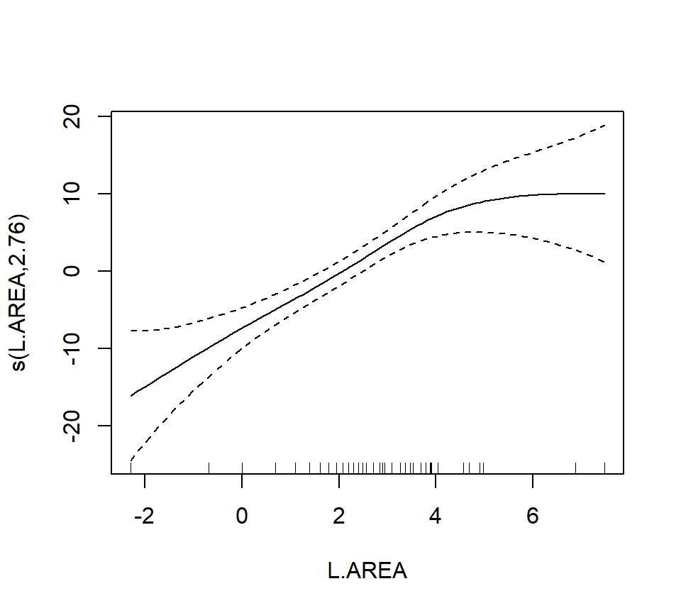

``` r
summary(bird.gam3)
```

```
## 
## Family: gaussian 
## Link function: identity 
## 
## Formula:
## ABUND ~ s(L.AREA) + fGRAZE
## 
## Parametric coefficients:
##               Estimate Std. Error t value Pr(>|t|)    
## (Intercept)  22.727275   1.944080  11.691 1.11e-15 ***
## fGRAZE2       0.006623   2.845343   0.002 0.998152    
## fGRAZE3      -0.660124   2.585878  -0.255 0.799592    
## fGRAZE4      -2.170994   3.050736  -0.712 0.480122    
## fGRAZE5     -11.913966   2.872911  -4.147 0.000136 ***
## ---
## Signif. codes:  0 '***' 0.001 '**' 0.01 '*' 0.05 '.' 0.1 ' ' 1
## 
## Approximate significance of smooth terms:
##             edf Ref.df     F  p-value    
## s(L.AREA) 2.761  3.478 11.67 4.71e-06 ***
## ---
## Signif. codes:  0 '***' 0.001 '**' 0.01 '*' 0.05 '.' 0.1 ' ' 1
## 
## R-sq.(adj) =  0.723   Deviance explained = 75.7%
## GCV = 37.013  Scale est. = 31.883    n = 56
```

To formally compare the models with GRAZE as a numerical vs.\ categorical predictor, we'll have to use AIC.  We can't use an $F$-test here because we have used smoothing splines to capture the effect of L.AREA.  Thus, the models are not nested.  (If we had used regression splines for L.AREA, then the models would have been nested.)  We can extract the AICs for these models by a simple call to the `AIC` function.


``` r
AIC(bird.gam2)
```

```
## [1] 367.1413
```

``` r
AIC(bird.gam3)
```

```
## [1] 361.9655
```

<!-- Compare the design matrices for these two models (only the first few rows of each matrix are shown in this transcript): -->
<!-- ```{r} -->
<!-- head(model.matrix(bird.gam3)) -->
<!-- head(model.matrix(bird.gam4)) -->
<!-- ``` -->
We can see the contrasts used to incorporate the factor fGRAZE in the model by a call to `contrasts`:

``` r
with(bird, contrasts(fGRAZE))
```

```
##   2 3 4 5
## 1 0 0 0 0
## 2 1 0 0 0
## 3 0 1 0 0
## 4 0 0 1 0
## 5 0 0 0 1
```

The output here is somewhat opaque because the levels of fGRAZE are 1, 2, $\ldots$, 5.  The output of the call to `contrasts` shows each of the newly created indicator variables as a column.  For example, the first column shows that the predictor named `fGRAZE2` takes the value of 1 when the variable fGRAZE equals 2, and is 0 otherwise.

Fit an additive model with only a smooth effect of L.AREA, in order to show residuals vs.\ GRAZE:

``` r
bird.gam4 <- gam(ABUND ~ s(L.AREA), data = bird)

plot(x = bird$GRAZE, y = bird.gam4$residuals)
abline(h = 0, lty = "dashed")
```

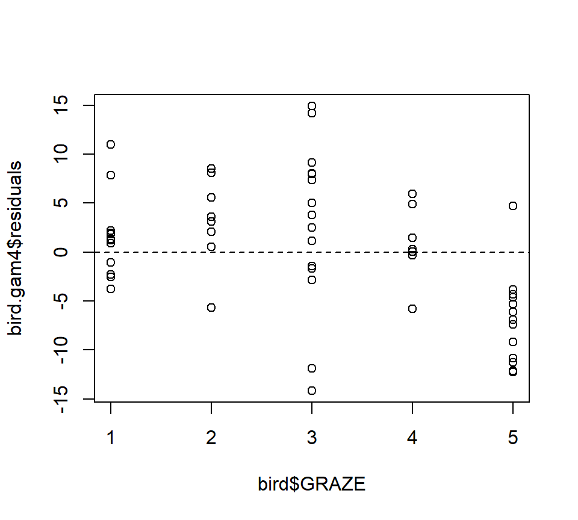

Both the plot and the model output suggest that the effect of grazing is primarily due to lower bird abundance in the most heavily grazed category.

To conclude, we'll conduct a formal test of whether the model with GRAZE as a factor provides a significantly better fit than the model with a linear effect of GRAZE.  In this case, we have to use regression splines for the smooth effect of L.AREA.  We'll use regression "splines" without any internal knots, (which are actually not splines at all, just a cubic trend) because the effect of log area seems to be reasonably well captured by a cubic trend anyway:

``` r
bird.gam5 <- gam(ABUND ~ s(L.AREA, k = 4, fx = TRUE) + GRAZE, data = bird)
bird.gam6 <- gam(ABUND ~ s(L.AREA, k = 4, fx = TRUE) + fGRAZE, data = bird)

anova(bird.gam5, bird.gam6, test = "F")  
```

```
## Analysis of Deviance Table
## 
## Model 1: ABUND ~ s(L.AREA, k = 4, fx = TRUE) + GRAZE
## Model 2: ABUND ~ s(L.AREA, k = 4, fx = TRUE) + fGRAZE
##   Resid. Df Resid. Dev Df Deviance      F  Pr(>F)  
## 1        51     1869.0                             
## 2        48     1543.1  3   325.93 3.3796 0.02565 *
## ---
## Signif. codes:  0 '***' 0.001 '**' 0.01 '*' 0.05 '.' 0.1 ' ' 1
```

Both AIC and the $F$-test suggest that the model with GRAZE as a factor provides a significantly better fit than the model with a linear effect of GRAZE ($F_{3,48} = 3.38, p = 0.026$).

As a final note, Zuur et al. (p.550) observe that "the non-linear L.AREA effect is mainly due to two large patches. It would be useful to sample more of this type of patch in the future."  (Note the rug plots in any of the plots of the area effect above.)
