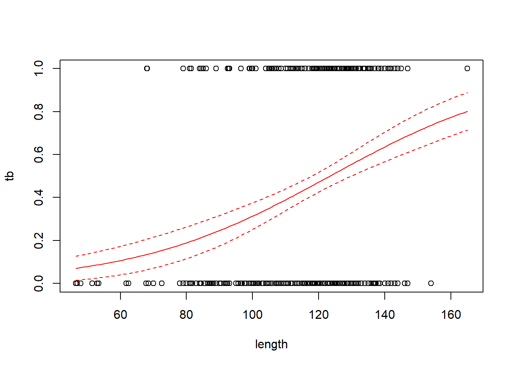
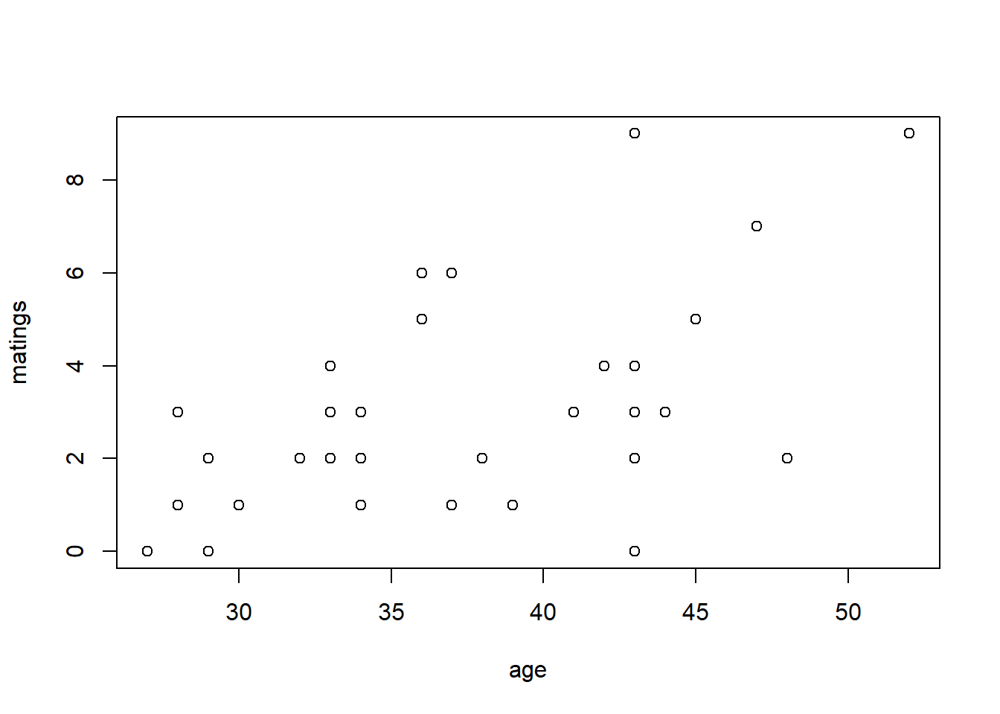
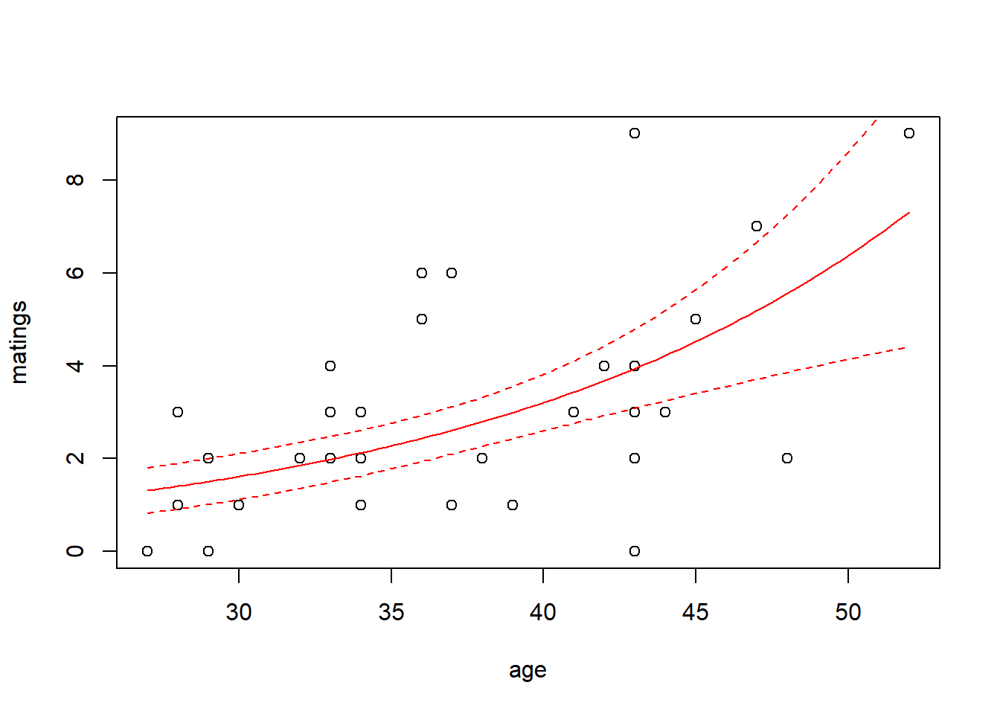
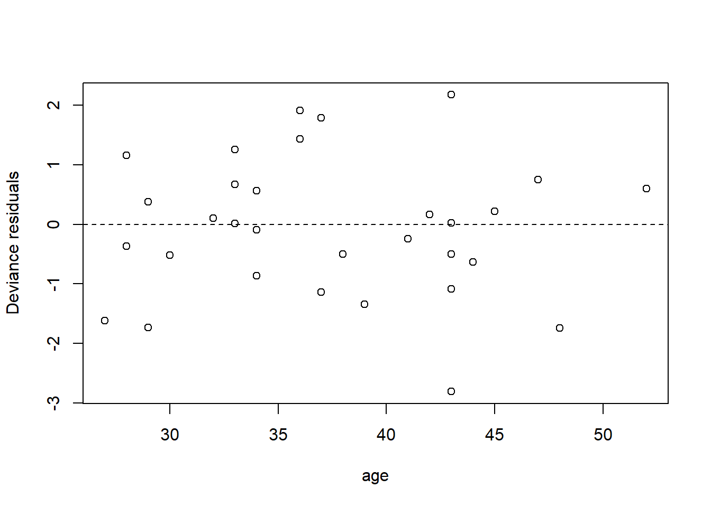
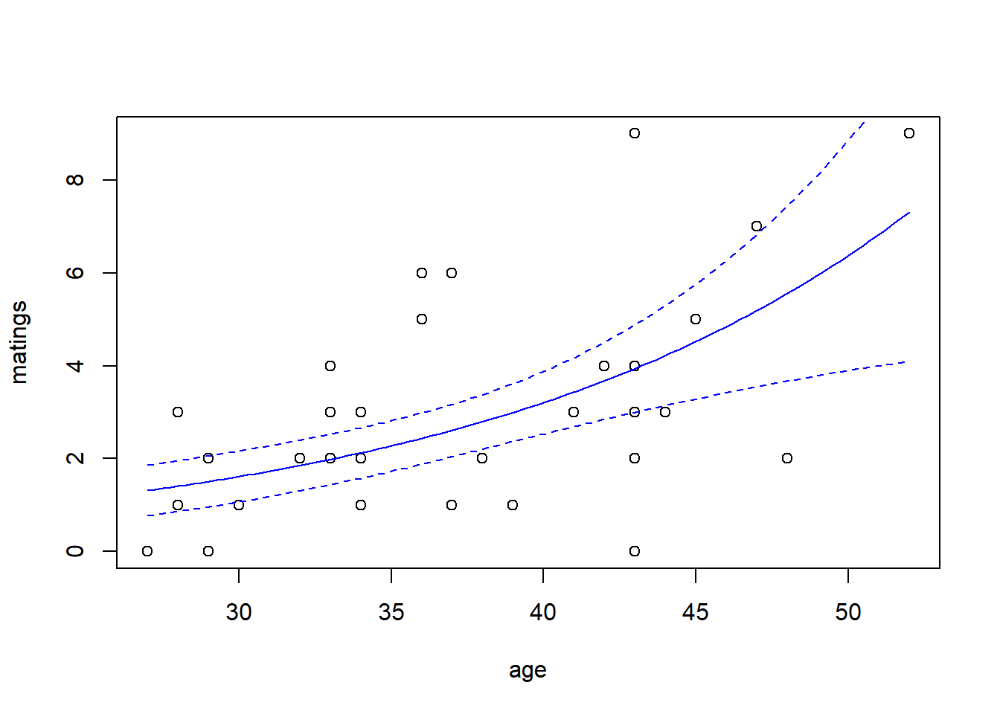

# Generalized linear models

Generalized linear modes extend the machinery of the "general linear model" (regression and ANOVA) to data sets in which the response variable may have a non-Gaussian distribution.  Generalized linear models do not encompass all possible distributions for the response variable.  Instead, the distribution of the response variable must belong to a group of distributions known as the "exponential family".  (Confusingly, there is also such a thing as an exponential distribution.  The exponential distribution is a member of the exponential family, but it is not the only one.)  The exponential family of distributions includes many of the distributions that we encounter in practical data analysis, including Poisson, negative binomial, binomial, gamma, and beta distributions. The Gaussian distribution is included in the exponential family as well. One notable distribution that is not part of the exponential family is the $t$-distribution.  Distributions in the exponential family all have a common mathematical structure, and thus can be handled with a unified fitting scheme.

In practice, logistic regression (with binomial responses) and Poisson regression are far and away the two most common forms of generalized linear models that one encounters.  You can go far with only knowing these two examples of generalized linear models.

## Logistic regression

We generally distinguish between two types of data with binary responses: Data in which each individual record is a separate a binary response, and data in which each record consists of a group of binary observations.  The same methods can be used for either type of data.  We will begin by studying two data sets with individual binary responses

### Individual binary responses: Donner party data

The Donner party was a well-known group of settlers who got stuck in the Sierra Nevada snows in the winter of 1846-47.  The Donner party included 45 adults (defined here as individuals at least 15 years of age), of whom only 20 survived the famous winter @grayson1993differential.  We have a data set that includes age, gender, and fate for all 45 members of the party.  Here's a look at the data set:


``` r
donner <- read.table("data/donner.txt", head = T, stringsAsFactors = T)
summary(donner)
```

```
##       age           sex           fate   
##  Min.   :15.0   female:15   died    :25  
##  1st Qu.:24.0   male  :30   survived:20  
##  Median :28.0                            
##  Mean   :31.8                            
##  3rd Qu.:40.0                            
##  Max.   :65.0
```

Suppose we want to model the relationship between age, gender, and fate, where age and gender are predictors, and fate is the response.  Fate is a binary response because it has only two possible values. 

Our goal is to relate the predictors to the probability of one outcome or the other.  The challenge in doing so is that probabilities are constrained to take values between 0 and 1, and are thus awkward to work with mathematically.  Instead, we model the log odds of oue outcome for the other.  To explain log odds, we first need to explain odds.

Suppose that the probability of an event occurring is $p$.  The odds of that event occurring are
$$
\mathrm{odds} = \dfrac{p}{1-p}
$$
The logit, or log odds are simply the natural log of the odds, or 
$$
\mathrm{logit} = \ln \mathrm{odds} = \ln(\dfrac{p}{1-p}).
$$

We can work backwards from log odds or odds to probabilities by inverting the formulas above.  Going from log odds to odds is easy:
$$
\mathrm{odds} = e^{\mathrm{logit}}.
$$
Going from odds to probabilities is also easy:
$$
p = \dfrac{\mathrm{odds}}{1 + \mathrm{odds}}
$$
	 
Now, we can use
$$
\mathrm{logit}(p) = \beta_0 + \beta_1 x_1 + \beta_2 x_2 + \ldots,
$$ 
which will work just fine.

In R, we can fit this model using the `glm` command.  The `glm` program fits [g]eneralized [l]inear [m]odels.  The `glm` command includes an additional `family` argument, which is where we specify the distribution of the response.   With binary responses, the distribution is the `binomial` family.  

``` r
fm1 <- glm(fate ~ age + sex, family = binomial, data = donner)
summary(fm1)
```

```
## 
## Call:
## glm(formula = fate ~ age + sex, family = binomial, data = donner)
## 
## Coefficients:
##             Estimate Std. Error z value Pr(>|z|)  
## (Intercept)  3.23041    1.38686   2.329   0.0198 *
## age         -0.07820    0.03728  -2.097   0.0359 *
## sexmale     -1.59729    0.75547  -2.114   0.0345 *
## ---
## Signif. codes:  0 '***' 0.001 '**' 0.01 '*' 0.05 '.' 0.1 ' ' 1
## 
## (Dispersion parameter for binomial family taken to be 1)
## 
##     Null deviance: 61.827  on 44  degrees of freedom
## Residual deviance: 51.256  on 42  degrees of freedom
## AIC: 57.256
## 
## Number of Fisher Scoring iterations: 4
```

To interpret the output correctly, it is critical to know whether the software is modeling the probability of an individual dying or of an individual surviving.  As far as I can tell, there's no great way to figure this out. Some online documentation suggests that `glm` will model the probability of the outcome listed second following a call to the `levels` command.  Let's try it.

``` r
levels(donner$fate)
```

```
## [1] "died"     "survived"
```
So, the model above is modeling the log odds of surviving.  That seems less morbid than modeling the log odds of dying, so we'll stick with it.  (It turns out that a model for the log odds of dying would generate the same parameter estimates, albeit with all the signs reversed.)

We can interpret the model parameters in the same way that we interpret parameters from a multiple regression model, just remembering that we're thinking about the log odds of surviving as the response.  For example, the parameter associated with `age` tells us that when we compare two people of different ages but of the same sex, the older individual's log odds of surviving will be 0.078 less for every additional year of age.  (So 0.078 less if the older individual is one year older, $2 \times 0.078 = 0.156$ less if the individual is two years older, and so on.)

While it's quite hard to think on a log odds scale, note that log odds and probabilities move in the same direction.  So, if older folks have a lower log odds of surviving, then they also have a lower probability of surviving.

It's good practice to work out the probabilities of surviving for a few test cases.  For example, here's how we'd compute the predicted survival probability for a 30-year old man.
$$
\begin{align}
\mathrm{logit} & = \hat{\beta}_0 + \hat{\beta}_1 \times 30 + \hat{\beta}_2 \times 1 = -0.713 \\
\mathrm{odds} & =e^{-0.713} = 0.49\\
\mathrm{probability} & = 0.49/1.49 = 0.33.
\end{align}
$$
	 

Sometimes we interpret the logistic regression parameters in terms of the odds ratio.  In the logistic regression model, if we hold all other predictors constant and increase the predictor $x_i$ by 1, then the predicted odds of success are multiplied by the factor $e^{\beta_i}$.  This is called the odds ratio for predictor $i$.  For the Donner party data, the odds ratio associated with age is $e^{-0.078} = 0.925$, so that each additional year of age (when comparing two people of the same sex) decreases the odds by a multiplicative factor of 0.925.  Or, if you prefer, the odds decrease by 7.5\% for every additional year of age.

For generalized linear models, there are several different tests that we can use for statistical significance.  The `glm` output reports a $z$-test, for which the test statistic is simply the estimate divided by the standard error, and the $p$-value is found by comparison to a standard normal distribution.  (Remember that by "standard" normal distribution, we mean a normal distribution with a mean of 0 and a variance of 1.  Remember also that statisticians usually reserve the notation $z$ for the standard normal distribution.) 

The model as we have it so far is additive on the log-odds scale.  Note that an additive model on the log-odds scale necessarily is non-additive on the probability scale.  For example, in this case, if we compare a man to a woman of the same age, the man's log odds of survival will always be -1.60 less.  The difference between the equivalent probabilities will depend on the particular age of the two individuals being compared.

We can still test for an interaction between age and sex on the log odds scale.  If nothing else, this model is more flexible and so it might provide a significantly better fit.  Let's see.


``` r
fm2 <- glm(fate ~ age * sex, family = binomial, data = donner)
summary(fm2)
```

```
## 
## Call:
## glm(formula = fate ~ age * sex, family = binomial, data = donner)
## 
## Coefficients:
##             Estimate Std. Error z value Pr(>|z|)  
## (Intercept)  7.24638    3.20517   2.261   0.0238 *
## age         -0.19407    0.08742  -2.220   0.0264 *
## sexmale     -6.92805    3.39887  -2.038   0.0415 *
## age:sexmale  0.16160    0.09426   1.714   0.0865 .
## ---
## Signif. codes:  0 '***' 0.001 '**' 0.01 '*' 0.05 '.' 0.1 ' ' 1
## 
## (Dispersion parameter for binomial family taken to be 1)
## 
##     Null deviance: 61.827  on 44  degrees of freedom
## Residual deviance: 47.346  on 41  degrees of freedom
## AIC: 55.346
## 
## Number of Fisher Scoring iterations: 5
```
The interaction is not significant at the usual 5\% threshold for significance, so we'll revert to the additive model.

### Individual binary responses: TB in boar

Here's a second example of logistic regression.  Something interesting and different will happen in these data.

This is a data set analyzed by @zuur2009mixed.  As explained there, these data describe the incidence of "tuberculosis-like lesions in wild boar *Sus scrofa*" in southern Spain, and were originally collected by @vicente2006wild.  The potential explanatory variables in the data set include a measure of the animal's size, it's sex, and a grouping into one of four age classes.

Let's load the data, do some housekeeping, and have a look at the data set:

``` r
boar <- read.table("data/boar.txt", head = T)

# remove incomplete records
boar <- na.omit(boar)

# convert sex to a factor
boar$SEX <- as.factor(boar$SEX)

names(boar) <- c("tb", "sex", "age", "length")
summary(boar)
```

```
##        tb         sex          age            length     
##  Min.   :0.0000   1:206   Min.   :1.000   Min.   : 46.5  
##  1st Qu.:0.0000   2:288   1st Qu.:3.000   1st Qu.:107.0  
##  Median :0.0000           Median :3.000   Median :122.0  
##  Mean   :0.4575           Mean   :3.142   Mean   :117.3  
##  3rd Qu.:1.0000           3rd Qu.:4.000   3rd Qu.:130.4  
##  Max.   :1.0000           Max.   :4.000   Max.   :165.0
```

We'll fit the usual logistic regression model first, considering only the animal's size as a predictor.  Size in this case is a measure of the length of the animal, in cm.  (Check it out, these are some big pigs.)

``` r
fm1 <- glm(tb ~ length, family = binomial, data = boar)
summary(fm1)
```

```
## 
## Call:
## glm(formula = tb ~ length, family = binomial, data = boar)
## 
## Coefficients:
##              Estimate Std. Error z value Pr(>|z|)    
## (Intercept) -4.137107   0.695381  -5.949 2.69e-09 ***
## length       0.033531   0.005767   5.814 6.09e-09 ***
## ---
## Signif. codes:  0 '***' 0.001 '**' 0.01 '*' 0.05 '.' 0.1 ' ' 1
## 
## (Dispersion parameter for binomial family taken to be 1)
## 
##     Null deviance: 681.25  on 493  degrees of freedom
## Residual deviance: 641.23  on 492  degrees of freedom
## AIC: 645.23
## 
## Number of Fisher Scoring iterations: 4
```
For these data, the response (`tb`) is coded as zeros and ones.  When `glm` is given a response coded thusly, it always models the probability of the outcome labeled with a one.  In this case, zeros code for uninfected animals and ones code for infected animals, so we are modeling the probability of infection.  Our model suggests that bigger boar are more likely to be infected, and the effect is crazy significant.

Here's some R code to plot the model's fit on a probability scale.  It takes a bit of work, but probabilities are so much easier to understand than log odds.  If these were your data, it'd be worth the extra effort.

``` r
with(boar, plot(tb ~ length))

# add a line for the fitted probabilities of tb

new.data <- data.frame(length = seq(from = min(boar$length),
                                    to   = max(boar$length),
                                    length = 100))

predict.fm1 <- predict(fm1, newdata = new.data, type = "response", se.fit = TRUE)

lines(x = new.data$length, y = predict.fm1$fit, col = "red")

# add lines for standard errors
# use critical value from z distribution here because
# the scale parameter is not estimated

lines(x   = new.data$length, 
      y   = predict.fm1$fit - 1.96 * predict.fm1$se.fit, 
      col = "red",
      lty = "dashed")

lines(x   = new.data$length, 
      y   = predict.fm1$fit + 1.96 * predict.fm1$se.fit, 
      col = "red",
      lty = "dashed")
```



Now let's try adding sex and age class as predictors.  Because the age class is coded with values 1--4, we want to make sure that R treats these values as levels of a categorical predictor (and not a quantitative predictor), so we enclose the `age` predictor in `as.factor(age)`.  

``` r
# fit a model with sex, age (as a categorical predictor) and their interaction

fm2 <- glm(tb ~ length + sex * as.factor(age),
           family = binomial,
           data = boar)

summary(fm2)
```

```
## 
## Call:
## glm(formula = tb ~ length + sex * as.factor(age), family = binomial, 
##     data = boar)
## 
## Coefficients:
##                       Estimate Std. Error z value Pr(>|z|)
## (Intercept)          -16.55356  724.50177  -0.023    0.982
## length                 0.01840    0.01253   1.469    0.142
## sex2                  14.19739  724.50190   0.020    0.984
## as.factor(age)2       13.83446  724.50169   0.019    0.985
## as.factor(age)3       14.31136  724.50191   0.020    0.984
## as.factor(age)4       14.68141  724.50219   0.020    0.984
## sex2:as.factor(age)2 -14.53254  724.50204  -0.020    0.984
## sex2:as.factor(age)3 -14.36861  724.50196  -0.020    0.984
## sex2:as.factor(age)4 -14.53354  724.50196  -0.020    0.984
## 
## (Dispersion parameter for binomial family taken to be 1)
## 
##     Null deviance: 681.25  on 493  degrees of freedom
## Residual deviance: 635.43  on 485  degrees of freedom
## AIC: 653.43
## 
## Number of Fisher Scoring iterations: 14
```
It's pandemonium!  Something has gone wickedly wrong here.  Notice how wild the standard errors are.

To figure out what went wrong, we need to do a bit of detective work.  Let's back up and try to figure out how many boar were infected in each combination of sex and age class.  We can compute the appropriate tallies with the `table` command; we'll be stylish at use the `with` command to write some pretty code:


``` r
with(boar, table(tb, age, sex))
```

```
## , , sex = 1
## 
##    age
## tb   1  2  3  4
##   0  4 37 37 28
##   1  0 14 34 52
## 
## , , sex = 2
## 
##    age
## tb   1  2  3  4
##   0  7 40 62 53
##   1  2 11 48 65
```

And here is our problem. Our problematic model included an interaction between the categorical predictors `age` and `sex`, and a numerical predictor for `length`.  So, if we were to make a picture of the model, on a log odds scale the model has 8 parallel lines: one for each combination of `age` and `sex`.  But of the 4 boar of the sex coded by a 1 (whichever sex that is), and in age class 1, none of the 4 are infected, so the empirical probability of infection is 0.  Yet on a log odds scale, a probability of 0 corresponds to a log odds of $-\infty$.  The model can't handle log odds of $-\infty$, and so it returns nonsense.

---

<span style="color: gray;"> We can do better than just say that the model output is nonsense.  In R, the `glm` program estimates model parameters by a routine called maximum likelihood.  In this case, the maximum likelihood estimates are found by constructing an objective function called the likelihood, and then (you guessed it) finding the parameter estimates that maximize this likelihood.  The maximum likelihood estimates can only be found via an algorithmic optimization (the mysterious "Fisher scoring" reported at the end of the `glm` summary).  In cases of complete separation, though, the likelihood function is pathological in the sense that the maximizing parameter estimates are found at either $+\infty$ or $-\infty$.  In this case, the `glm` program works for awhile, and then kicks out after it goes through a predetermined maximum number of iterations without converging on the likelihood-maximizing estimates.  The estimates that we saw when we looked at the summary of `fm2` were just the parameter values at the last iteration before the program stopped.</span>

---

This is an example of "complete separation".  Complete separation happens when there are predictor values, or combinations of predictor values, that completely separate one of the two outcomes being modeled from the other.  In this case, the model fitting fails because the model is trying to generate fitted log odds of $+\infty$ or $-\infty$.

Complete separation happens, especially in data sets (like this one) with several categorical predictors. It must be dealt with; the model `fm2` above is nonsense.  There are several possible remedies here.  The first is to try to reduce the number of parameters in the model, perhaps by eliminating the interaction between sex and age class.

``` r
# fit a model with sex, age (as a categorical predictor) and their interaction

fm3 <- glm(tb ~ length + sex + as.factor(age),
            family = binomial,
            data = boar)

summary(fm3)
```

```
## 
## Call:
## glm(formula = tb ~ length + sex + as.factor(age), family = binomial, 
##     data = boar)
## 
## Coefficients:
##                 Estimate Std. Error z value Pr(>|z|)  
## (Intercept)     -2.67730    1.07306  -2.495   0.0126 *
## length           0.01959    0.01237   1.584   0.1133  
## sex2            -0.24297    0.19354  -1.255   0.2093  
## as.factor(age)2 -0.19847    0.92641  -0.214   0.8304  
## as.factor(age)3  0.33908    1.06938   0.317   0.7512  
## as.factor(age)4  0.59041    1.20582   0.490   0.6244  
## ---
## Signif. codes:  0 '***' 0.001 '**' 0.01 '*' 0.05 '.' 0.1 ' ' 1
## 
## (Dispersion parameter for binomial family taken to be 1)
## 
##     Null deviance: 681.25  on 493  degrees of freedom
## Residual deviance: 637.41  on 488  degrees of freedom
## AIC: 649.41
## 
## Number of Fisher Scoring iterations: 4
```
For these data, this works.  In other cases, a second option is to use so-called "exact" methods for inference.  There doesn't appear to be a good package available for implementing these methods in R.  Other software packages might be necessary. 

<!-- ### Grouped binary data: Industrial melanism -->

<!-- We'll start with the standard logistic regression model for the industrial melanism data.  We are primarily interested in determining if the effect of color morph on removal rate changes with distance from Liverpool.  For grouped binary data, we need to specify both the number of "successes" and number of "failures" as the response variable in the model.  Here, we use `cbind` to create a two-column matrix with the number of "successes" (moths removed) in the first column, and the number of "failures" (moths not removed) in the second column.  See the help documentation for `glm` for more details. -->

<!-- ```{r} -->
<!-- moth <- read.table("data/moth.txt", head = TRUE, stringsAsFactors = TRUE) -->

<!-- fm1 <- glm(cbind(removed, placed - removed) ~ morph * distance,  -->
<!--            family = binomial(link = "logit"), -->
<!--            data = moth) -->

<!-- summary(fm1) -->
<!-- ``` -->

<!-- Grouped binary data are often overdispersed relative to the variance implied by a binomial distribution.  In this case, we would call the overdispersion "extra-binomial" variation.  As with count data, we can deal with overdispersion through a quasi-likelihood approach: -->

<!-- ```{r} -->
<!-- fm1q <- glm(cbind(removed, placed - removed) ~ morph * distance,  -->
<!--            family = quasibinomial(link = "logit"), -->
<!--            data = moth) -->

<!-- summary(fm1q) -->
<!-- ``` -->

<!-- As with count data, using quasi-likelihood to estimate the scale (or dispersion) parameter increases the estimates of the standard errors of the coefficients by an amount equal to the square root of the estimated scale parameter.   -->

<!-- The $t$-test of the interaction between color morph and distance indicates that there is a statistically significant difference in how the proportion of moth removes changes over the distance transect between the two color morphs. -->

<!-- ```{r} -->
<!-- plot(x = moth$distance,  -->
<!--      y = residuals(fm1q, type = "deviance"), -->
<!--      xlab = "distance", -->
<!--      ylab = "Deviance residuals") -->

<!-- abline(h = 0, lty = "dashed") -->
<!-- ``` -->

<!-- The plot of the residuals suggests that we should include a random effect for the sampling station.  This makes complete sense.  The data for the two color morphs at each station share whatever other characteristics make the station unique, and are thus correlated.  To account for this correlation, we need to introduce a random effect for the station.  This again gets us into the world of generalized linear mixed models.  Before proceeding, we'll write the model down.  Let $i=1,2$ index the two color morphs, and let $j = 1, \ldots, 7$ index the stations.  Let $y_{ij}$ be the number of moths removed, let $n_{ij}$ be the number of moths placed, and let $x_j$ be the distance of the station from Liverpool.  We wish to fit the model -->
<!-- \begin{align*} -->
<!-- y_{ij} & \sim \mathrm{Binom}(p_{ij}, n_{ij})\\ -->
<!-- \mathrm{logit}(p_{ij})  & = \eta_{ij} \\ -->
<!-- \eta_{ij} & = a_i + b_i x_j + L_j \\ -->
<!-- L_j & \sim \mathcal{N}(0, \sigma^2_L) -->
<!-- \end{align*} -->

<!-- The $L_j$'s are our [l]ocation-specific random effects that capture any other station-to-station differences above and beyond the station's distance from Liverpool.  (It turns out that an observation-level random effect does not improve the model, at least as indicated by DIC.)  Because this model includes both a random effect for the station and a non-Gaussian response, it is a generalized linear mixed model (GLMM).  We postpone our discussion accordingly. -->

<!-- We have already mentioned that the $t$-statistics reported in `summary.glm` are based on standard errors calculated from the curvature (Hessian) of the negative log-likelihood at the MLEs, with df determined by the df available for the residual deviance.  An alternative approach for testing for the significance of model terms is to use the residual deviance to compare nested models, much as one would use $F$-tests to compare nested models in ordinary least squares.  Here is a bit of theory.  Let $D$ denote the residual deviance for a model.  Suppose we are comparing two nested models: a parameter poor model that we call model 0, and a parameter rich model that we call model 1.  The parameter-rich model nests the parameter poor model.  Let $p_0$ and $p_1$ be the number of estimated parameters in the linear predictor of models 0 and 1, respectively, and let $D_0$ and $D_1$ denote the (residual) deviances of both models.  In the usual way, we wish to test whether or not the parameter-rich model provides a statistically significant improvement in fit over the parameter-poor model. -->

<!-- There are two separate approaches here depending on whether the scale parameter is known, or is estimated from the data.  If the scale parameter is known to be $\phi$, then define the scaled deviance as $D^* = D / \phi$.  The LRT to compare the two models is equal to the drop in the scaled deviance, $D^*_0 - D^*_1$.  Under the null hypothesis that the parameter-poor model generated the data, the test statistic has a $\chi^2$ distribution with $p_1 - p_0$ degrees of freedom. -->

<!-- If the scale parameter is estimated from the data, then we work with the (residual) deviances directly.  In this case, we calculate the $F$-statistic -->
<!-- $$ -->
<!-- F = \frac{(D_0 - D_1)/(p_1 - p_0)}{D_1 / (n - p_1)}. -->
<!-- $$ -->

<!-- Note that this is generalization of the usual $F$-statistic for comparing nested models from OLS.  Under the null hypothesis, the test statistic has an $F_{p_1 - p_0, n - p_1}$ distribution. -->


<!-- # test for interaction between distance and morph -->

<!-- ```{r} -->
<!-- fm2q <- glm(cbind(removed, placed - removed) ~ morph + distance,  -->
<!--             family = quasibinomial(link = "logit"), -->
<!--             data = moth) -->

<!-- anova(fm2q, fm1q, test = "F") -->
<!-- ``` -->

## Poisson regression

Poisson regression is used when the response is a "count" variable.  A count variable just counts the number of times that an event occurs.  Thus count variables are necessarily non-negative integers.  

These data are originally from @poole1989mate, and were analyzed in @ramsey2012statistical.  They describe an observational study of 41 male elephants  over 8 years at Amboseli National Park in Kenya.  Each record in this data set gives the age of a male elephant at the beginning of a study and the number of successful matings for the elephant over the study's duration.  The number of matings is a count variable.  Our goal is to characterize how the number of matings is related to the elephant's age.  

Poisson regression is sometimes called "log-linear" regression.  In Poisson regression, we try to fit a model for the (natural) log of the average response.


``` r
elephant <- read.table("data/elephant.txt", head = T)
head(elephant)
```

```
##   age matings
## 1  27       0
## 2  28       1
## 3  28       1
## 4  28       1
## 5  28       3
## 6  29       0
```

``` r
with(elephant, plot(matings ~ age))
```



``` r
fm1 <- glm(matings ~ age, 
           family = poisson, 
           data   = elephant)  

summary(fm1)
```

```
## 
## Call:
## glm(formula = matings ~ age, family = poisson, data = elephant)
## 
## Coefficients:
##             Estimate Std. Error z value Pr(>|z|)    
## (Intercept) -1.58201    0.54462  -2.905  0.00368 ** 
## age          0.06869    0.01375   4.997 5.81e-07 ***
## ---
## Signif. codes:  0 '***' 0.001 '**' 0.01 '*' 0.05 '.' 0.1 ' ' 1
## 
## (Dispersion parameter for poisson family taken to be 1)
## 
##     Null deviance: 75.372  on 40  degrees of freedom
## Residual deviance: 51.012  on 39  degrees of freedom
## AIC: 156.46
## 
## Number of Fisher Scoring iterations: 5
```
Thus the so-called pseudo-$R^2$ for the model with the log link is
$$
\mathrm{pseudo}-R^2 = 1 - \frac{51.012}{75.372} = 32.3\%
$$
We can visualize the fit by plotting a best-fitting line with a 95\% confidence interval.  


``` r
new.data <- data.frame(age = seq(from = min(elephant$age),
                                 to   = max(elephant$age),
                                 length = 100))

predict.fm1 <- predict(fm1, newdata = new.data, type = "response", se.fit = TRUE)

with(elephant, plot(matings ~ age))
lines(x = new.data$age, y = predict.fm1$fit, col = "red")

# add lines for standard errors

lines(x   = new.data$age, 
      y   = predict.fm1$fit - 1.96 * predict.fm1$se.fit, 
      col = "red",
      lty = "dashed")

lines(x   = new.data$age, 
      y   = predict.fm1$fit + 1.96 * predict.fm1$se.fit, 
      col = "red",
      lty = "dashed")
```



Unlike logistic regression, with Poisson regression we can generate meaningful residuals.  There are two ways to define the residuals for generalized linear models.  Here, we'll have a look at the so-called deviance residuals.


``` r
plot(x = elephant$age, 
     y = residuals(fm1, type = "deviance"),
     xlab = "age",
     ylab = "Deviance residuals")

abline(h = 0, lty = "dashed")
```



The residuals do not suggest any deficiency in the fit.

With Poisson data, we also have to be wary of so-called overdispersion.  In Poisson regression, the assumption of a Poisson-distributed response introduces a very specific assumption about the relationship between the variance of the response and the mean.   (Do you remember what this is?  In a Poisson distribution, the variance equals the mean!).  But this assumption is just an assumption, and its suitability needs to be assessed.  

More often than not (dare we say almost always?), the data are more variable, or more dispersed, then the Poisson distribution would suggest.  When this happens, we say that the data are "overdispersed" relative to a Poisson distribution.  (Underdispersion is possible too, but it's rare, and for reasons that we will see shortly, it doesn't create the same statistical problems that overdispersion does.)  

Here's some good news: the degree of over-/under-dispersion is measured by the ratio of something called the "residual deviance" to the df associated with the residual deviance.  The residual deviance is the counterpart to the error sum-of-squares in general linear models, and the associated df are computed in the same way.  When the ratio of the residual deviance to its df is $>1$, this suggests overdispersion; when the ratio is $<1$, this suggest underdispersion.  No surprise, the elephant data are overdispersed.

When data are overdispersed, the "naive" standard errors (i.e., those calculated assuming Poisson variation) are too small.  That's bad, and we need to correct for it.  (When data are underdispersed, the naive standard errors are too big, which just means we wind up with conservative inferences, which no one worries about.)  In R, the way to correct for overdispersion is to use a so-called `quasipoisson` family.  Let's try it: 


``` r
fm3 <- glm(matings ~ age, family = quasipoisson, data = elephant)  

summary(fm3)
```

```
## 
## Call:
## glm(formula = matings ~ age, family = quasipoisson, data = elephant)
## 
## Coefficients:
##             Estimate Std. Error t value Pr(>|t|)    
## (Intercept) -1.58201    0.58590  -2.700   0.0102 *  
## age          0.06869    0.01479   4.645 3.81e-05 ***
## ---
## Signif. codes:  0 '***' 0.001 '**' 0.01 '*' 0.05 '.' 0.1 ' ' 1
## 
## (Dispersion parameter for quasipoisson family taken to be 1.157334)
## 
##     Null deviance: 75.372  on 40  degrees of freedom
## Residual deviance: 51.012  on 39  degrees of freedom
## AIC: NA
## 
## Number of Fisher Scoring iterations: 5
```

``` r
predict.fm3 <- predict(fm3, newdata = new.data, type = "response", se.fit = TRUE)

with(elephant, plot(matings ~ age))
lines(x = new.data$age, y = predict.fm3$fit, col = "blue")

lines(x   = new.data$age, 
      y   = predict.fm3$fit + qt(0.025, df = 39) * predict.fm3$se.fit, 
      col = "blue",
      lty = "dashed")

lines(x   = new.data$age, 
      y   = predict.fm3$fit + qt(0.975, df = 39) * predict.fm3$se.fit, 
      col = "blue",
      lty = "dashed")
```


Switching from a Poisson family to a quasi-Poisson family hasn't changed the parameter estimates of the fit, but it has increased the associate standard errors.  To be precise, the standard errors have been multiplied by something called the "dispersion parameter", which in this case is about 1.16.  So, the standard errors have increased by 16\% --- nothing dramatic, but big enough that we need to account for it.  The dispersion parameter should be close to the square root of the ratio of the residual deviance to its df; I'm not sure why it isn't exactly that value in this case.

---

<span style="color: gray;">So what's "quasi" about a quasi-Poisson family?  In the first case, there is no such thing as a "quasi-Poisson" distribution.  The "quasi-Poisson" family is just a Poisson fit with the standard errors inflated by the dispersion parameter.</span>

<span style="color: gray;">You may also wonder why we didn't discuss overdispersion in logistic regression.  In logistic regression with individual responses, like the Donner party data and the boar data, it's hard to define overdispersion.  For logistic regression with grouped binary responses, however, overdispersion can and should be accounted for, just like in Poisson regression.  (Grouped responses are those where each data point is not a single success or failure, but a tally of the number of successes in many trials.)  There is a `quasibinomial` family in R to deal with overdispersed (grouped) binomial data.</span>

---


<!-- As an alternative, we could fit a model that uses a negative binomial distribution for the response.  Negative binomial distributions belong to the exponential family, so we can fit them using the GLM framework.  However, the authors of `glm` did not include a negative binomial family in their initial code.  Venables & Ripley's `MASS` package includes a program called `glm.nb` which is specifically designed for negative binomial responses.  `MASS::glm.nb` uses the parameterization familiar to ecologists, although they use the parameter $\theta$ instead of $k$.  So, in their notation, if $y \sim \mathrm{NB}(\mu, \theta)$, then $\mathrm{Var}(y) = \mu + \mu^2/\theta$. -->

<!-- ```{r} -->
<!-- require(MASS) -->

<!-- fm4 <- glm.nb(matings ~ age, link = identity, data = elephant)   -->

<!-- summary(fm4) -->

<!-- predict.fm4 <- predict(fm4, newdata = new.data, type = "response", se.fit = TRUE) -->

<!-- with(elephant, plot(matings ~ age)) -->
<!-- lines(x = new.data$age, y = predict.fm4$fit, col = "blue") -->

<!-- lines(x   = new.data$age,  -->
<!--       y   = predict.fm4$fit + 1.96 * predict.fm4$se.fit,  -->
<!--       col = "blue", -->
<!--       lty = "dashed") -->

<!-- lines(x   = new.data$age,  -->
<!--       y   = predict.fm4$fit - 1.96 * predict.fm4$se.fit,  -->
<!--       col = "blue", -->
<!--       lty = "dashed") -->
<!-- ``` -->

<!-- Notice that $\hat{\theta} = 15.8$, again indicating that the extra-Poisson variation is mild.  Notice also that the error bounds on the fitted curve are ever so slightly larger than the error bounds from the Poisson fit, and nearly identical to the error bounds from the quasi-Poisson fit. -->


