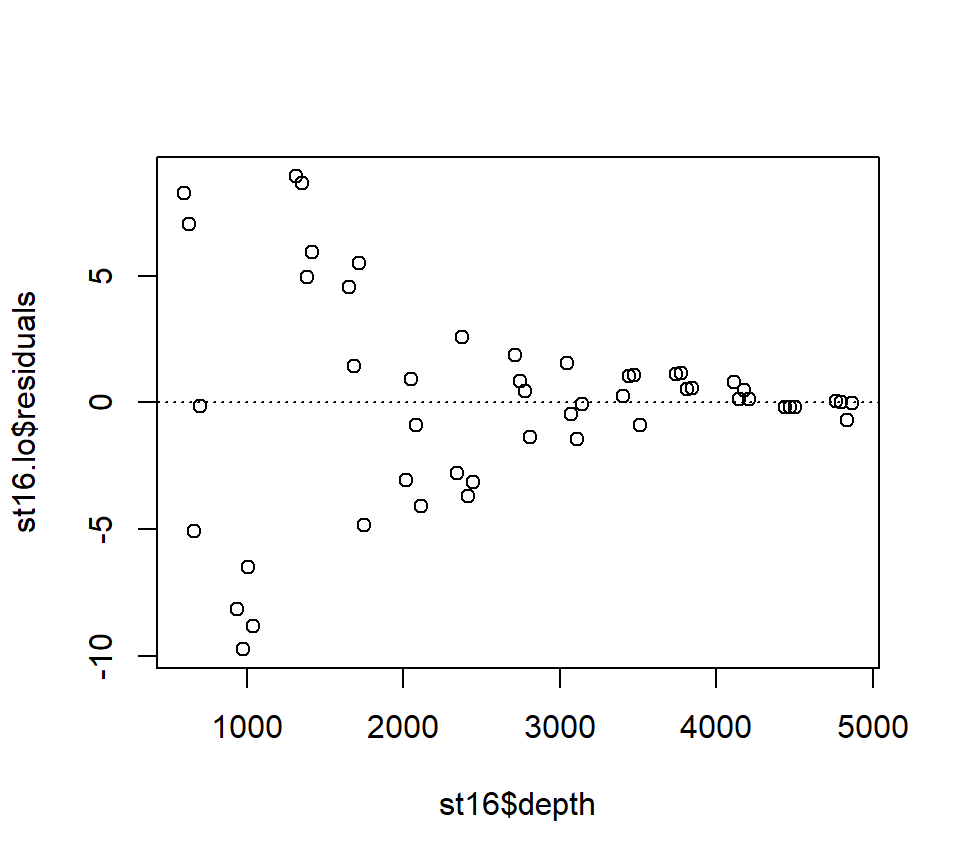
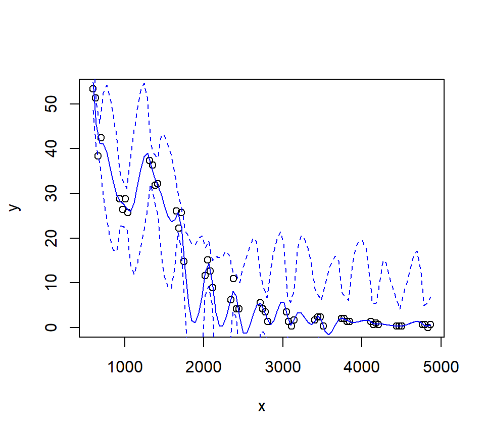
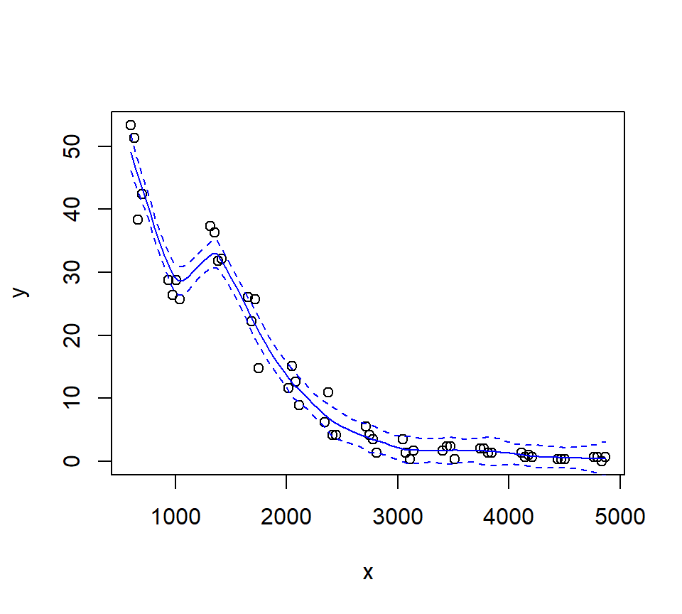
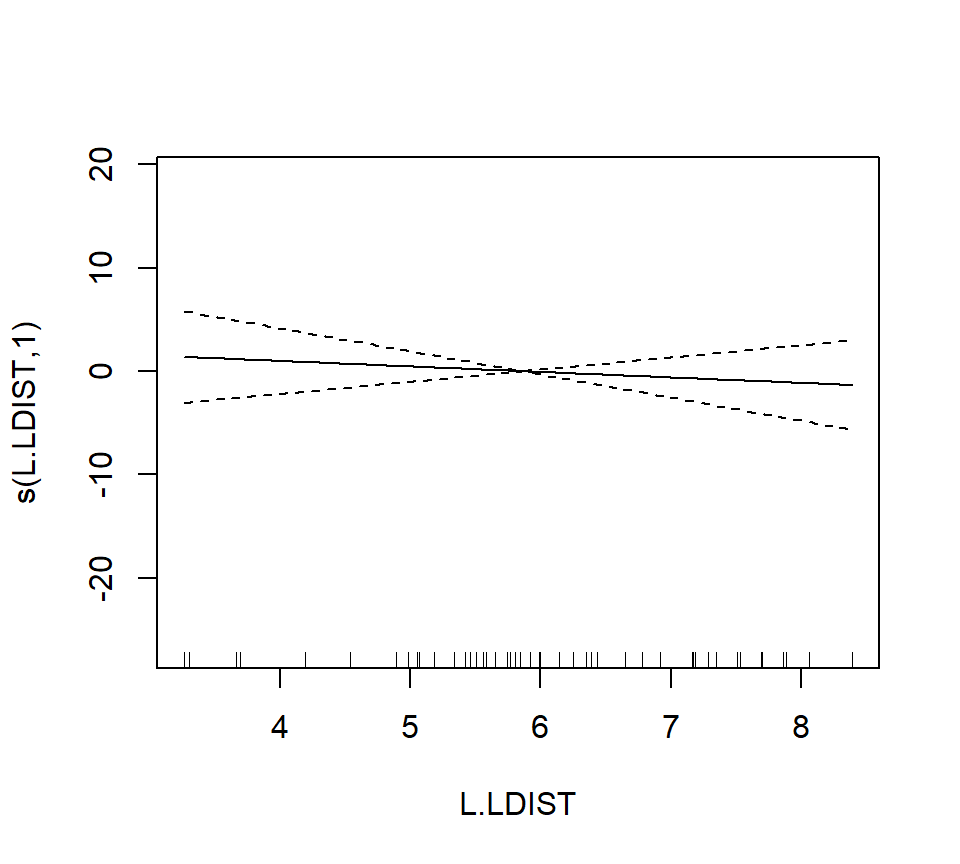
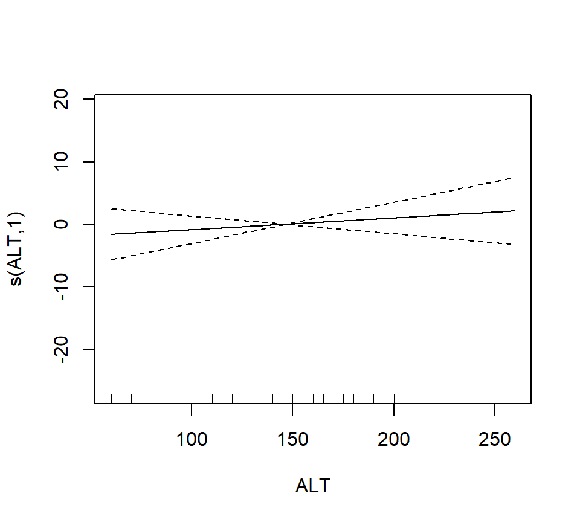
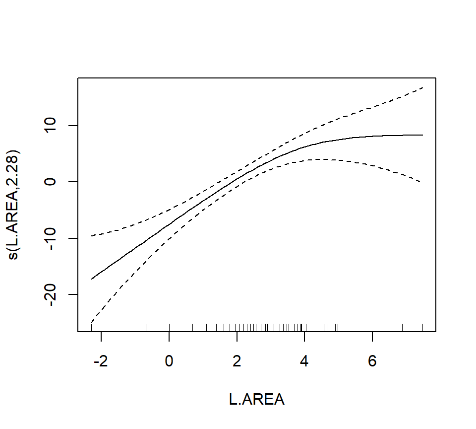
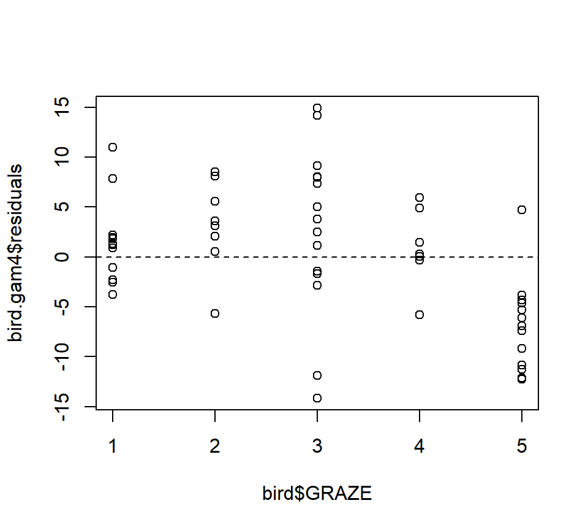

# (PART\*) Part II: Statistical learning {-}

# Smoothing


To this point, we have focused on models that generate a useful equation for the trend.  This model equation usually contains a small number of parameters that we hope to attach to scientific phenomena of interest.  In other words, we have been working in Breiman's "data-modeling culture".

This chapter is different.  Here, we focus on obtaining a curve (or its multi-dimensional equivalent) that characterizes the relationship between a predictor variable(s) and a response, but we don't necessarily care about finding a mathematical equation to capture this curve.  In other words, in this chapter we enter what Breiman describes as "algorithmic modeling", or what is more commonly known as machine learning.  The purpose of this chapter is to illustrate some machine-learning ideas ever so briefly to see how they compare with conventional statistical models.  

As a running example, we will consider a data set originally published by @gillibrand2007deep, and analyzed extensively in the textbook by @zuur2009mixed.  Zuur et al. say that these data describe the number of sources of "pelagic bioluminescence along a depth gradient in the northeast Atlantic Ocean."  We focus particulary on the data at station 16.  The pattern that we wish to characterize is shown below.

This chapter is in an early stage of development.


``` r
## download the data from the book's website
isit <- read.table("data/ISIT.txt", head = T)

## extract the data from station 16

st16 <- subset(isit, Station == 16)

## retain just the variables that we want, and rename

st16 <- st16[, c("SampleDepth", "Sources")]
names(st16) <- c("depth", "sources")
with(st16, plot(sources ~ depth))
```


## Nearest-neighbor methods

<!-- Some coding assistance in this section from ChatGPT 5. -->

The simplest of all possible smoothing methods is a $k$-nearest neighbor method.  For this method, the value of the smooth at a target depth ($x$) is given by the average of the response ($y$) values of the $k$ nearest observed depths to $x$. We implement this with `kknn::kknn()` using `kernel = "rectangular"`, which assigns equal weights to the `k` nearest neighbors.


``` r
depth_grid <- data.frame(depth = seq(min(st16$depth), max(st16$depth), length.out = 300))

fit_knn_grid <- function(train_df, new_df, k) {
  mod <- kknn::kknn(
    formula = sources ~ depth,
    train = train_df,
    test  = new_df,
    k     = k,
    kernel = "rectangular"
  )
  data.frame(depth = new_df$depth, fit = fitted(mod))
}
```


``` r
Ks_demo <- c(5, 15, 31)
cols <- 1:length(Ks_demo)  # base palette

par(mfrow = c(1, 3))

for (i in seq_along(Ks_demo)) {
  # Base scatter
  with(st16, plot(depth, sources, pch = 19, cex = 0.7,
       xlab = "Depth", ylab = "Sources"))
  
# Add k-NN smooth lines

  k <- Ks_demo[i]
  pred <- fit_knn_grid(st16, depth_grid, k)
  lines(pred$depth, pred$fit, lwd = 2, col = cols[i])
}

legend("topright", legend = paste("k =", Ks_demo),
       col = cols, lwd = 2, bty = "n")
```


As $k$ increases, the trend becomes smoother.

To find the best `k`, we use cross-validation.  Here, we evaluate a set of odd `k` values with 10-fold cross-validation and choose the `k` that minimizes out-of-fold SSE.  


``` r
set.seed(1)

n <- nrow(st16)
Kfold <- 10
fold_id <- sample(rep(1:Kfold, length.out = n))

# Compute the minimum possible training size across folds
fold_sizes <- as.numeric(table(fold_id))
min_train_size <- min(n - fold_sizes)  # worst-case training rows

# Cap k by this minimum training size (and by 61 as before), and use odd k >= 3
max_k_allowed <- max(3, min(61, min_train_size))
Ks <- seq(3, max_k_allowed, by = 2)

cv_mse <- numeric(length(Ks))
names(cv_mse) <- Ks

for (j in seq_along(Ks)) {
  k <- Ks[j]
  mse_fold <- numeric(Kfold)
  for (f in 1:Kfold) {
    train_df <- st16[fold_id != f, , drop = FALSE]
    test_df  <- st16[fold_id == f, , drop = FALSE]
    if (nrow(test_df) == 0 || nrow(train_df) < k) { 
      mse_fold[f] <- NA_real_; 
      next 
    }
    mod <- kknn::kknn(sources ~ depth, train = train_df, test = test_df,
                      k = k, kernel = "rectangular")
    mse_fold[f] <- mean((test_df$sources - as.numeric(fitted(mod)))^2, na.rm = TRUE)
  }
  cv_mse[j] <- mean(mse_fold, na.rm = TRUE)
}

best_k <- as.integer(names(cv_mse)[which.min(cv_mse)])
best_k
```

```
## [1] 3
```


``` r
plot(as.integer(names(cv_mse)), cv_mse, type = "b",
     xlab = "Number of Neighbors (k)", ylab = "Out-of-fold MSE",
     main = "10-fold CV to Choose k")
grid()
abline(v = best_k, lty = 2)
text(best_k, min(cv_mse, na.rm = TRUE), labels = paste("best k =", best_k),
     pos = 4, cex = 0.9)
```


In this case, cross-validations suggests we should set $k=3$!.  Here's the final fit with $k=3$.


``` r
pred_final <- fit_knn_grid(st16, depth_grid, best_k)

plot(st16$depth, st16$sources, pch = 19, cex = 0.7,
     xlab = "Depth", ylab = "Sources",
     main = paste("k-NN Smoother with CV-selected k =", best_k))
lines(pred_final$depth, pred_final$fit, lwd = 2)
```


## Loess smoothers

A loess smoother takes the logic of $k$-nearest neighbor fitting one step further. Now, instead of simply averaging the $k$ nearest neighbors, we fit a regression model to the nearest neighbors, and use the predicted value of the regression trend as our smooth.  "Loess" is an acronym for [lo]cal regr[ess]ion.  Nomenclature can be a bit frustrating with loess models. As we will see later, some versions of loess models use weighted least squares instead of ordinary least squares, and are called "lowess" models to emphasize the use of weighted least squares.   However, the basic `R` routine for fitting lo(w)ess models is called `loess`, but uses the weighted least-squares fitting with its default factory settings.  

Fit a loess smoother using the factory settings:


``` r
st16.lo <- loess(sources ~ depth, data = st16)
summary(st16.lo)
```

```
## Call:
## loess(formula = sources ~ depth, data = st16)
## 
## Number of Observations: 51 
## Equivalent Number of Parameters: 4.33 
## Residual Standard Error: 4.18 
## Trace of smoother matrix: 4.73  (exact)
## 
## Control settings:
##   span     :  0.75 
##   degree   :  2 
##   family   :  gaussian
##   surface  :  interpolate	  cell = 0.2
##   normalize:  TRUE
##  parametric:  FALSE
## drop.square:  FALSE
```

Plot the fit, this takes a little work

``` r
depth.vals <- with(st16, seq(from   = min(depth), 
                             to     = max(depth), 
                             length = 100))

st16.fit <- predict(object  = st16.lo,
                    newdata = depth.vals,
                    se      = TRUE)

with(st16, plot(sources ~ depth))
lines(x = depth.vals, y = st16.fit$fit, col = "blue")

# add 95% error bars
lines(x   = depth.vals, 
      y   = st16.fit$fit + st16.fit$se.fit * qt(p = .975, df = st16.fit$df),
      col = "blue",
      lty = "dashed")

lines(x   = depth.vals, 
      y   = st16.fit$fit - st16.fit$se.fit * qt(p = .975, df = st16.fit$df),
      col = "blue",
      lty = "dashed")
```


Examine the residuals:

``` r
## see what the fit returns; maybe the residuals are already there

names(st16.lo)  # they are!
```

```
##  [1] "n"         "fitted"    "residuals" "enp"       "s"         "one.delta"
##  [7] "two.delta" "trace.hat" "divisor"   "robust"    "pars"      "kd"       
## [13] "call"      "terms"     "xnames"    "x"         "y"         "weights"
```

``` r
plot(st16.lo$residuals ~ st16$depth)
abline(h = 0, lty = "dotted")
```



Let's look at how changing the span changes the fit.  We'll write a custom function to fit a LOESS curve, and then call the function with various values for the span.


``` r
PlotLoessFit <- function(x, y, return.fit = FALSE, ...){
  
  # Caluclates a loess fit with the 'loess' function, and makes a plot
  #
  # Args:
  #   x: predictor
  #   y: response
  #   return.fit: logical
  #   ...: Optional arguments to loess
  #
  # Returns:
  #   the loess fit
  
  my.lo <- loess(y ~ x, ...)
  
  x.vals <- seq(from = min(x), to = max(x), length = 100)
  
  my.fit <- predict(object  = my.lo,
                    newdata = x.vals,
                    se      = TRUE)
  
  plot(x, y)
  lines(x = x.vals, y = my.fit$fit, col = "blue")
  
  lines(x   = x.vals, 
        y   = my.fit$fit + my.fit$se.fit * qt(p = .975, df = my.fit$df),
        col = "blue",
        lty = "dashed")
  
  lines(x   = x.vals, 
        y   = my.fit$fit - my.fit$se.fit * qt(p = .975, df = my.fit$df),
        col = "blue",
        lty = "dashed")
  
  if (return.fit) {
    return(my.lo)
  }
}
```

Now we'll call the function several times, each time chanigng the value of the `span` argument to the `loess` function:


``` r
PlotLoessFit(x = st16$depth, y = st16$sources, span = 0.5)
```


``` r
PlotLoessFit(x = st16$depth, y = st16$sources, span = 0.25)
```


``` r
PlotLoessFit(x = st16$depth, y = st16$sources, span = 0.1)
```



Let's try a loess fit with a locally linear regression:


``` r
PlotLoessFit(x = st16$depth, y = st16$sources, span = 0.25, degree = 1)
```



## Splines

We'll use the `gam` function in the `mgcv` package to fit splines and additive models.  The name of the package is an acronym for "Mixed GAM Computation Vehicle".  GAM is an acronym for Generalized Additive Model.  **Warning**.  I do not understand much of the functionality of `mgcv::gam`.  What follows is my best guess of how the procedure works.

The code below fits a regression spline to the bioluminescence data.  Actually, the code fits an additive model with the spline as the only predictor. We will say more about additive models later.  For now, it is sufficient to think about an additive model as a type of regression in which the linear effect of the predictor has been replaced by a spline.  In other words, in terms of a word equation, the model can be represented as
$$
\mbox{response = intercept + spline + error}
$$

The `s()` component of the model formula designates a spline, and specifies details about the particular type of spline to be fit.  The `fx = TRUE` component of the formula indicates that the amount of smoothing is fixed.  The default value for the `fx` argument is `fx = FALSE`, in which case the amount of smoothing is determined by (generalized) cross-validation.  When `fx = TRUE`, the parameter `k` determines the dimensionality (degree of flexibility) of the spline.  Larger values of `k` correspond to greater flexibility, and a less smooth fit.  I think that the number of knots is $k-4$, such that setting $k=4$ fits a familiar cubic polynomial with no knots.  Setting $k=5$ then fits a regression spline with one knot, etc.  I have not been able to figure out where the knots are placed.

In any case, we'll fit a regression spline with two knots:


``` r
library(mgcv)
```

```
## Loading required package: nlme
```

```
## This is mgcv 1.9-3. For overview type 'help("mgcv-package")'.
```

``` r
st16.rspline <- mgcv::gam(sources ~ s(depth, k = 6, fx = TRUE), data = st16)
plot(st16.rspline, se = TRUE)
```


Note that the plot includes only the portion of the model attributable to the covariate effect.  This is because we have actually fit an additive model (e.g., a GAM).  

The plot shows only the spline component, which thus does not include the intercept. To visualize the fit, we'll need to do a bit more work.

``` r
with(st16, plot(sources ~ depth))  

st16.fit <- predict(st16.rspline, 
                    newdata = data.frame(depth = depth.vals), 
                    se      = TRUE)

lines(x = depth.vals, y = st16.fit$fit)

## add +/- 2 SE following Zuur; this is only approximate.
## should probably use a critical value from a t-dist with n - edf df, that is, 51 - 5 = 46 df

lines(x = depth.vals, y = st16.fit$fit + 2 * st16.fit$se.fit, lty = "dashed")
lines(x = depth.vals, y = st16.fit$fit - 2 * st16.fit$se.fit, lty = "dashed")
```


We see that this particular fit is not flexible enough to capture the trend in luminescence at low depth.

Let's take a look at the information produced by a call to `summary`:


``` r
summary(st16.rspline)
```

```
## 
## Family: gaussian 
## Link function: identity 
## 
## Formula:
## sources ~ s(depth, k = 6, fx = TRUE)
## 
## Parametric coefficients:
##             Estimate Std. Error t value Pr(>|t|)    
## (Intercept)  12.4771     0.5858    21.3   <2e-16 ***
## ---
## Signif. codes:  0 '***' 0.001 '**' 0.01 '*' 0.05 '.' 0.1 ' ' 1
## 
## Approximate significance of smooth terms:
##          edf Ref.df     F p-value    
## s(depth)   5      5 122.6  <2e-16 ***
## ---
## Signif. codes:  0 '***' 0.001 '**' 0.01 '*' 0.05 '.' 0.1 ' ' 1
## 
## R-sq.(adj) =  0.924   Deviance explained = 93.2%
## GCV = 19.837  Scale est. = 17.503    n = 51
```

This summary requires a bit more explanation as well.  In this GAM, the spline component of the model effectively creates a set of new predictor variables.  A regression spline with $x$ knots requires $x+3$ new regression predictors to fit the spline.  In this fit, there are two knots, so the spline requires 5 new predictor variables. Because the predictors are determined in advance with regression splines, we can use the usual theory of $F$-tests from regression to assess the statistical significance of the spline terms.  In the section of the output labeled "Approximate significance of smooth terms", we see that these 5 predictors together provide a significantly better fit than a model that does not include the spline.  I believe this test is actually exact.  I think that it is labeled "approximate" because the default behavior of `mgcv::gam` is to fit a smoothing spline, for which the test is indeed only approximate.  We'll discuss this more when we study a smoothing spline fit.

Now we'll fit and plot a smoothing spline.  A smoothing spline differs from a regression spline by using generalized cross-validation to determine the appropriate smoothness.

``` r
st16.spline <- mgcv::gam(sources ~ s(depth), data = st16)
plot(st16.spline, se = TRUE)  # note that the plot does not include the intercept
```


Again, we make a plot that includes both the points and the fit


``` r
with(st16, plot(sources ~ depth))  

st16.fit <- predict(st16.spline, 
                    newdata = data.frame(depth = depth.vals), 
                    se      = TRUE)

lines(x = depth.vals, y = st16.fit$fit)

## add +/- 2 SE following Zuur; this is only approximate.
## should probably use a critical value from a t-dist with n - edf df, that is, 51 - 9.81 = 41.19 df

lines(x = depth.vals, y = st16.fit$fit + 2 * st16.fit$se.fit, lty = "dashed")
lines(x = depth.vals, y = st16.fit$fit - 2 * st16.fit$se.fit, lty = "dashed")
```


Let's ask for a summary:

``` r
summary(st16.spline)
```

```
## 
## Family: gaussian 
## Link function: identity 
## 
## Formula:
## sources ~ s(depth)
## 
## Parametric coefficients:
##             Estimate Std. Error t value Pr(>|t|)    
## (Intercept)  12.4771     0.3921   31.82   <2e-16 ***
## ---
## Signif. codes:  0 '***' 0.001 '**' 0.01 '*' 0.05 '.' 0.1 ' ' 1
## 
## Approximate significance of smooth terms:
##            edf Ref.df     F p-value    
## s(depth) 8.813   8.99 158.2  <2e-16 ***
## ---
## Signif. codes:  0 '***' 0.001 '**' 0.01 '*' 0.05 '.' 0.1 ' ' 1
## 
## R-sq.(adj) =  0.966   Deviance explained = 97.2%
## GCV = 9.7081  Scale est. = 7.8402    n = 51
```

Note especially the `edf` component in the "Approximate significance of smooth terms" section.  The label `edf` stands for effective degrees of freedom.  We can think of the edf as the effective number of new predictors that have been added to the model to accommodate the spline.  For a smoothing spline, the number and values of the newly created predictors are determined by fitting the model to the data.  Because the predictors are calculated in this way, the usual theory of $F$-testing does not apply.  This is why the $F$-test shown for the smoothing spline is labeled as "approximate".  

Find the AIC for the smoothing spline fit:


``` r
AIC(st16.spline)
```

```
## [1] 260.4811
```
Here's a small detail.  Notice that the syntax of the call to `predict` is slightly different when making a prediction for a `loess`  object vs.\ making a prediction for a `gam` object (which the spline fit is).  For a call to `predict` with a `loess` object, the new predictor values can be provided in the form of a vector.  So, we were able to use

``` r
depth.vals <- with(st16, seq(from   = min(depth), 
                             to     = max(depth), 
                             length = 100))

st16.fit <- predict(object  = st16.lo,
                    newdata = depth.vals,
                    se      = TRUE)
```

However, for a call to `predict` with a `gam` object, the new predictor values must be provided in the form of a new data frame, with variable names that match the variables in the `gam` model.  So, to get predicted values for the spline fit, we needed to use the more cumbersome


``` r
depth.vals <- with(st16, seq(from   = min(depth), 
                             to     = max(depth), 
                             length = 100))

st16.fit <- predict(st16.spline, 
                    newdata = data.frame(depth = depth.vals), 
                    se      = TRUE)
```

## Generalized additive models (GAMs)

Generalized additive models replace the usual linear terms that appear in multiple regression models with splines.  That is, suppose we seek to model the relationship between a response $y$ and two predictors, $x_1$ and $x_2$.  A standard regression model without polynomial effects or interactions would be written as 
$$
y = \beta_0 + \beta_1 x_1 +\beta_2 x_2 + \varepsilon
$$
where $\varepsilon$ is assumed to be an iid Gaussian random variate with variance $\sigma^2_\varepsilon$.  This is an additive model, in the sense that the combined effects of the two predictors equal the sum of their individual effects.  

A generalized additive model (GAM) replaces the individual regression terms with splines.  Continuing with the generic example, a GAM would instead model the effects of the two predictors as
$$
y = \beta_0 + s(x_1) +s(x_2) + \varepsilon
$$
where $s(\cdot)$ represents a spline.  We continue to assume that, conditional on the covariate effects, the responses are normally distributed with constant variance $\sigma^2_\varepsilon$.  

We will illustrate additive modeling using the bird data found in Appendix A of @zuur2009mixed.  Zuur et al. report that these data originally appeared in Loyn (1987) and were featured in Quinn & Keough (2002)'s text.  Zuur et al. describe these data in the following way:

> Forest bird densities were measured in 56 forest patches in south-eastern Victoria, Australia. The aim of the study was to relate bird densities to six habitat variables; size of the forest patch, distance to the nearest patch, distance to the nearest larger patch, mean altitude of the patch, year of isolation by clearing, and an index of stock grazing history (1 = light, 5 = intensive).

We first read the data and perform some light exploratory analysis and housekeeping.


``` r
rm(list = ls())
require(mgcv)

bird <- read.table("data/Loyn.txt", head = T)

summary(bird)
```

```
##       Site           ABUND            AREA              DIST       
##  Min.   : 1.00   Min.   : 1.50   Min.   :   0.10   Min.   :  26.0  
##  1st Qu.:14.75   1st Qu.:12.40   1st Qu.:   2.00   1st Qu.:  93.0  
##  Median :28.50   Median :21.05   Median :   7.50   Median : 234.0  
##  Mean   :28.50   Mean   :19.51   Mean   :  69.27   Mean   : 240.4  
##  3rd Qu.:42.25   3rd Qu.:28.30   3rd Qu.:  29.75   3rd Qu.: 333.2  
##  Max.   :56.00   Max.   :39.60   Max.   :1771.00   Max.   :1427.0  
##      LDIST           YR.ISOL         GRAZE            ALT       
##  Min.   :  26.0   Min.   :1890   Min.   :1.000   Min.   : 60.0  
##  1st Qu.: 158.2   1st Qu.:1928   1st Qu.:2.000   1st Qu.:120.0  
##  Median : 338.5   Median :1962   Median :3.000   Median :140.0  
##  Mean   : 733.3   Mean   :1950   Mean   :2.982   Mean   :146.2  
##  3rd Qu.: 913.8   3rd Qu.:1966   3rd Qu.:4.000   3rd Qu.:182.5  
##  Max.   :4426.0   Max.   :1976   Max.   :5.000   Max.   :260.0
```

``` r
# get rid of the 'Site' variable; it is redundant with the row label

bird <- bird[, -1]

# log-transform area, distance, ldistance, to remove right-skew

bird$L.AREA <- log(bird$AREA)
bird$L.DIST <- log(bird$DIST)
bird$L.LDIST <- log(bird$LDIST)

# change YR.ISOL to years since isolation (study was published in 1987)

bird$YR.ISOL <- 1987 - bird$YR.ISOL

# keep the only the variables we want

bird <- bird[, c("ABUND", "L.AREA", "L.DIST", "L.LDIST", "YR.ISOL", "ALT", "GRAZE")]
summary(bird)
```

```
##      ABUND           L.AREA            L.DIST         L.LDIST     
##  Min.   : 1.50   Min.   :-2.3026   Min.   :3.258   Min.   :3.258  
##  1st Qu.:12.40   1st Qu.: 0.6931   1st Qu.:4.533   1st Qu.:5.064  
##  Median :21.05   Median : 2.0127   Median :5.455   Median :5.824  
##  Mean   :19.51   Mean   : 2.1459   Mean   :5.102   Mean   :5.859  
##  3rd Qu.:28.30   3rd Qu.: 3.3919   3rd Qu.:5.809   3rd Qu.:6.816  
##  Max.   :39.60   Max.   : 7.4793   Max.   :7.263   Max.   :8.395  
##     YR.ISOL           ALT            GRAZE      
##  Min.   :11.00   Min.   : 60.0   Min.   :1.000  
##  1st Qu.:21.00   1st Qu.:120.0   1st Qu.:2.000  
##  Median :24.50   Median :140.0   Median :3.000  
##  Mean   :37.25   Mean   :146.2   Mean   :2.982  
##  3rd Qu.:59.50   3rd Qu.:182.5   3rd Qu.:4.000  
##  Max.   :97.00   Max.   :260.0   Max.   :5.000
```

Our first attempt at a GAM will entertain smoothing splines for all of the continuous predictors in the model.  We will use a linear term for GRAZE because there are too few unique values to support a smooth term:

``` r
bird.gam1 <- mgcv::gam(ABUND ~ s(L.AREA) + s(L.DIST) + s(L.LDIST) + s(YR.ISOL) + GRAZE + s(ALT), data = bird)

summary(bird.gam1)
```

```
## 
## Family: gaussian 
## Link function: identity 
## 
## Formula:
## ABUND ~ s(L.AREA) + s(L.DIST) + s(L.LDIST) + s(YR.ISOL) + GRAZE + 
##     s(ALT)
## 
## Parametric coefficients:
##             Estimate Std. Error t value Pr(>|t|)    
## (Intercept)  25.4443     2.7798   9.153 9.42e-12 ***
## GRAZE        -1.9885     0.8968  -2.217   0.0318 *  
## ---
## Signif. codes:  0 '***' 0.001 '**' 0.01 '*' 0.05 '.' 0.1 ' ' 1
## 
## Approximate significance of smooth terms:
##              edf Ref.df      F  p-value    
## s(L.AREA)  2.446  3.089 12.635 3.98e-06 ***
## s(L.DIST)  3.693  4.559  0.855    0.461    
## s(L.LDIST) 1.000  1.000  0.386    0.538    
## s(YR.ISOL) 1.814  2.238  1.231    0.262    
## s(ALT)     1.000  1.000  0.629    0.432    
## ---
## Signif. codes:  0 '***' 0.001 '**' 0.01 '*' 0.05 '.' 0.1 ' ' 1
## 
## R-sq.(adj) =   0.72   Deviance explained = 77.6%
## GCV = 40.987  Scale est. = 32.238    n = 56
```

The output reports the partial regression coefficient for the lone quantitative predictor GRAZE, and approximate significance tests for the smooth terms for each of the other predictors.  We can visualize these smooth terms with a call to `plot`:

``` r
plot(bird.gam1)
```



In the interest of time, we take a casual approach to variable selection here.  We'll drop smooth terms that are clearly not significant to obtain:

``` r
bird.gam2 <- mgcv::gam(ABUND ~ s(L.AREA) + GRAZE, data = bird)
summary(bird.gam2)
```

```
## 
## Family: gaussian 
## Link function: identity 
## 
## Formula:
## ABUND ~ s(L.AREA) + GRAZE
## 
## Parametric coefficients:
##             Estimate Std. Error t value Pr(>|t|)    
## (Intercept)   28.400      2.201  12.903  < 2e-16 ***
## GRAZE         -2.980      0.686  -4.344 6.56e-05 ***
## ---
## Signif. codes:  0 '***' 0.001 '**' 0.01 '*' 0.05 '.' 0.1 ' ' 1
## 
## Approximate significance of smooth terms:
##             edf Ref.df     F p-value    
## s(L.AREA) 2.284  2.903 13.18 3.4e-06 ***
## ---
## Signif. codes:  0 '***' 0.001 '**' 0.01 '*' 0.05 '.' 0.1 ' ' 1
## 
## R-sq.(adj) =   0.68   Deviance explained = 69.9%
## GCV = 39.992  Scale est. = 36.932    n = 56
```

``` r
plot(bird.gam2)
```



Note that the GRAZE variable is currently treated as a numerical predictor.  We'll try fitting a model with GRAZE as a factor.  First we'll create a new variable that treats GRAZE as a factor.  We'll use the `summary` command to confirm that the new variable fGRAZE is indeed a factor.

``` r
bird$fGRAZE <- as.factor(bird$GRAZE)
summary(bird)
```

```
##      ABUND           L.AREA            L.DIST         L.LDIST     
##  Min.   : 1.50   Min.   :-2.3026   Min.   :3.258   Min.   :3.258  
##  1st Qu.:12.40   1st Qu.: 0.6931   1st Qu.:4.533   1st Qu.:5.064  
##  Median :21.05   Median : 2.0127   Median :5.455   Median :5.824  
##  Mean   :19.51   Mean   : 2.1459   Mean   :5.102   Mean   :5.859  
##  3rd Qu.:28.30   3rd Qu.: 3.3919   3rd Qu.:5.809   3rd Qu.:6.816  
##  Max.   :39.60   Max.   : 7.4793   Max.   :7.263   Max.   :8.395  
##     YR.ISOL           ALT            GRAZE       fGRAZE
##  Min.   :11.00   Min.   : 60.0   Min.   :1.000   1:13  
##  1st Qu.:21.00   1st Qu.:120.0   1st Qu.:2.000   2: 8  
##  Median :24.50   Median :140.0   Median :3.000   3:15  
##  Mean   :37.25   Mean   :146.2   Mean   :2.982   4: 7  
##  3rd Qu.:59.50   3rd Qu.:182.5   3rd Qu.:4.000   5:13  
##  Max.   :97.00   Max.   :260.0   Max.   :5.000
```

Now we'll proceed to fit the model

``` r
bird.gam3 <- gam(ABUND ~ s(L.AREA) + fGRAZE, data = bird)
plot(bird.gam3)
```


``` r
summary(bird.gam3)
```

```
## 
## Family: gaussian 
## Link function: identity 
## 
## Formula:
## ABUND ~ s(L.AREA) + fGRAZE
## 
## Parametric coefficients:
##               Estimate Std. Error t value Pr(>|t|)    
## (Intercept)  22.727275   1.944080  11.691 1.11e-15 ***
## fGRAZE2       0.006623   2.845343   0.002 0.998152    
## fGRAZE3      -0.660124   2.585878  -0.255 0.799592    
## fGRAZE4      -2.170994   3.050736  -0.712 0.480122    
## fGRAZE5     -11.913966   2.872911  -4.147 0.000136 ***
## ---
## Signif. codes:  0 '***' 0.001 '**' 0.01 '*' 0.05 '.' 0.1 ' ' 1
## 
## Approximate significance of smooth terms:
##             edf Ref.df     F  p-value    
## s(L.AREA) 2.761  3.478 11.67 4.71e-06 ***
## ---
## Signif. codes:  0 '***' 0.001 '**' 0.01 '*' 0.05 '.' 0.1 ' ' 1
## 
## R-sq.(adj) =  0.723   Deviance explained = 75.7%
## GCV = 37.013  Scale est. = 31.883    n = 56
```

To formally compare the models with GRAZE as a numerical vs.\ categorical predictor, we'll have to use AIC.  We can't use an $F$-test here because we have used smoothing splines to capture the effect of L.AREA.  Thus, the models are not nested.  (If we had used regression splines for L.AREA, then the models would have been nested.)  We can extract the AICs for these models by a simple call to the `AIC` function.


``` r
AIC(bird.gam2)
```

```
## [1] 367.1413
```

``` r
AIC(bird.gam3)
```

```
## [1] 361.9655
```

<!-- Compare the design matrices for these two models (only the first few rows of each matrix are shown in this transcript): -->
<!-- ```{r} -->
<!-- head(model.matrix(bird.gam3)) -->
<!-- head(model.matrix(bird.gam4)) -->
<!-- ``` -->
We can see the contrasts used to incorporate the factor fGRAZE in the model by a call to `contrasts`:

``` r
with(bird, contrasts(fGRAZE))
```

```
##   2 3 4 5
## 1 0 0 0 0
## 2 1 0 0 0
## 3 0 1 0 0
## 4 0 0 1 0
## 5 0 0 0 1
```

The output here is somewhat opaque because the levels of fGRAZE are 1, 2, $\ldots$, 5.  The output of the call to `contrasts` shows each of the newly created indicator variables as a column.  For example, the first column shows that the predictor named `fGRAZE2` takes the value of 1 when the variable fGRAZE equals 2, and is 0 otherwise.

Fit an additive model with only a smooth effect of L.AREA, in order to show residuals vs.\ GRAZE:

``` r
bird.gam4 <- gam(ABUND ~ s(L.AREA), data = bird)

plot(x = bird$GRAZE, y = bird.gam4$residuals)
abline(h = 0, lty = "dashed")
```



Both the plot and the model output suggest that the effect of grazing is primarily due to lower bird abundance in the most heavily grazed category.

To conclude, we'll conduct a formal test of whether the model with GRAZE as a factor provides a significantly better fit than the model with a linear effect of GRAZE.  In this case, we have to use regression splines for the smooth effect of L.AREA.  We'll use regression "splines" without any internal knots, (which are actually not splines at all, just a cubic trend) because the effect of log area seems to be reasonably well captured by a cubic trend anyway:

``` r
bird.gam5 <- gam(ABUND ~ s(L.AREA, k = 4, fx = TRUE) + GRAZE, data = bird)
bird.gam6 <- gam(ABUND ~ s(L.AREA, k = 4, fx = TRUE) + fGRAZE, data = bird)

anova(bird.gam5, bird.gam6, test = "F")  
```

```
## Analysis of Deviance Table
## 
## Model 1: ABUND ~ s(L.AREA, k = 4, fx = TRUE) + GRAZE
## Model 2: ABUND ~ s(L.AREA, k = 4, fx = TRUE) + fGRAZE
##   Resid. Df Resid. Dev Df Deviance      F  Pr(>F)  
## 1        51     1869.0                             
## 2        48     1543.1  3   325.93 3.3796 0.02565 *
## ---
## Signif. codes:  0 '***' 0.001 '**' 0.01 '*' 0.05 '.' 0.1 ' ' 1
```

Both AIC and the $F$-test suggest that the model with GRAZE as a factor provides a significantly better fit than the model with a linear effect of GRAZE ($F_{3,48} = 3.38, p = 0.026$).

As a final note, Zuur et al. (p.550) observe that "the non-linear L.AREA effect is mainly due to two large patches. It would be useful to sample more of this type of patch in the future."  (Note the rug plots in any of the plots of the area effect above.)
