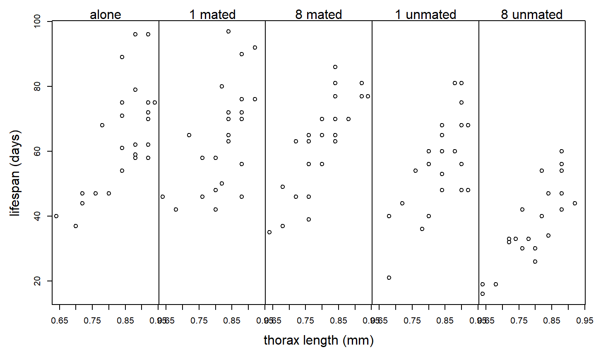
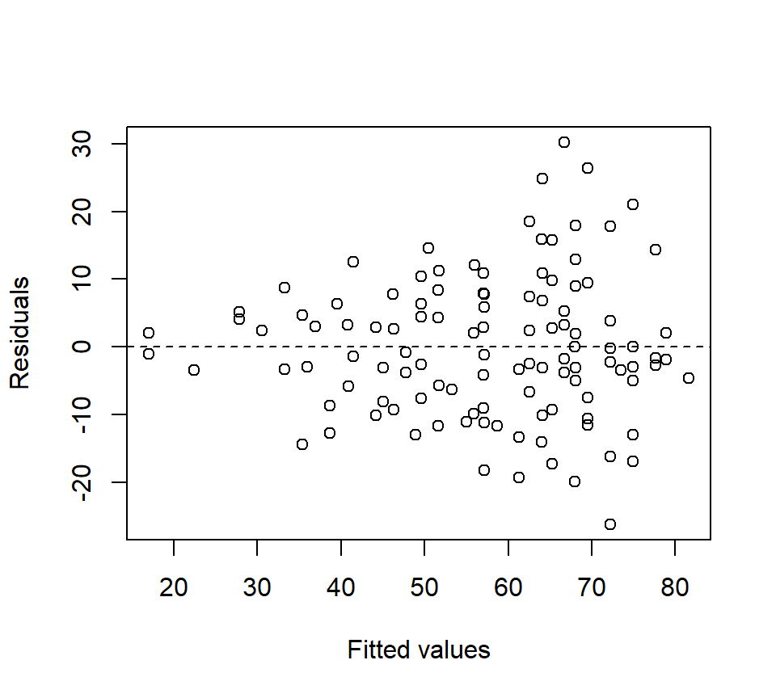
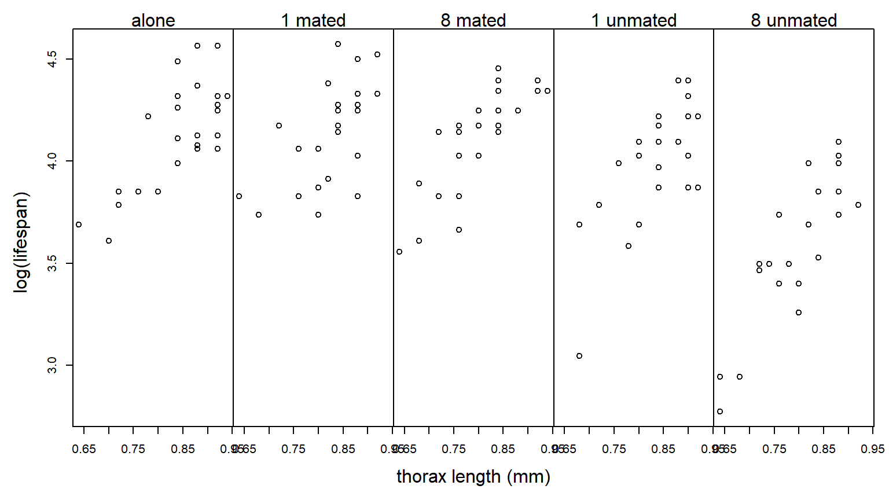

# ANCOVA


Statistical tests compare the estimated magnitude of a treatment effect to the precision with which that effect is estimated.  Often, the magnitude of a treatment effect is set by nature.  Thus, if we want to increase our chances of observing a statistically significant result, we must find ways to make our estimates more precise.  Statistical precision is a function of (a) the degree of replication and (b) the experimental error.  Thus, precision can be improved by including more replicates or reducing experimental error.

One technique for reducing experimental error and hence increasing precision is to use a covariate that accounts for heterogeneity among EUs.  Inclusion of covariates in ANOVA models is called the analysis of covariance, or ANCOVA.  Mathematically, ANCOVA is no different from regression with both quantitative and categorical predictors.  However, the emphases differ depending on the context.  In ANCOVA, our primary focus is analyzing the differences among the treatment groups.  We model the relationship between the response and the covariate to gain a more precise estimate of the differences among treatment groups, but the relationship between the response and the covariate is of secondary interest at best.  In regression, both quantitative and categorical predictors are on equal footing, and we have no reason to prioritize one versus the other. 

Example:  @partridge1981sexual; as reported in Hanley \& Shapiro, (1994) conducted an experiment to determine if increased reproduction reduces longevity in male fruitflies.  (Such a cost had already been established for females.)  There were 5 experimental treatments: male fruitflies reared alone, reared with 1 or 8 non-mated females, and reared with 1 or 8 recently mated females.  25 male flies were assigned to each treatment.  The data recorded are longevity (days lived) and thorax length.  The data are shown below:


Suppose we analyze these data with a one-way ANOVA and ignore differences in the sizes of the flies:

```{}
proc glm;
  class trt;
  model life = trt;
run;

The GLM Procedure
Dependent Variable: life

                                        Sum of
Source                      DF         Squares     Mean Square    F Value    Pr > F
Model                        4     11939.28000      2984.82000      13.61    <.0001
Error                      120     26313.52000       219.27933
Corrected Total            124     38252.80000

Source                      DF     Type III SS     Mean Square    F Value    Pr > F
trt                          4     11939.28000      2984.82000      13.61    <.0001
```

Although the $F$-test for treatment is significant, notice that $MS_{Error} = 219.3$.  Of course, the plot above suggests that much of the variation in lifespan among flies in the same treatment group can be explained by variation in fly size.  Suppose we include thorax size as a covariate:

```{}
proc glm;
  class trt;
  model life = thorax trt;
run;

The GLM Procedure
Dependent Variable: life

Sum of
Source                      DF         Squares     Mean Square    F Value    Pr > F
Model                        5     25108.13347      5021.62669      45.46    <.0001
Error                      119     13144.66653       110.45938
Corrected Total            124     38252.80000

Source                      DF     Type III SS     Mean Square    F Value    Pr > F
thorax                       1     13168.85347     13168.85347     119.22    <.0001
trt                          4      9611.49254      2402.87314      21.75    <.0001
```

The experimental error has been cut in half: $MS_{Error} = 110.5$.  The experimental error has been reduced because the covariate thorax size has accounted for half of the previously unexplained variation.  Note that including the covariate is also "cheap", in the sense that it only costs a single df.


This is an example of an Analysis of Covariance (ANCOVA) model.  We can write the model using the following mathematical notation:

* $y_{ij}$:  observation $j$ from treatment group $i$
* $x_{ij}$:  value of the covariate for observation $j$ from treatment group $i$

Equipped with this notation, we can write the model as
\[
y_{ij} =\mu +\alpha_{i} +\beta x_{ij} +\varepsilon_{ij} 
\] 
where $\mu$ is the reference level,  $\alpha_i$ is the effect parameter for group $i$ (subject to one of the standard constraints), $\beta$ is a regression slope that quantifies the (linear) relationship between the covariate and the response, and $\varepsilon_{ij}$ is the residual error with the standard assumptions (independence, normality, equal variance).  

Geometrically, we can think of this model as specifying a regression line for each level of the experimental treatment.  Importantly, without an interaction between the treatment and the covariate, the lines are parallel and differ only in their intercept.  That is to say, the differences among the various treatments are the same regardless of the value of the covariate.  We have encountered this type of model before in a regression context.  In ANCOVA, our primary interest is in testing for a treatment effect after using the covariate to control for variability among EUs.

Before going any further with the fly data, we observe that residual plots clearly indicate a non-constant variance problem.  (Notice that the inclusion of a covariate makes the residual plots substantially richer.)  Here is how we might generate a plot of residuals vs. fitted values in PROC GLM and PROC GPLOT:

```{}
proc glm;
  class trt;
  model life = thorax trt;
  output out=flyout p=pred r=resid;
run;

proc gplot data = flyout;
  plot resid * pred / vref = 0;
run;
```



Log-transforming the response stabilizes the variance nicely:

We re-do the analysis with a log-transformed response:

```{}
proc glm;
  class trt;
  model loglife = thorax trt;
run;

The GLM Procedure
Dependent Variable: loglife

                                        Sum of
Source                      DF         Squares     Mean Square    F Value    Pr > F
Model                        5      2.01797568      0.40359514      57.43    <.0001
Error                      119      0.83630432      0.00702777
Corrected Total            124      2.85428000

Source                      DF     Type III SS     Mean Square    F Value    Pr > F
thorax                       1      1.03374368      1.03374368     147.09    <.0001
trt                          4      0.78904783      0.19726196      28.07    <.0001
```

The residual plot looks much better:

The Type III SS can be used for $F$-tests that test for a treatment effect ($H_0$: $\alpha_{1} =\alpha_{2} =...=\alpha_{p} =0$) and to test for the significance of the linear relationship between the covariate and the response ($H_0$: $\beta=0$).  Again, our main interest is in comparing the treatment groups.  Here, the $F$-test for the treatment groups suggests that there is strong evidence of an effect of treatment on longevity ($F_{4,119}=28.07$, $p<.0001$).

In ANOVA, we spent substantial energy analyzing the average responses for the different treatment groups.  In ANCOVA, we expect the average response for a treatment group to depend on the value of the covariate.  Thus, we can define {\em covariate-adjusted treatment means} (or what we might just call adjusted treatment means) as the average response for a given treatment group, and for a given value of the covariate.  In notation, we might write the adjusted treatment mean for treatment group $i$ and covariate value $x$ as $\mu_i \left(x\right)$ .  We can estimate this adjusted treatment mean in the following way:
\[
\hat{\mu }_i \left(x\right)=\bar{y}_{i+} -\hat{\beta }(\bar{x}_{i+} -x)
\] 
The default choice is to calculate an adjusted treatment mean at the average value of the covariate observed in the data set, that is, 
\[
\hat{\mu }_i \left(\bar{x}_{++} \right)=\bar{y}_{i+} -\hat{\beta }(\bar{x}_{i+} -\bar{x}_{++} )
\] 
We can find the value of $\hat{\beta }$ using the SOLUTION option to the MODEL statement in PROC GLM.  We can find the raw treatment means and the means of the covariate values using the MEANS statement:

```{}
proc glm data = fly;
  class trt;
  model loglife = trt thorax / solution;
  means trt;
run;

                                       Standard
Parameter            Estimate             Error    t Value    Pr > |t|

Intercept         0.600921260 B      0.08112643       7.41      <.0001
trt       a       0.181879457 B      0.02397873       7.59      <.0001
trt       m1      0.204394280 B      0.02384687       8.57      <.0001
trt       m8      0.219661249 B      0.02371772       9.26      <.0001
trt       u1      0.127954099 B      0.02400289       5.33      <.0001
trt       u8      0.000000000 B       .                .         .
thorax            1.203348424        0.09921873      12.13      <.0001

NOTE: The X'X matrix has been found to be singular, and a generalized inverse was used to
solve the normal equations.  Terms whose estimates are followed by the letter 'B'
are not uniquely estimable.

The GLM Procedure

Level of            -----------loglife-----------     ------------thorax-----------
trt           N             Mean          Std Dev             Mean          Std Dev

a            25       1.78880000       0.11515642       0.83600000       0.08426150
m1           25       1.79880000       0.10763828       0.82560000       0.06988562
m8           25       1.79000000       0.11221260       0.80560000       0.08155162
u1           25       1.73680000       0.13145722       0.83760000       0.07055022
u8           25       1.56360000       0.15231218       0.80000000       0.07831560
```

For example, suppose we were to calculate the adjusted treatment mean for the flies reared alone.  Our calculation (using the log-transformed data) gives
\begin{eqnarray*}
	\hat{\mu }_i \left(\bar{x}_{++} \right) & = & \bar{y}_{i+} -\hat{\beta }(\bar{x}_{i+} -\bar{x}_{++} ) \\
	& = &  1.789-(1.203) \times (0.836-0.821) \\ 
	& = &  1.771 
\end{eqnarray*}
Notice that flies assigned to the alone treatment were slightly larger than the other flies in the experiment.  Because there is a positive association between size and lifetime, the adjusted treatment mean for the alone treatment should be slightly *less* than the raw mean.  In PROC GLM, we can calculate adjusted treatment means using the LSMEANS statement.  We can also perform multiple comparisons among the adjusted treatment means, although the syntax differs a bit:

```{}
proc glm data = fly;
  class trt;
  model loglife = trt thorax;
  lsmeans trt / pdiff adjust = tukey;
run;	

The GLM Procedure
Least Squares Means
Adjustment for Multiple Comparisons: Tukey-Kramer

loglife      LSMEAN
trt          LSMEAN      Number

a        1.77070164           1
m1       1.79321646           2
m8       1.80848343           3
u1       1.71677628           4
u8       1.58882218           5

Least Squares Means for effect trt
Pr > |t| for H0: LSMean(i)=LSMean(j)

Dependent Variable: loglife

i/j           1             2             3             4             5
1                      0.8771        0.5127        0.1606        <.0001
2        0.8771                      0.9679        0.0140        <.0001
3        0.5127        0.9679                      0.0019        <.0001
4        0.1606        0.0140        0.0019                      <.0001
5        <.0001        <.0001        <.0001        <.0001
```

We can also calculate adjusted treatment means using the parameters of the effects model:
\begin{eqnarray*}
\hat{\mu }_i \left(\bar{x}_{++} \right) & = &  \hat{\mu }+\hat{\alpha }_i +\hat{\beta }\bar{x}_{++} \\ 
& = & 0.601 + 0.182 + 1.203 \times 0.821 \\
& = & 1.771
\end{eqnarray*} 
This is the calculation that the LSMEANS statement performs.

Finally, note that the $F$-test for the treatment groups tests the null hypothesis that the adjusted treatment means are equal, that is,  $H_{0} :\mu_{1} \left(\bar{x}_{++} \right)=\mu_{2} \left(\bar{x}_{++} \right)=...=\mu_{g} \left(\bar{x}_{++} \right)$.

*Caution:*  Covariates should {\em not} be affected or influenced by the treatment itself.  In an experimental study, a good way to ensure that the covariate is not influenced by the treatment is to measure the covariate before assigning treatments to EUs.  If the covariate is affected by the treatment (as may be the case in an observational study), it is best to treat the covariate as a separate response.  

If the relationship between the covariate and the response is different for different treatment levels, then we need to fit a model that allows the regression lines to be non-parallel.  Non-parallel lines can be accommodated in an ANCOVA model by including an interaction between the covariate and the treatment factor:
```{}
proc glm;
  class trt;
  model loglife = thorax | trt;
run; 

The GLM Procedure
Dependent Variable: loglife

                                        Sum of
Source                      DF         Squares     Mean Square    F Value    Pr > F
Model                        9      2.05753663      0.22861518      33.00    <.0001
Error                      115      0.79674337      0.00692820
Corrected Total            124      2.85428000

Source                      DF     Type III SS     Mean Square    F Value    Pr > F
thorax                       1      1.00724047      1.00724047     145.38    <.0001
trt                          4      0.07751033      0.01937758       2.80    0.0293
thorax*trt                   4      0.03956095      0.00989024       1.43    0.2293
```

The $F$-test associated with the interaction is a test of $H_0$: the parallel slopes model vs.\ $H_a$: the non-parallel slopes model.  Here, the large $p$-value indicates that there is no evidence against the parallel slopes model (in other words, there is no evidence that the effect of thorax length on fruitfly longevity differs among the 5 treatment groups).

In notation, the non-parallel slopes model can be written:
\[
y_{ij} =\mu +\alpha _i +\left(\beta +\delta _i \right)x_{ij} +\varepsilon_{ij} 
\] 
Here, we interpret $\beta$ as a reference level for the slope, and $\delta_i$ as the ``effect'' of treatment group $i$ on the slope.  The $\delta_i$ parameters are subject to a constraint in the same way that the $\alpha_i$ parameters are subject to a constraint.  The $F$-test of the interaction is a test of $H_0$: $\delta_{1} =\delta_{2} =...=\delta_{p} =0$.

Here is a second example where the association between the covariate and the response does differ among the treatment groups:

Example (from Milliken \& Johnson vol 3): An exercise physiologist is interested in studying the effectiveness of 3 types of exercise programs.  24 males between the ages of 28 and 35 are enrolled in the study.  Each individual has his heart rate measured at rest.  The 24 subjects are then randomly assigned to the 3 programs (a CRD).  At the end of the 8 weeks on the exercise program, each subject has his heart rate measured again after a 6-minute run.


```{}
proc glm;
  class program;
  model hrate = initrate | program;
run;

                                        Sum of
Source                      DF         Squares     Mean Square    F Value    Pr > F
Model                        5     2432.463977      486.492795      29.50    <.0001
Error                       18      296.869356       16.492742
Corrected Total             23     2729.333333

Source                      DF     Type III SS     Mean Square    F Value    Pr > F
initrate                     1     1539.535965     1539.535965      93.35    <.0001
program                      2      388.117289      194.058645      11.77    0.0005
initrate*program             2      381.126973      190.563487      11.55    0.0006
```
When there is a significant interaction between the covariate and the treatment, then a comparison of treatments depend on the value of the covariate being considered.  We might still want to compare the adjusted treatment means at the average value of the covariate in the data set, or we might select a different value of the covariate.  In the LSMEANS statement, we can specify the particular value of the covariate to calculate adjusted treatment means using the AT option, as illustrated below:  
```{}
proc glm;
  class program;
  model hrate = initrate|program;
  lsmeans program / at initrate=60 stderr pdiff adjust=tukey;
  lsmeans program / at initrate=80 stderr pdiff adjust=tukey;
run;

Least Squares Means at initrate=60
Adjustment for Multiple Comparisons: Tukey-Kramer

                               Standard                  LSMEAN
program    hrate LSMEAN           Error    Pr > |t|      Number

p1           141.472996        2.007926      <.0001           1
p2           153.470778        2.254376      <.0001           2
p3           153.310267        1.913754      <.0001           3

Least Squares Means for effect program
Pr > |t| for H0: LSMean(i)=LSMean(j)

i/j           1             2             3
1                      0.0024        0.0013
2        0.0024                      0.9984
3        0.0013        0.9984

Least Squares Means at initrate=80
Adjustment for Multiple Comparisons: Tukey-Kramer

                               Standard                  LSMEAN
program    hrate LSMEAN           Error    Pr > |t|      Number
p1           164.696418        1.960674      <.0001           1
p2           172.230730        1.905086      <.0001           2
p3           158.585366        2.055177      <.0001           3

Least Squares Means for effect program
Pr > |t| for H0: LSMean(i)=LSMean(j)

i/j           1             2             3
1                      0.0332        0.1074
2        0.0332                      0.0003
3        0.1074        0.0003
```
Interpretation: For subjects with an initial resting heart rate of 60 bpm, there is no significant difference between exercise programs 2 and 3.  For subjects with an initial resting heart rate of 80 bpm, there is no significant difference between exercise programs 1 and 3.  

If we wish, we can have a look at the parameter estimates of the separate-slopes model using the SOLUTION option to the MODEL statement:
```{}
proc glm;
  class program;
  model hrate = initrate|program / solution;
run;

                                              Standard
Parameter                   Estimate             Error    t Value    Pr > |t|

Intercept                137.4849688 B      9.58049571      14.35      <.0001
initrate                   0.2637550 B      0.13678399       1.93      0.0697
program          p1      -65.6822400 B     13.65253792      -4.81      0.0001
program          p2      -40.2940489 B     14.44003897      -2.79      0.0121
program          p3        0.0000000 B       .                .         .
initrate*program p1        0.8974162 B      0.19355172       4.64      0.0002
initrate*program p2        0.6742427 B      0.20263646       3.33      0.0037
initrate*program p3        0.0000000 B       .                .         .

NOTE: The X'X matrix has been found to be singular, and a generalized inverse was used to
solve the normal equations.  Terms whose estimates are followed by the letter 'B'
are not uniquely estimable.
```
In these notes, we have seen simple examples of a single covariate with a one-factor layout.  It is possible to have multiple covariates, and it is also possible to use covariates with factorial treatment structures that cross multiple experimental factors.
