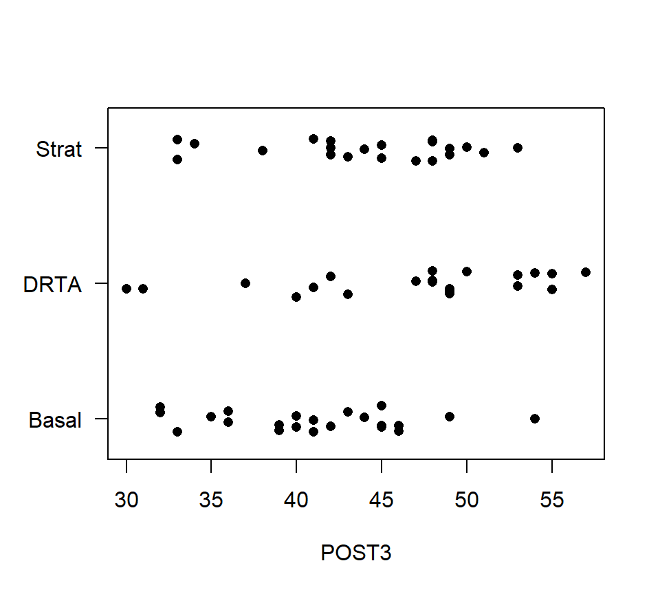
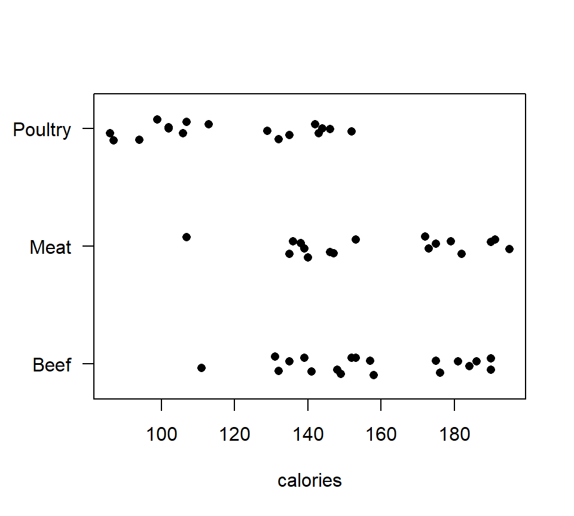
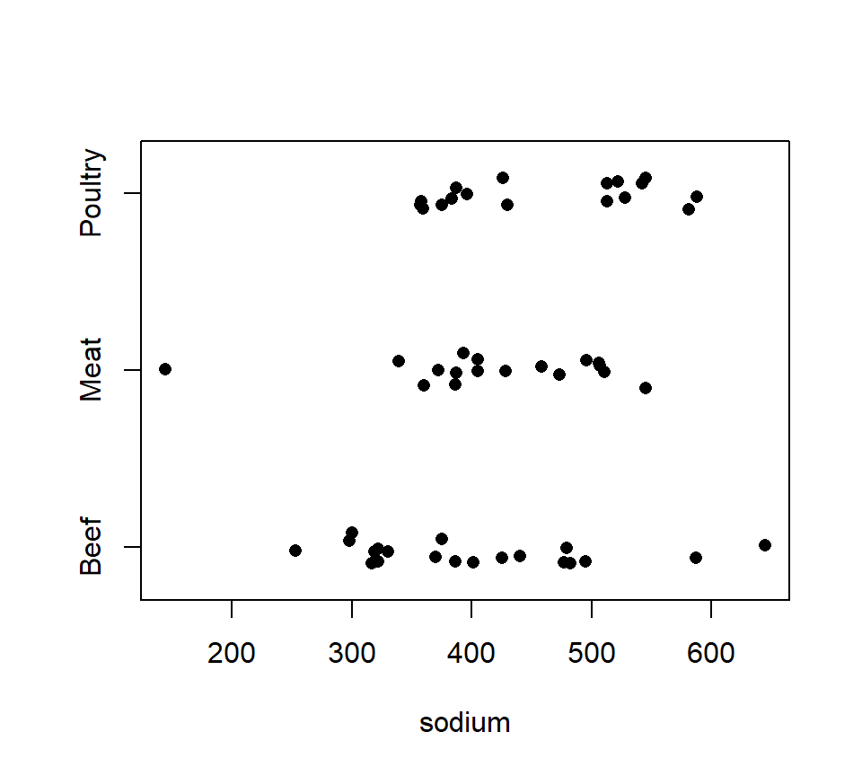
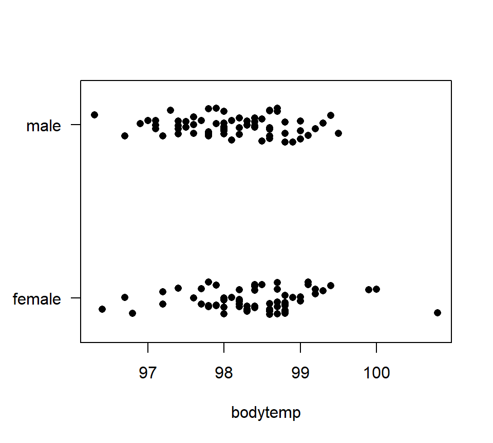
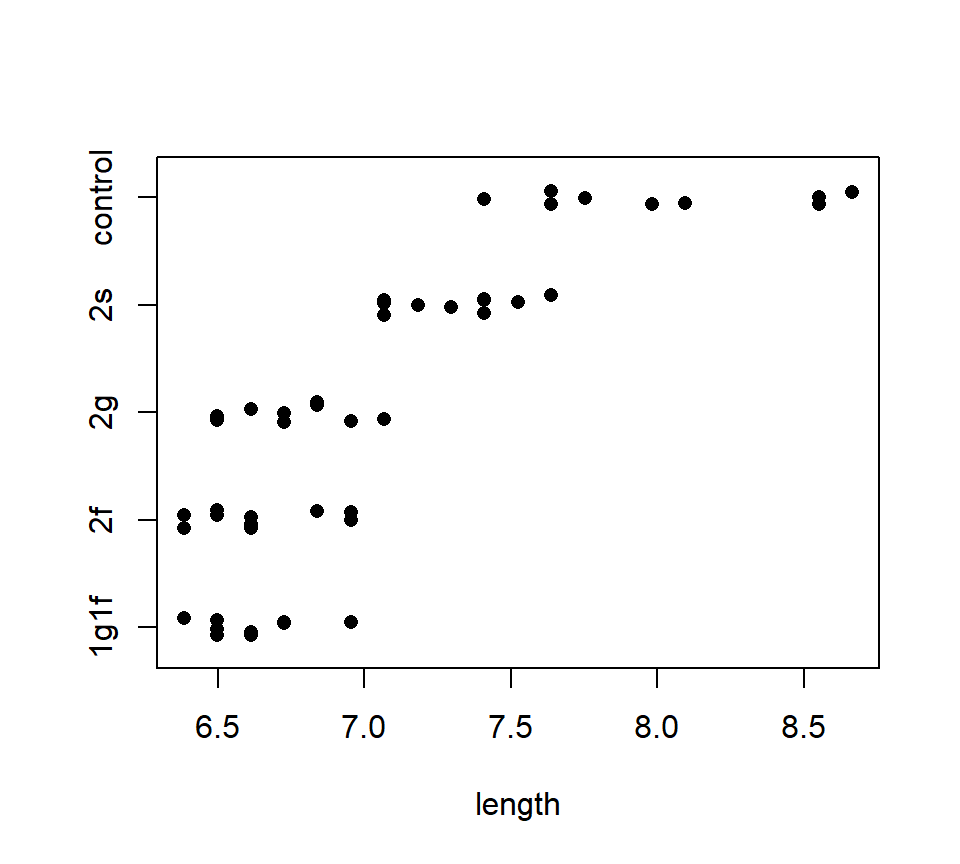
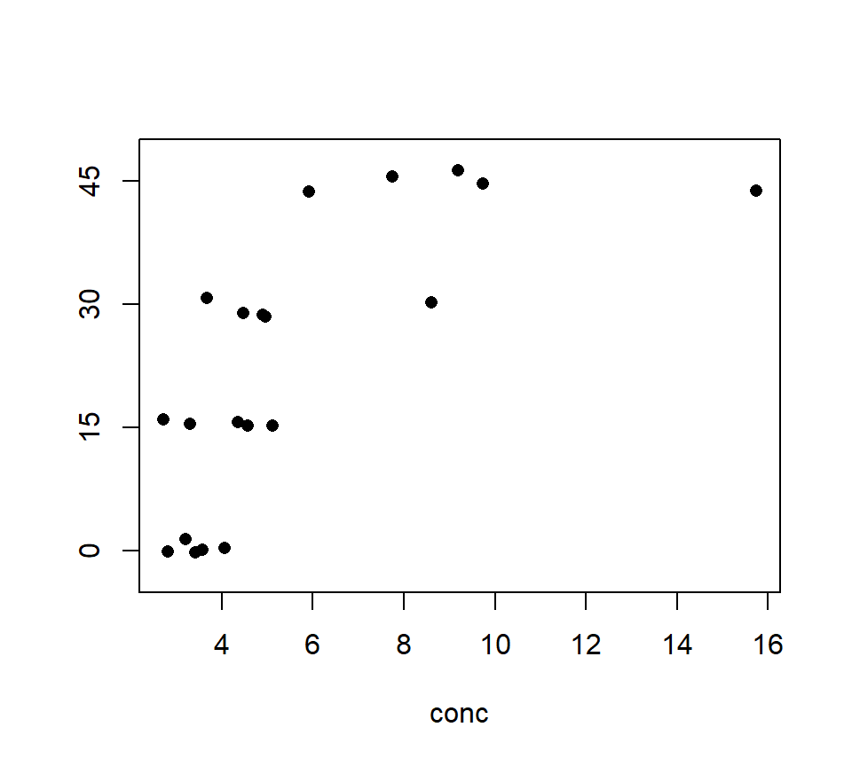

# (PART\*) Part III: Designed experiments {-}

# One-factor layout {#one-way}


## Grouped data and the design of experiments (DoE): an overview

In this part of the notes, we study methods to compare data from several groups.  Most often, data from several groups arise from a designed experiment in which the groups are different experimental treatments that we wish to compare.  The statistical methods extend, however, to observational studies in which the groups that we compare are different populations that already exist in nature.  As with regression models, the statistical methods for comparing groups are identical regardless of whether the data are generated by an experiment or an observational study.  What differs between experimental or observational studies is how we interpret the results.  Again, as with regression studies, designed experiments support a causal interpretation of the differences among groups, whereas observational studies only support a comparative interpretation.

### A vocabulary for describing designed experiments

Here we present a scheme and a vocabulary for describing designed experiments.  We will see that our scheme aligns closely with the statsitical methods that we use to analyze the resulting data.  In other words, if we can identify the experimental design, then the design will often suggest the appropriate statistical analysis.

There are two basic elements of a designed experiment.  The *treatment structure* of an experiment describes how the different experimental treatments are constructed.  The *randomization structure* of an experiment describes how those experimental treatments are assigned among different units.  It is also useful to distinguish the entity to which the treatment is assigned from the entity that is measured.  The *experimental unit* (EU) is the physical entity to which a treatment is assigned, while the *measurement unit* (MU) is the entity that is measured.  The measurement unit is often the same as the EU, but not always.  The *experimental error* is the variation in the response among EUs assigned to the same treatment.

The treatment and randomization structures of an experiment align tightly with the different components of a statistical model.  The *fixed effects* in a statistical model describe how the average response differs among the treatment groups.  The *random effects* in a statistical model describe how the replicate experimental units assigned to the same treatment vary.  (We will have more to say about the distinction between fixed vs.\ random effects [later](#random-effects).  In short, the treatment structure of an experiment determines how the fixed effects should be specified, and the randomization structure determines how the random effects should be specified.

### Roadmap

We will begin our study of designed experiments by exploring the treatment structure of an experiment.  In this chapter and the next, we will study various types of treatment structures, beginning with the simplest possible treatment structure and progressing to more complex structures.  While we study different treatment structures, we will keep the randomization structure simple.  Thus, with regard to the statistical models, we will initially focus on the fixed-effects component of the model.

After studying different treatment structures, we will then pivot to studying different randomization structures.  Accordingly, we will also turn our attention to studying the random-effects component of the statistical model.

Finally, we note that all of our study of designed experiments assumes that the response is normally distributed.  The great advantage of this assumption is that, because of the special properties of a normal distribution, the fixed-effect and random-effects components of the statistical model can be separated into two parts that are added together to construct the full model.  After having completed our study, we will then study models in which the response has something other than a normal distribution.  Things get more complicated here, because without our assumption of normality, we can't simply break the model apart into its fixed- and random-effect components.  The two parts become more tightly intertwined in complicated ways.  

### The simplest experiment

The simplest type of treatment structure is a *one-factor layout*, also known as a one-factor classification or one-way layout or single-factor design.  A one-factor layout consists of a single experimental factor with 2 or more levels.  

Here is an example from @moore1989introduction.  A researcher is interested in comparing three different methods of teaching reading on students' reading comprehension.  The methods are labeled "Basal", "DRTA', and "Strat".  Let $\mu_B$, $\mu_D$, and $\mu_S$ denote the average student comprehension for each of the three treatments.  We are interested in comparing $\mu_B$, $\mu_D$, and $\mu_S$.

As a bit of bookkeeping, it is usually awkward to distinguish statistical parameters by letter subscripts.  It is usually convenient to recode the parameters by numerical subscripts.  In this case, we might code the three mean responses as $\mu_1$, $\mu_2$, and $\mu_3$, referring to the average response for the " Basal", "DRTA', and "Strat" groups, respectively.  

The simplest type of randomization structure is a *completely randomized design* (CRD).  The term "completely randomized design" virtually defines itself: in a CRD, treatments are assigned to EUs completely at random.  CRDs are appropriate when EUs do not differ in ways that are known to affect the response. When the EUs do differ in ways known to affect the response, there are other randomization structures that are preferable to a CRD.  A *balanced* CRD is each treatment is assigned to the same number of replicates.

In the reading example, each of the three methods was randomly assigned to 22 different students.  One of the measures of reading comprehension in the data set is called "POST3".  The data for this response are shown in the strip chart below.


``` r
reading <- read.table("data/reading.txt", head = T, stringsAsFactors = T)
with(reading, stripchart(POST3 ~ Group, method = "jitter", pch = 16, las = 1))
```



In the stripchart above, only left-to-right variation is meaningful.  Vertical variation within each of the treatment groups is random scatter added to make sure the data points do not lie directly on top of one another.

The statistical model that we use for analyzing a one-factor layout with a CRD is a one-factor analysis of variance (ANOVA), which we study next.  

<!-- A one-factor ANOVA analysis (output from R shown below) suggests that there is strong evidence that teaching method affects reading comprehension ($F_{2,63}=4.48$, $p=0.015$). -->
<!-- ```{r} -->
<!-- fm3 <- lm(POST3 ~ Group, data = reading) -->
<!-- anova(fm3) -->
<!-- ``` -->


## One-factor ANOVA {#one-factor-anova}

### $F$-test to compare means

To introduce one-factor ANOVA, we will use a data set from an observational study.  These data provide the calorie content for 20 randomly selected beef hotdogs, 17 randomly selected poultry hotdogs, and 17 randomly selected meat (!) hotdogs.  The data are shown in the stripchart below.
<div class="figure" style="text-align: center">

<p class="caption">(\#fig:unnamed-chunk-3)Strip chart of calorie content for hot dog data.</p>
</div>

Let $\mu_B$, $\mu_M$ and $\mu_P$ denote the average calorie content for beef, meat and poultry hotdogs, respectively.  We wish to characterize if and how these means differ.  To do so, we will first test the null hypothesis $H_0$: $\mu_B = \mu_M = \mu_P$ with a one-factor analysis of variance (ANOVA).

Before we begin, we need to develop some notation.  Let $g$ denote the number of groups to be compared.  In the hot dog example, $g = 3$.  Let $i = 1,\ldots,g$ be an index that distinguishes the different populations.  The size of the random sample drawn from population $i$ is written $n_i$. When the sample sizes are the same in every group, we say that the data are balanced, and sometimes replace the individual sample sizes $n_i$  by a common sample size $n$.  Let $n_T = \sum_{i = 1}^g n_i$  denote the total number of data points in the data set.  Let $j=1, \ldots,n_i$ be an index that distinguishes the different data points within each sample; that is, $y_{ij}$  is observation $j$ from population $i$.  Finally, let $\mu_i$ denote the population mean for group $i$.

We will also use the subscript "+" to indicate summation over the values of an index.   For example, if we wanted to add together all the data points from the sample from group $i$, we could write
\[
y_{i+} = \sum_{j=1}^{n_{ij}} y_{ij}
\]
Or, if we wanted to add up all the data points in the data set, we could write
\[
y_{++} = \sum_{i=1}^g \sum_{j=1}^{n_{ij}} y_{ij}
\]
Lastly, we use bars to denote sample averages.  The sample mean from population $i$ is written
\[
\bar{y}_{i+} = \frac{1}{n_i}\sum_{j=1}^{n_{ij}} y_{ij}
\]
and the “grand mean” is written
\[
\bar{y}_{++} = \frac{1}{n_T}\sum_{i=1}^g \sum_{j=1}^{n_{ij}} y_{ij}.
\]

A word about subscripting: As we progress, the subscripting that we use will become increasingly complicated.  Remember that the basic rule for selecting a subscripting scheme is that each unique combination of subscripts must identify a unique data point.  In regression, one subscript was sufficient (i.e., $i = 1, \ldots, n$), because the value of $i$ was sufficient to specify a unique data point.  In ANOVA, we need one subscript to distinguish the different groups, and a second subscript to distinguish the individual observations within each group.  

The first order of business in an ANOVA is testing the null hypothesis that all the group means are equal, $H_0$: $\mu_1 = \mu_2 = \ldots = \mu_g$,  vs.\ the alternative that at least two group means differ.  As we will see below, this is identical to a model utility test in regression with indicators, and so we shouldn't be surprised that this is an $F$-test.  In the context of ANOVA, however, it is traditional to represent this test via a sums-of-squares decomposition.  This decomposition leads to computing formulas that were important in the era before desktop computing.

We begin by partitioning the variation in the data into two pieces: one quantifying the variation among populations and a second quantifying variation within populations.^[As with the SS decomposition that lead to $R^2$ in an ANOVA, the SS decomposition here is actually the Pythagorean Theorem in action, albeit in a higher-dimensional space.]  
\[
\mbox{Total variation: } SS_{Total} = \sum_{i=1}^g \sum_{j=1}^{n_{ij}} \left( y_{ij} - \bar{y}_{++} \right)^2
\]
\[
\mbox{Variation among groups: } SS_{Groups} = \sum_{i=1}^g \sum_{j=1}^{n_{ij}} \left( \bar{y}_{i+} - \bar{y}_{++} \right)^2  = \sum_{i=1}^g n_i \left( \bar{y}_{i+} - \bar{y}_{++} \right)^2
\]
\[
\mbox{Variation within groups: } SS_{Error} = \sum_{i=1}^g \sum_{j=1}^{n_{ij}} \left( y_{ij} - \bar{y}_{i+} \right)^2  
\]
Although it is not obvious, the $SS_{Groups}$ and $SS_{Error}$ add together to give $SS_{Total}$, that is,
\[
SS_{Total}= SS_{Groups} + SS_{Error}
\]
Heuristically, we want to compare the variation among groups to the variation within groups.  However, we cannot compare the $SS_{Groups}$ to the $SS_{Error}$ directly, because these sums of squares are based on a different number of free differences, or degrees of freedom.  Thus, we must standardize each sum of squares by dividing through by the number of free differences on which the sum of squares is based.

We divide both $SS_{Groups}$ and $SS_{Error}$ by their respective df to obtain the corresponding mean squares.  Mean squares can be directly compared, and the ratio of the $MS_{Groups}$ to the $MS_{Error}$ yields our $F$-statistic:
\[
F = \frac{MS_{Groups}}{MS_{Error}} = \frac{SS_{Groups} / (g - 1)}{SS_{Error} / (n_T - g)}.
\]
Mathematically, it can be shown that if the null hypothesis is true, then $MS_{Groups} \approx MS_{Error}$, and so $F \approx 1$.  If the null is false and the alternative is true, then $MS_{Groups} > MS_{Error}$, and so $F > 1$.  Of course, both mean squares have some inherent randomness, so we measure the degree of evidence against the null by comparing the $F$ statistic to the appropriate reference distribution.  If the null is true, then the $F$ ratio has an $F$-distribution with numerator df equal to $g - 1$ and denominator df equal to $n_T - g$.  Large values of the $F$ statistic provide evidence against the null and in favor of the alternative, and so we compute the $p$-value with a one-tailed test.

It is customary to package all the information that goes into an $F$-test into an ANOVA table.  Although the layout of this table may differ slightly from one text to the next, the basic pieces are all the same.  

<table>
 <thead>
  <tr>
   <th style="text-align:left;"> source </th>
   <th style="text-align:left;"> df </th>
   <th style="text-align:left;"> SS </th>
   <th style="text-align:left;"> MS </th>
   <th style="text-align:left;"> $F$ </th>
   <th style="text-align:left;"> $p$ </th>
  </tr>
 </thead>
<tbody>
  <tr>
   <td style="text-align:left;"> Groups </td>
   <td style="text-align:left;"> $g-1$ </td>
   <td style="text-align:left;"> $SS_{Groups}$ </td>
   <td style="text-align:left;"> $MS_{Groups}$ </td>
   <td style="text-align:left;"> $MS_{Groups} / MS_{Error}$ </td>
   <td style="text-align:left;">  </td>
  </tr>
  <tr>
   <td style="text-align:left;"> Error </td>
   <td style="text-align:left;"> $n_T-g$ </td>
   <td style="text-align:left;"> $SS_{Error}$ </td>
   <td style="text-align:left;"> $MS_{Error}$ </td>
   <td style="text-align:left;">  </td>
   <td style="text-align:left;">  </td>
  </tr>
  <tr>
   <td style="text-align:left;"> Total </td>
   <td style="text-align:left;"> $n_T-1$ </td>
   <td style="text-align:left;"> $SS_{Total}$ </td>
   <td style="text-align:left;">  </td>
   <td style="text-align:left;">  </td>
   <td style="text-align:left;">  </td>
  </tr>
</tbody>
</table>

Let's compare ANOVA tables for the hot-dog calorie data from both R and SAS.  Note that although the formatting differs slightly between the two software packages, the components of the $F$-test are identical.

In R, the ANOVA table is produced by fitting a linear model using lm(), and then passing that model fit to the command anova().

``` r
fm1 <- lm(calories ~ type, data = hotdog)
anova(fm1) 
```

```
## Analysis of Variance Table
## 
## Response: calories
##           Df Sum Sq Mean Sq F value    Pr(>F)    
## type       2  17692  8846.1  16.074 3.862e-06 ***
## Residuals 51  28067   550.3                      
## ---
## Signif. codes:  0 '***' 0.001 '**' 0.01 '*' 0.05 '.' 0.1 ' ' 1
```

For the sake of these notes, we can make the ANOVA table look a bit nicer using the following code.

``` r
options(knitr.kable.NA = '') 
anova(fm1) %>% knitr::kable(format = "html")
```

<table>
 <thead>
  <tr>
   <th style="text-align:left;">   </th>
   <th style="text-align:right;"> Df </th>
   <th style="text-align:right;"> Sum Sq </th>
   <th style="text-align:right;"> Mean Sq </th>
   <th style="text-align:right;"> F value </th>
   <th style="text-align:right;"> Pr(&gt;F) </th>
  </tr>
 </thead>
<tbody>
  <tr>
   <td style="text-align:left;"> type </td>
   <td style="text-align:right;"> 2 </td>
   <td style="text-align:right;"> 17692.20 </td>
   <td style="text-align:right;"> 8846.098 </td>
   <td style="text-align:right;"> 16.07399 </td>
   <td style="text-align:right;"> 3.9e-06 </td>
  </tr>
  <tr>
   <td style="text-align:left;"> Residuals </td>
   <td style="text-align:right;"> 51 </td>
   <td style="text-align:right;"> 28067.14 </td>
   <td style="text-align:right;"> 550.336 </td>
   <td style="text-align:right;">  </td>
   <td style="text-align:right;">  </td>
  </tr>
</tbody>
</table>

<!-- ```{r echo = FALSE} -->
<!-- # set up the options so that knit knows where you SAS executable is -->
<!-- # set the linesize to be easily readable on letter size paper, portrait -->
<!-- # and set the knir options using opts_chunk$set(). -->

<!-- # the lines below are the lines to uncomment if I want to make SAS the global engine.  But I don't, so I've commented those out. -->

<!-- # saspath <- "C:/Program Files/SASHome/SASFoundation/9.4/sas.exe" -->
<!-- # sasopts <- "-nosplash -linesize 75" -->
<!-- # knitr::opts_chunk$set(engine="sashtml", engine.path = saspath,  -->
<!-- #        engine.opts = sasopts, comment = NA) -->

<!-- # the website that I consulted said to use this when compiling to PDF  -->
<!-- # knitr::opts_chunk$set(engine="sas", engine.path=saspath,  -->
<!-- #         engine.opts=sasopts, comment=NA) -->

<!-- # but notice that if you run -->
<!-- # > names(knitr::knit_engines$get()) -->
<!-- # there is a 'saspdf' engine and so forth.  I would try this instead to compile to pdf. -->

<!-- # To re-set the global options to using R, I would use -->
<!-- # ```{r, engine='R', echo = FALSE} -->
<!-- # knitr::opts_chunk$set(engine="R",  engine.path=NULL,  -->
<!-- #        engine.opts=NULL, comment=NA) -->
<!-- # ``` -->
<!-- ``` -->

<!-- Let's take a look at the output we obtain from PROC GLM in SAS: -->
<!-- ```{r, engine = 'sashtml', engine.path = "C:/Program Files/SASHome/SASFoundation/9.4/sas.exe", engine.opts = "-nosplash -linesize 75"} -->
<!-- data hotdog; -->
<!--   infile "data\hotdog.txt" firstobs = 2; -->
<!--   input type$ calorie sodium; -->
<!-- run; -->

<!-- proc glm data = hotdog; -->
<!--   class type; /* declare categorical variables here */ -->
<!--   model calorie = type; -->
<!-- run; -->
<!-- ``` -->

A PROC GLM program to fit a one-factor ANOVA model to these data is shown below, followed by some curated output.
```{}
data hotdog;
  infile "data\hotdog.txt" firstobs = 2;
  input type$ calorie sodium;
run;

proc glm data = hotdog;
  class type; /* declare categorical variables here */
  model calorie = type;
run;
```


````{}
The GLM Procedure

                                        Sum of
Source                      DF         Squares     Mean Square    F Value    Pr > F
Model                        2     17692.19510      8846.09755      16.07    <.0001
Error                       51     28067.13824       550.33604
Corrected Total             53     45759.33333
````

Thankfully, we get the same output regardless of which computer package we use.  We interpret this output in the following way: There is strong evidence that the average calorie content of meat, beef, and poultry hot dogs are not all equal ($F_{2,51}=16.07$, $p<.001$).  

*Example 2.* We also have sodium content (in mg) available for each hotdog.  A strip-chart of the sodium data is shown below.

``` r
with(hotdog, stripchart(sodium ~ type, method = "jitter", pch = 16))
```



``` r
fm2 <- lm(sodium ~ type, data = hotdog)
anova(fm2)
```

```
## Analysis of Variance Table
## 
## Response: sodium
##           Df Sum Sq Mean Sq F value Pr(>F)
## type       2  31739 15869.4  1.7778 0.1793
## Residuals 51 455249  8926.4
```
There is no evidence that the average sodium content of meat, beef, and poultry hot dogs differ ($F_{2,51}=1.78$, $p=0.18$).

### Connections between one-factor ANOVA and other statistical procedures

It may have occurred to you that we could also have analyzed the hot dog data by using a regression model with indicator variables.   In fact, ANOVA and regression with indicators are the same statistical model, a point which we will illustrate more explicitly now.  For the hot-dog data, let’s consider the regression model
\[
y=\beta_0 +\beta_1 x_1 +\beta_2 x_2 + \epsilon 
\] 
where $x_1$ and $x_2$ are indicator variables to code for the different types of hotdogs.  We can ask if the data contain evidence that the different types of hotdogs have different calorie contents on average by testing $H_0$: $\beta_1 = \beta_2 = 0$.  In this particular case, the $F$-test that we need is the model utility test.  We'll just find this test directly in the R output.  

``` r
summary(fm1)
```

```
## 
## Call:
## lm(formula = calories ~ type, data = hotdog)
## 
## Residuals:
##     Min      1Q  Median      3Q     Max 
## -51.706 -18.492  -5.278  22.500  36.294 
## 
## Coefficients:
##             Estimate Std. Error t value Pr(>|t|)    
## (Intercept)  156.850      5.246  29.901  < 2e-16 ***
## typeMeat       1.856      7.739   0.240    0.811    
## typePoultry  -38.085      7.739  -4.921 9.39e-06 ***
## ---
## Signif. codes:  0 '***' 0.001 '**' 0.01 '*' 0.05 '.' 0.1 ' ' 1
## 
## Residual standard error: 23.46 on 51 degrees of freedom
## Multiple R-squared:  0.3866,	Adjusted R-squared:  0.3626 
## F-statistic: 16.07 on 2 and 51 DF,  p-value: 3.862e-06
```

Note that the test statistic and $p$-value for the model utility test are exactly the same as the test statistic and $p$-value from the ANOVA $F$-test.   

One-factor ANOVA also generalizes a two-sample $t$-test.   To illustrate, consider the data below, which show body temperatures for 65 randomly selected women and 65 randomly selected men.

``` r
bodytemp <- read.table("data/bodytemp.txt", head = T, stringsAsFactors = T)
with(bodytemp, stripchart(bodytemp ~ gender, method = 'jitter', pch = 16, las = 1))
```


Suppose we want to study the difference in average body temperature between men and women.  In an introductory course you might have conducted this analysis with a two-sample $t$-test.  Here is how to implement this $t$-test in R.

``` r
t.test(bodytemp ~ gender, data = bodytemp, var.equal = TRUE)
```

```
## 
## 	Two Sample t-test
## 
## data:  bodytemp by gender
## t = 2.2854, df = 128, p-value = 0.02393
## alternative hypothesis: true difference in means between group female and group male is not equal to 0
## 95 percent confidence interval:
##  0.03882216 0.53963938
## sample estimates:
## mean in group female   mean in group male 
##             98.39385             98.10462
```
The $p$-value of 0.0239 suggests that there is reasonably strong evidence of a difference in average body temperature for males and females.  Compare this output with a one-factor ANOVA analysis:

``` r
anova(lm(bodytemp ~ gender, data = bodytemp))
```

```
## Analysis of Variance Table
## 
## Response: bodytemp
##            Df Sum Sq Mean Sq F value  Pr(>F)  
## gender      1  2.719 2.71877  5.2232 0.02393 *
## Residuals 128 66.626 0.52052                  
## ---
## Signif. codes:  0 '***' 0.001 '**' 0.01 '*' 0.05 '.' 0.1 ' ' 1
```
The $p$-values are exactly the same, because one-factor ANOVA with two groups is identical to a two-sample $t$-test (with a pooled variance).

### Assumptions in ANOVA

Just like regression, ANOVA is based on assumptions about the distributions of the observations within each group.  If these assumptions are badly violated, then the $F$-test is not trustworthy.  In ANOVA, the errors are assumed to be independent, normally distributed, and to have equal variance.  Because we have seen that ANOVA is tantamount to regression with indicators, it should not surprise you that these are the same assumptions that we encountered in regression.  (The linearity assumption from regression is less pertinent to ANOVA because there are no continuously valued predictors.)

As with regression, we could use the ``residuals'' $e_{ij} = y_{ij} - \bar{y}_{i+}$   to construct diagnostic plots that allow us to assess these assumptions.  With a one-factor ANOVA, however, it typically suffices just to plot the data (either using dotplots, histograms, or boxplots).  Troublesome violations of assumptions should be apparent.

If assumptions are violated, what can we do?  As with a two-sample $t$-test, there are several options.  A first option is to transform the data, just as we transformed the response in regression.  Transformations are particularly useful for right-skewed data (in which case one may use a log transformation), count data (square-root transformation), or proportion data (eg, percenteges, in which case an arcsin-square root transformation is appropriate).

<!-- *Example: Cloud seeding.* Fifty-two clouds were randomly divided into two equally sized groups.  The 26 clouds in one group were seeded with silver nitrate, and the 26 clouds in the other group were left as controls.  Rainfall from each cloud was recorded in acre-feet.  The data are shown below.  (The original source for these data is Simpson et al., 1975.  ``A Bayesian analysis of a multiplicative treatment effect in weather modification.'' *Technometrics} 17:161-166.) -->

<!-- \begin{center} -->
<!-- 	\includegraphics*[width=2.5in]{figures/rain-raw} -->
<!-- \end{center} -->
<!-- Clearly, the data are not normally distributed within the groups.  Taking a log-transformation of the data eliminates most of the skew: -->
<!-- \begin{center} -->
<!-- 	\includegraphics*[width=2.5in]{figures/rain-log} -->
<!-- \end{center} -->
<!-- Now, a one-factor ANOVA using the log-transformed data shows that these data contain strong evidence that seeded clouds produced more rainfall, on average, than unseeded clouds: -->
<!-- \renewcommand{\baselinestretch}{1} -->
<!-- \begin{} -->
<!-- The GLM Procedure -->

<!--                                         Sum of -->
<!-- Source                      DF         Squares     Mean Square    F Value    Pr > F -->
<!-- Model                        1      17.0070591      17.0070591       6.47    0.0141 -->
<!-- Error                       50     131.3526732       2.6270535 -->
<!-- Corrected Total             51     148.3597324 -->
<!-- \end{} -->
<!-- \renewcommand{\baselinestretch}{1.5} -->

A second option with non-normal data is to try a non-parametric procedure.  A parametric method assumes that the data come from a population with a (so-called) parametric probability distribution.  A non-parametric method does not make any particular assumption about the distribution of the population(s) from which the data were collected.  The non-parametric equivalent to a one-factor ANOVA is the Kruskal-Wallis test.

## Contrasts of group means {#contrasts}

If we reject the null hypothesis that all group means are equal in a one-factor ANOVA, we usually want to go further and characterize how the group means differ.  The approach that we use to characterize differences among group means depends on whether we are interested in pre-planned comparisons of the group means or in comparisons that are suggested by the data.  A pre-planned comparison is one that you planned to investigate before having collected the data.  Pre-planned comparisons can be analyzed using linear contrasts, which are the topic of this section.  Comparisons suggested by the data should be analyzed with [multiple-comparisons procedures](#multiple-testing), which we will study later.

### Simple contrasts

A linear contrast generalizes the idea of a pairwise difference between two means.  A linear contrast is a special type of linear combination.  A *linear combination* of the group means is a weighted sum of the group means.  It can be written as
\[
\theta = w_1 \mu_1 + w_2 \mu_2 + \ldots + w_g \mu_g.
\]
the $w$'s in the expression above are weights that we assign to each group mean.  We can treat a linear combination just like any other statistical parameter.  

A (simple) *linear contrast* is a linear combination in which the weights add to 0:
\[
\sum_{i=1}^g w_i = 0.
\]
If all the group means are equal, then the true value of any contrast will be 0.  A little algebra will verify this claim. A single linear contrast is also called a simple contrast.  Later, we will encounter complex contrasts, which are collections of simple contrasts.

*Example.*  Consider the hotdog data.  Let $\mu_B$, $\mu_M$, and $\mu_P$ denote the average calorie content for beef, meat, and poultry hotdogs, respectively.  A linear contrast that compares the average calorie content of beef hotdogs vs. poultry hotdogs is
\[
\theta_1 = \mu_B - \mu_P = (+1) \times \mu_B + 0 \times \mu_M + (-1) \times \mu_P.
\]

For a contrast, we are almost always interested in testing the null hypothesis that the contrast is 0 ($H_0: \theta_1 = 0$) against the alternative that the difference is not 0 ($H_a: \theta_1 \ne 0$).  Typically, this happens by computing a sum-of-squares associated with the contrast.  There's a formula for the sum-of-squares for a contrast, but it isn't enlightening, so we'll let the computer do the computations.  We'll present output here and focus on coding [later](#sas-contrasts).

The sum-of-squares associated with the contrast $\theta_1$ is $SS(\theta_1) = 13328$.  To test $H_0: \theta_1 = 0$, we must first convert this sum-of-squares to a mean-square by dividing by the number of degrees of freedom associated with the contrast.  For a simple contrast, the associated df is 1.  We then compare the mean-square for the contrast to the MSE via an $F$-statistic.  For the contrast $\theta_1$, this plays out as
\[
F_{1,51} = \frac{MS(\theta_1)}{MS_{Error}} = \frac{SS(\theta_1) / 1}{SS_{Error} / (n_T - g)} = \frac{13328/1}{28067/51} = 24.22.
\]
Comparing to an $F_{1,51}$ distribution yields a $p$-value $<0.0001$.

<!-- We can estimate a linear contrast (or any linear combination) simply by plugging in sample means for population means.  For the contrast above -->
<!-- \[ -->
<!-- \hat{\theta}_1 = \bar{y}_{1+} - \bar{y}_{3+} = 156.9 - 118.8 = 38.1 -->
<!-- \] -->
<!-- Like any estimate, our estimate of a linear contrast has a standard error.  While we will usually rely on software to compute the standard error for us, the expression for the standard error writes as  -->
<!-- \[ -->
<!-- s_{\hat{\theta}} = \sqrt{\left\{\frac{w_1^2}{n_1} + \frac{w_2^2}{n_2} + \ldots + \frac{w_g^2}{n_g} \right\} MS_{Error}} -->
<!-- \] -->
<!-- Perhaps the one thing to be gained from this formula is to consider the trivial linear combination $\theta = \mu_1$.  You will notice that the formula for the standard error reproduces the familiar formula for a sample mean.   -->

<!-- Confidence intervals for $\theta$ can be found by using critical values from a $t$-distribution with $n_T - g$ df.  (We use $n_T - g$ df because this is the number of df for the $MS_{Error}$.)  We can also test $H_0: \theta = \theta_0$ vs.\ any appropriate alternative hypothesis by calculating the $t$-statistic -->
<!-- \[ -->
<!-- t = \frac{\hat{\theta} - \theta_0}{s_{\hat{\theta}}} -->
<!-- \]   -->
<!-- and comparing the value of the test statistic to a $t$-distribution with $n_T - g$ df. -->

<!-- *Example.* Suppose we wanted to investigate the difference between the average calorie content of beef hotdogs and the average calorie content of poultry hotdogs.  We have already expressed this difference as $\theta_1 = \mu_1 - \mu_3$, and estimated this difference as $\hat{\theta}_1 = 38.1$.  Now, to draw statistical inferences, we calculate the standard error of $\hat{\theta}_1$: -->
<!-- \[ -->
<!-- s_{\hat{\theta}_1} = \sqrt{\left\{\frac{1^2}{20} + \frac{0^2}{17} + \frac{(-1)^2}{17} \right\} 550.3} =7.74. -->
<!-- \] -->
<!-- By finding the appropriate critical value from a $t$-distribution with $n_T - g = 54 - 3 = 51$ df, a 95\% CI for $\theta_1$  is $38.1 \pm 2.008 \times 7.74 = (22.6, 53.6)$.  Finally, to test $H_0: \theta_1 = 0$ vs.\ $H_a: \theta_1 \ne 0$, calculate the $t$-statistic -->
<!-- \[ -->
<!-- t = \frac{38.1 - 0}{7.74} = 4.92 -->
<!-- \] -->
<!-- and compare to a $t$-distribution with 51 df to generate a $p$-value of $9.4 \times 10^{-6}$.  Thus, there is overwhelming evidence that beef and poultry hotdogs differ in their average calorie content. -->

### Complex contrasts

A complex contrast is a collection of several *linearly independent* contrasts.  "Linear independence" is a bit of a mouthful, but the idea is straightforward.  Several contrasts are linearly independent if they are not redundant.  Conversely, a collection of contrasts are not linearly independent if a subset of the contrasts equaling 0 dictates that another contrast in the collection must also equal 0.  For example, consider the hot-dog data, and consider the three contrasts
\begin{eqnarray*}
\theta_1 & = & \mu_B - \mu_M \\
\theta_2 & = & \mu_B - \mu_P \\
\theta_3 & = & \mu_M - \mu_P \\
\end{eqnarray*}
These contrasts are linearly dependent, because if $\theta_1 = 0$ and $\theta_2 = 0$, then it must be true that $\theta_3 = 0$.  In other words, $\theta_3$ is redundant with $\theta_1$ and $\theta_2$.  

We test a complex contrast by testing whether all the simple contrasts it contains equal $0$.  For example, in the hotdog data, and using the contrasts as defined above, we can test $H_0$: $\theta_1 = \theta_2 = 0$, vs.\ the alternative that at least one of $\theta_1$ and $\theta_2$ is not 0.  Of course, $H_0$: $\theta_1 = \theta_2 = 0$ is equivalent to $H_0$: $\mu_B = \mu_M = \mu_P$, the usual null hypothesis of equality of group means.  Thus, contrasts give us an alternative route to understanding the ANOVA $F$-test.  This alternative route will become useful when we consider ANOVA for factorial designs later.

Suppose we have a complex contrasts that consists of $k$ linearly independent contrasts, which we denote as $\theta_1, \theta_2, \ldots, \theta_k$.  We can use an $F$-test to test the null hypothesis that all $k$ contrasts are equal to zero.  The $F$-test involves finding a sum of squares for the collection of contrasts, which we will write as $SS(\theta_1, \theta_2, \ldots, \theta_k)$, and has $k$ df.  We usually can't calculate $SS(\theta_1, \theta_2, \ldots, \theta_k)$ by hand, but a computer can do so for us.  To test the null hypothesis that all $k$ contrasts are equal to zero, we construct an $F$ test in the usual way:
\[
F = \frac{MS(\theta_1, \theta_2, \ldots, \theta_k)}{MSE} = \frac{SS(\theta_1, \theta_2, \ldots, \theta_k) / k}{MSE}
\]
Here's PROC GLM code in SAS to test $H_0$: $\theta_1 = \theta_2 = 0$ (see the section on [PROC GLM](#sas-contrasts) for explanation of coding). 
```{}
proc glm data=hotdog;
  class type;
  model calorie = type;
  /* --------------------------- B  M  P --*/
  contrast 'B vs M, B vs P' type 1 -1  0,
                            type 1  0 -1;
run;

                                        Sum of
Source                      DF         Squares     Mean Square    F Value    Pr > F
Model                        2     17692.19510      8846.09755      16.07    <.0001
Error                       51     28067.13824       550.33604
Corrected Total             53     45759.33333


Contrast                    DF     Contrast SS     Mean Square    F Value    Pr > F
B vs M, B vs P               2     17692.19510      8846.09755      16.07    <.0001
```

The $F$-test of $H_0$: $\theta_1 = \theta_2 = 0$ yields exactly the same result as the $F$-test of $H_0$: $\mu_1 = \mu_2 = \mu_3$, which should not surprise us.

Let us collect what we have learned so far.  With $g$ groups, the ANOVA $F$-test that all the group means are equal, that is, of $H_0$: $\mu_1 = \mu_2 =  \ldots = \mu_g$ is equivalent to a test of $g-1$ linearly independent contrasts among the group means.  Note that there are many possible sets of $g-1$ linearly independent contrasts that can be used to test the equality of group means.  For example, in the hot-dog data, we could also define the contrasts
\begin{eqnarray*}
	\theta_3 & = & \mu_2 - \mu_3 \\
	\theta_4 & = & 2 \mu_1 - (\mu_2 + \mu_3).
\end{eqnarray*}
Because $\theta_3$ and $\theta_4$ are linearly independent contrasts, a test of $H_0$: $\theta_3 = \theta_4 = 0$ should also yield the same $F$-statistic, and in fact it does:
```{}
proc glm data=hotdog;
  class type;
  model calorie = type;
  /* ------------------------------- B  M  P --*/
  contrast 'two more contrasts' type 0  1 -1,
                                type 2 -1 -1;
run;

Contrast                    DF     Contrast SS     Mean Square    F Value    Pr > F
two more contrasts           2     17692.19510      8846.09755      16.07    <.0001
```

So what is the point, if all we have done is to recreate the familiar $F$-test for equality of means?  We will see that contrasts actually allow us to go much further.  This is illustrated in the next example.

*Example.* An experiment is conducted to investigate the effects of five different sugar treatments on the length (in mm) of pea sections grown in tissue culture.  The five treatments are: a control (no sugar added), +2\% sucrose, +2\% fructose, +2\% glucose, and +1\% fructose +1\% glucose.  The data are balanced, with $n = 10$ replicates per treatment.  These data appear in @sokal1995biometry.  A stripchart of the data is shown below.

``` r
pea <- read.table("data/pea.txt", head = T, stringsAsFactors = T)
with(pea, stripchart(length ~ trt, method = "jitter", pch = 16))
```


Notice that the equal variance assumption is suspect here, as the variance of the control group looks larger than the variances of the other groups.  We might want to analyze the log of the response to stabilize the variance, but for now we will continue to analyze the raw data.

The usual one-factor ANOVA allows us to reject the null hypothesis of no difference among group means:
```{}
                      Sum of       Mean
Source         DF    Squares     Square    F Value    Pr > F
Model           4     14.001      3.500      49.37    <.0001
Error          45      3.190      0.071
Total          49     17.191
```

There are several further comparisons of these data that we might have deemed interesting before examining the data.  These include:

1. Does the control differ from the average of the non-control treatments?

2. Does the fructose / glucose blend differ from the average of the pure fructose and pure glucose treatments?

3. Do the three pure sugar treatments differ?

The first two of these are simple contrasts, and the last is a complex contrast.

Using subscripts to distinguish treatment means, the first contrast can be expressed as 
\[
\theta_1 = \mu_c - \frac{\mu_{fg} + \mu_{f} + \mu_{g} + \mu_{s}}{4}.
\]
For any contrast, we can multiply the entire contrast by a number without changing the meaning of the null hypothesis that the contrast equals $0$.  It is sometimes handy to keep the coefficients that multiply the treatment means as whole numbers, so we will rewrite this contrast as 
\[
\theta_1 = 4\mu_c - (\mu_{fg} + \mu_{f} + \mu_{g} + \mu_{s}).
\]

The second contrast writes as
\[
\theta_2 = 2\mu_{fg} - (\mu_{f} + \mu_{g}).
\]

The third contrast is a complex contrast that contains two linearly independent simple contrasts.  One way to write these simple contrasts is 
\begin{eqnarray*}
	\theta_3 & = & \mu_f - \mu_g \\
	\theta_4 & = & \mu_g - \mu_s. 
\end{eqnarray*}

Here is PROC GLM code to test for each of these three contrasts, and the output it generates:
```
proc glm data=pea;
  class trt;
  model length = trt / solution;
  /*-------------------------------------1f1g   2f   2g   2s ctrl --*/
  contrast 'Control vs. sugars'      trt   -1   -1   -1   -1    4;
  contrast 'Mixed vs pure f, pure g' trt    2   -1   -1    0    0;
  contrast 'Diffs among pure sugars' trt    0    1    0   -1    0,
                                     trt    0    0    1   -1    0;
run;

Contrast                       DF     Contrast SS     Mean Square    F Value    Pr > F
Control vs. sugars              1     10.81683072     10.81683072     152.56    <.0001
Mixed vs pure f, pure g         1      0.04873500      0.04873500       0.69    0.4114
Diffs among pure sugars         2      2.55847920      1.27923960      18.04    <.0001

```

It is often a nice touch to present contrasts of pre-planned comparisons as part of the ANOVA table, like so:
```
                                        Sum of
Source                      DF         Squares     Mean Square    F Value    Pr > F
Groups                       4     14.00085072      3.50021268      49.37    <.0001
  Ctrl. vs sugars              1     10.81683072   10.81683072     152.56    <.0001       
  Mixed vs pure f, pure g      1      0.04873500    0.04873500       0.69    0.4114
  Diffs among pure sugars      2      2.55847920    1.27923960      18.04    <.0001
Error                       45      3.19051800      0.07090040
Total                       49     17.19136872
```


---

<span style="color: gray;"> It is a bit unsatisfying to not have any sense of how the sums of squares for a set of contrasts is calculated.  The best we can do here is to point out that a test that several contrasts are simultaneously equal to zero can alternatively be formulated as an $F$-test, using the machinery of "full" and "reduced" models that we studied in the context of multiple regression.  Indeed, it is exactly the same idea, and if we wrote the ANOVA model as a regression with indicator variables, we could test a set of contrasts among the group means using exactly the same approach.  Thus, it is no surprise that the test statistic for testing several simultaneous contrasts is an $F$-statistic.</span>

---

### Orthogonal contrasts {#orthogonal-contrasts}

We have already seen that if several contrasts are not (completely) redundant, they are *linearly independent*.  Linearly independent contrasts might still share some information, however.  For example, the contrasts $\theta_1 = \mu_1 - \mu_2$ and $\theta_2 = \mu_1 - \mu_3$ are linearly independent, but they both depend in the same way on $\mu_1$.  Thus, if we happen to draw a sample from group 1 that is unusual in some regard, the event of drawing that sample will affect our tests of both $H_0$: $\theta_1 = 0$ and $H_0$: $\theta_2 = 0$ in the same way.

There is a stronger notion of independence among contrasts called *orthogonality*.  (You might remember that *orthogonal* is a synonym for *perpendicular*.)   Here is how orthogonality is defined.  Two contrasts $\theta_1 = \sum_{i=1}^g c_i \mu_i$ and $\theta_2 = \sum_{i=1}^g d_i \mu_i$ are orthogonal if and only if
\[
\sum_{i=1}^g \frac{c_i d_i}{n_i} = 0.
\]
Note that if two contrasts are orthogonal, then they must also be linearly independent.  However, two contrasts that are linearly independent may or may not be orthogonal.\footnote{To run with the geometric idea for a bit, if we think about a contrasts as vectors in a plane, two contrasts are orthogonal if they are perpendicular.  Two contrasts are linearly independent as long as they are not parallel.  Thus, two contrasts that are orthogonal (perpendicular) are necessarily linearly independent (not parallel), but two contrasts that are linearly independent (not parallel) may or may not be orthogonal (perpendicular).}

Complex contrasts can also be orthogonal.  Consider two complex contrasts, where the first is comprised of the simple contrasts $\theta_1, \theta_2, \ldots, \theta_k$, and the second is comprised of the simple contrasts $\phi_1, \phi_2, \ldots, \phi_l$.  These two complex contrasts are orthogonal if every simple contrast in the first complex contrast is orthogonal to every simple contrast in the second complex contrast.  Note that the simple contrasts within complex contrasts may or may not be orthogonal to each other; whether or not they are orthogonal with each other is irrelevant.  All we care about is whether the simple contrasts in the first complex contasts are orthogonal to the simple contrasts in the second complex contrast. 

The major upshot is that if two complex contrasts are orthogonal, then their sums of squares are additive.  That is,
\[
SS(\theta_1, \theta_2, \ldots, \theta_k, \phi_1, \phi_2, \ldots, \phi_l) = SS(\theta_1, \theta_2, \ldots, \theta_k) + SS(\phi_1, \phi_2, \ldots, \phi_l).
\]
That is, the sum-of-squares for the combined complex contrast can be partitioned into the sum-of-squares for the first complex contrast plus the sum-of-squares for the second complex contrast.

In the pea example above, note that the complex contasts are *not* orthogonal.  Thus, we have $SS(\theta_1) + SS(\theta_2) + SS(\theta_3, \theta_4) \neq SS_{Groups}$.  However, suppose we redefine the second contrast as the difference between the fructose / glucose blend and the average of the three pure sugar treatments, that is, replace $\theta_2$ with
\[
\theta_{2a} = 3\mu_{fg} - (\mu_{f} + \mu_{g} + \mu_s).
\]
Now the contrasts $\theta_1$, $\theta_{2a}$, and the complex constrast $(\theta_3$, $\theta_4$) are orthogonal, and so $SS(\theta_1) + SS(\theta_{2a}) + SS(\theta_3, \theta_4) = SS_{Groups}$.  The code below illustrates:
```
proc glm data=pea;
  class trt;
  model length = trt / solution;
  /*-------------------------------------1f1g   2f   2g   2s ctrl --*/
  contrast 'Control vs. sugars'      trt   -1   -1   -1   -1    4;
  contrast 'Mixed vs pure sugars   ' trt    3   -1   -1   -1    0;
  contrast 'Diffs among pure sugars' trt    0    1    0   -1    0,
                                     trt    0    0    1   -1    0;
run;

Contrast                       DF     Contrast SS     Mean Square    F Value    Pr > F
Control vs. sugars              1     10.81683072     10.81683072     152.56    <.0001
Mixed vs pure sugars            1      0.62554080      0.62554080       8.82    0.0048
Diffs among pure sugars         2      2.55847920      1.27923960      18.04    <.0001
```

We might modify the ANOVA table accordingly:
```
                                        Sum of
Source                      DF         Squares     Mean Square    F Value    Pr > F
Groups                       4     14.00085072      3.50021268      49.37    <.0001
  Ctrl. vs sugars              1     10.81683072   10.81683072     152.56    <.0001       
  Mixed vs pure sugars         1      0.62554080    0.62554080       8.82    0.0048
  Diffs among pure sugars      2      2.55847920    1.27923960      18.04    <.0001
Error                       45      3.19051800      0.07090040
Total                       49     17.19136872
```

While orthogonality is nice, it is something of a fringe benefit (@quinn2002experimental).  Contrasts should be designed to match the comparisons of scientific interest; the comparisons of interest should not be arranged to generate orthogonal contrasts.

The natural question that arises is: When should we expect orthogonality?  One doesn't just stumble onto sets of orthogonal contrasts by chance.  There are three types of experiments where sets of orthogonal contrasts can be expected.  If you are able to recognize these types of experiments, you can use orthogonal contrasts to create an especially thorough and satisfying analysis.  The three types of experiments that support sets of orthogonal contrasts are:

 1. Factorial experiments.  By a large margin, factorial experiments (in which treatment groups are formed by crossing multiple experimental factors) are the most important context for orthogonal contrasts.  We will study factorial experiments in depth in the next installment of the notes, and thus will say no more about them here.
 
 2. Experiments in which the treatment groups cluster into a hierarchy, and the data are balanced.  The pea experiment above could provides an example.  The five treatment groups naturally cluster into a group of sugar-addition treatments and a singleton control group.  In this type of experiment, we can find a set of contrasts to test for differences among the treatment means within each cluster, and another set of contrasts to test for differences among the clusters, exactly as we have done with the pea data. 
 
3. Experiments in which the treatment groups are formed by different levels of a quantitative variable.  We study this scenario in more depth below.

	
<!-- 	As a second example of an experiment in which treatment groups cluster into a hierarchy, suppose that we have a balanced experiment with six treatment groups: one control group, three treatments that involve adding different types of sugars, and two treatments that involve adding different types of starches.   With 6 treatment groups, we can find 5 linearly independent contrasts to capture the differences among the treatment groups.  These 5 contrasts can be broken down into the following groups: -->
<!--  + A set of two linearly independent contrasts that compare the means of the three sugar treatments. -->
<!--  + A single contrast that compares the means of the two starch treatments. -->
<!--  + A set of two linearly independent contrasts that compare (i) the control group, (ii) the average of the sugar treatments, and (iii) the average of the starch treatments. -->

<!-- 	Alternatively, we might take the two contrasts in the last group above and break those down further into one contrast that compares the control group with the average of the five non-control groups, and a second contrast that compares the average of the sugar treatments to the average of the starch treatments. -->
	
	
### Polynomial contrasts

Consider the following data set.  Pott (1992) conducted an experiment to investigate the effect of added dietary molybdenum (Mo) on the molybdenum concentrations of sheep kidneys.  Twenty (20) sheep were randomly assigned to one of four diets, where the diets differed only in the amount of supplementary molybdenum (0, 15, 30 and 45 ppm).  Five sheep were assigned to each diet, and the Mo concentration in the kidney was measured after 14 days.  The data are shown below:

``` r
molybdenum <- read.csv("data/molybdenum.csv", head = T)
with(molybdenum, stripchart(conc ~ diet, method = "jitter", pch = 16))
```


Should we model these data with an ANOVA or a regression?  In this case, the treatment groups are formed by different values of a quantitative variable --- in this case, the amount of supplementary molybdenum in the diet.  Many experiments form treatment groups in this way.  Often, the data exhibit a clear trend with respect to the quantitative variable, as the sheep example does.  This is easier to see if we plot the molybdenum variable on the horizontal axis, as we would if this were a regression design:

``` r
with(molybdenum, plot(conc ~ diet, xlab = "molybdenum addition (ppm)", ylab = "kidney Mo", pch = 16))
```


THis plot makes it clear that, as with much biological data, the variance increases as the average response increases.  We should analyze the log of the response to stabilize the variance.

``` r
with(molybdenum, plot(log(conc) ~ diet, xlab = "molybdenum addition (ppm)", ylab = "log(kidney Mo)", pch = 16))
```


Now we can essentially have our cake and eat it too, by using polynomial contrasts to characterize the underlying trend within the context of an ANOVA.

Our strategy is to decompose the $SS_{Groups}$ into sums-of-squares that capture the polynomial component of the underlying trend.  That is, with four treatment groups (such as we have with the sheep data), we can partition the $SS_{Groups}$ as
\[
SS_{Groups} = SS(\theta_1) + SS(\theta_2) + SS(\theta_3)
\]

where $\theta_1$ captures the linear trend in the group means, $\theta_2$ captures the quadratic trend in the group means, and $\theta_3$ captures the cubic trend in the group means.  Additionally, we want all of these contrasts to be orthogonal to one another.  

If the data are balanced, and if the treatment groups are equally spaced  with respect to the quantitative variable used to construct them, then coefficients for orthogonal polynomial contrasts can be found in a table, such as Table D.6 of Oehlert.  The sheep data satisfy these special conditions, so we can go ahead and use Table D.6 in Oehlert to find that the orthogonal polynomial contrasts are:
\begin{eqnarray*}
\theta_1 & = & -3 \mu_1 - \mu_2 + \mu_3 + 3 \mu_4 \\
\theta_2 & = & \mu_1 - \mu_2 - \mu_3 + \mu_4 \\
\theta_3 & = & - \mu_1 + 3 \mu_2 - 3 \mu_3 + \mu_4 
\end{eqnarray*}
where $\mu_1$, $\mu_2$, $\mu_3$, and $\mu_4$ are the means for the treatment groups with 0, 15, 30 and 45 ppm supplementary molybdenum, respectively.
```
proc glm data = sheep;
  class diet;
  model logy = diet;
  contrast 'Linear' diet -3 -1 1 3;
  contrast 'Quadratic' diet 1 -1 -1 1;
  contrast 'Cubic' diet -1 3 -3 1;
run; 

The GLM Procedure
Dependent Variable: conc

                                        Sum of
Source                      DF         Squares     Mean Square    F Value    Pr > F
Model                        3      2.89623371      0.96541124      12.26    0.0002
Error                       16      1.26006314      0.07875395
Corrected Total             19      4.15629685

Contrast                    DF     Contrast SS     Mean Square    F Value    Pr > F
Linear                       1      2.63828807      2.63828807      33.50    <.0001
Quadratic                    1      0.24832056      0.24832056       3.15    0.0948
Cubic                        1      0.00962508      0.00962508       0.12    0.7312
```
Thus we see that the linear trend is statistically significant (i.e., we can reject $H_0$: $\theta_1 = 0$), but neither the quadratic nor the cubic trends are statistically significant.

Our usual hope is that we can explain the trend in the group means parsimoniously with a small number of low-order polynomial contrasts.  In this case, it is common to pool the higher-order, non-significant contrasts together into a single sum-of-squares that we will call the "lack-of-fit".  With the sheep data, we can pool the quadratic and cubic contrasts together into a lack-of-fit term, as shown below:
```
proc glm data = sheep;
  class diet;
  model logy = diet;
  contrast 'Linear' diet -3 -1 1 3;
  contrast 'Lack-of-fit' diet 1 -1 -1 1,
                         diet -1 3 -3 1;
run; 

Contrast                    DF     Contrast SS     Mean Square    F Value    Pr > F
Linear                       1      2.63828807      2.63828807      33.50    <.0001
Lack-of-fit                  2      0.25794564      0.12897282       1.64    0.2254
```
We conclude that there is strong evidence that the treatment groups differ, and the differences among the treatment groups are parsimoniously explained by a linear trend.  As before, it makes for a nice touch to combine this all into one ANOVA table:
```
                                        Sum of
Source                      DF         Squares     Mean Square    F Value    Pr > F
Groups                       3      2.89623371      0.96541124      12.26    0.0002
  Linear                       1      2.63828807    2.63828807      33.50    <.0001
  Lack-of-fit                  2      0.25794564    0.12897282       1.64    0.2254
Error                       16      1.26006314      0.07875395
Total                       19      4.15629685
```

If data are not balanced, or if the treatment groups are not equally spaced with respect to the quantitative covariate that defines them, specialized software can be used to find the coefficients for orthogonal polynomial contrasts.^[The sums-of-squares for orthogonal polynomial contrasts can also be found by fitting polynomial regression models of increasingly higher order. It will turn out that the decrease in the SSE (or increase in the model sum-of-squares) obtained by increasing the degree of the polynomial by one exactly equals the sum-of-squares for the corresponding polynomial trend.  For example, the sum-of-squares associated with the quadratic contrast can also be found by fitting linear and quadratic regression models, and taking the difference in the model sum-of-squares between the two fits.]

<!-- However, an easier alternative is to find the sums-of-squares for each contrasts by fitting polynomial regression models.  The key here is that the sum-of-squares for a polynomial regression model is equal to the sum of the sums-of-squares for the respective polynomial contrasts.  That is, with four or more treatment groups, -->
<!-- \begin{eqnarray*} -->
<!-- 	SS(\mbox{Linear regression}) & = & SS(\theta_1) \\ -->
<!-- 	SS(\mbox{Quadratic regression}) & = & SS(\theta_1) + SS(\theta_2) \\ -->
<!-- 	SS(\mbox{Cubic regression}) & = & SS(\theta_1) + SS(\theta_2) + SS(\theta_3)  -->
<!-- \end{eqnarray*} -->
<!-- and so on.  So, let's suppose we've misplaced our table of orthogonal polynomial contrasts.  We can still calculate the sum-of-squares for each polynomial contrast by fitting a series of polynomial regression models.  For example, to find $SS(\theta_1)$, we fit a linear regression to the sheep data: -->
<!-- ``` -->
<!-- proc glm data = sheep; -->
<!--   model logy = diet; -->
<!-- run;  -->

<!-- The GLM Procedure -->
<!-- Dependent Variable: conc -->

<!--                                         Sum of -->
<!-- Source                      DF         Squares     Mean Square    F Value    Pr > F -->
<!-- Model                        1      2.63828807      2.63828807      31.28    <.0001 -->
<!-- Error                       18      1.51800878      0.08433382 -->
<!-- Corrected Total             19      4.15629685 -->

<!-- ``` -->
<!-- (Note the absence of a CLASS statement in the PROC GLM program above.  Without a CLASS statement, PROC GLM interprets `conc' as a quantitative predictor.)   To find $SS(\theta_1)$, we simply use $SS(\theta_1) = SS(\mbox{Linear regression}) = 2.638$.  Now, to find $SS(\theta_2)$, we need to fit a quadratic regression: -->
<!-- ``` -->
<!-- proc glm data = sheep; -->
<!--   model logy = diet diet*diet; -->
<!-- run;  -->

<!-- The GLM Procedure -->
<!-- Dependent Variable: conc -->

<!--                                         Sum of -->
<!-- Source                      DF         Squares     Mean Square    F Value    Pr > F -->
<!-- Model                        2      2.88660863      1.44330432      19.32    <.0001 -->
<!-- Error                       17      1.26968822      0.07468754 -->
<!-- Corrected Total             19      4.15629685 -->
<!-- ``` -->
<!-- Now, $SS(\theta_2) = SS(\mbox{Quadratic regression}) - SS(\mbox{Linear regression}) = 2.889 - 2.638 = 0.248$.  Finally, to find $SS(\theta_3)$, we could fit a cubic regression: -->
<!-- ``` -->
<!-- proc glm data = sheep; -->
<!--   model logy = diet diet*diet diet*diet*diet; -->
<!-- run;  -->


<!-- The GLM Procedure -->
<!-- Dependent Variable: conc -->

<!--                                         Sum of -->
<!-- Source                      DF         Squares     Mean Square    F Value    Pr > F -->
<!-- Model                        3      2.89623371      0.96541124      12.26    0.0002 -->
<!-- Error                       16      1.26006314      0.07875395 -->
<!-- Corrected Total             19      4.15629685 -->

<!-- ``` -->
<!-- or we could have just recognized that $SS(\mbox{Cubic regression}) = SS_{Groups}$.  In either case, we now have $SS(\theta_3) = SS(\mbox{Cubic regression}) - SS(\mbox{Quadratic regression}) = 2.896 - 2.887 = 0.009$.   We have thus found the sums-of-squares associated with each polynomial contrasts without having to use the table in Oehlert.  Thankfully, this method of finding the sums-of-squares associated with each polynomial contrasts will work any time the treatment groups are formed by different levels of a quantitative variable, and does not require either balance or equally spaced treatment groups. -->


## Multiple comparisons {#multiple-testing}
In contrast to pre-planned comparisons, when we just want to describe how population means differ, we need tools for multiple comparisons.  Multiple comparisons are a concern any time we conduct several hypothesis tests in the context of a single analysis or experiment.  We will introduce the general ideas behind multiple comparisons first, before proceeding to a specific discussion of how these ideas apply in the context of comparing means from a one-factor ANOVA.

### Multiple testing in general

Recall that in the context of hypothesis testing, a Type I error occurs when we erroneously reject a true null hypothesis.  (In contrast, a Type II error occurs when we fail to reject a false null hypothesis.)   Suppose we conducted 10 independent hypothesis tests, each of which has a 5\% Type I error rate.  Suppose also that $H_0$ is true for each of these 10 tests.  Then the probability of correctly failing to reject $H_0$ on all 10 tests is $0.95^{10} = 0.60$, and so the probability of committing a Type I error on at least one test is $1- 0.60 = 0.40$.  Thus, the overall probability of falsely rejecting a true null at least once is much greater than the 5\% Type I error rate for any individual test.

This is the essence of the multiple comparisons problem.  To structure our thinking, it is helpful to define several different Type I error rates.  Oehlert (section 5.1) describes several different Type I error rates.  The *experimentwise* (or *familywise*) error rate is the probability of falsely rejecting at least one null hypothesis, if all of the null hypotheses are true.  The *comparisonwise* (or *individual*) error rate is the probability of falsely rejecting the null in a single hypothesis test.  The *strong familywise* error rate is the probability of falsely rejecting at least one null hypothesis, regardless of how many of the null hypotheses are actually true, and how many are actually false.  Finally, the *false discovery rate* (FDR) is the proportion of rejected null hypotheses that are rejected incorrectly.  Which multiple testing procedure we use depends on which error rate we want to control.  Some multiple testing procedures can be applied to any collection of hypothesis tests, while others are designed specifically for detecting significant differences among a collection of treatment means.  

Below, we will follow Oehlert’s lead and denote the error rate that we wish to control as $\mathcal{E}$. The specific error rate to which this refers will depend on context.

### Bonferroni and Bonferroni-like procedures
The simplest way to control the strong familywise error rate is with a Bonferroni correction.  Suppose we intend to perform $K$ individual hypothesis tests, and want to fix the experiment-wise error rate at $\mathcal{E}$.  For each individual test, we reject $H_0$ if and only if 	
\[
p \leq \frac{\mathcal{E}}{K}.
\]
An interesting variation of the Bonferroni procedure was developed by @holm1979simple.  The steps of the Holm procedure are:

 1.  Sort the $p$-values from smallest to largest.  Use subscripts with parentheses to denote the sorted $p$-values, so that $p_{(1)} \leq p_{(2)} \leq \ldots \leq p_{(K)}$.

 2. Starting with the smallest $p$-value, reject the associated null hypothesis if
	\[
	p_{(j)} \leq \frac{\mathcal{E}}{K-j+1}.
	\]

 3.  Continue until encountering a $p$-value for which the associated null hypothesis cannot be rejected.  Then stop: Neither the null hypothesis associated with this $p$-value, nor the null hypotheses associated with any larger $p$-values, are rejected.
\end{enumerate}
The Holm procedure also controls the strong familywise error rate.

Another interesting variation of the Bonferroni procedure is due to @benjamini1995controlling.  This procedure only works with independent hypotheses, and it controls the FDR.  The steps of Benjamini \& Hochberg’s FDR procedure are:

 1. Sort the $p$-values from smallest to largest.  Use subscripts with parentheses to denote the sorted $p$-values, so that $p_{(1)} \leq p_{(2)} \leq \ldots \leq p_{(K)}$.

 2. Find the largest $p$-value for which
	\[
	p_{(j)} \leq \frac{j\mathcal{E}}{K}.
	\]

 3.  Once the largest $p$-value for which the above is true has been found, reject both the null hypothesis associated with this $p$-value, and the null hypotheses associated with all smaller $p$-values.

### Multiple comparisons in ANOVA
In the context of ANOVA, our goal is to simultaneously compare all possible pairs of means.  Thus, if there are $g$ means to be compared, then there are $K = g \times (g-1) / 2$   different comparisons to be performed.  As $g$ becomes larger, the number of comparisons grows quickly.  For example, if  $g = 3$, then there are only $K = 3$ different comparisons (ex., beef vs.\ meat, beef vs.\ poultry, and meat vs.\ poultry).  However, if $g = 10$, then there are $K = 45$ different comparisons.  

Also, in the context of ANOVA, many (but not all) multiple comparisons procedures boil down to comparing the difference between each pair of means to a minimum significant difference.  That is, two means will be declared significantly different from one another if the (absolute) difference between them equals or exceeds some minimum level.  When the data are balanced, there is one common minimum significant difference for all pairs of means.  When the data are not balanced, the minimum significant difference can itself differ for different pairs of means (because of the differences in sample sizes).  

#### Bonferroni correction.

To implement a Bonferroni correction, we can simply use a linear contrast for each pairwise comparison, and test the null hypothesis that the pairwise difference is equal to 0.  To control the strong familywise error rate, we would reject the null hypothesis of no difference if $p \leq \mathcal{E} / K$. 

*Example.*  @sokal1995biometry give the following data.  H.\ L.\ Willis measured the head width of tiger beetles at $g=8$ sites across the central U.S.  The data are balanced, with are $n=15$ tiger beetles measured at each site.  The data are shown below.

``` r
beetle <- read.table("data/beetle.txt", head = T, stringsAsFactors = T)
par(mar = c(5, 7, 1, 1))
with(beetle, stripchart(head.width ~ site, method = "jitter", pch = 16, las = 1))
```


With $g=8$ groups, there are $K = (8 \times 7)/ 2 = 28$ pairwise comparisons.  Thus, for a strong familywise error rate of $\mathcal{E} = 0.05$, we could perform contrasts for all pairwise comparisons manually, and declare two group means to be different using a $p$-value threshold of $p \leq 0.05 / 28 = 0.0018$.  Alternatively, we can use the MEANS statement in PROC GLM.  In PROC GLM, the MEANS statement computes the mean for each treatment group, and then clusters the group means if a multiple comparisons procedure is specified.  For example, to perform all pairwise comparisons using a Bonferroni correction, use the BON option on the MEANS statement:
```
proc glm data=beetle;
  class site;
  model head_width = site;
  means site / bon;
run;

The GLM Procedure
Dependent Variable: head_width

                                        Sum of
Source                      DF         Squares     Mean Square    F Value    Pr > F
Model                        7      0.99607399      0.14229628       6.46    <.0001
Error                      112      2.46675560      0.02202460
Corrected Total            119      3.46282959

Bonferroni (Dunn) t Tests for head_width

NOTE: This test controls the Type I experimentwise error rate, but it generally has a higher 
Type II error rate than REGWQ.

Alpha                              0.05
Error Degrees of Freedom            112
Error Mean Square              0.022025
Critical Value of t             3.20042
Minimum Significant Difference   0.1734

Means with the same letter are not significantly different.

Bon
Grouping   Mean      N    site

A       3.88053     15    Stafford.K
A       3.77353     15    Mayfield.O
A       3.76373     15    Okeene.OK
A       3.75353     15    Kackley.KS
A       3.75247     15    Talmo.KS
A       3.73260     15    NE
A       3.70753     15    Roswell.NM
B       3.53120     15    Barnard.KS
```
PROC GLM summarizes the outcome of the multiple comparisons procedure by assigning letters to groups (A, B, ...).  Groups that do not share a letter in common have statistically distinguishable means.  Thus, we again conclude that Barnard, KS is significantly different from all the other sites, but that none of the other sites are significantly different from one another.

With balanced data, two means will be significantly different if they differ by more than a threshold difference.  PROC GLM reports this difference as the `minimum significant difference', which for the beetle data is 0.1734.  Several popular multiple comparisons procedures give rise to a minimum significant difference with balanced data, although the size of the minimum significant difference will depend on the procedure being used.

With unbalanced data, the minimum significant difference depends on the sample sizes of the two groups being compared.  Thus, SAS doesn't report a common minimum significant difference, and instead reports significance levels for each possible pairwise comparison.  We can see this with the hotdog data:
```
proc glm;
  class type;
  model calorie = type;
  means type / bon;
run;  

Bonferroni (Dunn) t Tests for calorie

NOTE: This test controls the Type I experimentwise error rate, but it generally has a
higher Type II error rate than Tukey's for all pairwise comparisons.


Alpha                        0.05
Error Degrees of Freedom       51
Error Mean Square         550.336
Critical Value of t       2.47551

Comparisons significant at the 0.05 level are indicated by ***.

                     Difference
type                    Between     Simultaneous 95%
Comparison                Means    Confidence Limits
Meat    - Beef            1.856     -17.302   21.013
Meat    - Poultry        39.941      20.022   59.860  ***
Beef    - Meat           -1.856     -21.013   17.302
Beef    - Poultry        38.085      18.928   57.243  ***
Poultry - Meat          -39.941     -59.860  -20.022  ***
Poultry - Beef          -38.085     -57.243  -18.928  ***
```

Thus, using Bonferroni, we would declare that meat and poultry hotdogs have a significantly different average calorie content, as do beef and poultry hotdogs.  However, the difference between beef and meat hotdogs is not statistically significant.

Another option for unbalanced data is to calculate a common BSD using the harmonic mean of the group sizes.  The harmonic mean is defined as
\[
\tilde{n} = \left[ \left(\frac{1}{n_1} + \frac{1}{n_2} + \cdots + \frac{1}{n_g}\right) / g \right]^{-1}.
\]
In PROC GLM, we implement this by asking for the LINES option in the MEANS statement.  Here's an example with the hotdog data:
```
proc glm;
  class type;
  model calorie = type;
  means type / bon lines;
run;

Bonferroni (Dunn) t Tests for calorie

NOTE: This test controls the Type I experimentwise error rate, but it generally has a
higher Type II error rate than REGWQ.


Alpha                              0.05
Error Degrees of Freedom             51
Error Mean Square               550.336
Critical Value of t             2.47551
Minimum Significant Difference   19.415
Harmonic Mean of Cell Sizes    17.89474

NOTE: Cell sizes are not equal.

Means with the same letter are not significantly different.

           Mean      N    type
A       158.706     17    Meat
A       156.850     20    Beef
B       118.765     17    Poultry
```

Here, the harmonic mean of the sample sizes is 17.9, resulting in a common minimum significant difference of 19.4.  In general, using a harmonic mean as a common sample size is okay if the imbalance is mild, but not if the imbalance is severe.

The advantage to a Bonferroni correction is that it is easy, quick, and broadly applicable.  The disadvantage is that it is extremely conservative, and thus has very little power to find differences between means.  Because of its extremely low power, Bonferroni is not often used in practice.

#### Fisher's protected Least Significant Difference (LSD)

Fisher's protected LSD is a two-stage procedure that controls the experimentwise error rate.  In the first stage, use an ANOVA $F$-test to test $H_0$: $\mu_1 = \mu_2 = \ldots = \mu_g$.  If we fail to reject $H_0$ at the $\mathcal{E}$ significance level, we will stop.  (This is the "protection").   If $H_0$ is rejected, then the second state entails comparing each pair of means using a two-sample $t$-test, using $MS_{Error}$ as the pooled variance estimate.

Fisher's protected LSD tends to be anti-conservative.  Here's an example with the beetle data:
```
proc glm data=beetle;
  class site;
  model head_width = site;
  means site / lsd;
run;

The GLM Procedure
t Tests (LSD) for head_width
NOTE: This test controls the Type I comparisonwise error rate, not the experimentwise error rate.

Alpha                            0.05
Error Degrees of Freedom          112
Error Mean Square            0.022025
Critical Value of t           1.98137
Least Significant Difference   0.1074

Means with the same letter are not significantly different.

t
Grouping        Mean      N    site

A            3.88053     15    Stafford.K
B    A       3.77353     15    Mayfield.O
B            3.76373     15    Okeene.OK
B            3.75353     15    Kackley.KS
B            3.75247     15    Talmo.KS
B            3.73260     15    NE
B            3.70753     15    Roswell.NM
C            3.53120     15    Barnard.KS
```
Note that PROC GLM does not actually implement the first-stage of Fisher's procedure; instead, it's the user's responsibility to stop if the overall $F$-test does not reject the null hypothesis that all group means are equal.  Note that Fisher's least significant difference (0.1074) is substantially smaller than Bonferroni's minimum significant difference, and thus a greater number of significant pairwise differences have been detected.  In general, Fisher's LSD suffers the opposite sin of Bonferroni, in that it tends to be too anti-conservative.  (If you use LSD, you tend to see differences that aren’t there.)

#### Tukey's Honest Significant Difference (HSD)

For balanced data, if all group means are equal, then it can be shown that the (standardized) difference between the largest sample mean and the smallest sample mean has a known statistical distribution (a so-called studentized range distribution).  The idea of Tukey's HSD is to compare the difference between each pair of sample means from a critical value of this known distribution.  If the difference between two sample means is greater than this critical value (Tukey's HSD), then we declare the means different from one another.  Tukey's HSD tends to be more conservative than Fisher's LSD, though not as conservative as Bonferroni.  Here's an example of Tukey's HSD with the beetle data:
```
proc glm data=beetle;
  class site;
  model head_width = site;
  means site / tukey;
run;

The GLM Procedure

Tukey's Studentized Range (HSD) Test for head_width

NOTE: This test controls the Type I experimentwise error rate, but it generally has a higher Type II error rate than
REGWQ.

Alpha                                   0.05
Error Degrees of Freedom                 112
Error Mean Square                   0.022025
Critical Value of Studentized Range  4.36851
Minimum Significant Difference        0.1674

Means with the same letter are not significantly different.

Tukey
Grouping        Mean      N    site

A            3.88053     15    Stafford.K
B    A       3.77353     15    Mayfield.O
B    A       3.76373     15    Okeene.OK
B    A       3.75353     15    Kackley.KS
B    A       3.75247     15    Talmo.KS
B    A       3.73260     15    NE
B            3.70753     15    Roswell.NM
C            3.53120     15    Barnard.KS
```
Note that Tukey's HSD with the beetle data is 0.1674 -- not as big a difference as Bonferroni's minimum significant difference, but bigger than Fisher's LSD.  As with Bonferroni and Fisher, a common HSD is only available when data are balanced.  When data are unbalanced, an adjustment to Tukey's method is available called the Tukey-Kramer adjustment.  Tukey-Kramer tends to be slightly conservative.

#### Comparisons to a control: Dunnett's procedure

Dunnett's procedure is useful when one group serves as a control, and the comparisons of interest involve comparing the remaining groups to that control.  Here is an example using the beetle data, assuming that 'Stafford.K' is the control group:
```
proc glm data=beetle;
  class site;
  model head_width = site;
  means site / dunnett('Stafford.K');
run;

The GLM Procedure

Dunnett's t Tests for head_width

NOTE: This test controls the Type I experimentwise error for comparisons of all treatments
      against a control.

Alpha                              0.05
Error Degrees of Freedom            112
Error Mean Square              0.022025
Critical Value of Dunnett's t   2.65419
Minimum Significant Difference   0.1438

Comparisons significant at the 0.05 level are indicated by ***.

                           Difference
         site                 Between     Simultaneous 95%
      Comparison                Means    Confidence Limits

Mayfield.O - Stafford.K      -0.10700    -0.25083  0.03683
Okeene.OK  - Stafford.K      -0.11680    -0.26063  0.02703
Kackley.KS - Stafford.K      -0.12700    -0.27083  0.01683
Talmo.KS   - Stafford.K      -0.12807    -0.27190  0.01577
NE         - Stafford.K      -0.14793    -0.29177 -0.00410  ***
Roswell.NM - Stafford.K      -0.17300    -0.31683 -0.02917  ***
Barnard.KS - Stafford.K      -0.34933    -0.49317 -0.20550  ***
```

<!-- ## General strategy for analyzing data from a CRD with a one-factor treatment structure -->

<!--  1. Plot the data.  Determine if assumptions of normality and constant variance within treatment groups are appropriate. -->
<!--  2. If ANOVA assumptions are appropriate, use an $F$-test to test for differences among treatments. -->
<!--  3.  If the $F$-test in step 2 provides evidence of a treatment effect, use linear contrasts to investigate pre-planned comparisons, and/or use a multiple comparisons procedure to characterize differences among treatments. -->
<!--  4.  Report the following: -->
<!-- 	 + Sample sizes. -->
<!-- 	 + Estimates of treatment means, and a measure of the statistical uncertainty in the treatment mean (either a standard error or a CI). -->
<!-- 	 + Outcome of the $F$-test for a treatment effect. -->
<!-- 	 + If the $F$-test provides evidence of a treatment effect, also report tests of contrasts or multiple comparisons. -->
	 
	 
## $^\star$Power and sample-size determination in ANOVA
In the course of proposing or designing an experiment, it is often helpful to have some guidance regarding how many data points are needed to obtain the statistical precision that we desire.  This sort of information comes from a power calculation.  As we’ll see, power calculations require specifying parameter values that are unknown.  (If we knew the parameter values, we wouldn’t need to do the experiment!).  Often, even having some small amount of pilot data that can be used to make educated guesses about these unknown parameters is superior to taking blind stabs at those values.  As a last resort, blind stabs are better than foregoing a power analysis altogether.

A power analysis can be focused on one of two particular questions:
 1. How many samples are needed for the margin of error around a group mean (or a contrast between group means) to be less than a certain desired threshold?
 2. How many samples are needed for the power to reject a false null hypothesis to be at least as big as a certain desired threshold?

Here, we will focus on the second of these two questions.  For power analysis built around the margin of error, see Oehlert sections 7.2 and 7.4

The power associated with rejecting the null hypothesis that all group means are equal depends on all of the following quantities:

1. The Type I error, $\alpha$ (i.e., the tolerable false-positive rate; higher $\alpha$ gives more power)
2. How different the group means actually are (larger differences among group means give more power)
3. The sample size (bigger sample sizes give more power)
4. The number of groups being compared, although this is often dictated by the experiment
5. The variance in observations within the same group, $\sigma^2_{\epsilon}$ (greater variation within a group reduces power)

A usual approach is to choose a tolerable Type I error rate (often 0.05 or 0.01), and to make educated guesses (ideally based on pilot data) about the actual values of the group means and the error variance , and then to calculate power from either an on-line calculator or a textbook chart.  Oehlert provides a few such charts in his Table D.10.  If values of the group means and the within-group variance are unknown, the conservative approach is to assume the smallest group-differences that one might hope to detect, and to assume a large (but still reasonable) value for the within-group.  Of course, a conservative calculation will suggest a larger sample size, but many scientists prefer to err on the side of caution.

To make sense of these charts, one needs to be able to calculate something called a non-centrality parameter.  Basically, the non-centrality parameter is a single quantity that pulls together the combined effects of the differences in the group means, the sample sizes, and the error variance on the power.  Fortunately, the non-centrality parameter is easy to calculate, even if the formula is somewhat mysterious.  NB: In the formula below, the $\alpha_i$’s refer to the effect parameters in the ANOVA model, not to the significance level. The non-centrality parameter will be the same regardless of the particular constraint that one chooses to define the effect parameters.  The formula for the non-centrality parameter is:
\[
\zeta = \dfrac{\sum_{i=1}^g n_i \alpha_i^2}{\sigma^2_{\epsilon}}
\]
As the non-centrality parameter increases, power also increases.  Thus, we see that power increases as either the sample sizes increase, the differences among the group means increase, or the error variance decreases.

## Using SAS: The effects parameterization of the one-factor ANOVA {#sas-contrasts}

SAS has several procedures (or PROCs) that can be used for a one-factor ANOVA analysis.  We'll be using PROC GLM, where GLM stands for General Linear Model.  The term "general linear model" encompasses both regression and ANOVA.  Thus, PROC GLM can be used for regression modeling as well. 

At a minimum, PROC GLM code for a one-factor ANOVA model requires two components.  First, a CLASS statement is used to declare which of the variables in the data set are categorical variables.  Second, a MODEL statement is used to identify the response variable (placed on the left-hand side of the equals sign) and the categorical variable that identifies the factor that distinguishes the groups (placed on the right-hand side of the equals sign).  For example, in the hot dog data, the categorical variable called "type" specifies the type of hot dog, and the response variable is labeled "calorie".  PROC GLM code for a one-factor ANOVA model for the calorie data is:
````{}
proc glm data=hotdog;
  class type; /* declare categorical variables here */
  model calorie = type;
run;
````
Note that in SAS, all lines must end with a semicolon (;).  Also, comments can be placed between the symbols /* and */.

### Effects-model parameterization of the one-factor ANOVA model {#one-factor-effects-model}

PROC GLM uses a model parameterization called the "effects parameterization" (or "effects model").  This parameterization is not unique to SAS, and is commonly found in many statistics texts.  The effects parameterization seems like overkill for a one-factor ANOVA, but it will be more useful when we contemplate multi-factor ANOVA later.  

The effects model simply re-expresses the mean of each treatment group as the sum of an overall reference level and a unique "effect" for that treatment group.  That is,
\[
\mu_i = \mu + \alpha_i.
\]
Here, $\mu$ is a reference level (alternatively called an intercept), and $\alpha_i$ is the “effect” of the group $i$.  For the moment, we will be intentionally vague about what we mean by a "reference level" and an "effect", and we will clarify later.  We can go one step further and write the one-factor ANOVA model for the entire data set as
\[
y_{ij} = \mu_i + \epsilon_{ij} = \mu + \alpha_i + \epsilon_{ij}
\]
where the $\epsilon_{ij}$'s are residual errors that take the usual assumptions of normality, independence, and constant variance.  In the effects representation, the standard ANOVA null hypothesis of equality of the group means can be re-written as $H_0$: $\alpha_1 = \alpha_2 = \ldots = \alpha_g = 0$.

The problem with the effects model is that it is *overparameterized*.  For example, consider the calorie data from the hot dog data set.  The average calorie content for each type of hotdog is:
\begin{eqnarray*}
	\bar{y}_{1+} & = & 156.9 \mbox{  calories, for beef}\\
	\bar{y}_{2+} & = & 158.7 \mbox{  calories, for meat}\\
	\bar{y}_{3+} & = & 118.8 \mbox{  calories, for poultry.}\\
\end{eqnarray*}
In the effects model, there is no unique way to estimate both the reference level and the individual effect parameters for each hot dog type.  For example, we could choose 
\[
\hat{\mu} = 0, \ \ \hat{\alpha}_1 = 156.9, \ \ \hat{\alpha_2} = 158.7, \ \ \hat{\alpha_3} = 118.8
\]
or we could choose
\[
\hat{\mu} = 100, \ \ \hat{\alpha}_1 = 56.9, \ \ \hat{\alpha_2} = 58.7, \ \  \hat{\alpha_3} = 18.8.
\]
There is no way to discriminate between these two (or many other) possibilities.  Thus, there is no unique set of best parameter estimates in the effects model.  To estimate the parameters in the effects model, we need to impose a constraint.  There are two commonly used constraints.  The first is the sum-to-zero constraint:
\[
\sum_{i=1}^g \alpha_i = 0.
\]
Under the sum-to-zero constraint, our parameter estimates for the hotdog example are:
\[
\hat{\mu} = 144.8, \ \ \hat{\alpha}_1 = 12.1, \ \ \hat{\alpha_2} = 13.9, \ \ \hat{\alpha_3} = -26.0.
\]
Under the sum-to-zero constraint, $\mu$ is the average of the individual group means, and the effects parameters are the differences between the individual group means and $\mu$.^[When the data are not balanced, another choice for the sum-to-zero constraint is to set $\mu$ equal to the grand mean, where the grand mean is weighted by the differences in sample sizes among the groups: $\mu = \frac{1}{n_T} \sum_{i=1}^g n_i \mu_i$.  With this definition of $\mu$, the weighted sum of the $\alpha_i$'s will equal zero: $\sum_{i=1}^g n_i \alpha_i = 0$.]

The second commonly used constraint is the set-to-zero constraint.  In the set-to-zero constraint, we choose one of the groups to serve as a reference and constrain its effect to be $0$.  If one of the treatment groups is a control, it makes sense to constrain the effect of the control group to $0$.  If there is no control group, then the choice of which effect to constrain = 0 is arbitrary. 

For the hotdog example, suppose we constrain $\alpha_3 = 0$.  The remaining parameter estimates are:
\[
\hat{\mu} = 118.8, \hat{\alpha}_1 = 38.1, \hat{\alpha_2} = 39.9, \hat{\alpha_3} = 0.
\]
The set-to-zero constraint is exactly like choosing a reference level in regression with indicators.  Under the set-to-zero constraint, $\mu$ is the average response of the reference group, and the effects parameters $\alpha_i$ are the differences between the other individual group means and the reference group.


When PROC GLM fits a one-factor ANOVA model, it uses the effects parameterization with a set-to-zero constraint.  We can ask SAS to display least-squares parameter estimates for this model by adding a SOLUTION option to the MODEL statement in PROC GLM.  Here's an example with the hotdog data:
````{}
proc glm;
  class type;
  model calorie = type / solution;
run;  

Dependent Variable: calorie
                                            Standard
Parameter                 Estimate             Error    t Value    Pr > |t|

Intercept              118.7647059 B      5.68970197      20.87      <.0001
type      Beef          38.0852941 B      7.73883135       4.92      <.0001
type      Meat          39.9411765 B      8.04645369       4.96      <.0001
type      Poultry        0.0000000 B       .                .         .

NOTE: The X`X matrix has been found to be singular, and a generalized inverse was used to
solve the normal equations.  Terms whose estimates are followed by the letter 'B'
are not uniquely estimable.
````

<!-- Note: I had to change the prime mark used to show matrix transpose in the NOTE so that Markdown did not interpret the quote as a fence. -->

Thus, SAS has chosen "poultry" as the reference group.  (The default in PROC GLM is to designate as the reference the group that is last alphabetically.)  The B's that appear by the parameter estimates and the NOTE that SAS provides warn us that the parameter estimates would be different under a different constraint. 


### Coding contrasts in PROC GLM

PROC GLM includes two facilities for linear contrasts: the ESTIMATE statement for any linear combination, and the CONTRAST statement specifically for contrasts.  The ESTIMATE statement calculates an estimate, a standard error, and a $t$-test of $H_0$: $\theta = 0$ vs.\ $H_a$: $\theta \ne 0$.  The CONTRAST statement conducts $F$-tests of simple or complex contrasts.

To use either the ESTIMATE or CONTRAST statement, we must re-code each linear combination or simple contrast in terms of the effects parameterization.  Consider the contrast $\theta_1 = \mu_1 - \mu_3$.  Re-expressing this contrast in terms of the effects parameterization yields
\begin{eqnarray*}
  \theta_1 & = & \mu_1 - \mu_3	\\
    & = & (\mu + \alpha_1) - (\mu + \alpha_3) \\
    & = & \alpha_1 - \alpha_3 
\end{eqnarray*}
Once the linear contrasts have been re-expressed in terms of the effects model, we simply pass the coefficients of the effects parameters to SAS in the ESTIMATE or CONTRAST statement.  In the examples above, the only terms included are effects associated with the classification factor 'type'.  (This will get more complicated for multi-factor ANOVA models.)  Here is an example of how we might use ESTIMATE statements for $\theta_1$:

```{}
proc glm data = hotdog; 
  class type;
  model calorie = type;
  estimate 'Beef vs. Poultry' type 1 0 -1 / e;
run;

The GLM Procedure

Dependent Variable: calorie

                                             Standard
Parameter                    Estimate           Error    t Value    Pr > |t|
Beef vs. Poultry           38.0852941      7.73883135       4.92      <.0001

Coefficients for Estimate Beef vs. Poultry

Intercept                    0

type      Beef               1
type      Meat               0
type      Poul              -1
```
Notes:

1. The title that appears in single quotes is just a label that helps you remember which linear combination is which.

2. SAS orders the effects parameters alphabetically.  Be careful!  Check to make sure that you’ve specified the order of the coefficients correctly.  The "e" option at the end of the estimate statement provides a listing of the coefficients in tabular form, lined up against the model parameters.  This provides a good way to double check whether your code is correct.

3.  For each linear combination, SAS provides a test of $H_0: \theta = 0$ vs.\ $H_0: \theta \ne 0$.  Of course, you can use the SAS output to calculate CIs or to conduct other hypothesis tests of interest.

As another example, consider the linear combination $\theta_2 = \mu_1$.  Expressed in terms of the effects-model parameterization, this combination is simply $\theta_2 = \mu + \alpha_1$.  SAS calls the reference level the 'intercept', so we could find this linear combination using the ESTIMATE statement as:
```{}
proc glm data=hotdog;
  class type;
  model calorie = type;
  estimate 'Beef mean' intercept 1 type 1 0 0;
run;

                                            Standard
Parameter                   Estimate           Error    t Value    Pr > |t|
Beef mean                 156.850000      5.24564602      29.90      <.0001
```

---

<span style="color: gray;"> An unfortunate consequence of using the effects-model parameterization is that it is possible to write down linear combinations of the effects parameters that do not correspond to a linear combination of the group means.  We say that these functions are "not estimable".  For example, consider the function $\mu + \alpha_1 + \alpha_2$.  (An even simpler example of a function that is not estimable is just $\alpha_1$.) Even though we can write this function down as a mathematical formula, its value will depend on the constraint that we choose to estimate the model parameters.  However, we have said that the choice of a constraint is arbitrary.  Therefore, we are only interested in functions whose values are the same, regardless of the constraint chosen.  If you try to estimate a function that is not estimable in SAS, SAS will produce an error message.

<span style="color: gray;"> Of course, if we start with a linear combination of group means, and then convert that combination to its representation with the effects model parameters, we’ll be guaranteed to have an estimable function.  So, it’s best to always start with the group means, and then work from the group means to the parameters of the effect model, instead of starting directly with the parameters of the effects model.</span>

---


