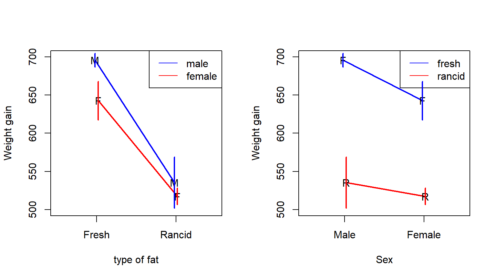
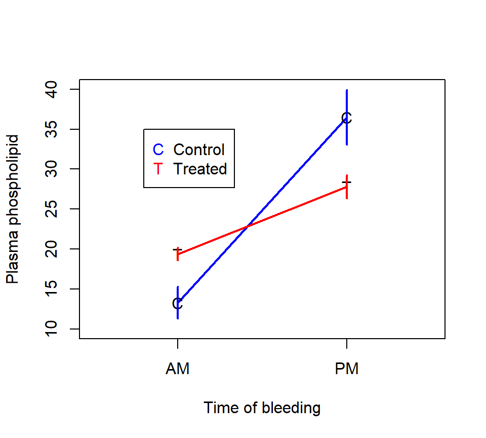
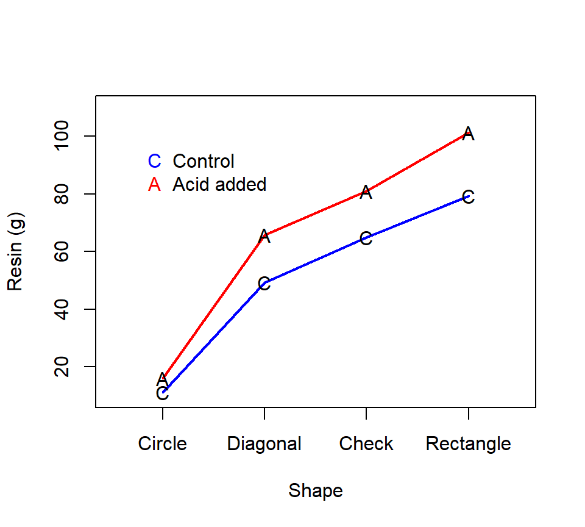
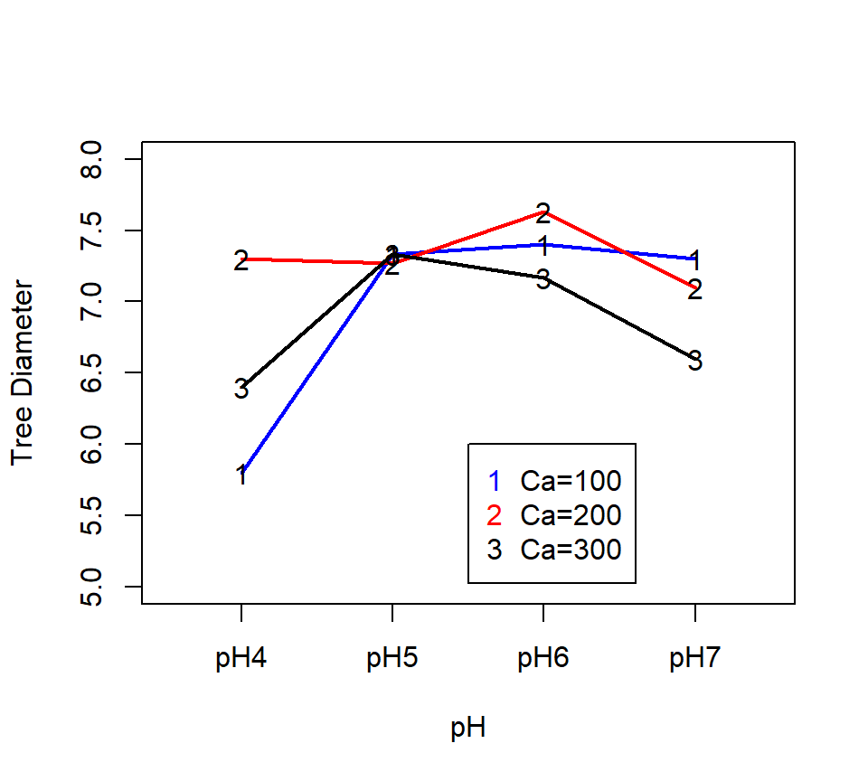
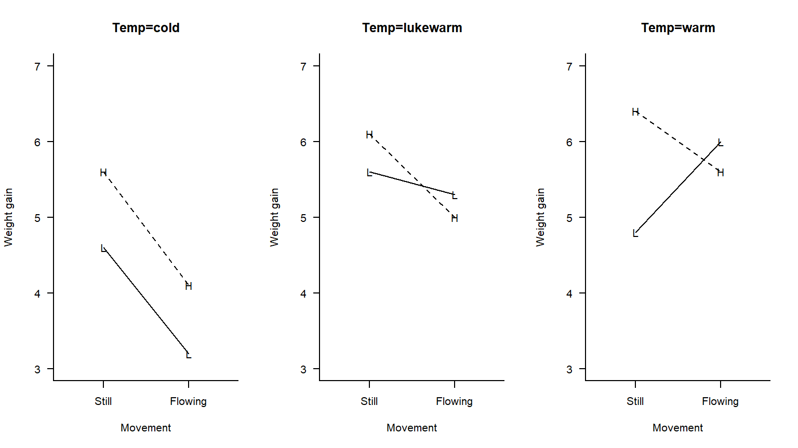

# Factorial experiments


In this section, we consider experiments where the treatment structure involves multiple experimental factors.

## Combining factors: Crossed vs.\ nested designs

There are two distinct ways in which experimental factors can be combined.  The distinction is illustrated by the following two experiments 

*Experiment 1.*  (A hypothetical experiment based on example 15.8 in Ott \& Longnecker):

A citrus orchard contains 3 different varieties of citrus trees.  Eight trees of each variety are randomly selected from the orchard.  Four different pesticides are randomly assigned to two trees of each variety and applied according to recommended levels.  The same four pesticides are used for each variety.  Yields of fruit (in bushels per tree) are recorded at the end of the growing season.  

<!-- \begin{center}\begin{tabular}{|p{0.9in}|p{0.9in}|p{0.9in}|p{0.9in}|p{0.9in}|} \hline  -->
<!--  & Pesticide 1 & Pesticide 2 & Pesticide 3 & Pesticide 4 \\ \hline  -->
<!-- Variety 1 & 49, 39 & 50, 55 & 43, 38 & 53, 48 \\ \hline  -->
<!-- Variety 2 & 55, 41 & 67, 58 & 53, 42 & 85, 73 \\ \hline  -->
<!-- Variety 3 & 66, 68 & 85, 92 & 69, 62 & 85, 99 \\ \hline  -->
<!-- \end{tabular}\end{center} -->

*Experiment 2.*  A study is conducted to investigate the effect of pest management practices on cotton in the central valley of California.  14 ranches are available for study.  Each of the 14 ranches is managed by one consultant.  

<!-- The arrangement of ranches and consultants is: -->

<!-- \begin{center} -->
<!-- \begin{tabular}{|p{0.9in}|p{0.9in}|p{0.9in}|p{0.9in}|p{0.9in}|} \hline  -->
<!-- Consultant & \multicolumn{4}{|p{3.6in}|}{Ranches:} \\ \hline  -->
<!-- CD & BLACCO & Bonanza & Cauzza  & Vandborg  \\ \hline  -->
<!-- MM & Fortune & Houlding  & Vista Verde &  \\ \hline  -->
<!-- JS & Azcal  & Golden & Newton & Stoneland  \\ \hline  -->
<!-- JV & Cotta & Hamilton & Talley &  \\ \hline  -->
<!-- \end{tabular} -->
<!-- \end{center} -->

In both experiments, there are two experimental factors---variety and pesticide in experiment 1, and consultant and ranch in experiment 2.  Each unique combination of factors forms a separate *treatment combination*.  In experiment 1, the treatment combinations are formed by crossing the two experimental factors.  That is to say, every level of the first factor (variety) is combined with every level of the second factor (pesticide).  This is an example of a *factorial* or *crossed design*.  In experiment 2, each level of one factor (ranch) is only combined with one single level of the other factor (consultant).  This is an example of a *hierarchical design*, and we would say that ranch is nested within the consultant.  

Experiments with more than two factors can give rise to designs that involve aspects of both crossed and nested designs. For example, if we three factors---call them factors "A", "B", and "C"---we might cross factors A and B and then nest factor C within the A*B cross.  

The remainder of this chapter concerns factorial designs.  We will begin by studying a two-factor cross. Most of the ideas involved in analyzing factorial designs can be mastered by studying a two-factor cross.  We will conclude this chapter with a three-factor design to see how ideas from two-factor designs extend to experiments with more than two factors.  

The analysis of factorial designs makes heavy use of the idea of [contrasts](#contrasts), so make sure you understand that material well.
 
 
<!-- ## Simple effects, main effects, and interaction effects -->

<!-- In a factorial experiment, we typically analyze three types of effects: simple effects, main effects and interaction effects.  We can illustrate these effects with the following hypothetical experiment:  A food scientist wants to know how the shelf-life of a product is affected by the temperature at which the product is packed (low vs.\ high temperature) and the wrapping material (foil vs.\ plastic).  They conduct a balanced 2 x 2 factorial experiment to investigate the effect of temperature and wrapping material on shelf life. -->

<!-- In notation, let temperature be factor "A", and let $i$ be an index that distinguishes the two temperatures.  That is, let $i = 1$ indicate low temperature and $i = 2$ indicate high temperature.  Let material be factor "B", and let $j$ be an index that distinguishes the two materials.  That is, let  $j = 1$ indicate foil and $j = 2$ indicate plastic. -->

<!-- Suppose for a moment that we actually know what the actual means (in units of days) are for each treatment combination.  (Remember, in real life the means for each treatment combination are parameters that have to be estimated.)  Let $\mu_{ij}$ denote the true mean response for the treatment combination formed by temperature $i$ and material $j$. -->
<!-- \begin{center} -->
<!-- 	\begin{tabular}{|p{1.1in}|p{1.1in}|p{1.1in}|p{1.1in}|} \hline  -->
<!-- 		\multicolumn{2}{|p{1in}|}{} & \multicolumn{2}{|p{2.2in}|}{Temperature} \\ \hline  -->
<!-- 		\multicolumn{2}{|p{1in}|}{} & Low & High \\ \hline  -->
<!-- 		Material & Foil & $\mu_{11} =2$ & $\mu_{21} =3$ \\ \hline  -->
<!-- 		& Plastic & $\mu_{12} =4$ & $\mu_{22} =5$ \\ \hline  -->
<!-- 	\end{tabular} -->
<!-- \end{center} -->
<!-- Each of the four means above are called *cell means*, because they provide the average response for each 'cell' in the factorial table.  More generally, cell means are the average response for each unique treatment combination. -->

<!-- In addition to cell means, we can define *marginal means* as the averages of cell means.  That is, the marginal mean for level $i$ of factor A is the average of each of the cell means associated with level $i$, where the average is taken over all the levels of factor B.  In a 2 $\times$ 2 design, the two marginal means for factor A are  -->
<!-- \[ -->
<!-- \bar{\mu}_{1+} =\frac{\mu_{11} +\mu_{12} }{2}  -->
<!-- \]  -->
<!-- and -->
<!-- \[ -->
<!-- \bar{\mu}_{2+} =\frac{\mu_{21} +\mu_{22} }{2}. -->
<!-- \]  -->

<!-- Similarly, we can define the marginal means for each level $j$ of factor B as the average of each of the cell means associated with level $j$, averaging over the levels of factor A.  In the 2 $\times$ 2 design, the marginal means associated with factor B are -->
<!-- \[ -->
<!-- \bar{\mu}_{+1} =\frac{\mu_{11} +\mu_{21} }{2}  -->
<!-- \]  -->
<!-- and -->
<!-- \[ -->
<!-- \bar{\mu}_{+2} =\frac{\mu_{12} +\mu_{22} }{2}. -->
<!-- \]  -->

<!-- Marginal means take their name because they are found by marginalizing over the level(s) of the other factor(s).  In a two-factor design, we might think about locating the marginal means in the margins of the table of cell means: -->
<!-- \begin{center} -->
<!-- \begin{tabular}{|p{0.9in}|p{0.9in}|p{0.9in}|p{0.9in}|p{0.8in}|} \hline  -->
<!-- \multicolumn{2}{|p{1in}|}{} & \multicolumn{2}{|p{1.8in}|}{Temperature} &  \\ \hline  -->
<!-- \multicolumn{2}{|p{1in}|}{} & Low & High &  \\ \hline  -->
<!-- Material & Foil & $\mu_{11} =2$ & $\mu_{21} =3$ & $\bar{\mu}_{+1} =2.5$ \\ \hline  -->
<!--  & Plastic & $\mu_{12} =4$ & $\mu_{22} =5$ & $\bar{\mu}_{+2} =4.5$ \\ \hline  -->
<!-- \multicolumn{2}{|p{1in}|}{} & $\bar{\mu}_{1+} =3$ & $\bar{\mu}_{2+} =4$ &  \\ \hline  -->
<!-- \end{tabular} -->
<!-- \end{center} -->

<!-- Finally, we can define the grand mean as the average of marginal means.  In a 2 $\times$ 2 design, -->
<!-- \[ -->
<!-- \bar{\mu}_{++} =\frac{\bar{\mu}_{1+} +\bar{\mu}_{2+} }{2} =\frac{\bar{\mu}_{+1} +\bar{\mu}_{+2} }{2}  -->
<!-- \]  -->
<!-- Sometimes the grand mean is placed in the lower right-hand corner of the table of cell means: -->
<!-- \begin{center} -->
<!-- \begin{tabular}{|p{0.9in}|p{0.9in}|p{0.9in}|p{0.9in}|p{0.8in}|} \hline  -->
<!-- \multicolumn{2}{|p{1in}|}{} & \multicolumn{2}{|p{1.8in}|}{Temperature} &  \\ \hline  -->
<!-- \multicolumn{2}{|p{1in}|}{} & Low & High &  \\ \hline  -->
<!-- Material & Foil & $\mu_{11} =2$ & $\mu_{21} =3$ & $\bar{\mu}_{+1} =2.5$ \\ \hline  -->
<!--  & Plastic & $\mu_{12} =4$ & $\mu_{22} =5$ & $\bar{\mu}_{+2} =4.5$ \\ \hline  -->
<!-- \multicolumn{2}{|p{1in}|}{} & $\bar{\mu}_{1+} =3$ & $\bar{\mu}_{2+} =4$ & $\bar{\mu}_{++} =3.5$ \\ \hline  -->
<!-- \end{tabular} -->
<!-- \end{center} -->

<!-- Let's visualize the structure of these cell means with an interaction plot.  (Other authors call these profile plots.)  To construct an interaction plot, write the levels of one factor along the horizontal axis, and use the vertical axis to denote the response.  Draw lines on the plot for each level of the other experimental factor.   Two possible interaction plots for the above means are: -->
<!-- ```{r echo = FALSE, fig.width = 8} -->
<!-- par(oma=rep(0,4),mar=c(5,5,0,0),mfrow=c(1,2),las=1,bty='l') -->

<!-- plot(c(-0.5,1.5),c(1,6),type="n",xlab="Material",ylab="Shelf life",xaxt="n") -->
<!-- axis(1,at=0:1,lab=c("F","P")) -->
<!-- lines(c(0,1),c(2,4)) -->
<!-- lines(c(0,1),c(3,5),lty="dashed") -->
<!-- points(c(0,1),c(2,4),pch="L") -->
<!-- points(c(0,1),c(3,5),pch="H") -->

<!-- plot(c(-0.5,1.5),c(1,6),type="n",xlab="Temperature",ylab="Shelf life",xaxt="n") -->
<!-- axis(1,at=0:1,lab=c("L","H")) -->
<!-- lines(c(0,1),c(2,3)) -->
<!-- lines(c(0,1),c(4,5),lty="dashed") -->
<!-- points(c(0,1),c(2,3),pch="F") -->
<!-- points(c(0,1),c(4,5),pch="P") -->
<!-- ``` -->

<!-- Note that regardless of which factor we choose to place on the horizontal axis, the lines above are parallel.  This indicates that the effects of the two factors do not depend on one another.  When the effects of two (or more) factors do not depend on one another, we say that the effects of those factors are *additive*.   -->

<!-- We can also express this idea mathematically.  The *simple-effects comparisons* (or just simple effects) for a factor describe the differences among cell means associated with that factor at a single level of the other factor(s).  In a 2 $\times$ 2 factorial design, simple effects can be expressed as simple differences.  For example, to calculate the simple effect of temperature on food products wrapped in foil, simply calculate the difference $\mu_{21} -\mu_{11} =3-2=1$.  This difference means that for food products wrapped in foil, products packed at high temperature last 1 day longer than products wrapped at low temperature.   -->

<!-- Similarly, we could calculate: -->

<!-- * The simple effect of temperature on food products wrapped in plastic: -->
<!-- 	\[\mu_{22} -\mu_{12} =5-4=1\]  -->

<!-- * The simple effect of material on food products packed at low temperatures: -->
<!-- 	\[\mu_{12} -\mu_{11} =4-2=2\]  -->

<!-- * The simple effect of material at food products packed at high temperatures: -->
<!-- 	\[\mu_{22} -\mu_{21} =5-3=2\]  -->


<!-- In this case, the effect of temperature on shelf life does not depend on the type of material in which the food was wrapped.  Similarly, the effect of material does not depend on the temperature at which the food was packed.  This is a more precise expression of what we mean when we say that the effects of each factor do not depend on one another. -->

<!-- We can also define *main-effects comparisons* (or just main effects) for each experimental factor.  Main effects describe differences among the marginal means associated with each level of an experimental factor.  In a 2 $\times$ 2 design, main effects can be expressed as simple differences.  In the example above, we could quantify the main effect of temperature as the difference -->
<!-- \[\bar{\mu}_{2+} -\bar{\mu}_{1+} =4-3=1.\]  -->
<!-- Similarly, we can quantify the main effect of material as the difference -->
<!-- \[\bar{\mu}_{+2} -\bar{\mu}_{+1} =4.5-2.5=2.\]  -->
<!-- With a little algebra, it can also be shown that main effects are equal to averages of simple effects.  That is, in the example above, the main effect of temperature is equal to the average of the simple effect of temperature for foods wrapped in foil, and the simple effect of temperature for foods wrapped in plastic.  Whether you prefer to think about main effects as differences among marginal means or as averages of simple effect is up to you --- both interpretations work equally well. -->

<!-- Now, suppose that instead the means for each treatment combination are  -->
<!-- \begin{center} -->
<!-- 	\begin{tabular}{|p{0.9in}|p{0.9in}|p{0.9in}|p{0.9in}|p{0.8in}|} \hline  -->
<!-- 		\multicolumn{2}{|p{1in}|}{} & \multicolumn{2}{|p{1.8in}|}{Temperature} &  \\ \hline  -->
<!-- 		\multicolumn{2}{|p{1in}|}{} & Low & High &  \\ \hline  -->
<!-- 		Material & Foil & $\mu_{11} =2$ & $\mu_{21} =3$ & $\bar{\mu}_{+1} =2.5$ \\ \hline  -->
<!-- 		& Plastic & $\mu_{12} =4$ & $\mu_{22} =6$ & $\bar{\mu}_{+2} =5$ \\ \hline  -->
<!-- 		\multicolumn{2}{|p{1in}|}{} & $\bar{\mu}_{1+} =3$ & $\bar{\mu}_{2+} =4.5$ & $\bar{\mu}_{++} =3.75$ \\ \hline  -->
<!-- 	\end{tabular} -->
<!-- \end{center} -->

<!-- Again, let's visualize the structure of these means with an interaction plot: -->
<!-- ```{r echo = FALSE, fig.width = 8} -->
<!-- par(oma=rep(0,4),mar=c(5,5,0,0),mfrow=c(1,2),las=1,bty='l') -->

<!-- plot(c(-0.5,1.5),c(1,6.5),type="n",xlab="Material",ylab="Shelf life",xaxt="n") -->
<!-- axis(1,at=0:1,lab=c("F","P")) -->
<!-- lines(c(0,1),c(2,4)) -->
<!-- lines(c(0,1),c(3,6),lty="dashed") -->
<!-- points(c(0,1),c(2,4),pch="L") -->
<!-- points(c(0,1),c(3,6),pch="H") -->

<!-- plot(c(-0.5,1.5),c(1,6.5),type="n",xlab="Temperature",ylab="Shelf life",xaxt="n") -->
<!-- axis(1,at=0:1,lab=c("L","H")) -->
<!-- lines(c(0,1),c(2,3)) -->
<!-- lines(c(0,1),c(4,6),lty="dashed") -->
<!-- points(c(0,1),c(2,3),pch="F") -->
<!-- points(c(0,1),c(4,6),pch="P") -->
<!-- ``` -->

<!-- Note that the lines above are no longer parallel.  This is a visual indication that the effects of the two factors depend on one another.  Or, to put it another way, there is an interaction between the two factors. -->

<!-- Again, we can express this idea mathematically.  Let's repeat the process of measuring the simple effect of each treatment factor: -->
<!--  + Simple effect of temperature on food products wrapped in foil: -->
<!-- 	\[\mu_{21} -\mu_{11} =3-2=1\]  -->

<!--  + Simple effect of temperature on food products wrapped in plastic: -->
<!-- 	\[\mu_{22} -\mu_{12} =6-4=2\]  -->

<!--  + Simple effect of material on food products packed at low temperatures: -->
<!-- 	\[\mu_{12} -\mu_{11} =4-2=2\]  -->

<!--  + Simple effect of material at food products packed at high temperatures: -->
<!-- 	\[\mu_{22} -\mu_{21} =6-3=3\]  -->

<!-- In this case, the effect of temperature on shelf life depends on the type of material in which the food was wrapped.  Similarly, the effect of material depends on the temperature at which the food was packed.  We describe this dependence by saying that the treatments *interact*. -->

<!-- Now, suppose that instead the means for each treatment combination are  -->
<!-- \begin{center} -->
<!-- 	\begin{tabular}{|p{0.9in}|p{0.9in}|p{0.9in}|p{0.9in}|p{0.8in}|} \hline  -->
<!-- 		\multicolumn{2}{|p{1in}|}{} & \multicolumn{2}{|p{1.8in}|}{Temperature} &  \\ \hline  -->
<!-- 		\multicolumn{2}{|p{1in}|}{} & Low & High &  \\ \hline  -->
<!-- 		Material & Foil & $\mu_{11} =2$ & $\mu_{21} =3$ & $\bar{\mu}_{+1} =2.5$ \\ \hline  -->
<!-- 		& Plastic & $\mu_{12} =4$ & $\mu_{22} =6$ & $\bar{\mu}_{+2} =5$ \\ \hline  -->
<!-- 		\multicolumn{2}{|p{1in}|}{} & $\bar{\mu}_{1+} =3$ & $\bar{\mu}_{2+} =4.5$ & $\bar{\mu}_{++} =3.75$ \\ \hline  -->
<!-- 	\end{tabular} -->
<!-- \end{center} -->


<!-- Suppose we wanted to quantify the interaction between the treatments in the second example above.  We could do so by taking the difference of the simple effects of temperature: -->
<!-- \[ -->
<!-- \left(\mu_{22} -\mu_{12} \right)-\left(\mu_{21} -\mu_{11} \right)=\left(6-4\right)-\left(3-2\right)=2-1=1 -->
<!-- \]  -->
<!-- Alternatively, we could calculate the difference between the simple effects of material: -->
<!-- \[ -->
<!-- \left(\mu_{22} -\mu_{21} \right)-\left(\mu_{12} -\mu_{11} \right)=\left(6-3\right)-\left(4-2\right)=3-2=1 -->
<!-- \]  -->
<!-- Each of the above calculations are measures of an *interaction effect*.  In a 2 $\times$ 2 factorial design, an interaction effect is a ``difference of differences'', or a measure of how one factor effects the simple effects of the other factor.  It is not just coincidence that the two measures of the interaction above produce the same number (=1).  In fact, as we will show in a moment, in a 2 $\times$ 2 factorial design, there is only a single free difference (or degree of freedom) for the interaction effect.  Because there is only a single degree of freedom, the two differences of differences above must be equal.  (You might also be able to verify this with a little algebra.) -->

<!-- **Perhaps the single greatest conceptual pitfall in the analysis of factorial designs is appreciating the difficulty of interpreting main effects when the experimental factors interact.**  When the two factors in an experiment interact, we can still define main effects mathematically.  In the example above, the main effect of temperature is now -->
<!-- \[\bar{\mu}_{2+} -\bar{\mu}_{1+} =4.5-3=1.5\]  -->
<!-- and the main effect of  material is now -->
<!-- \[\bar{\mu}_{+2} -\bar{\mu}_{+1} =5-2.5=2.5.\]  -->
<!-- Are these differences meaningful?  The answer usually depends on the scientific context of the data.  In the presence of an interaction, main effects are only meaningful if it makes sense to average over the levels of an experimental factor.  While averaging over the levels of one experimental factor may seem harmless for the (relatively mild) interaction above, consider what might happen with a more severe interaction, such as the one here: -->
<!-- \begin{center} -->
<!-- \begin{tabular}{|p{0.9in}|p{0.9in}|p{0.9in}|p{0.9in}|p{0.8in}|} \hline  -->
<!-- \multicolumn{2}{|p{1in}|}{} & \multicolumn{2}{|p{1.8in}|}{Temperature} &  \\ \hline  -->
<!-- \multicolumn{2}{|p{1in}|}{} & Low & High &  \\ \hline  -->
<!-- Material & Foil & $\mu_{11} =2$ & $\mu_{21} =5$ & $\bar{\mu}_{+1} =3.5$ \\ \hline  -->
<!--  & Plastic & $\mu_{12} =4$ & $\mu_{22} =1$ & $\bar{\mu}_{+2} =2.5$ \\ \hline  -->
<!-- \multicolumn{2}{|p{1in}|}{} & $\bar{\mu}_{1+} =3$ & $\bar{\mu}_{2+} =3$ & $\bar{\mu}_{++} =3$ \\ \hline  -->
<!-- \end{tabular} -->
<!-- \end{center} -->
<!-- ```{r echo = FALSE, fig.width = 8} -->
<!-- par(oma=rep(0,4),mar=c(5,5,0,0),mfrow=c(1,2),las=1,bty='l') -->

<!-- plot(c(-0.5,1.5),c(0.5,5.5),type="n",xlab="Material",ylab="Shelf life",xaxt="n") -->
<!-- axis(1,at=0:1,lab=c("F","P")) -->
<!-- lines(c(0,1),c(2,4)) -->
<!-- lines(c(0,1),c(5,1),lty="dashed") -->
<!-- points(c(0,1),c(2,4),pch="L") -->
<!-- points(c(0,1),c(5,1),pch="H") -->

<!-- plot(c(-0.5,1.5),c(0.5,5.5),type="n",xlab="Temperature",ylab="Shelf life",xaxt="n") -->
<!-- axis(1,at=0:1,lab=c("L","H")) -->
<!-- lines(c(0,1),c(2,5)) -->
<!-- lines(c(0,1),c(4,1),lty="dashed") -->
<!-- points(c(0,1),c(2,5),pch="F") -->
<!-- points(c(0,1),c(4,1),pch="P") -->
<!-- ``` -->

<!-- In this case, the simple effects of temperature are equal and opposite.  (High temperature increases shelf life by 3 days for foods packed in foil, but decreases shelf life by 3 days for foods packed in plastic.)  Thus, the main effect of temperature is zero!  Certainly, it would be erroneous to conclude that temperature has no effect on shelf life based on the fact that the marginal means for the two temperature treatments are equal.  In this case, the only way to appropriately characterize the effects of temperature is to consider the simple effects.  The main effects are downright misleading. -->

<!-- Thus, the conventional approach to analyzing two-way factorial classifications is to **inspect the interaction first**.  If the interaction is not significant, then analyze main effects.  If the interaction is significant, then analyze simple effects.  Main effects and simple effects can be analyzed using the same approaches as a one-factor ANOVA (i.e., $F$-test for overall effects, followed by linear combinations and/or multiple comparisons procedures if the overall $F$-test is significant.) -->

## 2 $\times$ 2 factorial design

We will first study the simplest of all factorial designs, a 2-by-2 cross.  We will then progress to two-factor crosses in which each factor may have an arbitrary number of levels.  

In a two-factor design, the two factors can be generically labeled as factors "A" and "B".  The scientific questions of most interest in a two-factor design are:

 1. Does the average response differ among the levels of factor A, and if so, how?

 2. Does the average response differ among the levels of factor B, and if so, how?

 3. Do the differences among the levels of factor A depend on the level of factor B, and vice versa?  If so, how?  That is to say, is there evidence of an *interaction* between the two factors?

### Example: Weight gain in rats

Consider the following example taken from @sokal1995biometry.  This experiment was designed to examine differences in food consumption among rats.  6 male rats and 6 female rats were used in the experiment.  Half the rats were fed fresh lard (fat), and half the rats were fed rancid fat.  The response is total food consumption (in grams) over 73 days.  This is a 2 $\times$ 2 factorial design with a CRD.  The experiment is balanced.  

<!-- \begin{center} -->
<!-- \begin{tabular}{|p{1.1in}|p{1.1in}|p{1.1in}|p{1.1in}|} \hline  -->
<!-- \multicolumn{2}{|p{1in}|}{} & \multicolumn{2}{|p{2.2in}|}{Fat} \\ \hline  -->
<!-- \multicolumn{2}{|p{1in}|}{} & Fresh & Rancid \\ \hline  -->
<!-- Sex & Male & 709, 679, 699 & 592, 538, 476 \\ \hline  -->
<!--  & Female & 657, 594, 677 & 508, 505, 539 \\ \hline  -->
<!-- \end{tabular} -->
<!-- \end{center} -->

Here is some notation that we will use for two-factor experiments:

+ $a$: number of levels of factor "A" (here, we'll set 'sex' as this factor, so $a = 2$.)

+ $b$: number of levels of factor "B" (here, we'll set 'fat' as this factor, so $b = 2$.)

+ $i = 1, 2, \ldots, a$: an index to distinguish the different levels of factor A ($i = 1$ for males, $i = 2$ for females)

+ $j = 1, 2, \ldots, b$: an index to distinguish the different levels of factor B ($j = 1$ for fresh fat, $j = 2$ for rancid fat)

+ $n_{ij}$:  sample size for the combination of level $i$ of factor A and level $j$ of factor B (in a balanced design, sometimes this gets replaced by $n$).

+ $k = 1, 2, \ldots, n_{ij}$: an index to distinguish the different observations within each treatment combination

+ $y_{ijk}$:  $k$th observation from the combination of level $i$ of factor A and level $j$ of factor B.

+ $n_T =\sum _{i=1}^{a}\sum _{j=1}^{b}n_{ij}$ : total sample size

+ $\bar{y}_{ij+} =\dfrac{\sum _{k=1}^{n_{ij}} y_{ijk}}{n_{ij}}$:  sample mean for the combination of level $i$ of factor A and level $j$ of factor B

+ $\mu_{ij}$ : unknown population mean for the combination of level $i$ of factor A and level $j$ of factor B

For a two-way layout, it is often convenient to visualize the differences among the treatment means with an *interaction plot*. (Other authors call these profile plots.)  To construct an interaction plot, write the levels of one factor along the horizontal axis, and use the vertical axis to denote the response.  Draw lines on the plot for each level of the other experimental factor. 
Two possible interaction plots for the above means are:
<div class="figure" style="text-align: center">

<p class="caption">(\#fig:rat-intxn)Interaction plots of the rat weight-gain data</p>
</div>

Notice how the two versions of the plot show the same information but emphasize different comparisons.  Which version you prefer is a matter of taste.

### Two-factor ANOVA hypothesis tests

The traditional approach to analyzing a two-factor design is through a two-factor ANOVA.  A two-factor ANOVA uses the variation among the group means to test for differences in the mean response across the levels of each factor and for an interaction between the factors. 

To understand these comparisons, it is useful to have some additional terminology.  We define the average responses associated with each treatment combination (what we have written above a $\mu_{ij}$) as *cell means*.  (The name "cell mean" arises from the fact that we often think of each treatment combination as corresponding to a "cell" in a table in which each factor corresponds to one of the table's dimensions.)  A *marginal mean* is the average of all the cell means associated with one level of one factor, averaged over all the levels of the other factor(s).  For example, in the rat weight-gain data, the marginal mean associated with the male rats is
\[
\bar{\mu}_{1+} = \dfrac{\mu_{11} + \mu_{12}}{2}.
\]
Here, we've used the notational convention of using a plus (+) subscript to indicate that we are summing over the levels of an index.  Similarly, the marginal mean associated with rats fed fresh fat is
\[
\bar{\mu}_{+1} = \dfrac{\mu_{11} + \mu_{21}}{2}.
\]

#### Comparisons of marginal means

The two-factor ANOVA provides $F$-tests to test for differences among the marginal means of each factor.  In the rat example, one $F$-test tests the null hypothesis that there is no difference between the marginal means for male and female rats:
\[
H_0: \bar{\mu}_{1+} =\bar{\mu}_{2+}
\]
and another $F$-test tests the null hypothesis that there is no difference between the marginal means for the two tupes of fat:
\[
H_0: \bar{\mu}_{+1} =\bar{\mu}_{+2}.
\]
When there are more than two levels of one or both of the factors, these $F$-tests correspond to tests of equality of all the marginal means.  For example, when there are more than two levels of factor "A", the ANOVA $F$-test of this factor corresponds to the null hypothesis
\[
H_0: \bar{\mu}_{1+} =\bar{\mu}_{2+} = \ldots = \bar{\mu}_{a+}.
\]

Notice that each of these null hypotheses corresponds to a contrast of the cell means.  It may take a little work to see this, but we can do it.  For example, our test for a difference between the marginal means of the two types of fat can be re-expressed as
the contrast
\[
\begin{align}
\theta & = \bar{\mu}_{+1} -\bar{\mu}_{+2} \\
       & = \dfrac{1}{2}\mu_{11} + \dfrac{1}{2}\mu_{21} -  \dfrac{1}{2}\mu_{12} - \dfrac{1}{2}\mu_{22}.
\end{align}
\]

Because there are only two types of fat, the comparison between the two marginal means is a simple contrast.  More generally, the test for the equality of $a$ marginal means is a complex contrast that involves $a-1$ linearly independent (or non-redundant) simple contrasts.  

We will sometimes refer to comparisons of marginal means as the *main-effects* comparisons associated with a particular factor.

#### Interaction

To think through the interaction, it is helpful to have a bit more terminology at our disposal.  We define the *simple effect* of a factor as the comparisons among the levels of one factor within the level(s) of the other factor(s).  For example, in the rat experiment, the simple effect of type of fat for male rats is the comparison between male rats fed fresh fat vs.\ male rats fed rancid fat.  In our notation, this corresponds to the difference 
\[
\theta_{\mbox{fat:male}} = \mu_{11} - \mu_{12}. 
\]
Note that this simple-effect comparison is a simple contrast of the cell means.  Similarly, we can define the simple effect of fat type for female rats as the comparison between female rats fed fresh fat vs.\ female rats fed rancid fat, or, in notation,
\[
\theta_{\mbox{fat:female}} = \mu_{21} - \mu_{22}. 
\]

An *interaction* is a comparison of simple effects.  In the rat data, the ANOVA $F$-test of the interaction corresponds to a test of
\[
H_0: \theta_{\mbox{fat:male}} = \theta_{\mbox{fat:female}}
\]
or
\[
H_0: \mu_{11} - \mu_{12} = \mu_{21} - \mu_{22}.
\]
Just as with regression, interactions go both ways: if the differences between the types of fat differs between male and female rats, then it also must be true that the differences between male and female rats depends on the type of fat. Notice also that, yet again, our test for an interaction can be expressed as a (in this case, simple) contrast of the cell means.

The interaction plots in Figure \@ref(fig:rat-intxn) are helpful for visualizing what is meant by an interaction.  Consider the interaction plot on the left of Fig.\ \@ref(fig:rat-intxn) (with type of fat on the horizontal axis).  The simple effect of type of fat for male rats corresponds to the left-vs-right comparison for the blue (male) line.  The simple effect of type of fat for female rats corresponds to the same left-vs-right comparison for the red (female) line.  The interaction asks if these two simple effects are the same or different for male vs.\ female rats.

Alternatively (and continuing to use the interaction plot on the left of Fig.\ \@ref(fig:rat-intxn)), the simple effect of sex with fresh fat corresponds to the blue-vs-red comparison on the left of the plot.  The simple effect of sex for rancid fat corresponds to the same blue-vs-red comparison on the right of the plot.  The interaction asks if these two simple effects are the same or different for fresh vs.\ rancid fat.

#### Main-effects as averages of simple effects

Now that we are equipped with the idea of simple effects, notice that we can also define the main-effects comparisons as the averages of the simple effects.   For example, the difference between the marginal mean for rats fed fresh fat vs.\ the marginal mean for rats fed rancid fat is just the average of the simple effects for type of fat in male and female rats.  With this recognition comes a crucial point: If the interaction is significant, then we need to be careful about analyzing the main effects, because the main effects are averaging over simple effects that we know to differ.  Thus, the conventional approach to analyzing two-way factorial classifications is to **inspect the interaction first**.  If the interaction is not significant, proceed to analyze main effects of each factor.  If the interaction is significant, then analyze simple effects, and interpret the main-effects comparison cautiously.

#### Sum-of-squares decompositions

To sum up so far: the two-factor ANOVA generates three $F$-tests: one to test for the equality of marginal means for the first factor, one to test for the equality of marginal means for the second factor, and one to test for the interaction between the two factors.  Each of these tests are (possibly complex) contrasts.  The tests of these contrasts proceed by computing the sum-of-squares for each contrasts and comparing this to the error sum-of-squares in the usual way.  The number of "free differences" (or linearly independent contrasts) associated with each contrasts is
<table>
 <thead>
  <tr>
   <th style="text-align:left;"> source </th>
   <th style="text-align:left;"> df </th>
  </tr>
 </thead>
<tbody>
  <tr>
   <td style="text-align:left;"> Factor A </td>
   <td style="text-align:left;"> $a-1$ </td>
  </tr>
  <tr>
   <td style="text-align:left;"> Factor B </td>
   <td style="text-align:left;"> $b-1$ </td>
  </tr>
  <tr>
   <td style="text-align:left;"> A*B interaction </td>
   <td style="text-align:left;"> $(a-1)(b-1)$ </td>
  </tr>
  <tr>
   <td style="text-align:left;"> Error </td>
   <td style="text-align:left;"> $n_T-ab$ </td>
  </tr>
  <tr>
   <td style="text-align:left;"> Total </td>
   <td style="text-align:left;"> $n_T-1$ </td>
  </tr>
</tbody>
</table>

Another way to think about this is that (for example) there are $a$ marginal means for factor A, hence there are $a-1$ differences among those means.  For the interaction, there are $b-1$ ways in which the $a-1$ differences among the levels of factor A can differ among the levels of factor B; hence, the interaction entails $(a-1)(b-1)$ free differences (or linearly independent contrasts).  

Just as with a one-factor ANOVA, the sums-of-squares in a balanced two-factor ANOVA can be computed using computing formulas that involve nothing more than addition, subtraction, multiplication, and division.  These computing formulas were more important in the days before the advent of desktop computing.  While there may be some small historical value to seeing how this worked, we won't be computing these quantities by hand today.  The formulas follow for completeness, but don't feel compelled to study them.  

The computing formulas begin with the usual one-factor SS decomposition:
\begin{eqnarray*}
\mbox{Total variation: } SS_{Total} & = & \sum_{i=1}^{a}\sum_{j=1}^{b}\sum_{k=1}^{n_{ij} }\left(y_{ijk} -\bar{y}_{+++} \right)^2   \\
\mbox{Variation among groups: } SS_{Groups} & = & \sum_{i=1}^{a}\sum_{j=1}^{b}\sum_{k=1}^{n_{ij} }\left(\bar{y}_{ij+} -\bar{y}_{+++} \right)^2 \\
\mbox{Variation within groups: } SS_{Error} & = & \sum_{i=1}^{a}\sum_{j=1}^{b}\sum_{k=1}^{n_{ij} }\left(y_{ijk} -\bar{y}_{ij+} \right)^2    
\end{eqnarray*}

Next, these formulas decompose the $SS_{Groups}$ into three separate SS: one for each of the two main effects, and one for the interaction.  Formulas for these sum-of-squares are:
\begin{eqnarray*}
	SS[A] & = & \sum_{i=1}^{a}\sum_{j=1}^{b}\sum_{k=1}^{n_{ij} }\left(\bar{y}_{i++} -\bar{y}_{+++} \right)^2 \\  
	SS[B] & = & \sum_{i=1}^{a}\sum_{j=1}^{b}\sum_{k=1}^{n_{ij} }\left(\bar{y}_{+j+} -\bar{y}_{+++} \right)^2  \\ 
	SS[AB] & = & \sum_{i=1}^{a}\sum_{j=1}^{b}\sum_{k=1}^{n_{ij} }\left(\bar{y}_{ij+} -\bar{y}_{i++} -\bar{y}_{+j+} +\bar{y}_{+++} \right)^2   
\end{eqnarray*}
where SS[AB] denotes the sum-of-squares for the interaction.  The formulas for SS[A] and SS[B] should make some sense: they consist of squared differences between the marginal means for one level of an experimental factor and the grand mean.  The formula for SS[AB] is a bit more mysterious.  Heuristically, the idea is this: with some algebra, the null hypothesis for no interaction $H_0$: $\mu_{ij} -\bar{\mu}_{++} =\bar{\mu}_{+i} -\bar{\mu}_{++} +\bar{\mu}_{+j} -\bar{\mu}_{++}$ can be re-written as $H_0$: $\mu_{ij} -\bar{\mu}_{+i} -\bar{\mu}_{+j} +\bar{\mu}_{++} =0$.  Thus, the term $\bar{y}_{ij+} -\bar{y}_{i++} -\bar{y}_{+j+} +\bar{y}_{+++}$ measures the extent to which the mean of group $ij$ departs this null hypothesis.

In a two-way factorial design, when the data are balanced, SS[A], SS[B], and SS[AB] form a perfect decomposition of $SS_{Groups}$.  That is, 
\[
SS_{Groups} = SS[A] + SS[B] + SS[AB].
\]

#### Back to the rat data

Let's see how this works for the rat weight-gain data.  Here's a sum-of-squares decomposition for the rat data, along with the df associated with each term in the ANOVA:

```{} 
		Source    df     SS     MS 
		Sex        1   3781   3781
		Fat        1  61204  61204
		Sex*Fat    1    919    919 
		Error      8  11667   1458
		Total     11  77570
```

We can test for the statistical significance of the main effects of Sex and Fat, and for the interaction between Sex and Fat, by computing $F$-ratios.  $F$-ratios are simply the ratio of the MS for the factor being tested divided by the MS(Error).  For example, the $F$-ratio for the test of the interaction is
\[
F = \dfrac{MS[AB]}{MSE} = \dfrac{919}{1458}  = 0.63
\]
We can calculate a $p$-value for the test of the null hypothesis that there is no interaction between the factors by comparing this statistic to an $F$-distribution with 1 numerator df and 8 denominator df.  (The numerator and denominator df are just the number of free differences used to calculate the MS in the numerator and denominator of the $F$ statistic, respectively.)  Because larger values of the $F$ statistic provide more evidence against the null hypothesis, $p$-values associated with the F-test are always one-tailed, and are the probability of observing a test statistic at least as large as the value observed.  Here, the probability of observing an $F$-statistic with 1 ndf and 8 ddf greater than or equal to 0.63 is $p=0.45$.  The $p$ value is large, so we have no evidence that the two factors in this experiment interact, with respect to their effect on weight gain.

We can conduct similar calculations to test for the main effects of 'sex' and 'fat', using MS[A] and MS[B], respectively.  We'll use these values to complete our ANOVA table for the rat example:
```{} 
		Source    df     SS     MS      F        p
		Sex        1   3781   3781   2.59   0.1460
		Fat        1  61204  61204  42.0    0.0002
		Sex*Fat    1    919    919   0.63   0.4503
		Error      8  11667   1458
		Total     11  77570
```

Thus, there is no evidence of an interaction between the factors.  Proceeding with an analysis of the main effects, there is no evidence that the marginal means for male vs.\ female rates differ ($p=0.146$), but there is strong evidence that the marginal means between fresh vs.\ rancid fat differ ($p = 0.0002$).

As with one-factor ANOVA, the two-factor ANOVA $F$-tests are usually just the beginning of our analysis.  We usually want to go further and to characterize how the means differ for any signficant effect that we've found.  In this case, because the main effect of 'fat' is significant, we want to go further and say more about the sign and magnitude of this effect.  To do so, we'll reformulate contrast that quantifies the main effect of fat.  
\[
\theta _{fat} =\bar{\mu}_{+2} -\bar{\mu}_{+1} =\frac{\mu_{12} +\mu_{22} }{2} -\frac{\mu_{11} +\mu_{21} }{2} 
\] 
We've written this contrast as the difference between the marginal mean for rancid fat and the marginal mean for fresh fat.  Thus, a positive value corresponds to rats gaining more weight when fed rancid fat, and a negative value corresponds to rats gaining more weight when fed fresh fat.  Of course, we'll usually estimate this effect and its standard error using software, but it's worth seeing that we can do the calculation by hand if we want to be doubly sure that the software is giving the right answer.  The contrast can be estimated by simply by plugging in sample means:
\[
{\hat{\theta }_{fat} =\dfrac{\bar{y}_{12+} +\bar{y}_{22+} }{2} -\dfrac{\bar{y}_{11+} +\bar{y}_{21+} }{2} }  {=\dfrac{535+517}{2} -\dfrac{696+643}{2} }  {=-143} 
\] 
Thus, we estimate that rats fed rancid fat gain 143g less weight than rats fed fresh fat.  The standard error can also be computed using a modification of the formula from linear combinations for one-factor ANOVA:
\begin{eqnarray*}
s_{\hat{\theta}} & = & \sqrt{\left\{\frac{c_{11}^2}{n_{11}} +\frac{c_{12}^2}{n_{12}} +\frac{c_{21}^2}{n_{21}} +\frac{c_{22}^2}{n_{22}} \right\} MS_{Error} } \\ 
& = & \sqrt{\left\{\frac{\left(-1/2\right)^2 }{3} +\frac{\left(1/2\right)^2 }{3} +\frac{\left(-1/2\right)^2 }{3} +\frac{\left(1/2\right)^2 }{3} \right\}1458}  \\ 
& = & 22.0 
\end{eqnarray*}
Finally, if we wanted a 95\% CI for this linear combination, we could form one by taking the appropriate critical values from a t-distribution with 8 df.  (Here, 8 df because the MSE is calculated based on 8 df).  Here, the appropriate critical value is 2.306, so a 95\% CI for the main effect of fat is -143g $\pm$ 2.306 $\times$ 22.0g = (-92g, -194g).

### A second example when the interaction is significant

This example is taken from @steel1997principles.  In their words, 

> Wilkinson (1954) reports the results of an experiment to study the influence of time of bleeding and diethylstilbestrol (an estrogenic compound) on plasma phospholipid in lambs.  Five lambs were assigned at random to each of four treatment groups; treatment combinations are for morning and afternoon bleeding and with and without diethylstilbestrol treatment.

<!-- The data are: -->
<!-- \begin{center} -->
<!-- 	\begin{tabular}{|p{1.1in}|p{1.1in}|p{1.1in}|p{1.1in}|} \hline  -->
<!-- 		\multicolumn{2}{|p{1in}|}{} & \multicolumn{2}{|p{2.2in}|}{Time of bleeding} \\ \hline  -->
<!-- 		\multicolumn{2}{|p{1in}|}{} & AM & PM \\ \hline  -->
<!-- 		Diethylstilbestrol trt & Control & 8.53, 20.53, 12.53, 14.00, 10.80 & 39.14, 26.20, 31.33, 45.80, 40.20 \\ \hline  -->
<!-- 		& Treated & 17.53, 21.07, 20.80, 17.33, 20.07 & 32.00, 23.80, 28.87, 25.06, 29.33 \\ \hline  -->
<!-- 	\end{tabular} -->
<!-- \end{center} -->

An interaction plot of the data is shown below.


Here is the output of a two-factor ANOVA model using PROC GLM:
```{}
proc glm data=sheep;
  class time drug trt;
  model y = time|drug;
run;

                                        Sum of
Source                      DF         Squares     Mean Square    F Value    Pr > F
Model                        3     1539.406600      513.135533      21.61    <.0001
Error                       16      379.923280       23.745205
Corrected Total             19     1919.329880

Source                      DF     Type III SS     Mean Square    F Value    Pr > F
time                         1     1256.746580     1256.746580      52.93    <.0001
drug                         1        8.712000        8.712000       0.37    0.5532
time*drug                    1      273.948020      273.948020      11.54    0.0037
```

In contrast to the rat example, the interaction here is statistically significant.  Because the interaction is significant, the $F$-tests of the main effects may no longer have a clear interpretation.  Instead, we'll analyze the simple effects of the two factors by estimating the linear combinations associated with each:  

```{}
proc glm data=sheep;
  class time drug trt;
  model y = time|drug;
  estimate 'Simple effect of time, drug=no' time 1 -1 time*drug 1 0 -1 0;
  estimate 'Simple effect of time, drug=yes' time 1 -1 time*drug 0 1 0 -1;
  estimate 'Simple effect of drug, time=AM' drug -1 1 time*drug -1 1 0 0;
  estimate 'Simple effect of drug, time=PM' drug -1 1 time*drug 0 0 -1 1;
run;

Parameter                              Estimate           Error    t Value    Pr > |t|
Simple effect of time, drug=no      -23.2560000      3.08189585      -7.55      <.0001
Simple effect of time, drug=yes      -8.4520000      3.08189585      -2.74      0.0145
Simple effect of drug, time=AM        6.0820000      3.08189585       1.97      0.0660
Simple effect of drug, time=PM       -8.7220000      3.08189585      -2.83      0.0121
```

Here is a partial interpretation of these contrasts.  Sheep with blood drawn in the afternoon have more plasma phospholipid than sheep with blood drawn in the morning, regardless of whether the sheep were given the drug.  However, the magnitude of the effect of timing is smaller on sheep given the drug (estimated effect = 8.5 units, s.e. = 3.1) than it is on sheep not given the drug (estimated effect = 23.3 units, s.e.=3.1).  For sheep with blood drawn in the afternoon, the drug decreases plasma phospholipid relative to the control (estimated effect = 8.7 units less with the drug, s.e. = 3.1).  For sheep with blood drawn in the morning, there is only weak evidence that the drug has an effect on plasma phospholipid (estimated effect = 6.1 units more with the drug, s.e. = 3.1, $p=0.066$).

<!-- ## The 2 $\times$ 2 factorial design with unbalanced data -->

<!-- Remember that {\em balance} in our usage refers to the number of replicates per treatment combination.  Balanced data have the same number of replicates per treatment combination, while unbalanced data do not.  Unbalanced data present two additional complications for analysis.  Balanced data permit a clean sums-of-squares decomposition:  -->
<!-- \[ -->
<!-- SS_{Groups} = SS[A]+ SS[B] + SS[AB] -->
<!-- \] -->
<!-- This decomposition gives rise to $F$-tests for main effects and an interaction.  With unbalanced data, the sum-of-squares decomposition above does not hold.  There are several different (but equally valid) alternative definitions of sums-of-squares in the unbalanced case, but they give rise to different hypothesis tests about treatment effects.  To illustrate, suppose that several sheep in the above example went missing, so that now the data are: -->
<!-- \begin{center} -->
<!-- 	\begin{tabular}{|p{1.1in}|p{1.1in}|p{1.1in}|p{1.1in}|} \hline  -->
<!-- 		\multicolumn{2}{|p{1in}|}{} & \multicolumn{2}{|p{2.2in}|}{Time of bleeding} \\ \hline  -->
<!-- 		\multicolumn{2}{|p{1in}|}{} & AM & PM \\ \hline  -->
<!-- 		Diethylstilbestrol trt & Control & 8.53, 20.53 & 39.14, 26.20, 31.33, 45.80, 40.20 \\ \hline  -->
<!-- 		& Treated & 17.53, 21.07, 20.80 & 32.00, 23.80, 28.87, 25.06 \\ \hline  -->
<!-- 	\end{tabular} -->
<!-- \end{center} -->
<!-- To illustrate the differences among sums of squares, several different model fits and their SSE's are presented below: -->

<!-- \begin{center} -->
<!-- 	\begin{tabular}{|p{1.9in}|p{1.2in}|} \hline  -->
<!-- 		Model & SS${}_{Error}$ \\ \hline  -->
<!-- 		y = ; & 1282.7 \\ \hline  -->
<!-- 		y = time;  & 578.9 \\ \hline  -->
<!-- 		y = drug;  & 1153.0 \\ \hline  -->
<!-- 		y = time drug; & 522.4 \\ \hline  -->
<!-- 		$^\dagger$y = time time*drug & 375.9 \\ \hline  -->
<!-- 		$^\dagger$y = drug time*drug & 1048.9 \\ \hline  -->
<!-- 		y = time drug time*drug; & 361.5 \\ \hline  -->
<!-- 	\end{tabular} -->
<!-- \end{center} -->
<!-- $^\dagger$Note: These are not models that one would typically consider, because they include an interaction but do not include both of the main effects for the interacting factors.  They are only here for the purposes of sum-of-squares calculations. -->

<!-- Below are Type I and III sum-of-squares decompositions for the unbalanced sheep data.  In each case, the MS is equal to the sum-of-squares divided by the df associated with the effect (here, 1 in all cases), while the $F$-statistic associated with each effect is equal to the MS for the effect divided by the MSE (not shown, but identical regardless of whether one uses Type I or III SS).   -->

<!-- Type I sum-of-squares are {\em sequential} SS.  They are calculated as the reduction in the $SS_{Error}$  achieved by adding a term to a model that doesn't already contain that term.  They depend on the order in which the terms are specified in the model. -->

<!-- ```{} -->
<!-- proc glm data=sheep; -->
<!--   class time drug trt; -->
<!--   model y = time drug time*drug / ss1; -->
<!-- run; -->

<!-- Source                      DF       Type I SS     Mean Square    F Value    Pr > F -->
<!-- time                         1     703.7611740     703.7611740      19.47    0.0013 -->
<!-- drug                         1      56.4701046      56.4701046       1.56    0.2398 -->
<!-- time*drug                    1     160.9402693     160.9402693       4.45    0.0610 -->
<!-- ``` -->

<!-- That is to say, the Type I sum-of-squares for `time' is the reduction in SSE between the model with nothing on the right-hand side to the model ``y = time''.  (Verify this using the table above.)  The Type I sum-of-squares for `drug' (in this model) is then the difference in SSE between the models ``y = time'' and ``y = time drug''.  (Again, verify this using the table above.)  Finally, the Type I sum-of-squares for the interaction is the difference in SSE between the models ``y = time drug'' and ``y = time drug time*drug''.   -->

<!-- Changing the order in which the treatments appear in the model statement changes the Type I SS.  This is undesirable.  Compare the SS table above with the one below: -->

<!-- ```{} -->
<!-- proc glm data=sheep; -->
<!--   class time drug trt; -->
<!--   model y = drug time time*drug / ss1; -->
<!-- run; -->

<!-- Source                      DF       Type I SS     Mean Square    F Value    Pr > F -->
<!-- drug                         1     129.6257143     129.6257143       3.59    0.0875 -->
<!-- time                         1     630.6055643     630.6055643      17.45    0.0019 -->
<!-- time*drug                    1     160.9402693     160.9402693       4.45    0.0610 -->
<!-- ``` -->


<!-- % Type II sum-of-squares are {\em hierarchical }SS.  They are calculated as the reduction in the SS${}_{Error}$  achieved by adding a term to a model that contains all other terms of equal or lower order.  (Here, main effects are first-order terms, and interactions between two factors are second-order terms.) -->

<!-- Type III sum-of-squares are {\em partial }SS.  They are calculated as the reduction in the $SS_{Error}$  achieved by adding a term to a model that contains all other terms. -->

<!-- ```{} -->
<!-- proc glm data=sheep; -->
<!--   class time drug trt; -->
<!--   model y = time drug time*drug / ss3; -->
<!-- run; -->

<!-- Source                      DF     Type III SS     Mean Square    F Value    Pr > F -->
<!-- time                         1     684.4068563     684.4068563      18.93    0.0014 -->
<!-- drug                         1      11.4392667      11.4392667       0.32    0.5861 -->
<!-- time*drug                    1     160.9402693     160.9402693       4.45    0.0610 -->
<!-- ``` -->


<!-- Hypotheses tested by $F$-tests using Type I (and Type II) sum-of-squares are affected by the lack of balance in the data.  These hypotheses are rarely scientifically interesting unless the lack of balance in the data is representative of the frequencies with which treatment combinations occur in the population being studied.  Hypotheses tested by $F$-tests using Type III sum-of-squares are weighted to adjust for lack of balance, and are typically the scientific hypotheses of interest in an experimental study.  In ST512, we recommend using Type III sum-of-squares to test hypotheses of interest. -->

<!-- When data are unbalanced, one also has the option of treating the data as if they arose from a one-factor treatment structure.  This removes complications about different types of SS, but eliminates the ability to attribute differences in the response to one factor vs.\ the other. -->

## $a \times b$ factorial designs

### Example without a significant interaction

Oehlert (problem 8.5) reports the following data.  @low1985experimental studied the collection of pine oleoresin by tapping the trunks of pine trees. Tapping involves cutting a hole in the tree trunk and collecting resin that seeps out. This experiment compared four shapes of holes (circle, diagonal, check, or rectangle) and the efficacy of acid (added vs.\ control) in collecting resin. Twenty-four pine trees were selected from a plantation and were randomly assigned to each of the 8 possible combinations of hole shape and acid. The response is total grams of resin collected from the hole.  The data that we will work with are not the actual data but are instead a hypothetical data set for the same design.
<!-- \begin{center} -->
<!-- 	\begin{tabular}{|p{0.9in}|p{0.9in}|p{0.9in}|p{0.9in}|p{0.9in}|} \hline  -->
<!-- 		& Circle ($i=1$) & Diagonal ($i=2$) & Check ($i=3$) & Rectangle ($i=4$) \\ \hline  -->
<!-- 		Control ($j=1$) & 9, 13, 12  & 43, 48, 57  & 60, 65, 70  & 77, 70, 91  \\ \hline  -->
<!-- 		Acid added ($j=2$) & 15, 13, 20  & 66, 58, 73  & 75, 78, 90  & 97, 108, 99  \\ \hline  -->
<!-- 	\end{tabular} -->
<!-- \end{center} -->
This is a balanced, replicated 4 $\times$ 2 factorial experiment with treatment combinations assigned in a CRD.  We'll extend our ideas from the analysis of the 2 $\times$ 2 factorial experiments to this 4 $\times$ 2 factorial experiment.   First, visualize the effects of the two factors with an interaction plot:

Our notation here will be similar to the 2 $\times$ 2 factorial design, except that now we'll allow an arbitrary number of levels for the two crossed experimental factors.  Our strategy for analyzing data from a $a \times b$ factorial design will still be to use a sum-of-squares decomposition to test for interaction effects and/or main effects of the two factors.  As with a 2 $\times$ 2 design, when the data are balanced, the sum-of-squares for the groups can be exactly partitioned into the three components using the formulas that we introduced before:
\[
SS_{Groups} = SS[A] + SS[B] + SS[AB]
\]
For the oleoresin data, this decomposition is
<table>
 <thead>
  <tr>
   <th style="text-align:left;"> source </th>
   <th style="text-align:left;"> df </th>
   <th style="text-align:left;"> SS </th>
  </tr>
 </thead>
<tbody>
  <tr>
   <td style="text-align:left;"> Shape </td>
   <td style="text-align:left;"> 3 </td>
   <td style="text-align:left;"> 19407 </td>
  </tr>
  <tr>
   <td style="text-align:left;"> Acid </td>
   <td style="text-align:left;"> 1 </td>
   <td style="text-align:left;"> 1305 </td>
  </tr>
  <tr>
   <td style="text-align:left;"> Shape*Acid </td>
   <td style="text-align:left;"> 3 </td>
   <td style="text-align:left;"> 237 </td>
  </tr>
  <tr>
   <td style="text-align:left;"> Error </td>
   <td style="text-align:left;"> 16 </td>
   <td style="text-align:left;"> 721 </td>
  </tr>
  <tr>
   <td style="text-align:left;"> Total </td>
   <td style="text-align:left;"> 23 </td>
   <td style="text-align:left;"> 21672 </td>
  </tr>
</tbody>
</table>
Now, we can use this sum-of-squares breakdown to test for the statistical significance of the interaction and/or the main effects.  As before, although we can always define these tests mathematically, the tests of the main effects will only be meaningful if the interaction is not significant.  Also, as before, tests of the main and interaction effects are $F$-tests that compare the mean-square for the effect of interest to the mean squared error.  That is, the $F$-statistic to test for the interaction is
\[
F = MS[AB] / MSE 
\]
and the $F$-statistics to test for the main effects are 
\[
F = MS[A] / MSE 
\]
and 
\[
F = MS[B] / MSE.
\]
In the usual way, all $F$-tests yield one-tailed $p$-values.  All of the information for these tests can be compiled into an ANOVA table:
<table>
 <thead>
  <tr>
   <th style="text-align:left;"> source </th>
   <th style="text-align:left;"> df </th>
   <th style="text-align:left;"> SS </th>
   <th style="text-align:left;"> MS </th>
   <th style="text-align:left;"> $F$ </th>
   <th style="text-align:left;"> $p$ </th>
  </tr>
 </thead>
<tbody>
  <tr>
   <td style="text-align:left;"> Shape </td>
   <td style="text-align:left;"> 3 </td>
   <td style="text-align:left;"> 19407 </td>
   <td style="text-align:left;"> 6469 </td>
   <td style="text-align:left;"> 143.5 </td>
   <td style="text-align:left;"> <0.0001 </td>
  </tr>
  <tr>
   <td style="text-align:left;"> Acid </td>
   <td style="text-align:left;"> 1 </td>
   <td style="text-align:left;"> 1305 </td>
   <td style="text-align:left;"> 1305 </td>
   <td style="text-align:left;"> 29 </td>
   <td style="text-align:left;"> <0.0001 </td>
  </tr>
  <tr>
   <td style="text-align:left;"> Shape*Acid </td>
   <td style="text-align:left;"> 3 </td>
   <td style="text-align:left;"> 237 </td>
   <td style="text-align:left;"> 79.2 </td>
   <td style="text-align:left;"> 1.76 </td>
   <td style="text-align:left;"> 0.1961 </td>
  </tr>
  <tr>
   <td style="text-align:left;"> Error </td>
   <td style="text-align:left;"> 16 </td>
   <td style="text-align:left;"> 721 </td>
   <td style="text-align:left;"> 45.1 </td>
   <td style="text-align:left;">  </td>
   <td style="text-align:left;">  </td>
  </tr>
  <tr>
   <td style="text-align:left;"> Total </td>
   <td style="text-align:left;"> 23 </td>
   <td style="text-align:left;"> 21672 </td>
   <td style="text-align:left;">  </td>
   <td style="text-align:left;">  </td>
   <td style="text-align:left;">  </td>
  </tr>
</tbody>
</table>

Thus, this two-factor ANOVA shows that there is no statistical evidence of an interaction ($F_{3, 16} = 1.76$, $p = 0.20$).  Because the interaction is not significant, it makes sense to analyze main effects.  There is very strong evidence of a main effect of shape ($F_{3, 16} = 143.5$, $p < 0.0001$) and a main effect of the acid treatment ($F_{1, 16}$ = 29.0, $p <  0.0001$). 
Because the main effects are significant (and the interaction is not significant), then we can use linear contrasts and multiple comparisons procedures to analyze the marginal means of both factors just as we would in a one-factor layout.  For example, we could use a MEANS statement to compare treatment means using multiple comparisons. Here is code for a Tukey's HSD comparison of the marginal means for the hole shapes:

```{}
proc glm data=resin;
  class shape acid;
  model resin = shape acid shape*acid;
  means shape / tukey;
run;

Tukey's Studentized Range (HSD) Test for resin
Means with the same letter are not significantly different.

Tukey 
Grouping          Mean      N    shape
A               90.333      6    rectangl
B               73.000      6    check
C               57.500      6    diagonal
D               13.667      6    circular
```

Thus, all of the shapes are significantly different from one another.


<!-- We'll illustrate both here for completeness, although the concepts should be familiar.  -->

<!-- Example of a linear contrast:  Suppose that we wanted to ask if the average amount of resin collected from circular holes was different from the average resin collected from diagonal holes.  We can first define a linear contrast that quantifies the difference between these two marginal means: -->
<!-- \[ -->
<!-- \theta =\frac{\mu_{11} +\mu_{12} }{2} -\frac{\mu_{21} +\mu_{22} }{2}  -->
<!-- \]  -->
<!-- Using all of our formulas from before, we could estimate this linear combination by plugging in sample means.  We could then estimate the standard error, and use the estimate and the standard error to test $H_{0} :\theta =0$ vs.\ $H_{a} :\theta \ne 0$.  To coerce SAS to do this for us, we need to do algebra with the effects parameters: -->
<!-- \begin{eqnarray*} -->
<!-- \theta  & = & \frac{\mu_{11} +\mu_{12} }{2} -\frac{\mu_{21} +\mu_{22} }{2} \\  -->
<!--   & = & \frac{\left(\mu +\alpha _{1} +\beta _{1} +\left(\alpha \beta \right)_{11} \right)+...}{2} -\frac{\left(\mu +\alpha _{2} +\beta _{1} +\left(\alpha \beta \right)_{21} \right)+...}{2}  \\ -->
<!--   & = & \alpha _{1} -\alpha _{2} +\frac{\left(\alpha \beta \right)_{11} +\left(\alpha \beta \right)_{12} }{2} -\frac{\left(\alpha \beta \right)_{21} +\left(\alpha \beta \right)_{22} }{2}  -->
<!-- \end{eqnarray*} -->
<!-- Thus, in SAS: -->

<!-- ```{} -->
<!-- proc glm data=resin; -->
<!--   class shape acid; -->
<!--   model resin = shape acid shape*acid / solution; -->
<!--   estimate 'Circle vs. Diagonal' shape 0 1 -1 0 shape*acid 0 0 .5 .5 -.5 -.5 0 0; -->
<!-- run; -->

<!--                                             Standard -->
<!-- Parameter                   Estimate           Error    t Value    Pr > |t| -->
<!-- Circle vs. Diagonal      -43.8333333      3.87656778     -11.31      <.0001 -->
<!-- ``` -->

<!-- Thus, we conclude that there is strong evidence that diagonal holes produce more resin than circular holes. -->

<!-- Notes: -->
<!-- 1.  PROC GLM orders the levels of experimental factors alphabetically.  Thus, the ordering for the shape factor above is check, circle, diagonal, slash.  Thus, the zeros are needed in the estimate statement because in SAS's coding circle corresponds to $i=2$ and diagonal corresponds to $i=3$.   -->

<!-- 2. Also, if any of the coefficients have a training string of zeros, we can omit those from the ESTIMATE statement.  SAS will replace any missing coefficients with zeros.  The above ESTIMATE statement could have been equivalently written as -->

<!-- ```{} -->
<!-- estimate 'Circle vs. Diagonal' shape 0 1 -1 shape*acid 0 0 .5 .5 -.5 -.5; -->
<!-- ``` -->
	

### Example with a significant interaction

Here's a second example of a $a \times b$ factorial design where the interaction is significant (based off of exercise 15.24 in @ott2015introduction):  An experiment was performed to compare the effect of soil pH and calcium additives on trunk diameters of orange trees.  36 trees were selected at random from an orange grove.  Experimental treatments were arranged in a factorial design, with 4 levels of soil pH and 3 levels of calcium supplement.  Treatment combinations were assigned to trees at random in a balanced CRD, with three trees per treatment combination.  

<!-- The data are: -->
<!-- \begin{center} -->
<!-- \begin{tabular}{|p{1.1in}|p{0.8in}|p{0.7in}|p{0.8in}|p{0.8in}|} \hline  -->
<!-- 	& pH = 4.0($i$=1) & pH = 5.0($i$=2) & pH = 6.0($i$=3) & pH = 7.0($i$=4) \\ \hline  -->
<!-- 	Calcium = 100 ($j$=1) & 5.2, 5.9, 6.3 & 7.1, 7.4, 7.5 & 7.6, 7.2, 7.4 & 7.2, 7.5, 7.2 \\ \hline  -->
<!-- 	Calcium = 200 ($j$=2) & 7.4, 7.0, 7.6 & 7.4, 7.3, 7.1 & 7.6, 7.5, 7.8 & 7.4, 7.0, 6.9 \\ \hline  -->
<!-- 	Calcium = 300 ($j$=3) & 6.3, 6.7, 6.1 & 7.3, 7.5, 7.2 & 7.2, 7.3, 7.0 & 6.8, 6.6, 6.4 \\ \hline  -->
<!-- \end{tabular} -->
<!-- \end{center} -->

Here is a two-factor ANOVA analysis in SAS:

```{}
proc glm data=orange; 
  class pH calcium; 
  model diameter = pH calcium pH*calcium;
run;

The GLM Procedure
Dependent Variable: diameter

                                        Sum of
Source                      DF         Squares     Mean Square    F Value    Pr > F
Model                       11      9.18305556      0.83482323      12.32    <.0001
Error                       24      1.62666667      0.06777778
Corrected Total             35     10.80972222

Source                      DF     Type III SS     Mean Square    F Value    Pr > F
pH                           3      4.46083333      1.48694444      21.94    <.0001
calcium                      2      1.46722222      0.73361111      10.82    0.0004
pH*calcium                   6      3.25500000      0.54250000       8.00    <.0001
```

There is strong evidence of an interaction.  Because of the significant interaction, we analyze simple effects.  There are multiple ways to analyze simple effects.  With more than two levels of each factor, we might consider $F$-tests of the cell means associated with each level of one of the two factors.  For example, we could ask whether the responses differ among the pH levels when calcium = 100.  That is, we could test 
\[
H_0: \ \ \mu_{11} =\mu_{21} =\ldots =\mu_{41}.
\]
More generally, we can test for equality across the levels of factor A for each level of factor B:
\[
H_0: \ \  \mu_{1j} =\mu_{2j} = \ldots =\mu_{aj}.
\]
We can also test for equality across the levels of factor B for each level of factor A:
\[
H_0: \ \ \mu_{i1} =\mu_{i2} =...=\mu_{ib}.
\]
These tests are implemented in SAS using the SLICE option of the LSMEANS statement.  (Note: LSMEANS calculates the Least Squares Means of each treatment level.  LSMEANS and MEANS coincide for balanced data, but only LSMEANS has the SLICE option implemented.)

```{}
proc glm data=orange; 
  class pH calcium; 
  model diameter = pH calcium pH*calcium;
  lsmeans pH*calcium / slice=pH slice=calcium; 
run;

pH*calcium Effect Sliced by pH for diameter

                     Sum of
pH       DF         Squares     Mean Square    F Value    Pr > F
4         2        3.606667        1.803333      26.61    <.0001
5         2        0.008889        0.004444       0.07    0.9367
6         2        0.326667        0.163333       2.41    0.1112
7         2        0.780000        0.390000       5.75    0.0091

                           Sum of
calcium        DF         Squares     Mean Square    F Value    Pr > F
100             3        5.382500        1.794167      26.47    <.0001
200             3        0.446667        0.148889       2.20    0.1146
300             3        1.886667        0.628889       9.28    0.0003
```

The first table above tests for differences among the calcium levels within each of the 4 pH levels.  This table shows that there are significant differences between calcium levels for pH=4 and pH=7, but not for pH=5 or pH=6.  The second table shows tests for differences between the pH levels within each of the three calcium levels.  This table shows that there are significant differences between the pH levels when calcium=100 and when calcium=300, but not when calcium=200.  

We could then explore each of the significant differences above in more depth by using linear contrast or multiple comparisons.  For example, suppose we wanted to compare calcium=200 vs.\ calcium=100 when pH=4.  We define a suitable linear contrast as
\[
\theta =\mu_{11} -\mu_{12} 
\] 
and estimate it in SAS by figuring out the appropriate effects parameters:
\begin{eqnarray*}
\theta  & = & \mu_{11} -\mu_{12}  \\ 
& = & \left( \mu + \alpha_1 + \beta_1 + (\alpha \beta)_{11} \right) -  \left( \mu + \alpha_1 + \beta_2 + (\alpha \beta)_{12} \right) \\
& = & \beta_1 - \beta_2 + (\alpha \beta)_{11} - (\alpha \beta)_{12}
\end{eqnarray*} 

```{}
proc glm data=orange; 
  class pH calcium; 
  model diameter = pH calcium pH*calcium;
  estimate 'Ca100 vs Ca200 when pH=4' calcium 1 -1 pH*calcium 1 -1; 
run;

                                                Standard
Parameter                       Estimate           Error    t Value    Pr > |t|
Ca100 vs Ca200 when pH=4     -1.53333333      0.21256807      -7.21      <.0001
```

## Unreplicated factorial designs

Consider an experiment with 5 levels of factor A, 3 levels of factor B, and a single observation for each treatment combination.  This is called an unreplicated design because there is only a single replicate for each treatment combination.  Let's try a df accounting for a model that includes main effects of both factors and an interaction:
<table>
 <thead>
  <tr>
   <th style="text-align:left;"> source </th>
   <th style="text-align:left;"> df </th>
  </tr>
 </thead>
<tbody>
  <tr>
   <td style="text-align:left;"> Factor A </td>
   <td style="text-align:left;"> 4 </td>
  </tr>
  <tr>
   <td style="text-align:left;"> Factor B </td>
   <td style="text-align:left;"> 2 </td>
  </tr>
  <tr>
   <td style="text-align:left;"> A*B interaction </td>
   <td style="text-align:left;"> 8 </td>
  </tr>
  <tr>
   <td style="text-align:left;"> Error </td>
   <td style="text-align:left;"> 0 </td>
  </tr>
  <tr>
   <td style="text-align:left;"> Total </td>
   <td style="text-align:left;"> 14 </td>
  </tr>
</tbody>
</table>

This model has no df remaining to estimate the experimental error.  Consequently, we cannot estimate $MS_{Error}$ and hence we cannot conduct $F$-tests of the treatment effects.

One option with unreplicated designs is to assume that there is no interaction between the two experimental factors.  A model without an interaction is called an additive model.  In effects notation, the model is:
\[
y_{ijk} =\mu +\alpha_i +\beta_j +\varepsilon _{ijk} 
\] 
With an additive model, we use the df that had been allocated to the interaction to estimate the experimental error instead:  
<table>
 <thead>
  <tr>
   <th style="text-align:left;"> source </th>
   <th style="text-align:left;"> df </th>
  </tr>
 </thead>
<tbody>
  <tr>
   <td style="text-align:left;"> Factor A </td>
   <td style="text-align:left;"> 4 </td>
  </tr>
  <tr>
   <td style="text-align:left;"> Factor B </td>
   <td style="text-align:left;"> 2 </td>
  </tr>
  <tr>
   <td style="text-align:left;"> Error </td>
   <td style="text-align:left;"> 8 </td>
  </tr>
  <tr>
   <td style="text-align:left;"> Total </td>
   <td style="text-align:left;"> 14 </td>
  </tr>
</tbody>
</table>

The additive model can be used to test for effects of factors A and B.  Obviously, these tests are only trustworthy if the assumption of no interactions is appropriate.  In biology, it is usually risky to assume that there are no interactions between experimental factors.  Additive models for unreplicated designs are more common in industrial statistics.

John Tukey developed a test for additivity with unreplicated factorial designs, sometimes called Tukey's single degree-of-freedom test.  We will not cover Tukey's test in ST512, although you may want to read about it on your own if you need to analyze an unreplicated factorial design in your own research.

## Missing cells

An extreme case of unbalanced data occurs when there are no observations for one or more treatment combinations.  For example, consider the sheep data used to illustrate an interaction in a 2 $\times$ 2 factorial design, but suppose that there were no data for control sheep whose blood was drawn in the morning.  We say that the ``cell'' representing the treatment combination of control x morning bleeding is missing.

There are three options for missing cells designs:

1. Remove one of the levels of one experimental factor to eliminate the missing cell.  In the example above, we could eliminate the data from the drugged sheep whose blood was drawn in the morning, and just compare the sheep with blood drawn in the afternoon to look for a simple effect of drug vs.\ control.  Or, we could eliminate the data from the control sheep with blood drawn in the afternoon, and just look for a simple effect of morning vs.\ afternoon bleeding for sheep given the drug.  
	
2. Treat the design as a one-factor layout, where each treatment combination is a separate level of the single experimental factor.
	
3. Use an additive model.

<!-- ## LSMEANS for unbalanced data -->

<!-- In PROC GLM, the MEANS statement compares raw marginal means for the specified factors.  With balanced data, this is clearly the correct calculation.  With unbalanced data, the sample means compared by MEANS are affected by the lack of balance.  Sometimes it is desirable to "correct" for the lack of balance in the data.  (The usual guidance here is that one wants to correct for lack of balance if the lack of balance is not scientifically meaningful.  If the data come from an observational study and the lack of balance reflects true differences in abundance among treatment groups, then one may want to use the uncorrected marginal means.) To adjust for lack of balance in SAS, it's necessary to use an LSMEANS statement (the LS stands for Least-Squares).  With balanced data, the LSMEANS and MEANS statement produce identical output (although the output is formatted differently).   -->

<!-- To illustrate, let's consider the rat diet example again, but now with the data modified to create an unbalanced data set.   -->

<!-- The modified data are: -->
<!-- \begin{center} -->
<!-- 	\begin{tabular}{|p{1.1in}|p{1.1in}|p{1.1in}|p{1.1in}|} \hline  -->
<!-- 		\multicolumn{2}{|p{1in}|}{} & \multicolumn{2}{|p{2.2in}|}{Fat} \\ \hline  -->
<!-- 		\multicolumn{2}{|p{1in}|}{} & Fresh & Rancid \\ \hline  -->
<!-- 		Sex & Male & 709 & 592, 538, 476 \\ \hline  -->
<!-- 		& Female & 657, 594 & 508, 505 \\ \hline  -->
<!-- 	\end{tabular} -->
<!-- \end{center} -->
<!-- Suppose we are interested in comparing the marginal means for male vs.\ female rats.  Using a MEANS statement yields -->

<!-- ```{} -->
<!-- proc glm data=rat2; -->
<!--   class sex fat; -->
<!--   model food = sex fat sex*fat; -->
<!--   means sex; -->
<!-- run; -->

<!-- Level of           -------------food------------ -->
<!-- sex          N             Mean          Std Dev -->
<!-- female       4       566.000000       73.3712023 -->
<!-- male         4       578.750000       98.9254770  -->
<!-- ``` -->

<!-- Observe that the average for male rats is just the marginal average of the four rats in the study, i.e., 578.75 = (709 + 592 + 538 + 476) / 4.  But, we know that rats fet fresh fat gained more weight than rats fed rancid fat.  Thus, this mean is influenced by the fact that 3 of the 4 male rats in this (modified) study received rancid fat.  Thus, we may not want to compare this mean to the uncorrected mean for females, because of the 4 female rats, two were fed fresh fat and two were fed rancid fat.

An LSMEANS statement corrects for this imbalance:

```{}
proc glm data=rat2;
  class sex fat;
  model food = sex fat sex*fat;
  lsmeans sex;
run;

Least Squares Means

sex        food LSMEAN
female      566.000000
male        622.166667
```

Another way to think about the LSMEANS is that they are the averages of the cell means predicted by the parameters of the effects model.  For example, the LSMEAN for male rats is the average of the predicted cell means for male rats fed fresh fat, and for male rats fed rancid fat:
\begin{eqnarray*}
 \frac{\mu_{11} +\mu_{12} }{2}  & = & \frac{\left(\mu +\alpha _{1} +\beta _{1} +\left(\alpha \beta \right)_{11} \right)+\left(\mu +\alpha _{1} +\beta _{2} +\left(\alpha \beta \right)_{12} \right)}{2} \\ 
 & = & \mu +\alpha _{1} +\frac{\beta _{1} +\beta _{2} }{2} +\frac{\left(\alpha \beta \right)_{11} +\left(\alpha \beta \right)_{12} }{2}.  
\end{eqnarray*}
Plugging in the corresponding parameter estimates produces the LSMEAN.

When the model includes all possible interactions, the LSMEAN is equivalent to averaging the data within each cell first, and then averaging the cell means.  For example, the cell means of the unbalanced rat data are:
\begin{center}
\begin{tabular}{|p{1.1in}|p{1.1in}|p{1.1in}|p{1.1in}|} \hline 
	\multicolumn{2}{|p{1in}|}{} & \multicolumn{2}{|p{2.2in}|}{Fat} \\ \hline 
	\multicolumn{2}{|p{1in}|}{} & Fresh & Rancid \\ \hline 
	Sex & Male & 709 & 535.3 \\ \hline 
	& Female & 625.5 & 506.5 \\ \hline 
\end{tabular}
\end{center}
Then we average the cell means, so that the LSMEAN for males is (709 + 535.3)/2 = 622.2. -->

## More than two factors

All of these ideas can be extended to factorial experiments with more than two factors. 

Example (based off of an example in @rao1998statistical):  An investigator is interested in understanding the effects of water temperature (cold vs.\ lukewarm vs.\ warm), light (low vs.\ high), and water movement (still vs.\ flowing) on weight gain in fish.  She has 24 aquaria to serve as experimental units.  Each of the 3 x 2 x 2 = 12 treatment combinations are randomly assigned to 2 of the 24 aqauria, and the average weight gain of the fish in each aquaria is measured.  This is a balanced three-way factorial design with a CRD randomization structure.

<!-- The averages of the two replicates for each treatment combination are: -->

<!-- \begin{center} -->
<!-- 	\begin{tabular}{|p{1.1in}|p{1.1in}|p{1.1in}|p{1.1in}|} \hline  -->
<!-- 		Light & Temperature & \multicolumn{2}{|p{2.2in}|}{Movement} \\ \hline  -->
<!-- 		&  & still & flowing \\ \hline  -->
<!-- 		Low & cold & 4.6 & 3.2 \\ \hline  -->
<!-- 		& lukewarm & 5.6 & 5.3 \\ \hline  -->
<!-- 		& warm & 4.8 & 6.0 \\ \hline  -->
<!-- 		High & cold & 5.6 & 4.1 \\ \hline  -->
<!-- 		& lukewarm & 6.1 & 5.0 \\ \hline  -->
<!-- 		& warm & 6.4 & 5.6 \\ \hline  -->
<!-- 	\end{tabular} -->
<!-- \end{center} -->
As a first attempt to get a handle on these data, let's make three different interaction plots, one for each water temperature:

The interaction plot suggests that for some water temperatures, there is an interaction between light levels and water movement.  Thus, the way in which the effect of light depends on water movement depends in turn on temperature.  Yikes!  This is a three-factor interaction. We need a test to see if this interaction is statistically significant, or if it can be attributed to experimental error.

To develop notation for the three-factor model, we'll extend our ideas from two factor models.  For example, $\mu_{ijk}$ will denote the unknown population mean for the combination of level $i$ of factor A, level $j$ of factor B, and level $k$ of factor C.
	
With three factors, there are two possible types of interactions:

+ First-order interactions}: Interactions between two factors
		
+ Second-order interactions}: Interactions between first-order interactions

For example, in this experiment the first-order interaction between light level and water movement might describes how the effect of light depends on water movement and vice versa.  The second-order interaction describes how this first order interaction may in turn depend on water temperature.

<!-- Here is how the df are partitioned among the various components of the ANOVA model: -->

<!-- \begin{center} -->
<!-- 	\begin{tabular}{lr}  -->
<!-- 		Source & df \\ \hline -->
<!-- 		Temperature & 2 \\ -->
<!-- 		Light & 1 \\ -->
<!-- 		Movement & 1 \\ -->
<!-- 		Temperature $\times$ Light & 2 \\ -->
<!-- 		Temperature $\times$ Movement & 2 \\ -->
<!-- 		Light $\times$ Movement & 1 \\ -->
<!-- 		Temperature $\times$ Light $\times$ Movement & 2 \\ -->
<!-- 		Error & 12 \\ \hline -->
<!-- 		Total & 23 -->
<!-- 	\end{tabular} -->
<!-- \end{center} -->
Note that the rules for determining the df associated with higher-order interactions are the same as for first-order interactions: the df are always equal to the product of the df associated with each constituent factor.  (Think of this in terms of regression with indicator variables again.)

In effects notation, we can write the cell means as 
\[
\mu_{ijkl} =\mu +\alpha_i +\beta_j +\gamma _{k} +\left(\alpha \beta \right)_{ij} +\left(\alpha \gamma \right)_{ik} +\left(\beta \gamma \right)_{jk} +\left(\alpha \beta \gamma \right)_{ijk} 
\] 
Here, the parameters denoted by $\left(\alpha \beta \gamma \right)_{ijk}$ capture the second-order interaction among the three factors.


```{}
proc glm data=fishgrowth; 
  class light temp movement; 
  model gain = light|temp|movement;
run;

Example of 3x2x2 factorial from Rao                                                      2
Dependent Variable: gain

                                        Sum of
Source                      DF         Squares     Mean Square    F Value    Pr > F
Model                       11     17.94458333      1.63132576       5.60    0.0030
Error                       12      3.49500000      0.29125000
Corrected Total             23     21.43958333

Source                      DF     Type III SS     Mean Square    F Value    Pr > F
light                        1      2.10041667      2.10041667       7.21    0.0198
temp                         2      7.64333333      3.82166667      13.12    0.0010
light*temp                   2      0.64333333      0.32166667       1.10    0.3629
movement                     1      2.47041667      2.47041667       8.48    0.0130
light*movement               1      1.35375000      1.35375000       4.65    0.0521
temp*movement                2      2.89333333      1.44666667       4.97    0.0268
light*temp*movement          2      0.84000000      0.42000000       1.44    0.2746
```

The analysis strategy with a three-way factorial design is similar to the analysis strategy with a two-way factorial design:

+ Test for the significance of the second-order interaction.
  
+ If the second-order interaction is significant, either unpack the factorial treatment structure and treat the design a one-factor ANOVA, or ``divide and conquer'' by analyzing the effects of two factors at each level of the third factor.

+ If the second-order interaction is not significant, you may remove the second-order interaction and re-fit the model, although this is not necessary.  Test for the significance of the first-order interactions.  If any of the first-order interactions are significant, analyze simple effects.  If none of the first-order interactions are significant, analyze main effects.

In the example above, the second-order interaction is not statistically significant ($F_{2, 12} = 1.44$, $p = 0.27$).  The only statistically significant first-order interaction is the interaction between water temperature and movement  ($F_{2,12} = 4.97$, $p = 0.027$).  Neither of the first-order interactions involving light are statistically significant (although the light-by-movement interaction is on the border of statistical significance, $F_{1,12} = 4.65$, $p = 0.052$).  The main effect of light is statistically significant ($F_{1,12} = 7.21$, $p = 0.020$).  We could then proceed by quantifying the main effect of light with a linear combination, and quantifying the simple effects of movement at different water temperatures. 

Main effect of light:
\[\theta _{light} =\bar{\mu}_{1++} -\bar{\mu}_{2++} \] 
Simple effect of movement when temperature = cold:
\[\theta _{m/C} =\bar{\mu}_{+11} -\bar{\mu}_{+12} \] 
Simple effect of movement when temperature = lukewarm:
\[\theta _{m/L} =\bar{\mu}_{+21} -\bar{\mu}_{+22} \] 
Simple effect of movement when temperature = warm:
\[\theta _{m/W} =\bar{\mu}_{+31} -\bar{\mu}_{+32} \] 

<!-- Expressing these linear combinations in terms of effects parameters can be incredibly tedious.  Here's a SAS trick: Create a new CLASS variable that distinguishes each of the unique treatment combinations.  For instance, in this example, create a variable called 'trt' that takes the following values: -->

<!-- \begin{center} -->
<!-- 	\begin{tabular}{|p{1.1in}|p{1.1in}|p{1.1in}|p{1.1in}|} \hline  -->
<!-- 		Light  & Temperature  & \multicolumn{2}{|p{2.2in}|}{Movement } \\ \hline  -->
<!-- 		&  & still  & flowing  \\ \hline  -->
<!-- 		Low  & cold  & A  & B  \\ \hline  -->
<!-- 		& lukewarm  & C  & D  \\ \hline  -->
<!-- 		& warm  & E  & F  \\ \hline  -->
<!-- 		High  & cold  & G  & H  \\ \hline  -->
<!-- 		& lukewarm  & I  & J  \\ \hline  -->
<!-- 		& warm  & K  & L  \\ \hline  -->
<!-- 	\end{tabular} -->
<!-- \end{center} -->

<!-- Now, fit a one-factor ANOVA model using the variable 'trt' as the classification variable, and then write ESTIMATE statements using the 'trt' variable.  That is,  -->

<!-- ```{} -->
<!-- proc glm data=fishgrowth;  -->
<!--   class trt light temp movement;  -->
<!--   model gain = trt; -->
<!--   estimate 'main effect of light, high-low' trt -1 -1 -1 -1 -1 -1 1 1 1 1 1 1 / divisor=6; -->
<!--   estimate 'effect of movement when temp=cold' trt 1 -1 0 0 0 0 1 -1 0 0 0 0 / divisor=2; -->
<!--   estimate 'effect of movement when temp=luke' trt 0 0 1 -1 0 0 0 0 1 -1 0 0 / divisor=2; -->
<!--   estimate 'effect of movement when temp=warm' trt 0 0 0 0 1 -1 0 0 0 0 1 -1 / divisor=2; -->
<!-- run; -->

<!-- Example of 3x2x2 factorial from Rao                                                      -->
<!--                                                          Standard -->
<!-- Parameter                                Estimate           Error    t Value    Pr > |t| -->
<!-- main effect of light, high-low         0.59166667      0.22032173       2.69      0.0198 -->
<!-- effect of movement when temp=cold      1.47500000      0.38160844       3.87      0.0022 -->
<!-- effect of movement when temp=luke      0.67500000      0.38160844       1.77      0.1023 -->
<!-- effect of movement when temp=warm     -0.22500000      0.38160844      -0.59      0.5664 -->
<!-- ``` -->


<!-- Interpretation: Fish gain 0.59 units more mass at high temperatures (s.e. = 0.22, $t_{12}=2.69$, $p=0.020$).  At cold temperatures, fish gain 1.48 units more mass in still water (s.e.=0.38, $t_{12}=3.87$, $p=0.002$).  There is at best weak evidence that water movement affects weight gain in lukewarm water (estimated effect = 0.68 units, s.e. = 0.38, $t_{12}=1.77$, $p=0.102$), and there is no evidence that water movement affects weight gain in warm water (estimated effect = -0.23 units, s.e. = 0.38, $t_{12}=-0.59$, $p=0.57$). -->

A final note: unreplicated three-way factorial designs are not uncommon in the life sciences.  To analyze these designs, one typically assumes that there is no second-order interaction, and uses the df that would have been absorbed by the second-order interaction as the df for error.  Some will argue that higher-order interactions are rare in nature, and thus assuming that they do not occur is justified.  Whether you agree with this or view it as a just-so rationalization is up to you.


## Analysis using PROC GLM in SAS

Consider again the rat weight-gain data.  To use PROC GLM to compute the two-factor ANOVA table, we would use

```{}
proc glm data=rat;
  class trt sex fat;
  model food = sex fat sex*fat;
run;
```

The ANOVA $F$-tests are contained in the output:

```{}
                                        Sum of
Source                      DF         Squares     Mean Square    F Value    Pr > F
Model                        3     65903.58333     21967.86111      15.06    0.0012
Error                        8     11666.66667      1458.33333
Corrected Total             11     77570.25000

Source                      DF     Type III SS     Mean Square    F Value    Pr > F
sex                          1      3780.75000      3780.75000       2.59    0.1460
fat                          1     61204.08333     61204.08333      41.97    0.0002
sex*fat                      1       918.75000       918.75000       0.63    0.4503
```

The first portion of the output above gives the sum-of-squares breakdown and associated ANOVA $F$-test if we were just treating the data as a one-factor ANOVA.  That is, the $F$-test in the first table is a test of $H_0$: $\mu_{11} =\mu_{12} =\mu_{21} =...=\mu_{ab}$. (This is equivalent to a model-utility test in multiple regression.)  The second portion of the output provides $F$-tests for the main and interaction effects.

PROC GLM also provides two sum-of-squares decompositions, one which it calls Type I and another which it calls Type III.  Type I and Type III sum-of-squares are identical for balanced factorial designs.  They are not identical for unbalanced designs.  We will discuss the differences for unbalanced designs later.

In the model statement, we can use a vertical bar as shorthand for including both main effects and interactions.  The code below would produce identical output to the code above:
	
```{}
proc glm data=rat;
  class trt sex fat;
  model food = sex|fat;
run;
```

### Effects notation for the two-factor ANOVA

We can also have PROC GLM calculate linear combinations of cell means for us.  To do so, though, we need to understand the *effects-model* coding of the two-factor ANOVA model.  For a two-factor ANOVA, we extend our effects-model notation in the following way: 
\[
\mu_{ij} =\mu +\alpha_i +\beta_j +\left(\alpha \beta \right)_{ij}
\] 
Here, $\mu$ is the reference level, $\alpha_i$ is the "effect" of level $i$ of factor A, $\beta_j$ is the "effect" of level $j$ of factor B, and $\left(\alpha \beta \right)_{ij}$ is the interaction between level $i$ of factor A and level $j$ of factor B.  In one-factor ANOVA, we saw that it was not possible to estimate all the $\alpha_i$'s uniquely, so we had to impose a constraint.  A similar phenomenon prevails in the two-factor model.  How many constraints do we need?  The key equivalence is that the number of effects parameters that we can estimate is equal to the number of df for each effect in the df accounting.

<!-- Here are the rules for dfs and constraints in the 2 $\times$ 2 factorial design.  For the main effects of factor A, there are 2 parameters and 1 df, so we must constrain one of the $\alpha_i$'s to be equal to 0.  For the main effects of factor B, there are also 2 parameters and 1 df, so we must constrain one of the $\beta_j$'s to be equal to 0.  For the interaction effects, there are 4 interaction parameters $\left(\alpha \beta \right)_{11} ,\left(\alpha \beta \right)_{12} ,\left(\alpha \beta \right)_{21} ,\left(\alpha \beta \right)_{22}$, but only 1 df for the interaction, so we must constrain 3 of the interaction effects to be equal to zero. -->

<!-- Another way to think about the set-to-zero constraints is to relate the two-factor ANOVA model to regression with indicators.  More information about this equivalence can be found in a later section in this chapter of the notes. -->

Again, PROC GLM uses set-to-zero constraints.  We can see the constraints by calling for SAS's parameter estimates with the SOLUTION option to the MODEL statement in PROC GLM:

```{}
proc glm data=rat;
  class trt sex fat;
  model food = sex|fat / solution;
run;

The GLM Procedure
                                                  Standard
Parameter                       Estimate             Error    t Value    Pr > |t|
Intercept                    535.3333333 B     22.04792759      24.28      <.0001
sex       female             -18.0000000 B     31.18047822      -0.58      0.5796
sex       male                 0.0000000 B       .                .         .
fat       fresh              160.3333333 B     31.18047822       5.14      0.0009
fat       rancid               0.0000000 B       .                .         .
sex*fat   female fresh       -35.0000000 B     44.09585518      -0.79      0.4503
sex*fat   female rancid        0.0000000 B       .                .         .
sex*fat   male fresh           0.0000000 B       .                .         .
sex*fat   male rancid          0.0000000 B       .                .         .

NOTE: The X'X matrix has been found to be singular, and a generalized inverse was used to
solve the normal equations.  Terms whose estimates are followed by the letter 'B'
are not uniquely estimable.
```

Now, to calculate the main effect of fat using SAS, we have to recode our linear combination in terms of the parameters in the effects model.  Here goes:
\begin{eqnarray*} 
\theta _{fat} & = & \frac{1}{2} \left(\mu_{12} +\mu_{22} -\mu_{11} -\mu_{21} \right) \\
 & = & \frac{1}{2} \left(\mu +\alpha _{1} +\beta _{2} +\left(\alpha \beta \right)_{12} +\mu +\alpha _{2} +\beta _{2} +\left(\alpha \beta \right)_{22} -\mu -\alpha _{1} -\beta _{1} -\left(\alpha \beta \right)_{11} -\mu -\alpha _{2} -\beta _{1} -\left(\alpha \beta \right)_{21} \right) \\
 & = & \frac{1}{2} \left(2\beta _{2} +\left(\alpha \beta \right)_{12} +\left(\alpha \beta \right)_{22} -2\beta _{1} -\left(\alpha \beta \right)_{11} -\left(\alpha \beta \right)_{21} \right) \\ 
 & = & -\beta _{1} +\beta _{2} -\frac{1}{2} \left(\alpha \beta \right)_{11} +\frac{1}{2} \left(\alpha \beta \right)_{12} -\frac{1}{2} \left(\alpha \beta \right)_{21} +\frac{1}{2} \left(\alpha \beta \right)_{22} 
\end{eqnarray*}
Now we can read off the coefficients from  the last line of the expression above and feed them into an ESTIMATE statement.  Note that this combination only involves parameters for the 'fat' effect and the interaction:
```{}
proc glm data=rat;
  class trt sex fat;
  model food = sex|fat;
  estimate 'Fresh v. rancid' fat -1 1 sex*fat -.5 .5 -.5 .5;   
run;                                            

Parameter                   Estimate  Standard Error    t Value    Pr > |t|
Fresh v. rancid          -142.833333      22.0479276      -6.48      0.0002
```

As always, SAS provides (for free) a $p$-value for the test of $H_0$: $\theta =0$ vs.\ $H_a$: $\theta \ne 0$.  For illustration's sake, we can also write linear combinations for the main effect of sex, and for the interaction effect.  One way to write these linear combinations is:
\[\theta _{sex} =\frac{\mu_{21} +\mu_{22} }{2} -\frac{\mu_{11} +\mu_{12} }{2} \] 
and
\[\theta _{int} =\left(\mu_{22} -\mu_{12} \right)-\left(\mu_{21} -\mu_{11} \right)\] 
Using PROC GLM, we estimate these effects as

```{}
proc glm data=rat;
  class trt sex fat;
  model food = trt;
  estimate 'Fresh v. rancid' fat -1 1 sex*fat -.5 .5 -.5 .5; 
  estimate 'Male v. female'  sex -1 1 sex*fat -.5 -.5 .5 .5; 
  estimate 'Interaction'     sex*fat 1 -1 -1 1;
run;         
                       
Parameter                   Estimate  Standard Error    t Value    Pr > |t|
Fresh v. rancid          -142.833333      22.0479276      -6.48      0.0002
Male v. female            -35.500000      22.0479276      -1.61      0.1460
Interaction                35.000000      44.0958552       0.79      0.4503
```

Thus, to summarize our analysis of this experiment:  There is no evidence of a statistically significant sex effect.  There is strong evidence of an effect of fat on food consumption ($F_{1,8} = 41.97$, $p=0.0002$).  Rats fed rancid fat consumed on average 142.9g (s.e. 22.0g) less food than rats fed fresh fat. 

Just as with one-factor ANOVA, the effects notation also gives us another way to write the null hypotheses for the main effects and interaction effects.  The test of the main effects of factor A is equivalent to a test of 
\[
H_{0} :\alpha _{1} =\alpha _{2} =...=\alpha _{a} =0.
\]
The test of the main effects of factor B is equivalent to a test of 
\[
H_{0} :\beta _{1} =\beta _{2} =...=\beta _{b} =0.
\]
Finally, the test the interaction between factors A and B is equivalent to a test of 
\[
H_{0} :\left(\alpha \beta \right)_{11} =\left(\alpha \beta \right)_{12} =...=\left(\alpha \beta \right)_{ab} =0. 
\]


<!-- ## Advanced topic: equivalence between two-factor ANOVA and regression with indicators} -->

<!-- As we have emphasized before, ANOVA is mathematically equivalent to regression with indicator variables.  Thinking about ANOVA in this way helps illuminate the set-to-zero constraints on effects-model parameters.  Consider again the pine oleoresin data, which is an example of a 4x2 factorial design.  Suppose we were to analyze these data using regression with indicator variables.  For the shape treatment, set 'rectangle' as the reference level, and define the following three indicator variables: -->
<!-- \[x_{1} =\left\{\begin{array}{cc} {1} & {{\rm circle}} \\ {0} & {{\rm otherwise}} \end{array}\right. , x_{2} =\left\{\begin{array}{cc} {1} & {{\rm diagonal}} \\ {0} & {{\rm otherwise}} \end{array}\right. , x_{3} =\left\{\begin{array}{cc} {1} & {{\rm check}} \\ {0} & {{\rm otherwise}} \end{array}\right. \]  -->
<!-- For the acid treatment, set 'acid' as the control level, and define the following indicator for the control: -->
<!-- \[x_{4} =\left\{\begin{array}{cc} {1} & {{\rm control}} \\ {0} & {{\rm acid\; added}} \end{array}\right. \]  -->
<!-- Now consider a regression model that includes each of the four indicators above as well as interactions between the indicators for shape and the indicator for the acid treatment: -->
<!-- \[y=\beta _{0} +\beta _{1} x_{1} +\beta _{2} x_{2} +\beta _{3} x_{3} +\beta _{4} x_{4} +\beta _{5} x_{1} x_{4} +\beta _{6} x_{2} x_{4} +\beta _{7} x_{3} x_{4} +\varepsilon \]  -->
<!-- Each of the partial regression coefficients in the model above can be matched to one of the constrained parameters of the effects model.  Below is the two-factor effects model, where we use ? instead of ? to avoid confusion with regression coefficients: -->
<!-- \[y_{ijk} =\mu +\alpha_i +\gamma _{j} +\left(\alpha \gamma \right)_{ij} +\varepsilon _{ijk} \]  -->
<!-- The correspondence between the partial regression coefficients in the regression model and the constrained effects parameters in the ANOVA model is -->
<!-- \begin{center} -->
<!-- \begin{tabular}{|p{2.1in}|p{1.3in}|} \hline  -->
<!-- 	Regression parameter & ANOVA parameter \\ \hline  -->
<!-- 	$\beta _{0} $ & $\mu $ \\ \hline  -->
<!-- 	$\beta _{1} $ & $\alpha _{1} $ \\ \hline  -->
<!-- 	$\beta _{2} $ & $\alpha _{2} $ \\ \hline  -->
<!-- 	$\beta _{3} $ & $\alpha _{3} $ \\ \hline  -->
<!-- 	$\beta _{4} $ & $\gamma _{1} $ \\ \hline  -->
<!-- 	$\beta _{5} $ & $\left(\alpha \gamma \right)_{11} $ \\ \hline  -->
<!-- 	$\beta _{6} $ & $\left(\alpha \gamma \right)_{12} $ \\ \hline  -->
<!-- 	$\beta _{7} $ & $\left(\alpha \gamma \right)_{13} $ \\ \hline  -->
<!-- \end{tabular} -->
<!-- \end{center} -->

<!-- Similarly, the hypotheses tested by the $F$-tests of the main effects and interaction can be expressed either in terms of regression parameters or in terms of ANOVA parameters.  In the table below, keep in mind that, under the set-to-zero constraint, the ANOVA parameters $\alpha _{4} $, $\gamma _{2} $, $\left(\alpha \gamma \right)_{14} $, $\left(\alpha \gamma \right)_{21} $,$\left(\alpha \gamma \right)_{22} $,$\left(\alpha \gamma \right)_{23} $, and $\left(\alpha \gamma \right)_{24} $ are all constrained to be 0. -->
<!-- \begin{center} -->
<!-- \begin{tabular}{|p{1.4in}|p{1.4in}|p{1.6in}|} \hline  -->
<!-- 	& Regression $H_0$ & ANOVA $H_0$, \newline with set-to-zero constraint \\ \hline  -->
<!-- 	Main effect of shape & $H_{0} :\beta _{1} =\beta _{2} =\beta _{3} =0$ & $H_{0} :\alpha _{1} =\alpha _{2} =\alpha _{3} =0$ \\ \hline  -->
<!-- 	Main effect of acid & $H_{0} :\beta _{4} =0$ & $H_{0} :\gamma _{1} =0$ \\ \hline  -->
<!-- 	Shape x acid interaction & $H_{0} :\beta _{5} =\beta _{6} =\beta _{7} =0$ & $H_{0} :\left(\alpha \gamma \right)_{11} =\left(\alpha \gamma \right)_{12} =\left(\alpha \gamma \right)_{13} =0$ \\ \hline  -->
<!-- \end{tabular} -->
<!-- \end{center} -->

<!-- Thus, we see that the $F$-tests in ANOVA are fundamentally the same as the $F$-tests that we discussed in the context of multiple regression. -->
