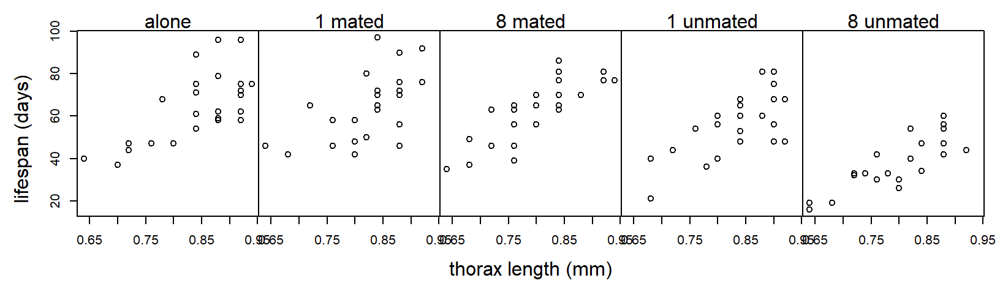
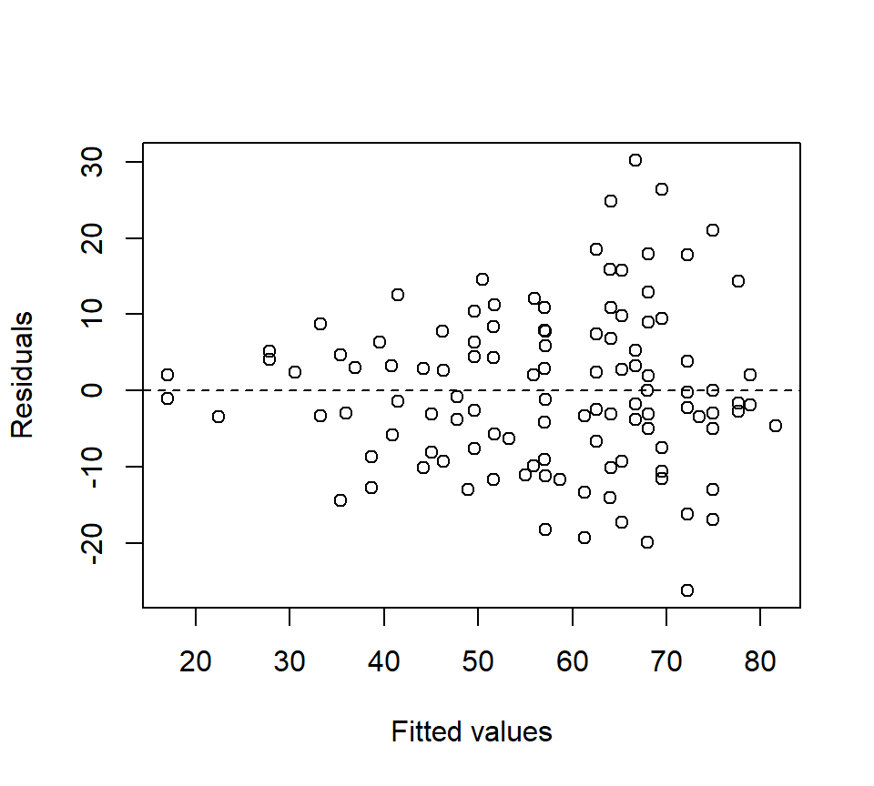
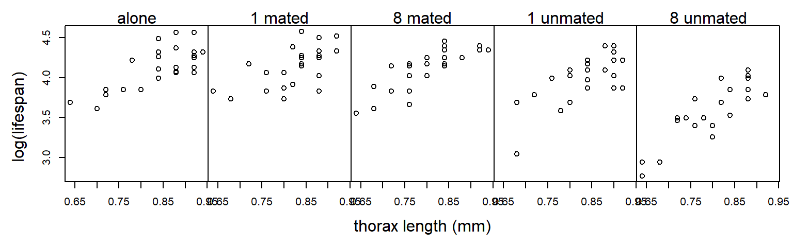
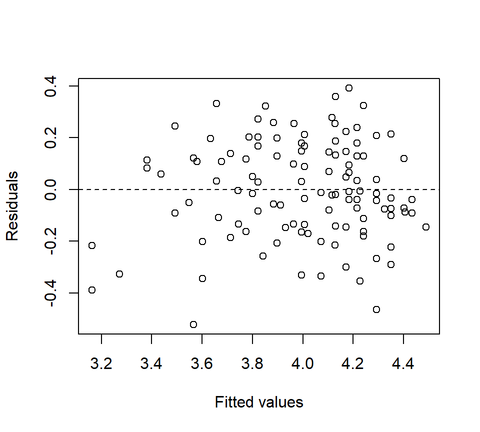
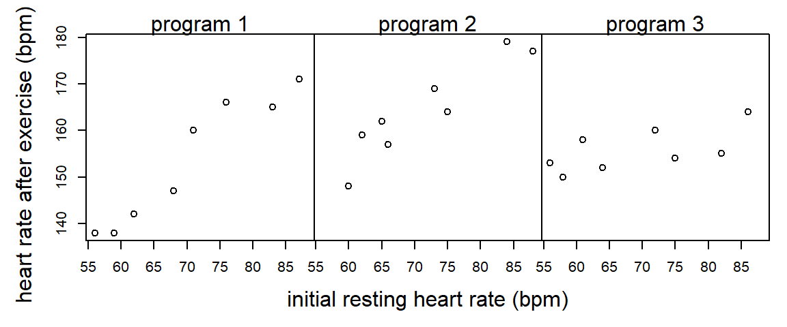

# ANCOVA


Statistical tests compare the estimated magnitude of a treatment effect to the precision with which that effect is estimated.  Often, the magnitude of a treatment effect is set by nature.  Thus, if we want to increase our chances of observing a statistically significant result, we must find ways to make our estimates more precise.  Statistical precision is a function of (a) the degree of replication and (b) the experimental error.  Thus, precision can be improved by including more replicates or reducing experimental error.

One technique for reducing experimental error and hence increasing precision is to use a covariate that accounts for heterogeneity among EUs.  Inclusion of covariates in ANOVA models is called the analysis of covariance, or ANCOVA.  Mathematically, ANCOVA is no different from regression with both quantitative and categorical predictors.  However, the emphases differ depending on the context.  In ANCOVA, our primary focus is analyzing the differences among the treatment groups.  We model the relationship between the response and the covariate to gain a more precise estimate of the differences among treatment groups, but the relationship between the response and the covariate is of secondary interest at best.  In regression, both quantitative and categorical predictors are on equal footing, and we have no reason to prioritize one versus the other. 

For a variable to qualify as a covariate, it is important that it not be affected or influenced by the treatment itself.  If the covariate is affected by the treatment, it is best to treat the covariate as a separate response.  

## Common-slopes model

Example (from @hanley1994sexual):  @partridge1981sexual  conducted an experiment to determine if reproduction reduces longevity in male fruitflies.  (Such a cost had already been established for females.)  There were 5 experimental treatments: male flies reared alone, male flies reared with 1 or 8 non-mated females, and male flies reared with 1 or 8 recently mated females.  25 male flies were assigned to each treatment.  The data recorded are longevity (days lived) and thorax length.  The data are shown below:


Suppose we analyze these data with a one-way ANOVA and ignore differences in the sizes of the flies:

```{}
proc glm;
  class trt;
  model life = trt;
run;

The GLM Procedure
Dependent Variable: life

                                        Sum of
Source                      DF         Squares     Mean Square    F Value    Pr > F
Model                        4     11939.28000      2984.82000      13.61    <.0001
Error                      120     26313.52000       219.27933
Corrected Total            124     38252.80000

Source                      DF     Type III SS     Mean Square    F Value    Pr > F
trt                          4     11939.28000      2984.82000      13.61    <.0001
```

Although the $F$-test for treatment is significant, notice that $MS_{Error} = 219.3$.  However, the plot above suggests that much of the variation in lifespan among flies in the same treatment group can be explained by variation in fly size.  Suppose we include thorax size as a covariate:

```{}
proc glm;
  class trt;
  model life = thorax trt;
run;

The GLM Procedure
Dependent Variable: life

Sum of
Source                      DF         Squares     Mean Square    F Value    Pr > F
Model                        5     25108.13347      5021.62669      45.46    <.0001
Error                      119     13144.66653       110.45938
Corrected Total            124     38252.80000

Source                      DF     Type III SS     Mean Square    F Value    Pr > F
thorax                       1     13168.85347     13168.85347     119.22    <.0001
trt                          4      9611.49254      2402.87314      21.75    <.0001
```

The experimental error has been cut in half: $MS_{Error} = 110.5$.  The experimental error has been reduced because the covariate thorax size has accounted for half of the previously unexplained variation. 


This is an example of an Analysis of Covariance (ANCOVA) model.  We can write the model using the following mathematical notation:

* $y_{ij}$:  observation $j$ from treatment group $i$
* $x_{ij}$:  value of the covariate for observation $j$ from treatment group $i$

Equipped with this notation, we can write the model as
\[
y_{ij} =\mu_i + \beta( x_{ij} - \bar{x}_{++}) +\varepsilon_{ij} 
\] 
where $\mu_i$ is the adjusted treatment mean for treatment group $i$, $\beta$ is a regression slope that quantifies the (linear) relationship between the covariate and the response, $\bar{x}_{++}$ is the average value of the covariate $x$ (across all treatment groups), and $\varepsilon_{ij}$ is the residual error with the standard assumptions (independence, normality, equal variance). By "adjusted treatment mean", we mean that $\mu_i$ represents the average response in treatment group $i$ when the covariate $x$ exactly equals the average value in the data set, $\bar{x}_{++}$. 

Geometrically, we can think of this model as specifying a regression line for each level of the experimental treatment.  In this model, the effect of the covariate ($\beta$) is the same for all of the treatment groups. Consequently, comparisons of adjusted treatment means do not depend on the particular value of the covariate at which the treatment means are being compared, as long as the treatment groups are all being adjusted to the same value of the covariate.  

Before going any further with the fly data, we observe that residual plots clearly indicate that the variance increases as the predicted response increases.  (The inclusion of a covariate makes the residual plots substantially richer.)  



Log-transforming the response stabilizes the variance nicely:

We re-do the analysis with a log-transformed response:

```{}
proc glm;
  class trt;
  model loglife = thorax trt;
run;

The GLM Procedure
Dependent Variable: loglife

                                        Sum of
Source                      DF         Squares     Mean Square    F Value    Pr > F
Model                        5      2.01797568      0.40359514      57.43    <.0001
Error                      119      0.83630432      0.00702777
Corrected Total            124      2.85428000

Source                      DF     Type III SS     Mean Square    F Value    Pr > F
thorax                       1      1.03374368      1.03374368     147.09    <.0001
trt                          4      0.78904783      0.19726196      28.07    <.0001
```

The residual plot looks much better:


The $F$-test of `trt` shown above provides a test for equality of the adjusted treatment means ($H_0$: $\mu_1 = \mu_2 =... = \mu_g$).  In the fruitfly data, there is strong evidence that the adjusted treatment means differ among the groups ($F_{4,119}=28.07$, $p<.0001$).

There are several routes to obtaining the adjusted treatment means themselves.  In PROC GLM, the LSMEANS statement generates adjusted treatment means. The PDIFF option generates $p$-values for tests of pairwise differences, and the ADJUST = TUKEY option applies an adjustment to the $p$-values to control the strong familywise type I error rate.

```{}
proc glm data = fly;
  class trt;
  model loglife = trt thorax;
  lsmeans trt / pdiff adjust = tukey;
run;	

The GLM Procedure
Least Squares Means
Adjustment for Multiple Comparisons: Tukey-Kramer

loglife      LSMEAN
trt          LSMEAN      Number

a        1.77070164           1
m1       1.79321646           2
m8       1.80848343           3
u1       1.71677628           4
u8       1.58882218           5

Least Squares Means for effect trt
Pr > |t| for H0: LSMean(i)=LSMean(j)

Dependent Variable: loglife

i/j           1             2             3             4             5
1                      0.8771        0.5127        0.1606        <.0001
2        0.8771                      0.9679        0.0140        <.0001
3        0.5127        0.9679                      0.0019        <.0001
4        0.1606        0.0140        0.0019                      <.0001
5        <.0001        <.0001        <.0001        <.0001
```

Above, we see that the adjusted treatment mean for the "alone" treatment group is 1.77 (remember this is on the log scale).  The table in the second portion of the output shows that adjusted treatment mean of treatment group "u8" is significantly different from the adjusted treatment means of all other treatment groups, and the adjusted treatment mean of the "u1" group is significantly different from all groups except the "alone" group.

Alternatively, a little algebra shows that the (estimate of the) adjusted treatment mean for treatment group $i$ can be written as 
\[
\hat{\mu }_i =\bar{y}_{i+} -\hat{\beta }(\bar{x}_{i+} -\bar{x}_{++} )
\] 
where $\bar{y}_{i+}$ is the raw (unadjusted) sample mean for treatment group $i$, $\hat{\beta}$ is the estimate of the covariate effect, and $\bar{x}_{i+}$ is the average of the covariate values for treatment group $i$.  

We can find the value of $\hat{\beta }$ using the SOLUTION option to the MODEL statement in PROC GLM.  We can find the raw treatment means and the means of the covariate values using the MEANS statement:

```{}
proc glm data = fly;
  class trt;
  model loglife = trt thorax / solution;
  means trt;
run;

                                       Standard
Parameter            Estimate             Error    t Value    Pr > |t|

Intercept         0.600921260 B      0.08112643       7.41      <.0001
trt       a       0.181879457 B      0.02397873       7.59      <.0001
trt       m1      0.204394280 B      0.02384687       8.57      <.0001
trt       m8      0.219661249 B      0.02371772       9.26      <.0001
trt       u1      0.127954099 B      0.02400289       5.33      <.0001
trt       u8      0.000000000 B       .                .         .
thorax            1.203348424        0.09921873      12.13      <.0001

NOTE: The X'X matrix has been found to be singular, and a generalized inverse was used to
solve the normal equations.  Terms whose estimates are followed by the letter 'B'
are not uniquely estimable.

The GLM Procedure

Level of            -----------loglife-----------     ------------thorax-----------
trt           N             Mean          Std Dev             Mean          Std Dev

a            25       1.78880000       0.11515642       0.83600000       0.08426150
m1           25       1.79880000       0.10763828       0.82560000       0.06988562
m8           25       1.79000000       0.11221260       0.80560000       0.08155162
u1           25       1.73680000       0.13145722       0.83760000       0.07055022
u8           25       1.56360000       0.15231218       0.80000000       0.07831560
```

For example, consider the treatment group with flies reared alone.  In these data, it turns out that the average covariate value is $\bar{x}_{++} = 0.821$. Our calculation (using the log-transformed data) gives
\begin{eqnarray*}
	\hat{\mu }_i & = & \bar{y}_{i+} -\hat{\beta }(\bar{x}_{i+} -\bar{x}_{++} ) \\
	& = &  1.789-(1.203) \times (0.836-0.821) \\ 
	& = &  1.771 
\end{eqnarray*}
Flies assigned to the "alone" treatment were slightly larger than the other flies in the experiment.  Because larger flies tend to live longer, the adjusted treatment mean for the "alone" treatment is slightly smaller than the raw mean.  

## Separate-slopes model

If the relationship between the covariate and the response differs across the treatment groups, then we need a model that allows the regression lines to be non-parallel.  Non-parallel lines can be accommodated in an ANCOVA model by including an interaction between the covariate and the treatment factor:
```{}
proc glm;
  class trt;
  model loglife = thorax | trt;
run; 

The GLM Procedure
Dependent Variable: loglife

                                        Sum of
Source                      DF         Squares     Mean Square    F Value    Pr > F
Model                        9      2.05753663      0.22861518      33.00    <.0001
Error                      115      0.79674337      0.00692820
Corrected Total            124      2.85428000

Source                      DF     Type III SS     Mean Square    F Value    Pr > F
thorax                       1      1.00724047      1.00724047     145.38    <.0001
trt                          4      0.07751033      0.01937758       2.80    0.0293
thorax*trt                   4      0.03956095      0.00989024       1.43    0.2293
```

In notation, the non-parallel slopes model can be written:
\[
y_{ij} =\mu_i + \beta_i( x_{ij} - \bar{x}_{++}) +\varepsilon_{ij} 
\] 

The $F$-test associated with the interaction is a test of $H_0$: $\beta_1 = \beta_2 = \ldots = \beta_g$, that is, a test of null hypothesis that the covariate has the same effect on the response in every group. Here, the large $p$-value indicates that there is no evidence that the effect of size on fruitfly longevity differs among the 5 treatment groups.  The common-slopes model is adequate for these data.

Here is an example where the association between the covariate and the response differs among the treatment groups:

Example (from @milliken2001analysis): An exercise physiologist is interested in studying the effectiveness of 3 types of exercise programs.  24 males between the ages of 28 and 35 are enrolled in the study.  Each individual has his heart rate measured at rest.  The 24 subjects are then randomly assigned to the 3 programs (a CRD).  At the end of the 8 weeks on the exercise program, each subject has his heart rate measured again after a 6-minute run.



```{}
proc glm;
  class program;
  model hrate = initrate | program;
run;

                                        Sum of
Source                      DF         Squares     Mean Square    F Value    Pr > F
Model                        5     2432.463977      486.492795      29.50    <.0001
Error                       18      296.869356       16.492742
Corrected Total             23     2729.333333

Source                      DF     Type III SS     Mean Square    F Value    Pr > F
initrate                     1     1539.535965     1539.535965      93.35    <.0001
program                      2      388.117289      194.058645      11.77    0.0005
initrate*program             2      381.126973      190.563487      11.55    0.0006
```
When there is a significant interaction between the covariate and the treatment, then a comparison of treatments depend on the value of the covariate being considered.  We might still want to compare the adjusted treatment means at the average value of the covariate in the data set, or we might select a different value of the covariate.  In the LSMEANS statement, we can specify the particular value of the covariate to calculate adjusted treatment means using the AT option, as illustrated below:  
```{}
proc glm;
  class program;
  model hrate = initrate|program;
  lsmeans program / at initrate=60 stderr pdiff adjust=tukey;
  lsmeans program / at initrate=80 stderr pdiff adjust=tukey;
run;

Least Squares Means at initrate=60
Adjustment for Multiple Comparisons: Tukey-Kramer

                               Standard                  LSMEAN
program    hrate LSMEAN           Error    Pr > |t|      Number

p1           141.472996        2.007926      <.0001           1
p2           153.470778        2.254376      <.0001           2
p3           153.310267        1.913754      <.0001           3

Least Squares Means for effect program
Pr > |t| for H0: LSMean(i)=LSMean(j)

i/j           1             2             3
1                      0.0024        0.0013
2        0.0024                      0.9984
3        0.0013        0.9984

Least Squares Means at initrate=80
Adjustment for Multiple Comparisons: Tukey-Kramer

                               Standard                  LSMEAN
program    hrate LSMEAN           Error    Pr > |t|      Number
p1           164.696418        1.960674      <.0001           1
p2           172.230730        1.905086      <.0001           2
p3           158.585366        2.055177      <.0001           3

Least Squares Means for effect program
Pr > |t| for H0: LSMean(i)=LSMean(j)

i/j           1             2             3
1                      0.0332        0.1074
2        0.0332                      0.0003
3        0.1074        0.0003
```
Interpretation: For subjects with an initial resting heart rate of 60 bpm, there is no significant difference between exercise programs 2 and 3.  For subjects with an initial resting heart rate of 80 bpm, there is no significant difference between exercise programs 1 and 3.  

<!-- If we wish, we can have a look at the parameter estimates of the separate-slopes model using the SOLUTION option to the MODEL statement: -->
<!-- ```{} -->
<!-- proc glm; -->
<!--   class program; -->
<!--   model hrate = initrate|program / solution; -->
<!-- run; -->

<!--                                               Standard -->
<!-- Parameter                   Estimate             Error    t Value    Pr > |t| -->

<!-- Intercept                137.4849688 B      9.58049571      14.35      <.0001 -->
<!-- initrate                   0.2637550 B      0.13678399       1.93      0.0697 -->
<!-- program          p1      -65.6822400 B     13.65253792      -4.81      0.0001 -->
<!-- program          p2      -40.2940489 B     14.44003897      -2.79      0.0121 -->
<!-- program          p3        0.0000000 B       .                .         . -->
<!-- initrate*program p1        0.8974162 B      0.19355172       4.64      0.0002 -->
<!-- initrate*program p2        0.6742427 B      0.20263646       3.33      0.0037 -->
<!-- initrate*program p3        0.0000000 B       .                .         . -->

<!-- NOTE: The X'X matrix has been found to be singular, and a generalized inverse was used to -->
<!-- solve the normal equations.  Terms whose estimates are followed by the letter 'B' -->
<!-- are not uniquely estimable. -->
<!-- ``` -->

## Further reading

In these notes, we have seen simple examples of a single covariate with a one-factor layout.  Of course, things can get much more complicated. Experiments can include multiple covariates, or several treatment factors, or covariates with non-linear associations with the response.  See @milliken2001analysis for a lengthier treatment.
