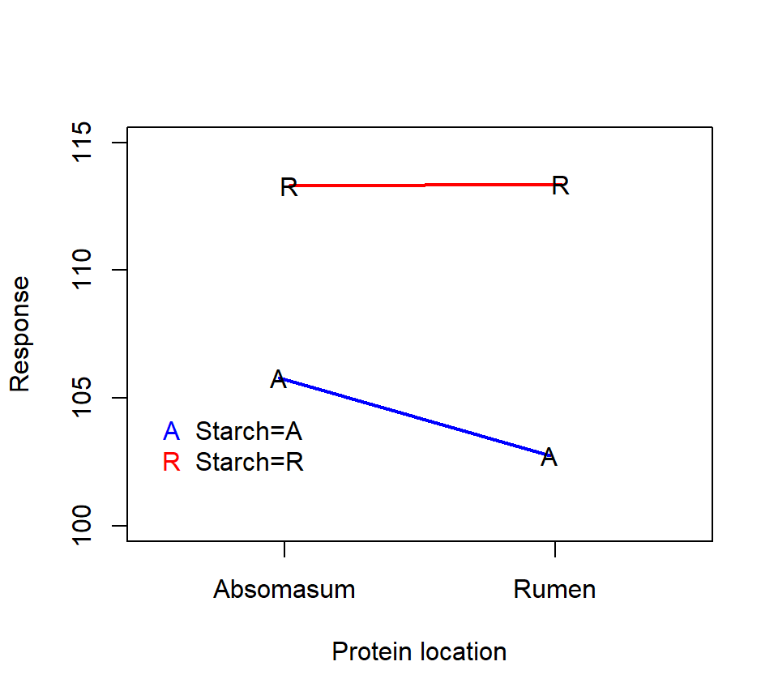

# Blocked designs


## Randomized complete block designs
The strength of people's grip in their dominant or off-dominant hand was measured for $n=145$ people.  Data are below, with strength measured in Newtons of force.

Suppose we wanted to use these data to ask if there was a difference in strength between people's dominant and off-dominant hands.  One (wrong) way to analyze these data is with a two-sample $t$-test:

```{}
> with(grip, t.test(x = Dominant, y = Off, var.equal = TRUE))

Two Sample t-test

data:  Dominant and Off
t = 1.7844, df = 288, p-value = 0.07542
alternative hypothesis: true difference in means is not equal to 0

95 percent confidence interval:
-1.812768 36.998975

sample estimates:
mean of x mean of y 
298.6552  281.0621 
```

The two-sample t-test is the wrong test for these data because it fails to account for the fact that the data are paired.  The correct way to analyze these data is to calculate the difference in grip strength for each individual, and then to treat the sample of $n=145$ differences as a single random sample from a population of differences.  We then test the null hypothesis that the average of this population of differences is equals 0 against the alternative that the average difference is different from 0.

```{}
> with(grip, t.test(x = Dominant - Off))

One Sample t-test

data:  Dominant - Off
t = 6.4883, df = 144, p-value = 1.306e-09
alternative hypothesis: true mean is not equal to 0

95 percent confidence interval:
12.23358 22.95263

sample estimates:
mean of x 
17.5931
```

The paired analysis estimates the average difference in grip strength more precisely, resulting in a narrower CI and a smaller $p$-value.  The paired analysis is more precise because the experimental error has been reduced by removing person-to-person variability.

Taking differences only works when we are comparing two treatments.  When we are comparing more than two treatments, we need a more general strategy.  *Blocking* is a technique that reduces experimental error (and hence increases precision) by grouping heterogeneous experimental units into blocks of homogeneous EUs.  Remember that statistical tests boil down to comparing the magnitude of the treatment effect to the precision with which that effect is estimated.  We can’t do anything about the magnitude of the treatment effect --- that’s set by nature.  Blocking is a technique that increases statistical power by reducing experimental error and thus increasing precision.

The canonical example of blocking comes from agriculture.  Suppose we want to compare the effects of 3 different fertilizers (call them A, B, and C) on crop yield.  Suppose a field can be divided into 12 plots (EUs), and there is a known east-west elevation slope to the field.  In a CRD, treatments are randomly assigned to EUs.  CRDs are appropriate when EUs are homogeneous.  Here, we know that there is a difference between EUs based on where they lie along the east-west gradient.  Consequently, a better design is to block against slope by grouping EUs into blocks of plots at similar locations along the east-west gradient.  Treatments are then randomly assigned within blocks.  

<!-- One such randomization might be: -->
<!-- \begin{center} -->
<!-- 	\begin{tabular}{|c|c|c|c|} -->
<!-- 		\hline C & C & B & A \\ \hline -->
<!-- 		A & B & A & C \\ \hline -->
<!-- 		B & A & C & B \\ \hline  -->
<!-- 		\end{tabular} -->
<!-- \end{center} -->

This is a randomized complete block design (RCBD).   A RCBD consists of $q$ blocks, each of which is divided into $p$ homogeneous EUs.  Treatments are randomly assigned to EUs within each block.  This is a "complete" block design because each level of the experimental treatment is represented at least once in every block.  In contrast, an "incomplete" block design is one in which not all experimental treatments are represented in every block.  A standard RCBD is one in which every treatment (or every treatment combination) is assigned to exactly one EU in each block.

The classical way to analyze data from an RCBD is to include the block as an additional factor in the ANOVA, albeit a factor that is not engaged in interactions with the treatment factors.  Example: For the grip strength data, we would treat "subject" (the person) as a blocking factor.


```r
grip <- read.table("data/gripall-long.txt", head = T, stringsAsFactors = T)
fm1 <- lm(strength ~ subject + hand, data = grip)
anova(fm1)
```

```
## Analysis of Variance Table
## 
## Response: strength
##            Df  Sum Sq Mean Sq F value    Pr(>F)    
## subject   144 1952993   13562  25.443 < 2.2e-16 ***
## hand        1   22440   22440  42.098 1.306e-09 ***
## Residuals 144   76758     533                      
## ---
## Signif. codes:  0 '***' 0.001 '**' 0.01 '*' 0.05 '.' 0.1 ' ' 1
```

Observe that the $p$-value for testing an effect of "hand" is exactly the same as the $p$-value from the paired $t$-test.  This is not a coincidence.  These are alternative ways of writing the same model.  

Remarks:

*  We have fit an additive model that does not include a person-by-hand interaction.  In a RCBD, it is common to assume that there is no block-by-treatment interaction.

* Typically we are not interested in the $F$-test associated with the block effect.  Even if the block effect is not significant, we do not remove it from the model.  Doing so would be tantamount to treating the design as a CRD, which does not account for the restricted randomization.

Here is an example of a standard RCBD with one experimental factor, described in the SAS documentation for PROC GLM: @stenstrom40 investigated how $p = 7$ soil types affect the growth of snapdragons.  To control for local fertility variations, the soils were grouped into $q = 3$ blocks.  Average stem length of the snapdragons in each EU was recorded.  The data are:

```{}
    	        Block
Type        A    B    C
Clarion  32.7 32.3 31.5 
Clinton  32.1 29.7 29.1 
Knox     35.7 35.9 33.1 
O'Neill  36.0 34.2 31.2 
Compost  31.8 28.0 29.2 
Wabash   38.2 37.8 31.9 
Webster  32.5 31.1 29.7 
``` 


Here is an analysis with PROC GLM:

```{}
proc glm;
  class Block Type;
  model StemLength = Block Type;
  means Type / tukey;
run;

Dependent Variable: stemlength

                                        Sum of
Source                      DF         Squares     Mean Square    F Value    Pr > F
Model                        8     142.1885714      17.7735714      10.80    0.0002
Error                       12      19.7428571       1.6452381
Corrected Total             20     161.9314286

Source                      DF     Type III SS     Mean Square    F Value    Pr > F
blk                          2      39.0371429      19.5185714      11.86    0.0014
type                         6     103.1514286      17.1919048      10.45    0.0004

Tukey's Studentized Range (HSD) Test for StemLength

Alpha                                   0.05
Error Degrees of Freedom                  12
Error Mean Square                   1.645238
Critical Value of Studentized Range  4.94945
Minimum Significant Difference        3.6653

Means with the same letter are not significantly different.


   Tukey
 Grouping            Mean      N    Type

     A             35.967      3    Wabash
B    A             34.900      3    Knox
B    A    C        33.800      3    O'Neill
B    D    C        32.167      3    Clarion
     D    C        31.100      3    Webster
     D    C        30.300      3    Clinton
     D             29.667      3    Compost
```

Here is an example of a standard RCBD with a 2 $\times$ 2 factorial treatment structure, described in the on-line SAS documentation.  The description of the data there reads: "The data, from Neter, Wasserman, and Kutner (1990, p. 941), are from an experiment examining the effects of codeine and acupuncture on post-operative dental pain in male subjects. Both treatment factors have two levels. The codeine levels are a codeine capsule or a sugar capsule. The acupuncture levels are two inactive acupuncture points or two active acupuncture points. There are four distinct treatment combinations due to the factorial treatment structure. The 32 subjects are assigned to eight blocks of four subjects each based on an assessment of pain tolerance."

As with any factorial experiment, it is helpful to inspect an interaction plot of the treatment means first:

Here is how we might analyze these data with SAS PROC GLM:

```{}
proc glm data=dental;
  class block codeine acupuncture;
  model relief = block codeine|acupuncture;
  means codeine acupuncture / tukey;
run;

                                        Sum of
Source                      DF         Squares     Mean Square    F Value    Pr > F
Model                       10     11.33500000      1.13350000      78.37    <.0001
Error                       21      0.30375000      0.01446429
Corrected Total             31     11.63875000

Source                      DF     Type III SS     Mean Square    F Value    Pr > F
block                        7      5.59875000      0.79982143      55.30    <.0001
codeine                      1      2.31125000      2.31125000     159.79    <.0001
acupuncture                  1      3.38000000      3.38000000     233.68    <.0001
codeine*acupuncture          1      0.04500000      0.04500000       3.11    0.0923

Tukey's Studentized Range (HSD) Test for relief
Minimum Significant Difference        0.0884

Means with the same letter are not significantly different.

Tukey grouping
           Mean      N    codeine
A       1.42500     16    trt
B       0.88750     16    placebo

Tukey grouping
           Mean      N    acupuncture
A       1.48125     16    yes
B       0.83125     16    no
```

### *Should a blocking factor be a fixed or random effect?

Often, it makes sense to treat block effects as random effects.  Block effects should be treated as fixed if one is interested in drawing inferences that pertain to the particular blocks included in the experiment.  Block effects should be treated as random the blocks included in the experiment can be regarded as representative draws from a population of blocks, and one is interested in drawing inferences that extend to this population of blocks.

Let's reconsider the snapdragon example that we used to illustrate a RCBD.  Here is PROC MIXED code for these data, but now with the block treated as a random effect.

```{}
proc mixed;
  class blk type;
  model stemlength = type;
  random blk;
  lsmeans type;
run;

Covariance Parameter Estimates

Cov Parm     Estimate
blk            2.5533
Residual       1.6452

Type 3 Tests of Fixed Effects

              Num     Den
Effect         DF      DF    F Value    Pr > F
type            6      12      10.45    0.0004

Least Squares Means

                                 Standard
Effect    type       Estimate       Error      DF    t Value    Pr > |t|
type      Clarion     32.1667      1.1830      12      27.19      <.0001
type      Clinton     30.3000      1.1830      12      25.61      <.0001
type      Compost     29.6667      1.1830      12      25.08      <.0001
type      Knox        34.9000      1.1830      12      29.50      <.0001
type      O'Neill     33.8000      1.1830      12      28.57      <.0001
type      Wabash      35.9667      1.1830      12      30.40      <.0001
type      Webster     31.1000      1.1830      12      26.29      <.0001
```


Remarks:

* The Type III $F$-tests for the differences among the soil types are the same in both analyses.  This is true because the data are balanced.  If the data are not balanced, treating the block as a random vs. fixed effect can have a small effect on the Type III $F$-tests.

* The standard error of the LSMEAN for each type is larger when we treat the block as a random effect.  This makes sense, because if we want to expand our scope of inference to the population of blocks from which these blocks were selected (instead of restricting focus to these particular blocks), we incur a cost of greater uncertainty.

* The model with block as a random effect is a mixed model, because it includes both a fixed effect (type) and a random effect (block).  An equation for this model is
	\[
	y_{ij} = \mu + \alpha_i + B_j + \varepsilon_{ij} 
	\]
	where $\mu$ is the reference level or intercept, $\alpha_i$ are the (fixed) effects parameters for the snapdragon type, $B_j \sim \mathcal{N}\left(0, \sigma^2_B \right)$ are the random block effects, and $\varepsilon_{ij} \sim \mathcal{N}\left(0, \sigma^2_\varepsilon \right)$ are the residual errors (also a random effect).

## Latin-squares designs

Consider the fertilizer again, and suppose that in addition to an east-west slope, there is also a north-south gradient in soil pH.  A Latin squares design is a double blocking design that blocks against both east-west and north-south directions.
<!-- \begin{center} -->
<!-- 	\begin{tabular}{|c|c|c|} -->
<!-- 		\hline C & B & A \\ \hline -->
<!-- 		B & A & C \\ \hline -->
<!-- 	    A & C & B \\ \hline  -->
<!-- 	\end{tabular} -->
<!-- \end{center} -->
<!-- Note that each fertilizer treatment appears once in each row block and once in each column block.  (Much like a sudoku puzzle.)   -->

To analyze these data, we need to include a separate factor in the ANOVA for each of the two blocking factors.  Here is an example based on a real study.

@taniguchi1995net studied the effects of infusion of casein (a protein) and cornstarch on net nutrient metabolism in beef steers.  The investigators are interested in the effect of the location of the infusion (in the rumen vs. in the abomasum, both compartments of the ruminant stomach) for both the starch and the protein.  The 4 unique treatment combinations are: starch and protein both delivered to the abomasum (henceforth treatment "A"), starch delivered to the abomasum and protein delivered to the rumen (treatment "B"), starch delivered to the rumen and protein delivered to the abomasum (treatment "C"), and starch and protein both delivered to the rumen (treatment "D").  

Four beef steer were available for the study.  Each steer was given each treatment over the course of 4 two-week periods.  During each period, the steers were given the infusions during days 1--11, and removed from the infusions during days 12--14.  Nutrient metabolism was measured on days 8--11 of each period.  

Thus, the data consist of a 2 $\times$ 2 factorial treatment structure with two blocking factors: steer and period.  Treatments are assigned to each steer and period using a Latin squares design.  

<!-- Although we do not know the actual Latin squares design used, one possibility is: -->
<!-- \begin{center} -->
<!-- 	\begin{tabular}{|c|c|c|c|c|} -->
<!-- 		\hline & \multicolumn{4}{|c|}{Period} \\ \hline -->
<!-- 		Steer & 1 & 2 & 3 & 4 \\ \hline -->
<!-- 		W & A & B & C & D \\ \hline -->
<!-- 		X & C & D & A & B \\ \hline -->
<!-- 		Y & B & A & D & C \\ \hline -->
<!-- 		Z & D & C & B & A \\ \hline  -->
<!-- 	\end{tabular} -->
<!-- \end{center} -->
<!-- One of the response variables measured was apparently retained nitrogen, measured as a difference between nitrogen intake and nitrogen excretion.  The original data are unavailable, but one possible data set based on the observed results is  -->
<!-- \begin{center} -->
<!-- 	\begin{tabular}{|c|c|c|c|c|c|} -->
<!-- 		\hline & \multicolumn{4}{|c|}{Period} & \\ \hline -->
<!-- 		Steer & 1 & 2 & 3 & 4 & Mean\\ \hline -->
<!-- 		W & 94.5 & 93.2 & 101.2 & 102.4 & 97.8 \\ \hline -->
<!-- 		X & 117.7 & 120.6 & 108.8 & 109.8 & 114.2 \\ \hline -->
<!-- 		Y & 110.0 & 115.0 & 121.2 & 122.4 & 117.1 \\ \hline -->
<!-- 		Z & 109.4 & 111.9 & 98.0  & 104.9 & 106.1 \\ \hline  -->
<!-- 		Mean & 107.9 & 110.2 & 107.3 & 110.0 & 108.8 \\ \hline -->
<!-- 	\end{tabular} -->
<!-- \end{center} -->


Here is an interaction plot of the treatment means:

Here is an analysis with PROC GLM:

```{}
proc glm data=steer;
  class steer period starch protein;
  model nitrogen = starch|protein steer period;
run;

Dependent Variable: nitrogen

                                        Sum of
Source                      DF         Squares     Mean Square    F Value    Pr > F
Model                        9     1278.855625      142.095069     166.72    <.0001
Error                        6        5.113750        0.852292
Corrected Total             15     1283.969375

Source                      DF     Type III SS     Mean Square    F Value    Pr > F
starch                       1     328.5156250     328.5156250     385.45    <.0001
protein                      1       8.8506250       8.8506250      10.38    0.0181
starch*protein               1       9.7656250       9.7656250      11.46    0.0148
steer                        3     906.9968750     302.3322917     354.73    <.0001
period                       3      24.7268750       8.2422917       9.67    0.0103
```

The significant starch*protein interaction suggests that we should inspect the simple effects of the starch and protein treatments.  The interaction plot above suggests that the effect of the protein location is small when starch is delivered to the rumen, but that the protein delivery site has a larger effect when starch is delivered to the abomasum.

As a remark, note that the model above has only 6 df available to estimate the experimental error.  While blocked designs are powerful, block effects do tend to gobble up lots of df, leaving few df available to estimate the experimental error.  This phenomenon is particularly pronounced in Latin squares designs.

## Split-plot designs

A split-plot experiment combines the ideas of blocking and subsampling in a clever way.  The essential feature of a split-plot experiment is that there are at least two experimental factors, and the factors are randomized to different EUs.  For example, consider a hypothetical 
experiment to evaluate the effect of 3 bacterial inoculation treatments applied to 2 grass cultivars (A vs.\ B).  The response variable is dry-weight yield.  Eight fields are available for the experiment. Suppose that the different inoculation treatments can be applied to different regions of the same field, but it is impossible to plant different cultivars in the same field.  Consequently,  cultivars are randomly assigned to fields as a balanced CRD.   Fields are then split into 3 thirds, and inoculation treatments are randomly assigned to each third.   Dry weight yield is then measured from each third for a total of 24 data points.  Here is an interaction plot of the means for each of the 6 treatment combinations:

In this experiment, the EU is different for the two experimental factors.  For the cultivar treatment, the field is the EU, and the thirds are subsamples.  For the bacterial inoculation treatment, however, the thirds are the EUs and the fields are blocks.  Split-plot experiments are advantageous when it is more convenient to apply one factor or factors to large EUs and other factor(s) to smaller EUs.  Split-plot experiments come with their own conventional terminology.  In the example above, the cultivar is the *whole-plot* factor, and the fields are the whole-plot EU.  The inoculation treatment is the *split-plot* factor, and the thirds are the split-plot EUs (subsamples of the whole-plot EUs).  

Because the design contains two different EUs, the analysis must contain two error terms.  The critical piece of the analysis is to make sure that the statistical inferences about the whole-plot factor are drawn using the whole-plot error, and conversely inferences about the split-plot factor are drawn using the split-plot error.

Here is an ANOVA model for this experiment:
\[
y_{ijk} = \mu + \alpha_i + \beta_j + (\alpha \beta)_{ij} + W_{ik} + \varepsilon_{ijk}
\]
where 

* $i = 1, 2$ is an index for the grass cultivars
* $j = 1, 2, 3$ is an index for the inoculation treatment
* $k = 1, 2, \ldots, 4$ is an index for the replicate fields assigned to each cultivar
* $\mu$ is a reference level
* $\alpha_i$'s are the (fixed) effect parameters for cultvar $i$, subject to the usual constraints
* $\beta_j$'s are the (fixed) effect parameters for bacterial inoculation $j$, subject to the usual constraints
* $(\alpha \beta)_{ij}$'s are the (fixed) effect parameters for the cultivar-by-inoculation interaction, subject to the usual constraints
* $W_{ik}$ is a random effect for the whole-plot error, $W_{ik} \sim \mathcal{N}\left(0, \sigma^2_W \right)$
* $\varepsilon_{ijk}$ is residual (split-plot) error, $\varepsilon_{ijk} \sim \mathcal{N}\left(0, \sigma^2_{\varepsilon} \right)$


As before, we can conduct an ANOVA sum-of-squares decomposition that will lead to $F$-tests of the factorial effects.  We'll prepare for this ANOVA by first partitioning the df among the various sums of squares.   How do we partition the df?

* The random effect for the field will serve as the whole-plot error term.  Because each field is associated with one and only one cultivar, then field is nested within cultivar.
* The random effect for the third will serve as the split-plot error term.  Because each third is associated with one and only one cultivar, with one and only one field, with one and only one inoculation treatment, and with one and only one cultivar-inoculation treatment combination, then the third is nested in all these other model terms. 

The df for each term in the ANOVA will be:
<table>
 <thead>
  <tr>
   <th style="text-align:left;"> source </th>
   <th style="text-align:left;"> df </th>
  </tr>
 </thead>
<tbody>
  <tr>
   <td style="text-align:left;"> Cultivar </td>
   <td style="text-align:left;"> 1 </td>
  </tr>
  <tr>
   <td style="text-align:left;"> Whole-plot error </td>
   <td style="text-align:left;"> 6 (=8 - 1 - 1) </td>
  </tr>
  <tr>
   <td style="text-align:left;"> Inocuolation </td>
   <td style="text-align:left;"> 2 </td>
  </tr>
  <tr>
   <td style="text-align:left;"> Cultivar*Inoculation </td>
   <td style="text-align:left;"> 2 </td>
  </tr>
  <tr>
   <td style="text-align:left;"> Residual error </td>
   <td style="text-align:left;"> 12  (= 24 - 1 - 1 - 6 - 2 - 2) </td>
  </tr>
  <tr>
   <td style="text-align:left;"> Total </td>
   <td style="text-align:left;"> 23 </td>
  </tr>
</tbody>
</table>

Because this model has multiple random effects, we'll use PROC MIXED for our calculations.  As before, we can use the METHOD = TYPE3 option to see the ANOVA table, but we'll use METHOD = REML (the default) to obtain our estimates and F-tests of the fixed effects.  (With a balanced data set, both the TYPE3 and REML methods of estimation will yield identical results.)

Here is the TYPE3 analysis first:

```{}
proc mixed method = type3;
  class field cult inoc;
  model drywt = cult|inoc;
  random field(cult);
run;

                               Type 3 Analysis of Variance
                               
                           Sum of
Source           DF       Squares   Mean Square  Expected Mean Square
cult              1      2.406667      2.406667  Var(Residual) + 3 Var(field(cult))
                                                 + Q(cult,cult*inoc)
inoc              2    118.175833     59.087917  Var(Residual) + Q(inoc,cult*inoc)
cult*inoc         2      1.825833      0.912917  Var(Residual) + Q(cult*inoc)
field(cult)       6     34.800000      5.800000  Var(Residual) + 3 Var(field(cult))
Residual         12      8.465000      0.705417  Var(Residual)
```

Note that we've coded the random-effect for the fields as FIELD(CULT), because field is nested within the cultivar treatment.  Now, here is the REML analysis (the default):

```{}
proc mixed;
  class field cult inoc;
  model drywt = cult|inoc;
  random field(cult);
run;

Covariance Parameter Estimates

Cov Parm        Estimate
field(cult)       1.6982
Residual          0.7054

Type 3 Tests of Fixed Effects

              Num     Den
Effect         DF      DF    F Value    Pr > F
cult            1       6       0.41    0.5433
inoc            2      12      83.76    <.0001
cult*inoc       2      12       1.29    0.3098
```

We see that there is evidence of a difference among the inoculation treatments, but no evidence of an interaction between the inoculation treatments and the cultivar, and no evidence of a difference among the cultivars.

To explore the differences among the inoculation treatments, we'll use an LSMEANS statement using Tukey's HSD procedure:

```{}
proc mixed;
  class field cult inoc;
  model drywt = cult|inoc / ddfm=satterth;
  random field(cult);
  lsmeans inoc / pdiff adjust=tukey;
run;

                         Least Squares Means
                         
                              Standard
Effect    inoc    Estimate       Error      DF    t Value    Pr > |t|
inoc      con      27.9625      0.5481    9.01      51.01      <.0001
inoc      dea      29.9500      0.5481    9.01      54.64      <.0001
inoc      liv      33.3375      0.5481    9.01      60.82      <.0001
                         
                         
                         Differences of Least Squares Means
                         
                               Standard
Effect  inoc  _inoc  Estimate     Error    DF  t Value  Pr > |t|  Adjustment     Adj P
inoc    con   dea     -1.9875    0.4199    12    -4.73    0.0005  Tukey-Kramer  0.0013
inoc    con   liv     -5.3750    0.4199    12   -12.80    <.0001  Tukey-Kramer  <.0001
inoc    dea   liv     -3.3875    0.4199    12    -8.07    <.0001  Tukey-Kramer  <.0001
```

Remarks:

* The DDFM = SATTERTH option tells SAS to calculate df using a Satterthwaite approximation.  See below.
* The LSMEANS statement calculates the average response for each inoculation treatment (the split-plot factor) averaging over the levels of the whole-plot factor, cultivar.  The PDIFF option provides pairwise comparisons, and the ADJUST=TUKEY option adjusts these p-values for multiple comparisons.
\end{enumerate}
Analysis and interpretation:  There is no evidence of an interaction between cultivar and inoculation treatment ($F_{2,12} = 1.29$, $p= 0.31$).  There is no evidence of a main effect of cultivar ($F_{1,6} = 0.41$, $p= 0.54$).  There is strong evidence of a main effect of inoculation treatment ($F_{2,12} = 83.76$, $p<.0001$).  Pairwise comparisons of LSMEANS suggest that all inoculation treatments are significantly different from one another.  Variance component estimates suggest that the experimental error associated with the whole-plot is roughly twice as great as the experimental error associated with the split-plot (1.70 vs. 0.70).

### Satterthwaite approximation

Standard errors of the LSMEANS for the split-plot factor (here, inoculation treatment) are functions of both the whole-plot error and the split-plot error.  Consequently, the df associated with these standard errors are intermediate between the df available for the whole-plot error (here, 6) and the df available for the split-plot error (12).  The Satterthwaite approximation is a computationally intensive method for approximating the appropriate df.  (It’s computationally intensive because it entails inverting a big matrix.)  With big models or small computers, calculating the Satterthwaite approximation may not be feasible.  See section 11.4 of Oehlert for a more detailed discussion of the Satterthwaite approximation.

You may have already encountered the Satterthwaite approximation in the context of Welch's two-sample $t$-test.  (Recall that Welch's two-sample $t$-test can be used to compare the means of two samples when the variances of those two samples are not equal.  In that context, the standard error of the difference between the means blends two different variance estimates, and thus the Satterthwaite approximation is needed to calculate the associated df.  The key feature to both of these calculations is the presence of multiple variance estimates in the calculation of a standard error.)
