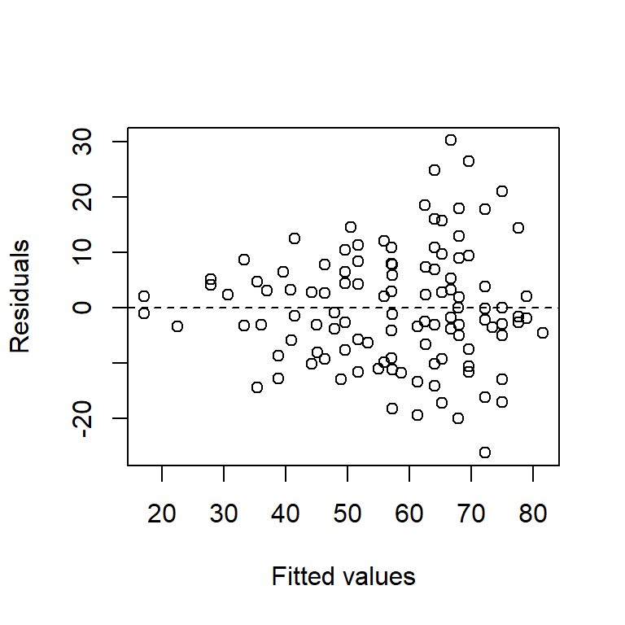

--- 
title: "ST 512 course notes"
author: "Kevin Gross"
date: "2022-01-12"
output: bookdown::gitbook
documentclass: book
bibliography: [st512.bib]
biblio-style: apalike
link-citations: yes
description: "Course notes for ST 512, Statistical Methods for Researchers, taught at NCSU in Spring 2022."
---


```r
knitr::opts_chunk$set(fig.width = 4, fig.height = 4, fig.align = "center") 
```

# Simple linear regression

## Introduction to simple linear regression

Linear regression is a versatile statistical tool that can be used to characterize relationships between quantitative variables.  We will study linear regression in depth, and begin with a simple example.

*Example*: Blood alcohol content (BAC) vs. number of beers consumed.  Data were obtained for $n=16$ individuals.  Here is a scatter plot of the data:

```r
beer <- read.table("data/beer.txt", head = T)
with(beer, plot(BAC ~ Beers, xlab = "beers consumed"))
```

<div class="figure" style="text-align: center">

<p class="caption">(\#fig:unnamed-chunk-2)BAC vs. beers consumed.</p>
</div>

We seek to quantify the relationship between beers and BAC in these data by fitting a statistical model.  A statistical model is a mathematical description of the relationship between the sample data and the population from which it was drawn.  Because samples are collected randomly, statistical models are written using the mathematics of probability.  Statistical models can be thought of as consisting of two parts: a signal or mean component that quantifies the patterns in the data that are repeatable from one sample to the next, and the error or noise component that captures the variation in the data unique to a given sample.  In words, then, we might represent a statistical model using the equation "data = signal + error".  The plus sign in this word equation should not be taken too literally, because the signal and error are not always combined in an additive way.  Statistical models can be written in words or in mathematical notation.  Word models are helpful for building understanding, but they are somewhat ambiguous and are not as mathematically precise as we need.  Consequently, we'll use word models to build intuition, and mathematical notation for precision.

A *simple linear regression*  (SLR) is a simple statistical model for these data.  In words, we can write an SLR model for these data as
$$
\mbox{BAC = intercept + slope} \times \mbox{beers + error}
$$
In notation, the model is
\begin{equation}
y_i =\beta_0 +\beta_1 x_i +\varepsilon_i (\#eq:slr)
\end{equation}

The components of this model are:

* $y$: the "response" or "dependent" variable.  Here, the response is BAC.  By convention, the response variable is usually written on the left of the equals sign.  The *i* subscript is used to distinguish among individual data points.  For example, $y_1$ is the value of the response associated with the first observation in the data set.  Usually, we use the notation $n$ for the total number of data points, and so to be precise we might also write $i = 1, \ldots, n$.  In words, we say that "$i$ varies from 1 to $n$" or "$i$ ranges from 1 to $n$".  We'll suppress the $i$ subscript when we don't need it.

* $x$: the "predictor" or "independent" variable.  Here, the predictor is the number of beers consumed.

* $\beta_0$: intercept.  In SLR, the intercept is a parameter that gives the value of the regression line when the predictor $x = 0$.  Sometimes this is a meaningful quantity, and other times it isn't.

* $\beta_1$: slope.  In SLR, the slope is a parameter tells us by how much regression line rises or falls as the predictor changes.  Positive values of the slope indicate that the regression line increases as the predictor increases, and negative values of the slope indicate that the regression line decreases as the predictor increases.

* $\varepsilon$: error.  The error term is a catch-all that subsumes all the other factors that might influence the response that are not included in the predictors.  In the context of the BAC example, these might include body weight, metabolism, and/or alcohol content of the beer (if it differed among subjects).

Although they look similar, it is important to realize that $\beta_0$, $\beta_1$, and $\varepsilon$ are different beasts.  The quantities $\beta_0$ and $\beta_1$ are parameters.  Recall that in statistics, *parameters* are quantities that characterize a population.  We assume that true values of $\beta_0$ and $\beta_1$ exist; those values are just unknown to us.  We will estimate these parameters and draw inferences about their values on the basis of data.

In contrast, the error term $\varepsilon$ is a random variable.  It does not have one single value, but instead takes a different value for every member of a population.  We describe the distribution of the errors across the members of the population using a probability distribution.  In simple linear regression, we assume that the random errors have a normal (or bell-shaped) distribution with mean 0 and variance $\sigma_{\varepsilon}^{2} $.  We also assume that the random errors are independent among individuals in our sample.  A succinct way of stating this is to state that the errors are normal and "independent and identically distributed" (abbreviated "iid").  In notation, we write $\varepsilon_{i} \sim \mathcal{N}\left(0, \sigma_{\varepsilon }^2 \right)$. 

<!-- Need to add iid over squiggle above. -->

Thus, individual error terms are not parameters.  However, the error variance $\sigma_{\varepsilon }^2$ is a parameter, and it measure of the variability in the response that is not explained by the predictor.  We will also discuss how to estimate $\sigma_{\varepsilon }^2$.  (It is also possible to draw statistical inferences for $\sigma_{\varepsilon }^2$, although we will not discuss how to do so in ST512.)

Another way to think of the SLR model is this.  Consider a single value of the predictor $x$.  For the subset of individuals in the population that possess that particular value of $x$, the population of responses (for that subset) has a normal (bell-shaped, or Gaussian) distribution with mean $\beta_0 +\beta_1 x_i$ and variance $\sigma_{\varepsilon }^2$.\footnote{Mathematically, this follows from the fact that if we add a constant [here, $\beta_0 +\beta_1 x_i$] to a normally distributed random variable, the sum is also a normally distributed random variable, but with a shifted mean.}  Thus, when we consider all possible values of the predictor, the SLR model describes a family of normally distributed responses, with the mean of that normal distribution changing linearly as a function of the predictor.

A note on terminology: the "simple" in simple linear regression refers to the fact that there is only one independent variable.  Models with more than one predictor, which we will study later, are referred to as multiple linear regression models.  

## Least-squares estimation 

The parameters of an SLR model are estimated by fitting a least-squares line to the data.  That is to say, we find the values of the parameters that minimize the sum of the squared differences between the data points themselves and the line.  The estimates are denoted by "hats", i.e., $\widehat{\beta_0}$ is the estimate of $\beta_0$.  Other authors use $b$'s instead of $\widehat{\beta}$'s for parameter estimates in regression.  Both types of notation commonly appear in the scientific literature.

In ST511 or a similar course, you may have derived formulas for calculating the least-squares estimates $\widehat{\beta_1}$ and $\widehat{\beta_1}$  by hand.  In ST512, we will use a computer (although it is worth noting that one could derive the formulas for $\widehat{\beta_0}$ and $\widehat{\beta_1}$  by using basic calculus tools to minimize the error sum-of squares).   We'll defer a discussion of how to use R until a later section of the notes.  For now, we'll observe that the least-squares estimates of the intercept and slope for the BAC data are $\widehat{\beta_0} = -0.013$ and $\widehat{\beta_1} = 0.018$.  Here's a picture of the scatter-plot with the least-squares line: 


```r
fm1 <- with(beer, lm(BAC ~ Beers))

with(beer, plot(BAC ~ Beers, xlab = "beers consumed"))
abline(fm1)
```

<div class="figure" style="text-align: center">

<p class="caption">(\#fig:unnamed-chunk-3)SLR fit of BAC vs. beers consumed.</p>
</div>

Thus, the best fitting line predicts a positive relationship between BAC and beers consumed.  More precisely, it tells us that (on average) BAC increases by 0.018 for every additional beer consumed.  This estimate for the slope is a start, but we'll want to go further and try to use this estimate to draw statistical inferences.

A note on terminology: It is conventional to refer to a regression model as a regression of the response on, versus, or against the predictor.  That is, the model above could be described as a regression of BAC on the number of beers consumed, or alternatively as a regression of BAC against the number of beers consumed.

Evaluating the fitted regression line for a given value of the predictor generates a *fitted value* for each data point.  Fitted values are denoted $\widehat{y_i}$.  In notation, $\widehat{y_i} = \widehat{\beta_0} + \widehat{\beta_1} x_i $.  Again, the $i$ subscript is used to distinguish the individual observations.  

Why did the error term vanish in the equation for $\widehat{y_i}$?

The *residual* for observation $i$, denoted $e_i$, is the difference between the actual observation and the fitted value.  In notation, $e_i = y_i -\widehat{y_i}$.  In terms of the data plot, the residuals can be thought of as the vertical differences between the actual data points and the fitted line.  In the figure below, the vertical line represents the residual for the individual who consumed 9 beers.


*Example*: The first individual in the data set drank $x_1 = 5$ beers and had a BAC of $y_1 = 0.1$.  Find $\widehat{y_1}$ and $e_1$.  Answer: $\widehat{y_1} = 0.077$, $e_1 = 0.023$.

The *error sum of squares* (SSE) is
$$
SSE = \sum_{i=1}^{n} e_i^{2} = \sum_{i=1}^{n} \left(y_{i} - \widehat{y_i} \right)^{2}. 
$$
The SSE is a measure of the unexplained variability in the data.  The least squares estimates, $\widehat{\beta_0}$ and  $\widehat{\beta_1}$, are called the least squares estimates because they minimize the SSE.  

We can use the SSE to find an estimate of the error variance parameter by using the formula
$$
\widehat{\sigma}_\varepsilon^2 = s_\varepsilon^2 = \dfrac{SSE}{n-2} = MSE
$$
The above is also known as the *mean squared error* (MSE).

Actually, it is more common to talk about the error standard deviation, $\sigma _{\varepsilon}$, which is estimated by the residual standard deviation $s_{\varepsilon}$:
$$
s_{\varepsilon} =\sqrt{\dfrac{SSE}{n-2}} = \sqrt{MSE} 
$$
Note that we divide by $n - 2$ because there are $n - 2$ degrees of freedom (df) associated with the SSE.  For the BAC data, $s_{\varepsilon} = 0.020$.       

### Sidebar on degrees of freedom

Degrees of freedom are associated with variance estimates in statistical models.  We will spend quite a bit of effort in ST512 keeping track of degrees of freedom, so it's helpful to understand this concept well. We'll look carefully at df in the simple case of SLR to build intuition that will carry over into more complicated models.

Most error terms, like the SLR error variance $\sigma_\varepsilon^2$, are estimated by sums of squares.  The concept of degrees of freedom quantifies how many `free differences' are available to compute a sum of squares.

Consider the following thought experiment.  Suppose that, bizarrely, we knew the values of the parameters $\beta_0$ and $\beta_1$ in an SLR, and only needed to estimate the error variance $\sigma_\varepsilon^2$.  We could do so using the sum of squares $\sum_{i=1}^{n}\left(y_{i} -\left[\beta_0 +\beta_1 x_i \right]\right)^2$.  In this case, each of our $n$ data points would contribute a `free difference' to the summation above, and so there would be $n$ free differences with which we could estimate the error variance $\sigma_\varepsilon^2$.

However, we are almost never know the values of the $\beta_0$ and $\beta_1$ in advance.  Instead, we have to use the data to estimate both $\beta_0$ and $\beta_1$.  Now, because we have to estimate both $\beta_0$ and $\beta_1$, there are only $n - 2$ free differences in the sum of squares $\sum_{i=1}^{n}\left(y_{i} -\left[\widehat{\beta_0} +\widehat{\beta_1} x_i \right]\right)^{2}$.  One way to visualize this is to imagine fitting a line to a data set  with only $n = 2$ data points (with different $x$ values).  The line would be guaranteed to pass through both points, and consequently both residuals would equal 0. Because both residuals equal 0, the SSE would also equal 0.  However, the SSE doesn't equal 0 because the actual value of  $\sigma_\varepsilon^2$ equals 0.  Instead, the SSE equals 0 because there is no information remaining to estimate the residual variance.

In general, when we have to use the same data set to estimate the parameters of the signal component \textit{and} to estimate a variance parameter, then each parameter that we have to estimate in the mean component eliminates a free difference from the sum of squares $\sum_{i=1}^{n}\left(y_{i} -\hat{y}_{i} \right)^{2}$.  To convert the sum of squares into an estimate of an error variance, we need to count the number of free differences (or degrees of freedom) correctly, and divide the sum of squares by the appropriate number of df to make sure we get a valid variance estimate. 

[end sidebar on df]

Some additional notation: In general, we'll use the notation $\mu \left(x\right)$ to denote the signal or mean component of the model.  In simple linear regression, the mean is simply a linear function of the predictor: $\mu \left(x\right) = \beta_0 +\beta_1 x$.  Although the notation $\mu \left(x\right)$ might seem like overkill for SLR, it will prove handy for more complicated models.

## Inference for the slope 

To draw statistical inferences about the slope parameter $\beta_1$, we make the following assumptions:

1. Linearity:  The population mean $\mu \left(x\right)$ is a linear function of $x$.

2. Equal variance ("homoscedasticity"):  The variance of the error terms (the $\varepsilon_i$'s) is the same for all observations.

3. Independence:  The error terms are independent of one another.

4.  Normality.  The errors have a normal (i.e., bell-shaped, or Gaussian) distribution.

5. The predictors are measured without error.

This fifth assumption is usually not listed as one of the assumptions in SLR, but it is useful to keep in mind.  The predictor and the response are *not* placed on equal footing.  Note that assumption number 1 deals with the mean component of the model, while assumptions 2--4 deal with the error component of the model.

### Standard errors

As intelligent scientists, we realize that estimates are not exactly equal to the parameters that they seek to estimate.  We can characterize the uncertainty in parameter estimates in different ways.  One tool that we have for quantifying uncertainty in parameter estimates is to calculate a standard error.  In general, a *standard error* quantifies the variability in an estimate that is attributable to random sampling.  Most parameter estimates that we will encounter have known formulas for their standard errors.  In most cases, these formulas are complicated, and we will rely on computers to calculate standard errors for us.  However, the formula for the standard error of the slope parameter in SLR is interesting to examine because it contains a valuable insight that we can use when collecting data for a regression study.  The standard error of $\widehat{\beta_1}$, denoted $s_{\widehat{\beta_1}}$, is given by the formula
$$
s_{\widehat{\beta_1}} = \dfrac{s_{\varepsilon}}{\sqrt{S_{xx} } } 
$$ 
where $S_{xx} =\sum_{i}\left(x_{i} -\bar{x}\right)^2$ quantifies the dispersion in the predictor variables.  

Although this formula looks a bit daunting, there's some intuition to be gained here, and a lesson for experimental design.  Suppose we had designed a regression experiment in which all of the individuals were assigned similar values of the predictor.  In this case, $S_{xx}$ would be small, and consequently the standard error $s_{\widehat{\beta_1}}$ would be large.  Conversely, if the values of the predictor were very different among individuals in the study, then $S_{xx}$ would be large and the standard error $s_{\widehat{\beta_1}}$ would be small.  Thus, if we want a precise estimate of the slope, we should choose predictor values that span the range over which we want to learn.

Thought question: Following this line of reasoning, is it a good idea to design a study so that half the individuals are assigned a very large value of the predictor, and the other half are assigned a very small value?  Why or why not?

For the BAC example, $s_{\widehat{\beta_1}} = 0.0024$.

### Confidence intervals

A second way in which we can measure the uncertainty in a parameter estimate is to calculate a confidence interval (CI).  Recall that the general formula for a confidence interval associated with a statistic is:
$$
\mathrm{estimate} \pm  \mathrm{critical\ value} \times \mathrm{standard\ error}
$$
Critical values are found either by consulting a table (and re-living the good old days) or using the internet or a computer program.  Critical values depend on the {\em confidence level} that you want to associate with the CI.  Although it seems a bit backwards, we typically denote the confidence level of a CI as $100 \times \left(1-\alpha \right)\%$.  Thus, for a 95\% confidence interval (a common choice), $\alpha = 0.05$.  Alternatively, we might seek a 99\% CI, in which case $\alpha = 0.01$.  

To construct a CI for $\beta_1$ , we find the appropriate critical values from a $t$-distribution with $n - 2$ df.  For a $100\times \left(1-\alpha \right)\%$ CI, the critical value is the value that ``cuts-off'' an upper tail of $\alpha / 2$ \%.  For example,  to calculate a 99\% CI for $\beta_{1}$, we need to find the critical value of a $t$-distribution with 14 df that cuts-off an upper 0.5\%-tail.  Using an online calculator, or another tool, we find that this critical value is 2.977.  Thus, a 99\% CI is 0.018 $\pm$ 2.977 $\times$ 0.0024 =  (0.011, 0.025).

Recall that the appropriate interpretation of the confidence level a CI is fairly tricky.  A proper interpretation is that, if we were to repeat this experiment a large number of times, and calculate a 99\% CI for each experiment, in the long run 99\% of those CIs would contain the true value of $\beta_1$.  Of course, in real life, we'll only do the experiment once, and we don't know if our experiment is one of the 99\% in which the CI contains the true parameter value or not.  It is often tempting to abbreviate this interpretation by saying that ``there is a 99\% chance that $\beta_1$ is in the CI'', although technically this interpretation is incorrect (because any single CI either contains the parameter or it doesn't).  

Note also that there is a trade-off between the confidence level and the width of the interval.  If we wanted greater confidence that our interval contained the true parameter value, we could increase the confidence level.  However, increasing the confidence level increases the width of the interval, and thus provides less information about the true parameter value in some sense.  If we follow this argument to its (il)logical extreme, a 100\% CI for $\beta_1$ covers the interval from negative infinity to positive infinity.  Now we are fully confident that our interval contains $\beta_1$, but at the cost of having no information whatsoever about the actual value of $\beta_1$.

### Statistical hypothesis tests

Finally, a third way to characterize the statistical uncertainty in $\widehat{\beta_1} $ is to conduct a statistical hypothesis test.  Recall that statistical hypotheses are statements about the values of unknown parameters, and a statistical hypothesis test is a way to measure the strength of evidence against a `null hypothesis'.  In the context of SLR, we are almost always interested in testing the null hypothesis that the true value of the slope parameter is equal to zero.  In notation, we write this as $H_0: \beta_1 = 0$.  Evidence against this null hypothesis is taken as evidence that the predictor is linearly related to the response.  

Recall that in statistical hypothesis testing, we must also specify an alternative hypothesis.  In SLR, we are almost always interested in testing $H_0: \beta_1 = 0$ vs. the two-sided alternative $H_a: \beta_1 \ne 0$.  We conduct a statistical hypothesis test by first calculating a test statistic.  In general, formulas for test statistics take the form:
$$
\mbox{test statistic} = \dfrac{\mbox{parameter estimate} - \mbox{value of parameter under }H_0} {\mbox{standard error}}
$$
 
Test statistics have the property that if the null hypothesis is true, then the test statistic has a known sampling distribution.  In the case of testing $H_0: \beta_1 = 0$ vs.\ $H_a: \beta_1 \ne 0$ in SLR, if the null hypothesis is true, then the test statistic will have a $t$-distribution with $n-2$ df.  In notation, the test statistic is 
$$
t=\frac{\widehat{\beta}_{1} -0}{s_{\widehat{\beta }_{1} } } =\frac{\widehat{\beta }_{1} }{s_{\widehat{\beta }_{1} } } 
$$ 
In SLR, this test is so common that the value of the $t$-statistic is provided automatically by most statistical software packages, including R.   For the BAC data, the $t$-statistic associated with the test of $H_0: \beta_1 = 0$ vs.\ $H_a: \beta_1 \ne 0$ is $t = 7.48$.

Values of the test statistic by themselves are not terribly enlightening.  Instead, we use the test statistic to find a $p$-value.  $P$-values are famously difficult to interpret, and those difficulties in interpretation have impeded their proper use.  In 2016, a blue-ribbon panel of experts were convened by the American Statistical Association (the leading professional organization for statisticians in the US) to take the remarkable step of issuing a policy statement regarding the use of $p$-values.  That statement (Wasserstein \& Lazar, 2016, \textit{American Statistician} 70:129-133) defines a $p$-value as follows:  ``Informally, a $p$-value is the probability under a specified statistical model that a statistical summary of the data (e.g., the sample mean difference between two compared groups) would be equal to or more extreme than its observed value.''
(Bear in mind that this definition is the work of two dozen of the world's leading statisticians.)  
 
In the context of the test of $H_0: \beta_1 = 0$ vs.\ $H_a: \beta_1 \ne 0$  in SLR, this means finding the probability that  a $t$-statistic with $n-2$ df is at least as different from zero as the value observed.  For a two-sided alternative hypothesis, we say ``different from zero'' because the sign (positive vs. negative) of the $t$-statistic is irrelevant.  Be careful, though: for a one-sided alternative hypothesis, the sign of the observed $t$-statistic is critical!  
 
For the BAC data, we find the area under the tail of a $t$-distribution with 14 df that is greater than 7.48, and then (because the $t$-distribution is symmetric) multiply by 2.  That is, 
\begin{align*}
p & = \Pr{ t_{14} < -7.48} +\Pr{ t_{14} > 7.48}  \\ 
  & = 2 \times \Pr{ t_{14} >7.48  } \\
  & = 3\times 10^{-6}  
\end{align*}
Thus, there is exceedingly strong evidence that BAC is related to the number of beers consumed.

The values above could be found by consulting a table, or by using statistical software such as R.  Because the test of $H_0: \beta_1 = 0$ vs.\ $H_a: \beta_1 \ne 0$ is sufficiently common in SLR, most computer packages will do this calculation for us.  
  
We'll sweep a lot of acrimonious debate about statistical hypothesis testing under the rug and simply say that some scientists like to make a decision about whether or not to "reject" the null hypothesis.  Although R.A. Fisher (a founding father of statistics) would roll over in his grave if he heard us saying this, most scientists make these "reject" or "do not reject" decisions by comparing the $p$-value to the test's {\em significance level}, which is usually denoted by the Greek letter $\alpha$.  The significance level of a test is the frequency with which one would erroneously reject a true null hypothesis; you might also think of it as the allowable false-positive rate.  Consequently, tests with smaller significance levels require more evidence against the null to reject it (this sounds backwards at first, but makes sense when you think about it).  Most scientists conventionally make reject / do not reject decisions with a significance level of $\alpha = .05$, but you are free to use whatever significance level you deem appropriate.  If $p \le \alpha$, we reject the null hypothesis; otherwise, we fail to reject it.  (Remember that we never `accept' the null hypothesis.  We only fail to reject it.)

Although it is rare, we can also entertain so-called 'one-sided' alternative hypotheses. For example, suppose that we were uninterested in the (somewhat nonsensical) possibility that the numbers of beers consumed decreased BAC, and only were interested in measuring the evidence that the numbers of beers consumed increases BAC.  To do so, we might test the same null hypothesis $H_0: \beta_1 = 0$ vs. the one-sided alternative $H_a: \beta_1 > 0$.  To conduct this test, the test statistic is still
$$
t=\dfrac{\widehat{\beta }_{1} -0}{s_{\widehat{\beta }_{1} } } =\dfrac{0.0180}{0.0024} =7.48.
$$ 
However, because the alternative hypothesis is one-sided, to calculate a $p$-value, we interpret ``equal to or more extreme than its observed value" as the probability of observing a test statistic \textit{greater} than 7.48, i.e., 
$$
p=\Pr{ t_{14} >7.48} =1.5\times 10^{-6} 
$$ 
We would then reject $H_0: \beta_1 = 0$ in favor of the one-sided alternative $H_a: \beta_1 > 0$ at the $\alpha = .05$ significance level.  
 
Finally, although it doesn't make much sense in terms of what we know about alcohol, we could consider testing $H_0: \beta_1 = 0$ vs. the one-sided alternative $H_a: \beta_1 < 0$.  Again, the test statistic is the same ($t$ = 7.48), but now evidence against the null and in favor of the alternative is provided by negative values of the test statistic, so the p-value is the probability of observing a test statistic \textit{less} than 7.48, i.e.,  
$$
p=\Pr{ t_{14} < 7.48} = 1 - \Pr{ t_{14} > 7.48} \approx 0.9999.
$$
Thus, there is no evidence that would allow us to reject $H_0: \beta_1 = 0$ in favor of the one-sided alternative $H_a: \beta_1 < 0$.

One final note: Although it is rarely done, there is no reason why we must restrict ourselves to testing  $H_0: \beta_1 = 0$.  We could in fact test any null hypothesis.  For example, suppose conventional wisdom held that each additional beer consumed increased BAC by 0.02, and we were interested in asking if these data contain evidence that the conventional wisdom is false.  Then we could test  $H_0: \beta_1 = 0.02$ vs.\ $H_a: \beta_1 \ne 0.02$, although we have to calculate the test statistic and $p$-value manually instead of relying on computer output:
\begin{align*}
t & = \dfrac{\widehat{\beta_1} -0.02}{s_{\widehat{\beta_1} }} \\
& = \dfrac{0.0180-0.02}{0.0024} \\
& =-0.83 \\ \\
p & =  \Pr{t_{14} <-0.83} +\Pr{t_{14} >0.83} \\
& = 2 \times \Pr{ t_{14} >0.83}\\
& =  0.421. 
\end{align*}
Thus, these data contain no evidence that would allow us to reject  $H_0: \beta_1 = 0.02$ vs.\ $H_a: \beta_1 \ne 0.02$ at any reasonable significance level.  

Confusion alert: Do be mindful of the distinction between a statistical hypothesis and a scientific hypothesis.  The following excerpt from an article by B. Dennis and M.L. Taper puts it nicely: ``A statistical hypothesis is an assumption about the form of a probability model, and a statistical hypothesis test is the use of data to make a decision between two probability models.  A scientific hypothesis, on the other hand, is an explanatory assertion about some aspect of nature.'' (@dennis1994density).  Thus, while a statistical hypothesis can often embody a scientific hypothesis, a scientific hypothesis does not always boil down to a statistical hypothesis.

### Inference for the intercept

Most statistical packages automatically provide the standard errors for the intercept, $s_{\widehat{\beta_0}}$, as well as a test of $H_0: \beta_0 = 0$ vs.\ $H_a: \beta_0 \ne 0$.  Sometimes this is a meaningful test, but usually it isn't.  The scientific context of the problem will determine whether or not it makes sense to pay attention to this test. 

There is a special type of regression called ``regression through the origin'' that is appropriate when we can assume $\beta_0 = 0$ automatically.  Should we use regression through the origin for the BAC example?

## Sums of squares decomposition and $R^2$

We have already seen that the SSE measures the unexplained variability in the response.  
$$
{\rm SSE}=\sum _{i=1}^{n}e_{i}^{2} = \sum _{i=1}^{n}\left(y_{i} -\hat{y}_{i} \right)^{2}  
$$
We can also define the *total sum of squares*, SS(Total):
$$
{\rm SS(Total)}=\sum _{i=1}^{n}\left(y_{i} -\bar{y}\right)^{2} 
 $$ 
SS(Total) is a measure of the total variability in the response.  Finally, we can define the *regression sum of squares*, SS(Regression), as
$$
{\rm SS(Regression)}=\sum _{i=1}^{n}\left(\hat{y}_{i} -\bar{y}\right)^{2}  
$$ 
SS(Regression) measures the variability in the response that is explained by the regression.  The regression sum of squares is also called the model sum of squares, or SS(Model).

By a small miracle (actually, by the Pythagorean Theorem), it happens to be true that:
$$
{\rm SS(Total)=SS(Regression)+SSE}
$$ 
The {\em coefficient of determination}, or $R^2$, is the proportion of the variability in the response explained by the regression model.  The formula for $R^2$ is
$$
R^2 = \dfrac{{\rm SS(Regression)}}{{\rm SS(Total)}} = 1-\frac{{\rm SSE}}{{\rm SS(Total)}} .
$$ 
$R^2$ is a nice metric because it quantifies how much of the variability in the response is explained by the predictor.  Values of  $R^2$ close to 1 indicate that the regression model explains much of the variability in the response, while values of $R^2$ close to 0 suggest the regression model explains little of the variability in the response.  We'll also see that $R^2$ is not limited to SLR and in fact has the same interpretation for more complicated regression models that we will examine later.  For the BAC example, $R^2$ = 0.80, suggesting that variation in beers consumed explains roughly 80\% of the variation in BAC.

Mathematically, $R^2$ can also be computed as square of the sample correlation coefficient between the fitted values and the response.  In SLR, the fitted values and the predictor are perfectly correlated with one another, so $R^2$ is also the square of the sample correlation coefficient between the predictor and the response.

## Fitting the SLR model in R

In this section of ST512, we'll learn a little about both R and SAS.  We'll be using R for the regression component of the course. 

The basic command in R for fitting a regression model is the function `lm`, short for [l]inear [l]odel.  (As the name suggests, the `lm' function can be used for more than just SLR.)  The basic syntax is 
````
> lm(response ~ predictor)
````
where "response" and "predictor" would be replaced by the appropriate variable names.  The ``>`` is the R prompt, and is meant to show what you could type at the command line.  Although the above command would work, it would fit the SLR and then forget the model fit.  We want to keep the model fit around to analyze it, so we'll store it in memory under a name of our choosing.  Here, we'll choose the name ``fm1``, although any name would work.  Anything proceeded by a pound sign (\#) is a comment in R.  We'll assume that the BAC data have already been read into R and reside in memory, and that the variables in the BAC data are named ``BAC`` and ``Beers``.  Here is code for fitting a SLR model to these data:

```r
fm1 <- lm(BAC ~ Beers, data = beer)

# The '<-' is the assignment operator.
# Here, the output produced by the call to 'lm' is stored in memory under
# the name 'fm1'.  We can learn about 'fm1' by asking for a summary.

summary(fm1)
```

```
## 
## Call:
## lm(formula = BAC ~ Beers, data = beer)
## 
## Residuals:
##       Min        1Q    Median        3Q       Max 
## -0.027118 -0.017350  0.001773  0.008623  0.041027 
## 
## Coefficients:
##              Estimate Std. Error t value Pr(>|t|)    
## (Intercept) -0.012701   0.012638  -1.005    0.332    
## Beers        0.017964   0.002402   7.480 2.97e-06 ***
## ---
## Signif. codes:  0 '***' 0.001 '**' 0.01 '*' 0.05 '.' 0.1 ' ' 1
## 
## Residual standard error: 0.02044 on 14 degrees of freedom
## Multiple R-squared:  0.7998,	Adjusted R-squared:  0.7855 
## F-statistic: 55.94 on 1 and 14 DF,  p-value: 2.969e-06
```

Let's examine each portion of the R output above.

The portion labeled ``Call`` simply tells us what command was used to generate the model.

The portion labeled ``Residuals`` tells us a five-number summary (minimum, first quartile, median, third quartile, and maximum) of the residuals.

The portion labeled ``Coefficients`` gives us a table of parameter estimates and standard errors.  Each row of the table corresponds to a single parameter.  The row labeled (Intercept) obviously corresponds to the intercept.  The row labeled with the name of the predictor gives information about the slope parameter.

In addition to parameter estimates and standard errors, R (like many computer packages) also automatically generates hypothesis tests of $H_0: \beta_0 = 0$ vs.\ $H_a: \beta_0 \ne 0$ and $H_0: \beta_1 = 0$ vs.\ $H_a: \beta_1 \ne 0$.  It is up to you, the user, to determine whether or not these tests are informative.
 
Finally, the last block of output provides a variety of additional information.  The "residual standard error" (perhaps not the best terminology) is the estimate of the residual standard deviation,  $s_{\varepsilon}$.   R also provides two different $R^2$ values; the $R^2$ that we discussed above is labeled as the "Multiple R-squared".   We will discuss adjusted R-squared later.  Finally, the $F$-statistic corresponds to a `model utility test', which we will discuss in the context of multiple regression.  For now, you might notice that in SLR the p-value of the model-utility test is always equal to the p-value for the test of $H_0: \beta_1 = 0$ vs.\ $H_a: \beta_1 \ne 0$.  We will explain why this is so later.

The SS decomposition for a regression model is also referred to as the analysis of variance for the regression model.  We can use the `anova' command in R to obtain the SS decomposition:

```r
anova(fm1)
```

```
## Analysis of Variance Table
## 
## Response: BAC
##           Df    Sum Sq   Mean Sq F value    Pr(>F)    
## Beers      1 0.0233753 0.0233753  55.944 2.969e-06 ***
## Residuals 14 0.0058497 0.0004178                      
## ---
## Signif. codes:  0 '***' 0.001 '**' 0.01 '*' 0.05 '.' 0.1 ' ' 1
```
The $F$-statistic is the model utility test, which we will examine in more detail when we study multiple regression.

## Diagnostic plots

We have seen that, in order to draw statistical inferences from a simple linear regression, we need to make several assumptions.  Although in everyday life assumptions can get a bad name, assumptions in statistics are necessary and appropriate.  The statistician Don Rubin puts it nicely: ``Nothing is wrong with making assumptions ... they are the strands that link statistics to science.  It is the scientific quality of the assumptions, not their existence, that is critical.'' (@rubin2005causal).   In regression, we can use *diagnostic plots* to investigate the scientific quality of our assumptions.  The main idea of diagnostic plots is that if the assumptions are appropriate, then residuals should be independent draws from a normal distribution with constant variance.  Any structure in the residuals indicates a violation of at least one assumption.
 
We list commonly used diagnostic plots below.  Although some types of plots are more useful for examining some assumptions than others, there isn't a strict correspondence between plot types and assumptions.  Any plot can reveal a departure from any one of our assumptions.  Examples of each for the BAC data and the R code used to generate the plots are provided as examples.
 
1.Residuals vs. fitted values.  Check for non-constant variance (trumpeting).  The BAC data shown here don't show an obvious increase or decrease in variance as the fitted values increase, although the fact that the largest residual is associated with the largest fitted value is notable.  We might want to go back and check that data point out.

```r
plot(resid(fm1) ~ fitted(fm1), xlab = "Fitted Values", ylab = "Residuals")
abline(h = 0, lty = "dotted")
```



2. Residuals vs. predictor.  We can use this plot to check for non-linear trends.  If we see a non-linear trend, like a hump-shaped pattern, it might suggest that the true relationship between predictor and response is actually non-linear.

For the BAC data, you'll note that the plot below looks exactly like the plot of residuals vs. fitted values above.  This isn't just coincidence; in fact, residuals vs. fitted values and residuals vs. predictor will always generate exactly the same patterns in SLR.  (The reason is because in SLR the fitted value is just a linear function of the predictor.)  We want to get in the habit of checking both types of plots, however, because when we start entertaining multiple predictor variables in multiple regression, the plots will no longer be identical. 

```r
plot(resid(fm1) ~ beer$Beers, xlab = "Beers", ylab = "Residuals")
abline(h = 0, lty = "dotted")
```


3. Residuals vs. variables not in the model, e.g., other predictors, observer, order of observation.  In the BAC data, the only other variable we have (for now at least) is the order in which the observations appear in the data set. Without knowing how the data were collected or recorded, it's impossible to say whether this variable is meaningful. However, the plot suggests a distinctive downward trend -- data points that appear early in the data set are associated with positive residuals, and data points that appear later in the data set are associated with negative residuals.  What do you think might have caused this trend?

```r
plot(resid(fm1), xlab = "Order", ylab = "Residuals")
abline(h = 0, lty = "dotted")
```


4. An obvious way to check the normality assumption is to plot a histogram of the residuals.  While this is a straightforward idea, it suffers from the fact that the shape of the histogram depends strongly on how the residuals are grouped into bins.  Note how the two histograms below of the BAC residuals provide different impressions about the suitability of the normality assumption.

```r
hist(resid(fm1), main = "Bin width = 0.01", xlab = "Residuals")
```


```r
hist(resid(fm1), main = "Bin width = 0.02", xlab = "Residuals", breaks = 4)
```


An alternative to histograms is a normal probability plot of residuals, also known as a quantile-quantile, or Q-Q, plot.  Q-Q plots calculate the empirical quantile of each residual, and compare this to the theoretical quantile from a normal distribution.  If the normality assumption is appropriate, the empirical and theoretical quantiles will change at the same rate, so when plotted against one another, they'll fall on a line.  If the normality assumption is not appropriate, the plot of empirical vs. theoretical quantiles will bend.
 
As we'll see below, the normality assumption is the \textit{least} critical of the assumptions in regression.  Thus, unless the Q-Q plot shows big and dramatic bends, we won't concern ourselves with small bumps and wiggles.  The Q-Q plot for the BAC data below doesn't seem terribly problematic.

```r
qqnorm(resid(fm1))
qqline(resid(fm1))
```


