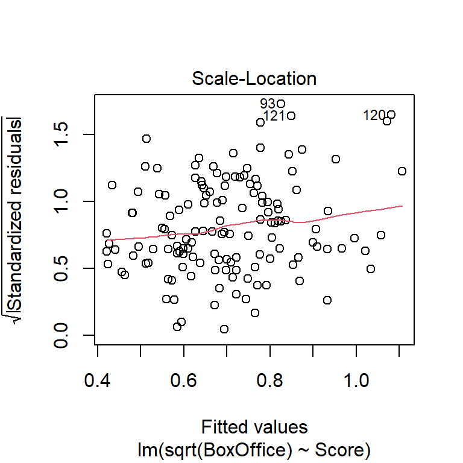
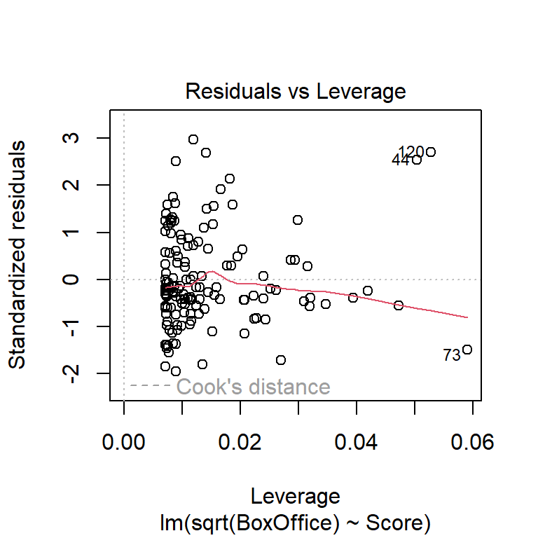
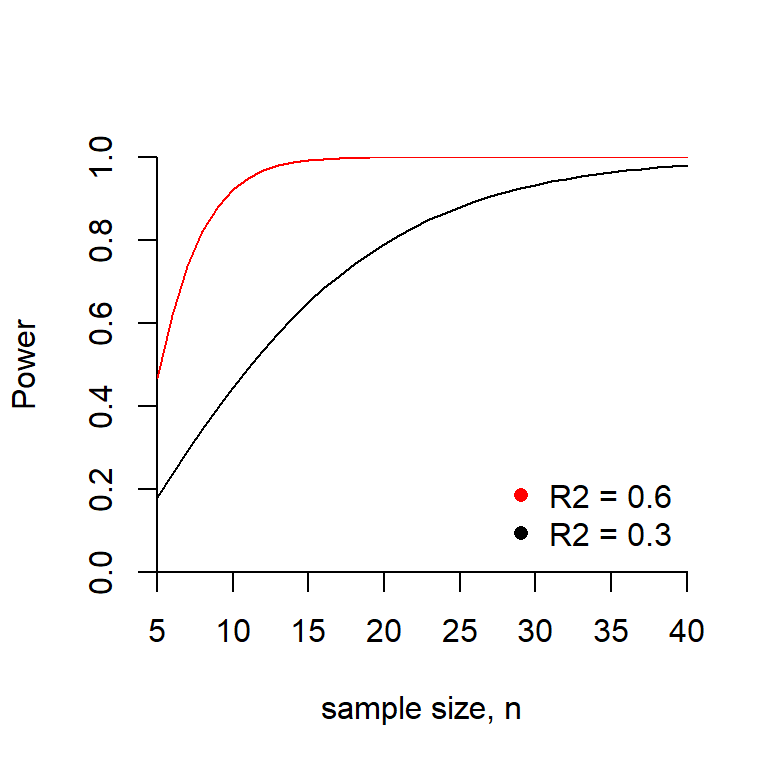

--- 
title: "ST 512 course notes"
author: "Kevin Gross"
date: "2023-02-10"
output:
  bookdown::gitbook:
    config:
      toc:
        collapse: section
      fontsettings:
        theme: white
        family: serif
        size: 2
documentclass: book
bibliography: [st512.bib]
biblio-style: apalike
link-citations: yes
description: "Course notes for ST 512, Statistical Methods for Researchers II."
---


```r
knitr::opts_chunk$set(fig.width = 4, fig.height = 4, fig.align = "center") 
```

<!-- To compile, go to R Console, set working directory to the directory that contains the index file, and type

output: bookdown::gitbook

> bookdown::render_book("index.Rmd", "bookdown::gitbook")

To render a single chapter, use

> bookdown::preview_chapter("02-MultipleRegression.Rmd", "bookdown::gitbook")

See section 5.1 of Yihui Xie's bookdown book

-->

\renewcommand{\Pr}[1]{\mathrm{Pr}\!\left\{#1\right\}}
\newcommand{\vecy}{\mathbf{Y}}
\newcommand{\vecyhat}{\mathbf{\hat{Y}}}
\newcommand{\X}{\mathbf{X}}
\newcommand{\vecx}{\mathbf{x}}
\newcommand{\vecb}{\mathbf{\beta}}
\newcommand{\vecbhat}{\hat{\mathbf{\beta}}}
\newcommand{\veceps}{\mathbf{\epsilon}}
\newcommand{\vece}{\mathbf{e}}
\newcommand{\Exp}[1]{\mathrm{E}\left[#1\right]}
\newcommand{\Var}[1]{\mbox{Var}\left(#1\right)}
\newcommand{\SD}[1]{\mbox{SD}\left(#1\right)}
\newcommand{\Cov}[2]{\mbox{Cov}\left(#1, #2\right)}
\newcommand{\Cor}[2]{\mbox{Cor}\left(#1, #2\right)}


# Preface {-}

The primary purpose of this document is to serve as a set of course notes for ST 512, Statistical Methods for Researchers II, taught at North Carolina State University.  ST 512 is the second semester of a traditional two-semester graduate-level sequence in statistical methods.  I eventually hope to convert these notes into an on-line text, but this is an ongoing process.  In the meanwhile, these notes are available for use by anyone associated with NCSU.

### Philosophy {-}

<!-- Why do we learn statistics?  Statistics is a tool that can make for more effective data analysis.  It is not meant merely to serve a signalling function.   -->

These notes take the following perspectives.

*Statistics is nonintuitive.*  
When it comes to statistics, researchers cannot necessarily rely on their common sense to lead them towards correct answers.  Statistical reasoning is non-intuitive (@kahneman2011thinking), and the foundational ideas of statistics are elusive.  Therefore statistical literacy must be learned.  The primary goal of this course is to sharpen students' statistical literacy so that they may become more effective researchers.  

*The route to conceptual understanding is the detailed study of basic methods.*  
However, one does not develop a deep conceptual understanding merely by discussing concepts.  Instead, conceptual understanding is honed in part by studying the details of particular methods to understand why those details matter.  When we study the details of a method, the expectation is not that the student will remember those details in perpetuity.  Indeed, practicing scientists are unlikely anyway to remember details about statistical methods that they do not use routinely.  (This is not a knock on practicing scientists, but is instead simply a statement about the limitations of human memory.)  Instead, the point of studying statistical methods in detail is to strengthen conceptual understanding by exploring statistical methods at a reasonably deep level.  Examining details now will also make those details more recognizable if and when one faces a future data-analysis task that requires re-engaging those details.  That said, the ultimate emphasis of this course is not on the details of the methods, but is instead on the ideas, concepts, and reasoning that underlie statistical thinking.  I hope that these notes will deepen readers' conceptual understanding of statistics and by doing so strengthen their effectiveness as scientists.

*Except when it comes to sums-of-squares decompositions in ANOVA.*  
The exception to the statement above is ANOVA and the associated sums-of-squares decompositions.  At this mathemtical level --- that is, without assuming a familiarity with linear algebra --- sums-of-squares decompositions and the associated ANOVA tables are poor vehicles for developing conceptual understanding.  Instead, they fill texts with inscrutable tables tethered to formulas that lack a compelling underlying logic.^[Again, to be clear, the formulas lack a compelling underlying logic because we are not engaging the linear algebra.  If we embraced the linear algebra foundations, then the underlying logic would be clear indeed.]  ANOVA is still worth learning --- especially for the analysis of designed experiments --- but unless the underlying linear algebra is engaged, ANOVA is more usefully approached as a special case of a regression model.  For this reason, these notes introduce regression modeling first and ANOVA second, reversing the path taken by most texts.

*Confidence intervals deserve more emphasis, and hypothesis tests less.*  
Hypothesis tests have become the primary route to inference in contemporary science, likely because they are the de facto evidentiary standard for announcing results in the scientific literature.  This is unfortunate, because statistical significance provides only the thinnest of summaries of pattern in data.  Confidence intervals, on the other hand (or even standard errors), are often relegated to a secondary role, even though they provide a richer basis for characterizing pattern and uncertainty.  In the fullness of time, these notes will seek to promote the reporting of confidence intervals or standard errors as opposed to hypothesis tests as the primary vehicle for inference.

*Simplicity in statistical analysis is a virtue.*  
Contemporary statistical software allows anyone to fit complex statistical models.  However, just because one can fit a complex model does not mean that one should.  For a statistical analysis to have scientific value, it must be understood by both the analyst and the analyst's audience.  Unfortunately, many contemporary statistical methods produce opaque analyses that are impossible for the informed reader to understand without a substantial and unusual investment of time and energy.  (It doesn't help that, in the scientific literature, the details of contemporary analyses are buried in supplementary material that escapes the scrutiny of most reviewers, but that's another matter.)  As a result, informed and well-intentioned readers of the scientific literature have little choice but to accept the analysis at face value without understanding the genesis of the announced results.  This state of affairs does not serve science well.  

It is high time for the scientific community to ask whether complex but opaque statistical analyses are in the best interest of science.  For most scientific studies, a simple and transparent analysis provides a more trustworthy vehicle to understanding for both the analyst and the analyst's audience.  These notes will emphasize methods that, when studied, are transparent enough to promote such an understanding. 

*Everyone is a visual learner.*  
No one is convinced by a $p$-value in isolation, Or at least no one should be, given the ease of making errors in statistical analysis.  When an analysis suggests a pattern in data, the best way to understand the pattern is to visualize it with a thoughtfully constructed graphic.  Unfortunately, these notes in their current state are not as richly illustrated as they should be.  Eventually, I hope the notes will contain a full set of graphics that exemplify how to visualize patterns revealed by statistical analysis.

### Scope and coverage {-}

These notes form the basis for an intermediate course in statistical analysis. These notes do not start from the very beginning, and they presume a basic knowledge of the fundamentals of (frequentist) statistical inference, similar to what one might see in an introductory statistics course. 

@breiman2001statistical wrote a provocative paper some twenty years ago describing two statistical cultures: one of data modeling and a second of algorithmic modeling, thus anticipating the era of machine learning and artificial intelligence in which we increasingly seem to reside.  These notes fall squarely within (and even celebrate!) the former culture of data modeling as a path to scientific understanding.  Moreover, it seems to me that the data-modeling culture contains at least two different subcultures that map to disciplines that either learn from designed experiments vs. disciplines that rely primarily on so-called observational data.^[In this context, the term "observational data" is used to refer to data collected outside the context of a designed experiment.  One might bicker that all data, even those data from designed experiments, must be "observed", but this is the terminology that we have.]  The experimental-data culture tends to involve disciplines in the life sciences, favors ANOVA modeling, uses frequentist inference, and codes its models in SAS.  The observational-data culture tends to involve disciplines in the social and environmental sciences, favors regression modeling, increasingly embraces Bayesian analysis, and codes its models in R or Python.  

These notes aim to serve both the experimental and observational subcultures.  The saving grace that allows us to do so is that the core statistical model in both subcultures is the linear statistical model, which encompasses both regression and ANOVA.   Of course, most graduate students will need to learn specialized statistical methods that are popular in their own field of study.  These notes are not meant to cover these specialized methods, and thus they are not meant to embody the whole of statistics.  However, study of regression and ANOVA provides an opportunity to master core tools and provides a springboard to the study of more specialized and possibly discipline-specific methods.

These notes also deal exclusively with so-called "frequentist" statistical inference.  We do not engage Bayesian methods yet, although some Bayesian coverage is eventually forthcoming.  This class is also firmly situated in the study of low-dimensional statistical models.  We value parsimony, and we take the view that well constructed models are worthy objects of study in their own right.  More concretely, we seek to construct statistical models with parameters that correspond to natural phenomena of interest.  Algorithmic modeling (that is, machine learning) is outside the scope of these notes. 

### Mathematical level {-}

These notes do not assume knowledge of or use any math beyond arithmetic and basic probability.  This basic probability includes an understanding of random variables, standard distributions --- primarily Gaussian (normal) distributions, but also binomial and Poisson --- and basic properties of means and variances.

Students who are willing to engage the math a bit more deeply will find that doing so provides a more satisfying path through the material and leads to a more durable understanding.  Without knowing the math underneath, one can only learn statistical methods as different recipes in a vast cookbook, a tedious task that taxes the memory and gives statistics courses their reputation for drudgery.  For those who are so inclined, learning a bit of the mathematical theory reveals how the methods we study connect with one another, and thus provides a scaffolding to organize the methods sensibly and coherently.  Moreover, the underpinning mathematics can be understood with a minimum of calculus.  Linear algebra, however, is more essential.  Indeed, the linear models that we study are, ultimately, exercises in linear algebra.  These notes assume no previous familiarity with linear algebra, and so we will not emphasize the linear algebra underpinnings of the methods.  In the fullness of time, I hope that these notes will eventually include sidebars that present the linear algebra underneath the methods, for interested readers.

In this day and age, one might ask why it's necessary to understand the math at all.  Indeed, the internet makes it easy to quickly find code for any standard analysis.^[Indeed, we are probably not too far away from the rise of artificial intelligence-based statistical consulting, where anyone can upload a data set and answer a few questions about it in return for an AI's analysis.]  In such a world, the primary task facing an analyst is not so much to get the computer to give you an answer, but instead to confirm that the answer is in fact the one you want. Towards this end, knowing a bit about the math behind the methods makes it possible to determine whether the computer output you've obtained is indeed the analysis you hoped for.  Throughout, we will try to emphasize simple, quick calculations that can be used to verify that computer output is correct, or indicate that something needs to be fixed.

### Computing {-}

The first portion of these notes (focused on regression) presents analyses in R, while the latter portion (focused on designed experiments) presents analyses in SAS.  In the fullness of time, I hope that these notes will include complete code for conducting analyses in both R and SAS, but that is a work in progress.  While the notes examine the R and SAS implementation of the methods that it presents, these notes are not intended as a complete guide for learning either R or SAS from square one.  The internet abounds with resources for learning the basics of R, and I would not be able to improve on those resources here.  In many cases I provide R code for the sake of illustration, but---especially when it comes to data wrangling and to graphics---the code is not meant to be authoritative. ST 512 students will receive instruction in R and SAS coding in the laboratory component fo the course.

Readers interested in using R professionally would be well served by consulting Hadley Wickham's [tidyverse style guide](https://style.tidyverse.org/).  The ideas therein have helped me write substantially cleaner code, even if I haven't had the discipline to adhere to those ideas in all the code in these notes.  

That said, the R code in these notes does not fully embrace the piping style of the `tidyverse` ecosystem and the associated graphical facilities of `ggplot`.  I take this approach because the focus of these notes is on fitting and visualizing traditional statistical models, and it seems to me that the conventional style of R coding is still best suited for this purpose.  The piping style of the `tidyverse` seems better suited to data-science tasks such as wrangling with and visualizing large data sets.  As for `ggplot`, I prefer the style of coding in R's native graphical facilities, although `ggplot` can certainly produce high-quality graphics with relatively few lines of code.

As a practical matter, these notes are prepared in `bookdown` (@xie2022bookdown).  While it is possible to compile both R and SAS code on the fly in `bookdown`, the extensive output produced by SAS does not serve these notes well.  As a consequence, SAS output is condensed to show only the most salient portions of the output.


### Format of the notes {-}

Advanced sections are indicated by section titles that begin with stars ($^\star$). Shorter sidebars for enrichment appear in <span style="color: gray;"> gray text </span> and are offset by horizontal rules (like the one following the acknowledgments).  This material may be skipped without loss. Sections that are in an early and rougher stage of development are indicated with section titles shown in *italics*.  

<!-- This structure is inspired by @mascolell1995microeconomic's lovely text. -->

<!-- ### Other resources {-} -->

<!-- Want to consult a more polished resource?  (I wouldn't blame you.)   -->


### Acknowledgments and license {-}

I am deeply indebted to the R community (@r) for their project which has done no less than revolutionize data analysis in our times.  I also thank the developers of `bookdown` for providing the platform for these notes (@xie2022bookdown).

These notes are provided under [version 3 of the GNU General Public License](https://www.gnu.org/licenses/gpl-3.0.en.html). 

---

# (PART\*) Part I: Regression modeling {-}

# Simple linear regression

In statistics, regression models are those that relate the distribution of an output variable to the value(s) of one or several input variables.  Characterizing the relationships among input and output variables is central to much of science, and regression methods form the foundation for much of data analysis.  We'll have a lot to say about regression, but we'll begin with so-called simple linear regression (SLR).  SLR models are "simple" in the sense that they contain only one predictor.  

Because these notes are meant for the intermediate analyst, I'll assume that you've seen SLR before. The purpose of our study here is twofold.  First, we'll use SLR as a familiar venue to review many of the foundational concepts of (frequentist) statistical inference.  These ideas are often elusive, so it's worth reviewing them again to solidify our understanding.  Along the way, we'll encounter some new (!) ideas for interpreting the outcomes of statistical hypothesis test that may improve upon the traditional convoluted definitions.  

Second, we'll also introduce some more advanced regression ideas.  These ideas will carry over into our study of regression models with several predictors, so it is helpful to study them here in a less complicated setting.  

---

<span style="color: gray;"> For such a fundamental technique, the name "regression" seems a bit odd. Why do we give this most central of tasks such an obscure moniker?  The name traces back to Francis Galton's late 19th century study of the relationship between the heights of individuals and their parents' heights (@galton1886regression).  Galton observed that while the children of taller-than-average or shorter-than-average parents also tend to be taller than average or shorter than average, respectively, the children's heights tend to be closer to the average height than those of their parents.  Galton termed this phenomenon "regression to mediocrity"; today, we don't like to equate average-ness with mediocrity, so we now refer to the phenomenon as "regression to the mean".  In any case, to characterize this relationship statistically, Galton wrote down equations that were the precursors of the statistical model that we now know as regression.  So, the statistical model of regression was first used to describe the empirical phenomenon of regression to the mean, even though statistical regression models are now used in a much broader variety of contexts.</span>

<span style="color: gray;"> All that said, regression to the mean doesn't just apply to people's heights; instead, it appears in all sorts of everyday contexts.  For example, it helps explains why students who do particularly well on a first exam tend not to do quite so well on a subsequent exam, or why repeating as a league champion is so rare in sports.  For more coverage, see e.g. Ch. 17 of @kahneman2011thinking.</span>

---

## The basics of SLR

Simple linear regression characterizes the relationship between two variables: a predictor variable and a response variable.   We will begin with a simple example for context.

*Example*: Individuals in this study consumed a certain number of beers, and their blood alcohol content (BAC) was measured.  Data were obtained for $n=16$ individuals.^[Regrettably, I've lost track of the original source of these data.]  Here is a scatter plot of the data:
<div class="figure" style="text-align: center">

<p class="caption">(\#fig:unnamed-chunk-2)BAC vs. beers consumed.</p>
</div>

To begin, let's observe that the two variables that a regression model associates are not on equal footing.  One variable is designated as the "predictor" and the other variable is designated as the "response".  The predictor variable is denoted by the symbol $x$, and the response variable is denoted by $y$.  In plotting, we almost always show the predictor on the horizontal axis and the response on the vertical axis.^[This convention is so common that one often hears the horizontal axis referred to as the $x$-axis and the vertical axis referred to as the $y$-axis.  If we wanted to be exceedingly careful we should only refer to the axes in this way when the variables that they show are in fact $x$ and $y$, but few outside of mathematics find such care necessary.]  The predictor is also called the "independent" variable because, in a designed experiment, its values are determined by the investigator.  The response is also called the "dependent" variable because its distribution depends on the value of the predictor variable, in a way that is determined by nature.  For the BAC data, we will identify the number of beers consumed as the predictor and BAC as the response.

The regression model associates each value of the predictor variable with a distribution for the response variable.  Indeed, the fact that the output of the model is a distribution is what makes this a statistical model, as opposed to some other flavor of mathematical model.  A *simple linear regression*  (SLR) is a simple statistical model in which the association between the value of the predictor and the distribution of the response takes a specific form.  In particular, in a SLR, the distribution of the response variable is Gaussian (or normal) with a mean that depends linearly on the value of the predictor and a variance that is independent of the value of the predictor.  When we plot the fit of a regression model, we typically only plot the regression line.  However, the line merely shows how the average of the distribution of the response depends on the predictor.  The model has more structure than a plot of the regression line suggests.

In terms of an equation, we can write the model using the regression equation
\begin{equation}
y_i =\beta_0 +\beta_1 x_i +\varepsilon_i (\#eq:slr).
\end{equation}
In words, we might re-write the equation as
$$
\mbox{response = intercept + slope} \times \mbox{predictor + error}.
$$
In the mathematical equation above, the *i* subscript distinguishes individual data points.  For example, $y_1$ is the value of the response associated with the first observation in the data set.  Usually, we use the notation $n$ for the total number of data points, and so to be precise we might also write $i = 1, \ldots, n$.  In words, we say that "$i$ varies from 1 to $n$" or "$i$ ranges from 1 to $n$".  We'll suppress the $i$ subscript when we don't need it.  

In the SLR model, the equation $\beta_0 + \beta_1 x$ shows how the average of the response depends on the predictor value. The parameter $\beta_0$ is called the intercept, and it gives the value of the regression line when the predictor $x = 0$.  As we will see, the value of the regression line at $x=0$ often isn't a scientifically meaningful quantity, even though we need to know the value to specify the model fully.   The parameter $\beta_1$ is the slope.  In SLR, the slope is a parameter tells us by how much regression line rises or falls as the predictor changes.  Positive values of the slope indicate that the regression line increases as the predictor increases, and negative values of the slope indicate that the regression line decreases as the predictor increases.

The regression line alone is not sufficient to fully specify the entire regression model.  To the regression line we add a normally distributed error, denoted by $\varepsilon$.  The error term is a catch-all that subsumes all the other factors that might influence the response that are not included in the predictors.  In the context of the BAC example, these might include body weight, metabolism, and/or alcohol content of the beer (if it differed among subjects). 

Although they look similar, it is important to realize that $\beta_0$, $\beta_1$, and $\varepsilon$ are different beasts.  The quantities $\beta_0$ and $\beta_1$ are parameters.  Recall that in statistics, *parameters* are quantities that characterize a population.  We assume that true values of $\beta_0$ and $\beta_1$ exist; those values are just unknown to us.  We will estimate these parameters and draw inferences about their values on the basis of data.

In contrast, the error term $\varepsilon$ is a random variable.  It does not have one single value, but instead takes a different value for every member of a population.  We describe the distribution of the errors across the members of the population using a probability distribution.  In simple linear regression, we assume that the random errors have a Gaussian (or normal, or bell-shaped) distribution with mean 0 and variance $\sigma_{\varepsilon}^{2}$.  We also assume that the random errors are independent among individuals in our sample.  A succinct way of stating this is to state that the errors are Gaussian and "independent and identically distributed" (abbreviated "iid").  In notation, we write $\varepsilon_{i} \stackrel{\text{iid}}{\sim} \mathcal{N}\left(0, \sigma_{\varepsilon }^2 \right)$, a statement which we would read as "the errors have a normal (or Gaussian) distribution with mean 0 and variance $\sigma^2_\varepsilon$".  The error variance $\sigma_{\varepsilon }^2$ is a parameter, and it measure of the variability in the response that is not explained by the predictor.  We will also discuss how to estimate $\sigma_{\varepsilon }^2$.  (It is also possible to draw statistical inferences for $\sigma_{\varepsilon }^2$, although we will not discuss how to do so in these notes.)

Before moving on to discussing how to estimate the model parameters, let's reflect a bit on the slope, $\beta_1$, because this is the parameter that captures the linear association between the two variables.  A particularly nice way to interpret the slope is due to @gelman2020regression.  Their interpretation works like this.  Consider two values of the response $y_1$ and $y_2$, associated respectively with two values of the predictor $x_1$ and $x_2$.  The regression model says that, on average, the difference $y_1 - y_2$ will equal $\beta_1 \times (x_1 - x_2)$.  The "on average" part of this interpretation is important because we realize that any two actual observations will also include their respective errors, and so we don't expect these two observations to differ by exactly $\beta_1 \times (x_1 - x_2)$.  Second, this interpretation also makes it clear that the regression model predicts that the average difference between two responses will increase or decrease linearly as the difference between their two associated predictor values grows or shrinks.  Thus, if the SLR model is appropriate for the BAC data (something we have yet to verify), then the model suggests that the average BAC difference between two individuals who have consumed 1 vs.\ 2 beers is the same as the average BAC difference between two individuals who have consumed 4 vs.\ 5 beers, and that both of these differences are one-half as big as the average BAC difference between two individuals who have drank 2.5 vs.\ 4.5 beers.

---

<span style="color: gray;"> Our assumption of normally distributed errors has a deeper justification than may meet the eye.  If you've studied probability, you may have encountered an important result called the Central Limit Theorem.  For our purposes, the Central Limit Theorem tells us that if the error results from the combined effect of many small factors added together, then the error's distribution will be approximately normal.  (We will see that regression models are not sensitive to moderate departures from normality, so approximately normal errors are good enough.)  This result provides a strong justification for expecting normally distributed errors in many cases.  The normality assumption begins to break down when the errors are dominated by only a few factors, or when the factors that contribute to the error combine multiplicitavely.  This latter scenario --- errors that result from the product of many small influences as opposed to their sum --- frequently arises in biology when the response measures some form of population size.  Populations grow or shrink multiplicitavely, and so population sizes tend to have right-skewed distributions. </span>

<span style="color: gray;">It's also worth noting that we can write the regression model as the sum of the regression line ($\beta_0 + \beta_1 x$) and an error term with mean zero ($\varepsilon$) because we have assumed that the errors have a normal distribution.  A normal distribution has the special property that we can take a normally distributed quantity, add a constant to it, and the sum will still have a normal distribution.  Most statistical distributions do not have this property; for example, a Poisson random variate plus a non-zero constant does not yield a Poisson distributed sum.  Some authors find it more natural to write the SLR model as $y \sim \mathcal{N}(\beta_0 + \beta_1 x, \sigma^2)$, to emphasize that the response has a Gaussian distribution and that the predictor only affects the mean of this distribution.  We will use the style of eq. \@ref(eq:slr), because this style lends itself more readily to mixed-effects models with multiple variance terms.  However, the two styles of notation denote the same model.  Feel free to use whichever style makes the most sense to you.</span>

---

## Least-squares estimation 

The parameters of an SLR model are estimated by the method of least-squares.  That is, we find the values of the parameters that minimize the sum of the squared differences between the data points themselves and the line.  The estimates are denoted by "hats", i.e., $\hat{\beta}_0$ is the estimate of $\beta_0$.  Other authors use $b$'s instead of $\hat{\beta}$'s for parameter estimates in regression.  Both types of notation commonly appear in the scientific literature.

If we were inventing SLR from scratch, we might imagine many possible criteria that we could use to determine the parameter values that provide the best fit of the SLR model.  For example, we might contemplate fitting the line that minimized the average absolute difference between the data points and the line.  The reason why we favor the least-squares criterion is a direct consequence of the assumption that the errors take a Gaussian distribution.^[More precisely, the least-squares estimates of the intercept and slope are the *maximum likelihood* estimates, when we assume that the errors take a Gaussian distribution.  Maximum likelihood will be discussed in later versions of these notes.]

In an introductory statistics course, you may have derived formulas for calculating the least-squares estimates $\hat{\beta}_0$ and $\hat{\beta}_1$  by hand. Here, we will rely on software for the necessary computations, although one might note that one could derive the formulas for $\hat{\beta}_0$ and $\hat{\beta}_1$  by using basic calculus tools to minimize the error sum-of squares. Using R, we obtain the least-squares fit of the regression model to the BAC data below.^[A note on terminology: It is conventional to refer to a regression model as a regression of the response on, versus, or against the predictor.  Thus, the BAC model could be described as a regression of BAC on the number of beers consumed, or alternatively as a regression of BAC against the number of beers consumed.]


```r
fm1 <- with(beer, lm(BAC ~ Beers))
summary(fm1)
```

```
## 
## Call:
## lm(formula = BAC ~ Beers)
## 
## Residuals:
##       Min        1Q    Median        3Q       Max 
## -0.027118 -0.017350  0.001773  0.008623  0.041027 
## 
## Coefficients:
##              Estimate Std. Error t value Pr(>|t|)    
## (Intercept) -0.012701   0.012638  -1.005    0.332    
## Beers        0.017964   0.002402   7.480 2.97e-06 ***
## ---
## Signif. codes:  0 '***' 0.001 '**' 0.01 '*' 0.05 '.' 0.1 ' ' 1
## 
## Residual standard error: 0.02044 on 14 degrees of freedom
## Multiple R-squared:  0.7998,	Adjusted R-squared:  0.7855 
## F-statistic: 55.94 on 1 and 14 DF,  p-value: 2.969e-06
```

The least-squares estimates of the intercept and slope for the BAC data are $\hat{\beta}_0 = -0.013$ and $\hat{\beta}_1 = 0.018$, respectively.  Here's a picture of the scatter-plot with the least-squares line: 


```r
with(beer, plot(BAC ~ Beers, xlab = "beers consumed"))
abline(fm1)
```

<div class="figure" style="text-align: center">

<p class="caption">(\#fig:unnamed-chunk-4)SLR fit of BAC vs. beers consumed.</p>
</div>

The best fitting line shows a positive relationship between BAC and beers consumed.  Using the interpretation that we introduced in the previous section, we would say that if we measure the BAC of two people, one of whom has consumed one more beer than the other, on average the BAC of the person who drank more beers will be 0.018 higher than the BAC of the persion who drank fewer beers.  Similarly, if we compare the BAC of two people, one of whom drank four more beers than the other, on average the BAC of the person who drank more beers will be $0.4 \times 0.018 = 0.072$ higher than the person who drank fewer beers, and so on.

In a perfect world, we would always include units along with our parameter estimates.  In the BAC data, the units of the predictor are perfectly clear (the units are the number of beers), but the units of the response are a bit trickier.  The units of BAC are percent by volume, which is often just shortened to percent.  So, in the BAC regression model, the units of the intercept are $\hat{\beta}_0 = -0.013\%$, and the units of the slope are $\hat{\beta}_1 = 0.018$ percent per beer consumed.  Quoting units can get a bit repetitive, so we'll omit them on occasion, but identifying the units of parameters in your own analysis is a good way to deepen your understanding of what the numbers in the analysis mean.

Evaluating the fitted regression line for a given value of the predictor generates a *fitted value* for each data point.  Fitted values are denoted $\hat{y}_i$.  In notation, $\hat{y}_i = \hat{\beta}_0 + \hat{\beta}_1 x_i$.  (What are the units of fitted values?  And why did the error term vanish in the equation for $\hat{y}_i$?)

The *residual* for observation $i$, denoted $e_i$, is the difference between the actual observation and the fitted value.  In notation, we write $e_i = y_i -\hat{y}_i$.  (What are the units of residuals?) In terms of the data plot, the residuals can be thought of as the vertical differences between the actual data points and the fitted line.  In the figure below, the vertical line represents the residual for the individual who consumed 9 beers.


*Example*: The first individual in the data set drank $x_1 = 5$ beers and had a BAC of $y_1 = 0.1\%$.  Find the fitted value and residual for this data point.  Answer: $\hat{y}_1 = 0.077\%$, $e_1 = 0.023\%$.

The *error sum of squares* (SSE) is the sum of the squared residuals.  Written as a formula, we would write
$$
SSE = \sum_{i=1}^{n} e_i^{2} = \sum_{i=1}^{n} \left(y_{i} - \hat{y}_i \right)^{2}. 
$$
The SSE is a measure of the unexplained variability in the response.  The least squares estimates, $\hat{\beta}_0$ and  $\hat{\beta}_1$, are called the least squares estimates because they minimize the SSE.  

We can use the SSE to find an estimate of the error variance parameter by using the formula
$$
s_\varepsilon^2 = \dfrac{SSE}{n-2} = MSE
$$
We divide by $n - 2$ because there are $n - 2$ degrees of freedom (df) associated with the SSE.  When we divide an error sum-of-squares by its degrees of freedom, the resulting quotient is called the "mean-squared error" (MSE). For the BAC data, the SSE is 0.0058, yielding a MSE of $0.0058/(16-2) \approx 0.0004$.  See the gray text at the end of this section for an explanation of why the number of degrees of freedom is $n-2$.

Variances are difficult to understand because they are on a squared scale. Thus, the units of the error variance are the units of the response, squared.  To place this estimate on a more meaningful scale, we take the square root to obtain the estimate of the residual standard deviation $s_{\varepsilon}$:
$$
s_{\varepsilon} =\sqrt{\dfrac{SSE}{n-2}} = \sqrt{MSE} 
$$
For the BAC data, $s_{\varepsilon} = \sqrt{0.0004} = 0.020$.  This is a more useful number, as it suggests that a typical deviation between an observed BAC and the corresponding fitted value is 0.020%. (Take a look again at the magnitude of the residuals in the scatterplot of the BAC data, and convince yourself that 0.020% is a reasonable guide to the magnitude of a typical residual.)  In the R `summary` of our model fit, the value of $s_{\varepsilon}$ is given by the portion of the output labeled "Residual standard error".^[Perhaps this reveals my own ignorance, but I can't figure out why the R `summary` of the linear model refers to $s_{\varepsilon}$ as the "Residual standard error".  It seems to me that $s_{\varepsilon}$ is the standard deviation of the residuals, and thus it would be better to call it the "Residual standard deviation".] 

---

<span style="color: gray;"> Degrees of freedom appear frequently in statistical modeling. We will spend quite a bit of effort in these notes keeping track of degrees of freedom, so it's helpful to understand this concept well. We'll look carefully at df in the simple case of SLR to build intuition that will carry over into more complicated models.</span>

<span style="color: gray;">Most error terms, like the SLR error variance $\sigma_\varepsilon^2$, are estimated by sums of squares.  The concept of degrees of freedom quantifies how many "free differences" are available to compute a sum of squares.</span>

<span style="color: gray;">Consider the following thought experiment.  Suppose that, bizarrely, we knew the values of the parameters $\beta_0$ and $\beta_1$ in an SLR, and only needed to estimate the error variance $\sigma_\varepsilon^2$.  We could do so using the sum of squares $\sum_{i=1}^{n}\left(y_{i} -\left[\beta_0 +\beta_1 x_i \right]\right)^2$.  In this case, each of our $n$ data points would contribute a "free difference" to the summation above, and so there would be $n$ free differences with which we could estimate the error variance $\sigma_\varepsilon^2$.</span>

<span style="color: gray;">However, we never know the values of $\beta_0$ and $\beta_1$ in advance.  Instead, we have to use the data to estimate both $\beta_0$ and $\beta_1$.  Now, because we have to estimate both $\beta_0$ and $\beta_1$, there are only $n - 2$ free differences in the sum of squares $\sum_{i=1}^{n}\left(y_{i} -\left[\hat{\beta}_0 +\hat{\beta}_1 x_i \right]\right)^{2}$.  One way to visualize this is to imagine fitting a line to a data set  with only $n = 2$ data points (with different $x$ values).  The line would be guaranteed to pass through both points, and consequently both residuals would equal 0. Because both residuals equal 0, the SSE would also equal 0.  However, the SSE doesn't equal 0 because the actual value of  $\sigma_\varepsilon^2$ equals 0.  Instead, the SSE equals 0 because there is no information remaining to estimate the residual variance.</span>

<span style="color: gray;">In general, when we have to use the same data set to estimate the parameters that determine the average value of the response and to estimate the residual variance, then each parameter that we have to estimate in the mean component of the model eliminates a free difference from the sum of squares $\sum_{i=1}^{n}\left(y_{i} -\hat{y}_{i} \right)^{2}$.  To convert the sum of squares into an estimate of an error variance, we need to count the number of free differences (or degrees of freedom) correctly, and divide the sum of squares by the appropriate number of df to make sure we get a good estimate of the variance. </span>

---

<!-- Some additional notation: In general, we'll use the notation $\mu \left(x\right)$ to denote the signal or mean component of the model.  In simple linear regression, the mean is simply a linear function of the predictor: $\mu \left(x\right) = \beta_0 +\beta_1 x$.  Although the notation $\mu \left(x\right)$ might seem like overkill for SLR, it will prove handy for more complicated models. -->

## Inference for the slope 

To draw statistical inferences about the slope parameter $\beta_1$, we make the following assumptions:

1. Linearity:  The average value of the response is a linear function of the predictor.

2. Equal variance ("homoscedasticity"):  The variance of the error terms (the $\varepsilon_i$'s) is the same for all observations.

3. Independence:  The error terms are independent of one another.

4.  Normality.  The errors have a normal (i.e., bell-shaped, or Gaussian) distribution.

<!-- 5. The predictors are measured without error. -->

<!-- This fifth assumption is usually not listed as one of the assumptions in SLR, but it is useful to keep in mind.  The predictor and the response are *not* placed on equal footing.  -->

Note that assumption number 1 deals with the mean component of the model, while assumptions 2--4 deal with the error component of the model.

### Standard errors

As intelligent scientists, we realize that estimates are not exactly equal to the parameters that they seek to estimate.  We can characterize the uncertainty in parameter estimates in different ways.  One tool that we have for quantifying uncertainty in parameter estimates is to calculate a standard error.  In general, a *standard error* quantifies the variability in an estimate that is attributable to random sampling.  Most parameter estimates that we will encounter have known formulas for their standard errors.  In most cases, these formulas are complicated, and we will rely on computers to calculate standard errors for us.  However, the formula for the standard error of the slope parameter in SLR is interesting to examine because it contains a valuable insight that we can use when collecting data for a regression study.  The standard error of $\hat{\beta}_1$, denoted $s_{\hat{\beta}_1}$, is given by the formula
\begin{equation}
s_{\hat{\beta}_1} = \dfrac{s_{\varepsilon}}{\sqrt{S_{xx} } } 
(\#eq:se-slope)
\end{equation}
where $S_{xx} =\sum_{i}\left(x_{i} -\bar{x}\right)^2$ quantifies the dispersion in the predictor variables.  

Although this formula looks a bit daunting, there's some intuition to be gained here, and a lesson for experimental design.  Suppose we had designed a regression experiment in which all of the individuals were assigned similar values of the predictor.  In this case, $S_{xx}$ would be small, and consequently the standard error $s_{\hat{\beta}_1}$ would be large.  Conversely, if the values of the predictor were very different among individuals in the study, then $S_{xx}$ would be large and the standard error $s_{\hat{\beta}_1}$ would be small.  Thus, if we want a precise estimate of the slope, we should choose predictor values that span the range over which we want to learn.

Thought question: Following this line of reasoning, is it a good idea to design a study so that half the individuals are assigned a very large value of the predictor, and the other half are assigned a very small value?  Why or why not?

For the BAC example, $s_{\hat{\beta}_1} = 0.0024$.  (The units are the same units as the slope, or percent per beer consumed for the BAC data.) This tells us that, over many hypothetical repetitions of this same experiment, a typical difference between our estimate of the slope and its true value is 0.0024.  This information sharpens our understanding of the precision of the estimate.^[If we wanted to be more precise, we should note that the value given by eq. \@ref(eq:se-slope) is actually an estimate of the standard error.  The true standard error of the slope is a parameter denoted by $\sigma_{\hat{\beta}_1}$ and given by the formula $\sigma_{\hat{\beta}_1} = \frac{\sigma_{\varepsilon}}{\sqrt{S_{xx} } }$, where $\sigma_{\varepsilon}$ is the (true) residual standard deviation.  Of course, we can never compute $\sigma_{\hat{\beta}_1}$, because we can never know $\sigma_{\varepsilon}$.  So, we do the sensible thing and substitute our estimate of the residual standard deviation $s_{\varepsilon}$ for its unknown counterpart $\sigma_{\varepsilon}$.  The resulting expression in eq. \@ref(eq:se-slope) gives us an estimate of the standard error of the slope.  It would be cumbersome to call $s_{\hat{\beta}_1}$ (and every estimated standard error) an "estimated standard error", so we usually just call it a "standard error".  That said, if we were to repeat the experiment with a different random sample of individuals, we would expect to obtain a different value for $s_{\hat{\beta}_1}$, because the value is an estimate.  (And, yes, because $s_{\hat{\beta}_1}$ is an estimate, it has its own standard error $\sigma_{s_{\hat{\beta}_1}}$ which we could estimate as $s_{s_{\hat{\beta}_1}}$, and so on to infinity.))]

### Confidence intervals

A second way in which we can measure the uncertainty in a parameter estimate is to calculate a confidence interval (CI).  Recall that the general formula for a confidence interval associated with a statistic is:
$$
\mathrm{estimate} \pm  \mathrm{critical\ value} \times \mathrm{standard\ error}
$$
Critical values are found either by consulting a table (and re-living the good old days) or using the internet or a computer program.  Critical values depend on the *confidence level* that you want to associate with the CI.  Although it seems a bit backwards, we typically denote the confidence level of a CI as $100 \times \left(1-\alpha \right)\%$.  Thus, for a 95\% confidence interval (a common choice), $\alpha = 0.05$.  Alternatively, we might seek a 99\% CI, in which case $\alpha = 0.01$.  

To construct a CI for $\beta_1$ , we find the appropriate critical values from a $t$-distribution with $n - 2$ df.  For a $100\times \left(1-\alpha \right)\%$ CI, the critical value is the value that "cuts-off" an upper tail of $\alpha / 2$ \%.  For example,  to calculate a 99\% CI for $\beta_{1}$, we need to find the critical value of a $t$-distribution with 14 df that cuts-off an upper 0.5\%-tail.  Using an online calculator, or another tool, we find that this critical value is 2.977.  Thus, a 99\% CI is 0.018 $\pm$ 2.977 $\times$ 0.0024 =  (0.011, 0.025).

Recall that the appropriate interpretation of the confidence level a CI is fairly tricky.  A proper interpretation is that, if we were to repeat this experiment a large number of times, and calculate a 99\% CI for each experiment, in the long run 99\% of those CIs would contain the true value of $\beta_1$.  Of course, in real life, we'll only do the experiment once, and we don't know if our experiment is one of the 99\% in which the CI contains the true parameter value or not.  It is often tempting to abbreviate this interpretation by saying that ``there is a 99\% chance that $\beta_1$ is in the CI'', although technically this interpretation is incorrect (because any single CI either contains the parameter or it doesn't).^[Here's another way to see why it is incorrect to interpret a the coverage level of a confidence interval as a statement about the probability that a random parameter falls in a fixed interval.  Suppose we repeated the experiment with a new random sample drawn from the same population and calculated a new 99\% confidence interval for $\beta_1$ based on this second experiment.  Under the incorrect interpretation, we could immediately use the mathematics of probability to determine that the intersection (or overlap) of the two 99\% confidence intervals must itself be a confidence interval with at least 98\% coverage.  But this can't be true.  Indeed, there is some chance that the two intervals won't overlap at all!  Thus our original premise of treating the coverage level as a statement about the probability that a random parameter is contained in a fixed interval must be wrong.  The only way to interpret the situation correctly is to realize that confidence is a statement about the probability that a random interval contains a fixed parameter value.]  

Note also that there is a trade-off between the confidence level and the width of the interval.  If we wanted greater confidence that our interval contained the true parameter value, we could increase the confidence level.  However, increasing the confidence level increases the width of the interval, and thus provides less information about the true parameter value in some sense.  If we follow this argument to its (il)logical extreme, a 100\% CI for $\beta_1$ covers the entire number line.  Now we are fully confident that our interval contains $\beta_1$, but at the cost of having no information whatsoever about the actual value of $\beta_1$.

### Statistical hypothesis tests

Finally, a third way to characterize the statistical uncertainty in $\hat{\beta}_1$ is to conduct a statistical hypothesis test.  Recall that statistical hypotheses are statements about the values of unknown parameters, and a statistical hypothesis test is a way to measure the strength of evidence against a "null hypothesis".  In the context of SLR, we are almost always interested in testing the null hypothesis that the true value of the slope parameter is equal to zero.  In notation, we write this as $H_0: \beta_1 = 0$.  Evidence against this null hypothesis is taken as evidence that the predictor is linearly related to the response.  

Recall that in statistical hypothesis testing, we must also specify an alternative hypothesis.  In SLR, we are almost always interested in testing $H_0: \beta_1 = 0$ vs. the two-sided alternative $H_a: \beta_1 \ne 0$.  We conduct a statistical hypothesis test by first calculating a test statistic.  In general, formulas for test statistics take the form:
$$
\mbox{test statistic} = \dfrac{\mbox{parameter estimate} - \mbox{value of parameter under }H_0} {\mbox{standard error}}
$$
 
Test statistics have the property that if the null hypothesis is true, then the test statistic has a known sampling distribution.  In the case of testing $H_0: \beta_1 = 0$ vs.\ $H_a: \beta_1 \ne 0$ in SLR, if the null hypothesis is true, then the test statistic will have a $t$-distribution with $n-2$ df.  In notation, the test statistic is 
$$
t=\frac{\hat{\beta}_{1} -0}{s_{\hat{\beta }_{1} } } =\frac{\hat{\beta }_{1} }{s_{\hat{\beta }_{1} } } 
$$ 
In SLR, this test is so common that the value of the $t$-statistic is provided automatically by most statistical software packages, including R.   For the BAC data, the $t$-statistic associated with the test of $H_0: \beta_1 = 0$ vs.\ $H_a: \beta_1 \ne 0$ is $t = 7.48$.

Values of the test statistic by themselves are not terribly enlightening.  Instead, we use the test statistic to find a $p$-value.  $P$-values are famously difficult to interpret, and those difficulties in interpretation have impeded their proper use.  In 2016, a blue-ribbon panel of experts were convened by the American Statistical Association (the leading professional organization for statisticians in the US) to take the remarkable step of issuing a policy statement regarding the use of $p$-values.  That statement (@wasserstein2016asa) defines a $p$-value as follows:  
>
Informally, a $p$-value is the probability under a specified statistical model that a statistical summary of the data (e.g., the sample mean difference between two compared groups) would be equal to or more extreme than its observed value.

(Bear in mind that this definition is the work of two dozen of the world's leading statisticians.)  
 
In the context of the test of $H_0: \beta_1 = 0$ vs.\ $H_a: \beta_1 \ne 0$  in SLR, this means finding the probability that  a $t$-statistic with $n-2$ df is at least as different from zero as the value observed.  For a two-sided alternative hypothesis, we say "different from zero' because the sign (positive vs. negative) of the $t$-statistic is irrelevant.  Be careful, though: for a one-sided alternative hypothesis, the sign of the observed $t$-statistic is critical!  
 
For the BAC data, we find the area under the tail of a $t$-distribution with 14 df that is greater than 7.48, and then (because the $t$-distribution is symmetric) multiply by 2.  That is, 
\begin{align*}
p & = \Pr{ t_{14} < -7.48} +\Pr{ t_{14} > 7.48}  \\ 
  & = 2 \times \Pr{ t_{14} >7.48  } \\
  & = 3\times 10^{-6}  
\end{align*}
Thus, there is exceedingly strong evidence that BAC is related to the number of beers consumed.

---

<span style="color: gray;"> My NCSU colleague Ryan Martin suggests that we interpret the $p$-value as the *plausibility* of the null hypothesis (@martin2017statistical).  Thus, small $p$ values correspond to null hypotheses that are not plausible in light of the data, and large $p$ values (those nearer to 1) indicate that null hypothesis is plausible in light of the data.  The good news here is that "plausibility" in this context has a rigorous mathematical meaning, and that meaning is more or less exactly what the everyday definition of "plausibility" suggests.  The less good news is that understanding this meaning exactly requires the mathematics imprecise probability, which is beyond the scope of this and most statistics courses today.  Nevertheless, it strikes me as the best available option for interpreting $p$-values.</span>

<span style="color: gray;"> Continuing in this vein, we can plot the $p$-value associated with the test of $H_0: \beta_1 = \beta_{1,0}$ vs.\ $H_a: \beta_1 \ne \beta_{1,0}$ for any parameter value $\beta_{1,0}$ that we might assume under the null.  This plot shows the $p$-value function, or, following along the lines of the interpretation above, what we might call the plausibility function.  Here is a look at the plausibility function for $\beta_1$ for the BAC data:</span>


```r
b1.hat <- 0.017964
b1.se  <- 0.002402

p_val <- function(b1) {

  t.stat <- (b1.hat - b1) / b1.se
  
  pt(-abs(t.stat), df = 14, lower.tail = TRUE) +
     pt(abs(t.stat), df = 14, lower.tail = FALSE)
}

curve(p_val, from = 0, to = 0.03, xlab = expression(beta[1]), ylab = "plausibility",
      yaxt = "n")
axis(2, at = c(0, 0.5, 1), las = 1)
abline(v = b1.hat, lty = "dotted")
axis(3, at = b1.hat, lab = expression(hat(beta)[1]))
```


<span style="color: gray;"> Another nice feature of the $p$-value function is that we can find a $100 \times (1 - \alpha)\%$ confidence interval (or, more generally, a confidence region) by taking all those parameter values that are individually at least $\alpha\%$ plausible.  So, for example, a 90\% confidence interval consists of all those parameter values that are at least 10\% plausible.  For the BAC data, we can show this confidence interval as:</span>


```r
curve(p_val, from = 0, to = 0.03, xlab = expression(beta[1]), ylab = "plausibility",
      yaxt = "n")
axis(2, at = c(0, 0.5, 1), las = 1)
axis(2, at = 0.1, col = "red", las = 1)
abline(h = 0.1, col = "red", lty = "dashed")
(conf.limits <- confint(fm1, level = 0.9))
```

```
##                     5 %        95 %
## (Intercept) -0.03495916 0.009557957
## Beers        0.01373362 0.022193906
```

```r
abline(v = conf.limits[2, ], col = "red", lty = "dotted")
```


<span style="color: gray;"> This graph nicely illustrates the tight connection between confidence intervals and hypothesis tests.  For example, a 90\% confidence interval consists of all those parameter values that we would fail to reject at the 10\% significance level.</span>  

<span style="color: gray;">While $p$-value curves have been around a long time, statisticians have never agreed on what to do with them.  For that reason, they don't appear commonly in statistics texts.</span>

---

The values above could be found by consulting a table, or by using statistical software such as R.  Because the test of $H_0: \beta_1 = 0$ vs.\ $H_a: \beta_1 \ne 0$ is sufficiently common in SLR, most computer packages will do this calculation for us.  
  
We'll sweep a lot of acrimonious debate about statistical hypothesis testing under the rug and simply say that some scientists like to make a decision about whether or not to "reject" the null hypothesis.  In contemporary practice, most scientists make these "reject" or "do not reject" decisions by comparing the $p$-value to the test's *significance level*, which is usually denoted by $\alpha$.  The significance level (or size) of a test is the frequency with which one would erroneously reject a true null hypothesis; you might also think of it as the allowable false-positive rate.  Consequently, tests with more exacting thresholds for statistical signficance require more evidence against the null to reject it.  Most scientists conventionally make reject / do not reject decisions with a significance level of $\alpha = .05$, but you are free to use whatever significance level you deem appropriate.  If $p \le \alpha$, we reject the null hypothesis; otherwise, we fail to reject it.  (Remember that we never `accept' the null hypothesis.  We only fail to reject it.)

Although it is rare, we can also entertain so-called 'one-sided' alternative hypotheses. For example, suppose that we were uninterested in the (somewhat nonsensical) possibility that the numbers of beers consumed decreased BAC, and only were interested in measuring the evidence that the numbers of beers consumed increases BAC.  To do so, we might test the same null hypothesis $H_0: \beta_1 \leq 0$ vs. the one-sided alternative $H_a: \beta_1 > 0$.  To conduct this test, the test statistic is still
$$
t=\dfrac{\hat{\beta }_{1} -0}{s_{\hat{\beta }_{1} } } =\dfrac{0.0180}{0.0024} =7.48.
$$ 
However, because the alternative hypothesis is one-sided, to calculate a $p$-value, we interpret "equal to or more extreme than its observed value" as the probability of observing a test statistic greater than 7.48, i.e., 
$$
p=\Pr{ t_{14} >7.48} =1.5\times 10^{-6} 
$$ 
We would then reject $H_0: \beta_1 = 0$ in favor of the one-sided alternative $H_a: \beta_1 > 0$ at the $\alpha = .05$ significance level.  
 
Finally, although it doesn't make much sense in terms of what we know about alcohol, we could consider testing $H_0: \beta_1 \geq 0$ vs. the one-sided alternative $H_a: \beta_1 < 0$.  Again, the test statistic is the same ($t$ = 7.48), but now evidence against the null and in favor of the alternative is provided by negative values of the test statistic, so the p-value is the probability of observing a test statistic *less* than 7.48, i.e.,  
$$
p=\Pr{ t_{14} < 7.48} = 1 - \Pr{ t_{14} > 7.48} \approx 0.9999.
$$
Thus, there is no evidence that would allow us to reject $H_0: \beta_1 = 0$ in favor of the one-sided alternative $H_a: \beta_1 < 0$.

One final note: Although it is rarely done, there is no reason why we must restrict ourselves to testing  $H_0: \beta_1 = 0$.  We could in fact test any null hypothesis.  For example, suppose conventional wisdom held that each additional beer consumed increased BAC by 0.02, and we were interested in asking if these data contain evidence that the conventional wisdom is false.  Then we could test  $H_0: \beta_1 = 0.02$ vs.\ $H_a: \beta_1 \ne 0.02$, although we have to calculate the test statistic and $p$-value manually instead of relying on computer output:
\begin{align*}
t & = \dfrac{\hat{\beta}_1 -0.02}{s_{\hat{\beta}_1 }} \\
& = \dfrac{0.0180-0.02}{0.0024} \\
& =-0.83 \\ \\
p & =  \Pr{t_{14} <-0.83} +\Pr{t_{14} >0.83} \\
& = 2 \times \Pr{ t_{14} >0.83}\\
& =  0.421. 
\end{align*}
Thus, $H_0: \beta_1 = 0.02$ is reasonably plausible in light of these data.  

Do be mindful of the distinction between a statistical hypothesis and a scientific hypothesis.  The following excerpt from an article by B. Dennis and M.L. Taper (@dennis1994density) puts it nicely: 

> A statistical hypothesis is an assumption about the form of a probability model, and a statistical hypothesis test is the use of data to make a decision between two probability models.  A scientific hypothesis, on the other hand, is an explanatory assertion about some aspect of nature.

Thus, while a statistical hypothesis can often embody a scientific hypothesis, a scientific hypothesis does not always boil down to a statistical hypothesis.

---

<span style="color: gray;"> When the ideas of hypothesis testing were first being developed, there was stark disagreement about what the output of a hypothesis test should be.  R.A. Fisher argued that a hypothesis test should quantify how compatible the data are with the null hypothesis, relative to the universe of alternatives contained in the alternative hypothesis.  Fisher argued that the appropriate tool for this purpose was the $p$-value.  In contrast, Jerzy Neyman and Egon Pearson argued that the result of a hypothesis test should be a decision about whether or not to reject the null.  Of course, the two approaches can often be combined by specifying the rejection region (the set of outcomes that would cause the analyst to "reject" the null) in terms of the $p$-value.  While Fisher, Neyman, and Pearson argued vehemently, contemporary practice typically reports both a $p$-value and a reject / fail-to-reject decision, even if it may be difficult to articulate an entirely coherent rationale for doing so.</span>

---

### Inference for the intercept

Most statistical packages automatically provide the standard errors for the intercept, $s_{\hat{\beta}_0}$, as well as a test of $H_0: \beta_0 = 0$ vs.\ $H_a: \beta_0 \ne 0$.  Sometimes this is a meaningful test, but usually it isn't.  The scientific context of the problem will determine whether or not it makes sense to pay attention to this test. 

There is a special type of regression called ``regression through the origin'' that is appropriate when we can assume $\beta_0 = 0$ automatically.  Should we use regression through the origin for the BAC example?

## Sums of squares decomposition and $R^2$

We have already seen that the SSE measures the unexplained variability in the response.  
$$
{\rm SSE}=\sum _{i=1}^{n}e_{i}^{2} = \sum _{i=1}^{n}\left(y_{i} -\hat{y}_{i} \right)^{2}  
$$
We can also define the *total sum of squares*, SS(Total):
$$
{\rm SS(Total)}=\sum _{i=1}^{n}\left(y_{i} -\bar{y}\right)^{2} 
$$ 
SS(Total) is a measure of the total variability in the response.  Finally, we can define the *regression sum of squares*, SS(Regression), as
$$
{\rm SS(Regression)}=\sum _{i=1}^{n}\left(\hat{y}_{i} -\bar{y}\right)^{2}  
$$ 
SS(Regression) measures the variability in the response that is explained by the regression.  The regression sum of squares is also called the model sum of squares, or SS(Model).

By a small miracle (actually, by the Pythagorean Theorem), it happens to be true that:
$$
{\rm SS(Total)=SS(Regression)+SSE}
$$ 
The *coefficient of determination*, or $R^2$, is the proportion of the variability in the response explained by the regression model.  The formula for $R^2$ is
$$
R^2 = \dfrac{{\rm SS(Regression)}}{{\rm SS(Total)}} = 1-\frac{{\rm SSE}}{{\rm SS(Total)}} .
$$ 
$R^2$ is a nice metric because it quantifies how much of the variability in the response is explained by the predictor.  Values of  $R^2$ close to 1 indicate that the regression model explains much of the variability in the response, while values of $R^2$ close to 0 suggest the regression model explains little of the variability in the response.  We'll also see that $R^2$ is not limited to SLR and in fact has the same interpretation for more complicated regression models that we will examine later.  For the BAC example, $R^2$ = 0.80, suggesting that variation in beers consumed explains roughly 80\% of the variation in BAC.

Mathematically, $R^2$ can also be computed as square of the (sample) correlation coefficient between the fitted values and the response.  In SLR, the fitted values and the predictor are perfectly correlated with one another, so $R^2$ is also the square of the sample correlation coefficient between the predictor and the response.

## Fitting the SLR model in R

The basic command in R for fitting a regression model is the function `lm`, short for [l]inear [m]odel.  (As the name suggests, the `lm' function can be used for more than just SLR.)  The basic syntax is 
````
> lm(response ~ predictor)
````
where "response" and "predictor" would be replaced by the appropriate variable names.  The ``>`` is the R prompt, and is meant to show what you could type at the command line.  Although the above command would work, it would fit the SLR and then forget the model fit.  We want to keep the model fit around to analyze it, so we'll store it in memory under a name of our choosing.  Here, we'll choose the name ``fm1``, although any name would work.  Anything proceeded by a pound sign (\#) is a comment in R.  We'll assume that the BAC data have already been read into R and reside in memory, and that the variables in the BAC data are named ``BAC`` and ``Beers``.  Here is code for fitting a SLR model to these data:

```r
fm1 <- lm(BAC ~ Beers, data = beer)

# The '<-' is the assignment operator.
# Here, the output produced by the call to 'lm' is stored in memory under
# the name 'fm1'.  We can learn about 'fm1' by asking for a summary.

summary(fm1)
```

```
## 
## Call:
## lm(formula = BAC ~ Beers, data = beer)
## 
## Residuals:
##       Min        1Q    Median        3Q       Max 
## -0.027118 -0.017350  0.001773  0.008623  0.041027 
## 
## Coefficients:
##              Estimate Std. Error t value Pr(>|t|)    
## (Intercept) -0.012701   0.012638  -1.005    0.332    
## Beers        0.017964   0.002402   7.480 2.97e-06 ***
## ---
## Signif. codes:  0 '***' 0.001 '**' 0.01 '*' 0.05 '.' 0.1 ' ' 1
## 
## Residual standard error: 0.02044 on 14 degrees of freedom
## Multiple R-squared:  0.7998,	Adjusted R-squared:  0.7855 
## F-statistic: 55.94 on 1 and 14 DF,  p-value: 2.969e-06
```

Let's examine each portion of the R output above.

The portion labeled ``Call`` simply tells us what command was used to generate the model.

The portion labeled ``Residuals`` tells us a five-number summary (minimum, first quartile, median, third quartile, and maximum) of the residuals.

The portion labeled ``Coefficients`` gives us a table of parameter estimates and standard errors.  Each row of the table corresponds to a single parameter.  The row labeled (Intercept) obviously corresponds to the intercept.  The row labeled with the name of the predictor gives information about the slope parameter.

In addition to parameter estimates and standard errors, R (like many computer packages) also automatically generates hypothesis tests of $H_0: \beta_0 = 0$ vs.\ $H_a: \beta_0 \ne 0$ and $H_0: \beta_1 = 0$ vs.\ $H_a: \beta_1 \ne 0$.  It is up to you, the user, to determine whether or not these tests are informative.
 
Finally, the last block of output provides a variety of additional information.  The "residual standard error" (perhaps not the best term) is the estimate of the residual standard deviation,  $s_{\varepsilon}$.   R also provides two different $R^2$ values; the $R^2$ that we discussed above is labeled as the "Multiple R-squared".   We will discuss adjusted R-squared later.  Finally, the $F$-statistic corresponds to a `model utility test', which we will discuss in the context of multiple regression.  For now, you might notice that in SLR the p-value of the model-utility test is always equal to the p-value for the test of $H_0: \beta_1 = 0$ vs.\ $H_a: \beta_1 \ne 0$.  We will explain why this is so later.

The SS decomposition for a regression model is also referred to as the analysis of variance for the regression model.  We can use the `anova' command in R to obtain the SS decomposition:

```r
anova(fm1)
```

```
## Analysis of Variance Table
## 
## Response: BAC
##           Df    Sum Sq   Mean Sq F value    Pr(>F)    
## Beers      1 0.0233753 0.0233753  55.944 2.969e-06 ***
## Residuals 14 0.0058497 0.0004178                      
## ---
## Signif. codes:  0 '***' 0.001 '**' 0.01 '*' 0.05 '.' 0.1 ' ' 1
```
The $F$-statistic is the model utility test, which we will examine in more detail when we study multiple regression.

## Diagnostic plots

We have seen that, in order to draw statistical inferences from a simple linear regression, we need to make several assumptions.  Although in everyday life assumptions can get a bad rap, assumptions in statistics are necessary and appropriate.  The statistician Don Rubin puts it nicely (@rubin2005causal): 

> Nothing is wrong with making assumptions ... they are the strands that link statistics to science.  It is the scientific quality of the assumptions, not their existence, that is critical.

In regression, we can use *diagnostic plots* to investigate the scientific quality of our assumptions.  The main idea of diagnostic plots is that if the assumptions are appropriate, then residuals should be independent draws from a normal distribution with constant variance (what some might more colorfully describe as "white noise").  Any structure in the residuals indicates a violation of at least one assumption.
 
We list commonly used diagnostic plots below.  Although some types of plots are more useful for examining some assumptions than others, there isn't a strict correspondence between plot types and assumptions.  Any plot can reveal a departure from any one of our assumptions.  Examples of each for the BAC data and the R code used to generate the plots are provided as examples.
 
1.Residuals vs. fitted values.  Check for non-constant variance (trumpeting).  The BAC data shown here don't show an obvious increase or decrease in variance as the fitted values increase, although the fact that the largest residual is associated with the largest fitted value is notable.  We might want to go back and check that data point out.

```r
plot(resid(fm1) ~ fitted(fm1), xlab = "Fitted Values", ylab = "Residuals")
abline(h = 0, lty = "dotted")
```


Perhaps the most common violation of the regression assumption occurs when the variance of a response increases as the fitted values increase.  The tell-tale signature of this violation is a "trumpeting" pattern in the plot of the residuals vs.\ the fitted values.  Indeed, an increasing variance is perhaps more the rule than the exception in some sciences, especially the life sciences.  To illustrate, here is a data set that we will study more closely when we study [ANCOVA].  For now, it suffices to say that this is a data set in which the response is the lifespan of a fruitfly, and there are several predictors.  Here is a residual plot of the ANCOVA model:


Fruitflies that live longer clearly have more variable lifespans.

---

<span style="color: gray;"> Recall that the Central Limit Theorem gives us a good reason to expect normally distributed residuals when the many small influences that comprise the residual error add together.  There's a related explanation for why increasing variance is so common.  When the many small influences that comprise the residual error multiply together instead of adding together, then we tend to observe more variance in the response when the fitted value is larger.  Indeed, this is the usual explanation offered for why increasing variance is common in the life sciences, where many processes involve some form of multiplicative growth or decay.  This explanation also helps us understand why a log transformation is usually helpful as a remedy for increasing variance, because when we take a log of the response we are converting a multiplicative process into an additive one.</span>

---

2. Residuals vs. predictor.  We can use this plot to check for non-linear trends.  If we see a non-linear trend, like a hump-shaped pattern, it might suggest that the true relationship between predictor and response is actually non-linear.

For the BAC data, you'll note that the plot below looks exactly like the plot of residuals vs. fitted values above.  This isn't just coincidence; in fact, residuals vs. fitted values and residuals vs. predictor will always generate exactly the same patterns in SLR.  (The reason is because in SLR the fitted value is just a linear function of the predictor.)  We want to get in the habit of checking both types of plots, however, because when we start entertaining multiple predictor variables in multiple regression, the plots will no longer be identical. 

```r
plot(resid(fm1) ~ beer$Beers, xlab = "Beers", ylab = "Residuals")
abline(h = 0, lty = "dotted")
```


3. Residuals vs. variables not in the model, e.g., other predictors, observer, order of observation, spatial coordinates.  In the BAC data, the only other variable we have (for now at least) is the order in which the observations appear in the data set. Without knowing how the data were collected or recorded, it's impossible to say whether this variable is meaningful. However, the plot suggests a distinctive downward trend -- data points that appear early in the data set are associated with positive residuals, and data points that appear later in the data set are associated with negative residuals.  What do you think might have caused this trend?

```r
plot(resid(fm1), xlab = "Order", ylab = "Residuals")
abline(h = 0, lty = "dotted")
```


4. An obvious way to check the normality assumption is to plot a histogram of the residuals.  While this is a straightforward idea, it suffers from the fact that the shape of the histogram depends strongly on how the residuals are grouped into bins.  Note how the two histograms below of the BAC residuals provide different impressions about the suitability of the normality assumption.

```r
hist(resid(fm1), main = "Bin width = 0.01", xlab = "Residuals")
```


```r
hist(resid(fm1), main = "Bin width = 0.02", xlab = "Residuals", breaks = 4)
```


An alternative to histograms is a normal probability plot of residuals, also known as a quantile-quantile, or Q-Q, plot.  Q-Q plots calculate the empirical quantile of each residual, and compare this to the theoretical quantile from a normal distribution.  If the normality assumption is appropriate, the empirical and theoretical quantiles will change at the same rate, so when plotted against one another, they'll fall on a line.  If the normality assumption is not appropriate, the plot of empirical vs. theoretical quantiles will bend.
 
As we'll see below, the normality assumption is the \textit{least} critical of the assumptions in regression.  Thus, unless the Q-Q plot shows big and dramatic bends, we won't concern ourselves with small bumps and wiggles.  The Q-Q plot for the BAC data below doesn't seem terribly problematic.

```r
qqnorm(resid(fm1))
qqline(resid(fm1))
```


## Consequences of violating model assumptions, and possible fixes

1. Linearity 
	
When the linearity assumption is violated, the model has little worth.  What's the point of fitting a linear model to data when the relationship between predictor and response is clearly not linear?
	
The best fix is to fit a non-linear model using non-linear regression.  (We will discuss non-linear regression later.)  A second-best option is to transform the predictor and / or the response to make the relationship linear.  
	
2. Independence
	
Inference about regression parameters using naive standard errors is not trustworthy when errors are correlated (there is more uncertainty in the estimates than the naive standard errors suggest).
	
The most common sources of non-independence is either temporal or spatial structure in the data, or if the data are grouped in some way that has been accounted for in the analysis.  Arguably, we have seen this with the BAC data, where one way to think about the downward trend of residuals vs.\ the order of observation is that residuals close together in time tend to be positively correlated.  The best, and easiest, way to accommodate this type of dependence is to include (an)other predictor(s) in the model for time or space, or to account for a group structure.   A second-best solution is to use specific methods for time-series data or spatial data, which doable, but is fairly involved, and will require considerable additional study.
	
3. Constant variance
	
Like violations of the independence assumption, violations of the constant-variance assumption cause inference about regression parameters is not trustworthy.  Non-constant variance causes there to be more uncertainty in the parameters estimates than the default CIs or $t$-tests suggest.
	
There are two possible fixes for non-constant variance.  If the non-constant variance arises because the response variable has a known, non-normal distribution, then one can use generalized linear models (such as logistic regression for binary data, or Poisson regression for count data).  We will touch on generalized linear models briefly at the end of ST 512.  Alternatively, if there is no obvious alternative distribution for the response, the usual approach is to transform the response variable to "stabilize" the variance.  
	 
For better or worse, there used to be a bit of a cottage industry in statistics in developing variance-stabilizing transformations.  Remember that transformations come with a cost of diminished interpretability, and be wary of exotic transformations.  It is not uncommon to observe data where the variance increases as the mean response increases.  Good transformations for this situation are either a log transformation or a square-root transformation.^[Note that a log transformation will not work if the data contain response values equal to 0.  The usual approach in this case is either to take the $\ln(y + 1)$, or to take $\ln(y + c)$, where $c$ is one-half of the smallest non-zero response value in the data set.  Note also that the base of the logarithm doesn't matter when taking a log transformation.  Natural log is the most common choice, but one can also use $\log_2$ or $\log_{10}$.]  Another common non-constant variance problem arises when the response is a percentage or a proportion.  In this case, the standard and appropriate transformation is the arcsin-square root transformation, i.e., if the observed response is 10\%, the transformed response is $\sin^{-1}(\sqrt{.1})=0.322$.
	
4. Normality
	
Perhaps surprisingly, the consequences of violating the normality assumption are minimal, unless departures from normality are severe (e.g., binary data).^[One of my instructors used to refer to normality of the residuals in a linear model as a "self-fulfilling prophecy".]  When one encounters decidedly non-normal data, the usual remedy is to entertain a so-called generalized linear models, i.e., logistic regression for binary data; Poisson regression for count data.	

Here's an example of another data set with residuals that are a bit more problematic.  These data give the box office take (in millions of US\$) vs. a composite rating score from critics' reviews:

```r
movie <- read.table("data/movie.txt", head = T, stringsAsFactors = T)

with(movie, plot(BoxOffice ~ Score, xlab = "Average rating", ylab = "Box office take"))
fm1 <- lm(BoxOffice ~ Score, data = movie)
abline(fm1)
```


The plots of residuals vs. fitted value show clear evidence of non-constant variance.  The Q-Q plot indicates right-skew.  Taking a square-root transformation of the response stabilizes the variance nicely:

```r
plot(resid(fm1) ~ fitted(fm1), xlab = "Fitted value", ylab = "Residual")
abline(h = 0,lty = "dashed")
```


```r
qqnorm(resid(fm1),main = "QQ plot, movie data")
qqline(resid(fm1))
```


Let's try a square-root transformation of the response:

```r
fm2 <- lm(sqrt(BoxOffice) ~ Score, data = movie)
summary(fm2)
```

```
## 
## Call:
## lm(formula = sqrt(BoxOffice) ~ Score, data = movie)
## 
## Residuals:
##      Min       1Q   Median       3Q      Max 
## -0.60533 -0.17889 -0.07339  0.17983  0.92065 
## 
## Coefficients:
##             Estimate Std. Error t value Pr(>|t|)    
## (Intercept) 0.114102   0.106000   1.076    0.284    
## Score       0.010497   0.001834   5.722 6.27e-08 ***
## ---
## Signif. codes:  0 '***' 0.001 '**' 0.01 '*' 0.05 '.' 0.1 ' ' 1
## 
## Residual standard error: 0.3109 on 138 degrees of freedom
## Multiple R-squared:  0.1918,	Adjusted R-squared:  0.1859 
## F-statistic: 32.74 on 1 and 138 DF,  p-value: 6.272e-08
```

```r
plot(fm2)
```


Another commonly used transformation for right-skewed data is the log transformation.  Here are residual plots and model output for log-transformed data:

```r
fm3 <- lm(log(BoxOffice) ~ Score, data = movie)
summary(fm3)
```

```
## 
## Call:
## lm(formula = log(BoxOffice) ~ Score, data = movie)
## 
## Residuals:
##      Min       1Q   Median       3Q      Max 
## -2.99268 -0.43135  0.00783  0.67263  1.81413 
## 
## Coefficients:
##              Estimate Std. Error t value Pr(>|t|)    
## (Intercept) -2.634451   0.323390  -8.146 2.01e-13 ***
## Score        0.029984   0.005596   5.358 3.44e-07 ***
## ---
## Signif. codes:  0 '***' 0.001 '**' 0.01 '*' 0.05 '.' 0.1 ' ' 1
## 
## Residual standard error: 0.9484 on 138 degrees of freedom
## Multiple R-squared:  0.1722,	Adjusted R-squared:  0.1662 
## F-statistic: 28.71 on 1 and 138 DF,  p-value: 3.438e-07
```

```r
plot(fm3)
```


Which transformation do you think is more appropriate?  Do the different transformations lead to different qualitative conclusions regarding the statistical significance of the relationship between reviewer rating and box office take?

Here's a second example using a data set that gives the highway fuel efficiency (in mpg) and vehicle weight of 1999 model cars:


```r
cars <- read.table("data/cars.txt", head = T)

with(cars, plot(mpghw ~ weight, xlab = "Vehicle weight (lbs)", ylab = "Highway mpg"))
fm1 <- lm(mpghw ~ weight, data = cars)
abline(fm1)
```


```r
plot(resid(fm1) ~ fitted(fm1), xlab = "Fitted value", ylab = "Residual")
abline(h = 0,lty = "dashed")
```


The relationship between highway mpg and vehicle weight is clearly non-linear, although that is seen most clearly from the plot of residuals vs. fitted values.  We will discuss modeling non-linear relationships later.

Here are some additional comments:

1.  What about outliers?  The famous statistician George Box was fond of saying that outliers can be the most informative points in the data set.  If you have an outlier, try to figure out why that point is an outlier.  Discard outliers only if a good reason exists for doing so -- resist the temptation to ``scrub'' your data.  Doing so is tantamount to cheating.  If you absolutely must remove an outlier, at least report the model fits both with and without the outliers included.

2. Be particularly wary of data points associated with extreme $x$-values.  These points can be unduly influential.  (See discussion in the multiple-regression installment of the notes on leverage, standardized residuals, and Cook's distance.) 

3.  What about transforming the $x$-variable?  Remember that there are no assumptions about the distribution of the $x$-variable.  However, transformations of the $x$-variable can also make non-linear relationships into linear ones.  Remember though that transformations tend to lessen interpretability.

4. Don't extrapolate the regression line beyond the range of the $x$-variable observed in the data.  Remember that statistical models are only valid to the extent that data exist to support them.

5. Although it's often overlooked, remember that the standard regression model also assumes that the predictor is measured without error.  If there's error in the predictor as well as the response, then the estimated slope will be biased towards 0.  If the error in the predictor is comparable to the error in the response, then consider a regression model that allows for variability in the predictor.  These models go by multiple names, but they are most often called ``major-axis regression''.

<!-- {\em Example of an outlier with large influence on the regression relationship} -->

<!-- The data below are from a 1981 British government survey relating household spending on tobacco products to household spending on alcoholic beverages, both in pounds per week.  One data point is shown for each of the 11 regions of the UK.  -->
<!-- \begin{center} -->
<!-- 	\includegraphics*[height=2.5in]{figures/sin} -->
<!-- \end{center}  -->

<!-- Clearly, there is one data point that does not fit the pattern, and has considerably less spending on alcohol.  Inspection of the data shows that this data point corresponds to Northern Ireland, while all other data points are from the island of Great Britain.  Eliminating the data point that corresponds to Northern Ireland from the regression model gives the linear fit shown with the dashed line.   -->

## Prediction with regression models

Regression models are regularly used for prediction.  Consider a new value of the predictor $x^\star$.  There are two different types of predictions we could make:

1. What is the average response of the population at $x^\star$?

2. What is the value of a single future observation at $x^\star$?

Point estimates (i.e., single best guesses) are the same for both predictions.  They are found by simply plugging $x^\star$ into the fitted regression equation.

*Example*.  Suppose every grad student at NCSU drinks 2.5 beers.  What do we predict the average BAC of this population to be?
\begin{align*}
	\hat{y}^\star & =  \hat{\beta }_{0} +\hat{\beta }_{1} x^\star  \\ 
	& =  -0.013 + 0.018 \times 2.5\\
	& =  0.032
\end{align*}

Suppose Danny drinks 2.5 beers.  What do we predict Danny's BAC to be?
$$
\hat{y}^\star = 0.032
$$

However, the uncertainty in these two predictions is different.  Predictions of single future observations are more uncertain than predictions of population averages (why?).

We quantify the uncertainty in prediction 1 with a confidence interval.  We quantify the uncertainty in prediction 2 with a prediction interval.  A prediction interval (PI) is just like a confidence interval in the sense that you get to choose the coverage level.  i.e., a 95\% prediction interval will contain a single new prediction 95\% of the time, while a 99\% prediction interval will contain a single new prediction 99\% of the time.  All else being equal, a 99\% prediction interval will be wider than a 95\% prediction interval.

Both confidence intervals and prediction intervals follow the same general prescription of
$$
\mbox{estimate} \pm \mbox{critical value} \times \mbox{standard error}
$$
Both also use the same point estimate, $\hat{y}^\star$, and the same critical value (taken from a $t$-distribution with $n-2$ df).  However, the standard errors differ depending on whether we are predicting an average response or a single future observation.  If you find formulas helpful, you might derive some insight from the formulas for these two standard errors.  For an average population response, the standard error is
$$
s_{\varepsilon} \sqrt{\frac{1}{n} +\frac{\left(x^\star -\bar{x}\right)^{2} }{S_{xx} } } 
$$ 
while for a single future observation, the standard error is
$$
s_{\varepsilon} \sqrt{1+\frac{1}{n} +\frac{\left(x^\star -\bar{x}\right)^{2} }{S_{xx} } } 
$$ 

Thus, the width of a CI or PI depends on the following:

* The type of interval (all else being equal, a PI is wider than a CI; note the extra '1' in the formula for the standard error of a single future observation).

* The coverage level (all else being equal, higher coverage requires a wider interval).

* The unexplained variability in the data (all else being equal, larger MSEs yield wider intervals).

*  The distance between $x^\star$ and the average predictor value, $\bar{x}$ (all else being equal, predictions are more uncertain further away from $\bar{x}$).

The function `predict` can be used to calculate these intervals in R:

```r
fm1 <- lm(BAC ~ Beers, data = beer)
new.data <- data.frame(Beers = 2.5)
predict(fm1, interval = "confidence", newdata = new.data)
```

```
##         fit        lwr        upr
## 1 0.0322088 0.01602159 0.04839601
```

```r
predict(fm1, interval = "prediction", newdata = new.data)
```

```
##         fit         lwr        upr
## 1 0.0322088 -0.01452557 0.07894317
```

```r
predict(fm1, interval = "prediction", newdata = new.data, level = 0.90)
```

```
##         fit          lwr        upr
## 1 0.0322088 -0.006169709 0.07058731
```

Regression (solid line), 95\% confidence intervals (dashed lines), and 95\% prediction intervals (dotted lines) for the beer data.  Note that both confidence and prediction intervals widen near the edges of the range of the predictor.

## Regression design

Regression models can be used both for observational and experimental data.  In some experiments, the experimenter has control over the values of the predictor included in the experiment.  @gotelli2004primer (pp. 167-9) give the following guidelines for a regression design with a single predictor:

1. Ensure that the range of values sampled for the predictor variable is large enough to capture the full range of responses by the response variable.

2. Ensure that the distribution of predictor values is approximately uniform within the sampled range.
 
Once the values of the predictor to be included in the experiment have been chosen, these values should be randomly assigned to the experimental units.  Note that randomization does *not* require randomly choosing the values of the predictor to be included in the experiment!

## $^\star$Centering the predictor {#centering-the-predictor}

While it isn't essential, it can be useful to redefine the predictor in a regression as the difference between the observed value and the average value of the predictor.  For example, in the BAC data, we can define a centered version of the number of beers consumed by 
\[
x^{ctr} =x -\bar{x} 
\] 
Let's try regressing the response against the centered version of the predictor:

```r
beer$beers.c <- beer$Beers - mean(beer$Beers)
head(beer)
```

```
##   Beers   BAC beers.c
## 1     5 0.100  0.1875
## 2     2 0.030 -2.8125
## 3     9 0.190  4.1875
## 4     8 0.120  3.1875
## 5     3 0.040 -1.8125
## 6     7 0.095  2.1875
```

```r
beer_slr_ctr <- lm(BAC ~ beers.c, data = beer)
summary(beer_slr_ctr)
```

```
## 
## Call:
## lm(formula = BAC ~ beers.c, data = beer)
## 
## Residuals:
##       Min        1Q    Median        3Q       Max 
## -0.027118 -0.017350  0.001773  0.008623  0.041027 
## 
## Coefficients:
##             Estimate Std. Error t value Pr(>|t|)    
## (Intercept) 0.073750   0.005110   14.43 8.47e-10 ***
## beers.c     0.017964   0.002402    7.48 2.97e-06 ***
## ---
## Signif. codes:  0 '***' 0.001 '**' 0.01 '*' 0.05 '.' 0.1 ' ' 1
## 
## Residual standard error: 0.02044 on 14 degrees of freedom
## Multiple R-squared:  0.7998,	Adjusted R-squared:  0.7855 
## F-statistic: 55.94 on 1 and 14 DF,  p-value: 2.969e-06
```
The main advantage of centering the predictors is that the intercept now has a nice interpretation. Namely, the intercept is now the value of the regression line when $x = x^{ctr}$, which happens to equal the average value of $y$ in the data set. Importantly, we have accomplished this without changing anything about the linear association between the predictor and the response, so our inference for the slope remains unchanged.  This is perhaps only a small victory, but it's a nice touch. Centering the predictor also eases the interpretation of regression parameters in more complicated models with [interactions](#regression-interactions), as we will see later.   

## Appendix: Regression models in SAS PROC REG {-}

There are two main procedures ('PROCs' for short) that can be used to fit regression models: PROC REG (for REGression) and PROC GLM (for General Linear Model).  As the names suggest, GLM is more versatile, but both can be used for regression.  

Let's assume the BAC data have already been loaded into memory in a data set called 'beer', and the pertinent variables reside under the variable names 'bac' and 'beers'.  Here is sample code for fitting an SLR using PROC REG, and some edited output:
```{}
proc reg data = beer;
  model bac = beers;  
run;

The SAS System                                                                                 
The REG Procedure

Root MSE              0.02044    R-Square     0.7998
Dependent Mean        0.07375    Adj R-Sq     0.7855
Coeff Var            27.71654

                         Parameter Estimates

                     Parameter       Standard
Variable     DF       Estimate          Error    t Value      Pr>|t|
Intercept     1       -0.01270        0.01264      -1.00      0.3320
beers         1        0.01796        0.00240       7.48      <.0001
``` 

Note that even though the output is arranged differently, the parameter estimates and inference provided are exactly the same, regardless of whether one uses PROC REG, PROC GLM, or R.


