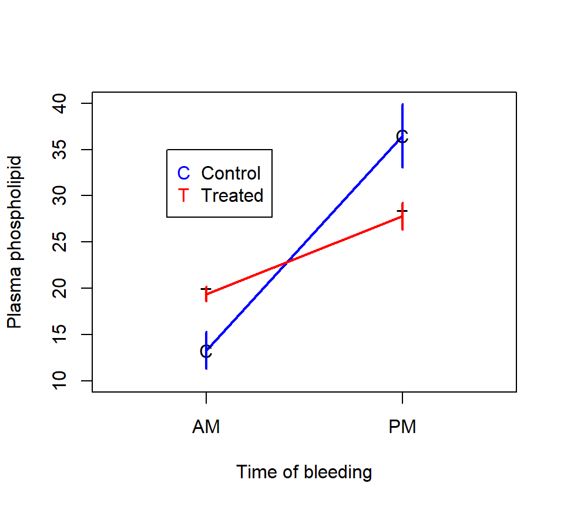
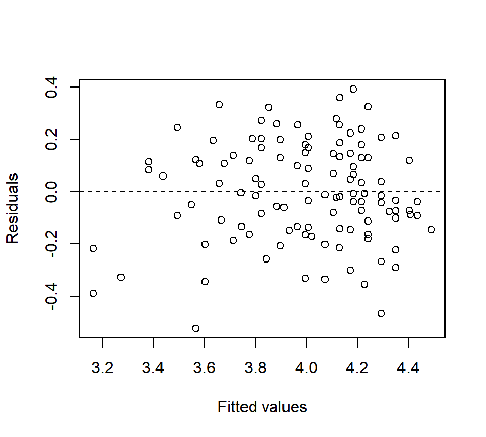

--- 
title: "ST 512 course notes"
author: "Kevin Gross"
date: "2022-12-08"
output: bookdown::gitbook
documentclass: book
bibliography: [st512.bib]
biblio-style: apalike
link-citations: yes
description: "Course notes for ST 512, Statistical Methods for Researchers II."
---


```r
knitr::opts_chunk$set(fig.width = 4, fig.height = 4, fig.align = "center") 
```

<!-- To compile, go to R Console, set working directory to the directory that contains the index file, and type

output: bookdown::gitbook

> bookdown::render_book("index.Rmd", "bookdown::gitbook")

To render a single chapter, use

> bookdown::preview_chapter("02-MultipleRegression.Rmd", "bookdown::gitbook")

See section 5.1 of Yihui Xie's bookdown book

-->

\renewcommand{\Pr}[1]{\mathrm{Pr}\!\left\{#1\right\}}
\newcommand{\vecy}{\mathbf{Y}}
\newcommand{\vecyhat}{\mathbf{\widehat{Y}}}
\newcommand{\X}{\mathbf{X}}
\newcommand{\vecx}{\mathbf{x}}
\newcommand{\vecb}{\mathbf{\beta}}
\newcommand{\vecbhat}{\hat{\mathbf{\beta}}}
\newcommand{\veceps}{\bm{\epsilon}}
\newcommand{\vece}{\mathbf{e}}
\newcommand{\Exp}[1]{\mathrm{E}\left[#1\right]}
\newcommand{\Var}[1]{\mbox{Var}\left(#1\right)}
\newcommand{\SD}[1]{\mbox{SD}\left(#1\right)}
\newcommand{\Cov}[2]{\mbox{Cov}\left(#1, #2\right)}
\newcommand{\Cor}[2]{\mbox{Cor}\left(#1, #2\right)}


# Preface {-}

The primary purpose of this document is to serve as a set of course notes for ST 512, Statistical Methods for Researchers II, taught at North Carolina State University.  ST 512 is the second semester of a traditional two-semester graduate-level sequence in statistical methods.  I eventually hope to convert these notes into an on-line text, but this is an ongoing process.  In the meanwhile, these notes are available for use by anyone associated with NCSU.

### Philosophy {-}

<!-- Why do we learn statistics?  Statistics is a tool that can make for more effective data analysis.  It is not meant merely to serve a signalling function.   -->

These notes take the following perspectives.

*Statistics is nonintuitive.*
When it comes to statistics, researchers cannot necessarily rely on their common sense to lead them towards correct answers.  Statistical reasoning is non-intuitive (@kahneman2011thinking), and the foundational ideas of statistics are elusive.  Therefore statistical literacy must be learned.  The primary goal of this course is to sharpen students' statistical literacy so that they may become more effective researchers.  

*Statistical literacy is developed by studying basic methods in depth.*
However, one does not develop a deep conceptual understanding merely by discussing concepts.  Instead, conceptual understanding is honed in part by studying the details of particular methods to understand why those details matter.  When we study the details of a method, the expectation is not that the student will remember those details in perpetuity.  Indeed, practicing scientists are unlikely anyway to remember details about statistical methods that they do not use routinely.  (This is not a knock on practicing scientists, but is instead simply a statement about the limitations of human memory.)  Instead, the point of studying statistical methods in detail is to strengthen conceptual understanding by exploring statistical methods at a reasonably deep level.  Examining details now will also make those details more recognizable if and when one faces a future data-analysis task that requires re-engaging those details.  That said, the ultimate emphasis of this course is not on the details of the methods, but is instead on the ideas, concepts, and reasoning that underlie statistical thinking.  I hope that these notes will deepen readers' conceptual understanding of statistics and by doing so strengthen their effectiveness as scientists.

*Simplicity in statistical analysis is a virtue.*
Contemporary statistical software allows anyone to fit complex statistical models.  However, just because one can fit a complex model does not mean that one should.  For a statistical analysis to have scientific value, it must be understood by both the analyst and the analyst's audience.  Unfortunately, many contemporary statistical methods produce opaque analyses that are impossible for the informed reader to understand without a substantial and unusual investment of time and energy.  (It doesn't help that, in the scientific literature, the details of contemporary analyses are buried in supplementary material that escapes the scrutiny of most reviewers, but that's another matter.)  As a result, informed and well-intentioned readers of the scientific literature have little choice but to accept the analysis at face value without understanding the genesis of the announced results.  This state of affairs does not serve science well.  

The time is nigh for the scientific community to ask whether complex but opaque statistical analyses are in the best interest of science.  For most scientific studies, a simple and transparent analysis provides a more trustworthy vehicle to understanding for both the analyst and the analyst's audience.  These notes will emphasize methods that, when studied, are transparent enough to promote such an understanding. 

### Scope and coverage {-}

These notes form the basis for an intermediate course in statistical analysis. These notes do not start from the very beginning, and they presume a basic knowledge of the fundamentals of (frequentist) statistical inference, similar to what one might see in an introductory statistics course. 

The core of the notes is the linear statistical model, which encompasses both regression and ANOVA models.   These methods can also be, and often are, used to analyze so-called "observational data", that is, data collected outside an experimental context.^[That said, regression lends itself a bit more to the analysis of observational data than ANOVA does.]  Of course, most graduate students will need to learn specialized statistical methods that are popular in their own field of study.  These notes are not meant to cover these specialized methods, and thus they are not meant to embody the whole of statistics.  However, study of regression and ANOVA provides an opportunity to master core tools and provides a springboard to the study of more specialized and possibly discipline-specific methods.

This class deals exclusively with so-called "frequentist" statistical inference.  We do not engage Bayesian methods.  This class is also firmly situated in the study of low-dimensional statistical models.  We value parsimony, and we take the view that well constructed models are worthy objects of study in their own right.  More concretely, we seek to construct statistical models with parameters that correspond to natural phenomena of interest.  This view exists in some tension with the contrasting "big data" culture of statistics, which places more emphasis on the detection of patterns and prediction of future observations, and is less concerned with unpacking the "black box" that characterizes those patterns (@breiman2001statistical). 

### Mathematical level {-}

These notes do not assume knowledge of or use any math beyond arithmetic and basic probability.  This basic probability includes an understanding of random variables, standard distributions --- primarily Gaussian (normal) distributions, but also binomial and Poisson --- and basic properties of means and variances.

Students who are willing to engage the math a bit more deeply will find that doing so provides a more satisfying path through the material and leads to a more durable understanding.  Without knowing the math underneath, one can only learn statistical methods as different recipes in a vast cookbook, a tedious task that taxes the memory and gives statistics courses their reputation for drudgery.  For those who are so inclined, learning a bit of the mathematical theory reveals how the methods we study connect with one another, and thus provides a scaffolding to organize the methods sensibly and coherently.  Moreover, the underpinning mathematics can be understood with a minimum of calculus.  Linear algebra, however, is more essential.  Indeed, the linear models that we study are, ultimately, exercises in linear algebra.  These notes assume no previous familiarity with linear algebra, and so we will not emphasize the linear algebra underpinnings of the methods.  In the fullness of time, I hope that these notes will eventually include sidebars that present the linear algebra underneath the methods, for interested readers.

In this day and age, one might ask why it's necessary to understand the math at all.  Indeed, the internet makes it easy to quickly find code for any standard analysis.^[Indeed, we are probably not too far away from the rise of artificial intelligence-based statistical consulting, where anyone can upload a data set and answer a few questions about it in return for an AI's analysis.]  In such a world, the primary task facing an analyst is not so much to get the computer to give you an answer, but instead to confirm that the answer is in fact the one you want. Towards this end, knowing a bit about the math behind the methods makes it possible to determine whether the computer output you've obtained is indeed the analysis you hoped for.  Throughout, we will try to emphasize simple, quick calculations that can be used to verify that computer output is correct, or indicate that something needs to be fixed.

### Computing {-}

The first portion of these notes (focused on regression) presents analyses in R, while the latter portion (focused on designed experiments) presents analyses in SAS.  In the fullness of time, I hope that these notes will include complete code for conducting analyses in both R and SAS, but that is a work in progress.  While the notes examine the R and SAS implementation of the methods that it presents, these notes are not intended as a complete guide for learning either R or SAS from square one.  The internet abounds with resources for learning the basics of R, and I would not be able to improve on those resources here.  ST 512 students will receive instruction in R and SAS coding in the laboratory component fo the course.

Readers interested in using R professionally would be well served by consulting Hadley Wickham's [tidyverse style guide](https://style.tidyverse.org/).  The ideas therein have helped me write substantially cleaner code, even if I've been too lazy to update all the code snippets in these notes accordingly.  I have not yet embraced the style of writing R code with pipes, but this only reflects my own habits is not the result of an informed choice.

As a practical matter, these notes are prepared in `bookdown` (@xie2022bookdown).  While it is possible to compile both R and SAS code on the fly in `bookdown`, the extensive output produced by SAS does not serve these notes well.  As a consequence, SAS output is condensed to show only the most salient portions of the output.

### Format of the notes {-}

Material that appears in <span style="color: gray;"> gray text </span> and is offset by horizontal rules (like the one following the acknowledgments) is enrichment material to provide a deeper exploration for interested readers.  This material may be skipped without loss.  This structure is inspired by @mascolell1995microeconomic's lovely text.

<!-- ### Other resources {-} -->

<!-- Want to consult a more polished resource?  (I wouldn't blame you.)   -->


### Acknowledgments {-}

I am deeply indebted to the `R` community (@r) for their project which has done no less than revolutionize data analysis in our times.  I also thank the developers of `bookdown` for providing the platform for these notes (@xie2022bookdown).

---

# Simple linear regression

In statistics, regression models are those that relate the distribution of an output variable to the value(s) of one or several input variables.  Characterizing the relationships among input and output variables is central to much of science, and regression methods form the foundation for much of data analysis.  We'll have a lot to say about regression, but we'll begin with so-called simple linear regression (SLR).  SLR models are "simple" in the sense that they contain only one predictor.  

Because these notes are meant for the intermediate analyst, I'll assume that you've seen SLR before. The purpose of our study here is twofold.  First, we'll use SLR as a familiar venue to review many of the foundational concepts of (frequentist) statistical inference.  These ideas are often elusive, so it's worth reviewing them again to solidify our understanding.  Along the way, we'll encounter some new (!) ideas for interpreting the outcomes of statistical hypothesis test that may improve upon the traditional convoluted definitions.  

Second, we'll also introduce some more advanced regression ideas such as leverage, standardized residuals, and centering the predictor.  These ideas will carry over into our study of regression models with several predictors, so it is helpful to study them here in a less complicated setting.  

---
<span style="color: gray;"> For such a fundamental technique, the name "regression" seems a bit odd. Why do we give this most central of tasks such an unexpected moniker?  The name traces back to Francis Galton's late 19th century study of the relationship between the heights of individuals and their parents' heights (@galton1886regression).  Galton observed that while the children of taller-than-average or shorter-than-average parents also tend to be taller than average or shorter than average, respectively, the children's heights tend to be closer to the average height than those of their parents.  Galton termed this phenomenon "regression to mediocrity"; today, we don't like to equate average-ness with mediocrity, so we now refer to the phenomenon as "regression to the mean".  In any case, to characterize this pattern statistically, Galton wrote down equations that would eventually develop into the statistical model that we now know as regression.  So, "regression" as a statistical term harks back to the empirical phenomenon of regression to the mean, even though statistical regression models are now used in a much broader variety of contexts.

All that said, regression to the mean doesn't just apply to people's heights; instead, it appears in all sorts of everyday contexts.  For example, it helps explains why students who do particularly well on a first exam tend not to do quite so well on a subsequent exam, or why repeating as a league champion is so rare in sports.  For more coverage, see e.g. Ch. 17 of kahneman2011thinking.</span>
---

## The basics of SLR

Simple linear regression characterizes the relationship between two variables: a predictor variable and a response variable.   We will begin with a simple example for context.

*Example*: Individuals in this study consumed a certain number of beers, and their blood alcohol content (BAC) was measured.  Data were obtained for $n=16$ individuals.  Here is a scatter plot of the data:
<div class="figure" style="text-align: center">

<p class="caption">(\#fig:unnamed-chunk-2)BAC vs. beers consumed.</p>
</div>

To begin, let's observe that the two variables that a regression model associates are not on equal footing.  One variable is designated as the "predictor" and the other variable is designated as the "response".  The predictor variable is denoted by the symbol $x$, and the response variable is denoted by $y$.  In plotting, we almost always show the predictor on the horizontal axis and the response on the vertical axis.^[This convention is so common that one often hears the horizontal axis referred to as the $x$-axis and the vertical axis referred to as the $y$-axis.  If we wanted to be exceedingly careful we should only refer to the axes in this way when the variables that they show are in fact $x$ and $y$, but few outside of mathematics find such care necessary.]  The predictor is also called the "independent" variable because, in a designed experiment, its values are determined by the investigator.  The response is also called the "dependent" variable because its distribution depends on the value of the predictor variable, in a way that is determined by nature.  For the BAC data, we will identify the number of beers consumed as the predictor and BAC as the response.

The regression model associates each value of the predictor variable with a distribution for the response variable.  Indeed, the fact that the output of the model is a distribution is what makes this a statistical model, as opposed to some other flavor of mathematical model.  A *simple linear regression*  (SLR) is a simple statistical model in which the association between the value of the predictor and the distribution of the response takes a specific form.  In particular, in a SLR, the distribution of the response variable is Gaussian (or normal) with a mean that depends linearly on the value of the predictor and a variance that is independent of the value of the predictor.  When we plot the fit of a regression model, we typically only plot the regression line.  However, the line merely shows how the average of the distribution of the response depends on the predictor.  The model has more structure than a plot of the regression line suggests.

In terms of an equation, we can write the model using the regression equation
\begin{equation}
y_i =\beta_0 +\beta_1 x_i +\varepsilon_i (\#eq:slr).
\end{equation}
In words, we might re-write the equation as
$$
\mbox{response = intercept + slope} \times \mbox{predictor + error}.
$$
In the mathematical equation above, the *i* subscript distinguishes individual data points.  For example, $y_1$ is the value of the response associated with the first observation in the data set.  Usually, we use the notation $n$ for the total number of data points, and so to be precise we might also write $i = 1, \ldots, n$.  In words, we say that "$i$ varies from 1 to $n$" or "$i$ ranges from 1 to $n$".  We'll suppress the $i$ subscript when we don't need it.  

In the SLR model, the equation $\beta_0 + \beta_1 x$ shows how the average of the response depends on the predictor value. The parameter $\beta_0$ is called the intercept, and it gives the value of the regression line when the predictor $x = 0$.  As we will see, the value of the regression line at $x=0$ often isn't a scientifically meaningful quantity, even though we need to know the value to specify the model fully.   The parameter $\beta_1$ is the slope.  In SLR, the slope is a parameter tells us by how much regression line rises or falls as the predictor changes.  Positive values of the slope indicate that the regression line increases as the predictor increases, and negative values of the slope indicate that the regression line decreases as the predictor increases.

The regression line alone is not sufficient to fully specify the entire regression model.  To the regression line we add a normally distributed error, denoted by $\varepsilon$.  The error term is a catch-all that subsumes all the other factors that might influence the response that are not included in the predictors.  In the context of the BAC example, these might include body weight, metabolism, and/or alcohol content of the beer (if it differed among subjects). 

Although they look similar, it is important to realize that $\beta_0$, $\beta_1$, and $\varepsilon$ are different beasts.  The quantities $\beta_0$ and $\beta_1$ are parameters.  Recall that in statistics, *parameters* are quantities that characterize a population.  We assume that true values of $\beta_0$ and $\beta_1$ exist; those values are just unknown to us.  We will estimate these parameters and draw inferences about their values on the basis of data.

In contrast, the error term $\varepsilon$ is a random variable.  It does not have one single value, but instead takes a different value for every member of a population.  We describe the distribution of the errors across the members of the population using a probability distribution.  In simple linear regression, we assume that the random errors have a Gaussian (or normal, or bell-shaped) distribution with mean 0 and variance $\sigma_{\varepsilon}^{2}$.  We also assume that the random errors are independent among individuals in our sample.  A succinct way of stating this is to state that the errors are Gaussian and "independent and identically distributed" (abbreviated "iid").  In notation, we write $\varepsilon_{i} \stackrel{\text{iid}}{\sim} \mathcal{N}\left(0, \sigma_{\varepsilon }^2 \right)$, a statement which we would read as "the errors have a normal (or Gaussian) distribution with mean 0 and variance $\sigma^2_\varepsilon$".  The error variance $\sigma_{\varepsilon }^2$ is a parameter, and it measure of the variability in the response that is not explained by the predictor.  We will also discuss how to estimate $\sigma_{\varepsilon }^2$.  (It is also possible to draw statistical inferences for $\sigma_{\varepsilon }^2$, although we will not discuss how to do so in ST512.)

Before moving on to discussing how to estimate the model parameters, let's reflect a bit on the slope, $\beta_1$, because this is the parameter that captures the linear association between the two variables.  I recently learned of a particularly nice way to interpret the slope, due to @gelman2020regression.  Their interpretation works like this.  Consider two values of the response $y_1$ and $y_2$, associated respectively with two values of the predictor $x_1$ and $x_2$.  The regression model says that, on average, the difference $y_1 - y_2$ will equal $\beta_1 \times (x_1 - x_2)$.  The "on average" part of this interpretation is important because we realize that any two actual observations will also include their respective errors, and so we don't expect these two observations to differ by exactly $\beta_1 \times (x_1 - x_2)$.  Second, this interpretation also makes it clear that the regression model predicts that the average difference between two responses will increase or decrease linearly as the difference between their two associated predictor values grows or shrinks.  Thus, if the SLR model is appropriate for the BAC data (something we have yet to verify), then the model suggests that the average BAC difference between two individuals who have consumed 1 vs.\ 2 beers is the same as the average BAC difference between two individuals who have consumed 4 vs.\ 5 beers, and that both of these differences are one-half as big as the average BAC difference between two individuals who have drank 2.5 vs.\ 4.5 beers.

---

<span style="color: gray;"> Our assumption of normally distributed errors has a deeper justification than may meet the eye.  If you've studied probability, you may have encountered an important result called the Central Limit Theorem.  For our purposes, the Central Limit Theorem tells us that if the error results from the combined effect of many small factors added together, then the error's distribution will be approximately normal.  (We will see that regression models are not sensitive to moderate departures from normality, so approximately normal errors are good enough.)  This result provides a strong justification for expecting normally distributed errors in many cases.  The normality assumption begins to break down when the errors are dominated by only a few factors, or when the factors that contribute to the error combine multiplicitavely.  This latter scenario --- errors that result from the product of many small influences as opposed to their sum --- frequently arises in biology when the response measures some form of population size.  Populations grow or shrink multiplicitavely, and so population sizes tend to have right-skewed distributions. </span>

<span style="color: gray;">We might also note that the style of writing the regression model as the sum of the regression line ($\beta_0 + \beta_1 x$) and an error term with mean zero ($\varepsilon$) works because we have assumed that the errors have a normal distribution.  A normal distribution has the special property that we can take a normally distributed quantity, add a constant to it, and the sum will still have a normal distribution.  Most statistical distributions do not have this property; for example, a Poisson random variate plus a non-zero constant does not yield a Poisson distributed sum.  Some authors find it more natural to write the SLR model as $y \sim \mathcal{N}(\beta_0 + \beta_1 x, \sigma^2)$, to emphasize that the response has a Gaussian distribution and that the predictor only affects the mean of this distribution.  We will use the style of eq. \@ref(eq:slr), because this style lends itself more readily to mixed-effects models with multiple variance terms.  However, the two styles of notation denote the same model.  Feel free to use whichever style makes the most sense to you.</span>

---

## Least-squares estimation 

The parameters of an SLR model are estimated by the method of least-squares.  That is, we find the values of the parameters that minimize the sum of the squared differences between the data points themselves and the line.  The estimates are denoted by "hats", i.e., $\hat{\beta}_0$ is the estimate of $\beta_0$.  Other authors use $b$'s instead of $\widehat{\beta}$'s for parameter estimates in regression.  Both types of notation commonly appear in the scientific literature.

If we were inventing SLR from scratch, we might imagine many possible criteria that we could use to determine the parameter values that provide the best fit of the SLR model.  For example, we might contemplate fitting the line that minimized the average absolute difference between the data points and the line.  The reason why we favor the least-squares criterion is a direct consequence of the assumption that the errors take a Gaussian distribution.^[More precisely, the least-squares estimates of the intercept and slope are the *maximum likelihood* estimates, when we assume that the errors take a Gaussian distribution.  Maximum likelihood is beyond the scope of ST 512.]

In ST511 or a similar course, you may have derived formulas for calculating the least-squares estimates $\hat{\beta}_0$ and $\hat{\beta}_1$  by hand.  In ST512, we will use a computer, although one might note that one could derive the formulas for $\hat{\beta}_0$ and $\hat{\beta}_1$  by using basic calculus tools to minimize the error sum-of squares. Using R, we obtain the least-squares fit of the regression model to the BAC data below.^[A note on terminology: It is conventional to refer to a regression model as a regression of the response on, versus, or against the predictor.  Thus, the BAC model could be described as a regression of BAC on the number of beers consumed, or alternatively as a regression of BAC against the number of beers consumed.]


```r
fm1 <- with(beer, lm(BAC ~ Beers))
summary(fm1)
```

```
## 
## Call:
## lm(formula = BAC ~ Beers)
## 
## Residuals:
##       Min        1Q    Median        3Q       Max 
## -0.027118 -0.017350  0.001773  0.008623  0.041027 
## 
## Coefficients:
##              Estimate Std. Error t value Pr(>|t|)    
## (Intercept) -0.012701   0.012638  -1.005    0.332    
## Beers        0.017964   0.002402   7.480 2.97e-06 ***
## ---
## Signif. codes:  0 '***' 0.001 '**' 0.01 '*' 0.05 '.' 0.1 ' ' 1
## 
## Residual standard error: 0.02044 on 14 degrees of freedom
## Multiple R-squared:  0.7998,	Adjusted R-squared:  0.7855 
## F-statistic: 55.94 on 1 and 14 DF,  p-value: 2.969e-06
```

The least-squares estimates of the intercept and slope for the BAC data are $\hat{\beta}_0 = -0.013$ and $\hat{\beta}_1 = 0.018$, respectively.  Here's a picture of the scatter-plot with the least-squares line: 


```r
with(beer, plot(BAC ~ Beers, xlab = "beers consumed"))
abline(fm1)
```

<div class="figure" style="text-align: center">

<p class="caption">(\#fig:unnamed-chunk-4)SLR fit of BAC vs. beers consumed.</p>
</div>

The best fitting line shows a positive relationship between BAC and beers consumed.  Using the interpretation that we introduced in the previous section, we would say that if we measure the BAC of two people, one of whom has consumed one more beer than the other, on average the BAC of the person who drank more beers will be 0.018 higher than the BAC of the persion who drank fewer beers.  Similarly, if we compare the BAC of two people, one of whom drank four more beers than the other, on average the BAC of the person who drank more beers will be $0.4 \times 0.018 = 0.072$ higher than the person who drank fewer beers, and so on.

Evaluating the fitted regression line for a given value of the predictor generates a *fitted value* for each data point.  Fitted values are denoted $\hat{y}_i$.  In notation, $\hat{y}_i = \hat{\beta}_0 + \hat{\beta}_1 x_i$.  

Why did the error term vanish in the equation for $\hat{y}_i$?

The *residual* for observation $i$, denoted $e_i$, is the difference between the actual observation and the fitted value.  In notation, $e_i = y_i -\hat{y}_i$.  In terms of the data plot, the residuals can be thought of as the vertical differences between the actual data points and the fitted line.  In the figure below, the vertical line represents the residual for the individual who consumed 9 beers.


*Example*: The first individual in the data set drank $x_1 = 5$ beers and had a BAC of $y_1 = 0.1$.  Find the fitted value and residual for this data point.  Answer: $\hat{y}_1 = 0.077$, $e_1 = 0.023$.

The *error sum of squares* (SSE) is
$$
SSE = \sum_{i=1}^{n} e_i^{2} = \sum_{i=1}^{n} \left(y_{i} - \hat{y}_i \right)^{2}. 
$$
The SSE is a measure of the unexplained variability in the data.  The least squares estimates, $\hat{\beta}_0$ and  $\hat{\beta}_1$, are called the least squares estimates because they minimize the SSE.  

We can use the SSE to find an estimate of the error variance parameter by using the formula
$$
\widehat{\sigma}_\varepsilon^2 = s_\varepsilon^2 = \dfrac{SSE}{n-2} = MSE
$$
We divide by $n - 2$ because there are $n - 2$ degrees of freedom (df) associated with the SSE.  When we divide an error sum-of-squares by its degrees of freedom, the resulting quotient is called the "mean-squared error" (MSE). For the BAC data, the SSE is 0.0058, yielding a MSE of $0.0058/(16-2) \approx 0.0004$.  See the gray text at the end of this section for an explanation of why the number of degrees of freedom is $n-2$.

Variances are difficult to understand because they are on a squared scale.  Thus, the units of the error variance are the units of the response, squared.  To place this estimate on a more meaningful scale, we take the square root to obtain the estimate of the residual standard deviation $s_{\varepsilon}$:
$$
s_{\varepsilon} =\sqrt{\dfrac{SSE}{n-2}} = \sqrt{MSE} 
$$
For the BAC data, $s_{\varepsilon} = \sqrt{0.0004} = 0.020$.  This is a more useful number, as it suggests that a typical deviation between an observed BAC and the corresponding fitted value is 0.020\%. (Take a look again at the magnitude of the residuals in the scatterplot of the BAC data, and convince yourself that 0.020\% is a reasonable guide to the magnitude of a typical residual.)         

---

<span style="color: gray;"> Degrees of freedom appear frequently in statistical modeling. We will spend quite a bit of effort in ST512 keeping track of degrees of freedom, so it's helpful to understand this concept well. We'll look carefully at df in the simple case of SLR to build intuition that will carry over into more complicated models.</span>

<span style="color: gray;">Most error terms, like the SLR error variance $\sigma_\varepsilon^2$, are estimated by sums of squares.  The concept of degrees of freedom quantifies how many `free differences' are available to compute a sum of squares.</span>

<span style="color: gray;">Consider the following thought experiment.  Suppose that, bizarrely, we knew the values of the parameters $\beta_0$ and $\beta_1$ in an SLR, and only needed to estimate the error variance $\sigma_\varepsilon^2$.  We could do so using the sum of squares $\sum_{i=1}^{n}\left(y_{i} -\left[\beta_0 +\beta_1 x_i \right]\right)^2$.  In this case, each of our $n$ data points would contribute a `free difference' to the summation above, and so there would be $n$ free differences with which we could estimate the error variance $\sigma_\varepsilon^2$.</span>

<span style="color: gray;">However, we never know the values of $\beta_0$ and $\beta_1$ in advance.  Instead, we have to use the data to estimate both $\beta_0$ and $\beta_1$.  Now, because we have to estimate both $\beta_0$ and $\beta_1$, there are only $n - 2$ free differences in the sum of squares $\sum_{i=1}^{n}\left(y_{i} -\left[\hat{\beta}_0 +\hat{\beta}_1 x_i \right]\right)^{2}$.  One way to visualize this is to imagine fitting a line to a data set  with only $n = 2$ data points (with different $x$ values).  The line would be guaranteed to pass through both points, and consequently both residuals would equal 0. Because both residuals equal 0, the SSE would also equal 0.  However, the SSE doesn't equal 0 because the actual value of  $\sigma_\varepsilon^2$ equals 0.  Instead, the SSE equals 0 because there is no information remaining to estimate the residual variance.</span>

<span style="color: gray;">In general, when we have to use the same data set to estimate the parameters of the signal component \textit{and} to estimate a variance parameter, then each parameter that we have to estimate in the mean component eliminates a free difference from the sum of squares $\sum_{i=1}^{n}\left(y_{i} -\hat{y}_{i} \right)^{2}$.  To convert the sum of squares into an estimate of an error variance, we need to count the number of free differences (or degrees of freedom) correctly, and divide the sum of squares by the appropriate number of df to make sure we get a valid variance estimate. </span>

---

<!-- Some additional notation: In general, we'll use the notation $\mu \left(x\right)$ to denote the signal or mean component of the model.  In simple linear regression, the mean is simply a linear function of the predictor: $\mu \left(x\right) = \beta_0 +\beta_1 x$.  Although the notation $\mu \left(x\right)$ might seem like overkill for SLR, it will prove handy for more complicated models. -->

## Inference for the slope 

To draw statistical inferences about the slope parameter $\beta_1$, we make the following assumptions:

1. Linearity:  The population mean $\mu \left(x\right)$ is a linear function of $x$.

2. Equal variance ("homoscedasticity"):  The variance of the error terms (the $\varepsilon_i$'s) is the same for all observations.

3. Independence:  The error terms are independent of one another.

4.  Normality.  The errors have a normal (i.e., bell-shaped, or Gaussian) distribution.

<!-- 5. The predictors are measured without error. -->

<!-- This fifth assumption is usually not listed as one of the assumptions in SLR, but it is useful to keep in mind.  The predictor and the response are *not* placed on equal footing.  -->

Note that assumption number 1 deals with the mean component of the model, while assumptions 2--4 deal with the error component of the model.

### Standard errors

As intelligent scientists, we realize that estimates are not exactly equal to the parameters that they seek to estimate.  We can characterize the uncertainty in parameter estimates in different ways.  One tool that we have for quantifying uncertainty in parameter estimates is to calculate a standard error.  In general, a *standard error* quantifies the variability in an estimate that is attributable to random sampling.  Most parameter estimates that we will encounter have known formulas for their standard errors.  In most cases, these formulas are complicated, and we will rely on computers to calculate standard errors for us.  However, the formula for the standard error of the slope parameter in SLR is interesting to examine because it contains a valuable insight that we can use when collecting data for a regression study.  The standard error of $\hat{\beta}_1$, denoted $s_{\hat{\beta}_1}$, is given by the formula
$$
s_{\hat{\beta}_1} = \dfrac{s_{\varepsilon}}{\sqrt{S_{xx} } } 
$$ 
where $S_{xx} =\sum_{i}\left(x_{i} -\bar{x}\right)^2$ quantifies the dispersion in the predictor variables.  

Although this formula looks a bit daunting, there's some intuition to be gained here, and a lesson for experimental design.  Suppose we had designed a regression experiment in which all of the individuals were assigned similar values of the predictor.  In this case, $S_{xx}$ would be small, and consequently the standard error $s_{\hat{\beta}_1}$ would be large.  Conversely, if the values of the predictor were very different among individuals in the study, then $S_{xx}$ would be large and the standard error $s_{\hat{\beta}_1}$ would be small.  Thus, if we want a precise estimate of the slope, we should choose predictor values that span the range over which we want to learn.

Thought question: Following this line of reasoning, is it a good idea to design a study so that half the individuals are assigned a very large value of the predictor, and the other half are assigned a very small value?  Why or why not?

For the BAC example, $s_{\hat{\beta}_1} = 0.0024$.

### Confidence intervals

A second way in which we can measure the uncertainty in a parameter estimate is to calculate a confidence interval (CI).  Recall that the general formula for a confidence interval associated with a statistic is:
$$
\mathrm{estimate} \pm  \mathrm{critical\ value} \times \mathrm{standard\ error}
$$
Critical values are found either by consulting a table (and re-living the good old days) or using the internet or a computer program.  Critical values depend on the {\em confidence level} that you want to associate with the CI.  Although it seems a bit backwards, we typically denote the confidence level of a CI as $100 \times \left(1-\alpha \right)\%$.  Thus, for a 95\% confidence interval (a common choice), $\alpha = 0.05$.  Alternatively, we might seek a 99\% CI, in which case $\alpha = 0.01$.  

To construct a CI for $\beta_1$ , we find the appropriate critical values from a $t$-distribution with $n - 2$ df.  For a $100\times \left(1-\alpha \right)\%$ CI, the critical value is the value that ``cuts-off'' an upper tail of $\alpha / 2$ \%.  For example,  to calculate a 99\% CI for $\beta_{1}$, we need to find the critical value of a $t$-distribution with 14 df that cuts-off an upper 0.5\%-tail.  Using an online calculator, or another tool, we find that this critical value is 2.977.  Thus, a 99\% CI is 0.018 $\pm$ 2.977 $\times$ 0.0024 =  (0.011, 0.025).

Recall that the appropriate interpretation of the confidence level a CI is fairly tricky.  A proper interpretation is that, if we were to repeat this experiment a large number of times, and calculate a 99\% CI for each experiment, in the long run 99\% of those CIs would contain the true value of $\beta_1$.  Of course, in real life, we'll only do the experiment once, and we don't know if our experiment is one of the 99\% in which the CI contains the true parameter value or not.  It is often tempting to abbreviate this interpretation by saying that ``there is a 99\% chance that $\beta_1$ is in the CI'', although technically this interpretation is incorrect (because any single CI either contains the parameter or it doesn't).  

Note also that there is a trade-off between the confidence level and the width of the interval.  If we wanted greater confidence that our interval contained the true parameter value, we could increase the confidence level.  However, increasing the confidence level increases the width of the interval, and thus provides less information about the true parameter value in some sense.  If we follow this argument to its (il)logical extreme, a 100\% CI for $\beta_1$ covers the interval from negative infinity to positive infinity.  Now we are fully confident that our interval contains $\beta_1$, but at the cost of having no information whatsoever about the actual value of $\beta_1$.

### Statistical hypothesis tests

Finally, a third way to characterize the statistical uncertainty in $\hat{\beta}_1 $ is to conduct a statistical hypothesis test.  Recall that statistical hypotheses are statements about the values of unknown parameters, and a statistical hypothesis test is a way to measure the strength of evidence against a `null hypothesis'.  In the context of SLR, we are almost always interested in testing the null hypothesis that the true value of the slope parameter is equal to zero.  In notation, we write this as $H_0: \beta_1 = 0$.  Evidence against this null hypothesis is taken as evidence that the predictor is linearly related to the response.  

Recall that in statistical hypothesis testing, we must also specify an alternative hypothesis.  In SLR, we are almost always interested in testing $H_0: \beta_1 = 0$ vs. the two-sided alternative $H_a: \beta_1 \ne 0$.  We conduct a statistical hypothesis test by first calculating a test statistic.  In general, formulas for test statistics take the form:
$$
\mbox{test statistic} = \dfrac{\mbox{parameter estimate} - \mbox{value of parameter under }H_0} {\mbox{standard error}}
$$
 
Test statistics have the property that if the null hypothesis is true, then the test statistic has a known sampling distribution.  In the case of testing $H_0: \beta_1 = 0$ vs.\ $H_a: \beta_1 \ne 0$ in SLR, if the null hypothesis is true, then the test statistic will have a $t$-distribution with $n-2$ df.  In notation, the test statistic is 
$$
t=\frac{\widehat{\beta}_{1} -0}{s_{\widehat{\beta }_{1} } } =\frac{\widehat{\beta }_{1} }{s_{\widehat{\beta }_{1} } } 
$$ 
In SLR, this test is so common that the value of the $t$-statistic is provided automatically by most statistical software packages, including R.   For the BAC data, the $t$-statistic associated with the test of $H_0: \beta_1 = 0$ vs.\ $H_a: \beta_1 \ne 0$ is $t = 7.48$.

Values of the test statistic by themselves are not terribly enlightening.  Instead, we use the test statistic to find a $p$-value.  $P$-values are famously difficult to interpret, and those difficulties in interpretation have impeded their proper use.  In 2016, a blue-ribbon panel of experts were convened by the American Statistical Association (the leading professional organization for statisticians in the US) to take the remarkable step of issuing a policy statement regarding the use of $p$-values.  That statement (Wasserstein \& Lazar, 2016, \textit{American Statistician} 70:129-133) defines a $p$-value as follows:  ``Informally, a $p$-value is the probability under a specified statistical model that a statistical summary of the data (e.g., the sample mean difference between two compared groups) would be equal to or more extreme than its observed value.''
(Bear in mind that this definition is the work of two dozen of the world's leading statisticians.)  
 
In the context of the test of $H_0: \beta_1 = 0$ vs.\ $H_a: \beta_1 \ne 0$  in SLR, this means finding the probability that  a $t$-statistic with $n-2$ df is at least as different from zero as the value observed.  For a two-sided alternative hypothesis, we say ``different from zero'' because the sign (positive vs. negative) of the $t$-statistic is irrelevant.  Be careful, though: for a one-sided alternative hypothesis, the sign of the observed $t$-statistic is critical!  
 
For the BAC data, we find the area under the tail of a $t$-distribution with 14 df that is greater than 7.48, and then (because the $t$-distribution is symmetric) multiply by 2.  That is, 
\begin{align*}
p & = \Pr{ t_{14} < -7.48} +\Pr{ t_{14} > 7.48}  \\ 
  & = 2 \times \Pr{ t_{14} >7.48  } \\
  & = 3\times 10^{-6}  
\end{align*}
Thus, there is exceedingly strong evidence that BAC is related to the number of beers consumed.

The values above could be found by consulting a table, or by using statistical software such as R.  Because the test of $H_0: \beta_1 = 0$ vs.\ $H_a: \beta_1 \ne 0$ is sufficiently common in SLR, most computer packages will do this calculation for us.  
  
We'll sweep a lot of acrimonious debate about statistical hypothesis testing under the rug and simply say that some scientists like to make a decision about whether or not to "reject" the null hypothesis.  Although R.A. Fisher (a founding father of statistics) would roll over in his grave if he heard us saying this, most scientists make these "reject" or "do not reject" decisions by comparing the $p$-value to the test's {\em significance level}, which is usually denoted by the Greek letter $\alpha$.  The significance level of a test is the frequency with which one would erroneously reject a true null hypothesis; you might also think of it as the allowable false-positive rate.  Consequently, tests with smaller significance levels require more evidence against the null to reject it (this sounds backwards at first, but makes sense when you think about it).  Most scientists conventionally make reject / do not reject decisions with a significance level of $\alpha = .05$, but you are free to use whatever significance level you deem appropriate.  If $p \le \alpha$, we reject the null hypothesis; otherwise, we fail to reject it.  (Remember that we never `accept' the null hypothesis.  We only fail to reject it.)

Although it is rare, we can also entertain so-called 'one-sided' alternative hypotheses. For example, suppose that we were uninterested in the (somewhat nonsensical) possibility that the numbers of beers consumed decreased BAC, and only were interested in measuring the evidence that the numbers of beers consumed increases BAC.  To do so, we might test the same null hypothesis $H_0: \beta_1 = 0$ vs. the one-sided alternative $H_a: \beta_1 > 0$.  To conduct this test, the test statistic is still
$$
t=\dfrac{\widehat{\beta }_{1} -0}{s_{\widehat{\beta }_{1} } } =\dfrac{0.0180}{0.0024} =7.48.
$$ 
However, because the alternative hypothesis is one-sided, to calculate a $p$-value, we interpret ``equal to or more extreme than its observed value" as the probability of observing a test statistic \textit{greater} than 7.48, i.e., 
$$
p=\Pr{ t_{14} >7.48} =1.5\times 10^{-6} 
$$ 
We would then reject $H_0: \beta_1 = 0$ in favor of the one-sided alternative $H_a: \beta_1 > 0$ at the $\alpha = .05$ significance level.  
 
Finally, although it doesn't make much sense in terms of what we know about alcohol, we could consider testing $H_0: \beta_1 = 0$ vs. the one-sided alternative $H_a: \beta_1 < 0$.  Again, the test statistic is the same ($t$ = 7.48), but now evidence against the null and in favor of the alternative is provided by negative values of the test statistic, so the p-value is the probability of observing a test statistic \textit{less} than 7.48, i.e.,  
$$
p=\Pr{ t_{14} < 7.48} = 1 - \Pr{ t_{14} > 7.48} \approx 0.9999.
$$
Thus, there is no evidence that would allow us to reject $H_0: \beta_1 = 0$ in favor of the one-sided alternative $H_a: \beta_1 < 0$.

One final note: Although it is rarely done, there is no reason why we must restrict ourselves to testing  $H_0: \beta_1 = 0$.  We could in fact test any null hypothesis.  For example, suppose conventional wisdom held that each additional beer consumed increased BAC by 0.02, and we were interested in asking if these data contain evidence that the conventional wisdom is false.  Then we could test  $H_0: \beta_1 = 0.02$ vs.\ $H_a: \beta_1 \ne 0.02$, although we have to calculate the test statistic and $p$-value manually instead of relying on computer output:
\begin{align*}
t & = \dfrac{\hat{\beta}_1 -0.02}{s_{\hat{\beta}_1 }} \\
& = \dfrac{0.0180-0.02}{0.0024} \\
& =-0.83 \\ \\
p & =  \Pr{t_{14} <-0.83} +\Pr{t_{14} >0.83} \\
& = 2 \times \Pr{ t_{14} >0.83}\\
& =  0.421. 
\end{align*}
Thus, these data contain no evidence that would allow us to reject  $H_0: \beta_1 = 0.02$ vs.\ $H_a: \beta_1 \ne 0.02$ at any reasonable significance level.  

Confusion alert: Do be mindful of the distinction between a statistical hypothesis and a scientific hypothesis.  The following excerpt from an article by B. Dennis and M.L. Taper puts it nicely: ``A statistical hypothesis is an assumption about the form of a probability model, and a statistical hypothesis test is the use of data to make a decision between two probability models.  A scientific hypothesis, on the other hand, is an explanatory assertion about some aspect of nature.'' (@dennis1994density).  Thus, while a statistical hypothesis can often embody a scientific hypothesis, a scientific hypothesis does not always boil down to a statistical hypothesis.

### Inference for the intercept

Most statistical packages automatically provide the standard errors for the intercept, $s_{\hat{\beta}_0}$, as well as a test of $H_0: \beta_0 = 0$ vs.\ $H_a: \beta_0 \ne 0$.  Sometimes this is a meaningful test, but usually it isn't.  The scientific context of the problem will determine whether or not it makes sense to pay attention to this test. 

There is a special type of regression called ``regression through the origin'' that is appropriate when we can assume $\beta_0 = 0$ automatically.  Should we use regression through the origin for the BAC example?

## Sums of squares decomposition and $R^2$

We have already seen that the SSE measures the unexplained variability in the response.  
$$
{\rm SSE}=\sum _{i=1}^{n}e_{i}^{2} = \sum _{i=1}^{n}\left(y_{i} -\hat{y}_{i} \right)^{2}  
$$
We can also define the *total sum of squares*, SS(Total):
$$
{\rm SS(Total)}=\sum _{i=1}^{n}\left(y_{i} -\bar{y}\right)^{2} 
 $$ 
SS(Total) is a measure of the total variability in the response.  Finally, we can define the *regression sum of squares*, SS(Regression), as
$$
{\rm SS(Regression)}=\sum _{i=1}^{n}\left(\hat{y}_{i} -\bar{y}\right)^{2}  
$$ 
SS(Regression) measures the variability in the response that is explained by the regression.  The regression sum of squares is also called the model sum of squares, or SS(Model).

By a small miracle (actually, by the Pythagorean Theorem), it happens to be true that:
$$
{\rm SS(Total)=SS(Regression)+SSE}
$$ 
The {\em coefficient of determination}, or $R^2$, is the proportion of the variability in the response explained by the regression model.  The formula for $R^2$ is
$$
R^2 = \dfrac{{\rm SS(Regression)}}{{\rm SS(Total)}} = 1-\frac{{\rm SSE}}{{\rm SS(Total)}} .
$$ 
$R^2$ is a nice metric because it quantifies how much of the variability in the response is explained by the predictor.  Values of  $R^2$ close to 1 indicate that the regression model explains much of the variability in the response, while values of $R^2$ close to 0 suggest the regression model explains little of the variability in the response.  We'll also see that $R^2$ is not limited to SLR and in fact has the same interpretation for more complicated regression models that we will examine later.  For the BAC example, $R^2$ = 0.80, suggesting that variation in beers consumed explains roughly 80\% of the variation in BAC.

Mathematically, $R^2$ can also be computed as square of the sample correlation coefficient between the fitted values and the response.  In SLR, the fitted values and the predictor are perfectly correlated with one another, so $R^2$ is also the square of the sample correlation coefficient between the predictor and the response.

## Fitting the SLR model in R

In this section of ST512, we'll learn a little about both R and SAS.  We'll be using R for the regression component of the course. 

The basic command in R for fitting a regression model is the function `lm`, short for [l]inear [l]odel.  (As the name suggests, the `lm' function can be used for more than just SLR.)  The basic syntax is 
````
> lm(response ~ predictor)
````
where "response" and "predictor" would be replaced by the appropriate variable names.  The ``>`` is the R prompt, and is meant to show what you could type at the command line.  Although the above command would work, it would fit the SLR and then forget the model fit.  We want to keep the model fit around to analyze it, so we'll store it in memory under a name of our choosing.  Here, we'll choose the name ``fm1``, although any name would work.  Anything proceeded by a pound sign (\#) is a comment in R.  We'll assume that the BAC data have already been read into R and reside in memory, and that the variables in the BAC data are named ``BAC`` and ``Beers``.  Here is code for fitting a SLR model to these data:

```r
fm1 <- lm(BAC ~ Beers, data = beer)

# The '<-' is the assignment operator.
# Here, the output produced by the call to 'lm' is stored in memory under
# the name 'fm1'.  We can learn about 'fm1' by asking for a summary.

summary(fm1)
```

```
## 
## Call:
## lm(formula = BAC ~ Beers, data = beer)
## 
## Residuals:
##       Min        1Q    Median        3Q       Max 
## -0.027118 -0.017350  0.001773  0.008623  0.041027 
## 
## Coefficients:
##              Estimate Std. Error t value Pr(>|t|)    
## (Intercept) -0.012701   0.012638  -1.005    0.332    
## Beers        0.017964   0.002402   7.480 2.97e-06 ***
## ---
## Signif. codes:  0 '***' 0.001 '**' 0.01 '*' 0.05 '.' 0.1 ' ' 1
## 
## Residual standard error: 0.02044 on 14 degrees of freedom
## Multiple R-squared:  0.7998,	Adjusted R-squared:  0.7855 
## F-statistic: 55.94 on 1 and 14 DF,  p-value: 2.969e-06
```

Let's examine each portion of the R output above.

The portion labeled ``Call`` simply tells us what command was used to generate the model.

The portion labeled ``Residuals`` tells us a five-number summary (minimum, first quartile, median, third quartile, and maximum) of the residuals.

The portion labeled ``Coefficients`` gives us a table of parameter estimates and standard errors.  Each row of the table corresponds to a single parameter.  The row labeled (Intercept) obviously corresponds to the intercept.  The row labeled with the name of the predictor gives information about the slope parameter.

In addition to parameter estimates and standard errors, R (like many computer packages) also automatically generates hypothesis tests of $H_0: \beta_0 = 0$ vs.\ $H_a: \beta_0 \ne 0$ and $H_0: \beta_1 = 0$ vs.\ $H_a: \beta_1 \ne 0$.  It is up to you, the user, to determine whether or not these tests are informative.
 
Finally, the last block of output provides a variety of additional information.  The "residual standard error" (perhaps not the best terminology) is the estimate of the residual standard deviation,  $s_{\varepsilon}$.   R also provides two different $R^2$ values; the $R^2$ that we discussed above is labeled as the "Multiple R-squared".   We will discuss adjusted R-squared later.  Finally, the $F$-statistic corresponds to a `model utility test', which we will discuss in the context of multiple regression.  For now, you might notice that in SLR the p-value of the model-utility test is always equal to the p-value for the test of $H_0: \beta_1 = 0$ vs.\ $H_a: \beta_1 \ne 0$.  We will explain why this is so later.

The SS decomposition for a regression model is also referred to as the analysis of variance for the regression model.  We can use the `anova' command in R to obtain the SS decomposition:

```r
anova(fm1)
```

```
## Analysis of Variance Table
## 
## Response: BAC
##           Df    Sum Sq   Mean Sq F value    Pr(>F)    
## Beers      1 0.0233753 0.0233753  55.944 2.969e-06 ***
## Residuals 14 0.0058497 0.0004178                      
## ---
## Signif. codes:  0 '***' 0.001 '**' 0.01 '*' 0.05 '.' 0.1 ' ' 1
```
The $F$-statistic is the model utility test, which we will examine in more detail when we study multiple regression.

## Diagnostic plots

We have seen that, in order to draw statistical inferences from a simple linear regression, we need to make several assumptions.  Although in everyday life assumptions can get a bad name, assumptions in statistics are necessary and appropriate.  The statistician Don Rubin puts it nicely: ``Nothing is wrong with making assumptions ... they are the strands that link statistics to science.  It is the scientific quality of the assumptions, not their existence, that is critical.'' (@rubin2005causal).   In regression, we can use *diagnostic plots* to investigate the scientific quality of our assumptions.  The main idea of diagnostic plots is that if the assumptions are appropriate, then residuals should be independent draws from a normal distribution with constant variance.  Any structure in the residuals indicates a violation of at least one assumption.
 
We list commonly used diagnostic plots below.  Although some types of plots are more useful for examining some assumptions than others, there isn't a strict correspondence between plot types and assumptions.  Any plot can reveal a departure from any one of our assumptions.  Examples of each for the BAC data and the R code used to generate the plots are provided as examples.
 
1.Residuals vs. fitted values.  Check for non-constant variance (trumpeting).  The BAC data shown here don't show an obvious increase or decrease in variance as the fitted values increase, although the fact that the largest residual is associated with the largest fitted value is notable.  We might want to go back and check that data point out.

```r
plot(resid(fm1) ~ fitted(fm1), xlab = "Fitted Values", ylab = "Residuals")
abline(h = 0, lty = "dotted")
```


2. Residuals vs. predictor.  We can use this plot to check for non-linear trends.  If we see a non-linear trend, like a hump-shaped pattern, it might suggest that the true relationship between predictor and response is actually non-linear.

For the BAC data, you'll note that the plot below looks exactly like the plot of residuals vs. fitted values above.  This isn't just coincidence; in fact, residuals vs. fitted values and residuals vs. predictor will always generate exactly the same patterns in SLR.  (The reason is because in SLR the fitted value is just a linear function of the predictor.)  We want to get in the habit of checking both types of plots, however, because when we start entertaining multiple predictor variables in multiple regression, the plots will no longer be identical. 

```r
plot(resid(fm1) ~ beer$Beers, xlab = "Beers", ylab = "Residuals")
abline(h = 0, lty = "dotted")
```


3. Residuals vs. variables not in the model, e.g., other predictors, observer, order of observation.  In the BAC data, the only other variable we have (for now at least) is the order in which the observations appear in the data set. Without knowing how the data were collected or recorded, it's impossible to say whether this variable is meaningful. However, the plot suggests a distinctive downward trend -- data points that appear early in the data set are associated with positive residuals, and data points that appear later in the data set are associated with negative residuals.  What do you think might have caused this trend?

```r
plot(resid(fm1), xlab = "Order", ylab = "Residuals")
abline(h = 0, lty = "dotted")
```


4. An obvious way to check the normality assumption is to plot a histogram of the residuals.  While this is a straightforward idea, it suffers from the fact that the shape of the histogram depends strongly on how the residuals are grouped into bins.  Note how the two histograms below of the BAC residuals provide different impressions about the suitability of the normality assumption.

```r
hist(resid(fm1), main = "Bin width = 0.01", xlab = "Residuals")
```


```r
hist(resid(fm1), main = "Bin width = 0.02", xlab = "Residuals", breaks = 4)
```


An alternative to histograms is a normal probability plot of residuals, also known as a quantile-quantile, or Q-Q, plot.  Q-Q plots calculate the empirical quantile of each residual, and compare this to the theoretical quantile from a normal distribution.  If the normality assumption is appropriate, the empirical and theoretical quantiles will change at the same rate, so when plotted against one another, they'll fall on a line.  If the normality assumption is not appropriate, the plot of empirical vs. theoretical quantiles will bend.
 
As we'll see below, the normality assumption is the \textit{least} critical of the assumptions in regression.  Thus, unless the Q-Q plot shows big and dramatic bends, we won't concern ourselves with small bumps and wiggles.  The Q-Q plot for the BAC data below doesn't seem terribly problematic.

```r
qqnorm(resid(fm1))
qqline(resid(fm1))
```


## Consequences of violating model assumptions, and possible fixes

1. Linearity 
	
When the linearity assumption is violated, the model has little worth.  What's the point of fitting a linear model to data when the relationship between predictor and response is clearly not linear?
	
The best fix is to fit a non-linear model using non-linear regression.  (We will discuss non-linear regression later.)  A second-best option is to transform the predictor and / or the response to make the relationship linear.  
	
2. Independence
	
Inference about regression parameters using naive standard errors is not trustworthy when errors are correlated (there is more uncertainty in the estimates than the naive standard errors suggest).
	
The most common source of non-independence is either temporal or spatial structure in the data.  Arguably, we have seen this with the BAC data, where one way to think about the downward trend of residuals vs.\ the order of observation is that residuals close together in time tend to be positively correlated.  The best, and easiest, way to accommodate this type of dependence is to include (an)other predictor(s) in the model for time or space.   A second-best solution is to use specific methods for time-series data or spatial data, which doable, but is fairly involved, and will require considerable additional study.
	
3. Constant variance
	
Like violations of the independence assumption, violations of the constant-variance assumption cause inference about regression parameters is not trustworthy.  Non-constant variance causes there to be more uncertainty in the parameters estimates than the default CIs or $t$-tests suggest.
	
There are two possible fixes for non-constant variance.  If the non-constant variance arises because the response variable has a known, non-normal distribution, then one can use generalized linear models (such as logistic regression for binary data, or Poisson regression for count data).  We will touch on generalized linear models briefly at the end of ST 512.  Alternatively, if there is no obvious alternative distribution for the response, the usual approach is to transform the response variable to "stabilize" the variance.  
	 
For better or worse, there used to be a bit of a cottage industry in statistics in developing variance-stabilizing transformations.  Remember that transformations come with a cost of diminished interpretability, and be wary of exotic transformations.  It is not uncommon to observe data where the variance increases as the mean response increases.  Good transformations for this situation are either a log transformation or a square-root transformation.^[Note that a log transformation will not work if the data contain response values equal to 0.  The usual approach in this case is either to take the $\ln(y + 1)$, or to take $\ln(y + c)$, where $c$ is one-half of the smallest non-zero response value in the data set.  Note also that the base of the logarithm doesn't matter when taking a log transformation.  Natural log is the most common choice, but one can also use $\log_2$ or $\log_{10}$.]  Another common non-constant variance problem arises when the response is a percentage or a proportion.  In this case, the standard and appropriate transformation is the arcsin-square root transformation, i.e., if the observed response is 10\%, the transformed response is $\sin^{-1}(\sqrt{.1})=0.322$.
	
4. Normality
	
Perhaps surprisingly, the consequences of violating the normality assuption are minimal, unless departures from normality are severe (e.g., binary data).  When one encounters decidedly non-normal data, the usual remedy is to entertain a so-called generalized linear models, i.e., logistic regression for binary data; Poisson regression for count data.	

*Example*: Box office take (in millions of US\$) vs. a composite rating score from critics' reviews:

```r
movie <- read.table("data/movie.txt", head = T, stringsAsFactors = T)

with(movie, plot(BoxOffice ~ Score, xlab = "Average rating", ylab = "Box office take"))
fm1 <- lm(BoxOffice ~ Score, data = movie)
abline(fm1)
```


The plots of residuals vs. fitted value show clear evidence of non-constant variance.  The Q-Q plot indicates right-skew.  Taking a square-root transformation of the response stabilizes the variance nicely:

```r
plot(resid(fm1) ~ fitted(fm1), xlab = "Fitted value", ylab = "Residual")
abline(h = 0,lty = "dashed")
```


```r
qqnorm(resid(fm1),main = "QQ plot, movie data")
qqline(resid(fm1))
```


Let's try a square-root transformation of the response:

```r
fm2 <- lm(sqrt(BoxOffice) ~ Score, data = movie)
summary(fm2)
```

```
## 
## Call:
## lm(formula = sqrt(BoxOffice) ~ Score, data = movie)
## 
## Residuals:
##      Min       1Q   Median       3Q      Max 
## -0.60533 -0.17889 -0.07339  0.17983  0.92065 
## 
## Coefficients:
##             Estimate Std. Error t value Pr(>|t|)    
## (Intercept) 0.114102   0.106000   1.076    0.284    
## Score       0.010497   0.001834   5.722 6.27e-08 ***
## ---
## Signif. codes:  0 '***' 0.001 '**' 0.01 '*' 0.05 '.' 0.1 ' ' 1
## 
## Residual standard error: 0.3109 on 138 degrees of freedom
## Multiple R-squared:  0.1918,	Adjusted R-squared:  0.1859 
## F-statistic: 32.74 on 1 and 138 DF,  p-value: 6.272e-08
```

```r
plot(fm2)
```


Another commonly used transformation for right-skewed data is the log transformation.  Here are residual plots and model output for log-transformed data:

```r
fm3 <- lm(log(BoxOffice) ~ Score, data = movie)
summary(fm3)
```

```
## 
## Call:
## lm(formula = log(BoxOffice) ~ Score, data = movie)
## 
## Residuals:
##      Min       1Q   Median       3Q      Max 
## -2.99268 -0.43135  0.00783  0.67263  1.81413 
## 
## Coefficients:
##              Estimate Std. Error t value Pr(>|t|)    
## (Intercept) -2.634451   0.323390  -8.146 2.01e-13 ***
## Score        0.029984   0.005596   5.358 3.44e-07 ***
## ---
## Signif. codes:  0 '***' 0.001 '**' 0.01 '*' 0.05 '.' 0.1 ' ' 1
## 
## Residual standard error: 0.9484 on 138 degrees of freedom
## Multiple R-squared:  0.1722,	Adjusted R-squared:  0.1662 
## F-statistic: 28.71 on 1 and 138 DF,  p-value: 3.438e-07
```

```r
plot(fm3)
```


Which transformation do you think is more appropriate?  Do the different transformations lead to different qualitative conclusions regarding the statistical significance of the relationship between reviewer rating and box office take?

*Example 2*: Highway fuel efficiency (in mpg) vs. vehicle weight for 1999 model cars:


```r
cars <- read.table("data/cars.txt", head = T)

with(cars, plot(mpghw ~ weight, xlab = "Vehicle weight (lbs)", ylab = "Highway mpg"))
fm1 <- lm(mpghw ~ weight, data = cars)
abline(fm1)
```


```r
plot(resid(fm1) ~ fitted(fm1), xlab = "Fitted value", ylab = "Residual")
abline(h = 0,lty = "dashed")
```


The relationship between highway mpg and vehicle weight is clearly non-linear, although that is seen most clearly from the plot of residuals vs. fitted values.  We will discuss modeling non-linear relationships later.

Here are some additional comments:

1.  What about outliers?  The famous statistician George Box was fond of saying that outliers can be the most informative points in the data set.  If you have an outlier, try to figure out why that point is an outlier.  Discard outliers only if a good reason exists for doing so -- resist the temptation to ``scrub'' your data.  Doing so is tantamount to cheating.  If you absolutely must remove an outlier, at least report the model fits both with and without the outliers included.

2. Be particularly wary of data points associated with extreme $x$-values.  These points can be unduly influential.  (See discussion in the multiple-regression installment of the notes on leverage, standardized residuals, and Cook's distance.) 

3.  What about transforming the $x$-variable?  Remember that there are no assumptions about the distribution of the $x$-variable.  However, transformations of the $x$-variable can also make non-linear relationships into linear ones.  Remember though that transformations tend to lessen interpretability.

4. Don't extrapolate the regression line beyond the range of the $x$-variable observed in the data.  Remember that statistical models are only valid to the extent that data exist to support them.

5. Although it's often overlooked, remember that the standard regression model also assumes that the predictor is measured without error.  If there's error in the predictor as well as the response, then the estimated slope will be biased towards 0.  If the error in the predictor is comparable to the error in the response, then consider a regression model that allows for variability in the predictor.  These models go by multiple names, but they are most often called ``Model II regression''.

<!-- {\em Example of an outlier with large influence on the regression relationship} -->

<!-- The data below are from a 1981 British government survey relating household spending on tobacco products to household spending on alcoholic beverages, both in pounds per week.  One data point is shown for each of the 11 regions of the UK.  -->
<!-- \begin{center} -->
<!-- 	\includegraphics*[height=2.5in]{figures/sin} -->
<!-- \end{center}  -->

<!-- Clearly, there is one data point that does not fit the pattern, and has considerably less spending on alcohol.  Inspection of the data shows that this data point corresponds to Northern Ireland, while all other data points are from the island of Great Britain.  Eliminating the data point that corresponds to Northern Ireland from the regression model gives the linear fit shown with the dashed line.   -->

## Prediction with regression models

Consider a new value of the predictor $x^\star$.  There are two different types of predictions we could make:

1. What is the average response of the population at $x^\star$?

2. What is the value of a single future observation at $x^\star$?

Point estimates (i.e., single best guesses) are the same for both predictions.  They are found by simply plugging $x^\star$ into the fitted regression equation.

*Example*.  Suppose every grad student at NCSU drinks 2.5 beers.  What do we predict the average BAC of this population to be?
\begin{align*}
	\hat{y}^\star & =  \widehat{\beta }_{0} +\widehat{\beta }_{1} x^\star  \\ 
	& =  -0.013 + 0.018 \times 2.5\\
	& =  0.032
\end{align*}

Suppose Danny drinks 2.5 beers.  What do we predict Danny's BAC to be?
$$
\hat{y}^\star = 0.032
$$

However, the uncertainty in these two predictions is different.  Predictions of single future observations are more uncertain than predictions of population averages (why?).

We quantify the uncertainty in prediction 1 with a confidence interval.  We quantify the uncertainty in prediction 2 with a prediction interval.  A prediction interval (PI) is just like a confidence interval in the sense that you get to choose the coverage level.  i.e., a 95\% prediction interval will contain a single new prediction 95\% of the time, while a 99\% prediction interval will contain a single new prediction 99\% of the time.  All else being equal, a 99\% prediction interval will be wider than a 95\% prediction interval.

Both confidence intervals and prediction intervals follow the same general prescription of
$$
\mbox{estimate} \pm \mbox{critical value} \times \mbox{standard error}
$$
Both also use the same point estimate, $\hat{y}^\star$, and the same critical value (taken from a $t$-distribution with $n-2$ df).  However, the standard errors differ depending on whether we are predicting an average response or a single future observation.  If you find formulas helpful, you might derive some insight from the formulas for these two standard errors.  For an average population response, the standard error is
$$
s_{\varepsilon} \sqrt{\frac{1}{n} +\frac{\left(x^\star -\bar{x}\right)^{2} }{S_{xx} } } 
$$ 
while for a single future observation, the standard error is
$$
s_{\varepsilon} \sqrt{1+\frac{1}{n} +\frac{\left(x^\star -\bar{x}\right)^{2} }{S_{xx} } } 
$$ 

Thus, the width of a CI or PI depends on the following:

\begin{enumerate}
\item The type of interval (all else being equal, a PI is wider than a CI; note the extra '1' in the formula for the standard error of a single future observation).

\item The coverage level (all else being equal, higher coverage requires a wider interval).

\item The unexplained variability in the data (all else being equal, larger MSEs yield wider intervals).

\item  The distance between $x^\star $ and the average predictor value, $\bar{x}$ (all else being equal, predictions are more uncertain further away from $\bar{x}$).
\end{enumerate}

The function \texttt{predict} can be used to calculate these intervals in R:
\renewcommand{\baselinestretch}{1}
\begin{verbatim}
> new.data <- data.frame(Beers = 2.5)
> predict(fm1, interval = "confidence", newdata = new.data)

           fit        lwr        upr
[1,] 0.0322088 0.01602159 0.04839601

> predict(fm1, interval = "prediction", newdata = new.data)

           fit         lwr        upr
[1,] 0.0322088 -0.01452557 0.07894317

> predict(fm1, interval = "prediction", newdata = new.data, level = 0.90)

           fit          lwr        upr
[1,] 0.0322088 -0.006169709 0.07058731
\end{verbatim}
\renewcommand{\baselinestretch}{1.5} 
\begin{center}
	\includegraphics*[height=2.5in]{figures/beer-predict}
\end{center} 
Regression (solid line), 95\% confidence intervals (dashed lines), and 95\% prediction intervals (dotted lines) for the beer data.  Note that both confidence and prediction intervals widen near the edges of the range of the predictor.

\subsection{Regression design}

Regression models can be used both for observational and experimental data.  In some experiments, the experimenter has control over the values of the predictor included in the experiment.  Gotelli \& Ellison (\textit{A Primer of Ecological Statistics}, pp. 167-9) give the following guidelines for a regression design with a single predictor:

\begin{enumerate}
\item Ensure that the range of values sampled for the predictor variable is large enough to capture the full range of responses by the response variable.

\item Ensure that the distribution of predictor values is approximately uniform within the sampled range.
\end{enumerate}
 
Once the values of the predictor to be included in the experiment have been chosen, these values should be randomly assigned to the experimental units.  Note that randomization does \textit{not} require randomly choosing the values of the predictor to be included in the experiment!


<!--chapter:end:index.Rmd-->

# Multiple regression


## Multiple regression for associating multiple predictor variables with a single response

Just as SLR was used to characterize the relationship between a single predictor and a response, multiple regression can be used to characterize the relationship between several predictors and a response.

*Example.*  In the BAC data, we also know each individual's weight and gender:

```r
beer <- read.csv("data/beer2.csv", head = T, stringsAsFactors = T)
head(beer)
```

```
##     BAC weight gender beers
## 1 0.100    132 female     5
## 2 0.030    128 female     2
## 3 0.190    110 female     9
## 4 0.120    192   male     8
## 5 0.040    172   male     3
## 6 0.095    250 female     7
```
A plot of the residuals from the BAC vs. beers consumed model against weight strongly suggests that some of the variation in BAC is attributable to differences in weight:

```r
fm1 <- with(beer, lm(BAC ~ beers))
plot(x = beer$weight, y = resid(fm1), xlab = "weight", ylab = "residual")
abline(h = 0, lty = "dotted")
```

<div class="figure" style="text-align: center">

<p class="caption">(\#fig:unnamed-chunk-3)SLR residuals vs. weight.</p>
</div>

To simultaneously characterize the effect that the variables "beers" and "weight" have on BAC, we might want to entertain a model with both predictors.  In words, the model is
\[
\mbox{BAC} = \mbox{intercept} + \mbox{(parameter associated with beers)} \times \mbox{beers}  + \mbox{(parameter associated with weight)} \times \mbox{weight} + \mbox{error}
\]
where (for the moment)  we are intentionally vague about what we mean by "parameter associated with beers".  As in SLR, the error term can be interpreted as a catch-all term that includes all the variation not accounted for by the predictors  "beers" and "weight".

In mathematical notation, we can write the model as
\[
y_i = \beta_0 +\beta_1 x_{1i} +\beta_2 x_{2i} +\epsilon_i 
\] 
Note that to distinguish individual observations, we require a double subscripting of the $x$'s, with the first subscript is used to distinguish different predictors and the second subscript is used to distinguish individual observations.  For example, $x_{2i}$ is the value of the second predictor for the $i$th observation. 

There are a variety of ways to think about this model.  As in SLR, we can separate this model into a mean or signal component $\beta_0 +\beta_1 x_1 +\beta_2 x_2$ and an error component $\epsilon_i$.  Note that the mean component is now a function of two variables, and suggests that the relationship between the average response and either predictor is linear.  If we wish to make statistical inferences about the parameters $\beta_0$, $\beta_1$ and $\beta_2$ (which we do), then we need to place the standard assumptions on the error component: independence, constant variance, and normality.  In notation, $\epsilon_i \sim \mathcal{N}\left(0,\sigma_{\epsilon}^2 \right)$.

We can also think about this model geometrically.  Recall that in SLR, we could interpret the SLR model as a line passing through a cloud of data points.  With 2 predictors, we are now fitting a plane to data points that "exist" in a three- dimensional data cloud. 

As in SLR, we use the least squares criteria to find the best-fitting parameter estimates.  That is to say, we will agree that the best estimates of the parameters $\beta_0$, $\beta_1$ and $\beta_2$ are the values that minimize
\begin{eqnarray*}
SSE & = & \sum_{i=1}^n e_i^2 \\
 & = & \sum_{i=1}^n \left(y_i -\hat{y}_i \right)^2 \\
 & = & \sum_{i=1}^n\left(y_i -\left[\hat{\beta}_0 +\hat{\beta}_1 x_{1i} +\hat{\beta}_{2} x_{2i} \right]\right)^2  
\end{eqnarray*}
In R, we can fit this model by adding a new term to the right-hand side of the model formula in the call to the function 'lm':

```r
fm2 <- lm(BAC ~ beers + weight, data = beer)
summary(fm2)
```

```
## 
## Call:
## lm(formula = BAC ~ beers + weight, data = beer)
## 
## Residuals:
##        Min         1Q     Median         3Q        Max 
## -0.0162968 -0.0067796  0.0003985  0.0085287  0.0155621 
## 
## Coefficients:
##               Estimate Std. Error t value Pr(>|t|)    
## (Intercept)  3.986e-02  1.043e-02   3.821  0.00212 ** 
## beers        1.998e-02  1.263e-03  15.817 7.16e-10 ***
## weight      -3.628e-04  5.668e-05  -6.401 2.34e-05 ***
## ---
## Signif. codes:  0 '***' 0.001 '**' 0.01 '*' 0.05 '.' 0.1 ' ' 1
## 
## Residual standard error: 0.01041 on 13 degrees of freedom
## Multiple R-squared:  0.9518,	Adjusted R-squared:  0.9444 
## F-statistic: 128.3 on 2 and 13 DF,  p-value: 2.756e-09
```
Thus, we see that the LSEs are $\widehat{\beta}_0 = 0.040$, $\widehat{\beta}_1 = 0.020$, and $\widehat{\beta}_{2} = -0.00036$.

As in SLR, we can define the fitted value associated with the $i$th data point as $\hat{y}_i =\hat{\beta}_0 +\hat{\beta}_1 x_{1i} +\hat{\beta}_{2} x_{2i}$, and the residual associated with the $i$th data point as $e_i =y_i -\hat{y}_i$.

*Example.* Find the fitted value and residual for the first observation in the data set, a $x_2=132$ lb woman who drank $x_1=5$ beers and had a BAC of $y=0.1$.  Answer: $\hat{y}_1 =0.092$ and $e_1 =0.008$.

We can define the error sum of squares as $SSE=\sum_{i=1}^n e_i^2 = \sum_{i=1}^n \left(y_i -\hat{y}_i \right)^2$.   How many df are associated with the SSE?  In this model, there are $n-3$ df associated with the SSE, because there were 3 parameters that needed to be estimated in the mean component of the model.  As in SLR, we can estimate the error variance $\sigma_{\epsilon}^2$ with the MSE, although now we must be careful to divide by the appropriate df:
\[
s_\epsilon^2 = MSE = \frac{SSE}{n-3}.
\] 
For the model above, $s_\epsilon = 0.010$.

In general, the equation for an MLR model with any number of predictors can be written:  
\[
y_i =\beta_0 +\beta_1 x_{1i} +\beta_2 x_{2i} +\ldots +\beta_k x_{ki} +\epsilon_i 
\] 
The error term is subject to the standard assumptions of independence, constant variance, and normality.  We will use the notation that $k$ is the number of parameters that need to be estimated in the mean component of the model excluding the intercept.  (When counting parameters, some texts include the intercept, while others do not.  If you consult a text, check to make sure you know what definition is being used.)  The SSE will be associated with $n - (k + 1)$ df.  Thus, the estimate of $\sigma_{\epsilon}^2$ will be
\[
s_\epsilon^2 = MSE = \frac{SSE}{n-(k+1)}.
\] 

### Sums of squares decomposition and $R^2$.  
The sums-of-squares decomposition also carries over from SLR.  We still have ${\rm SS(Total)} = \sum_{i=1}^n \left(y_i -\bar{y}\right)^2$, ${\rm SS(Regression)} = \sum_{i=1}^n \left(\hat{y}_i -\bar{y}\right)^2$, and ${\rm SS(Total) = SS(Regression) + SSE}$.  Thus, we can define $R^2$ using the same formula:
\[
R^2 = \frac{{\rm SS(Regression)}}{{\rm SS(Total)}} = 1- \frac{{\rm SSE}}{{\rm SS(Total)}} 
\] 
We still interpret $R^2$ as a measure of the proportion of variability in the response that is explained by the regression model.  In the BAC example, $R^2=0.952$.

### Partial regression coefficients.
The $\widehat{\beta}$'s in a MLR model are called partial regression coefficients (or partial regression slopes).  Their interpretation is subtly different from SLR regression slopes.  Misinterpretation of partial regression coefficients is one of the most common sources of statistical confusion in the scientific literature.

We can interpret the partial regression coefficients geometrically.  In this interpretation, $\beta_j$ is the slope of the regression plane in the direction of the predictor $x_j$.  Imagine taking a "slice" of the regression plane.  In the terminology of calculus, $\beta_j$ is also the partial derivative of the regression plane with respect to the predictor $x_j $ (hence the term "partial regression coefficient").

Verbal interpretation:  The partial regression coefficient $\beta_j$ associated with the predictor $x_j$ is the slope of the linear association between $y$ and $x_j$ \textit{while accounting for the (linear) effects of the other predictors in the model}.  Other ways to express this same idea include that $\beta_j$ is the quantifies the linear effect of predictor $j$ while holding the other predictors constant, or while controlling for the effects of the other predictors. This is different from an SLR slope, which we can interpret as the slope of the linear association between $y$ and $x_j$ while ignoring all other predictors.  Thus, the value of a multiple regression coefficient \textit{depends on the other predictors included in the model}.

Compare the estimated regression coefficients for the number of beers consumed in the SLR model and the MLR model that includes weight.

* Estimated SLR coefficient for no. of beers consumed: 0.018
* Estimated MLR coefficient for no. of beers consumed: 0.020

The coefficients differ because they estimate different parameters that mean different things.  The SLR coefficient estimates a slope that does not account for the effect of weight, while the MLR coefficient estimates a slope that does account for the effect of weight.

*Another example*.  As cheese ages, various chemical processes take place that determine the taste of the final product.  These data are from the @moore1989introduction.  We will call these the cheese data.  The response variable is the taste scores averaged from several tasters.  There are three predictors that describe the chemical content of the cheese.  They are:

* acetic: the natural log of acetic acid concentration
* h2s: the natural log of hydrogen sulfide concentration
* lactic: the concentration of lactic acid

Here is a "pairs plot" of the data.  In this plot, each panel is a scatterplot showing the relationship between two of the four variables in the model.  Pairs plots are useful ways to gain a quick grasp of the structure in the data and how the constituent variables are related to one another.

```r
cheese <- read.table("data/cheese.txt", head = T, stringsAsFactors = T)
pairs(cheese)
```


Let's entertain a model that uses all three predictors.  

```r
fm1 <- lm(taste ~ Acetic + H2S + Lactic, data = cheese)
summary(fm1)
```

```
## 
## Call:
## lm(formula = taste ~ Acetic + H2S + Lactic, data = cheese)
## 
## Residuals:
##     Min      1Q  Median      3Q     Max 
## -17.390  -6.612  -1.009   4.908  25.449 
## 
## Coefficients:
##             Estimate Std. Error t value Pr(>|t|)   
## (Intercept) -28.8768    19.7354  -1.463  0.15540   
## Acetic        0.3277     4.4598   0.073  0.94198   
## H2S           3.9118     1.2484   3.133  0.00425 **
## Lactic       19.6705     8.6291   2.280  0.03108 * 
## ---
## Signif. codes:  0 '***' 0.001 '**' 0.01 '*' 0.05 '.' 0.1 ' ' 1
## 
## Residual standard error: 10.13 on 26 degrees of freedom
## Multiple R-squared:  0.6518,	Adjusted R-squared:  0.6116 
## F-statistic: 16.22 on 3 and 26 DF,  p-value: 3.81e-06
```

Compare this MLR model with each of the three possible SLR models:

```r
slr1 <- lm(taste ~ Acetic, data = cheese)
summary(slr1)
```

```
## 
## Call:
## lm(formula = taste ~ Acetic, data = cheese)
## 
## Residuals:
##     Min      1Q  Median      3Q     Max 
## -29.642  -7.443   2.082   6.597  26.581 
## 
## Coefficients:
##             Estimate Std. Error t value Pr(>|t|)   
## (Intercept)  -61.499     24.846  -2.475  0.01964 * 
## Acetic        15.648      4.496   3.481  0.00166 **
## ---
## Signif. codes:  0 '***' 0.001 '**' 0.01 '*' 0.05 '.' 0.1 ' ' 1
## 
## Residual standard error: 13.82 on 28 degrees of freedom
## Multiple R-squared:  0.302,	Adjusted R-squared:  0.2771 
## F-statistic: 12.11 on 1 and 28 DF,  p-value: 0.001658
```

```r
slr2 <- lm(taste ~ H2S, data = cheese)
summary(slr2)
```

```
## 
## Call:
## lm(formula = taste ~ H2S, data = cheese)
## 
## Residuals:
##     Min      1Q  Median      3Q     Max 
## -15.426  -7.611  -3.491   6.420  25.687 
## 
## Coefficients:
##             Estimate Std. Error t value Pr(>|t|)    
## (Intercept)  -9.7868     5.9579  -1.643    0.112    
## H2S           5.7761     0.9458   6.107 1.37e-06 ***
## ---
## Signif. codes:  0 '***' 0.001 '**' 0.01 '*' 0.05 '.' 0.1 ' ' 1
## 
## Residual standard error: 10.83 on 28 degrees of freedom
## Multiple R-squared:  0.5712,	Adjusted R-squared:  0.5558 
## F-statistic: 37.29 on 1 and 28 DF,  p-value: 1.374e-06
```

```r
slr3 <- lm(taste ~ Lactic, data = cheese)
summary(slr3)
```

```
## 
## Call:
## lm(formula = taste ~ Lactic, data = cheese)
## 
## Residuals:
##      Min       1Q   Median       3Q      Max 
## -19.9439  -8.6839  -0.1095   8.9998  27.4245 
## 
## Coefficients:
##             Estimate Std. Error t value Pr(>|t|)    
## (Intercept)  -29.859     10.582  -2.822  0.00869 ** 
## Lactic        37.720      7.186   5.249 1.41e-05 ***
## ---
## Signif. codes:  0 '***' 0.001 '**' 0.01 '*' 0.05 '.' 0.1 ' ' 1
## 
## Residual standard error: 11.75 on 28 degrees of freedom
## Multiple R-squared:  0.4959,	Adjusted R-squared:  0.4779 
## F-statistic: 27.55 on 1 and 28 DF,  p-value: 1.405e-05
```

What do you make of the fact that an SLR analysis suggests that there is a (statistically significant) positive relationship between acetic acid concentration and taste, yet the partial regression coefficient associated with acetic acid concentration is not statistically significant in the MLR model?

## Statistical inference for partial regression coefficients

Statistical inference for partial regression coefficients proceeds in the same way as statistical inference for SLR slopes.  Standard errors for both partial regression coefficients are provided in the R output: $s_{\widehat{\beta}_1 }$= 0.0013, $s_{\widehat{\beta}_{2} }$= 0.000057.  Under the standard regression assumptions, the quantity $t=(\hat{\beta}_i -\beta _i )/s_{\hat{\beta}_i }$ has a $t$-distribution.  The number of degrees of freedom is the number of df associated with the SSE.  This fact can be used to construct confidence intervals and hypothesis tests.

*Example* Form a 99\% CI for $\beta_2$, the partial regression coefficient associated with weight.  First we find the critical value in R:

```r
qt(.005, df = 13, lower = FALSE)
```

```
## [1] 3.012276
```
Solution: (-0.00053, -0.00019)

*Example* Test $H_0$: $\beta_2 =0$ vs. H$_{a}$: $\beta_2 \ne 0$ at the $\alpha$=5\% significance level.

Solution: $t_{13} =-6.40$, $p$ = 0.000023, reject $H_0$: $\beta_2 =0$ in favor of $H_a$: $\beta_2 \ne 0$ at the $\alpha$=5\% significance level. 

If we were reporting this analysis in scientific writing, we might state that after accounting for the effect of the number of beers consumed, BAC decreases 3.6 $\times$ 10$^{-4}$ (s.e. 5.7 $\times$ 10$^{-5}$) for every 1-lb increase in weight ($t_{13} =-6.40$, $p < .001$).

In MLR, hypothesis tests of the form $H_0$: $\beta_i =0$ vs. $H_a$: $\beta_i \ne 0$ are almost always interesting (and are easy for a computer to calculate).  Therefore, most computer packages provide them automatically.  Most scientists interpret these tests as a measure of whether or not the associated predictor has a statistically significant (linear) association with the response after accounting for the (linear) effects of the other predictors in the model.  For example, in the BAC model, we might conclude that both (a) the number of beers consumed has a statistically significant association with BAC after accounting for the effect of weight, and (b) weight has a statistically significant association with BAC after accounting for the effect of the number of beers consumed.

### Prediction

As in SLR, we distinguish between predictions of the average response of the population at a new value of the predictors vs.\ the value of a single future observation.  The point estimates of the two predictions are identical, but the value of a single future observation is more uncertain.  Therefore, we use a prediction interval for a single observation and a confidence interval for a population average.  The width of a PI or CI is affected by the same factors as in SLR.  In MLR, the width of the PI or CI depends on the distance between the new observation and the "center of mass" of the predictors in the data set.  For example, if we now use the BAC model to predict the BAC of a 170-lb individual who consumes 4 beers:


```r
new.data <- data.frame(weight = 170, beers = 4)
predict(fm2, newdata = new.data, interval = "prediction")
```

```
##          fit        lwr        upr
## 1 0.05808664 0.03480226 0.08137103
```

```r
predict(fm2, newdata = new.data, interval = "confidence")
```

```
##          fit        lwr        upr
## 1 0.05808664 0.05205732 0.06411596
```

## Indicator variables

So far, we have dealt exclusively with numeric (quantitative) predictors.  Although we haven't given it much thought, a key feature of quantitative predictors is that their values can be ordered, and that the distance between ordered values is meaningful.  For example, in the BAC data, a predictor value of $x=3$ beers consumed is greater than $x=2$ beers consumed.  Moreover, the difference between $x=2$  and $x=3$ beers consumed is exactly one-half of the distance between $x=2$ and $x=4$ beers consumed. Another way to think about quantitative predictors is that we could sensibly place all of their values on a number line.

**Categorical variables** are variables that cannot be sensibly placed on a number line.  Examples include gender, ethnicity, or brand of manufacture.  We use **indicator variables** as devices to include categorical variables as predictors in regression models.  

*Constructing indicator variables.* Choose one level of the categorical variable as the reference level.  Sometimes, the scientific context of a problem will suggest that one level should serve as the reference level.  Oftentimes, though, the choice of the reference level is arbitrary.  In all cases, the choice of the reference level will have no effect on the ensuing analysis.  For every other level, create a separate indicator variable that is equal to 1 for that level, and is equal to 0 for all levels.  Thus, to include a categorical variable with $c$ levels, we need $c - 1$ indicator variables.

If R recognizes that a variable is categorical, it will construct indicators on its own.  However, it takes a little detective work to find out what the reference level is.  For example, in the BAC data, there is a separate variable called 'gender' that takes the values 'male' and 'female'.  If we tried the model


```r
fm3 <- lm(BAC ~ beers + weight + gender, data = beer)
summary(fm3)
```

```
## 
## Call:
## lm(formula = BAC ~ beers + weight + gender, data = beer)
## 
## Residuals:
##       Min        1Q    Median        3Q       Max 
## -0.018125 -0.005713  0.001501  0.007896  0.014655 
## 
## Coefficients:
##               Estimate Std. Error t value Pr(>|t|)    
## (Intercept)  3.871e-02  1.097e-02   3.528 0.004164 ** 
## beers        1.990e-02  1.309e-03  15.196 3.35e-09 ***
## weight      -3.444e-04  6.842e-05  -5.034 0.000292 ***
## gendermale  -3.240e-03  6.286e-03  -0.515 0.615584    
## ---
## Signif. codes:  0 '***' 0.001 '**' 0.01 '*' 0.05 '.' 0.1 ' ' 1
## 
## Residual standard error: 0.01072 on 12 degrees of freedom
## Multiple R-squared:  0.9528,	Adjusted R-squared:  0.941 
## F-statistic: 80.81 on 3 and 12 DF,  p-value: 3.162e-08
```
To determine how to interpret the sign of the estimated coefficient for 'gendermale', we need to know what level R chose as the reference.  To find out, we need to use the contrasts function:

```r
contrasts(beer$gender)
```

```
##        male
## female    0
## male      1
```
This tell us that the model is
\[
y=\beta_0 +\beta_1 x_1 +\beta_2 x_2 + \beta_3 x_3 +\epsilon 
\] 
where 
\[
x_3 =\left\{\begin{array}{cc} {1} & {{\rm male}} \\ {0} & {{\rm female}} \end{array}\right. 
\] 
Thus the regression coefficient $\beta_3$ quantifies the difference in BAC for men vs. women after controlling for the effects of the number of beers consumed and weight.

Interpretation: If we consider a man and a woman, both of whom weigh the same and have consumed the same number of beers, then the model estimates that the man's BAC will be 0.0032 lower.  However, this effect is not statistically significant.  That is, the data are consistent with the null hypothesis that the true size of the effect of gender is 0 ($p=0.62$).  Consequently, after controlling for the effects of beers consumed and weight on BAC, there is no evidence for a further effect of gender on BAC.

<!-- *Example*  Here is an example of a data set that includes a categorical predictor variable with more than two levels.   The data set *cars* contains the following observations for 140 vehicles, all manufactured in 1999: -->

<!-- * displacement: a measure of volume -->
<!-- * hp: horsepower -->
<!-- * drive: a categorical variable with 3 levels: "4-wheel", "front", and "rear" -->
<!-- * weight: weight of the vehicle  -->
<!-- * mpgcity: fuel efficiency (miles per gallon) in the city -->
<!-- * mpghw: fuel efficiency (miles per gallon) on the highway -->

<!-- Here is an R summary of the data: -->

<!-- ```{r} -->
<!-- cars <- read.table("data/cars.txt", head = T, stringsAsFactors = T) -->
<!-- summary(cars) -->
<!-- ``` -->

## The MLR model in matrix notation

Here are the first few rows of the design matrix for the BAC regression that includes beers consumed and weight as the two predictors:
\[
\X=\left[\begin{array}{ccc} {1} & {5} & {132} \\ {1} & {2} & {128} \\ {1} & {9} & {110} \\ {1} & {8} & {192} \\ {\vdots } & {\vdots } & {\vdots } \end{array}\right]
\] 

We can use the standard equation $\vecbhat=\left(\X'\X\right)^{-1} \X'\vecy$ to find the least-squares estimates of the regression parameters. 

Note that the order of the columns in the design matrix is arbitrary.  We could also have written the design matrix as 
\[
\X = \left[\begin{array}{ccc} {1} & {132} & {5} \\ {1} & {128} & {2} \\ {1} & {110} & {9} \\ {1} & {192} & {8} \\ {\vdots } & {\vdots } & {\vdots } \end{array}\right]
\] 

The only difference this would make is that it changes the order in which the estimated partial regression coefficients appear in the vector $\vecbhat$.

Recall that some design matrices are pathological, in the sense that the matrix inverse $\left(\X'\X\right)^{-1}$ does not exist.  In MLR, you are more likely to encounter these pathological matrices.  Here are two separate examples in which such a matrix might be encountered:

*Example*. You are studying the effect of temperature on weight gain in fish, and measure temperature in both degrees Fahrenheit and Centigrade.  (Recall that one can convert between Fahrenheit and Centigrade by the equation F = (9/5) C + 32.)  The design matrix is
\[
\X=\left[\begin{array}{ccc} {1} & {5} & {41} \\ {1} & {10} & {50} \\ {1} & {15} & {59} \\ {1} & {20} & {68} \end{array}\right]
\] 
where the predictor in the 2$^{nd}$ column is degrees Centigrade and the predictor in the 3$^{rd}$ column is degrees Fahrenheit.

*Example 2*  With the beer data, suppose we created indicator variables for both males and females, and entertained the model:
\[
y_i =\beta_0 +\beta_1 x_{1i} +\beta_2 x_{2i} +\beta_3 x_{3i} +\epsilon_i 
\] 
where $x_1$ is the number of beers consumed,  $x_2$ is an indicator variable for "male" and $x_3$ is an indicator variable for "female":
\[
x_2 =\left\{\begin{array}{cc} {1} & {{\rm male}} \\ {0} & {{\rm female}} \end{array}\right.
\]
\[
x_3 =\left\{\begin{array}{cc} {0} & {{\rm male}} \\ {1} & {{\rm female}} \end{array}\right.
\] 
For the sake of illustration, suppose we were fitting this model to just the first 5 data points in the data set.  The design matrix would be
\[
\X=\left[\begin{array}{cccc} {1} & {5} & {0} & {1} \\ {1} & {2} & {0} & {1} \\ {1} & {9} & {0} & {1} \\ {1} & {8} & {1} & {0} \\ {1} & {3} & {1} & {0} \end{array}\right]
\] 
In both of these examples, it is impossible to fit the regression model because the matrix  $\left(\X'\X\right)^{-1}$ does not exist. 

<!-- Here is an example of what happens if we tried to fit the temperature model to a made-up data set: -->
<!-- \renewcommand{\baselinestretch}{1} -->
<!-- \begin{verbatim} -->
<!-- > fm1 <- lm(y ~ tempF + tempC, data = silly) -->
<!-- > summary(fm1) -->

<!-- Coefficients: (1 not defined because of singularities) -->

<!-- Estimate Std. Error t value Pr(>|t|) -->
<!-- (Intercept) -50.1667    10.1064  -4.964    0.127 -->
<!-- tempF         0.7500     0.1443   5.196    0.121 -->
<!-- tempC             NA         NA      NA       NA -->
<!-- \end{verbatim} -->
<!-- \renewcommand{\baselinestretch}{1.5} -->

What is the common feature of these design matrices that allows us to determine whether or not $\left(\X'\X\right)^{-1}$ exists?  In mathematical terms, we say that each matrix contains a \textit{linear dependency}.  Let's write each column of the design matrix as the vector $\vecx$, i.e., for the temperature example above, 
\[
x_0 =\left[\begin{array}{c} {1} \\ {1} \\ {1} \\ {1} \end{array}\right],x_1 =\left[\begin{array}{c} {5} \\ {10} \\ {15} \\ {20} \end{array}\right],x_2 =\left[\begin{array}{c} {41} \\ {50} \\ {59} \\ {68} \end{array}\right]
\] 
A design matrix with $k+1$ columns has a linear dependency if and only if there exist a set of constants $\lambda_0 ,\lambda_1 ,\lambda_2 ,\ldots ,\lambda_k $ such that 
\[
\lambda_0 x_0 +\lambda_1 x_1 +...+\lambda_k x_k =\left[\begin{array}{c} {0} \\ {0} \\ {\vdots } \\ {0} \end{array}\right]
\] 
and at least one of the $\lambda$'s is $\ne 0$.  Thus, the temperature example has a linear dependency because
\[
-32\left[\begin{array}{c} {1} \\ {1} \\ {1} \\ {1} \end{array}\right]-\frac{9}{5} \left[\begin{array}{c} {5} \\ {10} \\ {15} \\ {20} \end{array}\right]+\left[\begin{array}{c} {41} \\ {50} \\ {59} \\ {68} \end{array}\right]=\left[\begin{array}{c} {0} \\ {0} \\ {0} \\ {0} \end{array}\right].
\] 
Now the logic for constructing $c-1$ indicator variables to represent a categorical variable with $c$ different levels is clear.  If we tried to create a separate indicator for every level of a categorical variable, then the $c$ columns of the design matrix representing those indicators would add together to produce a column of 1's.  Because every design matrix must already contain a column of 1's to correspond to the intercept, including $c$ separate indicators would produce a design matrix that contained a linear dependency among its columns.  

## Interactions between predictors

Consider (again) the BAC data, with our working model
\[
y_i =\beta_0 +\beta_1 x_{1i} +\beta_2 x_{2i} +\epsilon_i 
\] 
where $y$ is the response (BAC), $x_1$ is beers consumed, $x_2$ is weight, and $\epsilon$ is iid normal error.  This model assumes that there is no "interaction" between the number of beers consumed and weight, in the sense that the association between beers consumed and BAC the same for everyone regardless of weight, and the association between weight and BAC is the same for everyone regardless of how many beers the person has consumed.  In other words, the model above assumes that the effect of beers consumed on BAC does not depend on weight, and the effect of weight on BAC does not depend on the number of beers consumed.  We might call this model an *additive* model, because the effects of beers consumed and weight on BAC add together in the mean or signal component of the model.  (Note that a statistical interaction has nothing to do with whether there is an association between beers consumed and weight.)

An *interaction term* between the two predictors would allow the effect of beers consumed to depend on weight, and vice versa.  A model with an interaction can be written as:
\[
y_i =\beta_0 +\beta_1 x_{1i} +\beta_2 x_{2i} +\beta_3 x_{1i} x_{2i} +\epsilon_i 
\] 
There are two equally good ways to code this model in R:

```r
fm1 <- lm(BAC ~ beers + weight + beers:weight, data = beer)
```
or

```r
fm2 <- lm(BAC ~ beers * weight, data = beer)
```
In the first notation, the colon (:) tells R to include the interaction between the predictors that appear on either side of the colon.  In the second notation, the asterisk (*) is shorthand for both the individual predictors and their interaction.  

```r
summary(fm2)
```

```
## 
## Call:
## lm(formula = BAC ~ beers * weight, data = beer)
## 
## Residuals:
##        Min         1Q     Median         3Q        Max 
## -0.0169998 -0.0070909  0.0008463  0.0084267  0.0164373 
## 
## Coefficients:
##                Estimate Std. Error t value Pr(>|t|)   
## (Intercept)   3.010e-02  3.495e-02   0.861  0.40601   
## beers         2.162e-02  5.760e-03   3.754  0.00275 **
## weight       -2.993e-04  2.241e-04  -1.336  0.20646   
## beers:weight -1.066e-05  3.627e-05  -0.294  0.77393   
## ---
## Signif. codes:  0 '***' 0.001 '**' 0.01 '*' 0.05 '.' 0.1 ' ' 1
## 
## Residual standard error: 0.0108 on 12 degrees of freedom
## Multiple R-squared:  0.9521,	Adjusted R-squared:  0.9402 
## F-statistic: 79.57 on 3 and 12 DF,  p-value: 3.453e-08
```

*Interpreting the interaction*.  The partial regression coefficient associated with an interaction between two predictors (call them "A" and "B") quantifies the effect that predictor A has on the linear association between predictor B and the response.  Or, equivalently, the same partial regression coefficient quantifies the effect that predictor B has on the linear association between predictor A and the response. (It may not be obvious right away that the same regression coefficient permits both interpretations, but you might be able to convince yourself that this is true by doing some algebra with the regression model.)  Thus, if we reject the null hypothesis that a partial regression coefficient associated with an interaction equals zero, then we conclude that the effects of the two predictors depend on one another.  With the BAC data, the interaction term is not statistically significant.  Thus, these data provide no evidence that the effect of beers consumed on BAC depends on weight, or vice versa.  In other words, there is no evidence of an interaction between the effects of beer consumption and weight on BAC.

For the sake of argument, let's set aside for the moment the fact that the interaction between beers consumed and weight is not statistically significant.  How can we interpret the value $\hat{\beta}_3 = -1.07 \times 10^{-5}$?  This value tells us how the association between beers consumed and BAC changes as weight changes.  In other words, the model predicts that a heavier person's BAC will increase less for each additional beer consumed, compared to a lighter person.  How much less?  If the heavier person weighs 1 lb more than the lighter person, then one additional beer will increase the heavier person's BAC by $1.07 \times 10^{-5}$ less than it increases the lighter person's BAC.  This agrees with our expectations, but these data do not provide enough evidence to declare that this interaction is statistically significant.  Alternatively, $\beta_3$ also tells us how the association between weight and BAC changes as the number of beers consumed changes.  That is, as the number of beers consumed increases, then the association between weight and BAC becomes more steeply negative.  Again, this coincides with our expectation, despite the lack of statistical significance.

*Interpreting partial regression coefficients in the presence of an interaction.*  In the presence of an interaction, the partial regression coefficients associated with individual predictors are often called the "main effects" of those predictors.  When an interaction is present, the interpretation of these main effects is subtle.  In this case, the partial regression coefficient associated with the individual predictor quantifies the relationship between the predictor and the response when the other predictor involved in the interaction equals 0.   Sometimes this interpretation is scientifically meaningful, but usually it isn't.

For example, in the BAC model that includes the interaction above, the parameter $\beta_1$ now quantifies the association between beers consumed and BAC for people who weigh 0 lbs.  Obviously, this is a meaningless quantity.  Alternatively, the parameter $\beta_2$ quantifies the association between weight and BAC for people who have consumed 0 beers.  This is a bit less ridiculous --- in fact, it makes a lot of sense --- but still requires extrapolating the model fit outside the range of the observed data, because there are no data points here for people who have had 0 beers.^[To take this argument a little further, we don't expect an association between weight and BAC for people who have not drunk any beers.  Thus, it is perhaps not surprising that we cannot reject $H_0: \beta_2 = 0$ in favor of $H_0: \beta_2 \ne 0$ in the model that includes the interaction between weight and beers consumed.]

To summarize, the subtlety here is that if we compare the additive model
\[
y =\beta_0 +\beta_1 x_1 +\beta_2 x_2 +\epsilon
\] 
with the model that includes an interaction
\[
y =\beta_0 +\beta_1 x_1 +\beta_2 x_2 +\beta_3 x_1 x_2 +\epsilon, 
\] 
the parameters $\beta_1$ and $\beta_2$ have *completely different meanings* in these two models.  In other words, adding an interaction between two predictors changes the meaning of the regression coefficient associated with the individual predictors involved in the interaction.  This is a subtlety that routinely confuses even top investigators.  It's a hard point to grasp, but essential for interpreting models that include interactions correctly.

A useful technique for easing the interpretation of partial regression coefficients in a model that includes an interaction is to "center" the predictors by subtracting off their means.  For the BAC data, we could create centered versions of the two predictors by:
\[
\begin{array}{l} {x_1^{c} =x_1 -\bar{x}_1 } \\ {x_2^{c} =x_2 -\bar{x}_{2} } \end{array}
\] 
We then fit the model with the interaction, using the centered predictors instead:

```r
beer$beers.c <- beer$beers - mean(beer$beers)
beer$weight.c <- beer$weight - mean(beer$weight)
head(beer)
```

```
##     BAC weight gender beers beers.c weight.c
## 1 0.100    132 female     5  0.1875 -39.5625
## 2 0.030    128 female     2 -2.8125 -43.5625
## 3 0.190    110 female     9  4.1875 -61.5625
## 4 0.120    192   male     8  3.1875  20.4375
## 5 0.040    172   male     3 -1.8125   0.4375
## 6 0.095    250 female     7  2.1875  78.4375
```

```r
fm3 <- lm(BAC ~ beers.c * weight.c, data = beer)
summary(fm3)
```

```
## 
## Call:
## lm(formula = BAC ~ beers.c * weight.c, data = beer)
## 
## Residuals:
##        Min         1Q     Median         3Q        Max 
## -0.0169998 -0.0070909  0.0008463  0.0084267  0.0164373 
## 
## Coefficients:
##                    Estimate Std. Error t value Pr(>|t|)    
## (Intercept)       7.402e-02  2.849e-03  25.984 6.45e-12 ***
## beers.c           1.980e-02  1.447e-03  13.685 1.10e-08 ***
## weight.c         -3.506e-04  7.206e-05  -4.865 0.000388 ***
## beers.c:weight.c -1.066e-05  3.627e-05  -0.294 0.773927    
## ---
## Signif. codes:  0 '***' 0.001 '**' 0.01 '*' 0.05 '.' 0.1 ' ' 1
## 
## Residual standard error: 0.0108 on 12 degrees of freedom
## Multiple R-squared:  0.9521,	Adjusted R-squared:  0.9402 
## F-statistic: 79.57 on 3 and 12 DF,  p-value: 3.453e-08
```
Note that centering the predictors does not change the estimated interaction or its statistical significance.  The main advantage of centering the predictors is that the partial regression coefficients associated with the centered versions of the predictors have a nice interpretation.  Now, the partial regression coefficients associated with the main effects quantify the relationship between the predictor and the response when the other predictor involved in the interaction equals its average value.   

Perhaps there is an interaction between gender and the number of beers consumed, with respect to their effect on BAC.^[Of course, we haven't yet found a statistically significant difference between the BAC of men vs.\ women in these data, but it is still edifying to work through this model.]   We test for such an association by including an interaction between the indicator for `male' and the number of beers consumed.  The model equation is:
\[
y=\beta_0 +\beta_1 x_1 +\beta_2 x_2 +\beta_3 x_3 + \beta_4 x_1 x_3 +\epsilon 
\] 
Compare this model for males:
\[
y=\left(\beta_0 +\beta_3 \right)+\left(\beta_1 +\beta_4 \right)x_1 +\beta_2 x_2 +\epsilon 
\] 
and females:
\[
y=\beta_0 +\beta_1 x_1 +\beta_2 x_2 +\epsilon 
\] 
Thus, we see that the coefficient $\beta_4$ will quantify how the relationship between beers consumed and BAC differs for men vs.\ women (after accounting for the effect of weight).  We fit the model in R:

```r
fm4 <- lm(BAC ~ beers + weight + gender + beers:gender, data = beer)
summary(fm4)
```

```
## 
## Call:
## lm(formula = BAC ~ beers + weight + gender + beers:gender, data = beer)
## 
## Residuals:
##        Min         1Q     Median         3Q        Max 
## -0.0152421 -0.0032845  0.0006456  0.0043247  0.0181410 
## 
## Coefficients:
##                    Estimate Std. Error t value Pr(>|t|)    
## (Intercept)       2.820e-02  1.203e-02   2.345 0.038861 *  
## beers             2.173e-02  1.646e-03  13.201 4.34e-08 ***
## weight           -3.323e-04  6.426e-05  -5.171 0.000308 ***
## gendermale        1.518e-02  1.251e-02   1.213 0.250523    
## beers:gendermale -3.946e-03  2.368e-03  -1.666 0.123824    
## ---
## Signif. codes:  0 '***' 0.001 '**' 0.01 '*' 0.05 '.' 0.1 ' ' 1
## 
## Residual standard error: 0.01 on 11 degrees of freedom
## Multiple R-squared:  0.9623,	Adjusted R-squared:  0.9486 
## F-statistic: 70.28 on 4 and 11 DF,  p-value: 9.248e-08
```
(Note that we usually don't center indicator variables.)  Thus, we see that after controlling for the effect of weight, there is no evidence for an interaction between beers consumed and gender ($t_{11} =-1.67$, $p = 0.12$).  We could interpret this to mean that the relationship between beers consumed and BAC is the same for men and women, or to mean that the difference in BAC between men and women doesn't depend on the number of beers consumed.

<!-- Note: When we included the beer:gender interaction in the model, we also included the indicator male.id alone.  To not have done so would have constrained the model to have the same intercept for men and women, despite the fact that the slopes with respect to the number of beers consumed could have differed.  Such a constraint makes little sense.  This is an example of a general rule of thumb, which is:  If a model includes an interaction between two predictors, it must include each of the individual predictors as well. -->

<!-- %{\em Example:} Amanieu et al. (1989; {\em Oceanologica Acta} 12: 189-199) studied 20 sites in the Thau lagoon in southern France, and at each site measured concentrations of two types of bacteria and three environmental variables.  Here, we focus on the relationship between the concentration between one type of bacteria (`bna', as measured by the concentration of colonies grown on nutrient-rich agar) and two predictors: the total DNA production of all bacteria (`bact'), and the east-west position of the sites, as measured by a location variable `x'.  (Although it isn't entirely clear from the data, one would assume that more negative values of x correspond to more westerly locations, and more positive values of x correspond to more easterly locations.)  The first few records of the data set are: -->
<!-- % -->
<!-- %\renewcommand{\baselinestretch}{1} -->
<!-- %\begin{verbatim} -->
<!-- %    bna  bact     x -->
<!-- %    1 4.615 0.274 -8.75 -->
<!-- %    2 5.226 0.213 -6.75 -->
<!-- %    3 5.081 0.134 -5.75 -->
<!-- %    4 5.278 0.177 -5.75 -->
<!-- %    5 5.756 0.091 -3.75 -->
<!-- %    6 5.328 0.272 -2.75 -->
<!-- %    ... -->
<!-- %\end{verbatim} -->
<!-- %\renewcommand{\baselinestretch}{1.5} -->
<!-- %A model with both predictors and an interaction suggest that the effect of bacterial productivity on the response changes as one moves from west to east: -->
<!-- %\renewcommand{\baselinestretch}{1} -->
<!-- %\begin{verbatim} -->
<!-- %Coefficients: -->
<!-- % -->
<!-- %            Estimate Std. Error t value Pr(>|t|)     -->
<!-- %(Intercept)  5.94209    0.17113  34.723 9.56e-16 *** -->
<!-- %bact        -2.48767    0.57673  -4.313 0.000615 *** -->
<!-- %x           -0.01395    0.03768  -0.370 0.716323     -->
<!-- %bact:x       0.32766    0.13222   2.478 0.025583 *   -->
<!-- %\end{verbatim} -->
<!-- %\renewcommand{\baselinestretch}{1.5} -->

<!-- %% Add visualization here? -->

## Polynomial regression

The machinery of MLR can be used to model a non-linear relationship between a predictor and a response.  This is called *polynomial regression*.  A $k^{th}$ order polynomial regression model is
\[
y=\beta_0 +\beta_1 x+\beta_2 x^2 +\beta_3 x^{3} +\ldots +\beta_k x^{k} +\epsilon 
\] 
where the error term is subject to the standard regression assumptions.  In practice, the most commonly used models are quadratic ($k=2$) and cubic ($k=3$) polynomials.

Before proceeding, a historical note is worthwhile.  It used to be that polynomial regression was the only way to accommodate non-linear relationships in regression models.  In the present day, non-linear regression (see the later section in these notes) allows us to fit a much richer set of non-linear models to data.  However, in complex models (especially complex ANOVA models for designed experiments), there are still cases where it is easier to add a quadratic term to accommodate a non-linear association than it is to adopt the machinery of non-linear regression.  Thus, it is still worthwhile to know a little bit about polynomial regression, but don't shoehorn every non-linear association into a polynomial regression if an alternative non-linear model is more suitable.

*Example.* In the cars data, the relationship between highway mpg and vehicle weight is clearly non-linear:

```r
cars <- read.table("data/cars.txt", head = T, stringsAsFactors = T)
with(cars, plot(mpghw ~ weight, xlab = "Vehicle weight (lbs)", ylab = "Highway mpg"))
```


To fit a quadratic model, we could manually create a predictor equal to weight-squared.  Or, in R, we could create the weight-squared predictor within the call to "lm" by using the following syntax:

```r
quad <- lm(mpghw ~ weight + I(weight^2), data = cars)
summary(quad)
```

```
## 
## Call:
## lm(formula = mpghw ~ weight + I(weight^2), data = cars)
## 
## Residuals:
##      Min       1Q   Median       3Q      Max 
## -13.4386  -1.8216   0.1789   2.3617   7.5031 
## 
## Coefficients:
##               Estimate Std. Error t value Pr(>|t|)    
## (Intercept)  9.189e+01  6.332e+00  14.511  < 2e-16 ***
## weight      -2.293e-02  3.119e-03  -7.353 1.64e-11 ***
## I(weight^2)  1.848e-06  3.739e-07   4.942 2.24e-06 ***
## ---
## Signif. codes:  0 '***' 0.001 '**' 0.01 '*' 0.05 '.' 0.1 ' ' 1
## 
## Residual standard error: 3.454 on 136 degrees of freedom
## Multiple R-squared:  0.7634,	Adjusted R-squared:  0.7599 
## F-statistic: 219.4 on 2 and 136 DF,  p-value: < 2.2e-16
```
In the quadratic regression $y=\beta_0 +\beta_1 x+\beta_2 x^2 +\epsilon$, the test of $H_0$: $\beta_2=0$ vs.\ $H_a$: $\beta_2 \ne 0$ is tantamount to a test of whether the quadratic model provides a significantly better fit than the linear model.  I this case, we can conclusively reject $H_0$: $\beta_2=0$ in favor of $H_a$: $\beta_2 \ne 0$ , and thus conclude that the quadratic model provides a significantly better fit than the linear model.

However, in the context of the quadratic model, the test of $H_0$: $\beta_1=0$ vs.\ $H_a$: $\beta_1 \ne 0$ doesn't give us much useful information.  In the context of the quadratic model, the null hypothesis $H_0$: $\beta_1=0$  is equivalent to the model  $y=\beta_0 +\beta_2 x^2 +\epsilon$.  This is a strange model, and there is no reason why we should consider it.  Thus, we disregard the inference for $\beta_1$, and (by similar logic) we disregard the inference for $\beta_0$ as well.\footnote{Another way to think of this is that the quadratic term $x^2$ is tantamount to an interaction of $x$ with itself.  Thus, in the same way that including an interaction changes the interpretation of $\beta_1$ and $\beta_2$ in the model $y=\beta_0 +\beta_1 x_1 +\beta_2 x_2 +\beta_3 x_1 x_2 +\epsilon$, including a quadratic term changes the interpretation of $\beta_1$ in the model $y=\beta_0 +\beta_1 x +\beta_2 x^2 +\epsilon$.}

If a quadratic model is good, will the cubic model $y=\beta_0 +\beta_1 x+\beta_2 x^2 +\beta_3 x^{3} +\epsilon$ be even better? Let's see:

```r
cubic <- lm(mpghw ~ weight + I(weight^2) + I(weight^3), data = cars)
summary(cubic)
```

```
## 
## Call:
## lm(formula = mpghw ~ weight + I(weight^2) + I(weight^3), data = cars)
## 
## Residuals:
##     Min      1Q  Median      3Q     Max 
## -13.247  -1.759   0.281   2.411   7.225 
## 
## Coefficients:
##               Estimate Std. Error t value Pr(>|t|)    
## (Intercept)  1.164e+02  2.697e+01   4.318 3.03e-05 ***
## weight      -4.175e-02  2.033e-02  -2.054    0.042 *  
## I(weight^2)  6.504e-06  4.984e-06   1.305    0.194    
## I(weight^3) -3.715e-10  3.966e-10  -0.937    0.351    
## ---
## Signif. codes:  0 '***' 0.001 '**' 0.01 '*' 0.05 '.' 0.1 ' ' 1
## 
## Residual standard error: 3.456 on 135 degrees of freedom
## Multiple R-squared:  0.7649,	Adjusted R-squared:  0.7597 
## F-statistic: 146.4 on 3 and 135 DF,  p-value: < 2.2e-16
```

In the cubic model, the test of $H_0$: $\beta_3=0$ vs.\ $H_a$: $\beta_3 \ne 0$ is tantamount to a test of whether the cubic model provides a significantly better fit than the quadratic model.  The $p$-value associated with the cubic term suggests that the cubic model does not provide a statistically significant improvement in fit compared to the quadratic model.  

At this point, you might wonder if we are limited only to comparing models of adjacent orders, that is, quadratic vs. linear, cubic vs. quadratic, etc.  The answer is no --- we can, for example, test whether a cubic model provides a significantly better fit than a linear model. To do so, we would have to test $H_0$: $\beta_2 = \beta_3 = 0$ in the cubic model.  We can test this null hypothesis with an $F$-test, which we will learn how to do later.

Note that, even though as cubic model does not offer a significantly better fit than a quadratic model, we have not necessarily ruled out the possibility that a higher-order polynomial model might provide a significantly better fit.  However, higher-order polynomials (beyond a cubic) are typically difficult to justify on scientific grounds, and offend our sense of parsimony.  Plus, a plot of the quadratic model and the associated residuals suggest that a quadratic model captures the trend in the data well:

```r
with(cars, plot(mpghw ~ weight, xlab = "Vehicle weight (lbs)", ylab = "Highway mpg"))
  
quad <- with(cars, lm(mpghw ~ weight + I(weight^2)))
quad.coef <- as.vector(coefficients(quad))

quad.fit <- function(x) quad.coef[1] + quad.coef[2] * x + quad.coef[3] * x^2
  
curve(quad.fit, from = min(cars$weight), to = max(cars$weight), add = TRUE, col = "red")
```


```r
plot(x = fitted(quad), y = resid(quad), xlab = "Fitted values", ylab = "Residuals")
abline(h = 0, lty = "dashed")
```


Therefore, the quadratic model clearly provides the best low-order polynomial fit to these data.

Finally, it doesn't make sense to consider models that include higher-order terms without lower-order terms.  For example, we wouldn't usually consider a cubic model without an intercept, or a quadratic model without a linear term.  Geometrically, these models are constrained in particular ways.  If such a constraint makes sense scientifically, entertaining the model may be warranted, but this situation arises only rarely.  Thus, our strategy for fitting polynomial models is to choose the lowest-order model that provides a reasonable fit to the data, and whose highest-order term is statistically significant.

<!-- %[A word about terminology:  The term {\em linear} in MLR indicates that the mean component of the model is linear in the unknown model parameters (the $\beta$'s), not linear in the predictors.  The model  $y=\beta_0 +\beta_1 x+\beta_2 x^2 +\epsilon $ can be fit using MLR because the mean component $\beta_0 +\beta_1 x+\beta_2 x^2 $  is a linear function of its unknown parameters.  An example of a non-linear model that we wouldn't be able to estimate using MLR is $y=e^{\beta_1 x} +\epsilon $. ] -->

<!-- %## Variable selection in polynomial regression: The Goldilocks problem} -->
<!-- % -->
<!-- %% Note: I've commented this section out for the time being because I don't have the R code to recreate the figure.   -->
<!-- % -->
<!-- %Polynomial regression provides a convenient framework to discuss the costs of making a model too "big" (i.e., having too many terms) or too "small" (too few terms).  Statisticians refer to the tension between models that are too big and models that are too small as a \textbf{bias-variance trade-off.} -->
<!-- % -->
<!-- %Each of the data sets below were generated with the model $y=20-4x+x^2 +\epsilon $.  There are three different data sets, one per column.  In the top row, the data are fitted with a linear regression.  In the middle row, the data are fitted with a quadratic regression.  In the bottom row, the data are fitted with a 5$^{th}$-order polynomial. -->
<!-- % -->
<!-- %In the top row, the signal component of the statistical model is not sufficiently flexible to capture the quadratic relationship between the predictor and the response.  Thus, if we tried to use this model for prediction, predictions made at (say) \textit{x }= 2 would routinely be overestimates.  In the statistical jargon, we would say that these predictions are biased (in this case, they are negatively biased at \textit{x }= 2.) -->
<!-- % -->
<!-- %In the bottom row, the signal component of the statistical model is too flexible.  These models "overfit" the data, in the sense that they treat some of the "error" as "signal", resulting in bumps and dips in the fitted curve that are not "real".  Thus, if we used these models to predict future observations, the predictions would not be systematically biased, but they would be highly variable from one data set to the next. -->
<!-- % -->
<!-- %This phenomenon is characteristic of all statistical models, not just polynomial regression.  In statistics, the tendency of models that are too "small" to be biased, and of models that are too "big" to lead to highly variable out-of-sample prediction is called the bias-variance trade-off.  There is a premium on finding a model that is neither too big nor too small, and thus properly partitions signal from noise.  Of course, this is not easy, because we never know what the true model actually is!  Techniques for choosing models that are neither too big nor too small are called model selection methods.  We will have more to say about model selection later. -->

## Testing multiple regression coefficients at once

Consider a general multiple regression model with $k$ predictors:
\[
y=\beta_0 +\beta_1 x_1 +\beta_2 x_2 +...+\beta_k x_k +\epsilon 
\] 
So far, we've seen how to test whether any one individual partial regression coefficient is equal to zero, i.e., $H_0 :\beta_j =0$  vs.  $H_a :\beta_j \ne 0$.   We will now discuss how to generalize this idea to test if multiple partial regression coefficients are simultaneously equal to zero.  This is particularly useful when we have a categorical variable with more than 2 levels.

*Example.* D. L. Sackett investigated mercury accumulation in the tissues of large-mouth bass (a species of fish) in several lakes in the Raleigh area.  The data that we will examine are samples of fish from three lakes: Adger, Bennett's Millpond, and Waterville.  From each lake, several fish were sampled, and the mercury (Hg) content of their tissues was measured.  Because fish are known to accumulate mercury in their tissues as they age, the age of each fish (in years) was also determined.  The plot below shows the mercury content (in mg / kg) for each fish plotted vs.\ age, with different plotting symbols used for the three lakes.  To stabilize the variance, we will take the log of mercury content as the response variable (shown in the right panel).  There are $n=23$ data points in this data set.

```r
fish <- read.table("data/fish-mercury.txt", head = T, stringsAsFactors = T)

with(fish, plot(log(hg) ~ age, xlab = "age (years)", ylab = "log(tissue Hg)", type = "n"))
with(subset(fish, site == "Adger"), points(log(hg) ~ age, pch = "A"))
with(subset(fish, site == "Bennett"), points(log(hg) ~ age, pch = "B"))  
with(subset(fish, site == "Waterville"), points(log(hg) ~ age, pch = "W"))
```


With these data, we would like to ask: after accounting for the effect of age, is there evidence that tissue mercury content in fish differs among the three lakes?  To do so, we will consider the model
\[
y=\beta_0 +\beta_1 x_1 +\beta_2 x_2 +\beta_3 x_3 +\epsilon 
\] 
where $y$ is the log of tissue mercury content, $x_1$ is age (in years) and $x_2$ and $x_3$ are indicator variables to code for the differences among the three lakes.  To learn about how R codes the indicator variables, we can use

```r
contrasts(fish$site)
```

```
##            Bennett Waterville
## Adger            0          0
## Bennett          1          0
## Waterville       0          1
```

To test for a difference among the lakes, we want to test the hypotheses $H_0 :\beta_2 =\beta_3 =0$ vs. $H_a :\beta_2 \ne 0{\rm \; or\; }\beta_3 \ne 0$.  Here, the null hypothesis embodies the idea that there is no difference among the lakes, after accounting for the effect of age.

Here is the recipe for testing a general null hypothesis about the parameters in a regression model, illustrated with the fish data.  

1. Fit the "full" model.  The full model is the one provides the context for the hypothesis test.  Record the SSE and the df for error.

```r
full.model <- lm(log(hg) ~ age + site, data = fish)
summary(full.model)
```

```
## 
## Call:
## lm(formula = log(hg) ~ age + site, data = fish)
## 
## Residuals:
##      Min       1Q   Median       3Q      Max 
## -0.47117 -0.08896  0.03796  0.13910  0.31327 
## 
## Coefficients:
##                Estimate Std. Error t value Pr(>|t|)    
## (Intercept)    -1.80618    0.15398 -11.730 3.80e-10 ***
## age             0.14309    0.01967   7.276 6.66e-07 ***
## siteBennett     0.07107    0.12910   0.550   0.5884    
## siteWaterville -0.26105    0.10817  -2.413   0.0261 *  
## ---
## Signif. codes:  0 '***' 0.001 '**' 0.01 '*' 0.05 '.' 0.1 ' ' 1
## 
## Residual standard error: 0.2084 on 19 degrees of freedom
## Multiple R-squared:  0.7971,	Adjusted R-squared:  0.765 
## F-statistic: 24.88 on 3 and 19 DF,  p-value: 8.58e-07
```

```r
(sse.full <- sum(resid(full.model)^2))
```

```
## [1] 0.8252884
```

2. Fit a "reduced" model.  The reduced model is found by taking the full model and imposing the null hypothesis on it.  In the fish example, the reduced model is $y=\beta_0 +\beta_1 x_1 +\epsilon$.   Record the SSE and the df for error.


```r
reduced.model <- lm(log(hg) ~ age, data = fish)
summary(reduced.model)
```

```
## 
## Call:
## lm(formula = log(hg) ~ age, data = fish)
## 
## Residuals:
##      Min       1Q   Median       3Q      Max 
## -0.57944 -0.11907 -0.02226  0.16972  0.44691 
## 
## Coefficients:
##             Estimate Std. Error t value Pr(>|t|)    
## (Intercept) -1.73344    0.10668  -16.25 2.28e-13 ***
## age          0.12054    0.01674    7.20 4.27e-07 ***
## ---
## Signif. codes:  0 '***' 0.001 '**' 0.01 '*' 0.05 '.' 0.1 ' ' 1
## 
## Residual standard error: 0.2363 on 21 degrees of freedom
## Multiple R-squared:  0.7117,	Adjusted R-squared:  0.698 
## F-statistic: 51.84 on 1 and 21 DF,  p-value: 4.271e-07
```

```r
(sse.reduced <- sum(resid(reduced.model)^2))
```

```
## [1] 1.172507
```
3. Calculate an $F$-statistic.  The formula for the $F$-statistic is:
\[
F=\frac{\left[SSE_{reduced} -SSE_{full} \right]/\left[df_{reduced} -df_{full} \right]}{{SSE_{full} / df_{full} }} 
\]
For the fish data, this test statistic evaluates to:
\[
F=\frac{\left[1.1725 - 0.8253 \right]/\left[21 - 19 \right]}{{1.1725 / 21 }} = 3.997 
\]

4.  If the null hypothesis is true, then the $F$-statistic calculated in step 3 will have an $F$ distribution with numerator df equal to $df_{reduced} -df_{full}$, and denominator df equal to $df_{full}$.  Evidence against the null and in favor of the alternative comes from large values of the $F$-statistic.  The $p$-value associated with the test is the probability of observing an $F$-statistic at least as large as the one observed if the null hypothesis is true.  

In R, obtain these $p$-values can be found with the command "pf", which works much like "pt".

```r
pf(3.997, df1 = 2, df2 = 19, lower = FALSE)
```

```
## [1] 0.03557299
```
Thus, our $p$-value is $p = 0.036$.  At the customary $\alpha = 0.05$ level of significance, we would reject the null hypothesis that there is no difference among the lakes, after accounting for the effect of age.  In other words, we have found a statistically significant difference in the mercury content of fish across the three lakes.

We can conduct this $F$-test in R using the "anova" function:

```r
anova(reduced.model, full.model)
```

```
## Analysis of Variance Table
## 
## Model 1: log(hg) ~ age
## Model 2: log(hg) ~ age + site
##   Res.Df     RSS Df Sum of Sq      F  Pr(>F)  
## 1     21 1.17251                              
## 2     19 0.82529  2   0.34722 3.9969 0.03558 *
## ---
## Signif. codes:  0 '***' 0.001 '**' 0.01 '*' 0.05 '.' 0.1 ' ' 1
```

*An extended discussion of $t$-tests and $F$-tests.*  In ST512, we will encounter predominantly two types of tests, $t$-tests and $F$-tests.  We have already seen how $t$-tests work.  $t$-tests are used to test null hypotheses that have a single equality.  In general notation, if we have a generic parameter $\theta$, a $t$-test tests $H_0$: $\theta = \theta_0$ vs. either the two-sided alternative $H_a$: $\theta \ne \theta_0$ or either of the one-sided alternatives $H_a$: $\theta < \theta_0$ or $H_a$: $\theta > \theta_0$.  One calculates a one- or two-tailed $p$-value based on whether the alternative hypothesis is one- or two-sided.

$F$-tests are used to test null hypotheses that either multiple parameters or multiple combinations of parameters are simultaneously equal to 0.  For example, in the fish data, we have just tested hypotheses $H_0 :\beta_2 =\beta_3 =0$ vs. $H_a :\beta_2 \ne 0{\rm \; or\; }\beta_3 \ne 0$.  The mechanics of an $F$-test are such that the only viable alternative is a two-sided alternative.  (This is actually not entirely true, but we can take it as true for our purposes in ST512.)  $P$-values are found by comparing $F$-statistics to $F$-distributions.  $F$-distributions are specified by two separate degrees of freedom, which we call the numerator degrees of freedom (ndf) and the denominator degrees of freedom (ddf).  The ndf will typically be the number of equalities needed to specify the null hypothesis, and the denominator df will be the number of df associated with the SSE for the full model. 

Note that $F$-statistics take only positive values.  The larger the value of the $F$-statistic, the more evidence the data provide against the null.  Thus, with an $F$-test, the $p$-value is always the area to the right of the observed statistic, or the probability of observing a test statistic at least as large as the value observed.  Consequently, the terminology associated with an $F$-test can be mildly confusing: the $p$-value is always a one-tailed $p$-value, but it is used to test a two-sided alternative hypothesis.

Finally, $F$-tests can also be used to test null hypotheses with single equalities.  That is, we can use an $F$-test to test $H_0$: $\theta = \theta_0$, but with an $F$-test we can only consider the two-sided alternative $H_a$: $\theta \ne \theta_0$. (To put this more in the form of an $F$-test, we might re-write the hypotheses as $H_0$: $\theta - \theta_0 = 0$ and $H_a$: $\theta - \theta_0 \ne 0$.)  Thus, in some sense, an $F$-test is a generalization of a $t$-test.  However, only a $t$-test can be used to test $H_0$: $\theta =\theta_0$ vs. the one-sided alternatives $H_a$: $\theta < \theta_0$ or $H_a$: $\theta > \theta_0$.  

### Model utility tests

We have just seen how $F$-tests can be used in the multiple regression model to test whether any subset of the partial regression coefficients are simultaneously equal to zero.  There's nothing stopping us from using the same idea to test whether *all* of the partial regression coefficients in a multiple regression model are simultaneously equal to zero.  That is, in the general regression model
\[
y=\beta_0 +\beta_1 x_1 +\beta_2 x_2 +...+\beta_k x_k +\epsilon 
\] 
we can test $H_0 :\beta_1 =\beta_2 =...=\beta_k =0$ vs.\ the alternative that at least one of the partial regression coefficients is not equal to zero.  In this case, the reduced model is just the model $y=\beta_0 +\epsilon $, that is, one in which the response has no linear relationship with any of the predictors.  This particular test is called the *model utility test*.  Most statistical software packages, including R, calculate this test automatically.  In R, the model utility test appears in the last line of output provided by a summary of a linear model.  For example, consider again the full model from the fish example:

```r
full.model <- lm(log(hg) ~ age + site, data = fish)
summary(full.model)
```

```
## 
## Call:
## lm(formula = log(hg) ~ age + site, data = fish)
## 
## Residuals:
##      Min       1Q   Median       3Q      Max 
## -0.47117 -0.08896  0.03796  0.13910  0.31327 
## 
## Coefficients:
##                Estimate Std. Error t value Pr(>|t|)    
## (Intercept)    -1.80618    0.15398 -11.730 3.80e-10 ***
## age             0.14309    0.01967   7.276 6.66e-07 ***
## siteBennett     0.07107    0.12910   0.550   0.5884    
## siteWaterville -0.26105    0.10817  -2.413   0.0261 *  
## ---
## Signif. codes:  0 '***' 0.001 '**' 0.01 '*' 0.05 '.' 0.1 ' ' 1
## 
## Residual standard error: 0.2084 on 19 degrees of freedom
## Multiple R-squared:  0.7971,	Adjusted R-squared:  0.765 
## F-statistic: 24.88 on 3 and 19 DF,  p-value: 8.58e-07
```

Here, the last line of output tells us that the $F$-statistic for the model utility test is $F_{3, 19} = 24.88$.  If we compare this to an $F$-distribution with 3 and 19 df, the $p$-value is infinitesimal, suggesting that there is overwhelming evidence against the null hypothesis that neither age nor lake are associated with mercury content in fish. 

Although the model utility test is commonly computed by statistical software and has a grandiose name, it is rarely an interesting test.  Rejecting the null in the model utility test is usually not an impressive conclusion.  You may have also noticed that in SLR the model utility test always provided a $p$-value that was exactly equal to the $p$-value generated for the test of $H_0$: $\beta_1 =0$ vs. $H_a$: $\beta_1 \ne 0$.  Can you figure out why this is so?

## (Multi-)Collinearity

*What is collinearity?* To quote the Quinn \& Keough text (p. 127), "One important issue in multiple linear regression analysis, and one that seems to be ignored by many biologists who fit multiple regression models to their data, is the impact of correlated predictor variables on the estimates of parameters and hypothesis tests.  If the predictors are correlated, then the data are said to be effected by (multi)collinearity. ... Lack of collinearity is also very difficult to meet with real biological data"

Perfect collinearity occurs when there is a linear dependency in the design matrix.  That is to say, one of the predictors is exactly equal to a linear combination of the other predictors.  Assuming that you are on your toes, you should be able to detect and avoid perfect collinearity.  However, if predictors are strongly (but nor perfectly) correlated, trouble still lurks.  Even worse, when there are many predictors relative to the number of data points, collinearity is nearly inevitable.

Mathematically, calculating $\left(\X'\X\right)^{-1}$ with strong (but not perfect) collinearity is numerically unstable, and tends to magnify rounding errors (think of dividing by a number very close to, but not equal to zero).  Geometrically, the "plane" that we are trying to fit to the cloud of data points is not well anchored.  It is unstable, in the sense that small changes in the data can have large impacts on the estimated regression coefficients.  As Quinn \& Keough say in their text (p.\ 127): "Small changes in data or adding or deleting one of the predictor variables can change the estimated regression coefficients considerably, even changing their sign (Bowerman \& O'Connell 1990)".  This instability is not the hallmark of a trustworthy model.  As a consequence of this instability, the standard errors of the partial regression coefficients can be large.  This makes it difficult, if not impossible, to have confidence in our inferences about the estimated partial regression coefficients. 

Collinearity is *not* a problem for prediction, however.  Quoting Quinn \& Keough once more (p. 127) "as long as we are not extrapolating beyond the range of our predictor variables and we are making predictions from data with a similar pattern of collinearity as the data to which we fitted our model, collinearity doesn't necessarily prevent us from estimating a regression model that fits the data well and has good predictive power (Rawlings et al. 1998).  It does, however, mean that we are not confident in our estimates of the model parameters.  A different sample from the same population of observations, even using the same values of the predictor variables, might produce very different parameter estimates."

Collinearity is usually assessed by a variance inflation factor (VIF).  A separate VIF is calculated for each predictor in the model.  To calculate the VIF for predictor $x_j$, do the following:

1. Regress $x_j$ against all other predictors.  That is, fit a new regression model in which $x_j$ is the response.  Note that the actual response $y$ is not included in this model.
	
2. Calculate $R^2$.
	
3.  The VIF associated with predictor $x_j$ is 
\[
1/\left(1-R^2 \right)
\] 
The usual rule of thumb is that a VIF $\geq$ 10 indicates strong enough collinearity that additional measures should be taken.  As always, don't take the bright-line aspect of this rule too seriously; a VIF of 9.9 is not meaningfully different from a VIF of 10.1.^[Students often wonder why the VIF is calculated as $1/\left(1-R^2 \right)$.  Why not just use the $R^2$ value directly?  This is an understandable question.  The reason for using the VIF is that collinearity really does inflate the variance of the sampling distribution of $\beta_j$, and it inflates it by a factor equal to the VIF.  It just so happens that the VIF can be expressed in terms of the $R^2$ from a regression model in which $x_j$ is the response.  This provides a bit of a computational short-cut, and also helps develop intuition regarding the circumstances that are likely to produce a large VIF.]

There is no magic solution to collinearity.  If two predictors and a response vary in concert, then it is difficult (if not impossible) to tease apart the effect of one predictor on the response from the effect of the other predictor with a statistical model.  Each of the following techniques tries to stabilize the estimated partial regression coefficients at the expense of accepting a (hopefully) small bias.^[Here, we use "bias" in its technical sense, meaning the difference between the average of a sampling distribution of an estimate, and the parameter we are trying to estimate.  All else being equal, we prefer estimators that are unbiased.  However, sometimes a small amount of bias may be acceptable if it leads to big improvements in other properties of the estimator.]

1. Omit predictors that are highly correlated with other predictors in the model.  The justification usually offered here is that highly correlated predictors may just be redundant measures of the same thing.  As an example, if we are studying lakes, the amount of sediment in the water and the clarity of the water may be two different variables that are measuring the same characteristic.  If this is true, there is little to be gained by including both variables as predictors in a regression model.

2. Use principal components analysis (PCA) to reduce the number of predictors, and use principal components as predictors.  PCA is a multivariate statistical method that takes several variables and produces a smaller number of new variables (the "principal components") that contain the majority of the information in the original variables.  The advantage of using a principal component as a predictor is that different principal components are guaranteed to be independent of one another, by virtue of how they are calculated.  The major disadvantage of using principal components is that the newly created predictors (the principal components) are amalgams of the original variables, and thus it is more difficult to assign a scientific interpretation to the partial regression coefficients associated with each.  So, using PCA to find new predictors yields a more robust statistical model, albeit at the expense of reduced interpretability. 

## Variable selection: Choosing the best model

So far, we've learned how to construct and fit regression models that can potentially include many different types of terms, including multiple predictors, transformations of the predictors, indicator variables for categorical predictors, interactions, and polynomial terms.  Even a small set of possible predictors can produce a large array of possible models.  How do we go about choosing the "best" model?

First, we have to define what we mean by a "best" model.  What are the qualities of a good model?

1. *Parsimony*. We seek a model that adequately captures the "signal" in the data, and no more.  There are both philosophical and statistical reasons for seeking a parsimonious model.  The statistical motivation is that a model with too many unnecessary predictors is too flexible, and prone to detect spurious patterns that would not appear in repeated samples from the same population.  We call this phenomenon "overfitting", or "fitting the noise".  In technical terms, fitting a model with too many unnecessary predictors increases the standard errors of the parameter estimates.

2. *Interpretability*.  We often want to use regression models to understand associations between predictors and the response, and to shed light on the data-generating process.  This argues for keeping models simple.  There are occasions where the sole goal of regression modeling is prediction, and in this case interpretability is less important.  This is often the case in so-called "big data" applications, where prediction is the primary goal, and understanding is only secondary.  

3.*Statistical inference*.  As scientists, we are not interested merely in describing patterns in our data set.  Instead, we want to use the data to draw inferences about the population from which the sample was drawn.  Therefore, we want a model that meets the assumptions of regression, so that we can use regression theory to draw statistical inferences.

In statistical jargon, the process of choosing which predictors to include in a regression model and which to leave out is called *variable selection*.  More generally, beyond a regression context, the problem of identifying the best statistical model is called *model selection*.

We will look at several automated routines for choosing the best model.  Helpful as these routines are, they are no substitute for intelligent analysis.  Feel free to use an automated variable selection route to get started, but don't throw your brain out the window in the process.  Also, remember that there is a hierarchy among model terms in regression.  Most automated variable selection routines do not incorporate this hierarchy, so we must impose it ourselves.  In most cases, the following rules should be followed:

1. Models that include an interaction between predictors should also include the predictors individually.
2. Models that include polynomial powers of a predictor should include all lower-order terms of that predictor.

Automated variable selection routines can be grouped into two types: ranking methods and sequential methods. 

### Ranking methods

Ranking methods work best when it is computationally feasible to fit every possible candidate model.  In these situations, we calculate a metric that quantifies the model's adequacy, and select the model that scores the best with respect to that metric.  There are several possible metrics to choose from, and they don't always point to the same best model.  We will look at three different metric that enjoy wide use.

Throughout this section, we will refer to the number of predictors in a model, and denote this quantity by $k$.  To remove ambiguity, what we mean in this case is the number of partial regression coefficients to be estimated.  So, for example, we would say that the model $y = \beta_0 + \beta_1 x_1 + \beta_2 x_2 + \beta_3 x_1^2 + \beta_4 x_1 x_2 + \epsilon$ has $k = 4$ predictors.

Before beginning, we should note that $R^2$ is {\em not} a good choice for a ranking metric.  This is because adding a predictor will never decrease $R^2$.  Therefore, $R^2 $ can only be used to compare models that have the same number of predictors.

1. Adjusted $R^2$.  Adjusted $R^2$ is a penalized version of $R^2$ that imposes a penalty for each additional parameter added to the model.  The (rather opaque) formula for adjusted $R^2$ is
	\[
	{\rm Adj-}R^2 =1-\frac{n-1}{n-\left(k+1\right)} \left(1-R^2 \right)
	\] 
	The model with the largest Adj-$R^2 $ is considered best.
	
2. PRESS statistic (PRESS = PRedicted Sum of Squares)
	
	+ Step 1.Remove the first data point.
		
	+ Step 2: Fit the model to the remaining data.
		
  + Step 3. Use the model from step 2 to predict the removed data point, $\hat{y}_1^* $.
		
	+ Step 4.  Add the first data point back to the data set.  
		
	+ Step 5.  Repeat steps 1-4 for each data point in turn.
	
	The PRESS statistic is $\sum_{i=1}^n\left(y_i -\hat{y}_i^* \right)^2$.  The model with the smallest PRESS statistic is considered best.
	
	The PRESS statistic is interesting because it is an example of a more general idea called *cross-validation*.  The idea of cross-validation is to remove one or more points from a data set, fit the model to the remaining data, and use the fitted model to predict the data point(s) that were removed.  A good model should accurately predict the removed data point(s).  There are many variations on the idea of cross-validation, including schemes that remove a subset of the data instead of just a single data point.  The removed data are often called the "testing data", and the data to which the model are fit (i.e., the data that are not removed) are called the "training data". 
	
3. AIC (Akaike's Information Criterion)
	
	AIC is also a penalized goodness-of-fit measure, like adjusted $R^2$.  AIC enjoys a bit more theoretical support than adjusted $R^2$, and is more versatile, although its derivation is a bit more opaque.  (As the name suggests, AIC has its roots in information theory.)  The general form of AIC involves math that is beyond the scope of ST 512, but we can write down the specific formula for regression models, which is
	\[
	AIC=n\ln \left[\frac{SSE}{n} \right]+2\left(k+1\right)
	\] 
	The smallest value of AIC is best. (Smaller here means algebraically smaller --- that is, further to the left on the number line --- not closer to zero.)   Despite its theoretical support, AIC tends to favor models with too many predictors.

<!-- Example of various ranking criteria with the cheese data: -->
<!-- \begin{center} -->
<!-- \begin{tabular}{|p{1.2in}|p{0.7in}|p{0.7in}|p{0.7in}|p{0.6in}|} \hline  -->
<!-- 	predictors & $R^2$ & Adj-$R^2$ & PRESS & AIC \\ \hline  -->
<!-- 	acetic & .302 & .277 & 5140 & 159.5 \\ \hline  -->
<!-- 	H2S & .571 & .556 & 3135 & 144.9 \\ \hline  -->
<!-- 	lactic & .496 & .478 & 3695 & 149.8 \\ \hline  -->
<!-- 	acetic, H2S & .582 & .551 & 3011 & 146.1 \\ \hline  -->
<!-- 	acetic, lactic & .520 & .485 & 3461 & 150.3 \\ \hline  -->
<!-- 	H2S, lactic & .6517 & \textbf{\underbar{.626}} & 2510 & \textbf{\underbar{140.6}} \\ \hline  -->
<!-- 	acetic, H2S, lactic & .6518 & .612 & \textbf{\underbar{2471}} & 142.6 \\ \hline  -->
<!-- \end{tabular}\end{center} -->

### Sequential methods

Sequential methods work best for problems where the set of candidate models is so vast that fitting all the candidate models is not feasible.  Because computers are faster today than they were years ago, it is now feasible to fit a large number of candidate models quickly, and thus sequential methods are less necessary today than they were years ago.  Nevertheless, the ideas are straightforward.

There are three different types of sequential methods, based on the direction in which the model is built.  In *forward selection*, we begin with the simplest possible model (namely, $y = \beta_0 + \epsilon$), and grow the model by adding predictors to it.  In *backwards elimination*, we start with the most expansive possible model, and shrink it by removing unnecessary predictors.  In *stepwise selection*, we start with the simplest possible model (namely, $y = \beta_0 + \epsilon$), and then merge forwards and backwards steps, either growing and shrinking the model until converging on one that cannot be improved.  Stepwise selection is used more often than the other two variants.  Each of the three procedures could possibly lead to a different best model.

Here is the algorithm for forward selection:

1. Initiation step: Start with the model $y=\beta_0 +\epsilon$.  This is the initial "working" model.
2. Iteration step: Fit a set of candidate models, each of which differs from the working model by the inclusion of a single additional model term.  Be aware that the set of candidate models must abide our rules of thumb about hierarchy.  (That is, we wouldn't consider a model like $y = \beta_0 + \beta_1 x_1 x_2 + \epsilon$.)
3. Ask: Do any of the candidate models improve upon the working model?  
	+ If the answer to this question is "yes", then choose the model that improves upon the working model the most.  Making this model the working model, and begin a new iteration (return to step 2).
	+ (Termination step): If the answer to this question is "no", then stop.  The current working model is the final model. 

The algorithm for backwards elimination is similar:

1. Initiation step: Start with the most expansive possible model.  Usually, this will be the model with all possible predictors, and potentially with all possible first- (and conceivably second-)order interactions.  Note that we can consider a quadratic term to be an interaction of a predictor with itself in this context.  This is the initial "working" model.
2. Iteration step: Fit a set of candidate models, each of which differs from the working model by the elimination of a single model term.  Again, be aware that the set of candidate models must abide our rules of thumb about hierarchy, so (for example) we wouldn't consider a model that removes $x_1$ if the interaction $x_1 x_2$ is still in the model.
3. (Same as forward selection.)  Ask: Do any of the candidate models improve upon the working model?  
	+ If the answer to this question is "yes", then choose the model that improves upon the working model the most.  Making this model the working model, and begin a new iteration (return to step 2).
	+ (Termination step): If the answer to this question is "no", then stop.  The current working model is the final model. 
	
The algorithm for stepwise selection initiates the algorithm with $y=\beta_0 +\epsilon$, and then forms a set of candidate models that differ from the working model by either the addition or elimination of a single model term.  The algorithm proceeds until the working model cannot be improved either by a single addition or elimination.

So far, we have been silent about how we determine whether a candidate model improves on the working model, and if so, how to find the candidate model that offers the most improvement.  We can use any of our ranking methods at this step.  Historically, $p$-values have often been used to determine whether a candidate model improves on the working model, though this practice has largely been discontinued.  The argument against it is that using $p$-values for variable selection destroys their interpretation in the context of hypothesis testing.  This being said, *any* statistical tests can only be regarded as descriptive if the tests occur in the context of a model that has been identified by model selection.  Statistical tests only have their advertised properties if decisions about which predictors to include are made *before* looking at the data.

The `step' routine in R uses AIC as its default criterion for adding or dropping terms in stepwise selection.  Here is an example of stepwise selection with the cheese data, considering only models without interactions or polynomial terms. 

```r
fm0 <- lm(taste ~ 1, data = cheese)  # the initial model y = b0 + eps
step(fm0, taste ~ Acetic + H2S + Lactic, data = cheese)  
```

```
## Start:  AIC=168.29
## taste ~ 1
## 
##          Df Sum of Sq    RSS    AIC
## + H2S     1    4376.7 3286.1 144.89
## + Lactic  1    3800.4 3862.5 149.74
## + Acetic  1    2314.1 5348.7 159.50
## <none>                7662.9 168.29
## 
## Step:  AIC=144.89
## taste ~ H2S
## 
##          Df Sum of Sq    RSS    AIC
## + Lactic  1     617.2 2669.0 140.65
## <none>                3286.1 144.89
## + Acetic  1      84.4 3201.7 146.11
## - H2S     1    4376.7 7662.9 168.29
## 
## Step:  AIC=140.65
## taste ~ H2S + Lactic
## 
##          Df Sum of Sq    RSS    AIC
## <none>                2669.0 140.65
## + Acetic  1      0.55 2668.4 142.64
## - Lactic  1    617.18 3286.1 144.89
## - H2S     1   1193.52 3862.5 149.74
```

```
## 
## Call:
## lm(formula = taste ~ H2S + Lactic, data = cheese)
## 
## Coefficients:
## (Intercept)          H2S       Lactic  
##     -27.592        3.946       19.887
```

There is no prescription for building models automatically.  (If there were, someone would have written a computer package implementing the procedure and would be filthy rich.)  Here is one cycle of steps for building a regression model, courtesy of Dr. Roger Woodard, formerly of NCSU:

1. Examine univariate (ST 511) summaries of the data (summary statistics, boxplots, etc.).  Identify unusual values or possible problems.  (Don't take it on faith that your data are all correct!)

2. Examine scatterplots with all variables.  Find variables that are closely correlated with the response and with each other.

3. Candidate model selection: Identify a model that includes relevant variables.  Use automated selection procedures if you wish.

4: Assumption checking: Check (standardized) residuals.  Determine if polynomial terms or transformations may be needed.

5: Examine collinearity diagnostics.  Inspect VIFs and pairwise correlations between variables.  Decide if some variables may be removed or added.

6: Revision.  Add or remove terms based on steps 4-5.  Return to step 3.

7: Prediction and testing: Consider validating the model with a sample that was not included in building the model.

## Non-linear regression

We have shown how transformations and polynomial regression can be used to fit non-linear relationships between two variables using the machinery of linear regression.  However, machinery now exists to fit fundamentally non-linear models to data using the same least-squares criterion that we use to estimate parameters in the linear model.  The computation involved in fitting a non-linear model is fundamentally different from the computation involved in a linear model.  A primary difference is that there is no all-purpose formula like $\vecbhat=\left(\X'\X\right)^{-1} \X'\vecy$ available for the non-linear model.  Therefore, parameter estimates (and their standard errors) have to be found using a numerical algorithm.  (We'll see more about what this means in a moment.)  However, these algorithms are sufficiently well developed that they now appear in most common statistical software packages, such as R, SAS, or others.  In R, the command that we use to fit a non-linear model is `nls', for [n]on-linear [l]east [s]quares.   In SAS, non-linear models can be fit using PROC NLIN.

*Ex. Puromycin.*  This example is taken directly from the text \textit{Nonlinear regression analysis and its applications}, by D.M. Bates and D.G. Watts @bates1988nonlinear.  The data themselves are from Treloar (1974, MS Thesis, Univ of Toronto), who studied the relationship between the velocity of an enzymatic reaction (the response, measured in counts / minute$^2$) vs. the concentration of a particular substrate (the predictor, measured in parts per million).  The experiment was conducted in the presence of the puromycin Puromycin.  The data are shown below.

```r
puromycin <- read.table("data/puromycin.txt", head = T, stringsAsFactors = T)
with(puromycin, plot(velocity ~ conc, xlab = "concentration", ylab = "velocity"))
```


It is hypothesized that these data can be described by the Michaelis-Menten model for puromycin kinetics.  The Michaelis-Menten model is:
\[
y=\frac{\theta_1 x}{\theta_2 +x} +\epsilon 
\] 
We continue to assume that the errors are iid normal with mean 0 and unknown but constant variance, i.e., $\epsilon_i \sim \mathcal{N}\left(0,\sigma_{\epsilon}^2 \right)$. 

With non-linear models, it is helpful if one can associate each of the parameters with a particular feature of the best-fitting curve.  With these data, it seems that the best fitting curve is one that will increase at a decelerating rate until it approaches an asymptote.  A little algebra shows that we can interpret $\theta_1$ directly as the asymptote (that is, the limiting value of the curve as $x$ gets large), and $\theta_2$ as the value of the predictor at which the fitted curve reaches one-half of its asymptotic value.  

To estimate parameters, we can define a least-squares criterion just as before.  That is to say, the least-squares estimates of $\theta_1$ and $\theta_2$ will be the values that minimize 
\[
SSE=\sum_{i=1}^ne_i^2 = \sum_{i=1}^n\left(y_i -\hat{y}_i \right)^2  =\sum_{i=1}^n\left(y_i -\left[\frac{\hat{\theta }_1 x_i }{\hat{\theta }_{2} +x_i } \right]\right)^2  
\] 
However, unlike with the linear model, there is no formula that can be solved directly to find the least-squares estimates.  Instead, the least-squares estimates (and their standard errors) must be found using a numerical minimization algorithm.  That is, the computer will use a routine to iteratively try different parameter values (in an intelligent manner) and proceed until it thinks it has found a set of parameter values that minimize the SSE (within a certain tolerance).  

While we can trust that the numerical minimization routine implemented by R or SAS is a reasonably good one, all numerical minimization routines rely critically on finding a good set of starting values for the parameters.  That is, unlike in a linear model, we must initiate the algorithm with a reasonable guess of the parameter values that is in the ballpark of the least-squares estimates.  Here is where it is especially beneficial to have direct interpretations of the model parameters.  Based on our previous analysis, we might choose a starting values of (say) $\theta_1 = 200$ and $\theta_2 = 0.1$.  (Note that R will try to find starting values if they aren't provided.  However, the documentation to nls says that these starting values are a "very cheap guess".)

Equipped with our choice of starting values, we are ready to find the least-squares estimates using 'nls':

```r
fm1 <- nls(velocity ~ theta1 * conc / (theta2 + conc), data = puromycin, 
             start = list(theta1 = 200, theta2 = 0.1))
summary(fm1)
```

```
## 
## Formula: velocity ~ theta1 * conc/(theta2 + conc)
## 
## Parameters:
##         Estimate Std. Error t value Pr(>|t|)    
## theta1 2.127e+02  6.947e+00  30.615 3.24e-11 ***
## theta2 6.412e-02  8.281e-03   7.743 1.57e-05 ***
## ---
## Signif. codes:  0 '***' 0.001 '**' 0.01 '*' 0.05 '.' 0.1 ' ' 1
## 
## Residual standard error: 10.93 on 10 degrees of freedom
## 
## Number of iterations to convergence: 6 
## Achieved convergence tolerance: 6.085e-06
```

In the call to 'nls', the first argument is a formula where we specify the non-linear model that we wish to fit.  In this data set, "velocity" is the response and "conc" is the predictor.  The last argument to nls is a list of starting values.  The list contains one starting value for each parameter in the model.   (R note: In R, `lists' are like vectors, except that lists can contain things other than numbers.)

The output shows that the least squares estimates are $\hat{\theta}_1 =212.7$ and $\hat{\theta}_2 =0.064$.  We also get estimated standard errors for each of the parameters, as well as $t$-tests of $H_0$: $\theta =0$ vs.\ $H_a$: $\theta \ne 0$.  Note that the $t$-tests are not particularly useful in this case --- there's no reason why we would entertain the possibility that either $\theta_1$ or $\theta_2$ are equal to 0.

The last portion of the output from nls tells us about the performance of the numerical algorithm that was used to find the least-squares estimates.  We won't delve into this information here, but if you need to use non-linear least squares for something important, be sure to acquaint yourself with what this output means.  Like linear least-squares, there are cases where non-linear least squares will not work (or will not work well), and it is this portion of the output that will give you a clue when you've encountered one of these cases.

We can examine the model fit by overlaying a fitted curve:

```r
xvals <- seq(from = min(puromycin$conc), to = max(puromycin$conc), length = 100)
with(puromycin, plot(velocity ~ conc, xlab = "concentration", ylab = "velocity"))
lines(xvals, predict(fm1, newdata = data.frame(conc = xvals)), col = "red")
```


It is instructive to compare the fit of this non-linear model with the fit from a few polynomial regressions.  Neither the quadratic nor the cubic models fits very well in this case.  Polynomial models often have a difficult time handling a data set with an asymptote.  In this case, the Michaelis-Menten model clearly seems preferable.

```r
quad <- lm(velocity ~ conc + I(conc^2), data = puromycin)
cubic <- lm(velocity ~ conc + I(conc^2) + I(conc^3), data = puromycin)

quad.coef <- as.vector(coefficients(quad))
quad.fit <- function(x) quad.coef[1] + quad.coef[2] * x + quad.coef[3] * x^2

cubic.coef <- as.vector(coefficients(cubic))
cubic.fit <- function(x) cubic.coef[1] + cubic.coef[2] * x + cubic.coef[3] * x^2 + cubic.coef[4] * x^3
  
with(puromycin, plot(velocity ~ conc, xlab = "concentration", ylab = "velocity", ylim = c(min(velocity), 230)))
curve(quad.fit, from = min(puromycin$conc), to = max(puromycin$conc), add = TRUE, col = "blue")
curve(cubic.fit, from = min(puromycin$conc), to = max(puromycin$conc), add = TRUE, col = "forestgreen")
  
legend(x = 0.6, y = 100, legend = c("quadratic", "cubic"), col = c("blue", "darkgreen"), lty = "solid", bty = "n")
```


## Leverage, influential points, and standardized residuals

Recall that in SLR, a data point can have undue influence on the regression model if the value of the predictor, $x$, is for away from $\bar{x}$.  The same notion applies in MLR: data points can be unduly influential if their combination of predictors lies far away from the "center of mass" of the other predictors.  However, with multiple predictors, it is harder to detect influential points visually.  The *leverage* of a data point is a measure of its distance from the center of mass of the predictors, and hence its influence.  The formula for calculating leverages is complicated, so we'll use a computer to calculate them.  Leverages are usually denoted with the letter $h$, so the leverage for the $i$th data point is $h_i$.  If we looked at the equation for a leverage, however, we would discover that leverages are strictly functions of the predictors, and do not depend on th response.

To calculate leverages in R, first pass the regression model object to the function "influence.lm".  This function returns several diagnostic measures; the leverages are contained in the component called "hat".  To extract the leverages, use code like the following:


```r
fm1 <- lm(BAC ~ weight + beers, data = beer)
fm1.diagnostics <- lm.influence(fm1)
lev <- fm1.diagnostics$hat
```
Here is a look at some of the leverage values for the BAC data:

```r
head(cbind(beer, lev))
```

```
##     BAC weight gender beers beers.c weight.c       lev
## 1 0.100    132 female     5  0.1875 -39.5625 0.1118535
## 2 0.030    128 female     2 -2.8125 -43.5625 0.1948842
## 3 0.190    110 female     9  4.1875 -61.5625 0.5176556
## 4 0.120    192   male     8  3.1875  20.4375 0.2029871
## 5 0.040    172   male     3 -1.8125   0.4375 0.1111125
## 6 0.095    250 female     7  2.1875  78.4375 0.2588899
```
Not surprisingly, the point with the greatest leverage is the 110-lb person who drank 9 beers.

What qualifies as a large leverage?  Quinn \& Keough's text, p. 95, gives one possible rule of thumb:  "a useful criterion is that any observation with a leverage value greater than $2\left(k+1\right)/n$ should be checked (Hoaglin \& Welsch 1978)."  

{\em Standardized residuals}

Data points associated with large leverages tend to have smaller (raw) residuals.  A better choice than analyzing the raw residuals is to analyze the standardized residuals.  The formula for a standardized residual is:
\[
e_i^{(s)} =\frac{e_i}{s_\epsilon \sqrt{1-h_i} } 
\]

The benefit of standardized residuals is that if our model assumptions are appropriate, then they should behave like an iid sample from a normal distribution with mean 0 and variance 1.  That is to say, most standardized residuals should be between -2 and +2, and only a few should be $< -3$ or $> +3$.  Some texts call these "studentized residuals" instead of standardized residuals.

R does not have a built-in function for calculating standardized residuals.  However, there is a library of functions called the MASS library that contains the function "stdres".  (MASS is an acronym for \textit{Modern Applied Statistics with S-Plus}, which is one of the standard more advanced texts for using R.  It is written by W.N. Venables and B.D. Ripley.)

```r
library(MASS)
stdres(fm1)
```

```
##          1          2          3          4          5          6          7 
##  0.8307561 -0.3611695  1.4198337 -1.0767727  0.2664003  0.6708175  1.6189097 
##          8          9         10         11         12         13         14 
## -1.6125272 -1.6623992  1.2179975 -0.2650284  0.1241508 -0.8509379 -0.0485307 
##         15         16 
##  1.0854287 -0.6259662
```

*Cook's distance.*  Leverages and standardized residuals can be combined into various quantities that measure the influence each observation has on the fitted regression line.  One of the most popular of these are Cook's distance, $D_i$.  In R, if you pass a regression model to the command "plot", it will produce four (rather sophisticated) diagnostic plots.  The last of these shows Cook's distance.

```r
plot(fm1)
```


Observations with large values of Cook's distance merit greater scrutiny.


<!--chapter:end:02-MultipleRegression.Rmd-->

# One-factor ANOVA


```
## Warning: package 'SASmarkdown' was built under R version 4.1.3
```

```
## SAS found at C:/Program Files/SASHome/SASFoundation/9.4/sas.exe
```

```
## SAS engines are now ready to use.
```


## One-factor ANOVA: The basics

*Example.*  The data below provide calorie content for 20 randomly selected beef hotdogs, 17 randomly selected poultry hotdogs, and 17 randomly selected meat (!) hotdogs.
<div class="figure" style="text-align: center">

<p class="caption">(\#fig:unnamed-chunk-2)Strip chart of calorie content for hot dog data.</p>
</div>
(Note: The above plot is an example of a strip chart.  Only left-to-right variation is meaningful.  Vertical variation within male or female groups is just random scatter added to make sure the data points do not lie directly on top of one another.)  

Let $\mu_B$, $\mu_M$ and $\mu_P$ denote the average calorie content for beef, meat and poultry hotdogs, respectively.  Suppose we are interested in asking if the data above contain evidence that $\mu_B$, $\mu_M$ and $\mu_P$ differ.  The strip plot above certainly seems to suggest that these means differ, but we seek a formal statistical procedure for evaluating the strength of evidence.  In particular, we seek a statistical test of the null hypothesis $H_0$: $\mu_B = \mu_M = \mu_P$ vs.\ the alternative hypothesis that at least two of these means differ.  The statistical procedure that will allow us to do so is a one-factor analysis of variance (ANOVA).

Before we begin, we need to develop some notation.  ANOVA notation differs somewhat from regression notation.  The first type of ANOVA that we will consider is a one-factor ANOVA, so called because there is one factor that distinguishes the groups that we are comparing.  In a one-factor ANOVA, $g$ different populations are compared.  In the hot dog example, $g = 3$.  Let $i = 1,\ldots,g$ be an index that distinguishes the different populations.  The size of the random sample drawn from population $i$ is written $n_i$. When the sample sizes are the same in every group, we say that the data are balanced, and sometimes replace the individual sample sizes $n_i$  by a common sample size $n$.  Let $n_T = \sum_{i = 1}^g n_i$  denote the total number of data points in the data set.  Let $j=1, \ldots,n_i$ be an index that distinguishes the different data points within each sample; that is, $y_{ij}$  is observation $j$ from population $i$.  Finally, let $\mu_i$ denote the population mean for group $i$.

We will also use the subscript ``+'' to indicate summation over the values of an index.  (Oelhert uses large dots instead of plus signs.)  For example, if we wanted to add together all the data points from the sample from group $i$, we could write
\[
y_{i+} = \sum_{j=1}^{n_{ij}} y_{ij}
\]
Or, if we wanted to add up all the data points in the data set, we could write
\[
y_{++} = \sum_{i=1}^g \sum_{j=1}^{n_{ij}} y_{ij}
\]
Lastly, we use bars to denote sample averages.  The sample mean from population $i$ is written
\[
\bar{y}_{i+} = \frac{1}{n_i}\sum_{j=1}^{n_{ij}} y_{ij}
\]
and the grand mean is written
\[
\bar{y}_{++} = \frac{1}{n_T}\sum_{i=1}^g \sum_{j=1}^{n_{ij}} y_{ij}.
\]

A word about subscripting: As we progress, the subscripting that we use will become increasingly complicated.  Remember that the basic rule for selecting a subscripting scheme is that each unique combination of subscripts must identify a unique data point.  In regression, one subscript was sufficient (i.e., $i = 1, \ldots, n$), because the value of $i$ was sufficient to specify a unique data point.  In ANOVA, we need one subscript to distinguish the different groups, and a second subscript to distinguish the individual observations within each group.  

The basic hypothesis test of interest in a one-factor ANOVA is a test of $H_0$: $\mu_1 = \mu_2 = \ldots = \mu_g$  vs.\ the alternative that at least two group means differ.  As we will see below, this is identical to a model utility test in regression with indicators, and so we shouldn't be surprised that this is an $F$-test.  In the context of ANOVA, however, it is traditional to represent this test via a sums-of-squares decomposition.  To be fluent in the language of ANOVA, it is important to understand this representation also.  We begin by partitioning the variation in the data into two pieces: one quantifying the variation among populations and a second quantifying variation within populations.  
\[
\mbox{Total variation: } SS_{Total} = \sum_{i=1}^g \sum_{j=1}^{n_{ij}} \left( y_{ij} - \bar{y}_{++} \right)^2
\]
\[
\mbox{Variation among groups: } SS_{Groups} = \sum_{i=1}^g \sum_{j=1}^{n_{ij}} \left( \bar{y}_{i+} - \bar{y}_{++} \right)^2  = \sum_{i=1}^g n_i \left( \bar{y}_{i+} - \bar{y}_{++} \right)^2
\]
\[
\mbox{Variation within groups: } SS_{Error} = \sum_{i=1}^g \sum_{j=1}^{n_{ij}} \left( y_{ij} - \bar{y}_{i+} \right)^2  
\]
Although it is not obvious, the $SS_{Groups}$ and $SS_{Error}$ add together to give $SS_{Total}$, that is,
\[
SS_{Total}= SS_{Groups} + SS_{Error}
\]
Heuristically, we want to compare the variation among groups to the variation within groups.  However, we cannot compare the $SS_{Groups}$ to the $SS_{Error}$ directly, because these sums of squares are based on a different number of free differences, or degrees of freedom.  Thus, we must standardize each sum of squares by dividing through by the number of free differences on which the sum of squares is based.

We divide both $SS_{Groups}$ and $SS_{Error}$ by their respective df to obtain the corresponding mean squares.  Mean squares can be directly compared, and the ratio of the $MS_{Groups}$ to the $MS_{Error}$ yields our $F$-statistic:
\[
F = \frac{MS_{Groups}}{MS_{Error}} = \frac{SS_{Groups} / (g - 1)}{SS_{Error} / (n_T - g)}.
\]
Mathematically, it can be shown that if the null hypothesis is true, then $MS_{Groups} \approx MS_{Error}$, and so $F \approx 1$.  If the null is false and the alternative is true, then $MS_{Groups} > MS_{Error}$, and so $F > 1$.  Of course, both mean squares have some inherent randomness, so we measure the degree of evidence against the null by comparing the $F$ statistic to the appropriate reference distribution.  If the null is true, then the $F$ ratio has an $F$-distribution with numerator df equal to $g - 1$ and denominator df equal to $n_T - g$.  Large values of the $F$ statistic provide evidence against the null and in favor of the alternative, and so we compute the $p$-value with a one-tailed test.

It is customary to package all the information that goes into an $F$-test into an ANOVA table.  Although the layout of this table may differ slightly from one text to the next, the basic pieces are all the same.  

<table>
 <thead>
  <tr>
   <th style="text-align:left;"> source </th>
   <th style="text-align:left;"> df </th>
   <th style="text-align:left;"> SS </th>
   <th style="text-align:left;"> MS </th>
   <th style="text-align:left;"> $F$ </th>
   <th style="text-align:left;"> $p$ </th>
  </tr>
 </thead>
<tbody>
  <tr>
   <td style="text-align:left;"> Groups </td>
   <td style="text-align:left;"> $g-1$ </td>
   <td style="text-align:left;"> $SS_{Groups}$ </td>
   <td style="text-align:left;"> $MS_{Groups}$ </td>
   <td style="text-align:left;"> $MS_{Groups} / MS_{Error}$ </td>
   <td style="text-align:left;">  </td>
  </tr>
  <tr>
   <td style="text-align:left;"> Error </td>
   <td style="text-align:left;"> $n_T-g$ </td>
   <td style="text-align:left;"> $SS_{Error}$ </td>
   <td style="text-align:left;"> $MS_{Error}$ </td>
   <td style="text-align:left;">  </td>
   <td style="text-align:left;">  </td>
  </tr>
  <tr>
   <td style="text-align:left;"> Total </td>
   <td style="text-align:left;"> $n_T-1$ </td>
   <td style="text-align:left;"> $SS_{Total}$ </td>
   <td style="text-align:left;">  </td>
   <td style="text-align:left;">  </td>
   <td style="text-align:left;">  </td>
  </tr>
</tbody>
</table>

Let's compare ANOVA tables for the hot-dog calorie data from both R and SAS.  Note that although the formatting differs slightly between the two software packages, the components of the $F$-test are identical.

In R, the ANOVA table is produced by fitting a linear model using lm(), and then passing that model fit to the command anova().

```r
fm1 <- lm(calories ~ type, data = hotdog)

options(knitr.kable.NA = '') 
anova(fm1) %>% knitr::kable(format = "html")
```

<table>
 <thead>
  <tr>
   <th style="text-align:left;">   </th>
   <th style="text-align:right;"> Df </th>
   <th style="text-align:right;"> Sum Sq </th>
   <th style="text-align:right;"> Mean Sq </th>
   <th style="text-align:right;"> F value </th>
   <th style="text-align:right;"> Pr(&gt;F) </th>
  </tr>
 </thead>
<tbody>
  <tr>
   <td style="text-align:left;"> type </td>
   <td style="text-align:right;"> 2 </td>
   <td style="text-align:right;"> 17692.20 </td>
   <td style="text-align:right;"> 8846.098 </td>
   <td style="text-align:right;"> 16.07399 </td>
   <td style="text-align:right;"> 3.9e-06 </td>
  </tr>
  <tr>
   <td style="text-align:left;"> Residuals </td>
   <td style="text-align:right;"> 51 </td>
   <td style="text-align:right;"> 28067.14 </td>
   <td style="text-align:right;"> 550.336 </td>
   <td style="text-align:right;">  </td>
   <td style="text-align:right;">  </td>
  </tr>
</tbody>
</table>

<!-- ```{r echo = FALSE} -->
<!-- # set up the options so that knit knows where you SAS executable is -->
<!-- # set the linesize to be easily readable on letter size paper, portrait -->
<!-- # and set the knir options using opts_chunk$set(). -->

<!-- # the lines below are the lines to uncomment if I want to make SAS the global engine.  But I don't, so I've commented those out. -->

<!-- # saspath <- "C:/Program Files/SASHome/SASFoundation/9.4/sas.exe" -->
<!-- # sasopts <- "-nosplash -linesize 75" -->
<!-- # knitr::opts_chunk$set(engine="sashtml", engine.path = saspath,  -->
<!-- #        engine.opts = sasopts, comment = NA) -->

<!-- # the website that I consulted said to use this when compiling to PDF  -->
<!-- # knitr::opts_chunk$set(engine="sas", engine.path=saspath,  -->
<!-- #         engine.opts=sasopts, comment=NA) -->

<!-- # but notice that if you run -->
<!-- # > names(knitr::knit_engines$get()) -->
<!-- # there is a 'saspdf' engine and so forth.  I would try this instead to compile to pdf. -->

<!-- # To re-set the global options to using R, I would use -->
<!-- # ```{r, engine='R', echo = FALSE} -->
<!-- # knitr::opts_chunk$set(engine="R",  engine.path=NULL,  -->
<!-- #        engine.opts=NULL, comment=NA) -->
<!-- # ``` -->
<!-- ``` -->

<!-- Let's take a look at the output we obtain from PROC GLM in SAS: -->
<!-- ```{r, engine = 'sashtml', engine.path = "C:/Program Files/SASHome/SASFoundation/9.4/sas.exe", engine.opts = "-nosplash -linesize 75"} -->
<!-- data hotdog; -->
<!--   infile "data\hotdog.txt" firstobs = 2; -->
<!--   input type$ calorie sodium; -->
<!-- run; -->

<!-- proc glm data = hotdog; -->
<!--   class type; /* declare categorical variables here */ -->
<!--   model calorie = type; -->
<!-- run; -->
<!-- ``` -->

A PROC GLM program to fit a one-factor ANOVA model to these data is shown below, followed by some curated output.
```{}
data hotdog;
  infile "data\hotdog.txt" firstobs = 2;
  input type$ calorie sodium;
run;

proc glm data = hotdog;
  class type; /* declare categorical variables here */
  model calorie = type;
run;
```


````{}
The GLM Procedure

                                        Sum of
Source                      DF         Squares     Mean Square    F Value    Pr > F
Model                        2     17692.19510      8846.09755      16.07    <.0001
Error                       51     28067.13824       550.33604
Corrected Total             53     45759.33333
````

Thankfully, we get the same output regardless of which computer package we use.  We interpret this output in the following way: There is strong evidence that the average calorie content of meat, beef, and poultry hot dogs are not all equal ($F_{2,51}=16.07$, $p<.001$).  

*Example 2.* We also have sodium content (in mg) available for each hotdog.  A strip-chart of the sodium data is shown below.

```r
with(hotdog, stripchart(sodium ~ type, method = "jitter", pch = 16))
```


```r
fm2 <- lm(sodium ~ type, data = hotdog)
anova(fm2)
```

```
Analysis of Variance Table

Response: sodium
          Df Sum Sq Mean Sq F value Pr(>F)
type       2  31739 15869.4  1.7778 0.1793
Residuals 51 455249  8926.4               
```
There is no evidence that the average sodium content of meat, beef, and poultry hot dogs differ ($F_{2,51}=1.78$, $p=0.18$).

## Connections between one-factor ANOVA and other statistical procedures

*Regression with indicators.*   It may have occurred to you that we could also have analyzed the hot dog data by using a regression model with indicator variables.   In fact, ANOVA and regression with indicators are the same statistical model, a point which we will illustrate more explicitly now.  For the hot-dog data, lets consider the regression model
\[
y=\beta_0 +\beta_1 x_1 +\beta_2 x_2 + \epsilon 
\] 
where $x_1$ and $x_2$ are indicator variables to code for the different types of hotdogs.  We can ask if the data contain evidence that the different types of hotdogs have different calorie contents on average by testing $H_0$: $\beta_1 = \beta_2 = 0$ vs.\ the alternative that at least one of $\beta_1$ or $\beta_2$ does not equal 0. In regression, we know that we can execute this test with an $F$-test.  In this particular case, the reduced model would just be $y = \beta_0 + \epsilon$, and so the $F$-test that we need is the model utility test.  We'll just find this test directly in the R output.  

```r
summary(fm1)
```

```

Call:
lm(formula = calories ~ type, data = hotdog)

Residuals:
    Min      1Q  Median      3Q     Max 
-51.706 -18.492  -5.278  22.500  36.294 

Coefficients:
            Estimate Std. Error t value Pr(>|t|)    
(Intercept)  156.850      5.246  29.901  < 2e-16 ***
typeMeat       1.856      7.739   0.240    0.811    
typePoultry  -38.085      7.739  -4.921 9.39e-06 ***
---
Signif. codes:  0 '***' 0.001 '**' 0.01 '*' 0.05 '.' 0.1 ' ' 1

Residual standard error: 23.46 on 51 degrees of freedom
Multiple R-squared:  0.3866,	Adjusted R-squared:  0.3626 
F-statistic: 16.07 on 2 and 51 DF,  p-value: 3.862e-06
```

Note that the test statistic and $p$-value for the model utility test are exactly the same as the test statistic and $p$-value from the ANOVA $F$-test.   

*Two sample $t$-test.*  One-factor ANOVA can also be thought of as a generalization of a two-sample $t$-test.   To illustrate, consider the data below, which show body temperatures for 65 randomly selected women and 65 randomly selected men.

```r
bodytemp <- read.table("data/bodytemp.txt", head = T, stringsAsFactors = T)
with(bodytemp, stripchart(bodytemp ~ gender, method = 'jitter', pch = 16))
```


Suppose we are interested in asking if these data provide evidence that average body temperature differs between men and women.  In ST511 or an equivalent course, you might have conducted this analysis with a two-sample $t$-test.  Here is an implementation of such a test in R.

```r
t.test(bodytemp ~ gender, data = bodytemp, var.equal = TRUE)
```

```

	Two Sample t-test

data:  bodytemp by gender
t = 2.2854, df = 128, p-value = 0.02393
alternative hypothesis: true difference in means between group female and group male is not equal to 0
95 percent confidence interval:
 0.03882216 0.53963938
sample estimates:
mean in group female   mean in group male 
            98.39385             98.10462 
```
The $p$-value of 0.0239 suggests that there is reasonably strong evidence of a difference in average body temperature for males and females.  Compare this output with a one-factor ANOVA analysis:

```r
anova(lm(bodytemp ~ gender, data = bodytemp))
```

```
Analysis of Variance Table

Response: bodytemp
           Df Sum Sq Mean Sq F value  Pr(>F)  
gender      1  2.719 2.71877  5.2232 0.02393 *
Residuals 128 66.626 0.52052                  
---
Signif. codes:  0 '***' 0.001 '**' 0.01 '*' 0.05 '.' 0.1 ' ' 1
```
The $p$-values are exactly the same.  Coincidence?  No!  One-factor ANOVA is an extension of the two-sample $t$-test (with a pooled variance) to more than two populations.

## Assumptions in ANOVA

Just like regression, ANOVA is based on assumptions about the distributions of the observations within each group.  If these assumptions are badly violated, then the $F$-test is not trustworthy.  In ANOVA, the errors are assumed to be independent, normally distributed, and to have equal variance.  Because we have seen that ANOVA is tantamount to regression with indicators, it should not surprise you that these are the same assumptions that we encountered in regression.  (The linearity assumption from regression is less pertinent to ANOVA because there are no continuously valued predictors.)

As with regression, we could use the ``residuals'' $e_{ij} = y_{ij} - \bar{y}_{i+}$   to construct diagnostic plots that allow us to assess these assumptions.  With a one-factor ANOVA, however, it typically suffices just to plot the data (either using dotplots, histograms, or boxplots).  Troublesome violations of assumptions should be apparent.

If assumptions are violated, what can we do?  As with a two-sample $t$-test, there are several options.  A first option is to transform the data, just as we transformed the response in regression.  Transformations are particularly useful for right-skewed data (in which case one may use a log transformation), count data (square-root transformation), or proportion data (eg, percenteges, in which case an arcsin-square root transformation is appropriate).

<!-- *Example: Cloud seeding.* Fifty-two clouds were randomly divided into two equally sized groups.  The 26 clouds in one group were seeded with silver nitrate, and the 26 clouds in the other group were left as controls.  Rainfall from each cloud was recorded in acre-feet.  The data are shown below.  (The original source for these data is Simpson et al., 1975.  ``A Bayesian analysis of a multiplicative treatment effect in weather modification.'' *Technometrics} 17:161-166.) -->

<!-- \begin{center} -->
<!-- 	\includegraphics*[width=2.5in]{figures/rain-raw} -->
<!-- \end{center} -->
<!-- Clearly, the data are not normally distributed within the groups.  Taking a log-transformation of the data eliminates most of the skew: -->
<!-- \begin{center} -->
<!-- 	\includegraphics*[width=2.5in]{figures/rain-log} -->
<!-- \end{center} -->
<!-- Now, a one-factor ANOVA using the log-transformed data shows that these data contain strong evidence that seeded clouds produced more rainfall, on average, than unseeded clouds: -->
<!-- \renewcommand{\baselinestretch}{1} -->
<!-- \begin{} -->
<!-- The GLM Procedure -->

<!--                                         Sum of -->
<!-- Source                      DF         Squares     Mean Square    F Value    Pr > F -->
<!-- Model                        1      17.0070591      17.0070591       6.47    0.0141 -->
<!-- Error                       50     131.3526732       2.6270535 -->
<!-- Corrected Total             51     148.3597324 -->
<!-- \end{} -->
<!-- \renewcommand{\baselinestretch}{1.5} -->

A second option with non-normal data is to try a non-parametric procedure.  A parametric method assumes that the data come from a population with a (so-called) parametric probability distribution.  A non-parametric method does not make any particular assumption about the distribution of the population(s) from which the data were collected.  The non-parametric equivalent to a one-factor ANOVA is the Kruskal-Wallis test.

## Design of experiments (DoE) and the one-factor ANOVA model

To this point, we have been blurring the distinction between observational and experimental studies.  Now we make this distinction explicit.   Observational studies entail sampling from and comparing pre-existing populations (e.g., sampling vegetation in different community types, comparing smokers vs. non-smokers).  Observational studies are contrasted to experimental studies that assign subjects to one of two (or more) treatments and compare outcomes among treatments (e.g., feeding livestock different diets, clinical trials that give some patients treatments and others a placebo, etc.)

Often, we use the same statistical methodology to analyze data from observational and experimental studies.  However, the distinction between observational and experimental studies dictates the interpretation of these analyses.  Observational studies only allow us to make inferences about association.  Experimental studies allow us to make inferences about causation.

We will now develop a vocabulary that allows us to discuss the different types of designs used for experimental studies.  Here are some basic definitions. In an experimental study, the experimental unit (EU) is the physical entity to which the treatment is assigned. The measurement unit (MU) is the physical entity on which a measurement is taken.  The measurement unit is often the same as the EU, but not always.  Experimental error is the variation in the response among EUs assigned to the same treatment.

An experiment can be classified by three aspects:
 1. The treatment structure of an experimental design describes how the different levels of the factors in an experiment are combined to generate different treatments.
 2. The randomization structure describes how different treatments are assigned to EUs.
 3.  Replication describes how many EUs receive each individual treatment.  Replication is necessary to distinguish treatment effects from experimental error.
 
The simplest randomization structure is a completely randomized design (CRD), in which treatments are randomly assigned to EUs.  CRDs are appropriate when EUs do not differ in ways that are known to affect the response.  Another way to say this is that the EUs are homogeneous.  When the EUs do differ in ways known to affect the response, there are other randomization structures that are preferable to a CRD.  A balanced CRD is one in which the same number of replicates are used for each treatment.

The simplest type of treatment structure is a one-factor classification (also known as a one-factor layout, or single-factor design).  This is a treatment structure where there is a single (categorical) treatment factor with 2 or more levels of that factor.  A one-factor layout with a CRD is a design in which the different levels of the experimental treatment are assigned randomly to EUs.  The one-factor ANOVA is the appropriate statistical model for analyzing data from a one-factor layout with a CRD.

*Example.* Reading data}  Here is an example that shows how a one-factor ANOVA can be used to analyze the data from a one-factor classification with a CRD.  In this example, 66 students were randomly assigned to one of 3 different methods of teaching reading in a balanced CRD.  Reading comprehension was tested after students received instruction.  These data are from @moore1989introduction.

```r
reading <- read.table("data/reading.txt", head = T, stringsAsFactors = T)
with(reading, stripchart(POST3 ~ Group, method = "jitter", pch = 16))
```


A one-factor ANOVA analysis (output from R shown below) suggests that there is strong evidence that teaching method affects reading comprehension ($F_{2,63}=4.48$, $p=0.015$).

```r
fm3 <- lm(POST3 ~ Group, data = reading)
anova(fm3)
```

```
Analysis of Variance Table

Response: POST3
          Df Sum Sq Mean Sq F value  Pr(>F)  
Group      2  357.3 178.652  4.4811 0.01515 *
Residuals 63 2511.7  39.868                  
---
Signif. codes:  0 '***' 0.001 '**' 0.01 '*' 0.05 '.' 0.1 ' ' 1
```

## Linear contrasts: The basics

If we reject the null hypothesis that all group means are equal in a one-factor ANOVA, we usually want to go further and characterize how the group means differ.  The approach that we use for characterizing differences among group means hinges on whether we wish to pursue pre-planned comparisons of the group means, or if we wish to pursue comparisons that are suggested by the data.  The distinction here is that a pre-planned comparison is one that you planned to investigate before having collected the data.  Pre-planned comparisons can be analyzed using linear contrasts, which are the topic of this section.  On the other hand, comparisons suggested by the data should be analyzed with multiple-comparisons procedures, which we will study later.

For pre-planned comparisons, the appropriate tools are linear contrasts.  A linear contrast generalizes the idea of a pairwise difference between two means.  A linear contrast is a special type of linear combination.  A linear combination of the group means is any expression that can be written as
\[
\theta = w_1 \mu_1 + w_2 \mu_2 + \ldots + w_g \mu_g.
\]
We can treat a linear combination just like any other statistical parameter.  A linear contrast is a special case of a linear combination in which the $w$ coefficients add to 0:
\[
\sum_{i=1}^g w_i = 0.
\]

*Example.*  Consider the hotdog data.  Number the groups alphabetically, such that $\mu_1$, $\mu_2$, and $\mu_3$ are the average calorie content for beef, meat, and poultry hotdogs, respectively.  A linear contrast that compares the average calorie content of beef hotdogs vs. poultry hotdogs is
\[
\theta_1 = \mu_1 - \mu_3
\]
If all the group means are equal, then the true value of any contrast will be 0.  (A little algebra will verify this claim.)  For this reason, we are almost always interested in testing the null hypothesis that a contrast is equal to 0, vs. the two-sided alternative that it is not equal to 0.

We can estimate a linear contrast (or any linear combination) simply by plugging in sample means for population means.  Example:
\[
\hat{\theta}_1 = \bar{y}_{1+} - \bar{y}_{3+} = 156.9 - 118.8 = 38.1
\]
The standard error for a linear contrast (or any linear combination) is given by the formula
\[
s_{\hat{\theta}} = \sqrt{\left\{\frac{w_1^2}{n_1} + \frac{w_2^2}{n_2} + \ldots + \frac{w_g^2}{n_g} \right\} MS_{Error}}
\]
(Note: Consider the trivial linear combination $\theta = \mu_1$ and derive the formula for the standard error.  You will notice that you recover the familiar formula for the standard error of a sample mean.)  Confidence intervals for $\theta$ can be found by using critical values from a $t$-distribution with $n_T - g$ df.  (We use $n_T - g$ df because this is the number of df for the $MS_{Error}$.)  We can also test $H_0: \theta = \theta_0$ vs.\ any appropriate alternative hypothesis by calculating the $t$-statistic
\[
t = \frac{\hat{\theta} - \theta_0}{s_{\hat{\theta}}}
\]  
and comparing the value of the test statistic to a $t$-distribution with $n_T - g$ df.

*Example.* Suppose we wanted to investigate the difference between the average calorie content of beef hotdogs and the average calorie content of poultry hotdogs.  We have already expressed this difference as $\theta_1 = \mu_1 - \mu_3$, and estimated this difference as $\hat{\theta}_1 = 38.1$.  Now, to draw statistical inferences, we calculate the standard error of $\hat{\theta}_1$:
\[
s_{\hat{\theta}_1} = \sqrt{\left\{\frac{1^2}{20} + \frac{0^2}{17} + \frac{(-1)^2}{17} \right\} 550.3} =7.74.
\]
By finding the appropriate critical value from a $t$-distribution with $n_T - g = 54 - 3 = 51$ df, a 95\% CI for $\theta_1$  is $38.1 \pm 2.008 \times 7.74 = (22.6, 53.6)$.  Finally, to test $H_0: \theta_1 = 0$ vs.\ $H_0: \theta_1 \ne 0$, calculate the $t$-statistic
\[
t = \frac{38.1 - 0}{7.74} = 4.92
\]
and compare to a $t$-distribution with 51 df to generate a $p$-value of $9.4 \times 10^{-6}$.  Thus, there is overwhelming evidence that beef and poultry hotdogs differ in their average calorie content.

## Using SAS: The effects parameterization of the one-factor ANOVA

We will see that we can use SAS PROC GLM to do calculations for linear contrasts.  In preparation for doing so, we must learn about the model parameterization that PROC GLM uses for ANOVA models --- a parameterization called the "effects parameterization" (or "effects model").  This parameterization is not unique to SAS, and is commonly found in many statistics texts.  The effects parameterization seems like overkill for a one-factor ANOVA, but it will be more useful when we contemplate multi-factor ANOVA later.  

### Effects-model parameterization of the one-factor ANOVA model

The effects model simply re-expresses the mean of each treatment group as the sum of an overall reference level and a unique ``effect'' for that treatment group.  That is,
\[
\mu_i = \mu + \alpha_i.
\]
Here, $\mu$ is a reference level (alternatively called an intercept), and $\alpha_i$ is the effect of the group $i$.  For the moment, we will be intentionally vague about what we mean by a "reference level" and an "effect", and we will clarify later.  We can go one step further and write the one-factor ANOVA model for the entire data set as
\[
y_{ij} = \mu_i + \epsilon_{ij} = \mu + \alpha_i + \epsilon_{ij}
\]
where the $\epsilon_{ij}$'s are residual errors that take the usual assumptions of normality, independence, and constant variance.  In the effects representation, the standard ANOVA null hypothesis of equality of the group means can be re-written as $H_0$: $\alpha_1 = \alpha_2 = \ldots \ \alpha_g = 0$.

The problem with the effects model is that it is *overparameterized*.  For example, consider the calorie data from the hot dog data set.  The average calorie content for each type of hotdog is:
\begin{eqnarray*}
	\bar{y}_{1+} & = & 156.9 \mbox{   beef}\\
	\bar{y}_{2+} & = & 158.7 \mbox{   meat}\\
	\bar{y}_{3+} & = & 118.8 \mbox{   poultry.}\\
\end{eqnarray*}
In the effects model, there is no unique way to estimate both the reference level and the individual effect parameters for each hot dog type.  For example, we could choose 
\[
\hat{\mu} = 0, \ \ \hat{\alpha}_1 = 156.9, \ \ \hat{\alpha_2} = 158.7, \ \ \hat{\alpha_3} = 118.8
\]
or we could choose \\
\[
\hat{\mu} = 100, \ \ \hat{\alpha}_1 = 56.9, \ \ \hat{\alpha_2} = 58.7, \ \  \hat{\alpha_3} = 18.8.
\]
There is no way to discriminate between these two (or many other) possibilities.  Thus, there is no unique set of best parameter estimates in the effects model.  In order to estimate the parameters in the effects model, we need to impose a constraint.  There are two commonly used constraints.  The first is the sum-to-zero constraint:
\[
\sum_{i=1}^g \alpha_i = 0.
\]
Under the sum-to-zero constraint, our parameter estimates for the hotdog example are:
\[
\hat{\mu} = 144.8, \ \ \hat{\alpha}_1 = 12.1, \ \ \hat{\alpha_2} = 13.9, \ \ \hat{\alpha_3} = -26.0.
\]
Under the sum-to-zero constraint, $\mu$ is the average of the individual group means, and the effects parameters are the differences between the individual group means and $\mu$.

When the data are not balanced, another choice for the sum-to-zero constraint is to set $\mu$ equal to the grand mean, where the grand mean is weighted by the differences in sample sizes among the groups:
\[
\mu = \frac{1}{n_T} \sum_{i=1}^g n_i \mu_i
\]
With this definition of $\mu$, the weighted sum of the $\alpha_i$'s will equal zero: $\sum_{i=1}^g n_i \alpha_i = 0$.  With the hotdog data, there are 20 beef hotdogs, and 17 of each of the meat and poultry hotdogs, so that under this constraint
\[
\hat{\mu} = 145.4, \hat{\alpha}_1 = 11.5, \hat{\alpha_2} = 13.3, \hat{\alpha_3} = -26.6.
\]
The second commonly used constraint is the set-to-zero constraint.  In the set-to-zero constraint, we choose one of the groups to serve as a reference and constrain its effect to be 0.  If one of the treatment groups is a control, it makes sense to constrain the effect of the control group to 0.  If there is no control group, then the choice of which effect to constrain = 0 is arbitrary. 

For the hotdog example, suppose we constrain $\alpha_3 = 0$.  The remaining parameter estimates are:
\[
\hat{\mu} = 118.8, \hat{\alpha}_1 = 38.1, \hat{\alpha_2} = 39.9, \hat{\alpha_3} = 0.
\]
The set-to-zero constraint is exactly like choosing a reference level in regression with indicators.  Under the set-to-zero constraint, $\mu$ is the average response of the reference group, and the effects parameters $\alpha_i$ are the differences between the other individual group means and the reference group.

### SAS implementation of the one-factor ANOVA model in PROC GLM

SAS has several procedures (or PROCs) that can be used for a one-factor ANOVA analysis.  We'll be using PROC GLM, where GLM stands for General Linear Model.  The term "general linear model" encompasses both regression and ANOVA.  Thus, PROC GLM can be used for regression modeling as well. Note, however, that in statistical terminology "general linear model" is distinct from "generalized linear model".  The latter is a term that refers specifically to models with non-normal errors (such as logistic regression), and is a type of model that we will encounter later in ST512.

At a minimum, PROC GLM code for a one-factor ANOVA model requires two components.  First, a CLASS statement is used to declare which of the variables in the data set are categorical variables.  Second, a MODEL statement is used to identify the response variable (placed on the left-hand side of the equals sign) and the categorical variable that identifies the factor that distinguishes the groups (placed on the right-hand side of the equals sign).  For example, the hot-dog data contains three variables: a categorical variable called "type" that specifies the type of hot dog, and then two response variables labeled `calorie' and `sodium'.  PROC GLM code for a one-factor ANOVA model for the calorie data is:
````{}
proc glm data=hotdog;
  class type; /* declare categorical variables here */
  model calorie = type;
run;
````
Note that in SAS, all lines must end with a semicolon (;).  Also, comments can be placed between the symbols /* and */.

When PROC GLM fits a one-factor ANOVA model, it uses the effects parameterization with a set-to-zero constraint.  We can ask SAS to display least-squares parameter estimates for this model by adding a SOLUTION option to the MODEL statement in PROC GLM.  Here's an example with the hotdog data:
````{}
proc glm;
  class type;
  model calorie = type / solution;
run;  

Dependent Variable: calorie
                                            Standard
Parameter                 Estimate             Error    t Value    Pr > |t|

Intercept              118.7647059 B      5.68970197      20.87      <.0001
type      Beef          38.0852941 B      7.73883135       4.92      <.0001
type      Meat          39.9411765 B      8.04645369       4.96      <.0001
type      Poultry        0.0000000 B       .                .         .

NOTE: The X`X matrix has been found to be singular, and a generalized inverse was used to
solve the normal equations.  Terms whose estimates are followed by the letter 'B'
are not uniquely estimable.
````

<!-- Note: I had to change the prime mark used to show matrix transpose in the NOTE so that Markdown did not interpret the quote as a fence. -->

Thus, SAS has chosen "poultry" as the reference group.  (The default in PROC GLM is to designate as the reference the group that is last alphabetically.)  The B's that appear by the parameter estimates and the NOTE that SAS provides warn us that the parameter estimates would be different under a different constraint. 

### Using the ESTIMATE and CONTRAST statements for linear contrasts in PROC GLM

PROC GLM includes two facilities for linear contrasts: the ESTIMATE statement for any linear combination, and the CONTRAST statement specifically for contrasts.  The ESTIMATE statement calculates an estimate, a standard error, and a $t$-test of $H_0$: $\theta = 0$ vs.\ $H_a$: $\theta \ne 0$.  The CONTRAST statement is restricted to contrasts, but has the capacity to test several linearly independent contrasts simultaneously.  (We haven't discussed testing several contrasts simultaneously yet, though we will.)

To use either the ESTIMATE or CONTRAST statement, we must re-code our contrast in terms of the effects parameterization.  Consider the contrast $\theta_1 = \mu_1 - \mu_3$.  Re-expressing this contrast in terms of the effects parameterization yields
\begin{eqnarray*}
  \theta_1 & = & \mu_1 - \mu_3	\\
    & = & (\mu + \alpha_1) - (\mu + \alpha_3) \\
    & = & \alpha_1 - \alpha_3 
\end{eqnarray*}
Once the linear contrasts have been re-expressed in terms of the effects model, we simply pass the coefficients of the effects parameters to SAS in the ESTIMATE or CONTRAST statement.  In the examples above, the only terms included are effects associated with the classification factor 'type'.  (This will get more complicated for multi-factor ANOVA models.)  Here is an example of how we might use ESTIMATE statements for $\theta_1$:

```{}
proc glm data = hotdog; 
  class type;
  model calorie = type;
  estimate 'Beef vs. Poultry' type 1 0 -1 / e;
run;

The GLM Procedure

Dependent Variable: calorie

                                             Standard
Parameter                    Estimate           Error    t Value    Pr > |t|
Beef vs. Poultry           38.0852941      7.73883135       4.92      <.0001

Coefficients for Estimate Beef vs. Poultry

Intercept                    0

type      Beef               1
type      Meat               0
type      Poul              -1
```
Notes:
1. The title that appears in single quotes is just a label that helps you remember which linear combination is which.
2. SAS orders the effects parameters alphabetically.  Be careful!  Check to make sure that youve specified the order of the coefficients correctly.  The `e' option at the end of the estimate statement provides a listing of the coefficients in tabular form, lined up against the model parameters.  This provides a good way to double check whether your code is correct.
3.  For each linear combination, SAS provides a test of $H_0: \theta = 0$ vs.\ $H_0: \theta \ne 0$.  Of course, you can use the SAS output to calculate CIs or execute other hypothesis tests of interest.

As another example, consider the linear combination $\theta_2 = \mu_1$.  Expressed in terms of the effects-model parameterization, this combination is simply $\theta_2 = \mu + \alpha_1$.  SAS calls the reference level the 'intercept', so we could find this linear combination using the ESTIMATE statement as:
```{}
proc glm data=hotdog;
  class type;
  model calorie = type;
  estimate 'Beef mean' intercept 1 type 1 0 0;
run;

                                            Standard
Parameter                   Estimate           Error    t Value    Pr > |t|
Beef mean                 156.850000      5.24564602      29.90      <.0001
```

*Technical note:* An unfortunate consequence of using the effects-model parameterization is that it is possible to write down linear combinations of the effects parameters that do not correspond to a linear combination of the group means.  We say that these functions are "not estimable".  For example, consider the function $\mu + \alpha_1 + \alpha_2$.  (An even simpler example of a function that is not estimable is just $\alpha_1$.) Even though we can write this function down as a mathematical formula, its value will depend on the constraint that we choose to estimate the model parameters.  (You can try this for yourself.  Choose two of the constraints for the hotdog data, and evaluate this function based on those constraints.  You'll see that the value of this function differs depending on the constraint that is chosen.)  However, we have said that the choice of a constraint is arbitrary.  Therefore, we are only interested in functions whose values are the same, regardless of the constraint chosen.  If you try to estimate a function that is not estimable in SAS, SAS will produce an error message.

Of course, if we start with a linear combination of group means, and then convert that combination to its representation with the effects model parameters, well be guaranteed to have an estimable function.  So, its best to always start with the group means, and then work from the group means to the parameters of the effect model, instead of starting directly with the parameters of the effects model.

## Linear contrasts revisited: Testing multiple simultaneous contrasts

We can do more with linear contrasts than just test whether single contrasts are equal to zero.  This discussion becomes technical, but it will pay off down the road.

*Technical idea 1*: Linear independence.
Several contrasts are linearly independent if they are not redundant.  Conversely, a collection of contrasts contains a linear dependence if several of the contrasts equaling 0 dictates that one of the other contrasts must equal 0.  For example, consider the hot-dog data, and consider the three contrasts
\begin{eqnarray*}
\theta_1 & = & \mu_1 - \mu_2 \\
\theta_2 & = & \mu_1 - \mu_3 \\
\theta_3 & = & \mu_2 - \mu_3 \\
\end{eqnarray*}
These contrasts are linearly dependent, because if $\theta_1 = 0$ and $\theta_2 = 0$, then it must be true that $\theta_3 = 0$.  In other words, $\theta_3$ is redundant with $\theta_1$ and $\theta_2$.  

The power of contrasts is that we are not just limited to testing one contrast at a time, but can test whether several linearly independent contrasts are simultaneously equal to 0.  For example, in the hotdog data, and using the contrasts as defined above, we can test $H_0$: $\theta_1 = \theta_2 = 0$, vs.\ the alternative that at least one of $\theta_1$ and $\theta_2$ is not 0.  Of course, $H_0$: $\theta_1 = \theta_2 = 0$ is equivalent to $H_0$: $\mu_1 = \mu_2 = \mu_3$, the usual null hypothesis of equality of group means.  Thus, contrasts give us an alternative route to understanding the ANOVA $F$-test.  This alternative route will become useful when we consider ANOVA for factorial designs later.

Suppose we have a collection of $k$ linearly independent contrasts, which we denote as $\theta_1, \theta_2, \ldots, \theta_k$.  We can use an $F$-test to test the null hypothesis that all $k$ contrasts are equal to zero.  The $F$-test involves finding a sum of squares for the collection of contrasts, which we will write as $SS(\theta_1, \theta_2, \ldots, \theta_k)$, and has $k$ df.  Unfortunately, the formula for $SS(\theta_1, \theta_2, \ldots, \theta_k)$ isnt one that we can calculate by hand, but thankfully PROC GLM can do the computation for us.  To test the null hypothesis that all $k$ contrasts are equal to zero, we construct an $F$ test in the usual way:
\[
F = \frac{MS(\theta_1, \theta_2, \ldots, \theta_k)}{MSE} = \frac{SS(\theta_1, \theta_2, \ldots, \theta_k) / k}{MSE}
\]
In PROC GLM, we can use the CONTRAST statement to execute this $F$-test.  To do so, we must re-code all of the contrasts in terms of the effects model, and then include all the contrasts in a single CONTRAST statement.  For example, to test $H_0$: $\theta_1 = \theta_2 = 0$ with the hotdog data, we first re-write each contrast in terms of the effect parameters:
\begin{eqnarray*}
\theta_1 & = & \mu_1 - \mu_2 \\
& = & \alpha_1 - \alpha_2 \\
\theta_2 & = & \mu_1 - \mu_3 \\
& = & \alpha_1 - \alpha_3
\end{eqnarray*}
Now we include both contrasts in a single CONTRAST statement
```{}
proc glm data=hotdog;
  class type;
  model calorie = type;
  contrast 'B vs M, B vs P' type 1 -1 0,
                            type 1 0 -1;
run;

                                        Sum of
Source                      DF         Squares     Mean Square    F Value    Pr > F
Model                        2     17692.19510      8846.09755      16.07    <.0001
Error                       51     28067.13824       550.33604
Corrected Total             53     45759.33333


Contrast                    DF     Contrast SS     Mean Square    F Value    Pr > F
B vs M, B vs P               2     17692.19510      8846.09755      16.07    <.0001
```

The results of the test of $H_0$: $\theta_1 = \theta_2 = 0$ are included in the portion of the output labeled 'Contrast'.  Note that, of course, the $F$-test of $H_0$: $\theta_1 = \theta_2 = 0$ yields exactly the same result as the $F$-test of $H_0$: $\mu_1 = \mu_2 = \mu_3$, which should not surprise us.

Let us collect what we have learned so far.  With $g$ groups, the ANOVA $F$-test that all the group means are equal, that is, of $H_0$: $\mu_1 = \mu_2 =  \ldots = \mu_g$ is equivalent to a test of $g-1$ linearly independent contrasts among the group means.  In other words, the differences among $g$ group means are completely captured by $g-1$ linearly independent contrasts of those group means.  Note that there are many possible sets of $g-1$ linearly independent contrasts that can be used to test the equality of group means.  For example, in the hot-dog data, we could also define the contrasts
\begin{eqnarray*}
	\theta_3 & = & \mu_2 - \mu_3 \\
	\theta_4 & = & \mu_1 - \frac{\mu_2 + \mu_3}{2}.
\end{eqnarray*}
Because $\theta_3$ and $\theta_4$ are linearly independent contrasts, a test of $H_0$: $\theta_3 = \theta_4 = 0$ should also yield the same $F$-statistic, and in fact it does:
```{}
proc glm data=hotdog;
  class type;
  model calorie = type;
  contrast 'two more contrasts' type 0 1 -1,
                                type 1 -.5 -.5;
run;

Contrast                    DF     Contrast SS     Mean Square    F Value    Pr > F
two more contrasts           2     17692.19510      8846.09755      16.07    <.0001
```

So what is the point, if all we have done is to recreate the familiar $F$-test for equality of means?  We will see that contrasts actually allow us to go much further.  This is illustrated in the next example.

*Example.} An experiment is conducted to investigate the effects of five different sugar treatments on the length (in mm) of pea sections grown in tissue culture.  The five treatments are: a control (no sugar added), +2\% sucrose, +2\% fructose, +2\% glucose, and +1\% fructose +1\% glucose.  The data are balanced, with $n = 10$ replicates per treatment.  A stripchart of the data is shown below.

```r
pea <- read.table("data/pea.txt", head = T, stringsAsFactors = T)
with(pea, stripchart(length ~ trt, method = "jitter", pch = 16))
```


The usual one-factor ANOVA allows us to reject the null hypothesis of no difference among group means:
```{}
                      Sum of       Mean
Source         DF    Squares     Square    F Value    Pr > F
Model           4     14.001      3.500      49.37    <.0001
Error          45      3.190      0.071
Total          49     17.191
```
Suppose that we wanted to compare the means for the four non-control treatments.  Because there are four such treatments, we can find three linearly independent contrasts that capture the differences among these four treatments.  One possible choice of contrasts is
\begin{eqnarray*}
	\theta_1 & = & \mu_f - \mu_{gf} \\
	\theta_2 & = & \mu_g - \mu_{gf} \\
	\theta_3 & = & \mu_s - \mu_{gf} 
\end{eqnarray*}
where the subscripts indicate the particular treatment.  We can test for whether the four treatment means differ by testing $H_0$: $\theta_1 = \theta_2 = \theta_3 = 0$, which we can test using the CONTRAST statement, and include the E option to make sure we have coded the contrasts correctly:
```{}
proc glm data = pea;
  class trt;
  model length = trt;
  contrast 'Differences among non-controls' trt -1 1 0 0 0,
                                            trt -1 0 1 0 0,
                                            trt -1 0 0 1 0 / e;
run;

Coefficients for Contrast Differences among non-controls

                            Row 1           Row 2           Row 3

Intercept                       0               0               0

trt       1g1f                 -1              -1              -1
trt       2f                    1               0               0
trt       2g                    0               1               0
trt       2s                    0               0               1
trt       control               0               0               0


Contrast                              DF     Contrast SS     Mean Square    F Value    Pr > F
Differences among non-controls         3      3.18402000      1.06134000      14.97    <.0001
```
Suppose we are also interested in whether the sugar-addition treatments (averaged together) differ from the control.  We can test for this difference using the single df contrast:
\[
\theta_4 = \mu_c - \frac{\mu_{gf} + \mu_{f} + \mu{g} + \mu_{s}}{4}.
\]
We add this test to our PROC GLM code as follows:
```{}
proc glm data = pea;
  class trt;
  model length = trt;
  contrast 'Differences among non-controls' trt -1 1 0 0 0,
                                            trt -1 0 1 0 0,
                                            trt -1 0 0 1 0;
  contrast 'Control vs. non-controls' trt -0.25 -0.25 -0.25 -0.25 1 / e;
run;

Coefficients for Contrast Control vs. non-controls

Intercept                       0

trt       1g1f              -0.25
trt       2f                -0.25
trt       2g                -0.25
trt       2s                -0.25
trt       control               1


Contrast                              DF     Contrast SS     Mean Square    F Value    Pr > F
Differences among non-controls         3      3.18402000      1.06134000      14.97    <.0001
Control vs. non-controls               1     10.81683072     10.81683072     152.56    <.0001
```
Thus, we conclude that there is strong evidence that the non-control means are not all equal, and there is strong evidence that the average of the non-control groups is different from the control group.

We make two notes before moving on:
1.  In the pea example, you might notice that $SS(\theta_1, \theta_2, \theta_3) + SS(\theta_4) = SS_{Groups}$.  This is not always guaranteed to be true, but happens in this case because the contrasts in the first group are all orthogonal to $\theta_4$.  Orthogonality of contrasts is discussed in the additional material at the end of this installment of the notes.

2.  It is a bit unsatisfying to not have any sense of how the sums of squares for a set of contrasts is calculated.  The best we can do here is to point out that a test that several contrasts are simultaneously equal to zero can alternatively be formulated as an $F$-test, using the machinery of "full" and "reduced" models that we studied in the context of multiple regression.  Indeed, it is exactly the same idea, and if we wrote the ANOVA model as a regression with indicator variables, we could test a set of contrasts among the group means using exactly the same approach.  Thus, it is no surprise that the test statistic for testing several simultaneous contrasts is an $F$-statistic.

## Multiple comparisons
In contrast to pre-planned comparisons, when we just want to describe how population means differ, we need tools for multiple comparisons.  Multiple comparisons are a concern any time we conduct several hypothesis tests in the context of a single analysis or experiment.  We will introduce the general ideas behind multiple comparisons first, before proceeding to a specific discussion of how these ideas apply in the context of comparing means from a one-factor ANOVA.

### Multiple testing in general

Recall that in the context of hypothesis testing, a Type I error occurs when we erroneously reject a true null hypothesis.  (In contrast, a Type II error occurs when we fail to reject a false null hypothesis.)   Suppose we conducted 10 independent hypothesis tests, each of which has a 5\% Type I error rate.  Suppose also that $H_0$ is true for each of these 10 tests.  Then the probability of correctly failing to reject $H_0$ on all 10 tests is $0.95^{10} = 0.60$, and so the probability of committing a Type I error on at least one test is $1- 0.60 = 0.40$.  Thus, the overall probability of falsely rejecting a true null at least once is much greater than the 5\% Type I error rate for any individual test.

This is the essence of the multiple comparisons problem.  To structure our thinking, it is helpful to define several different Type I error rates.  Oehlert (section 5.1) describes several different Type I error rates.  The *experimentwise* (or *familywise*) error rate is the probability of falsely rejecting at least one null hypothesis, if all of the null hypotheses are true.  The *comparisonwise* (or *individual*) error rate is the probability of falsely rejecting the null in a single hypothesis test.  The *strong familywise* error rate is the probability of falsely rejecting at least one null hypothesis, regardless of how many of the null hypotheses are actually true, and how many are actually false.  Finally, the *false discovery rate* (FDR) is the proportion of rejected null hypotheses that are rejected incorrectly.  Which multiple testing procedure we use depends on which error rate we want to control.  Some multiple testing procedures can be applied to any collection of hypothesis tests, while others are designed specifically for detecting significant differences among a collection of treatment means.  

Below, we will follow Oehlerts lead and denote the error rate that we wish to control as $\mathcal{E}$. The specific error rate to which this refers will depend on context.

### Bonferroni and Bonferroni-like procedures
The simplest way to control the strong familywise error rate is with a Bonferroni correction.  Suppose we intend to perform $K$ individual hypothesis tests, and want to fix the experiment-wise error rate at $\mathcal{E}$.  For each individual test, we reject $H_0$ if and only if 	
\[
p \leq \frac{\mathcal{E}}{K}.
\]
An interesting variation of the Bonferroni procedure was developed by @holm1979simple.  The steps of the Holm procedure are:
 1.  Sort the $p$-values from smallest to largest.  Use subscripts with parentheses to denote the sorted $p$-values, so that $p_{(1)} \leq p_{(2)} \leq \ldots \leq p_{(K)}$.
 2. Starting with the smallest $p$-value, reject the associated null hypothesis if
	\[
	p_{(j)} \leq \frac{\mathcal{E}}{K-j+1}.
	\]
 3.  Continue until encountering a $p$-value for which the associated null hypothesis cannot be rejected.  Then stop: Neither the null hypothesis associated with this $p$-value, nor the null hypotheses associated with any larger $p$-values, are rejected.
\end{enumerate}
The Holm procedure also controls the strong familywise error rate.

Another interesting variation of the Bonferroni procedure is due to @benjamini1995controlling.  This procedure only works with independent hypotheses, and it controls the FDR.  The steps of Benjamini \& Hochbergs FDR procedure are:
 1. Sort the $p$-values from smallest to largest.  Use subscripts with parentheses to denote the sorted $p$-values, so that $p_{(1)} \leq p_{(2)} \leq \ldots \leq p_{(K)}$.
 2. Find the largest $p$-value for which
	\[
	p_{(j)} \leq \frac{j\mathcal{E}}{K}.
	\]
 3.  Once the largest $p$-value for which the above is true has been found, reject both the null hypothesis associated with this $p$-value, and the null hypotheses associated with all smaller $p$-values.

### Multiple comparisons in ANOVA
In the context of ANOVA, our goal is to simultaneously compare all possible pairs of means.  Thus, if there are $g$ means to be compared, then there are $K = g \times (g-1) / 2$   different comparisons to be performed.  As $g$ becomes larger, the number of comparisons grows quickly.  For example, if  $g = 3$, then there are only $K = 3$ different comparisons (ex., beef vs.\ meat, beef vs.\ poultry, and meat vs.\ poultry).  However, if $g = 10$, then there are $K = 45$ different comparisons.  

Also, in the context of ANOVA, many (but not all) multiple comparisons procedures boil down to comparing the difference between each pair of means to a minimum significant difference.  That is, two means will be declared significantly different from one another if the (absolute) difference between them equals or exceeds some minimum level.  When the data are balanced, there is one common minimum significant difference for all pairs of means.  When the data are not balanced, the minimum significant difference can itself differ for different pairs of means (because of the differences in sample sizes).  

#### Bonferroni correction.

To implement a Bonferroni correction, we can simply use a linear contrast for each pairwise comparison, and test the null hypothesis that the pairwise difference is equal to 0.  To control the strong familywise error rate, we would reject the null hypothesis of no difference if $p \leq \mathcal{E} / K$. 

*Example.*  @sokal1995biometry give the following data.  H.\ L.\ Willis measured the head width of tiger beetles at $g=8$ sites across the central U.S.  The data are balanced, with are $n=15$ tiger beetles measured at each site.  The data are shown below.

```r
beetle <- read.table("data/beetle.txt", head = T, stringsAsFactors = T)
par(mar = c(5, 7, 1, 1))
with(beetle, stripchart(head.width ~ site, method = "jitter", pch = 16, las = 1))
```


With $g=8$ groups, there are $K = (8 \times 7)/ 2 = 28$ pairwise comparisons.  Thus, for a strong familywise error rate of $\mathcal{E} = 0.05$, we could perform contrasts for all pairwise comparisons manually, and declare two group means to be different using a $p$-value threshold of $p \leq 0.05 / 28 = 0.0018$.  Alternatively, we can use the MEANS statement in PROC GLM.  In PROC GLM, the MEANS statement computes the mean for each treatment group, and then clusters the group means if a multiple comparisons procedure is specified.  For example, to perform all pairwise comparisons using a Bonferroni correction, use the BON option on the MEANS statement:
```
proc glm data=beetle;
  class site;
  model head_width = site;
  means site / bon;
run;

The GLM Procedure
Dependent Variable: head_width

                                        Sum of
Source                      DF         Squares     Mean Square    F Value    Pr > F
Model                        7      0.99607399      0.14229628       6.46    <.0001
Error                      112      2.46675560      0.02202460
Corrected Total            119      3.46282959

Bonferroni (Dunn) t Tests for head_width

NOTE: This test controls the Type I experimentwise error rate, but it generally has a higher 
Type II error rate than REGWQ.

Alpha                              0.05
Error Degrees of Freedom            112
Error Mean Square              0.022025
Critical Value of t             3.20042
Minimum Significant Difference   0.1734

Means with the same letter are not significantly different.

Bon
Grouping   Mean      N    site

A       3.88053     15    Stafford.K
A       3.77353     15    Mayfield.O
A       3.76373     15    Okeene.OK
A       3.75353     15    Kackley.KS
A       3.75247     15    Talmo.KS
A       3.73260     15    NE
A       3.70753     15    Roswell.NM
B       3.53120     15    Barnard.KS
```
PROC GLM summarizes the outcome of the multiple comparisons procedure by assigning letters to groups (A, B, ...).  Groups that do not share a letter in common have statistically distinguishable means.  Thus, we again conclude that Barnard, KS is significantly different from all the other sites, but that none of the other sites are significantly different from one another.

With balanced data, two means will be significantly different if they differ by more than a threshold difference.  PROC GLM reports this difference as the `minimum significant difference', which for the beetle data is 0.1734.  Several popular multiple comparisons procedures give rise to a minimum significant difference with balanced data, although the size of the minimum significant difference will depend on the procedure being used.

With unbalanced data, the minimum significant difference depends on the sample sizes of the two groups being compared.  Thus, SAS doesn't report a common minimum significant difference, and instead reports significance levels for each possible pairwise comparison.  We can see this with the hotdog data:
```
proc glm;
  class type;
  model calorie = type;
  means type / bon;
run;  

Bonferroni (Dunn) t Tests for calorie

NOTE: This test controls the Type I experimentwise error rate, but it generally has a
higher Type II error rate than Tukey's for all pairwise comparisons.


Alpha                        0.05
Error Degrees of Freedom       51
Error Mean Square         550.336
Critical Value of t       2.47551

Comparisons significant at the 0.05 level are indicated by ***.

                     Difference
type                    Between     Simultaneous 95%
Comparison                Means    Confidence Limits
Meat    - Beef            1.856     -17.302   21.013
Meat    - Poultry        39.941      20.022   59.860  ***
Beef    - Meat           -1.856     -21.013   17.302
Beef    - Poultry        38.085      18.928   57.243  ***
Poultry - Meat          -39.941     -59.860  -20.022  ***
Poultry - Beef          -38.085     -57.243  -18.928  ***
```

Thus, using Bonferroni, we would declare that meat and poultry hotdogs have a significantly different average calorie content, as do beef and poultry hotdogs.  However, the difference between beef and meat hotdogs is not statistically significant.

Another option for unbalanced data is to calculate a common BSD using the harmonic mean of the group sizes.  The harmonic mean is defined as
\[
\tilde{n} = \left[ \left(\frac{1}{n_1} + \frac{1}{n_2} + \cdots + \frac{1}{n_g}\right) / g \right]^{-1}.
\]
In PROC GLM, we implement this by asking for the LINES option in the MEANS statement.  Here's an example with the hotdog data:
```
proc glm;
  class type;
  model calorie = type;
  means type / bon lines;
run;

Bonferroni (Dunn) t Tests for calorie

NOTE: This test controls the Type I experimentwise error rate, but it generally has a
higher Type II error rate than REGWQ.


Alpha                              0.05
Error Degrees of Freedom             51
Error Mean Square               550.336
Critical Value of t             2.47551
Minimum Significant Difference   19.415
Harmonic Mean of Cell Sizes    17.89474

NOTE: Cell sizes are not equal.

Means with the same letter are not significantly different.

           Mean      N    type
A       158.706     17    Meat
A       156.850     20    Beef
B       118.765     17    Poultry
```

Here, the harmonic mean of the sample sizes is 17.9, resulting in a common minimum significant difference of 19.4.  In general, using a harmonic mean as a common sample size is okay if the imbalance is mild, but not if the imbalance is severe.

The advantage to a Bonferroni correction is that it is easy, quick, and broadly applicable.  The disadvantage is that it is extremely conservative, and thus has very little power to find differences between means.  Because of its extremely low power, Bonferroni is not often used in practice.

#### Fisher's protected Least Significant Difference (LSD)

Fisher's protected LSD is a two-stage procedure that controls the experimentwise error rate.  In the first stage, use an ANOVA $F$-test to test $H_0$: $\mu_1 = \mu_2 = \ldots = \mu_g$.  If we fail to reject $H_0$ at the $\mathcal{E}$ significance level, we will stop.  (This is the "protection").   If $H_0$ is rejected, then the second state entails comparing each pair of means using a two-sample $t$-test, using $MS_{Error}$ as the pooled variance estimate.

Fisher's protected LSD tends to be anti-conservative.  Here's an example with the beetle data:
```
proc glm data=beetle;
  class site;
  model head_width = site;
  means site / lsd;
run;

The GLM Procedure
t Tests (LSD) for head_width
NOTE: This test controls the Type I comparisonwise error rate, not the experimentwise error rate.

Alpha                            0.05
Error Degrees of Freedom          112
Error Mean Square            0.022025
Critical Value of t           1.98137
Least Significant Difference   0.1074

Means with the same letter are not significantly different.

t
Grouping        Mean      N    site

A            3.88053     15    Stafford.K
B    A       3.77353     15    Mayfield.O
B            3.76373     15    Okeene.OK
B            3.75353     15    Kackley.KS
B            3.75247     15    Talmo.KS
B            3.73260     15    NE
B            3.70753     15    Roswell.NM
C            3.53120     15    Barnard.KS
```
Note that PROC GLM does not actually implement the first-stage of Fisher's procedure; instead, it's the user's responsibility to stop if the overall $F$-test does not reject the null hypothesis that all group means are equal.  Note that Fisher's least significant difference (0.1074) is substantially smaller than Bonferroni's minimum significant difference, and thus a greater number of significant pairwise differences have been detected.  In general, Fisher's LSD suffers the opposite sin of Bonferroni, in that it tends to be too anti-conservative.  (If you use LSD, you tend to see differences that arent there.)

#### Tukey's Honest Significant Difference (HSD)

For balanced data, if all group means are equal, then it can be shown that the (standardized) difference between the largest sample mean and the smallest sample mean has a known statistical distribution (a so-called studentized range distribution).  The idea of Tukey's HSD is to compare the difference between each pair of sample means from a critical value of this known distribution.  If the difference between two sample means is greater than this critical value (Tukey's HSD), then we declare the means different from one another.  Tukey's HSD tends to be more conservative than Fisher's LSD, though not as conservative as Bonferroni.  Here's an example of Tukey's HSD with the beetle data:
```
proc glm data=beetle;
  class site;
  model head_width = site;
  means site / tukey;
run;

The GLM Procedure

Tukey's Studentized Range (HSD) Test for head_width

NOTE: This test controls the Type I experimentwise error rate, but it generally has a higher Type II error rate than
REGWQ.

Alpha                                   0.05
Error Degrees of Freedom                 112
Error Mean Square                   0.022025
Critical Value of Studentized Range  4.36851
Minimum Significant Difference        0.1674

Means with the same letter are not significantly different.

Tukey
Grouping        Mean      N    site

A            3.88053     15    Stafford.K
B    A       3.77353     15    Mayfield.O
B    A       3.76373     15    Okeene.OK
B    A       3.75353     15    Kackley.KS
B    A       3.75247     15    Talmo.KS
B    A       3.73260     15    NE
B            3.70753     15    Roswell.NM
C            3.53120     15    Barnard.KS
```
Note that Tukey's HSD with the beetle data is 0.1674 -- not as big a difference as Bonferroni's minimum significant difference, but bigger than Fisher's LSD.  As with Bonferroni and Fisher, a common HSD is only available when data are balanced.  When data are unbalanced, an adjustment to Tukey's method is available called the Tukey-Kramer adjustment.  Tukey-Kramer tends to be slightly conservative.

#### Comparisons to a control: Dunnett's procedure

Dunnett's procedure is useful when one group serves as a control, and the comparisons of interest involve comparing the remaining groups to that control.  Here is an example using the beetle data, assuming that 'Stafford.K' is the control group:
```
proc glm data=beetle;
  class site;
  model head_width = site;
  means site / dunnett('Stafford.K');
run;

The GLM Procedure

Dunnett's t Tests for head_width

NOTE: This test controls the Type I experimentwise error for comparisons of all treatments
      against a control.

Alpha                              0.05
Error Degrees of Freedom            112
Error Mean Square              0.022025
Critical Value of Dunnett's t   2.65419
Minimum Significant Difference   0.1438

Comparisons significant at the 0.05 level are indicated by ***.

                           Difference
         site                 Between     Simultaneous 95%
      Comparison                Means    Confidence Limits

Mayfield.O - Stafford.K      -0.10700    -0.25083  0.03683
Okeene.OK  - Stafford.K      -0.11680    -0.26063  0.02703
Kackley.KS - Stafford.K      -0.12700    -0.27083  0.01683
Talmo.KS   - Stafford.K      -0.12807    -0.27190  0.01577
NE         - Stafford.K      -0.14793    -0.29177 -0.00410  ***
Roswell.NM - Stafford.K      -0.17300    -0.31683 -0.02917  ***
Barnard.KS - Stafford.K      -0.34933    -0.49317 -0.20550  ***
```

## General strategy for analyzing data from a CRD with a one-factor treatment structure

 1. Plot the data.  Determine if assumptions of normality and constant variance within treatment groups are appropriate.
 2. If ANOVA assumptions are appropriate, use an $F$-test to test for differences among treatments.
 3.  If the $F$-test in step 2 provides evidence of a treatment effect, use linear contrasts to investigate pre-planned comparisons, and/or use a multiple comparisons procedure to characterize differences among treatments.
 4.  Report the following:
	 + Sample sizes.
	 + Estimates of treatment means, and a measure of the statistical uncertainty in the treatment mean (either a standard error or a CI).
	 + Outcome of the $F$-test for a treatment effect.
	 + If the $F$-test provides evidence of a treatment effect, also report tests of contrasts or multiple comparisons.
	 
	 
## Advanced topic: Power and sample-size determination in ANOVA
In the course of proposing or designing an experiment, it is often helpful to have some guidance regarding how many data points are needed to obtain the statistical precision that we desire.  This sort of information comes from a power calculation.  As well see, power calculations require specifying parameter values that are unknown.  (If we knew the parameter values, we wouldnt need to do the experiment!).  Often, even having some small amount of pilot data that can be used to make educated guesses about these unknown parameters is superior to taking blind stabs at those values.  As a last resort, blind stabs are better than foregoing a power analysis altogether.

A power analysis can be focused on one of two particular questions:
 1. How many samples are needed for the margin of error around a group mean (or a contrast between group means) to be less than a certain desired threshold?
 2. How many samples are needed for the power to reject a false null hypothesis to be at least as big as a certain desired threshold?

Here, we will focus on the second of these two questions.  For power analysis built around the margin of error, see Oehlert sections 7.2 and 7.4

The power associated with rejecting the null hypothesis that all group means are equal depends on all of the following quantities:

1. The Type I error, $\alpha$ (i.e., the tolerable false-positive rate; higher $\alpha$ gives more power)
2. How different the group means actually are (larger differences among group means give more power)
3. The sample size (bigger sample sizes give more power)
4. The number of groups being compared, although this is often dictated by the experiment
5. The variance in observations within the same group, $\sigma^2_{\epsilon}$ (greater variation within a group reduces power)

A usual approach is to choose a tolerable Type I error rate (often 0.05 or 0.01), and to make educated guesses (ideally based on pilot data) about the actual values of the group means and the error variance , and then to calculate power from either an on-line calculator or a textbook chart.  Oehlert provides a few such charts in his Table D.10.  If values of the group means and the within-group variance are unknown, the conservative approach is to assume the smallest group-differences that one might hope to detect, and to assume a large (but still reasonable) value for the within-group.  Of course, a conservative calculation will suggest a larger sample size, but many scientists prefer to err on the side of caution.

To make sense of these charts, one needs to be able to calculate something called a non-centrality parameter.  Basically, the non-centrality parameter is a single quantity that pulls together the combined effects of the differences in the group means, the sample sizes, and the error variance on the power.  Fortunately, the non-centrality parameter is easy to calculate, even if the formula is somewhat mysterious.  NB: In the formula below, the $\alpha_i$s refer to the effect parameters in the ANOVA model, not to the significance level. The non-centrality parameter will be the same regardless of the particular constraint that one chooses to define the effect parameters.  The formula for the non-centrality parameter is:
\[
\zeta = \dfrac{\sum_{i=1}^g n_i \alpha_i^2}{\sigma^2_{\epsilon}}
\]
As the non-centrality parameter increases, power also increases.  Thus, we see that power increases as either the sample sizes increase, the differences among the group means increase, or the error variance decreases.

## Advanced topic: Orthogonal contrasts

We have already seen that if several contrasts are not (completely) redundant, they are called *linearly independent}.  Linearly independent contrasts might still share some information, however.  For example, the contrasts $\theta_1 = \mu_1 - \mu_2$ and $\theta_2 = \mu_1 - \mu_3$ are linearly independent, but they both depend in the same way on $\mu_1$.  Thus, if we happen to draw a sample from group 1 that is unusual in some regard, the event of drawing that sample will affect our tests of both $H_0$: $\theta_1 = 0$ and $H_0$: $\theta_2 = 0$ in the same way.

There is a stronger notion of independence among contrasts called *orthogonality*.  (You might remember that *orthogonal* is a synonym for *perpendicular*.)   Here is how orthogonality is defined.  Two contrasts $\theta_1 = \sum_{i=1}^g c_i \mu_i$ and $\theta_2 = \sum_{i=1}^g d_i \mu_i$ are orthogonal if and only if
\[
\sum_{i=1}^g \frac{c_i d_i}{n_i} = 0.
\]
Note that orthogonality is a stronger condition that linear independence.  If two contrasts are orthogonal, then they must also be linearly independent.  However, two contrasts that are linearly independent may or may not be orthogonal.\footnote{To run with the geometric idea for a bit, if we think about a contrasts as vectors in a plane, two contrasts are orthogonal if they are perpendicular.  Two contrasts are linearly independent as long as they are not parallel.  Thus, two contrasts that are orthogonal (perpendicular) are necessarily linearly independent (not parallel), but two contrasts that are linearly independent (not parallel) may or may not be orthogonal (perpendicular).}

Groups of linear contrasts can also be orthogonal.  Consider two groups of contrasts, where we denote the first group as $\theta_1, \theta_2, \ldots, \theta_k$, and the second group as $\phi_1, \phi_2, \ldots, \phi_l$.  These two groups are orthogonal if every contrast in the first group is orthogonal to every contrast in the second group.  Note that the contrasts within each group may or may not be orthogonal to each other; whether or not they are orthogonal with each other is irrelevant.  All we care about is whether the contrasts in the first group are orthogonal to the contrasts in the second group. 

The major upshot is that if two groups of contrasts are orthogonal, then their sums of squares are additive.  That is,
\[
SS(\theta_1, \theta_2, \ldots, \theta_k, \phi_1, \phi_2, \ldots, \phi_l) = SS(\theta_1, \theta_2, \ldots, \theta_k) + SS(\phi_1, \phi_2, \ldots, \phi_l).
\]
That is, the sum-of-squares for the entire collection can be partitioned into the sum-of-squares for the first group plus the sum-of-squares for the second group.

In the pea example above, note that the four contrasts $\theta_1, \theta_2, \theta_3, \theta_4$ provide four linearly independent contrasts that completely capture the differences among the 5 treatment groups.  Thus, we have $SS(\theta_1, \theta_2, \theta_3, \theta_4) = SS_{Groups}$.  Second, it turns out that the group $\theta_1$, $\theta_2$, $\theta_3$ is orthogonal to the singleton group $\theta_4$, and thus we have $SS(\theta_1, \theta_2, \theta_3) + SS(\theta_4) = SS_{Groups}$.  When the $SS_{Groups}$ can be partitioned into SS for two or more groups of orthogonal contrasts, it makes for a particularly nice touch to add this partition to our ANOVA table:
```
Source         DF    Squares     Square    F Value    Pr > F

Model           4     14.001      3.500      49.37    <.0001
  Non-controls    3      3.184    1.061      14.97    <.0001
  Ctrl vs. non    1     10.817   10.817     152.56    <.0001
Error          45      3.190      0.071
Total          49     17.191
```
Following convention, we indent the tests that partition the overall test of the treatment groups.

The natural question that arises is: When should we expect orthogonality?  One doesn't just stumble onto sets of orthogonal contrasts by chance.  There are three types of experiments where sets of orthogonal contrasts can be expected.  If you are able to recognize these types of experiments, you can use orthogonal contrasts to create an especially thorough and satisfying analysis.  The three types of experiments that support sets of orthogonal contrasts are:

 1. Factorial experiments.  By a large margin, factorial experiments (in which treatment groups are formed by crossing multiple experimental factors) are the most important context for orthogonal contrasts.  We will study factorial experiments in depth in the next installment of the notes, and thus will say no more about them here.
 2. Experiments in which the treatment groups cluster into a hierarchy, and the data are balanced.  The pea experiment above provides an example.  The five treatment groups naturally cluster into a group of sugar-addition treatments and a singleton control group.  In this type of experiment, we can find a set of contrasts to test for differences among the treatment means within each cluster, and another set of contrasts to test for differences among the clusters, exactly as we have done with the pea data. 
	
	As a second example of an experiment in which treatment groups cluster into a hierarchy, suppose that we have a balanced experiment with six treatment groups: one control group, three treatments that involve adding different types of sugars, and two treatments that involve adding different types of starches.   With 6 treatment groups, we can find 5 linearly independent contrasts to capture the differences among the treatment groups.  These 5 contrasts can be broken down into the following groups:
 + A set of two linearly independent contrasts that compare the means of the three sugar treatments.
 + A single contrast that compares the means of the two starch treatments.
 + A set of two linearly independent contrasts that compare (i) the control group, (ii) the average of the sugar treatments, and (iii) the average of the starch treatments.
 
	Alternatively, we might take the two contrasts in the last group above and break those down further into one contrast that compares the control group with the average of the five non-control groups, and a second contrast that compares the average of the sugar treatments to the average of the starch treatments.
	
	3. Experiments in which the treatment groups are formed by different levels of a quantitative variable.  We study this scenario in more depth below.

## Advanced topic: Polynomial trends

Consider the following data set.  Pott (1992) conducted an experiment to investigate the effect of added dietary molybdenum (Mo) on the molybdenum concentrations of sheep kidneys.  Twenty (20) sheep were randomly assigned to one of four diets, where the diets differed only in the amount of supplementary molybdenum (0, 15, 30 and 45 ppm).  Five sheep were assigned to each diet, and the Mo concentration in the kidney was measured after 14 days.  The data are shown below:

```r
molybdenum <- read.table("data/molybdenum.txt", head = T)
with(molybdenum, stripchart(conc ~ diet, method = "jitter", pch = 16))
```


Should we model these data with an ANOVA or a regression?  In this case, the treatment groups are formed by different values of a quantitative variable --- in this case, the amount of supplementary molybdenum in the diet.  Many experiments form treatment groups in this way.  Often, the data exhibit a clear trend with respect to the quantitative variable, as the sheep example does.  When this happens, we can essentially have our cake and eat it too, by using polynomial contrasts to characterize the underlying trend within the context of an ANOVA.

Our strategy is to decompose the $SS_{Groups}$ into sums-of-squares that capture the polynomial component of the underlying trend.  That is, with four treatment groups (such as we have with the sheep data), we can partition the $SS_{Groups}$ as
\[
SS_{Groups} = SS(\theta_1) + SS(\theta_2) + SS(\theta_3)
\]

where $\theta_1$ captures the linear trend in the group means, $\theta_2$ captures the quadratic trend in the group means, and $\theta_3$ captures the cubic trend in the group means.  Additionally, we want all of these contrasts to be orthogonal to one another.  

There are two different computational approaches to calculating the sums of squares for orthogonal polynomial contrasts, but they will both yield the same answer.  If the data are balanced, and if the treatment groups are equally spaced  with respect to the quantitative variable used to construct them, then coefficients for orthogonal polynomial contrasts can be found in a table, such as Table D.6 of Oehlert.  The sheep data satisfy these special conditions, so we can go ahead and use Table D.6 in Oehlert to find that the orthogonal polynomial contrasts are:
\begin{eqnarray*}
\theta_1 & = & -3 \mu_1 - \mu_2 + \mu_3 + 3 \mu_4 \\
\theta_2 & = & \mu_1 - \mu_2 - \mu_3 + \mu_4 \\
\theta_3 & = & - \mu_1 + 3 \mu_2 - 3 \mu_3 + \mu_4 
\end{eqnarray*}
where $\mu_1$, $\mu_2$, $\mu_3$, and $\mu_4$ are the means for the treatment groups with 0, 15, 30 and 45 ppm supplementary molybdenum, respectively.
```
proc glm data = sheep;
  class diet;
  model conc = diet;
  contrast 'Linear' diet -3 -1 1 3;
  contrast 'Quadratic' diet 1 -1 -1 1;
  contrast 'Cubic' diet -1 3 -3 1;
run; 

The GLM Procedure
Dependent Variable: conc

                                        Sum of
Source                      DF         Squares     Mean Square    F Value    Pr > F
Model                        3     119.6508950      39.8836317       8.62    0.0012
Error                       16      74.0601600       4.6287600
Corrected Total             19     193.7110550

Contrast                    DF     Contrast SS     Mean Square    F Value    Pr > F
Linear                       1     100.7012250     100.7012250      21.76    0.0003
Quadratic                    1      17.6156450      17.6156450       3.81    0.0688
Cubic                        1       1.3340250       1.3340250       0.29    0.5988
```
Thus we see that the linear trend is statistically significant (i.e., we can reject $H_0$: $\theta_1 = 0$), but neither the quadratic nor the cubic trends are statistically significant.

Our usual hope is that we can explain the trend in the group means parsimoniously with a small number of low-order polynomial contrasts.  In this case, it is common to pool the higher-order, non-significant contrasts together into a single sum-of-squares that we will call the "lack-of-fit".  With the sheep data, we can pool the quadratic and cubic contrasts together into a lack-of-fit term, as shown below:
```
proc glm data = sheep;
  class diet;
  model conc = diet;
  contrast 'Linear' diet -3 -1 1 3;
  contrast 'Lack-of-fit' diet 1 -1 -1 1,
                         diet -1 3 -3 1;
run; 

The GLM Procedure
Dependent Variable: conc

                                        Sum of
Source                      DF         Squares     Mean Square    F Value    Pr > F
Model                        3     119.6508950      39.8836317       8.62    0.0012
Error                       16      74.0601600       4.6287600
Corrected Total             19     193.7110550

Contrast                    DF     Contrast SS     Mean Square    F Value    Pr > F
Linear                       1     100.7012250     100.7012250      21.76    0.0003
Lack-of-fit                  2      18.9496700       9.4748350       2.05    0.1616
```
We conclude that there is strong evidence that the treatment groups differ, and the differences among the treatment groups are parsimoniously explained by a linear trend.  As before, it makes for a nice touch to combine this all into one ANOVA table:
```
                                        Sum of
Source                      DF         Squares     Mean Square    F Value    Pr > F
Groups                       3     119.6508950      39.8836317       8.62    0.0012
  Linear                       1     100.7012250   100.7012250      21.76    0.0003
  Lack-of-fit                  2      18.9496700     9.4748350       2.05    0.1616
Error                       16      74.0601600       4.6287600
Total                       19     193.7110550
```

Tables of orthogonal polynomial contrasts are nice, but the requirements for balanced data and equally spaced groups seem quite restrictive.  What can we do when these conditions are not met?  It is possible to use specialized software to find the coefficients for orthogonal polynomial contrasts when the data are not balanced, and/or when the treatment groups are not equally spaced.  However, a *much* easier alternative is to find the sums-of-squares for each contrasts by fitting polynomial regression models.  The key here is that the sum-of-squares for a polynomial regression model is equal to the sum of the sums-of-squares for the respective polynomial contrasts.  That is, with four or more treatment groups,
\begin{eqnarray*}
	SS(\mbox{Linear regression}) & = & SS(\theta_1) \\
	SS(\mbox{Quadratic regression}) & = & SS(\theta_1) + SS(\theta_2) \\
	SS(\mbox{Cubic regression}) & = & SS(\theta_1) + SS(\theta_2) + SS(\theta_3) 
\end{eqnarray*}
and so on.  So, let's suppose we've misplaced our table of orthogonal polynomial contrasts.  We can still calculate the sum-of-squares for each polynomial contrast by fitting a series of polynomial regression models.  For example, to find $SS(\theta_1)$, we fit a linear regression to the sheep data:
```
proc glm data = sheep;
  model conc = diet;
run; 

The GLM Procedure
Dependent Variable: conc

                                        Sum of
Source                      DF         Squares     Mean Square    F Value    Pr > F
Model                        1     100.7012250     100.7012250      19.49    0.0003
Error                       18      93.0098300       5.1672128
Corrected Total             19     193.7110550
```
(Note the absence of a CLASS statement in the PROC GLM program above.  Without a CLASS statement, PROC GLM interprets `conc' as a quantitative predictor.)   To find $SS(\theta_1)$, we simply use $SS(\theta_1) = SS(\mbox{Linear regression}) = 100.70$.  Now, to find $SS(\theta_2)$, we need to fit a quadratic regression:
```
proc glm data = sheep;
  model conc = diet diet*diet;
run; 

The GLM Procedure
Dependent Variable: conc

                                        Sum of
Source                      DF         Squares     Mean Square    F Value    Pr > F
Model                        2     118.3168700      59.1584350      13.34    0.0003
Error                       17      75.3941850       4.4349521
Corrected Total             19     193.7110550
```
Now, $SS(\theta_2) = SS(\mbox{Quadratic regression}) - SS(\mbox{Linear regression}) = 118.32 - 100.70 = 17.62$.  Finally, to find $SS(\theta_3)$, we could fit a cubic regression:
```
proc glm data = sheep;
  model conc = diet diet*diet diet*diet*diet;
run; 


The GLM Procedure
Dependent Variable: conc

                                        Sum of
Source                      DF         Squares     Mean Square    F Value    Pr > F
Model                        3     119.6508950      39.8836317       8.62    0.0012
Error                       16      74.0601600       4.6287600
Corrected Total             19     193.7110550
```
or we could have just recognized that $SS(\mbox{Cubic regression}) = SS_{Groups}$.  In either case, we now have $SS(\theta_3) = SS(\mbox{Cubic regression}) - SS(\mbox{Quadratic regression}) = 119.65 - 118.32 = 1.33$.   We have thus found the sums-of-squares associated with each polynomial contrasts without having to use the table in Oehlert.  Thankfully, this method of finding the sums-of-squares associated with each polynomial contrasts will work any time the treatment groups are formed by different levels of a quantitative variable, and does not require either balance or equally spaced treatment groups.

<!--chapter:end:03-OneFactorLayout.Rmd-->

# Factorial experiments


In this section, we consider experiments where the treatment structure involves multiple experimental factors.

## Crossed vs.\ nested designs

Consider the following two experiments 

*Experiment 1.*  (A hypothetical experiment based on example 15.8 in Ott \& Longnecker):

A citrus orchard contains 3 different varieties of citrus trees.  Eight trees of each variety are randomly selected from the orchard.  Four different pesticides are randomly assigned to two trees of each variety and applied according to recommended levels.  The same four pesticides are used for each variety.  Yields of fruit (in bushels per tree) are recorded at the end of the growing season.  The data are: 

<!-- \begin{center}\begin{tabular}{|p{0.9in}|p{0.9in}|p{0.9in}|p{0.9in}|p{0.9in}|} \hline  -->
<!--  & Pesticide 1 & Pesticide 2 & Pesticide 3 & Pesticide 4 \\ \hline  -->
<!-- Variety 1 & 49, 39 & 50, 55 & 43, 38 & 53, 48 \\ \hline  -->
<!-- Variety 2 & 55, 41 & 67, 58 & 53, 42 & 85, 73 \\ \hline  -->
<!-- Variety 3 & 66, 68 & 85, 92 & 69, 62 & 85, 99 \\ \hline  -->
<!-- \end{tabular}\end{center} -->

*Experiment 2.*  A study is conducted to investigate the effect of pest management practices on cotton in the central valley of California.  14 ranches are available for study.  Each of the 14 ranches is managed by one consultant.  

<!-- The arrangement of ranches and consultants is: -->

<!-- \begin{center} -->
<!-- \begin{tabular}{|p{0.9in}|p{0.9in}|p{0.9in}|p{0.9in}|p{0.9in}|} \hline  -->
<!-- Consultant & \multicolumn{4}{|p{3.6in}|}{Ranches:} \\ \hline  -->
<!-- CD & BLACCO & Bonanza & Cauzza  & Vandborg  \\ \hline  -->
<!-- MM & Fortune & Houlding  & Vista Verde &  \\ \hline  -->
<!-- JS & Azcal  & Golden & Newton & Stoneland  \\ \hline  -->
<!-- JV & Cotta & Hamilton & Talley &  \\ \hline  -->
<!-- \end{tabular} -->
<!-- \end{center} -->

In both experiments, there are two experimental factors --- variety and pesticide in experiment 1, and consultant and ranch in experiment 2.  Each unique combination of factors forms a separate *treatment combination*.  In experiment 1, the treatment combinations are formed by crossing the two experimental factors.  That is to say, every level of the first factor (variety) is combined with every level of the second factor (pesticide).  This is an example of a *factorial* or *crossed design*.  In experiment 2, each level of one factor (ranch) is only combined with one single level of the other factor (consultant).  This is an example of a *hierarchical design*, and we would say that ranch is ``nested'' within the consultant.  


Terminology:  The treatment structure in experiment 1 above could be alternatively called a *two-factor classification*, or a *two-way factorial* treatment structure, or a *4 x 3 factorial* treatment structure.  Generically, we will call the two factors in a two-way factorial design factors "A" and "B".

The scientific questions of most interest in a two-factor design are:

 1. Is there evidence of an effect of factor A on the response?

 2. Is there evidence of an effect of factor B on the response?

 3. Is there evidence that the effect of factor A depends on the level of factor B, and vice versa?  That is to say, is there evidence of an interaction between the two factors?
 
 
## Simple effects, main effects, and interaction effects

In a factorial experiment, we typically analyze three types of effects: simple effects, main effects and interaction effects.  We can illustrate these effects with the following hypothetical experiment:  A food scientist wants to know how the shelf-life of a product is affected by the temperature at which the product is packed (low vs.\ high temperature) and the wrapping material (foil vs.\ plastic).  S/he conducts a balanced 2 x 2 factorial experiment to investigate the effect of temperature and wrapping material on shelf life.

Notation: Let temperature be factor "A", and let $i$ be an index that distinguishes the two temperatures.  That is, let $i = 1$ indicate low temperature and $i = 2$ indicate high temperature.  Let material be factor "B", and let $j$ be an index that distinguishes the two materials.  That is, let  $j = 1$ indicate foil and $j = 2$ indicate plastic.

Suppose for a moment that we actually know what the actual means (in units of days) are for each treatment combination.  (Remember, in real life the means for each treatment combination are parameters that have to be estimated.)  Let $\mu_{ij}$ denote the true mean response for the treatment combination formed by temperature $i$ and material $j$.
<!-- \begin{center} -->
<!-- 	\begin{tabular}{|p{1.1in}|p{1.1in}|p{1.1in}|p{1.1in}|} \hline  -->
<!-- 		\multicolumn{2}{|p{1in}|}{} & \multicolumn{2}{|p{2.2in}|}{Temperature} \\ \hline  -->
<!-- 		\multicolumn{2}{|p{1in}|}{} & Low & High \\ \hline  -->
<!-- 		Material & Foil & $\mu_{11} =2$ & $\mu_{21} =3$ \\ \hline  -->
<!-- 		& Plastic & $\mu_{12} =4$ & $\mu_{22} =5$ \\ \hline  -->
<!-- 	\end{tabular} -->
<!-- \end{center} -->
Each of the four means above are called *cell means*, because they provide the average response for each 'cell' in the factorial table.  More generally, cell means are the average response for each unique treatment combination.

In addition to cell means, we can define {\em marginal means} as the averages of cell means.  That is, the marginal mean for level $i$ of factor A is the average of each of the cell means associated with level $i$, where the average is taken over all the levels of factor B.  In a 2 $\times$ 2 design, the two marginal means for factor A are 
\[
\bar{\mu}_{1+} =\frac{\mu_{11} +\mu_{12} }{2} 
\] 
and
\[
\bar{\mu}_{2+} =\frac{\mu_{21} +\mu_{22} }{2}.
\] 

Similarly, we can define the marginal means for each level $j$ of factor B as the average of each of the cell means associated with level $j$, averaging over the levels of factor A.  In the 2 $\times$ 2 design, the marginal means associated with factor B are
\[
\bar{\mu}_{+1} =\frac{\mu_{11} +\mu_{21} }{2} 
\] 
and
\[
\bar{\mu}_{+2} =\frac{\mu_{12} +\mu_{22} }{2}.
\] 

Marginal means take their name because they are found by marginalizing over the level(s) of the other factor(s).  In a two-factor design, we might think about locating the marginal means in the margins of the table of cell means:
<!-- \begin{center} -->
<!-- \begin{tabular}{|p{0.9in}|p{0.9in}|p{0.9in}|p{0.9in}|p{0.8in}|} \hline  -->
<!-- \multicolumn{2}{|p{1in}|}{} & \multicolumn{2}{|p{1.8in}|}{Temperature} &  \\ \hline  -->
<!-- \multicolumn{2}{|p{1in}|}{} & Low & High &  \\ \hline  -->
<!-- Material & Foil & $\mu_{11} =2$ & $\mu_{21} =3$ & $\bar{\mu}_{+1} =2.5$ \\ \hline  -->
<!--  & Plastic & $\mu_{12} =4$ & $\mu_{22} =5$ & $\bar{\mu}_{+2} =4.5$ \\ \hline  -->
<!-- \multicolumn{2}{|p{1in}|}{} & $\bar{\mu}_{1+} =3$ & $\bar{\mu}_{2+} =4$ &  \\ \hline  -->
<!-- \end{tabular} -->
<!-- \end{center} -->

Finally, we can define the grand mean as the average of marginal means.  In a 2 $\times$ 2 design,
\[
\bar{\mu}_{++} =\frac{\bar{\mu}_{1+} +\bar{\mu}_{2+} }{2} =\frac{\bar{\mu}_{+1} +\bar{\mu}_{+2} }{2} 
\] 
Sometimes the grand mean is placed in the lower right-hand corner of the table of cell means:
<!-- \begin{center} -->
<!-- \begin{tabular}{|p{0.9in}|p{0.9in}|p{0.9in}|p{0.9in}|p{0.8in}|} \hline  -->
<!-- \multicolumn{2}{|p{1in}|}{} & \multicolumn{2}{|p{1.8in}|}{Temperature} &  \\ \hline  -->
<!-- \multicolumn{2}{|p{1in}|}{} & Low & High &  \\ \hline  -->
<!-- Material & Foil & $\mu_{11} =2$ & $\mu_{21} =3$ & $\bar{\mu}_{+1} =2.5$ \\ \hline  -->
<!--  & Plastic & $\mu_{12} =4$ & $\mu_{22} =5$ & $\bar{\mu}_{+2} =4.5$ \\ \hline  -->
<!-- \multicolumn{2}{|p{1in}|}{} & $\bar{\mu}_{1+} =3$ & $\bar{\mu}_{2+} =4$ & $\bar{\mu}_{++} =3.5$ \\ \hline  -->
<!-- \end{tabular} -->
<!-- \end{center} -->

Let's visualize the structure of these cell means with an interaction plot.  (Other authors call these profile plots.)  To construct an interaction plot, write the levels of one factor along the horizontal axis, and use the vertical axis to denote the response.  Draw lines on the plot for each level of the other experimental factor.   Two possible interaction plots for the above means are:


Note that regardless of which factor we choose to place on the horizontal axis, the lines above are parallel.  This indicates that the effects of the two factors do not depend on one another.  When the effects of two (or more) factors do not depend on one another, we say that the effects of those factors are {\em additive}.  

We can also express this idea mathematically.  The {\bf simple-effects comparisons} (or just simple effects) for a factor describe the differences among cell means associated with that factor at a single level of the other factor(s).  In a 2 $\times$ 2 factorial design, simple effects can be expressed as simple differences.  For example, to calculate the simple effect of temperature on food products wrapped in foil, simply calculate the difference $\mu_{21} -\mu_{11} =3-2=1$.  This difference means that for food products wrapped in foil, products packed at high temperature last 1 day longer than products wrapped at low temperature.  (Note that we could also define the simple effect as $\mu_{11} -\mu_{21} =2-3=-1$ , indicating that foods packed at low temperature last 1 day less than products wrapped at high temperature.  Either way, we come to the same conclusion. We just have to be careful to remember how the simple effect has been defined, so that we can interpret the sign of the effect correctly.)

Similarly, we could calculate:

* The simple effect of temperature on food products wrapped in plastic:
	\[\mu_{22} -\mu_{12} =5-4=1\] 
	
* The simple effect of material on food products packed at low temperatures:
	\[\mu_{12} -\mu_{11} =4-2=2\] 
	
* The simple effect of material at food products packed at high temperatures:
	\[\mu_{22} -\mu_{21} =5-3=2\] 


In this case, the effect of temperature on shelf life does not depend on the type of material in which the food was wrapped.  Similarly, the effect of material does not depend on the temperature at which the food was packed.  This is a more precise expression of what we mean when we say that the effects of each factor do not depend on one another.

We can also define {\bf main-effects comparisons} (or just main effects) for each experimental factor.  Main effects describe differences among the marginal means associated with each level of an experimental factor.  In a 2 $\times$ 2 design, main effects can be expressed as simple differences.  In the example above, we could quantify the main effect of temperature as the difference
\[\bar{\mu}_{2+} -\bar{\mu}_{1+} =4-3=1.\] 
Similarly, we can quantify the main effect of material as the difference
\[\bar{\mu}_{+2} -\bar{\mu}_{+1} =4.5-2.5=2.\] 
With a little algebra, it can also be shown that main effects are equal to averages of simple effects.  That is, in the example above, the main effect of temperature is equal to the average of the simple effect of temperature for foods wrapped in foil, and the simple effect of temperature for foods wrapped in plastic.  Whether you prefer to think about main effects as differences among marginal means or as averages of simple effect is up to you --- both interpretations work equally well.

Now, suppose that instead the means for each treatment combination are 
<!-- \begin{center} -->
<!-- 	\begin{tabular}{|p{0.9in}|p{0.9in}|p{0.9in}|p{0.9in}|p{0.8in}|} \hline  -->
<!-- 		\multicolumn{2}{|p{1in}|}{} & \multicolumn{2}{|p{1.8in}|}{Temperature} &  \\ \hline  -->
<!-- 		\multicolumn{2}{|p{1in}|}{} & Low & High &  \\ \hline  -->
<!-- 		Material & Foil & $\mu_{11} =2$ & $\mu_{21} =3$ & $\bar{\mu}_{+1} =2.5$ \\ \hline  -->
<!-- 		& Plastic & $\mu_{12} =4$ & $\mu_{22} =6$ & $\bar{\mu}_{+2} =5$ \\ \hline  -->
<!-- 		\multicolumn{2}{|p{1in}|}{} & $\bar{\mu}_{1+} =3$ & $\bar{\mu}_{2+} =4.5$ & $\bar{\mu}_{++} =3.75$ \\ \hline  -->
<!-- 	\end{tabular} -->
<!-- \end{center} -->

Again, let's visualize the structure of these means with an interaction plot:


Note that the lines above are no longer parallel.  This is a visual indication that the effects of the two factors depend on one another.  Or, to put it another way, there is an interaction between the two factors.

Again, we can express this idea mathematically.  Let's repeat the process of measuring the simple effect of each treatment factor:
 + Simple effect of temperature on food products wrapped in foil:
	\[\mu_{21} -\mu_{11} =3-2=1\] 
	
 + Simple effect of temperature on food products wrapped in plastic:
	\[\mu_{22} -\mu_{12} =6-4=2\] 
	
 + Simple effect of material on food products packed at low temperatures:
	\[\mu_{12} -\mu_{11} =4-2=2\] 
	
 + Simple effect of material at food products packed at high temperatures:
	\[\mu_{22} -\mu_{21} =6-3=3\] 
	
In this case, the effect of temperature on shelf life depends on the type of material in which the food was wrapped.  Similarly, the effect of material depends on the temperature at which the food was packed.  We describe this dependence by saying that the treatments *interact*.

Now, suppose that instead the means for each treatment combination are 
<!-- \begin{center} -->
<!-- 	\begin{tabular}{|p{0.9in}|p{0.9in}|p{0.9in}|p{0.9in}|p{0.8in}|} \hline  -->
<!-- 		\multicolumn{2}{|p{1in}|}{} & \multicolumn{2}{|p{1.8in}|}{Temperature} &  \\ \hline  -->
<!-- 		\multicolumn{2}{|p{1in}|}{} & Low & High &  \\ \hline  -->
<!-- 		Material & Foil & $\mu_{11} =2$ & $\mu_{21} =3$ & $\bar{\mu}_{+1} =2.5$ \\ \hline  -->
<!-- 		& Plastic & $\mu_{12} =4$ & $\mu_{22} =6$ & $\bar{\mu}_{+2} =5$ \\ \hline  -->
<!-- 		\multicolumn{2}{|p{1in}|}{} & $\bar{\mu}_{1+} =3$ & $\bar{\mu}_{2+} =4.5$ & $\bar{\mu}_{++} =3.75$ \\ \hline  -->
<!-- 	\end{tabular} -->
<!-- \end{center} -->


Suppose we wanted to quantify the interaction between the treatments in the second example above.  We could do so by taking the difference of the simple effects of temperature:
\[
\left(\mu_{22} -\mu_{12} \right)-\left(\mu_{21} -\mu_{11} \right)=\left(6-4\right)-\left(3-2\right)=2-1=1
\] 
Alternatively, we could calculate the difference between the simple effects of material:
\[
\left(\mu_{22} -\mu_{21} \right)-\left(\mu_{12} -\mu_{11} \right)=\left(6-3\right)-\left(4-2\right)=3-2=1
\] 
Each of the above calculations are measures of an {\bf interaction effect}.  In a 2 $\times$ 2 factorial design, an interaction effect is a ``difference of differences'', or a measure of how one factor effects the simple effects of the other factor.  It is not just coincidence that the two measures of the interaction above produce the same number (=1).  In fact, as we will show in a moment, in a 2 $\times$ 2 factorial design, there is only a single free difference (or degree of freedom) for the interaction effect.  Because there is only a single degree of freedom, the two differences of differences above must be equal.  (You might also be able to verify this with a little algebra.)

**Perhaps the single greatest conceptual pitfall in the analysis of factorial designs is appreciating the difficulty of interpreting main effects when the experimental factors interact.**  When the two factors in an experiment interact, we can still define main effects mathematically.  In the example above, the main effect of temperature is now
\[\bar{\mu}_{2+} -\bar{\mu}_{1+} =4.5-3=1.5\] 
and the main effect of  material is now
\[\bar{\mu}_{+2} -\bar{\mu}_{+1} =5-2.5=2.5.\] 
Are these differences meaningful?  The answer usually depends on the scientific context of the data.  In the presence of an interaction, main effects are only meaningful if it makes sense to average over the levels of an experimental factor.  While averaging over the levels of one experimental factor may seem harmless for the (relatively mild) interaction above, consider what might happen with a more severe interaction, such as the one here:
<!-- \begin{center} -->
<!-- \begin{tabular}{|p{0.9in}|p{0.9in}|p{0.9in}|p{0.9in}|p{0.8in}|} \hline  -->
<!-- \multicolumn{2}{|p{1in}|}{} & \multicolumn{2}{|p{1.8in}|}{Temperature} &  \\ \hline  -->
<!-- \multicolumn{2}{|p{1in}|}{} & Low & High &  \\ \hline  -->
<!-- Material & Foil & $\mu_{11} =2$ & $\mu_{21} =5$ & $\bar{\mu}_{+1} =3.5$ \\ \hline  -->
<!--  & Plastic & $\mu_{12} =4$ & $\mu_{22} =1$ & $\bar{\mu}_{+2} =2.5$ \\ \hline  -->
<!-- \multicolumn{2}{|p{1in}|}{} & $\bar{\mu}_{1+} =3$ & $\bar{\mu}_{2+} =3$ & $\bar{\mu}_{++} =3$ \\ \hline  -->
<!-- \end{tabular} -->
<!-- \end{center} -->


In this case, the simple effects of temperature are equal and opposite.  (High temperature increases shelf life by 3 days for foods packed in foil, but decreases shelf life by 3 days for foods packed in plastic.)  Thus, the main effect of temperature is zero!  Certainly, it would be erroneous to conclude that temperature has no effect on shelf life based on the fact that the marginal means for the two temperature treatments are equal.  In this case, the only way to appropriately characterize the effects of temperature is to consider the simple effects.  The main effects are downright misleading.

Thus, the conventional approach to analyzing two-way factorial classifications is to **inspect the interaction first**.  If the interaction is not significant, then analyze main effects.  If the interaction is significant, then analyze simple effects.  Main effects and simple effects can be analyzed using the same approaches as a one-factor ANOVA (i.e., $F$-test for overall effects, followed by linear combinations and/or multiple comparisons procedures if the overall $F$-test is significant.)

## Analysis of a balanced 2 $\times$ 2 factorial experiment

### Example: Weight gain in rats

In real life, cell means need to be estimated with data.  Consider the following example taken from Sokal \& Rohlf's {\em Biometry} text.  This experiment was designed to examine differences in food consumption among rats.  6 male rats and 6 female rats were used in the experiment.  Half the rats were fed fresh lard, and half the rats were fed rancid lard.  The response is total food consumption (in grams) over 73 days.  This is a 2 $\times$ 2 factorial design with a CRD.  The experiment is balanced.  The data are:

<!-- \begin{center} -->
<!-- \begin{tabular}{|p{1.1in}|p{1.1in}|p{1.1in}|p{1.1in}|} \hline  -->
<!-- \multicolumn{2}{|p{1in}|}{} & \multicolumn{2}{|p{2.2in}|}{Fat} \\ \hline  -->
<!-- \multicolumn{2}{|p{1in}|}{} & Fresh & Rancid \\ \hline  -->
<!-- Sex & Male & 709, 679, 699 & 592, 538, 476 \\ \hline  -->
<!--  & Female & 657, 594, 677 & 508, 505, 539 \\ \hline  -->
<!-- \end{tabular} -->
<!-- \end{center} -->

Here is some notation that we will use for two-factor experiments:
+ $a$: number of levels of factor ``A'' (here, we'll set 'sex' as this factor, so $a = 2$.)

+ $b$: number of levels of factor ``B'' (here, we'll set 'fat' as this factor, so $b = 2$.)

+ $i = 1, 2, \ldots, a$: an index to distinguish the different levels of factor A ($i = 1$ for males, $i = 2$ for females)

+ $j = 1, 2, \ldots, b$: an index to distinguish the different levels of factor B ($j = 1$ for fresh fat, $j = 2$ for rancid fat)

+ $n_{ij}$:  sample size for the combination of level $i$ of factor A and level $j$ of factor B (in a balanced design, sometimes this gets replaced by $n$).

+ $k = 1, 2, \ldots, n_{ij}$: an index to distinguish the different observations within each treatment combination

+ $y_{ijk}$:  {\em k}th observation from the combination of level $i$ of factor A and level $j$ of factor B.

+ $n_T =\sum _{i=1}^{a}\sum _{j=1}^{b}n_{ij}$ : total sample size

+ $\bar{y}_{ij+} =\dfrac{\sum _{k=1}^{n_{ij}} y_{ijk}}{n_{ij}}$:  sample mean for the combination of level $i$ of factor A and level $j$ of factor B

+ $\mu_{ij}$ : unknown population mean for the combination of level $i$ of factor A and level $j$ of factor B

First, let's examine an interaction plot for the sample means in the rat diet data:


We might think that the above plot suggests an interaction, because the lines are not parallel.  However, even if there weren't an interaction, experimental error would probably cause the lines to be non-parallel.  Thus, while interaction plots are useful for visualizing the data from a factorial design, they are not suitable for determining statistical significance.  Instead, we need a statistical test to determine whether the apparent interaction is statistically significant.

Ina two-factor ANOVA, we can use a sum-of-squares decomposition to test for the statistical significance of the main effects of each factor, and the interaction effects between the factors.  (Tests for the statistical significance of the simple effects will require a little more work.)  To be explicit, a test for the main effects of factor A is a test of whether the marginal means associated with each level of factor A are equal. That is, we test $H_0$: $\bar{\mu}_{1+} =\bar{\mu}_{2+} =...=\bar{\mu}_{a+}$ vs.\ $H_a$: at least two marginal means for factor A differ.

Similarly, tests for the main effects of factor B are tests of whether the marginal means associated with each level of factor B are equal: $H_0$: $\bar{\mu}_{+1} =\bar{\mu}_{+2} =...=\bar{\mu}_{+b}$ vs.\ $H_a$: at least two marginal means for factor B differ.

It is a bit more difficult to write down the specific hypotheses associated with the test of the interaction.  Remember that in the absence of an interaction, the effects of the two experimental factors are additive.  In mathematical terms, this means that the difference $\mu_{ij} -\bar{\mu}_{++}$ is equal to sum of the differences $\bar{\mu}_{i+} -\bar{\mu}_{++}$ and $\bar{\mu}_{+j} -\bar{\mu}_{++}$.  In equations, then, the test for the interaction effects is a test of 
\[
H_0: \ \ \mu_{ij} -\bar{\mu}_{++} =\bar{\mu}_{+i} -\bar{\mu}_{++} +\bar{\mu}_{+j} -\bar{\mu}_{++}
\]
vs.\ the alternative that the null is not true.

Just as with a one-factor ANOVA, we can conduct each of these hypothesis tests using a sum-of-squares decomposition.  We'll begin by partitioning the sum-of-squares into sum-of-squares attributable to variation among the treatment groups and variation within the treatment groups:
\begin{eqnarray*}
\mbox{Total variation: } SS_{Total} & = & \sum_{i=1}^{a}\sum_{j=1}^{b}\sum_{k=1}^{n_{ij} }\left(y_{ijk} -\bar{y}_{+++} \right)^2   \\
\mbox{Variation among groups: } SS_{Groups} & = & \sum_{i=1}^{a}\sum_{j=1}^{b}\sum_{k=1}^{n_{ij} }\left(\bar{y}_{ij+} -\bar{y}_{+++} \right)^2 \\
\mbox{Variation within groups: } SS_{Error} & = & \sum_{i=1}^{a}\sum_{j=1}^{b}\sum_{k=1}^{n_{ij} }\left(y_{ijk} -\bar{y}_{ij+} \right)^2    
\end{eqnarray*}

Now, we will decompose the $SS_{Groups}$ into three separate SS: one for each of the two main effects, and one for the interaction.  Formulas for these sum-of-squares are:
\begin{eqnarray*}
	SS[A] & = & \sum_{i=1}^{a}\sum_{j=1}^{b}\sum_{k=1}^{n_{ij} }\left(\bar{y}_{i++} -\bar{y}_{+++} \right)^2 \\  
	SS[B] & = & \sum_{i=1}^{a}\sum_{j=1}^{b}\sum_{k=1}^{n_{ij} }\left(\bar{y}_{+j+} -\bar{y}_{+++} \right)^2  \\ 
	SS[AB] & = & \sum_{i=1}^{a}\sum_{j=1}^{b}\sum_{k=1}^{n_{ij} }\left(\bar{y}_{ij+} -\bar{y}_{i++} -\bar{y}_{+j+} +\bar{y}_{+++} \right)^2   
\end{eqnarray*}
where SS[AB] denotes the sum-of-squares for the interaction.  The formulas for SS[A] and SS[B] should make some sense: they consist of squared differences between the marginal means for one level of an experimental factor and the grand mean.  The formula for SS[AB] is a bit more mysterious.  Heuristically, the idea is this: with some algebra, the null hypothesis for no interaction $H_0$: $\mu_{ij} -\bar{\mu}_{++} =\bar{\mu}_{+i} -\bar{\mu}_{++} +\bar{\mu}_{+j} -\bar{\mu}_{++}$ can be re-written as $H_0$: $\mu_{ij} -\bar{\mu}_{+i} -\bar{\mu}_{+j} +\bar{\mu}_{++} =0$.  Thus, the term $\bar{y}_{ij+} -\bar{y}_{i++} -\bar{y}_{+j+} +\bar{y}_{+++}$ measures the extent to which the mean of group $ij$ departs this null hypothesis.

In a two-way factorial design, when the data are balanced, SS[A], SS[B], and SS[AB] form a perfect decomposition of $SS_{Groups}$.  That is, 
\[
SS_{Groups} = SS[A] + SS[B] + SS[AB]
\]
Again, each sum-of-squares is calculated on the basis of a certain number of free differences.  To place the sum-of-squares on equal footing, we need to know how these df are partitioned among the sum-of-squares.  For a $a \times b$ factorial design, the number of df used to calculate each sum-of-squares breaks down in the following way:

<table>
 <thead>
  <tr>
   <th style="text-align:left;"> source </th>
   <th style="text-align:left;"> df </th>
  </tr>
 </thead>
<tbody>
  <tr>
   <td style="text-align:left;"> Factor A </td>
   <td style="text-align:left;"> $a-1$ </td>
  </tr>
  <tr>
   <td style="text-align:left;"> Factor B </td>
   <td style="text-align:left;"> $b-1$ </td>
  </tr>
  <tr>
   <td style="text-align:left;"> A*B interaction </td>
   <td style="text-align:left;"> $(a-1)(b-1)$ </td>
  </tr>
  <tr>
   <td style="text-align:left;"> Error </td>
   <td style="text-align:left;"> $n_T-ab$ </td>
  </tr>
  <tr>
   <td style="text-align:left;"> Total </td>
   <td style="text-align:left;"> $n_T-1$ </td>
  </tr>
</tbody>
</table>

For the rat weight-gain example, the df accounting is
<table>
 <thead>
  <tr>
   <th style="text-align:left;"> source </th>
   <th style="text-align:left;"> df </th>
  </tr>
 </thead>
<tbody>
  <tr>
   <td style="text-align:left;"> Sex </td>
   <td style="text-align:left;"> $1$ </td>
  </tr>
  <tr>
   <td style="text-align:left;"> Fat </td>
   <td style="text-align:left;"> $1$ </td>
  </tr>
  <tr>
   <td style="text-align:left;"> Sex*Fat </td>
   <td style="text-align:left;"> $1$ </td>
  </tr>
  <tr>
   <td style="text-align:left;"> Error </td>
   <td style="text-align:left;"> $8$ </td>
  </tr>
  <tr>
   <td style="text-align:left;"> Total </td>
   <td style="text-align:left;"> $11$ </td>
  </tr>
</tbody>
</table>

To compare the sum-of-squares on equal footing, we need to calculate mean squares (MS), which are just equal to each sum-of-squares divided by its corresponding df.  Here's a sum-of-squares decomposition for the rat data:

```{} 
		Source    df     SS     MS 
		Sex        1   3781   3781
		Fat        1  61204  61204
		Sex*Fat    1    919    919 
		Error      8  11667   1458
		Total     11  77570
```

We can test for the statistical significance of the main effects of Sex and Fat, and for the interaction between Sex and Fat, by computing F-ratios.  F-ratios are simply the ratio of the MS for the factor being tested divided by the MS(Error).  For example, the F-ratio for the test of the interaction is
\[
F = \dfrac{MS[AB]}{MSE} = \dfrac{919}{1458}  = 0.63
\]
We can calculate a p-value for the test of the null hypothesis that there is no interaction between the factors by comparing this statistic to an $F$-distribution with 1 numerator df and 8 denominator df.  (The numerator and denominator df are just the number of free differences used to calculate the MS in the numerator and denominator of the $F$ statistic, respectively.)  Because larger values of the $F$ statistic provide more evidence against the null hypothesis, $p$-values associated with the F-test are always one-tailed, and are the probability of observing a test statistic at least as large as the value observed.  Here, the probability of observing an $F$-statistic with 1 ndf and 8 ddf greater than or equal to 0.63 is $p=0.45$.  The $p$ value is large, so we have no evidence that the two factors in this experiment interact, with respect to their effect on weight gain.

We can conduct similar calculations to test for the main effects of 'sex' and 'fat', using MS[A] and MS[B], respectively.  We'll use these values to complete our ANOVA table for the rat example:
```{} 
		Source    df     SS     MS      F        p
		Sex        1   3781   3781   2.59   0.1460
		Fat        1  61204  61204  42.0    0.0002
		Sex*Fat    1    919    919   0.63   0.4503
		Error      8  11667   1458
		Total     11  77570
```

Thus, there is no evidence of an interaction between the factors.  Proceeding with an analysis of the main effects, there is no evidence that the marginal means for male vs.\ female rates differ ($p=0.146$), but there is strong evidence that the marginal means between fresh vs.\ rancid fat differ ($p = 0.0002$).

Because the main effect of 'fat' is significant, we want to go further and say more about the sign and magnitude of this effect.  To do so, we'll form a contrast that quantifies the main effect of fat.  
\[
\theta _{fat} =\bar{\mu}_{+2} -\bar{\mu}_{+1} =\frac{\mu_{12} +\mu_{22} }{2} -\frac{\mu_{11} +\mu_{21} }{2} 
\] 
We've written this contrast as the difference between the marginal mean for rancid fat and the marginal mean for fresh fat.  Thus, a positive value corresponds to rats gaining more weight when fed rancid fat, and a negative value corresponds to rats gaining more weight when fed fresh fat.  We first estimate the linear combination simply by plugging in sample means:
\[
{\hat{\theta }_{fat} =\dfrac{\bar{y}_{12+} +\bar{y}_{22+} }{2} -\dfrac{\bar{y}_{11+} +\bar{y}_{21+} }{2} }  {=\dfrac{535+517}{2} -\dfrac{696+643}{2} }  {=-143} 
\] 
Thus, we estimate that rats fed rancid fat gain 143g less weight than rats fed fresh fat.  Next, we estimate the standard error of this linear combination using a modification of the formula from linear combinations for one-factor ANOVA:
\begin{eqnarray*}
s_{\hat{\theta}} & = & \sqrt{\left\{\frac{c_{11}^2}{n_{11}} +\frac{c_{12}^2}{n_{12}} +\frac{c_{21}^2}{n_{21}} +\frac{c_{22}^2}{n_{22}} \right\} MS_{Error} } \\ 
& = & \sqrt{\left\{\frac{\left(-1/2\right)^2 }{3} +\frac{\left(1/2\right)^2 }{3} +\frac{\left(-1/2\right)^2 }{3} +\frac{\left(1/2\right)^2 }{3} \right\}1458}  \\ 
& = & 22.0 
\end{eqnarray*}
Finally, if we wanted a 95\% CI for this linear combination, we could form one by taking the appropriate critical values from a t-distribution with 8 df.  (Here, 8 df because the MSE is calculated based on 8 df).  Here, the appropriate critical value is 2.306, so a 95\% CI for the main effect of fat is -143g $\pm$ 2.306 $\times$ (22.0g) = (-92g, -194g).

### Computer implementation using PROC GLM in SAS

We can have SAS do these calculations for us.  In PROC GLM, we can obtain these calculations with the code:

```{}
proc glm data=rat;
  class trt sex fat;
  model food = sex fat sex*fat;
run;
```

Edited output:

```{}
                                        Sum of
Source                      DF         Squares     Mean Square    F Value    Pr > F
Model                        3     65903.58333     21967.86111      15.06    0.0012
Error                        8     11666.66667      1458.33333
Corrected Total             11     77570.25000

Source                      DF     Type III SS     Mean Square    F Value    Pr > F
sex                          1      3780.75000      3780.75000       2.59    0.1460
fat                          1     61204.08333     61204.08333      41.97    0.0002
sex*fat                      1       918.75000       918.75000       0.63    0.4503
```

Notes:
1. In the model statement, we can use a vertical bar as shorthand for including both main effects and interactions.  The code below would produce identical output to the code above:
	
```{}
proc glm data=rat;
  class trt sex fat;
  model food = sex|fat;
run;
```
	
2. SAS PROC GLM provides two tables.  The first is the sum-of-squares breakdown and associated ANOVA F-test if we were just treating the data as a one-factor ANOVA.  That is, the $F$-test in the first table is a test of $H_0$: $\mu_{11} =\mu_{12} =\mu_{21} =...=\mu_{ab}$. (This is equivalent to a model-utility test in multiple regression.)  The second table of output provides $F$-tests for the main and interaction effects.
	
3. SAS provides two sum-of-squares decompositions, one which it calls Type I and another which it calls Type III.  Type I and Type III sum-of-squares are identical for balanced factorial designs.  They are not identical for unbalanced designs.  We will discuss the differences for unbalanced designs later.

We can also have PROC GLM calculate linear combinations of cell means for us.  To do so, though, we need to understand the *effects-model* coding that PROC GLM uses to represent the two-factor ANOVA model.

### Effects notation for the two-factor ANOVA

For a two-factor ANOVA, we extend our effects-model notation in the following way: 
\[
y_{ijk} =\mu +\alpha_i +\beta_j +\left(\alpha \beta \right)_{ij} +\varepsilon _{ijk} 
\] 
Here, $\mu$ is the reference level, $\alpha_i$ is the "effect" of level $i$ of factor A, $\beta_j$ is the "effect" of level $j$ of factor B, and $\left(\alpha \beta \right)_{ij}$ is the interaction between level $i$ of factor A and level $j$ of factor B.  In one-factor ANOVA, we saw that it was not possible to estimate all the $\alpha_i$'s uniquely, so we had to impose a constraint.  A similar phenomenon prevails in the two-factor model.  How many constraints do we need?  The key equivalence is that the number of effects parameters that we can estimate is equal to the number of df for each effect in the df accounting.

Here are the rules for dfs and constraints in the 2 $\times$ 2 factorial design.  For the main effects of factor A, there are 2 parameters and 1 df, so we must constrain one of the $\alpha_i$'s to be equal to 0.  For the main effects of factor B, there are also 2 parameters and 1 df, so we must constrain one of the $\beta_j$'s to be equal to 0.  For the interaction effects, there are 4 interaction parameters $\left(\alpha \beta \right)_{11} ,\left(\alpha \beta \right)_{12} ,\left(\alpha \beta \right)_{21} ,\left(\alpha \beta \right)_{22}$, but only 1 df for the interaction, so we must constrain 3 of the interaction effects to be equal to zero.

Another way to think about the set-to-zero constraints is to relate the two-factor ANOVA model to regression with indicators.  More information about this equivalence can be found in a later section in this chapter of the notes.

Again, SAS uses set-to-zero constraints.  We can see the constraints by calling for SAS's parameter estimates with the SOLUTION option to the MODEL statement in PROC GLM:

```{}
proc glm data=rat;
  class trt sex fat;
  model food = sex|fat / solution;
run;

The GLM Procedure
                                                  Standard
Parameter                       Estimate             Error    t Value    Pr > |t|
Intercept                    535.3333333 B     22.04792759      24.28      <.0001
sex       female             -18.0000000 B     31.18047822      -0.58      0.5796
sex       male                 0.0000000 B       .                .         .
fat       fresh              160.3333333 B     31.18047822       5.14      0.0009
fat       rancid               0.0000000 B       .                .         .
sex*fat   female fresh       -35.0000000 B     44.09585518      -0.79      0.4503
sex*fat   female rancid        0.0000000 B       .                .         .
sex*fat   male fresh           0.0000000 B       .                .         .
sex*fat   male rancid          0.0000000 B       .                .         .

NOTE: The X'X matrix has been found to be singular, and a generalized inverse was used to
solve the normal equations.  Terms whose estimates are followed by the letter 'B'
are not uniquely estimable.
```

Now, to calculate the main effect of fat using SAS, we have to recode our linear combination in terms of the parameters in the effects model.  Here goes:
\begin{eqnarray*} 
\theta _{fat} & = & \frac{1}{2} \left(\mu_{12} +\mu_{22} -\mu_{11} -\mu_{21} \right) \\
 & = & \frac{1}{2} \left(\mu +\alpha _{1} +\beta _{2} +\left(\alpha \beta \right)_{12} +\mu +\alpha _{2} +\beta _{2} +\left(\alpha \beta \right)_{22} -\mu -\alpha _{1} -\beta _{1} -\left(\alpha \beta \right)_{11} -\mu -\alpha _{2} -\beta _{1} -\left(\alpha \beta \right)_{21} \right) \\
 & = & \frac{1}{2} \left(2\beta _{2} +\left(\alpha \beta \right)_{12} +\left(\alpha \beta \right)_{22} -2\beta _{1} -\left(\alpha \beta \right)_{11} -\left(\alpha \beta \right)_{21} \right) \\ 
 & = & -\beta _{1} +\beta _{2} -\frac{1}{2} \left(\alpha \beta \right)_{11} +\frac{1}{2} \left(\alpha \beta \right)_{12} -\frac{1}{2} \left(\alpha \beta \right)_{21} +\frac{1}{2} \left(\alpha \beta \right)_{22} 
\end{eqnarray*}
Now we can read off the coefficients from  the last line of the expression above and feed them into an ESTIMATE statement.  Note that this combination only involves parameters for the 'fat' effect and the interaction:
```{}
proc glm data=rat;
  class trt sex fat;
  model food = sex|fat;
  estimate 'Fresh v. rancid' fat -1 1 sex*fat -.5 .5 -.5 .5;   
run;                                            

Parameter                   Estimate  Standard Error    t Value    Pr > |t|
Fresh v. rancid          -142.833333      22.0479276      -6.48      0.0002
```

As always, SAS provides (for free) a p-value for the test of $H_0$: $\theta =0$ vs.\ $H_a$: $\theta \ne 0$.  For illustration's sake, we can also write linear combinations for the main effect of sex, and for the interaction effect.  One way to write these linear combinations is:
\[\theta _{sex} =\frac{\mu_{21} +\mu_{22} }{2} -\frac{\mu_{11} +\mu_{12} }{2} \] 
and
\[\theta _{int} =\left(\mu_{22} -\mu_{12} \right)-\left(\mu_{21} -\mu_{11} \right)\] 
Using PROC GLM, we estimate these effects as

```{}
proc glm data=rat;
  class trt sex fat;
  model food = trt;
  estimate 'Fresh v. rancid' fat -1 1 sex*fat -.5 .5 -.5 .5; 
  estimate 'Male v. female'  sex -1 1 sex*fat -.5 -.5 .5 .5; 
  estimate 'Interaction'     sex*fat 1 -1 -1 1;
run;         
                       
Parameter                   Estimate  Standard Error    t Value    Pr > |t|
Fresh v. rancid          -142.833333      22.0479276      -6.48      0.0002
Male v. female            -35.500000      22.0479276      -1.61      0.1460
Interaction                35.000000      44.0958552       0.79      0.4503
```

Thus, to summarize our analysis of this experiment:  There is no evidence of a statistically significant sex effect.  There is strong evidence of an effect of fat on food consumption ($F_{1,8} = 41.97$, $p=0.0002$).  Rats fed rancid fat consumed on average 142.9g (s.e. 22.0g) less food than rats fed fresh fat. 

Just as with one-factor ANOVA, the effects notation also gives us another way to write the null hypotheses for the main effects and interaction effects.  The test of the main effects of factor A is equivalent to a test of 
\[
H_{0} :\alpha _{1} =\alpha _{2} =...=\alpha _{a} =0.
\]
The test of the main effects of factor B is equivalent to a test of 
\[
H_{0} :\beta _{1} =\beta _{2} =...=\beta _{b} =0.
\]
Finally, the test the interaction between factors A and B is equivalent to a test of 
\[
H_{0} :\left(\alpha \beta \right)_{11} =\left(\alpha \beta \right)_{12} =...=\left(\alpha \beta \right)_{ab} =0. 
\]

### A second example

This example is taken from Steel, Torrie and Dickey 3e (1997).  In their words, 

> Wilkinson (1954) reports the results of an experiment to study the influence of time of bleeding and diethylstilbestrol (an estrogenic compound) on plasma phospholipid in lambs.  Five lambs were assigned at random to each of four treatment groups; treatment combinations are for morning and afternoon bleeding and with and without diethylstilbestrol treatment.

<!-- The data are: -->
<!-- \begin{center} -->
<!-- 	\begin{tabular}{|p{1.1in}|p{1.1in}|p{1.1in}|p{1.1in}|} \hline  -->
<!-- 		\multicolumn{2}{|p{1in}|}{} & \multicolumn{2}{|p{2.2in}|}{Time of bleeding} \\ \hline  -->
<!-- 		\multicolumn{2}{|p{1in}|}{} & AM & PM \\ \hline  -->
<!-- 		Diethylstilbestrol trt & Control & 8.53, 20.53, 12.53, 14.00, 10.80 & 39.14, 26.20, 31.33, 45.80, 40.20 \\ \hline  -->
<!-- 		& Treated & 17.53, 21.07, 20.80, 17.33, 20.07 & 32.00, 23.80, 28.87, 25.06, 29.33 \\ \hline  -->
<!-- 	\end{tabular} -->
<!-- \end{center} -->

An interaction plot of the data is shown below.

```r
plot(c(-0.5,1.5),c(10,40),type="n",xlab="Time of bleeding",ylab="Plasma phospholipid",xaxt="n")
axis(1,at=0:1,lab=c("AM","PM"))
lines(c(0,1),c(13.3,36.5),col="blue",lwd=2)
lines(c(0,1),c(19.4,27.8),col="red",lwd=2)
points(c(0,1),c(13.3,36.5),pch="C",lwd=2)
points(c(0,1),c(19.4,27.8),pch="T",lwd=2)

legend(-0.2,35,leg=c("Control","Treated"),col=c("blue","red"),pch=c("C","T"), )
add.bars<-function(x,y,se,...) segments(x,y-se,x,y+se,...)
add.bars(0,13.3,4.5/sqrt(5),col="blue",lwd=2)
add.bars(1,36.5,7.7/sqrt(5),col="blue",lwd=2)
add.bars(0,19.4,1.8/sqrt(5),col="red",lwd=2)
add.bars(1,27.8,3.3/sqrt(5),col="red",lwd=2)
```



Here is the output of a two-factor ANOVA model in PROC GLM:
```{}
proc glm data=sheep;
  class time drug trt;
  model y = time|drug;
run;

                                        Sum of
Source                      DF         Squares     Mean Square    F Value    Pr > F
Model                        3     1539.406600      513.135533      21.61    <.0001
Error                       16      379.923280       23.745205
Corrected Total             19     1919.329880

Source                      DF     Type III SS     Mean Square    F Value    Pr > F
time                         1     1256.746580     1256.746580      52.93    <.0001
drug                         1        8.712000        8.712000       0.37    0.5532
time*drug                    1      273.948020      273.948020      11.54    0.0037
```

In contrast to the rat example, the interaction here is statistically significant.  Because the interaction is significant, the $F$-tests of the main effects may no longer have a clear interpretation.  Instead, we'll analyze the simple effects of the two factors by estimating the linear combinations associated with each:  

```{}
proc glm data=sheep;
  class time drug trt;
  model y = time|drug;
  estimate 'Simple effect of time, drug=no' time 1 -1 time*drug 1 0 -1 0;
  estimate 'Simple effect of time, drug=yes' time 1 -1 time*drug 0 1 0 -1;
  estimate 'Simple effect of drug, time=AM' drug -1 1 time*drug -1 1 0 0;
  estimate 'Simple effect of drug, time=PM' drug -1 1 time*drug 0 0 -1 1;
run;

Parameter                              Estimate           Error    t Value    Pr > |t|
Simple effect of time, drug=no      -23.2560000      3.08189585      -7.55      <.0001
Simple effect of time, drug=yes      -8.4520000      3.08189585      -2.74      0.0145
Simple effect of drug, time=AM        6.0820000      3.08189585       1.97      0.0660
Simple effect of drug, time=PM       -8.7220000      3.08189585      -2.83      0.0121
```

Here is a partial interpretation of these contrasts.  Sheep bled in the afternoon have more plasma phospholipid than sheep bled in the morning, regardless of whether the sheep were given the drug.  However, the magnitude of the effect of timing is smaller on sheep given the drug (estimated effect = 8.5 units, s.e. = 3.1) than it is on sheep not given the drug (estimated effect = 23.3 units, s.e.=3.1).  For sheep bled in the afternoon, the drug decreases plasma phospholipid relative to the control (estimated effect = 8.7 units less with the drug, s.e. = 3.1).  For sheep bled in the morning, there is only weak evidence that the drug has an effect on plasma phospholipid (estimated effect = 6.1 units more with the drug, s.e. = 3.1, $p=0.066$).

<!-- ## The 2 $\times$ 2 factorial design with unbalanced data -->

<!-- Remember that {\em balance} in our usage refers to the number of replicates per treatment combination.  Balanced data have the same number of replicates per treatment combination, while unbalanced data do not.  Unbalanced data present two additional complications for analysis.  Balanced data permit a clean sums-of-squares decomposition:  -->
<!-- \[ -->
<!-- SS_{Groups} = SS[A]+ SS[B] + SS[AB] -->
<!-- \] -->
<!-- This decomposition gives rise to $F$-tests for main effects and an interaction.  With unbalanced data, the sum-of-squares decomposition above does not hold.  There are several different (but equally valid) alternative definitions of sums-of-squares in the unbalanced case, but they give rise to different hypothesis tests about treatment effects.  To illustrate, suppose that several sheep in the above example went missing, so that now the data are: -->
<!-- \begin{center} -->
<!-- 	\begin{tabular}{|p{1.1in}|p{1.1in}|p{1.1in}|p{1.1in}|} \hline  -->
<!-- 		\multicolumn{2}{|p{1in}|}{} & \multicolumn{2}{|p{2.2in}|}{Time of bleeding} \\ \hline  -->
<!-- 		\multicolumn{2}{|p{1in}|}{} & AM & PM \\ \hline  -->
<!-- 		Diethylstilbestrol trt & Control & 8.53, 20.53 & 39.14, 26.20, 31.33, 45.80, 40.20 \\ \hline  -->
<!-- 		& Treated & 17.53, 21.07, 20.80 & 32.00, 23.80, 28.87, 25.06 \\ \hline  -->
<!-- 	\end{tabular} -->
<!-- \end{center} -->
<!-- To illustrate the differences among sums of squares, several different model fits and their SSE's are presented below: -->

<!-- \begin{center} -->
<!-- 	\begin{tabular}{|p{1.9in}|p{1.2in}|} \hline  -->
<!-- 		Model & SS${}_{Error}$ \\ \hline  -->
<!-- 		y = ; & 1282.7 \\ \hline  -->
<!-- 		y = time;  & 578.9 \\ \hline  -->
<!-- 		y = drug;  & 1153.0 \\ \hline  -->
<!-- 		y = time drug; & 522.4 \\ \hline  -->
<!-- 		$^\dagger$y = time time*drug & 375.9 \\ \hline  -->
<!-- 		$^\dagger$y = drug time*drug & 1048.9 \\ \hline  -->
<!-- 		y = time drug time*drug; & 361.5 \\ \hline  -->
<!-- 	\end{tabular} -->
<!-- \end{center} -->
<!-- $^\dagger$Note: These are not models that one would typically consider, because they include an interaction but do not include both of the main effects for the interacting factors.  They are only here for the purposes of sum-of-squares calculations. -->

<!-- Below are Type I and III sum-of-squares decompositions for the unbalanced sheep data.  In each case, the MS is equal to the sum-of-squares divided by the df associated with the effect (here, 1 in all cases), while the $F$-statistic associated with each effect is equal to the MS for the effect divided by the MSE (not shown, but identical regardless of whether one uses Type I or III SS).   -->

<!-- Type I sum-of-squares are {\em sequential} SS.  They are calculated as the reduction in the $SS_{Error}$  achieved by adding a term to a model that doesn't already contain that term.  They depend on the order in which the terms are specified in the model. -->

<!-- ```{} -->
<!-- proc glm data=sheep; -->
<!--   class time drug trt; -->
<!--   model y = time drug time*drug / ss1; -->
<!-- run; -->

<!-- Source                      DF       Type I SS     Mean Square    F Value    Pr > F -->
<!-- time                         1     703.7611740     703.7611740      19.47    0.0013 -->
<!-- drug                         1      56.4701046      56.4701046       1.56    0.2398 -->
<!-- time*drug                    1     160.9402693     160.9402693       4.45    0.0610 -->
<!-- ``` -->

<!-- That is to say, the Type I sum-of-squares for `time' is the reduction in SSE between the model with nothing on the right-hand side to the model ``y = time''.  (Verify this using the table above.)  The Type I sum-of-squares for `drug' (in this model) is then the difference in SSE between the models ``y = time'' and ``y = time drug''.  (Again, verify this using the table above.)  Finally, the Type I sum-of-squares for the interaction is the difference in SSE between the models ``y = time drug'' and ``y = time drug time*drug''.   -->

<!-- Changing the order in which the treatments appear in the model statement changes the Type I SS.  This is undesirable.  Compare the SS table above with the one below: -->

<!-- ```{} -->
<!-- proc glm data=sheep; -->
<!--   class time drug trt; -->
<!--   model y = drug time time*drug / ss1; -->
<!-- run; -->

<!-- Source                      DF       Type I SS     Mean Square    F Value    Pr > F -->
<!-- drug                         1     129.6257143     129.6257143       3.59    0.0875 -->
<!-- time                         1     630.6055643     630.6055643      17.45    0.0019 -->
<!-- time*drug                    1     160.9402693     160.9402693       4.45    0.0610 -->
<!-- ``` -->


<!-- % Type II sum-of-squares are {\em hierarchical }SS.  They are calculated as the reduction in the SS${}_{Error}$  achieved by adding a term to a model that contains all other terms of equal or lower order.  (Here, main effects are first-order terms, and interactions between two factors are second-order terms.) -->

<!-- Type III sum-of-squares are {\em partial }SS.  They are calculated as the reduction in the $SS_{Error}$  achieved by adding a term to a model that contains all other terms. -->

<!-- ```{} -->
<!-- proc glm data=sheep; -->
<!--   class time drug trt; -->
<!--   model y = time drug time*drug / ss3; -->
<!-- run; -->

<!-- Source                      DF     Type III SS     Mean Square    F Value    Pr > F -->
<!-- time                         1     684.4068563     684.4068563      18.93    0.0014 -->
<!-- drug                         1      11.4392667      11.4392667       0.32    0.5861 -->
<!-- time*drug                    1     160.9402693     160.9402693       4.45    0.0610 -->
<!-- ``` -->


<!-- Hypotheses tested by $F$-tests using Type I (and Type II) sum-of-squares are affected by the lack of balance in the data.  These hypotheses are rarely scientifically interesting unless the lack of balance in the data is representative of the frequencies with which treatment combinations occur in the population being studied.  Hypotheses tested by $F$-tests using Type III sum-of-squares are weighted to adjust for lack of balance, and are typically the scientific hypotheses of interest in an experimental study.  In ST512, we recommend using Type III sum-of-squares to test hypotheses of interest. -->

<!-- When data are unbalanced, one also has the option of treating the data as if they arose from a one-factor treatment structure.  This removes complications about different types of SS, but eliminates the ability to attribute differences in the response to one factor vs.\ the other. -->

## $a \times b$ factorial designs

### Example without a significant interaction

Oehlert (problem 8.5) reports the following data.  Low and Bin Mohd. Ali ({\em Malaysian Forester}, 1985) studied the collection of pine oleoresin by tapping the trunks of pine trees. Tapping involves cutting a hole in the tree trunk and collecting resin that seeps out. This experiment compared four shapes of holes (circle, diagonal, check, or rectangle) and the efficacy of acid (added vs.\ control) in collecting resin. Twenty-four pine trees were selected from a plantation and were randomly assigned to each of the 8 possible combinations of hole shape and acid. The response is total grams of resin collected from the hole.  These are not the actual data below, but are instead a hypothetical data set for the same design.
<!-- \begin{center} -->
<!-- 	\begin{tabular}{|p{0.9in}|p{0.9in}|p{0.9in}|p{0.9in}|p{0.9in}|} \hline  -->
<!-- 		& Circle ($i=1$) & Diagonal ($i=2$) & Check ($i=3$) & Rectangle ($i=4$) \\ \hline  -->
<!-- 		Control ($j=1$) & 9, 13, 12  & 43, 48, 57  & 60, 65, 70  & 77, 70, 91  \\ \hline  -->
<!-- 		Acid added ($j=2$) & 15, 13, 20  & 66, 58, 73  & 75, 78, 90  & 97, 108, 99  \\ \hline  -->
<!-- 	\end{tabular} -->
<!-- \end{center} -->
This is a balanced, replicated 4$\times$2 factorial experiment with treatment combinations assigned in a CRD.  We'll extend our ideas from the analysis of the 2 $\times$ 2 factorial experiments to this 4$\times$2 factorial experiment.   First, visualize the effects of the two factors with an interaction plot:

Our notation here will be similar to the 2 $\times$ 2 factorial design, except that now we'll allow an arbitrary number of levels for the two crossed experimental factors.  Our strategy for analyzing data from a $a \times b$ factorial design will still be to use a sum-of-squares decomposition to test for interaction effects and/or main effects of the two factors.  As with a 2 $\times$ 2 design, when the data are balanced, the sum-of-squares for the groups can be exactly partitioned into the three components using the formulas that we introduced before:
\[
SS_{Groups} = SS[A] + SS[B] + SS[AB]
\]
For the oleoresin data, this decomposition is
<table>
 <thead>
  <tr>
   <th style="text-align:left;"> source </th>
   <th style="text-align:left;"> df </th>
   <th style="text-align:left;"> SS </th>
  </tr>
 </thead>
<tbody>
  <tr>
   <td style="text-align:left;"> Shape </td>
   <td style="text-align:left;"> 3 </td>
   <td style="text-align:left;"> 19407 </td>
  </tr>
  <tr>
   <td style="text-align:left;"> Acid </td>
   <td style="text-align:left;"> 1 </td>
   <td style="text-align:left;"> 1305 </td>
  </tr>
  <tr>
   <td style="text-align:left;"> Shape*Acid </td>
   <td style="text-align:left;"> 3 </td>
   <td style="text-align:left;"> 237 </td>
  </tr>
  <tr>
   <td style="text-align:left;"> Error </td>
   <td style="text-align:left;"> 16 </td>
   <td style="text-align:left;"> 721 </td>
  </tr>
  <tr>
   <td style="text-align:left;"> Total </td>
   <td style="text-align:left;"> 23 </td>
   <td style="text-align:left;"> 21672 </td>
  </tr>
</tbody>
</table>
Now, we can use this sum-of-squares breakdown to test for the statistical significance of the interaction and/or the main effects.  As before, although we can always define these tests mathematically, the tests of the main effects will only be meaningful if the interaction is not significant.  Also, as before, tests of the main and interaction effects are $F$-tests that compare the mean-square for the effect of interest to the mean squared error.  That is, the $F$-statistic to test for the interaction is
\[
F = MS[AB] / MSE 
\]
and the $F$-statistics to test for the main effects are 
\[
F = MS[A] / MSE 
\]
and 
\[
F = MS[B] / MSE.
\]
In the usual way, all $F$-tests yield one-tailed $p$-values.  All of the information for these tests can be compiled into an ANOVA table:
<table>
 <thead>
  <tr>
   <th style="text-align:left;"> source </th>
   <th style="text-align:left;"> df </th>
   <th style="text-align:left;"> SS </th>
   <th style="text-align:left;"> MS </th>
   <th style="text-align:left;"> $F$ </th>
   <th style="text-align:left;"> $p$ </th>
  </tr>
 </thead>
<tbody>
  <tr>
   <td style="text-align:left;"> Shape </td>
   <td style="text-align:left;"> 3 </td>
   <td style="text-align:left;"> 19407 </td>
   <td style="text-align:left;"> 6469 </td>
   <td style="text-align:left;"> 143.5 </td>
   <td style="text-align:left;"> <0.0001 </td>
  </tr>
  <tr>
   <td style="text-align:left;"> Acid </td>
   <td style="text-align:left;"> 1 </td>
   <td style="text-align:left;"> 1305 </td>
   <td style="text-align:left;"> 1305 </td>
   <td style="text-align:left;"> 29 </td>
   <td style="text-align:left;"> <0.0001 </td>
  </tr>
  <tr>
   <td style="text-align:left;"> Shape*Acid </td>
   <td style="text-align:left;"> 3 </td>
   <td style="text-align:left;"> 237 </td>
   <td style="text-align:left;"> 79.2 </td>
   <td style="text-align:left;"> 1.76 </td>
   <td style="text-align:left;"> 0.1961 </td>
  </tr>
  <tr>
   <td style="text-align:left;"> Error </td>
   <td style="text-align:left;"> 16 </td>
   <td style="text-align:left;"> 721 </td>
   <td style="text-align:left;"> 45.1 </td>
   <td style="text-align:left;">  </td>
   <td style="text-align:left;">  </td>
  </tr>
  <tr>
   <td style="text-align:left;"> Total </td>
   <td style="text-align:left;"> 23 </td>
   <td style="text-align:left;"> 21672 </td>
   <td style="text-align:left;">  </td>
   <td style="text-align:left;">  </td>
   <td style="text-align:left;">  </td>
  </tr>
</tbody>
</table>

Thus, this two-factor ANOVA shows that there is no statistical evidence of an interaction ($F_{3, 16} = 1.76$, $p = 0.20$).  Because the interaction is not significant, it makes sense to analyze main effects.  There is very strong evidence of a main effect of shape ($F_{3, 16} = 143.5$, $p < 0.0001$) and a main effect of the acid treatment ($F_{1, 16}$ = 29.0, $p <  0.0001$). 

#### Linear contrasts and multiple comparisons in the $a \times b$ design

Because the main effects are significant (and the interaction is not significant), then we can use linear contrasts and multiple comparisons procedures to analyze the marginal means of both factors just as we would in a one-factor layout.  We'll illustrate both here for completeness, although the concepts should be familiar. 

Example of a linear contrast:  Suppose that we wanted to ask if the average amount of resin collected from circular holes was different from the average resin collected from diagonal holes.  We can first define a linear contrast that quantifies the difference between these two marginal means:
\[
\theta =\frac{\mu_{11} +\mu_{12} }{2} -\frac{\mu_{21} +\mu_{22} }{2} 
\] 
Using all of our formulas from before, we could estimate this linear combination by plugging in sample means.  We could then estimate the standard error, and use the estimate and the standard error to test $H_{0} :\theta =0$ vs.\ $H_{a} :\theta \ne 0$.  To coerce SAS to do this for us, we need to do algebra with the effects parameters:
\begin{eqnarray*}
\theta  & = & \frac{\mu_{11} +\mu_{12} }{2} -\frac{\mu_{21} +\mu_{22} }{2} \\ 
  & = & \frac{\left(\mu +\alpha _{1} +\beta _{1} +\left(\alpha \beta \right)_{11} \right)+...}{2} -\frac{\left(\mu +\alpha _{2} +\beta _{1} +\left(\alpha \beta \right)_{21} \right)+...}{2}  \\
  & = & \alpha _{1} -\alpha _{2} +\frac{\left(\alpha \beta \right)_{11} +\left(\alpha \beta \right)_{12} }{2} -\frac{\left(\alpha \beta \right)_{21} +\left(\alpha \beta \right)_{22} }{2} 
\end{eqnarray*}
Thus, in SAS:

```{}
proc glm data=resin;
  class shape acid;
  model resin = shape acid shape*acid / solution;
  estimate 'Circle vs. Diagonal' shape 0 1 -1 0 shape*acid 0 0 .5 .5 -.5 -.5 0 0;
run;

                                            Standard
Parameter                   Estimate           Error    t Value    Pr > |t|
Circle vs. Diagonal      -43.8333333      3.87656778     -11.31      <.0001
```

Thus, we conclude that there is strong evidence that diagonal holes produce more resin than circular holes.

Notes:
1.  PROC GLM orders the levels of experimental factors alphabetically.  Thus, the ordering for the shape factor above is check, circle, diagonal, slash.  Thus, the zeros are needed in the estimate statement because in SAS's coding circle corresponds to $i=2$ and diagonal corresponds to $i=3$.  
	
2. Also, if any of the coefficients have a training string of zeros, we can omit those from the ESTIMATE statement.  SAS will replace any missing coefficients with zeros.  The above ESTIMATE statement could have been equivalently written as
	
```{}
estimate 'Circle vs. Diagonal' shape 0 1 -1 shape*acid 0 0 .5 .5 -.5 -.5;
```
	
Alternatively, we could use a MEANS statement to compare treatment means using multiple comparisons. Here is code for a Tukey's HSD comparison of the marginal means for the hole shapes:

```{}
proc glm data=resin;
  class shape acid;
  model resin = shape acid shape*acid;
  means shape / tukey;
run;

Tukey's Studentized Range (HSD) Test for resin
Means with the same letter are not significantly different.

Tukey 
Grouping          Mean      N    shape
A               90.333      6    rectangl
B               73.000      6    check
C               57.500      6    diagonal
D               13.667      6    circular
```

Thus, all of the shapes are significantly different from one another.

### Example with a significant interaction

Here's a second example of a $a \times b$ factorial design where the interaction is significant (based off of exercise 15.24 in Ott \& Longnecker):  An experiment was performed to compare the effect of soil pH and calcium additives on trunk diameters of orange trees.  36 trees were selected at random from an orange grove.  Experimental treatments were arranged in a factorial design, with 4 levels of soil pH and 3 levels of calcium supplement.  Treatment combinations were assigned to trees at random in a balanced CRD, with three trees per treatment combination.  

<!-- The data are: -->
<!-- \begin{center} -->
<!-- \begin{tabular}{|p{1.1in}|p{0.8in}|p{0.7in}|p{0.8in}|p{0.8in}|} \hline  -->
<!-- 	& pH = 4.0($i$=1) & pH = 5.0($i$=2) & pH = 6.0($i$=3) & pH = 7.0($i$=4) \\ \hline  -->
<!-- 	Calcium = 100 ($j$=1) & 5.2, 5.9, 6.3 & 7.1, 7.4, 7.5 & 7.6, 7.2, 7.4 & 7.2, 7.5, 7.2 \\ \hline  -->
<!-- 	Calcium = 200 ($j$=2) & 7.4, 7.0, 7.6 & 7.4, 7.3, 7.1 & 7.6, 7.5, 7.8 & 7.4, 7.0, 6.9 \\ \hline  -->
<!-- 	Calcium = 300 ($j$=3) & 6.3, 6.7, 6.1 & 7.3, 7.5, 7.2 & 7.2, 7.3, 7.0 & 6.8, 6.6, 6.4 \\ \hline  -->
<!-- \end{tabular} -->
<!-- \end{center} -->

Here is a two-factor ANOVA analysis in SAS:

```{}
proc glm data=orange; 
  class pH calcium; 
  model diameter = pH calcium pH*calcium;
run;

The GLM Procedure
Dependent Variable: diameter

                                        Sum of
Source                      DF         Squares     Mean Square    F Value    Pr > F
Model                       11      9.18305556      0.83482323      12.32    <.0001
Error                       24      1.62666667      0.06777778
Corrected Total             35     10.80972222

Source                      DF     Type III SS     Mean Square    F Value    Pr > F
pH                           3      4.46083333      1.48694444      21.94    <.0001
calcium                      2      1.46722222      0.73361111      10.82    0.0004
pH*calcium                   6      3.25500000      0.54250000       8.00    <.0001
```

There is strong evidence of an interaction.  Because of the significant interaction, we analyze simple effects.  There are multiple ways to analyze simple effects.  With more than two levels of each factor, we might consider $F$-tests of the cell means associated with each level of one of the two factors.  For example, we could ask whether the responses differ among the pH levels when calcium = 100.  That is, we could test 
\[
H_0: \ \ \mu_{11} =\mu_{21} =\ldots =\mu_{41}.
\]
More generally, we can test for equality across the levels of factor A for each level of factor B:
\[
H_0: \ \  \mu_{1j} =\mu_{2j} = \ldots =\mu_{aj}.
\]
We can also test for equality across the levels of factor B for each level of factor A:
\[
H_0: \ \ \mu_{i1} =\mu_{i2} =...=\mu_{ib}.
\]
These tests are implemented in SAS using the SLICE option of the LSMEANS statement.  (Note: LSMEANS calculates the Least Squares Means of each treatment level.  LSMEANS and MEANS coincide for balanced data, but only LSMEANS has the SLICE option implemented.)

```{}
proc glm data=orange; 
  class pH calcium; 
  model diameter = pH calcium pH*calcium;
  lsmeans pH*calcium / slice=pH slice=calcium; 
run;

pH*calcium Effect Sliced by pH for diameter

                     Sum of
pH       DF         Squares     Mean Square    F Value    Pr > F
4         2        3.606667        1.803333      26.61    <.0001
5         2        0.008889        0.004444       0.07    0.9367
6         2        0.326667        0.163333       2.41    0.1112
7         2        0.780000        0.390000       5.75    0.0091

                           Sum of
calcium        DF         Squares     Mean Square    F Value    Pr > F
100             3        5.382500        1.794167      26.47    <.0001
200             3        0.446667        0.148889       2.20    0.1146
300             3        1.886667        0.628889       9.28    0.0003
```

The first table above tests for differences among the calcium levels within each of the 4 pH levels.  This table shows that there are significant differences between calcium levels for pH=4 and pH=7, but not for pH=5 or pH=6.  The second table shows tests for differences between the pH levels within each of the three calcium levels.  This table shows that there are significant differences between the pH levels when calcium=100 and when calcium=300, but not when calcium=200.  

We could then explore each of the significant differences above in more depth by using linear contrast or multiple comparisons.  For example, suppose we wanted to compare calcium=200 vs.\ calcium=100 when pH=4.  We define a suitable linear contrast as
\[
\theta =\mu_{11} -\mu_{12} 
\] 
and estimate it in SAS by figuring out the appropriate effects parameters:
\begin{eqnarray*}
\theta  & = & \mu_{11} -\mu_{12}  \\ 
& = & \left( \mu + \alpha_1 + \beta_1 + (\alpha \beta)_{11} \right) -  \left( \mu + \alpha_1 + \beta_2 + (\alpha \beta)_{12} \right) \\
& = & \beta_1 - \beta_2 + (\alpha \beta)_{11} - (\alpha \beta)_{12}
\end{eqnarray*} 

```{}
proc glm data=orange; 
  class pH calcium; 
  model diameter = pH calcium pH*calcium;
  estimate 'Ca100 vs Ca200 when pH=4' calcium 1 -1 pH*calcium 1 -1; 
run;

                                                Standard
Parameter                       Estimate           Error    t Value    Pr > |t|
Ca100 vs Ca200 when pH=4     -1.53333333      0.21256807      -7.21      <.0001
```

## Unreplicated factorial designs

Consider an experiment with 5 levels of factor A, 3 levels of factor B, and a single observation for each treatment combination.  This is called an unreplicated design because there is only a single replicate for each treatment combination.  Let's try a df accounting for a model that includes main effects of both factors and an interaction:
<table>
 <thead>
  <tr>
   <th style="text-align:left;"> source </th>
   <th style="text-align:left;"> df </th>
  </tr>
 </thead>
<tbody>
  <tr>
   <td style="text-align:left;"> Factor A </td>
   <td style="text-align:left;"> 4 </td>
  </tr>
  <tr>
   <td style="text-align:left;"> Factor B </td>
   <td style="text-align:left;"> 2 </td>
  </tr>
  <tr>
   <td style="text-align:left;"> A*B interaction </td>
   <td style="text-align:left;"> 8 </td>
  </tr>
  <tr>
   <td style="text-align:left;"> Error </td>
   <td style="text-align:left;"> 0 </td>
  </tr>
  <tr>
   <td style="text-align:left;"> Total </td>
   <td style="text-align:left;"> 14 </td>
  </tr>
</tbody>
</table>

This model has no df remaining to estimate the experimental error.  Consequently, we cannot estimate $MS_{Error}$ and hence we cannot conduct $F$-tests of the treatment effects.

One option with unreplicated designs is to assume that there is no interaction between the two experimental factors.  A model without an interaction is called an additive model.  In effects notation, the model is:
\[
y_{ijk} =\mu +\alpha_i +\beta_j +\varepsilon _{ijk} 
\] 
With an additive model, we use the df that had been allocated to the interaction to estimate the experimental error instead:  
<table>
 <thead>
  <tr>
   <th style="text-align:left;"> source </th>
   <th style="text-align:left;"> df </th>
  </tr>
 </thead>
<tbody>
  <tr>
   <td style="text-align:left;"> Factor A </td>
   <td style="text-align:left;"> 4 </td>
  </tr>
  <tr>
   <td style="text-align:left;"> Factor B </td>
   <td style="text-align:left;"> 2 </td>
  </tr>
  <tr>
   <td style="text-align:left;"> Error </td>
   <td style="text-align:left;"> 8 </td>
  </tr>
  <tr>
   <td style="text-align:left;"> Total </td>
   <td style="text-align:left;"> 14 </td>
  </tr>
</tbody>
</table>

The additive model can be used to test for effects of factors A and B.  Obviously, these tests are only trustworthy if the assumption of no interactions is appropriate.  In biology, it is usually risky to assume that there are no interactions between experimental factors.  Additive models for unreplicated designs are more common in industrial statistics.

John Tukey developed a test for additivity with unreplicated factorial designs, sometimes called Tukey's single degree-of-freedom test.  We will not cover Tukey's test in ST512, although you may want to read about it on your own if you need to analyze an unreplicated factorial design in your own research.

## Missing cells

An extreme case of unbalanced data occurs when there are no observations for one or more treatment combinations.  For example, consider the sheep data used to illustrate an interaction in a 2 $\times$ 2 factorial design, but suppose that there were no data for control sheep bled in the morning.  We say that the ``cell'' representing the treatment combination of control x morning bleeding is missing.

There are three options for missing cells designs:

1. Remove one of the levels of one experimental factor to eliminate the missing cell.  In the example above, we could eliminate the data from the drugged sheep bled in the morning, and just compare the sheep bled in the afternoon to look for a simple effect of drug vs.\ control.  Or, we could eliminate the data from the control sheep bled in the afternoon, and just look for a simple effect of morning vs.\ afternoon bleeding for sheep given the drug.  
	
2. Treat the design as a one-factor layout, where each treatment combination is a separate level of the single experimental factor.
	
3. Use an additive model.

<!-- ## LSMEANS for unbalanced data -->

<!-- In PROC GLM, the MEANS statement compares raw marginal means for the specified factors.  With balanced data, this is clearly the correct calculation.  With unbalanced data, the sample means compared by MEANS are affected by the lack of balance.  Sometimes it is desirable to "correct" for the lack of balance in the data.  (The usual guidance here is that one wants to correct for lack of balance if the lack of balance is not scientifically meaningful.  If the data come from an observational study and the lack of balance reflects true differences in abundance among treatment groups, then one may want to use the uncorrected marginal means.) To adjust for lack of balance in SAS, it's necessary to use an LSMEANS statement (the LS stands for Least-Squares).  With balanced data, the LSMEANS and MEANS statement produce identical output (although the output is formatted differently).   -->

<!-- To illustrate, let's consider the rat diet example again, but now with the data modified to create an unbalanced data set.   -->

<!-- The modified data are: -->
<!-- \begin{center} -->
<!-- 	\begin{tabular}{|p{1.1in}|p{1.1in}|p{1.1in}|p{1.1in}|} \hline  -->
<!-- 		\multicolumn{2}{|p{1in}|}{} & \multicolumn{2}{|p{2.2in}|}{Fat} \\ \hline  -->
<!-- 		\multicolumn{2}{|p{1in}|}{} & Fresh & Rancid \\ \hline  -->
<!-- 		Sex & Male & 709 & 592, 538, 476 \\ \hline  -->
<!-- 		& Female & 657, 594 & 508, 505 \\ \hline  -->
<!-- 	\end{tabular} -->
<!-- \end{center} -->
<!-- Suppose we are interested in comparing the marginal means for male vs.\ female rats.  Using a MEANS statement yields -->

<!-- ```{} -->
<!-- proc glm data=rat2; -->
<!--   class sex fat; -->
<!--   model food = sex fat sex*fat; -->
<!--   means sex; -->
<!-- run; -->

<!-- Level of           -------------food------------ -->
<!-- sex          N             Mean          Std Dev -->
<!-- female       4       566.000000       73.3712023 -->
<!-- male         4       578.750000       98.9254770  -->
<!-- ``` -->

<!-- Observe that the average for male rats is just the marginal average of the four rats in the study, i.e., 578.75 = (709 + 592 + 538 + 476) / 4.  But, we know that rats fet fresh fat gained more weight than rats fed rancid fat.  Thus, this mean is influenced by the fact that 3 of the 4 male rats in this (modified) study received rancid fat.  Thus, we may not want to compare this mean to the uncorrected mean for females, because of the 4 female rats, two were fed fresh fat and two were fed rancid fat.

An LSMEANS statement corrects for this imbalance:

```{}
proc glm data=rat2;
  class sex fat;
  model food = sex fat sex*fat;
  lsmeans sex;
run;

Least Squares Means

sex        food LSMEAN
female      566.000000
male        622.166667
```

Another way to think about the LSMEANS is that they are the averages of the cell means predicted by the parameters of the effects model.  For example, the LSMEAN for male rats is the average of the predicted cell means for male rats fed fresh fat, and for male rats fed rancid fat:
\begin{eqnarray*}
 \frac{\mu_{11} +\mu_{12} }{2}  & = & \frac{\left(\mu +\alpha _{1} +\beta _{1} +\left(\alpha \beta \right)_{11} \right)+\left(\mu +\alpha _{1} +\beta _{2} +\left(\alpha \beta \right)_{12} \right)}{2} \\ 
 & = & \mu +\alpha _{1} +\frac{\beta _{1} +\beta _{2} }{2} +\frac{\left(\alpha \beta \right)_{11} +\left(\alpha \beta \right)_{12} }{2}.  
\end{eqnarray*}
Plugging in the corresponding parameter estimates produces the LSMEAN.

When the model includes all possible interactions, the LSMEAN is equivalent to averaging the data within each cell first, and then averaging the cell means.  For example, the cell means of the unbalanced rat data are:
\begin{center}
\begin{tabular}{|p{1.1in}|p{1.1in}|p{1.1in}|p{1.1in}|} \hline 
	\multicolumn{2}{|p{1in}|}{} & \multicolumn{2}{|p{2.2in}|}{Fat} \\ \hline 
	\multicolumn{2}{|p{1in}|}{} & Fresh & Rancid \\ \hline 
	Sex & Male & 709 & 535.3 \\ \hline 
	& Female & 625.5 & 506.5 \\ \hline 
\end{tabular}
\end{center}
Then we average the cell means, so that the LSMEAN for males is (709 + 535.3)/2 = 622.2. -->

## More than two factors

All of these ideas can be extended to factorial experiments with more than two factors. 

Example (based off of an example in P. V. Rao, {\em Statistical Research Methods in the Life Sciences}):  An investigator is interested in understanding the effects of water temperature (cold vs.\ lukewarm vs.\ warm), light (low vs.\ high), and water movement (still vs.\ flowing) on weight gain in fish.  S/he has 24 aquaria to serve as experimental units.  Each of the 3 x 2 x 2 = 12 treatment combinations are randomly assigned to 2 of the 24 aqauria, and the average weight gain of the fish in each aquaria is measured.  This is a balanced three-way factorial design with a CRD randomization structure.

<!-- The averages of the two replicates for each treatment combination are: -->

<!-- \begin{center} -->
<!-- 	\begin{tabular}{|p{1.1in}|p{1.1in}|p{1.1in}|p{1.1in}|} \hline  -->
<!-- 		Light & Temperature & \multicolumn{2}{|p{2.2in}|}{Movement} \\ \hline  -->
<!-- 		&  & still & flowing \\ \hline  -->
<!-- 		Low & cold & 4.6 & 3.2 \\ \hline  -->
<!-- 		& lukewarm & 5.6 & 5.3 \\ \hline  -->
<!-- 		& warm & 4.8 & 6.0 \\ \hline  -->
<!-- 		High & cold & 5.6 & 4.1 \\ \hline  -->
<!-- 		& lukewarm & 6.1 & 5.0 \\ \hline  -->
<!-- 		& warm & 6.4 & 5.6 \\ \hline  -->
<!-- 	\end{tabular} -->
<!-- \end{center} -->
As a first attempt to get a handle on these data, let's make three different interaction plots, one for each water temperature:

The interaction plot suggests that for some water temperatures, there is an interaction between light levels and water movement.  Thus, the way in which the effect of light depends on water movement depends in turn on temperature.  Yikes!  This is a three-factor interaction. We need a test to see if this interaction is statistically significant, or if it can be attributed to experimental error.

Here is some notation for a three-factor ANOVA model:

	+ $y_{ijkl}$:  observation $l$ from the combination of level $i$ of factor A, level $j$ of factor B, and level $k$ of factor C
	
	+ $n_{ijk}$:  sample size for the combination of level $i$ of factor A, he $j$th level of factor B, and level $k$ of factor C
	
	+ $a$: number of levels of factor A
	
	+ $b$: number of levels of factor B
	
	+ $c$: number of levels of factor C
	
	<!-- %{\em $\bar{y}_{ijk+} =\frac{1}{n_{ijk} } \sum_{l=1}^{n_{ijk} }y_{ijkl}  $}:  sample mean for the combination of level $i$ of factor A, level $j$ of factor B, and the {\em k}th level of factor C{\em  } -->
	
	+ $\mu_{ijk} $: unknown population mean for the combination of level $i$ of factor A, level $j$ of factor B, and level $k$ of factor C
	
With three factors, there are two possible types of interactions:

+ First-order interactions}: Interactions between two factors
		
+ Second-order interactions}: Interactions between first-order interactions

For example, in this experiment the first-order interaction between light level and water movement might describes how the effect of light depends on water movement and vice versa.  The second-order interaction describes how this first order interaction may in turn depend on water temperature.

<!-- Here is how the df are partitioned among the various components of the ANOVA model: -->

<!-- \begin{center} -->
<!-- 	\begin{tabular}{lr}  -->
<!-- 		Source & df \\ \hline -->
<!-- 		Temperature & 2 \\ -->
<!-- 		Light & 1 \\ -->
<!-- 		Movement & 1 \\ -->
<!-- 		Temperature $\times$ Light & 2 \\ -->
<!-- 		Temperature $\times$ Movement & 2 \\ -->
<!-- 		Light $\times$ Movement & 1 \\ -->
<!-- 		Temperature $\times$ Light $\times$ Movement & 2 \\ -->
<!-- 		Error & 12 \\ \hline -->
<!-- 		Total & 23 -->
<!-- 	\end{tabular} -->
<!-- \end{center} -->
Note that the rules for determining the df associated with higher-order interactions are the same as for first-order interactions: the df are always equal to the product of the df associated with each constituent factor.  (Think of this in terms of regression with indicator variables again.)

In effects notation, we can write this model as
\[
y_{ijkl} =\mu +\alpha_i +\beta_j +\gamma _{k} +\left(\alpha \beta \right)_{ij} +\left(\alpha \gamma \right)_{ik} +\left(\beta \gamma \right)_{jk} +\left(\alpha \beta \gamma \right)_{ijk} +\varepsilon _{ijkl} 
\] 
Here, $\mu$ is the reference level, $\alpha_i$ is the "effect" of level $i$ of factor A, $\beta_j$ is the "effect" of level $j$ of factor B, $\gamma _{k} $ is the ``effect'' of level $k$ of factor C, $\left(\alpha \beta \right)_{ij}$ is the interaction between the level $i$ of factor A and level $j$ of factor B, $\left(\alpha \gamma \right)_{ik}$  is the interaction between the level $i$ of factor A and level $k$ of factor C, $\left(\beta \gamma \right)_{jk}$ is the interaction between level $j$ of factor B and level $k$ of factor C, and $\left(\alpha \beta \gamma \right)_{ijk}$ is the second-order interaction between the level $i$ of factor A, level $j$ of factor B and level $k$ of factor C.

The df table tells is how many of each of the above terms need to be constrained to zero.  For example, there are 3 x 2 x 2 = 12 possible combinations of $i$, $j$, and $k$, so there are 12 different second-order interaction terms implied by the effects model.  However, there are only 2 df available for the second-order interaction, so 12-2=10 of these $\left(\alpha \beta \gamma \right)_{ijk} $ terms must be constrained to zero.


```{}
proc glm data=fishgrowth; 
  class light temp movement; 
  model gain = light|temp|movement;
run;

Example of 3x2x2 factorial from Rao                                                      2
Dependent Variable: gain

                                        Sum of
Source                      DF         Squares     Mean Square    F Value    Pr > F
Model                       11     17.94458333      1.63132576       5.60    0.0030
Error                       12      3.49500000      0.29125000
Corrected Total             23     21.43958333

Source                      DF     Type III SS     Mean Square    F Value    Pr > F
light                        1      2.10041667      2.10041667       7.21    0.0198
temp                         2      7.64333333      3.82166667      13.12    0.0010
light*temp                   2      0.64333333      0.32166667       1.10    0.3629
movement                     1      2.47041667      2.47041667       8.48    0.0130
light*movement               1      1.35375000      1.35375000       4.65    0.0521
temp*movement                2      2.89333333      1.44666667       4.97    0.0268
light*temp*movement          2      0.84000000      0.42000000       1.44    0.2746
```

The analysis strategy with a three-way factorial design is similar to the analysis strategy with a two-way factorial design:

+ Test for the significance of the second-order interaction.
  
+ If the second-order interaction is significant, either unpack the factorial treatment structure and treat the design a one-factor ANOVA, or ``divide and conquer'' by analyzing the effects of two factors at each level of the third factor.

+ If the second-order interaction is not significant, you may remove the second-order interaction and re-fit the model, although this is not necessary.  Test for the significance of the first-order interactions.  If any of the first-order interactions are significant, analyze simple effects.  If none of the first-order interactions are significant, analyze main effects.

In the example above, the second-order interaction is not statistically significant ($F_{2, 12} = 1.44$, $p = 0.27$).  The only statistically significant first-order interaction is the interaction between water temperature and movement  ($F_{2,12} = 4.97$, $p = 0.027$).  Neither of the first-order interactions involving light are statistically significant (although the light-by-movement interaction is on the border of statistical significance, $F_{1,12} = 4.65$, $p = 0.052$).  The main effect of light is statistically significant ($F_{1,12} = 7.21$, $p = 0.020$).  We could then proceed by quantifying the main effect of light with a linear combination, and quantifying the simple effects of movement at different water temperatures. 

Main effect of light:
\[\theta _{light} =\bar{\mu}_{1++} -\bar{\mu}_{2++} \] 
Simple effect of movement when temperature = cold:
\[\theta _{m/C} =\bar{\mu}_{+11} -\bar{\mu}_{+12} \] 
Simple effect of movement when temperature = lukewarm:
\[\theta _{m/L} =\bar{\mu}_{+21} -\bar{\mu}_{+22} \] 
Simple effect of movement when temperature = warm:
\[\theta _{m/W} =\bar{\mu}_{+31} -\bar{\mu}_{+32} \] 

<!-- Expressing these linear combinations in terms of effects parameters can be incredibly tedious.  Here's a SAS trick: Create a new CLASS variable that distinguishes each of the unique treatment combinations.  For instance, in this example, create a variable called 'trt' that takes the following values: -->

<!-- \begin{center} -->
<!-- 	\begin{tabular}{|p{1.1in}|p{1.1in}|p{1.1in}|p{1.1in}|} \hline  -->
<!-- 		Light  & Temperature  & \multicolumn{2}{|p{2.2in}|}{Movement } \\ \hline  -->
<!-- 		&  & still  & flowing  \\ \hline  -->
<!-- 		Low  & cold  & A  & B  \\ \hline  -->
<!-- 		& lukewarm  & C  & D  \\ \hline  -->
<!-- 		& warm  & E  & F  \\ \hline  -->
<!-- 		High  & cold  & G  & H  \\ \hline  -->
<!-- 		& lukewarm  & I  & J  \\ \hline  -->
<!-- 		& warm  & K  & L  \\ \hline  -->
<!-- 	\end{tabular} -->
<!-- \end{center} -->

<!-- Now, fit a one-factor ANOVA model using the variable 'trt' as the classification variable, and then write ESTIMATE statements using the 'trt' variable.  That is,  -->

<!-- ```{} -->
<!-- proc glm data=fishgrowth;  -->
<!--   class trt light temp movement;  -->
<!--   model gain = trt; -->
<!--   estimate 'main effect of light, high-low' trt -1 -1 -1 -1 -1 -1 1 1 1 1 1 1 / divisor=6; -->
<!--   estimate 'effect of movement when temp=cold' trt 1 -1 0 0 0 0 1 -1 0 0 0 0 / divisor=2; -->
<!--   estimate 'effect of movement when temp=luke' trt 0 0 1 -1 0 0 0 0 1 -1 0 0 / divisor=2; -->
<!--   estimate 'effect of movement when temp=warm' trt 0 0 0 0 1 -1 0 0 0 0 1 -1 / divisor=2; -->
<!-- run; -->

<!-- Example of 3x2x2 factorial from Rao                                                      -->
<!--                                                          Standard -->
<!-- Parameter                                Estimate           Error    t Value    Pr > |t| -->
<!-- main effect of light, high-low         0.59166667      0.22032173       2.69      0.0198 -->
<!-- effect of movement when temp=cold      1.47500000      0.38160844       3.87      0.0022 -->
<!-- effect of movement when temp=luke      0.67500000      0.38160844       1.77      0.1023 -->
<!-- effect of movement when temp=warm     -0.22500000      0.38160844      -0.59      0.5664 -->
<!-- ``` -->


<!-- Interpretation: Fish gain 0.59 units more mass at high temperatures (s.e. = 0.22, $t_{12}=2.69$, $p=0.020$).  At cold temperatures, fish gain 1.48 units more mass in still water (s.e.=0.38, $t_{12}=3.87$, $p=0.002$).  There is at best weak evidence that water movement affects weight gain in lukewarm water (estimated effect = 0.68 units, s.e. = 0.38, $t_{12}=1.77$, $p=0.102$), and there is no evidence that water movement affects weight gain in warm water (estimated effect = -0.23 units, s.e. = 0.38, $t_{12}=-0.59$, $p=0.57$). -->

A final note: unreplicated three-way factorial designs are not uncommon in the life sciences.  To analyze these designs, one typically assumes that there is no second-order interaction, and uses the df that would have been absorbed by the second-order interaction as the df for error.  Some will argue that higher-order interactions are rare in nature, and thus assuming that they do not occur is justified.  Whether you agree with this or view it as a just-so rationalization is up to you.


<!-- ## Advanced topic: equivalence between two-factor ANOVA and regression with indicators} -->

<!-- As we have emphasized before, ANOVA is mathematically equivalent to regression with indicator variables.  Thinking about ANOVA in this way helps illuminate the set-to-zero constraints on effects-model parameters.  Consider again the pine oleoresin data, which is an example of a 4x2 factorial design.  Suppose we were to analyze these data using regression with indicator variables.  For the shape treatment, set 'rectangle' as the reference level, and define the following three indicator variables: -->
<!-- \[x_{1} =\left\{\begin{array}{cc} {1} & {{\rm circle}} \\ {0} & {{\rm otherwise}} \end{array}\right. , x_{2} =\left\{\begin{array}{cc} {1} & {{\rm diagonal}} \\ {0} & {{\rm otherwise}} \end{array}\right. , x_{3} =\left\{\begin{array}{cc} {1} & {{\rm check}} \\ {0} & {{\rm otherwise}} \end{array}\right. \]  -->
<!-- For the acid treatment, set 'acid' as the control level, and define the following indicator for the control: -->
<!-- \[x_{4} =\left\{\begin{array}{cc} {1} & {{\rm control}} \\ {0} & {{\rm acid\; added}} \end{array}\right. \]  -->
<!-- Now consider a regression model that includes each of the four indicators above as well as interactions between the indicators for shape and the indicator for the acid treatment: -->
<!-- \[y=\beta _{0} +\beta _{1} x_{1} +\beta _{2} x_{2} +\beta _{3} x_{3} +\beta _{4} x_{4} +\beta _{5} x_{1} x_{4} +\beta _{6} x_{2} x_{4} +\beta _{7} x_{3} x_{4} +\varepsilon \]  -->
<!-- Each of the partial regression coefficients in the model above can be matched to one of the constrained parameters of the effects model.  Below is the two-factor effects model, where we use ? instead of ? to avoid confusion with regression coefficients: -->
<!-- \[y_{ijk} =\mu +\alpha_i +\gamma _{j} +\left(\alpha \gamma \right)_{ij} +\varepsilon _{ijk} \]  -->
<!-- The correspondence between the partial regression coefficients in the regression model and the constrained effects parameters in the ANOVA model is -->
<!-- \begin{center} -->
<!-- \begin{tabular}{|p{2.1in}|p{1.3in}|} \hline  -->
<!-- 	Regression parameter & ANOVA parameter \\ \hline  -->
<!-- 	$\beta _{0} $ & $\mu $ \\ \hline  -->
<!-- 	$\beta _{1} $ & $\alpha _{1} $ \\ \hline  -->
<!-- 	$\beta _{2} $ & $\alpha _{2} $ \\ \hline  -->
<!-- 	$\beta _{3} $ & $\alpha _{3} $ \\ \hline  -->
<!-- 	$\beta _{4} $ & $\gamma _{1} $ \\ \hline  -->
<!-- 	$\beta _{5} $ & $\left(\alpha \gamma \right)_{11} $ \\ \hline  -->
<!-- 	$\beta _{6} $ & $\left(\alpha \gamma \right)_{12} $ \\ \hline  -->
<!-- 	$\beta _{7} $ & $\left(\alpha \gamma \right)_{13} $ \\ \hline  -->
<!-- \end{tabular} -->
<!-- \end{center} -->

<!-- Similarly, the hypotheses tested by the $F$-tests of the main effects and interaction can be expressed either in terms of regression parameters or in terms of ANOVA parameters.  In the table below, keep in mind that, under the set-to-zero constraint, the ANOVA parameters $\alpha _{4} $, $\gamma _{2} $, $\left(\alpha \gamma \right)_{14} $, $\left(\alpha \gamma \right)_{21} $,$\left(\alpha \gamma \right)_{22} $,$\left(\alpha \gamma \right)_{23} $, and $\left(\alpha \gamma \right)_{24} $ are all constrained to be 0. -->
<!-- \begin{center} -->
<!-- \begin{tabular}{|p{1.4in}|p{1.4in}|p{1.6in}|} \hline  -->
<!-- 	& Regression $H_0$ & ANOVA $H_0$, \newline with set-to-zero constraint \\ \hline  -->
<!-- 	Main effect of shape & $H_{0} :\beta _{1} =\beta _{2} =\beta _{3} =0$ & $H_{0} :\alpha _{1} =\alpha _{2} =\alpha _{3} =0$ \\ \hline  -->
<!-- 	Main effect of acid & $H_{0} :\beta _{4} =0$ & $H_{0} :\gamma _{1} =0$ \\ \hline  -->
<!-- 	Shape x acid interaction & $H_{0} :\beta _{5} =\beta _{6} =\beta _{7} =0$ & $H_{0} :\left(\alpha \gamma \right)_{11} =\left(\alpha \gamma \right)_{12} =\left(\alpha \gamma \right)_{13} =0$ \\ \hline  -->
<!-- \end{tabular} -->
<!-- \end{center} -->

<!-- Thus, we see that the $F$-tests in ANOVA are fundamentally the same as the $F$-tests that we discussed in the context of multiple regression. -->

<!--chapter:end:04-FactorialExperiments.Rmd-->

# ANCOVA


Statistical tests compare the estimated magnitude of a treatment effect to the precision with which that effect is estimated.  Often, the magnitude of a treatment effect is set by nature.  Thus, if we want to increase our chances of observing a statistically significant result, we must find ways to make our estimates more precise.  Statistical precision is a function of (a) the degree of replication and (b) the experimental error.  Thus, precision can be improved by including more replicates or reducing experimental error.

One technique for reducing experimental error and hence increasing precision is to use a covariate that accounts for heterogeneity among EUs.  Inclusion of covariates in ANOVA models is called the analysis of covariance, or ANCOVA.  Mathematically, ANCOVA is no different from regression with both quantitative and categorical predictors.  However, the emphases differ depending on the context.  In ANCOVA, our primary focus is analyzing the differences among the treatment groups.  We model the relationship between the response and the covariate to gain a more precise estimate of the differences among treatment groups, but the relationship between the response and the covariate is of secondary interest at best.  In regression, both quantitative and categorical predictors are on equal footing, and we have no reason to prioritize one versus the other. 

Example:  @partridge1981sexual; as reported in Hanley \& Shapiro, \textit{J. Stat. Ed. }1994) conducted an experiment to determine if increased reproduction reduces longevity in male fruitflies.  (Such a cost had already been established for females.)  There were 5 experimental treatments: male fruitflies reared alone, reared with 1 or 8 non-mated females, and reared with 1 or 8 recently mated females.  25 male flies were assigned to each treatment.  The data recorded are longevity (days lived) and thorax length.  The data are shown below:


Suppose we analyze these data with a one-way ANOVA and ignore differences in the sizes of the flies:

```{}
proc glm;
  class trt;
  model life = trt;
run;

The GLM Procedure
Dependent Variable: life

                                        Sum of
Source                      DF         Squares     Mean Square    F Value    Pr > F
Model                        4     11939.28000      2984.82000      13.61    <.0001
Error                      120     26313.52000       219.27933
Corrected Total            124     38252.80000

Source                      DF     Type III SS     Mean Square    F Value    Pr > F
trt                          4     11939.28000      2984.82000      13.61    <.0001
```

Although the $F$-test for treatment is significant, notice that $MS_{Error} = 219.3$.  Of course, the plot above suggests that much of the variation in lifespan among flies in the same treatment group can be explained by variation in fly size.  Suppose we include thorax size as a covariate:

```{}
proc glm;
  class trt;
  model life = thorax trt;
run;

The GLM Procedure
Dependent Variable: life

Sum of
Source                      DF         Squares     Mean Square    F Value    Pr > F
Model                        5     25108.13347      5021.62669      45.46    <.0001
Error                      119     13144.66653       110.45938
Corrected Total            124     38252.80000

Source                      DF     Type III SS     Mean Square    F Value    Pr > F
thorax                       1     13168.85347     13168.85347     119.22    <.0001
trt                          4      9611.49254      2402.87314      21.75    <.0001
```

The experimental error has been cut in half: $MS_{Error} = 110.5$.  The experimental error has been reduced because the covariate thorax size has accounted for half of the previously unexplained variation.  Note that including the covariate is also "cheap", in the sense that it only costs a single df.


This is an example of an Analysis of Covariance (ANCOVA) model.  We can write the model using the following mathematical notation:

* $y_{ij}$:  observation $j$ from treatment group $i$
* $x_{ij}$:  value of the covariate for observation $j$ from treatment group $i$

Equipped with this notation, we can write the model as
\[
y_{ij} =\mu +\alpha_{i} +\beta x_{ij} +\varepsilon_{ij} 
\] 
where $\mu$ is the reference level,  $\alpha_i$ is the effect parameter for group $i$ (subject to one of the standard constraints), $\beta$ is a regression slope that quantifies the (linear) relationship between the covariate and the response, and $\varepsilon_{ij}$ is the residual error with the standard assumptions (independence, normality, equal variance).  

Geometrically, we can think of this model as specifying a regression line for each level of the experimental treatment.  Importantly, without an interaction between the treatment and the covariate, the lines are parallel and differ only in their intercept.  That is to say, the differences among the various treatments are the same regardless of the value of the covariate.  We have encountered this type of model before in a regression context.  In ANCOVA, our primary interest is in testing for a treatment effect after using the covariate to control for variability among EUs.

Before going any further with the fly data, we observe that residual plots clearly indicate a non-constant variance problem.  (Notice that the inclusion of a covariate makes the residual plots substantially richer.)  Here is how we might generate a plot of residuals vs. fitted values in PROC GLM and PROC GPLOT:

```{}
proc glm;
  class trt;
  model life = thorax trt;
  output out=flyout p=pred r=resid;
run;

proc gplot data = flyout;
  plot resid * pred / vref = 0;
run;
```


Log-transforming the response stabilizes the variance nicely:

We re-do the analysis with a log-transformed response:

```{}
proc glm;
  class trt;
  model loglife = thorax trt;
run;

The GLM Procedure
Dependent Variable: loglife

                                        Sum of
Source                      DF         Squares     Mean Square    F Value    Pr > F
Model                        5      2.01797568      0.40359514      57.43    <.0001
Error                      119      0.83630432      0.00702777
Corrected Total            124      2.85428000

Source                      DF     Type III SS     Mean Square    F Value    Pr > F
thorax                       1      1.03374368      1.03374368     147.09    <.0001
trt                          4      0.78904783      0.19726196      28.07    <.0001
```

The residual plot looks much better:

The Type III SS can be used for $F$-tests that test for a treatment effect ($H_0$: $\alpha_{1} =\alpha_{2} =...=\alpha_{p} =0$) and to test for the significance of the linear relationship between the covariate and the response ($H_0$: $\beta=0$).  Again, our main interest is in comparing the treatment groups.  Here, the $F$-test for the treatment groups suggests that there is strong evidence of an effect of treatment on longevity ($F_{4,119}=28.07$, $p<.0001$).

In ANOVA, we spent substantial energy analyzing the average responses for the different treatment groups.  In ANCOVA, we expect the average response for a treatment group to depend on the value of the covariate.  Thus, we can define {\em covariate-adjusted treatment means} (or what we might just call adjusted treatment means) as the average response for a given treatment group, and for a given value of the covariate.  In notation, we might write the adjusted treatment mean for treatment group $i$ and covariate value $x$ as $\mu_i \left(x\right)$ .  We can estimate this adjusted treatment mean in the following way:
\[
\hat{\mu }_i \left(x\right)=\bar{y}_{i+} -\hat{\beta }(\bar{x}_{i+} -x)
\] 
The default choice is to calculate an adjusted treatment mean at the average value of the covariate observed in the data set, that is, 
\[
\hat{\mu }_i \left(\bar{x}_{++} \right)=\bar{y}_{i+} -\hat{\beta }(\bar{x}_{i+} -\bar{x}_{++} )
\] 
We can find the value of $\hat{\beta }$ using the SOLUTION option to the MODEL statement in PROC GLM.  We can find the raw treatment means and the means of the covariate values using the MEANS statement:

```{}
proc glm data = fly;
  class trt;
  model loglife = trt thorax / solution;
  means trt;
run;

                                       Standard
Parameter            Estimate             Error    t Value    Pr > |t|

Intercept         0.600921260 B      0.08112643       7.41      <.0001
trt       a       0.181879457 B      0.02397873       7.59      <.0001
trt       m1      0.204394280 B      0.02384687       8.57      <.0001
trt       m8      0.219661249 B      0.02371772       9.26      <.0001
trt       u1      0.127954099 B      0.02400289       5.33      <.0001
trt       u8      0.000000000 B       .                .         .
thorax            1.203348424        0.09921873      12.13      <.0001

NOTE: The X'X matrix has been found to be singular, and a generalized inverse was used to
solve the normal equations.  Terms whose estimates are followed by the letter 'B'
are not uniquely estimable.

The GLM Procedure

Level of            -----------loglife-----------     ------------thorax-----------
trt           N             Mean          Std Dev             Mean          Std Dev

a            25       1.78880000       0.11515642       0.83600000       0.08426150
m1           25       1.79880000       0.10763828       0.82560000       0.06988562
m8           25       1.79000000       0.11221260       0.80560000       0.08155162
u1           25       1.73680000       0.13145722       0.83760000       0.07055022
u8           25       1.56360000       0.15231218       0.80000000       0.07831560
```

For example, suppose we were to calculate the adjusted treatment mean for the flies reared alone.  Our calculation (using the log-transformed data) gives
\begin{eqnarray*}
	\hat{\mu }_i \left(\bar{x}_{++} \right) & = & \bar{y}_{i+} -\hat{\beta }(\bar{x}_{i+} -\bar{x}_{++} ) \\
	& = &  1.789-(1.203) \times (0.836-0.821) \\ 
	& = &  1.771 
\end{eqnarray*}
Notice that flies assigned to the alone treatment were slightly larger than the other flies in the experiment.  Because there is a positive association between size and lifetime, the adjusted treatment mean for the alone treatment should be slightly *less* than the raw mean.  In PROC GLM, we can calculate adjusted treatment means using the LSMEANS statement.  We can also perform multiple comparisons among the adjusted treatment means, although the syntax differs a bit:

```{}
proc glm data = fly;
  class trt;
  model loglife = trt thorax;
  lsmeans trt / pdiff adjust = tukey;
run;	

The GLM Procedure
Least Squares Means
Adjustment for Multiple Comparisons: Tukey-Kramer

loglife      LSMEAN
trt          LSMEAN      Number

a        1.77070164           1
m1       1.79321646           2
m8       1.80848343           3
u1       1.71677628           4
u8       1.58882218           5

Least Squares Means for effect trt
Pr > |t| for H0: LSMean(i)=LSMean(j)

Dependent Variable: loglife

i/j           1             2             3             4             5
1                      0.8771        0.5127        0.1606        <.0001
2        0.8771                      0.9679        0.0140        <.0001
3        0.5127        0.9679                      0.0019        <.0001
4        0.1606        0.0140        0.0019                      <.0001
5        <.0001        <.0001        <.0001        <.0001
```

We can also calculate adjusted treatment means using the parameters of the effects model:
\begin{eqnarray*}
\hat{\mu }_i \left(\bar{x}_{++} \right) & = &  \hat{\mu }+\hat{\alpha }_i +\hat{\beta }\bar{x}_{++} \\ 
& = & 0.601 + 0.182 + 1.203 \times 0.821 \\
& = & 1.771
\end{eqnarray*} 
This is the calculation that the LSMEANS statement performs.

Finally, note that the $F$-test for the treatment groups tests the null hypothesis that the adjusted treatment means are equal, that is,  $H_{0} :\mu_{1} \left(\bar{x}_{++} \right)=\mu_{2} \left(\bar{x}_{++} \right)=...=\mu_{g} \left(\bar{x}_{++} \right)$.

*Caution:*  Covariates should {\em not} be affected or influenced by the treatment itself.  In an experimental study, a good way to ensure that the covariate is not influenced by the treatment is to measure the covariate before assigning treatments to EUs.  If the covariate is affected by the treatment (as may be the case in an observational study), it is best to treat the covariate as a separate response.  

If the relationship between the covariate and the response is different for different treatment levels, then we need to fit a model that allows the regression lines to be non-parallel.  Non-parallel lines can be accommodated in an ANCOVA model by including an interaction between the covariate and the treatment factor:
```{}
proc glm;
  class trt;
  model loglife = thorax | trt;
run; 

The GLM Procedure
Dependent Variable: loglife

                                        Sum of
Source                      DF         Squares     Mean Square    F Value    Pr > F
Model                        9      2.05753663      0.22861518      33.00    <.0001
Error                      115      0.79674337      0.00692820
Corrected Total            124      2.85428000

Source                      DF     Type III SS     Mean Square    F Value    Pr > F
thorax                       1      1.00724047      1.00724047     145.38    <.0001
trt                          4      0.07751033      0.01937758       2.80    0.0293
thorax*trt                   4      0.03956095      0.00989024       1.43    0.2293
```

The $F$-test associated with the interaction is a test of $H_0$: the parallel slopes model vs.\ $H_a$: the non-parallel slopes model.  Here, the large $p$-value indicates that there is no evidence against the parallel slopes model (in other words, there is no evidence that the effect of thorax length on fruitfly longevity differs among the 5 treatment groups).

In notation, the non-parallel slopes model can be written:
\[
y_{ij} =\mu +\alpha _i +\left(\beta +\delta _i \right)x_{ij} +\varepsilon_{ij} 
\] 
Here, we interpret $\beta$ as a reference level for the slope, and $\delta_i$ as the ``effect'' of treatment group $i$ on the slope.  The $\delta_i$ parameters are subject to a constraint in the same way that the $\alpha_i$ parameters are subject to a constraint.  The $F$-test of the interaction is a test of $H_0$: $\delta_{1} =\delta_{2} =...=\delta_{p} =0$.

Here is a second example where the association between the covariate and the response does differ among the treatment groups:

Example (from Milliken \& Johnson vol 3): An exercise physiologist is interested in studying the effectiveness of 3 types of exercise programs.  24 males between the ages of 28 and 35 are enrolled in the study.  Each individual has his heart rate measured at rest.  The 24 subjects are then randomly assigned to the 3 programs (a CRD).  At the end of the 8 weeks on the exercise program, each subject has his heart rate measured again after a 6-minute run.


```{}
proc glm;
  class program;
  model hrate = initrate | program;
run;

                                        Sum of
Source                      DF         Squares     Mean Square    F Value    Pr > F
Model                        5     2432.463977      486.492795      29.50    <.0001
Error                       18      296.869356       16.492742
Corrected Total             23     2729.333333

Source                      DF     Type III SS     Mean Square    F Value    Pr > F
initrate                     1     1539.535965     1539.535965      93.35    <.0001
program                      2      388.117289      194.058645      11.77    0.0005
initrate*program             2      381.126973      190.563487      11.55    0.0006
```
When there is a significant interaction between the covariate and the treatment, then a comparison of treatments depend on the value of the covariate being considered.  We might still want to compare the adjusted treatment means at the average value of the covariate in the data set, or we might select a different value of the covariate.  In the LSMEANS statement, we can specify the particular value of the covariate to calculate adjusted treatment means using the AT option, as illustrated below:  
```{}
proc glm;
  class program;
  model hrate = initrate|program;
  lsmeans program / at initrate=60 stderr pdiff adjust=tukey;
  lsmeans program / at initrate=80 stderr pdiff adjust=tukey;
run;

Least Squares Means at initrate=60
Adjustment for Multiple Comparisons: Tukey-Kramer

                               Standard                  LSMEAN
program    hrate LSMEAN           Error    Pr > |t|      Number

p1           141.472996        2.007926      <.0001           1
p2           153.470778        2.254376      <.0001           2
p3           153.310267        1.913754      <.0001           3

Least Squares Means for effect program
Pr > |t| for H0: LSMean(i)=LSMean(j)

i/j           1             2             3
1                      0.0024        0.0013
2        0.0024                      0.9984
3        0.0013        0.9984

Least Squares Means at initrate=80
Adjustment for Multiple Comparisons: Tukey-Kramer

                               Standard                  LSMEAN
program    hrate LSMEAN           Error    Pr > |t|      Number
p1           164.696418        1.960674      <.0001           1
p2           172.230730        1.905086      <.0001           2
p3           158.585366        2.055177      <.0001           3

Least Squares Means for effect program
Pr > |t| for H0: LSMean(i)=LSMean(j)

i/j           1             2             3
1                      0.0332        0.1074
2        0.0332                      0.0003
3        0.1074        0.0003
```
Interpretation: For subjects with an initial resting heart rate of 60 bpm, there is no significant difference between exercise programs 2 and 3.  For subjects with an initial resting heart rate of 80 bpm, there is no significant difference between exercise programs 1 and 3.  

If we wish, we can have a look at the parameter estimates of the separate-slopes model using the SOLUTION option to the MODEL statement:
```{}
proc glm;
  class program;
  model hrate = initrate|program / solution;
run;

                                              Standard
Parameter                   Estimate             Error    t Value    Pr > |t|

Intercept                137.4849688 B      9.58049571      14.35      <.0001
initrate                   0.2637550 B      0.13678399       1.93      0.0697
program          p1      -65.6822400 B     13.65253792      -4.81      0.0001
program          p2      -40.2940489 B     14.44003897      -2.79      0.0121
program          p3        0.0000000 B       .                .         .
initrate*program p1        0.8974162 B      0.19355172       4.64      0.0002
initrate*program p2        0.6742427 B      0.20263646       3.33      0.0037
initrate*program p3        0.0000000 B       .                .         .

NOTE: The X'X matrix has been found to be singular, and a generalized inverse was used to
solve the normal equations.  Terms whose estimates are followed by the letter 'B'
are not uniquely estimable.
```
In these notes, we have seen simple examples of a single covariate with a one-factor layout.  It is possible to have multiple covariates, and it is also possible to use covariates with factorial treatment structures that cross multiple experimental factors.

<!--chapter:end:05-Ancova.Rmd-->

# Random effects


## Fixed vs. random effects: the big picture

In statistics, we regard each data point as a single observation from an underlying distribution, or population, of possible values.  A statistical model characterizes the structure of the underlying distributions from which the observed data are drawn.  Loosely, we think of a statistical model as combining two distinct components.  One component of the statistical model describes the mean^[The mean of a distribution is such an important and central concept in statistics that we have many different synonyms for it.  Although the following terms are not perfect synonyms (their technical definitions are all slightly different), all of the following tend to be used as loose synonyms for a mean: average, center of mass, expected value, and expectation.] of the underlying distributions, and how the mean depends on (for example) predictors in a regression model, or on the particular levels of an experimental factor in an ANOVA.  The other component of the model describes how the underlying distributions vary around their respective mean, both with respect to the underlying distribution for a single data point, and the mutual relationship among the underlying distributions for several data points (i.e., their correlations).  In colloquial terms, this distinction is often referred to as the "signal" and the "noise" in a statistical model.  To this point, we have spent nearly all of our effort thinking about how the mean, or "signal", in a statistical model depends on predictors, treatment groups, etc.  We have not yet given much thought to the noise component of the model, beyond asserting that the residual errors were iid draws from a normal distribution with a constant variance.  The concept of "random effects" will give us our first tool for building richer models for the statistical noise.

So far, although we have not used the term, all of the treatment effects in the ANOVA models that we have considered have been  *fixed effects*.  We use fixed effects when we are interested in specific levels of the corresponding treatment factor.  For example, in the hot dog data, were are interested in the three different types of hot dogs included in the experiment.  As a second example, in the reading data, we were interested in drawing inferences about the three different teaching methods.

In contrast to fixed effects, we use *random effects* when the levels of a factor included in an experiment can be regarded as a representative (random) sample from a population of levels, and we are interested in drawing inferences about that population, not just the specific levels included in the experiment.  The residual errors that we have included in all of our models so far is an example of a random effect.  For example, in the reading data, we are not interested in drawing inferences about the particular 66 students included in the study, but instead we regard these students as a random sample from a larger population, and we want to learn about that population.  Similarly, in the pine-resin data, we are not interested in limiting our inferences to the particular 24 trees included in the experiment, but we regard those particular trees as a representative sample from a population of trees to which we wish to extend our inferences.

One (imperfect) way to determine whether a factor should be treated with fixed or random effects is to ask: if the experiment were repeated, would the same levels of the factor be included in the experiment, or would the experiment include a potentially different set of levels?  If the experiment would include the same levels, then this suggests that the experimenter is interested in drawing inferences about these particular levels, and therefore fixed effects should be used.  On the other hand, if the experiment could potentially include different levels, then this suggests that the levels have been drawn from some larger population of levels, and thus random effects should be used.  

Whether we treat an effect as a fixed effect or a random effect determines the parameters that we estimate to characterize that effect.  For fixed effects, we estimate parameters that quantify the differences among the specific levels included in the experiment.  For example, with the reading data, we use parameters that allow us to draw inferences about the differences among the three reading methods in the experiment.  For random effects, we estimate a variance parameter that quantifies the spread in the distribution of the population from which the levels included in the experiment were drawn.  Thus, for the reading data, we also estimated an error variance   that quantifies the variation in responses among students who were taught with the same method.

As a bit of terminology, statistical models can be classified by whether they contain just fixed effects, just random effects, or both fixed and random effects (not counting either the intercept or the residual error term, which all models have).  A model with only fixed effects is called (sensibly enough) a fixed effects model, and a model with only random effects is called a random effects model.  Models with both fixed and random effects are called *mixed-effects models*, or sometimes just ``mixed models'' for short.  

To sum up, we draw inferences about the levels of the fixed effects included in the experiment, and the scope of those inferences extends to the population(s) from which the random effects were selected.

## Random-effects models

Models with no fixed effects (except for the intercept) are called random-effects models.  Pure random-effects models are not frequently encountered in the life sciences, but they are occasionally useful for characterizing hierarchical variability.

Example (from the on-line SAS documentation): ``In the following example from Snedecor \& Cochran (1976), an experiment is conducted to study the variability of calcium concentration in turnip greens. Four plants are selected at random; then three leaves are randomly selected from each plant. Two 100-mg samples are taken from each leaf. The amount of calcium is determined by microchemical methods.''  

<!-- The data are: -->

<!-- \begin{center} -->
<!-- 	\begin{tabular}{c|c|c|c|c|c|c|} -->
<!-- 		& \multicolumn{6}{c}{Leaf} \\ -->
<!-- 		Plant & \multicolumn{2}{c}{1} & \multicolumn{2}{c}{2} & \multicolumn{2}{c}{3} \\ \hline -->
<!-- 		1 &	3.28 & 3.09 &	3.52 &	3.48 &	2.88	 & 2.80 \\  \hline -->
<!-- 		2 &	2.46 & 2.44	 & 1.87	 & 1.92	 & 2.19	  & 2.19 \\  \hline -->
<!-- 		3 &	2.77 & 	2.66 &	3.74 & 	3.44 &	2.55 & 2.55 \\   \hline -->
<!-- 		4 &	3.78 &	3.87 &	4.07 &	4.12 &	3.31 & 	3.31 \\   \hline -->
<!-- 	\end{tabular} -->
<!-- \end{center} -->

With these data, we may want to ask: how does sample-to-sample variation within a leaf compare to leaf-to-leaf variation within a plant, and how do each of these sources of variation compare to plant-to-plant variation?

We can answer these questions with a random-effects model.  Importantly, our goal here is to quantify the sources of variation that contribute to variation among the samples.  We are not interested in quantifying the differences among these particular four plants, or among these particular leaves on these particular plants, or among these particular subsamples on these particular leaves.  Instead, each factor in our experiment --- plant, leaf and sample --- contains levels that are regarded as a random sample from a population of levels.  If we were to repeat the experiment, we might choose different plants, or different leaves, or different samples.

Let $y_{ijk}$ be the response for sample $k$ from leaf $j$ of pant $i$.  Let us try the model:
\[
y_{ijk} = \mu + P_i + L_{j(i)} + \varepsilon_{ijk}
\]
where $\mu$ is the reference level, $P_i$ is a random effect associated with plant $i$, $L_{j(i)}$ is a random effect associated with leaf $j$ of plant $i$, and $\varepsilon_{ijk}$ is the residual error .  Because the plants and leaves have been randomly selected from populations of plants and leaves, we assume
\begin{eqnarray*}
P_i & \sim & \mathcal{N}\left(0, \sigma^2_P \right) \\
L_{j(i)} & \sim & \mathcal{N}\left(0, \sigma^2_L \right) \\
\varepsilon_{ijk} & \sim & \mathcal{N}\left(0, \sigma^2_{\varepsilon} \right)
\end{eqnarray*}

In words, each of the random effects are (independently) drawn from normal distributions with distinct variances.  Note that we can think of the residual $\varepsilon_{ijk}$ as the random effect associated with sample $k$ from leaf $j$ of plant $i$.
There's something else going on with this experiment.  Namely, the "leaf" factor and the "plant" factor are not crossed.  That is, leaf "1" does not appear on each of the four plants.  Instead, each leaf is associated with one and only one plant.  Thus, the "leaf" factor is nested within the "plant" factor.  To emphasize this nesting, we have used the convention of writing the subscript for the leaf factor as $j(i)$, to emphasize that level $j$ of the leaf factor represents a different leaf for each level of the plant factor.

You may also observe that the samples are nested within leaves.  Thus, to be consistent, perhaps we should have written the error terms as $\varepsilon_{k(ij)}$.  While this is true, it is true of every experiment that we have considered so far.   (For example, in the hotdog data, replicate 1 of the 'beef' hotdogs was different from replicate "1" of the meat hotdogs.)  Because the replicates are always nested within the individual treatment combinations, the parenthetical notation for the subscripts is superfluous for the error term.

In a random effects model, our goals are not to estimate the individual $P_i$s or $L_{j(i)}$s themselves.  Instead, our goal is to estimate the variance parameters (aka variance components) $\sigma^2_P$, $\sigma^2_L$ and $\sigma^2_{\varepsilon}$ .  These parameters quantify the plant-to-plant variability, the leaf-to-leaf variability within each plant, and the sample-to-sample variability within each leaf, respectively.  Here is an analysis within PROC MIXED:

```{}
data Turnip;
  input Plant Leaf Sample Calcium;
  datalines;
  1 1 1 3.28
  1 1 2 3.09
  1 2 1 3.52
  ...
  4 3 2 3.31
; 

proc mixed; 
  class Plant Leaf; 
  model Calcium = ;
  random Plant Leaf(Plant); 
run;

Covariance Parameter
Estimates

Cov Parm        Estimate
Plant             0.3652
Leaf(Plant)       0.1611
Residual        0.006654
```


In PROC MIXED, we only list fixed effects on the right-hand side of the equals sign in the MODEL statement.  In this model, there are no fixed effects, so nothing is placed on the right-hand side of the equals sign.  (The reference level is a fixed effect, but it is included in every model, so it is never specified.)  In the RANDOM statement, we list the random effects.  Here, we request random effects for the individual plants, and for the leaves nested within plants.  Note that SAS uses the parenthetical notation to denote nesting as well, so that we write LEAF(PLANT) to tell SAS that the leaf factor is nested within the plant factor.  We do not have to specify a random effect for the sample error, because the sample error is equivalent to the residual error, and this is always included in the model as well.

Our parameter estimates are $\hat{\sigma}^2_P = 0.3652$, $\hat{\sigma}^2_L = 0.1611$, and $\hat{\sigma}^2_{\varepsilon} = 0.0067$.  Thus, we conclude that plant-to-plant variation is roughly twice as large as leaf-to-leaf variation within plants, and that both of these are much larger than sample-to-sample variation within leaves.

It is possible to generate an ANOVA table for the random-effects model. We could define sums-of-squares for each of the model terms in the following way:
\begin{eqnarray*}
SS(Plant) & = & \sum_{i=1}^4 \sum_{j=1}^3 \sum_{k=1}^2 \left( \bar{y}_{i++} - \bar{y}_{+++} \right)^2 \\
SS(Leaf(Plant)) & = & \sum_{i=1}^4 \sum_{j=1}^3 \sum_{k=1}^2 \left( \bar{y}_{ij+} - \bar{y}_{i++} \right)^2 \\
SS(Error) & = & \sum_{i=1}^4 \sum_{j=1}^3 \sum_{k=1}^2 \left( \bar{y}_{ijk} - \bar{y}_{ij+} \right)^2 \\
\end{eqnarray*}
Each sum-of-squares is associated with a certain number of df:
\begin{center}
	\begin{tabular}{lr} 
		Source & df \\ \hline
		Plant & 3 \ (= 4-1) \\
		Leaf(Plant) & 8 \ (= 12 - 1 - 3) \\
		Residual Error & 12 \ (= 24 - 1 - 3 - 8)\\ \hline
		Total & 23
	\end{tabular}	
\end{center}

Something different has happened here. Because leaf is nested within plant, we have to deduct the df for the SS(Plant)from the df for SS(Leaf(Plant)).  This is the general rule for nested factors.  If factor 'B' is nested in factor 'A', then the df for SS(A) are subtracted from the df for SS(B(A)).  (In fact, this explains why we've been deducting df for factorial effects from the df for error all along.  The replicates are always nested within the factorial treatments, even though we haven't thought of it in this way until now.)

In models in which the residual error is the only random effect, we have learned that the estimate of that error, $\hat{\sigma}^2_{\varepsilon}$, is just equal to the MSE.  Does this mean that we can equate MS(Plant) and MS(Leaf(Plant)) with $\hat{\sigma}^2_P$ and $\hat{\sigma}^2_L$, respectively?  Unfortunately, in this case life isn't that simple.  As it turns out, there is a relationship between each of the mean squares and each of the variance components, but it's complicated.  One way to generate an ANOVA and learn about this relationship in SAS is to use the METHOD = TYPE3 option in PROC MIXED:

```{}
proc mixed data = turnip method = type3;
  class Plant Leaf;
  model y = ;
  random Plant Leaf(Plant);
run;

Type 3 Analysis of Variance

                           Sum of
Source           DF       Squares   Mean Square  Expected Mean Square

Plant             3      7.560346      2.520115  Var(Residual) + 2 Var(Leaf(Plant))
                                                 + 6 Var(Plant)
Leaf(Plant)       8      2.630200      0.328775  Var(Residual) + 2 Var(Leaf(Plant))
Residual         12      0.079850      0.006654  Var(Residual)

Covariance Parameter
Estimates

Cov Parm        Estimate
Plant             0.3652
Leaf(Plant)       0.1611
Residual        0.006654
```

Here, we see the ANOVA table with SS, MS and df for each variance component.  We also see a column labeled "Expected Mean Square". Briefly, the expected mean square is a formula that equates the "expectation" of the mean square for each variance component to each of the model parameters.   (Remember that an "expectation" is the average value that you would observe over many runs of the same experiment.)  The derivation of this formula is beyond the scope of ST512.  With the formula in hand, though, it suggests one method of estimating the variance components.  We can estimate the variance components by equating each MS with its expected mean square, and solving for the variance-component parameters. 

Sometimes, this "method of moments" approach to parameter estimation works well.  Other times, however, it can generate negative estimates of variance parameters.  (To see this, suppose that in the example above we had a data set where MS(Leaf)  <  MS(Residual).  Then we would have to have $\hat{\sigma}^2_L < 0$, which makes no sense.)  Consequently, several other approaches have been developed to estimate variance-component parameters.  The default in PROC MIXED is to use REML, which is an acronym for REstricted Maximum Likelihood.  Although we will not discuss REML, do be aware that REML is a iterative numerical method.  In some cases, the method can fail.  The output to PROC MIXED presents an 'Iteration History' that gives you some information about the success or failure of REML.  It is good practice to review the Iteration History and the Log file to make sure the procedure converged successfully.  (We also saw a numerical method for estimating parameters when we considered non-linear regression.)

For some nice data sets (such as the one above), the method-of-moments estimates of the variance components and the REML estimates are the same.  In other cases, they may differ.  General practice is to use the REML estimates unless a good reason exists to use another method of estimation.

## Subsampling

A second technique for reducing experimental error is subsampling.  Subsampling refers to measuring the same experimental unit multiple times.  This is the first occasion we have encountered in ST512 where the experimental unit (EU) and the measurement unit (MU) differ.  Remember that the EU is the unit to which the experimental factor is applied, and the MU is the unit that is measured.

*Example*:  A former ST512 student studied the effect of 6 different vase solutions on the shelf lives of roses.  She had 30 different vases at her disposal.  The 6 different solutions were randomly assigned to the 30 vases in a balanced CRD with a one-way treatment structure.  Three roses (or stems) were placed in each vase, and the shelf life of each rose was recorded.  Here are some of the data for the cultivar "Freedom":

```{}
cultivar trt     vase    stem    lifetime
Freedom  1       1       1       13     
Freedom  1       1       2       13     
Freedom  1       1       3       11     
Freedom  1       2       1       14     
Freedom  1       2       2       11     
Freedom  1       2       3       12     
Freedom  1       3       1       14     
...
Freedom  1       5       3       13     
Freedom  2       1       1       16     
Freedom  2       1       2       16     
Freedom  2       1       3       12     
Freedom  2       2       1       13    
...
```

Here, the EU is the vase, and the MU is the stem.  The stem is not the EU!  The different stems are subsamples, in the sense that they are repeated samples of the same EU.  Subsampling does not increase the number of EUs (and hence does not increase the number of df available to estimate the experimental error), but it does reduce the experimental error.

### Equal subsamples per EU
If the number of subsamples (stems) is the same for each EU (vase), we can average the subsample data (stem lifetimes) in each EU to generate 1 data point per EU, and then analyze the EU-averages with the usual one-way ANOVA.  

To calculate an average response for each EU, we can use whatever software package is most convenient (e.g., Excel).  To calculate EU-level averages in SAS, we can use the following procedure.  Suppose we had loaded the data from a file with the following DATA step:

```{}
data freedom;
   infile ".../rose.txt" firstobs=2;
   input cultivar$ trt vase stem lifetime;
run;
```

We can then calculate average lifetimes per vase with PROC MEANS:

```{}
/* This procedure averages the stems in each vase 
   and produced a new data set named 'rosemeans' 
   that contains the newly calculated average lifetimes */

proc means data=freedom noprint;
  by cultivar trt vase;
  var lifetime;
  output out=rosemeans mean=avglife;
run;
```


We can use PROC PRINT to examine the newly created data set:

```{}
proc print data=rosemeans;
run;

Obs  cultivar    trt    vase    _TYPE_    _FREQ_    avglife
1    Freedom      1       1        0         3      12.3333
2    Freedom      1       2        0         3      12.3333
3    Freedom      1       3        0         3      13.3333
4    Freedom      1       4        0         3      12.6667
5    Freedom      1       5        0         3      12.6667
6    Freedom      2       1        0         3      14.6667
7    Freedom      2       2        0         3      13.6667
...
30   Freedom      6       5        0         3      12.0000
```

Note that there is now one observation per vase.  Now we analyze the per-vase averages using a standard one-way ANOVA analysis in PROC GLM:

```{}
proc glm data = rosemeans;
  class trt;
  model avglife = trt;
  means trt / tukey;
run;

Dependent Variable: avglife

                                        Sum of
Source                      DF         Squares     Mean Square    F Value    Pr > F
Model                        5     122.9185185      24.5837037       9.88    <.0001
Error                       24      59.6888889       2.4870370
Corrected Total             29     182.6074074

Source                      DF     Type III SS     Mean Square    F Value    Pr > F
trt                          5     122.9185185      24.5837037       9.88    <.0001

Tukey's Studentized Range (HSD) Test for avglife
Means with the same letter are not significantly different.

Tukey 
Grouping   Mean      N    trt
A       13.8667      5    2
A       13.6000      5    3
A       13.0667      5    6
A       12.6667      5    1
A       11.8667      5    5
B        7.8667      5    4
```

For comparison, suppose that instead only one rose stem had been included in each vase.  The data set rose1 was formed by extracting the first rose stem listed for each vase from the original data set:

```{}
cultivar trt     vase    stem    lifetime
Freedom  1       1       1       13     
Freedom  1       2       1       14     
Freedom  1       3       1       14     
...
Freedom  2       1       1       16     
Freedom  2       2       1       13    
...
```

Here is the same one-factor ANOVA analysis for this smaller data set:

```{}
proc glm data = freedom1;
  class trt;
  model lifetime = trt;
run;

                                        Sum of
Source                      DF         Squares     Mean Square    F Value    Pr > F
Model                        5      84.5666667      16.9133333       2.30    0.0765
Error                       24     176.4000000       7.3500000
Corrected Total             29     260.9666667

Source                      DF     Type III SS     Mean Square    F Value    Pr > F
trt                          5     84.56666667     16.91333333       2.30    0.0765
```

Now the differences among the vase treatments are no longer significant!  Note that the df's have not changed: this is because both the full and reduced data sets contain the same number of EUs.  What has changed is that the MSE for the reduced data set is much larger than the MSE for the full data set.  This is because the `unexplained variability' in the reduced data set includes both variability among vases assigned to the same treatment, and variability among individual rose stems.  In the full data set, however, the unexplained variability in each data point consists of variability among vases assigned to the same treatment, and variability in the average lifetime of three individual rose stems.  Because averaging reduces variability, the unexplained variability in the full data set is smaller than the unexplained variability in the reduced data set.

Thus, subsampling reduces experimental error by averaging out the variability among individual measurements from the same EU.

The wrong way to analyze these data is to treat the stem as the EU:

```{}
/* This is the WRONG analysis */

proc glm data = freedom;
  class trt;
  model lifetime = trt;
run;
                                        Sum of
Source                      DF         Squares     Mean Square    F Value    Pr > F
Model                        5     368.7555556      73.7511111      10.38    <.0001
Error                       84     597.0666667       7.1079365
Corrected Total             89     965.8222222

Source                      DF     Type III SS     Mean Square    F Value    Pr > F
trt                          5     368.7555556      73.7511111      10.38    <.0001
```


This analysis is wrong because it assumes that vase solutions were randomized to stems and not vases.  This is *pseudoreplication*, because the analysis incorrectly inflates the amount of replication in the experiment.  Pseudoreplication is a common and insidious mistake.

#### A second look: Analysis with a mixed effects model
The method of averaging subsamples works well when each EU has the same number of subsamples.  However, averaging subsamples does not work well when the number of subsamples per EU differs.  This is because EUs with more subsamples will have less variability than EUs with fewer subsamples, and thus the equal variance assumption of ANOVA will be violated with averaged data.  (As always, the seriousness of this violation is a matter of degree.  If, for example, 29 vases had 3 stems and one vase had 2 stems, the unequal variance caused by averaging might be sufficiently mild that one could still justify averaging.)  The best way to analyze data with unequal numbers of subsamples is to use a model that explicitly accounts for both the variation among EUs and the variation among MUs. 

To keep things from getting too complicated, we won't  look here at an example with an unequal number of subsamples per EU, but will instead consider an alternative analysis of the rose data above.  This analysis can be easily modified to accommodate unequal numbers of subsamples per EU.

Here is a model that we can use that models the data for the individual stems explicitly.  This model will work regardless of whether we have the same number of stems in each vase.  Let  be the lifetime of the kth stem from the jth vase assigned to the ith treatment.  Consider the model
\[
y_{ijk} = \mu + \alpha_i + V_{j(i)} + \varepsilon_{ijk}
\]
where 

* $i = 1, 2, \ldots, 6$ is an index for the treatment
* $j = 1, 2, \ldots, 5$ is an index for the vase in each treatment
* $k = 1, 2, 3$ is an index for the stem in each vase
* $\mu$ is a reference level
* $\alpha_i$ is the effect parameter for treatment $i$
* $V_{j(i)}$ is a random effect for vase $j$ from treatment $i$, $V_{j(i)} \sim \mathcal{N}\left(0, \sigma^2_V \right)$
* $\varepsilon_{ijk}$ is subsample (residual) error for stem $k$ from vase $j$ of treatment $i$, $\varepsilon_{ijk} \sim \mathcal{N}\left(0, \sigma^2_{\varepsilon} \right)$

The key feature of the model above is that it includes two random effects: one for the vase-to-vase error within treatments, and a second for the stem-to-stem error within vases.  We assume that the random effects for the vases are drawn from a normal distribution with mean 0 and variance $\sigma^2_V$, and that the random effects for the stems are drawn from a normal distribution with mean 0 and variance $\sigma^2_{\varepsilon}$.  

We can still think about building an ANOVA table for this analysis through a SS decomposition.  The df for each SS will be:
<table>
 <thead>
  <tr>
   <th style="text-align:left;"> source </th>
   <th style="text-align:left;"> df </th>
  </tr>
 </thead>
<tbody>
  <tr>
   <td style="text-align:left;"> Treatment </td>
   <td style="text-align:left;"> 5 </td>
  </tr>
  <tr>
   <td style="text-align:left;"> Vase (EU error) </td>
   <td style="text-align:left;"> 24 (= 30 - 1- 5) </td>
  </tr>
  <tr>
   <td style="text-align:left;"> Stems (subsample error) </td>
   <td style="text-align:left;"> 60  (= 90 - 1 - 5 - 24) </td>
  </tr>
  <tr>
   <td style="text-align:left;"> Total </td>
   <td style="text-align:left;"> 89 </td>
  </tr>
</tbody>
</table>

The key to this analysis is to realize that the treatment effects should be tested using the mean-squared error for the vases, not the stems.  This is because the vases are the EUs (treatments were randomized to vases).  Thus, any inferences that we draw about the treatments (i.e., $F$-tests, linear contrasts, or multiple comparisons) should be based on the MSE for the vases, not the MSE for the stems.  In particular, we anticipate that the $F$-test for differences among the treatments will be based on an $F$-distribution with 5 ndf and 24 ddf.

Here is PROC MIXED code and output for the Freedom  rose data, using the default REML estimation:

```{}
proc mixed data = freedom;
  class trt vase;
  model lifetime = trt;
  random vase(trt);
run;

Covariance Parameter
Estimates

Cov Parm      Estimate
vase(trt)       0.1648
Residual        6.9667

Type 3 Tests of Fixed Effects

              Num     Den
Effect         DF      DF    F Value    Pr > F
trt             5      24       9.88    <.0001
```

Remarks:
* The MODEL statement in PROC MIXED only contains the fixed effects.  In this model, the only fixed effects are the different treatments (vase solutions).
* The RANDOM statement specifies the random effects to be included in the model.  The residual (= the error term for the subsample) is always included by default, so a separate term for ``stem'' did not need to be specified.
* We use the parenthetical syntax VASE(TRT) to tell SAS that VASE is nested within TRT.   
* The portion of the output labeled ``Covariance Parameter Estimates'' provides the estimates for $\sigma^2_V$  and  $\sigma^2_{\varepsilon}$.  In this case, they are $\sigma^2_V  = 0.165$ and  $\sigma^2_{\varepsilon} = 6.97$.  Although these estimates are not the primary focus of our analysis, they are still informative.  In this case, they tell us that the stem-to-stem variability among stems in the same vase is much greater than the vase-to-vase variability among vases receiving the same treatment.
* The portion of the output labeled ``Type 3 Tests of Fixed Effects'' provides F-tests of the fixed effects.  With REML estimation, PROC MIXED does not present the full ANOVA table.  Note that the F-test for the treatment effect is identical to the F-test that we obtained by averaging subsamples within EUs.  These two tests are identical because in this case we have the same number of stems per vase.
* Note that the F-test for the treatment effects has the correct ndf and ddf.  Unless we specify otherwise, PROC MIXED uses the "containment" method for determining the appropriate error terms.  In this case, the fixed-effects for TRT are contained within the random effect for VASE(TRT) (this is another way of saying that the vases are nested within the treatement), and so PROC MIXED uses the MSE for VASE(TRT) to test for the TRT fixed effects.   The df for the F-tests can be used as a check to make sure that you've coded the model correctly.

Here is an example of using linear contrasts and multiple comparisons to explore differences among the treatments.  Note that throughout the df used for inference are the df that correspond to the vase error, not to the stem error.

Linear contrasts:

```{}
proc mixed data = freedom;
  class trt vase;
  model lifetime = trt;
  random vase(trt);
  estimate 'Difference b/w solutions 1 and 2' trt 1 -1 0 0 0 0;
run;
                                                Standard
Label                               Estimate       Error      DF    t Value    Pr > |t|
Difference b/w solutions 1 and 2     -1.2000      0.9974      24      -1.20      0.2407
```

Multiple comparisons (there is no MEANS statement available in PROC MIXED, so we use LSMEANS instead):

```{}
proc mixed data = freedom;
  class trt vase;
  model lifetime = trt;
  random vase(trt);
  lsmeans trt / pdiff adj=tukey;
run;

Least Squares Means

                             Standard
Effect    trt    Estimate       Error      DF    t Value    Pr > |t|
trt       1       12.6667      0.7053      24      17.96      <.0001
trt       2       13.8667      0.7053      24      19.66      <.0001
trt       3       13.6000      0.7053      24      19.28      <.0001
trt       4        7.8667      0.7053      24      11.15      <.0001
trt       5       11.8667      0.7053      24      16.83      <.0001
trt       6       13.0667      0.7053      24      18.53      <.0001

Differences of Least Squares Means

                                 Standard
Effect   trt   _trt   Estimate      Error     DF   t Value   Pr > |t|   Adjustment      Adj P

trt      1     2       -1.2000     0.9974     24     -1.20     0.2407   Tukey          0.8310
trt      1     3       -0.9333     0.9974     24     -0.94     0.3587   Tukey          0.9331
trt      1     4        4.8000     0.9974     24      4.81     <.0001   Tukey          0.0008
trt      1     5        0.8000     0.9974     24      0.80     0.4304   Tukey          0.9644
trt      1     6       -0.4000     0.9974     24     -0.40     0.6919   Tukey          0.9985
trt      2     3        0.2667     0.9974     24      0.27     0.7915   Tukey          0.9998
trt      2     4        6.0000     0.9974     24      6.02     <.0001   Tukey          <.0001
trt      2     5        2.0000     0.9974     24      2.01     0.0563   Tukey          0.3685
trt      2     6        0.8000     0.9974     24      0.80     0.4304   Tukey          0.9644
trt      3     4        5.7333     0.9974     24      5.75     <.0001   Tukey          <.0001
trt      3     5        1.7333     0.9974     24      1.74     0.0951   Tukey          0.5217
trt      3     6        0.5333     0.9974     24      0.53     0.5978   Tukey          0.9941
trt      4     5       -4.0000     0.9974     24     -4.01     0.0005   Tukey          0.0060
trt      4     6       -5.2000     0.9974     24     -5.21     <.0001   Tukey          0.0003
trt      5     6       -1.2000     0.9974     24     -1.20     0.2407   Tukey          0.8310
```

If we want to generate an ANOVA table, we can use the METHOD=TYPE3 option for method-of-moments estimation:

```{}
proc mixed data = freedom method = type3;
  class trt vase;
  model lifetime = trt;
  random vase(trt);
run;

Type 3 Analysis of Variance

                         Sum of
Source         DF       Squares   Mean Square  Expected Mean Square                 Error Term

trt             5    368.755556     73.751111  Var(Residual) + 3 Var(vase(trt))     MS(vase(trt))
                                               + Q(trt)
vase(trt)      24    179.066667      7.461111  Var(Residual) + 3 Var(vase(trt))     MS(Residual)
Residual       60    418.000000      6.966667  Var(Residual)                        .


Type 3 Analysis of Variance

            Error
Source         DF    F Value    Pr > F
trt            24       9.88    <.0001
vase(trt)      60       1.07    0.4015

Covariance Parameter
Estimates

Cov Parm      Estimate
vase(trt)       0.1648
Residual        6.9667
```

Again, things work out nicely here because the data are balanced, but it is not guaranteed that the method-of-moments estimation and REML estimation will match up exactly.

Variations with unbalanced data: Let's briefly consider how the df accounting might change with unbalanced data.  Consider an experiment identical to the one above, except that now a single stem was lost from each of 7 vases, so that there are 83 total stems and 30 vases.  The df accounting is now:
<table>
 <thead>
  <tr>
   <th style="text-align:left;"> source </th>
   <th style="text-align:left;"> df </th>
  </tr>
 </thead>
<tbody>
  <tr>
   <td style="text-align:left;"> Treatment </td>
   <td style="text-align:left;"> 5 </td>
  </tr>
  <tr>
   <td style="text-align:left;"> Vase (EU error) </td>
   <td style="text-align:left;"> 24 (= 30 - 1- 5) </td>
  </tr>
  <tr>
   <td style="text-align:left;"> Stems (subsample error) </td>
   <td style="text-align:left;"> 53  (= 83 - 1 - 5 - 24) </td>
  </tr>
  <tr>
   <td style="text-align:left;"> Total </td>
   <td style="text-align:left;"> 82 </td>
  </tr>
</tbody>
</table>

Now, suppose that two entire vases were lost, and that there are 3 stems in each of the remaining 28 vases.  Now the df accounting would become:
<table>
 <thead>
  <tr>
   <th style="text-align:left;"> source </th>
   <th style="text-align:left;"> df </th>
  </tr>
 </thead>
<tbody>
  <tr>
   <td style="text-align:left;"> Treatment </td>
   <td style="text-align:left;"> 5 </td>
  </tr>
  <tr>
   <td style="text-align:left;"> Vase (EU error) </td>
   <td style="text-align:left;"> 22 (= 28 - 1- 5) </td>
  </tr>
  <tr>
   <td style="text-align:left;"> Stems (subsample error) </td>
   <td style="text-align:left;"> 56  (= 84 - 1 - 5 - 24) </td>
  </tr>
  <tr>
   <td style="text-align:left;"> Total </td>
   <td style="text-align:left;"> 83 </td>
  </tr>
</tbody>
</table>

In all other respects, the analysis of unbalanced data would proceed identically to the analysis of balanced data.

A final comment on subsampling: Often it is more expensive to have more EUs and is easier to have more subsamples.  The extent to which increasing the number of subsamples will increase statistical power depends on the relative magnitudes of the variability among EUs and the variability among subsamples.   If the variability among EUs is large relative to the variability among subsamples (as might be the case with the grip strength example, for instance), then adding subsamples does little to increase statistical precision.  But if the variability among subsamples is of the same or greater magnitude than the variability among EUs (as in the rose example), then adding subsamples can increase precision and statistical power.

## Mathematical foundations

In this section, we introduce formal mathematical arguments for how random effects induce correlations among grouped responses.  This section makes heavy uses of the mathematics of probability.  Before proceeding, we will need to review several key probability concepts

### Probability refresher
Let $X$ denote a random variable.  Recall that the *expectation*, or *expected value*, of $X$ is one measure of the center of the probability distribution of $X$.  The expectation can also be thought of as the mean or average of $X$.  We denote the expectation of $X$ as $\Exp{X}$, or sometimes $\mu_X$.  (The subscript on $\mu$ is only used when we need it to clarify to which random variable the expectation refers.)  

The *variance* of $X$, often denoted $\Var{X}$ or $\sigma^2_X$, is defined as the expectation of $(X - \mu_X)^2$.  In other words,
\[
\Var{X} = \Exp{(X - \mu_X)^2}.
\] 
The variance of a random variable is a measure of its dispersion, or spread.

Consider two random variables, $X$ and $Y$. The *covariance* of $X$ and $Y$, written as $\Cov{X}{Y}$, is defined as the expectation of the product $(X - \mu_X) (Y - \mu_Y)$.  In other words,
\[
\Cov{X}{Y} = \Exp{(X - \mu_X)(Y - \mu_Y)}.
\] 
Note that the covariance of a random variable with itself is just its variance, that is, $\Cov{X}{X} = \Var{X}$.  The covariance of two random variables is a measure of their association.  If $X$ and $Y$ are positively associated, then values of $X$ larger (smaller) than $\mu_X$ will tend to co-occur with values of $Y$ larger (smaller) than $\mu_Y$, thus the product $(X - \mu_X) (Y - \mu_Y)$ will usually be positive, and so the expectation of that product --- the covariance --- will be positive as well.  On the other hand, if the reverse is true, and values of $X$ larger (smaller) than $\mu_X$ tend to co-occur with values of $Y$ smaller (larger) than $\mu_Y$, then the product $(X - \mu_X) (Y - \mu_Y)$ will usually be negative, and so the covariance will be negative.

When $X$ and $Y$ are independent, then their covariance is zero, i.e., $\Cov{X}{Y} = 0$.  In general, the converse is not true: just because two random variables have a covariance of 0 does not necessarily imply that they are independent.  However, if $X$ and $Y$ are two normally distributed random variables, then $\Cov{X}{Y} = 0$ does imply that $X$ and $Y$ are independent.

Covariance is not just a measure of the association between two random variables.  A covariance is also a measure of the dispersion or spread of those variables.  Sometimes, we wish to factor out the dispersion component of covariance, and thus isolate the portion of covariance that measures the strength of association.  We can do so by considering the correlation between $X$ and $Y$, written $\Cor{X}{Y}$ or $\rho_{X,Y}$, which scales the covariance by the dispersion of both $X$ and $Y$:
\[
\Cor{X}{Y} = \dfrac{\Cov{X}{Y}}{\sqrt{\Var{X}\Var{Y}}}.
\]
Or, if we recognize that $\sqrt{\Var{X}} = \SD{X}$ (the standard deviation of $X$), then we can write
\[
\Cor{X}{Y} = \dfrac{\Cov{X}{Y}}{\SD{X}\SD{Y}}.
\]

Now here are some useful rules about the expectation and variance of a sum of random variables.  First, the expectation of $X+Y$ is simply
\[
\Exp{X+Y} = \Exp{X} + \Exp{Y}.
\]
The variance of $X+Y$ is more complicated:
\[
\Var{X+Y} = \Var{X} + \Var{Y} + 2 \Cov{X}{Y}.
\]
Thus, if $X$ and $Y$ are independent, then $\Var{X+Y} = \Var{X} + \Var{Y}$.  But, if $X$ and $Y$ are not independent, then we have to factor in the covariance.

### Application to models with random effects

Here is how this applies to models with random effects.  Consider our model for the turnip-green data, but consider a simplified data set where there is only one sample from each leaf.  Let's write the model for these data as
\[
y_{ij} = \mu + P_i + \varepsilon_{ij}
\]
where $P_i \sim \mathcal{N}\left(0, \sigma^2_P \right)$ represents the plant random effects, and $\varepsilon_{ijk} \sim  \mathcal{N}\left(0, \sigma^2_{\varepsilon} \right)$ represents the leaf random effects (the residual error in this case).  Let's first find an expression for the variance of $y_{ij}$:
\begin{eqnarray*}
\Var{y_{ij}} & = &  \Var{\mu + P_i + \varepsilon_{ij}} \\
       & = &  \Var{P_i} + \Var{\varepsilon_{ij}} + 2 \Cov{P_i}{\varepsilon_{ij}}\\
       & = &  \sigma^2_P + \sigma^2_{\varepsilon}. 
\end{eqnarray*}
Note that $\mu$ is a constant, and not a random variable, so its variance is 0.  Note also that because the plant random effects and the leaf random effects are independent, then $\Cov{P_i}{\varepsilon_{ij}} = 0$.

Now, let's try to find an expression for the correlation between two data points.  First, we'll find the covariance between two data points.  To do so, we'll need to use a rule for the covariance between two sums of random variables.  That rule is 
\[
\Cov{X+Y}{W+Z} = \Cov{X}{W} + \Cov{X}{Z} + \Cov{Y}{W} + \Cov{Y}{Z}.
\]
(Note that we can apply this rule to obtain $\Var{X+Y} = \Cov{X+Y}{X+Y} = \Var{X} + \Var{Y} + 2 \Cov{X}{Y}$.)

Now, write two different data points as $y_{ij}$ and $y_{kl}$.  Then,
\begin{eqnarray*}
	\Cov{y_{ij}}{y_{kl}} & = &  \Cov{\mu + P_i + \varepsilon_{ij}}{\mu + P_k + \varepsilon_{kl}} \\
	& = &  \Cov{P_i}{P_k} + \Cov{P_i}{\varepsilon_{kl}} + \Cov{\varepsilon_{ij}}{P_k} + \Cov{\varepsilon_{ij}}{\varepsilon_{kl}}. 
\end{eqnarray*}
Again, the $\mu$'s drop out because they are constants and have no variance.  Next, because the plant random effects are independent of the leaf random effects, $\Cov{P_i}{\varepsilon_{kl}} = \Cov{\varepsilon_{ij}}{P_k} = 0$.  Next, assuming that are two data points are from different leaves, then $\Cov{\varepsilon_{ij}}{\varepsilon_{kl}} = 0$ (because the leaf-level random effects are independent of one another).  

What about $\Cov{P_i}{P_k}$?  If the leaves come from the same plant, that is, if $i=k$, then we have $\Cov{P_i}{P_k} = \Cov{P_i}{P_i} = \Var{P_i} = \sigma^2_P$.  However, if the leaves come from different plants ($i \neq k$), then the two plant random effects are independent, and thus $\Cov{P_i}{P_k} = 0$.  Putting it all together, we have
\[
\Cov{y_{ij}}{y_{kl}} = \begin{cases} \sigma^2_P & i = k \\ 0 & i \neq k \end{cases}.
\]

Finally, to convert a covariance to a correlation, we just have to divide the covariance by $\sqrt{\Var{y_{ij}} \Var{y_{kl}}} = \sigma^2_P + \sigma^2_{\varepsilon}$, giving
\[
\Cor{y_{ij}}{y_{kl}} = \begin{cases} \dfrac{\sigma^2_P}{\sigma^2_P + \sigma^2_{\varepsilon}} & i = k \\ 0 & i \neq k \end{cases}.
\]

Thus, we see that including the plant-level random effect induces a positive correlation between leaves from the same plant.  (Note that correlation must be positive because $\sigma^2_P$ and $\sigma^2_{\varepsilon}$ must both be positive.)

<!--chapter:end:06-RandomEffects.Rmd-->

# Blocked designs


## Randomized complete block designs
The strength of people's grip in their dominant or off-dominant hand was measured for $n=145$ people.  Data are below, with strength measured in Newtons of force.

Suppose we wanted to use these data to ask if there was a difference in strength between people's dominant and off-dominant hands.  One (wrong) way to analyze these data is with a two-sample $t$-test:

```{}
> with(grip, t.test(x = Dominant, y = Off, var.equal = TRUE))

Two Sample t-test

data:  Dominant and Off
t = 1.7844, df = 288, p-value = 0.07542
alternative hypothesis: true difference in means is not equal to 0

95 percent confidence interval:
-1.812768 36.998975

sample estimates:
mean of x mean of y 
298.6552  281.0621 
```

The two-sample t-test is the wrong test for these data because it fails to account for the fact that the data are paired.  The correct way to analyze these data is to calculate the difference in grip strength for each individual, and then to treat the sample of $n=145$ differences as a single random sample from a population of differences.  We then test the null hypothesis that the average of this population of differences is = 0 vs the alternative hypothesis that the difference is $\neq$ 0.

```{}
> with(grip, t.test(x = Dominant - Off))

One Sample t-test

data:  Dominant - Off
t = 6.4883, df = 144, p-value = 1.306e-09
alternative hypothesis: true mean is not equal to 0

95 percent confidence interval:
12.23358 22.95263

sample estimates:
mean of x 
17.5931
```

The paired analysis estimates the average difference in grip strength more precisely, resulting in a more narrow CI and a smaller p-value.  The paired analysis is more precise because the experimental error has been reduced by removing person-to-person variability.

Taking differences only works when we are comparing two treatments.  When we are comparing more than two treatments, we need a more general strategy.  *Blocking* is a technique that reduces experimental error (and hence increases precision) by grouping heterogeneous experimental units into blocks of homogeneous EUs.  Remember that statistical tests boil down to comparing the magnitude of the treatment effect to the precision with which that effect is estimated.  We cant do anything about the magnitude of the treatment effect --- thats set by nature.  Blocking is a technique that increases statistical power by reducing experimental error and thus increasing precision.

The canonical example of blocking comes from agriculture.  Suppose we want to compare the effects of 3 different fertilizers (call them A, B, and C) on crop yield.  Suppose a field can be divided into 12 plots (EUs), and there is a known east-west elevation slope to the field.  In a CRD, treatments are randomly assigned to EUs.  CRDs are appropriate when EUs are homogeneous.  Here, we know that there is a difference between EUs based on where they lie along the east-west gradient.  Consequently, a better design is to block against slope by grouping EUs into blocks of plots at similar locations along the east-west gradient.  Treatments are then randomly assigned within blocks.  

<!-- One such randomization might be: -->
<!-- \begin{center} -->
<!-- 	\begin{tabular}{|c|c|c|c|} -->
<!-- 		\hline C & C & B & A \\ \hline -->
<!-- 		A & B & A & C \\ \hline -->
<!-- 		B & A & C & B \\ \hline  -->
<!-- 		\end{tabular} -->
<!-- \end{center} -->

This is a randomized complete block design (RCBD).   A RCBD consists of $q$ blocks, each of which is divided into $p$ homogeneous EUs.  Treatments are randomly assigned to EUs within each block.  This is a "complete" block design because each level of the experimental treatment is represented at least once in every block.  (In contrast, an "incomplete" block design is one in which not all experimental treatments are represented in every block.)  A standard RCBD is one in which every treatment (or every treatment combination) is assigned to exactly one EU in each block.

One way to analyze data from an RCBD is with a two-way ANOVA, where "block" is one of the two factors.  Example: For the grip strength data, treat "subject" (the person) as a blocking factor.


```r
grip <- read.table("data/gripall-long.txt", head = T, stringsAsFactors = T)
fm1 <- lm(strength ~ subject + hand, data = grip)
anova(fm1)
```

```
## Analysis of Variance Table
## 
## Response: strength
##            Df  Sum Sq Mean Sq F value    Pr(>F)    
## subject   144 1952993   13562  25.443 < 2.2e-16 ***
## hand        1   22440   22440  42.098 1.306e-09 ***
## Residuals 144   76758     533                      
## ---
## Signif. codes:  0 '***' 0.001 '**' 0.01 '*' 0.05 '.' 0.1 ' ' 1
```

Observe that the $p$-value for testing an effect of "hand" is exactly the same as the $p$-value from the paired $t$-test.  This is not a coincidence.  These are alternative ways of writing the same model.  

Remarks:
*  We have fit an additive model that does not include a person-by-hand interaction.  This is because the design is unreplicated with respect to the person-by-hand interaction.  Although we said that biologists typically frown on using an additive model with an unreplicated two-way factorial treatment structure, it is much more common (and accepted) to use an additive model for an RCBD, thus assuming that there is no block-by-treatment interaction.
* Typically we are not interested in the $F$-test associated with the block effect.  Even if the block effect is not significant, we do not remove it from the model.  Doing so would be tantamount to treating the design as a CRD, which does not account for the restricted randomization.

Here is an example of a standard RCBD with one experimental factor, described in the SAS documentation for PROC GLM: Stenstrom (1940) investigated how $p = 7$ soil types affect the growth of snapdragons.  To control for local fertility variations, the soils were grouped into $q = 3$ blocks.  Average stem length of the snapdragons in each EU was recorded.  The data are:

```{}
    	        Block
Type        A    B    C
Clarion  32.7 32.3 31.5 
Clinton  32.1 29.7 29.1 
Knox     35.7 35.9 33.1 
O'Neill  36.0 34.2 31.2 
Compost  31.8 28.0 29.2 
Wabash   38.2 37.8 31.9 
Webster  32.5 31.1 29.7 
``` 


Here is an analysis with PROC GLM:

```{}
proc glm;
  class Block Type;
  model StemLength = Block Type;
  /*---------------------------------clrn-cltn-knox-onel-cpst-wbsh-wstr */
  contrast 'Compost vs. others'  Type  -1   -1   -1   -1    6   -1   -1 / e; 
  contrast 'Glacial vs. drift'   Type  -1    0    1    1    0    0   -1 / e; 
  contrast 'Clarion vs. Webster' Type  -1    0    0    0    0    0    1 / e; 
  means Type / tukey;
run;

Dependent Variable: stemlength

                                        Sum of
Source                      DF         Squares     Mean Square    F Value    Pr > F
Model                        8     142.1885714      17.7735714      10.80    0.0002
Error                       12      19.7428571       1.6452381
Corrected Total             20     161.9314286

Source                      DF     Type III SS     Mean Square    F Value    Pr > F
blk                          2      39.0371429      19.5185714      11.86    0.0014
type                         6     103.1514286      17.1919048      10.45    0.0004

Contrast                    DF     Contrast SS     Mean Square    F Value    Pr > F
Compost vs. others           1     29.24198413     29.24198413      17.77    0.0012
Glacial vs. drift            1     22.14083333     22.14083333      13.46    0.0032
Clarion vs. Webster          1      1.70666667      1.70666667       1.04    0.3285

Tukey's Studentized Range (HSD) Test for StemLength

Alpha                                   0.05
Error Degrees of Freedom                  12
Error Mean Square                   1.645238
Critical Value of Studentized Range  4.94945
Minimum Significant Difference        3.6653

Means with the same letter are not significantly different.


   Tukey
 Grouping            Mean      N    Type

     A             35.967      3    Wabash
B    A             34.900      3    Knox
B    A    C        33.800      3    O'Neill
B    D    C        32.167      3    Clarion
     D    C        31.100      3    Webster
     D    C        30.300      3    Clinton
     D             29.667      3    Compost
```

Here is an example of a standard RCBD with a 2 $\times$ 2 factorial treatment structure, described in the on-line SAS documentation.  The description of the data there reads: "The data, from Neter, Wasserman, and Kutner (1990, p. 941), are from an experiment examining the effects of codeine and acupuncture on post-operative dental pain in male subjects. Both treatment factors have two levels. The codeine levels are a codeine capsule or a sugar capsule. The acupuncture levels are two inactive acupuncture points or two active acupuncture points. There are four distinct treatment combinations due to the factorial treatment structure. The 32 subjects are assigned to eight blocks of four subjects each based on an assessment of pain tolerance."

As with any factorial experiment, it is helpful to inspect an interaction plot of the treatment means first:

```r
plot(c(-0.5,1.5),c(0.5,2),type="n",xlab="Acupuncture",ylab="Relief score",xaxt="n")
axis(1,at=0:1,lab=c("No","Yes"))
lines(c(0,1),c(0.6,1.175),col="blue",lwd=2)
lines(c(0,1),c(1.06,1.79),col="red",lwd=2)
points(c(0,1),c(0.6,1.175),pch="P",lwd=2)
points(c(0,1),c(1.06,1.79),pch="T",lwd=2)

legend(0,1.8,leg=c("Placebo","Treated"),col=c("blue","red"),pch=c("P","T"))
```


Here is how we might analyze these data with SAS PROC GLM:

```{}
proc glm data=dental;
  class block codeine acupuncture;
  model relief = block codeine|acupuncture;
  means codeine acupuncture / tukey;
run;

                                        Sum of
Source                      DF         Squares     Mean Square    F Value    Pr > F
Model                       10     11.33500000      1.13350000      78.37    <.0001
Error                       21      0.30375000      0.01446429
Corrected Total             31     11.63875000

Source                      DF     Type III SS     Mean Square    F Value    Pr > F
block                        7      5.59875000      0.79982143      55.30    <.0001
codeine                      1      2.31125000      2.31125000     159.79    <.0001
acupuncture                  1      3.38000000      3.38000000     233.68    <.0001
codeine*acupuncture          1      0.04500000      0.04500000       3.11    0.0923

Tukey's Studentized Range (HSD) Test for relief
Minimum Significant Difference        0.0884

Means with the same letter are not significantly different.

Tukey grouping
           Mean      N    codeine
A       1.42500     16    trt
B       0.88750     16    placebo

Tukey grouping
           Mean      N    acupuncture
A       1.48125     16    yes
B       0.83125     16    no
```

## Latin-squares designs

Consider the fertilizer again, and suppose that in addition to an east-west slope, there is also a north-south gradient in soil pH.  A Latin squares design is a double blocking design that blocks against both east-west and north-south directions.
<!-- \begin{center} -->
<!-- 	\begin{tabular}{|c|c|c|} -->
<!-- 		\hline C & B & A \\ \hline -->
<!-- 		B & A & C \\ \hline -->
<!-- 	    A & C & B \\ \hline  -->
<!-- 	\end{tabular} -->
<!-- \end{center} -->
<!-- Note that each fertilizer treatment appears once in each row block and once in each column block.  (Much like a sudoku puzzle.)   -->

To analyze these data, we need to include a separate factor in the ANOVA for each of the two blocking factors.  Here is an example based on a real study.

@taniguchi1995net studied the effects of infusion of casein (a protein) and cornstarch on net nutrient metabolism in beef steers.  The investigators are interested in the effect of the location of the infusion (in the rumen vs. in the abomasum, both compartments of the ruminant stomach) for both the starch and the protein.  The 4 unique treatment combinations are: starch and protein both delivered to the abomasum (henceforth treatment "A"), starch delivered to the abomasum and protein delivered to the rumen (treatment "B"), starch delivered to the rumen and protein delivered to the abomasum (treatment "C"), and starch and protein both delivered to the rumen (treatment "D").  

Four beef steer were available for the study.  Each steer was given each treatment over the course of 4 two-week periods.  During each period, the steers were given the infusions during days 1--11, and removed from the infusions during days 12--14.  Nutrient metabolism was measured on days 8--11 of each period.  

Thus, the data consist of a 2 $\times$ 2 factorial treatment structure with two blocking factors: steer and period.  Treatments are assigned to each steer and period using a Latin squares design.  

<!-- Although we do not know the actual Latin squares design used, one possibility is: -->
<!-- \begin{center} -->
<!-- 	\begin{tabular}{|c|c|c|c|c|} -->
<!-- 		\hline & \multicolumn{4}{|c|}{Period} \\ \hline -->
<!-- 		Steer & 1 & 2 & 3 & 4 \\ \hline -->
<!-- 		W & A & B & C & D \\ \hline -->
<!-- 		X & C & D & A & B \\ \hline -->
<!-- 		Y & B & A & D & C \\ \hline -->
<!-- 		Z & D & C & B & A \\ \hline  -->
<!-- 	\end{tabular} -->
<!-- \end{center} -->
<!-- One of the response variables measured was apparently retained nitrogen, measured as a difference between nitrogen intake and nitrogen excretion.  The original data are unavailable, but one possible data set based on the observed results is  -->
<!-- \begin{center} -->
<!-- 	\begin{tabular}{|c|c|c|c|c|c|} -->
<!-- 		\hline & \multicolumn{4}{|c|}{Period} & \\ \hline -->
<!-- 		Steer & 1 & 2 & 3 & 4 & Mean\\ \hline -->
<!-- 		W & 94.5 & 93.2 & 101.2 & 102.4 & 97.8 \\ \hline -->
<!-- 		X & 117.7 & 120.6 & 108.8 & 109.8 & 114.2 \\ \hline -->
<!-- 		Y & 110.0 & 115.0 & 121.2 & 122.4 & 117.1 \\ \hline -->
<!-- 		Z & 109.4 & 111.9 & 98.0  & 104.9 & 106.1 \\ \hline  -->
<!-- 		Mean & 107.9 & 110.2 & 107.3 & 110.0 & 108.8 \\ \hline -->
<!-- 	\end{tabular} -->
<!-- \end{center} -->


Here is an interaction plot of the treatment means:

Here is an analysis with PROC GLM:

```{}
proc glm data=steer;
  class steer period starch protein;
  model nitrogen = starch|protein steer period;
run;

Dependent Variable: nitrogen

                                        Sum of
Source                      DF         Squares     Mean Square    F Value    Pr > F
Model                        9     1278.855625      142.095069     166.72    <.0001
Error                        6        5.113750        0.852292
Corrected Total             15     1283.969375

Source                      DF     Type III SS     Mean Square    F Value    Pr > F
starch                       1     328.5156250     328.5156250     385.45    <.0001
protein                      1       8.8506250       8.8506250      10.38    0.0181
starch*protein               1       9.7656250       9.7656250      11.46    0.0148
steer                        3     906.9968750     302.3322917     354.73    <.0001
period                       3      24.7268750       8.2422917       9.67    0.0103
```

The significant starch*protein interaction suggests that we should inspect the simple effects of the starch and protein treatments.  The interaction plot above suggests that the effect of the protein location is small when starch is delivered to the rumen, but that the protein delivery site has a larger effect when starch is delivered to the abomasum.

As a remark, note that the model above has only 6 df available to estimate the experimental error.  While blocked designs are powerful, block effects do tend to gobble up lots of df, leaving few df available to estimate the experimental error.  This phenomenon is particularly pronounced in Latin squares designs.

## *Should a blocking factor be a fixed or random effect?

Often, it makes sense to treat block effects as random effects.  Block effects should be treated as fixed if one is interested in drawing inferences that pertain to the particular blocks included in the experiment.  Block effects should be treated as random the blocks included in the experiment can be regarded as representative draws from a population of blocks, and one is interested in drawing inferences that extend to this population of blocks.

Let's reconsider the snapdragon example that we used to illustrate a RCBD.  Here is PROC MIXED code for these data, but now with the block treated as a random effect.

```{}
proc mixed;
  class blk type;
  model stemlength = type;
  random blk;
  lsmeans type;
run;

Covariance Parameter Estimates

Cov Parm     Estimate
blk            2.5533
Residual       1.6452

Type 3 Tests of Fixed Effects

              Num     Den
Effect         DF      DF    F Value    Pr > F
type            6      12      10.45    0.0004

Least Squares Means

                                 Standard
Effect    type       Estimate       Error      DF    t Value    Pr > |t|
type      Clarion     32.1667      1.1830      12      27.19      <.0001
type      Clinton     30.3000      1.1830      12      25.61      <.0001
type      Compost     29.6667      1.1830      12      25.08      <.0001
type      Knox        34.9000      1.1830      12      29.50      <.0001
type      O'Neill     33.8000      1.1830      12      28.57      <.0001
type      Wabash      35.9667      1.1830      12      30.40      <.0001
type      Webster     31.1000      1.1830      12      26.29      <.0001
```


Remarks:
* The Type III $F$-tests for the type effect are the same in both analyses.  This is true because the data are balanced.  If the data are not balanced, treating the block as a random vs. fixed effect can have a small effect on the Type III $F$-tests.
* The standard error of the LSMEAN for each type is larger when we treat the block as a random effect.  This makes sense, because if we want to expand our scope of inference to the population of blocks from which these blocks were selected (instead of restricting focus to these particular blocks), we incur a cost of greater uncertainty.
* The model with block as a random effect is a mixed model, because it includes both a fixed effect (type) and a random effect (block).  An equation for this model is
	\[
	y_{ij} = \mu + \alpha_i + B_j + \varepsilon_{ij} 
	\]
	where $\mu$ is the reference level or intercept, $\alpha_i$ are the (fixed) effects parameters for the snapdragon type, $B_j \sim \mathcal{N}\left(0, \sigma^2_B \right)$ are the random block effects, and $\varepsilon_{ij} \sim \mathcal{N}\left(0, \sigma^2_\varepsilon \right)$ are the residual errors (also a random effect).


<!--chapter:end:07-BlockedDesigns.Rmd-->

<!-- %% TO DO: ADD WHEAT DATA  FROM YATES (1935; DESCRIBED IN SECTION 6.11 OF VENABLES AND RIPLEY) AS AN EXAMPLE -->
<!-- %% OF A SPLIT-PLOT WITH A RCBD AT THE WHOLE-PLOT LEVEL -->

<!-- %% OR JUST ADD THE STRAWBERRY DATASET. PREPARED FOR THE PRACTICE SPRING 2020 FINAL -->


# Split- and strip-plot designs


## Split-plot designs

A split-plot experiment combines the ideas of blocking and subsampling in a clever way.  The essential feature of a split-plot experiment is that there are at least two experimental factors, and the factors are randomized to different EUs.  For example, consider a hypothetical 
experiment to evaluate the effect of 3 bacterial inoculation treatments applied to 2 grass cultivars (A vs.\ B).  The response variable is dry-weight yield.  Eight fields are available for the experiment. Suppose that the different inoculation treatments can be applied to different regions of the same field, but it is impossible to plant different cultivars in the same field.  Consequently,  cultivars are randomly assigned to fields as a balanced CRD.   Fields are then split into 3 thirds, and inoculation treatments are randomly assigned to each third.   Dry weight yield is then measured from each third for a total of 24 data points.  Here is an interaction plot of the means for each of the 6 treatment combinations:

In this experiment, the EU is different for the two experimental factors.  For the cultivar treatment, the field is the EU, and the thirds are subsamples.  For the bacterial inoculation treatment, however, the thirds are the EUs and the fields are blocks.  Split-plot experiments are advantageous when it is more convenient to apply one factor or factors to large EUs and other factor(s) to smaller EUs.  Split-plot experiments come with their own conventional terminology.  In the example above, the cultivar is the *whole-plot* factor, and the fields are the whole-plot EU.  The inoculation treatment is the *split-plot* factor, and the thirds are the split-plot EUs (subsamples of the whole-plot EUs).  

Because the design contains two different EUs, the analysis must contain two error terms.  The critical piece of the analysis is to make sure that the statistical inferences about the whole-plot factor are drawn using the whole-plot error, and conversely inferences about the split-plot factor are drawn using the split-plot error.

Here is an ANOVA model for this experiment:
\[
y_{ijk} = \mu + \alpha_i + \beta_j + (\alpha \beta)_{ij} + W_{k(i)} + \varepsilon_{ijk}
\]
where 

* $i = 1, 2$ is an index for the grass cultivars
* $j = 1, 2, 3$ is an index for the inoculation treatment
* $k = 1, 2, \ldots, 4$ is an index for the replicate fields assigned to each cultivar
* $\mu$ is a reference level
* $\alpha_i$'s are the (fixed) effect parameters for cultvar $i$, subject to the usual constraints
* $\beta_j$'s are the (fixed) effect parameters for bacterial inoculation $j$, subject to the usual constraints
* $(\alpha \beta)_{ij}$'s are the (fixed) effect parameters for the cultivar-by-inoculation interaction, subject to the usual constraints
* $W_{k(i)}$ is a random effect for the whole-plot error, $W_{k(i)} \sim \mathcal{N}\left(0, \sigma^2_W \right)$
* $\varepsilon_{ijk}$ is residual (split-plot) error, $\varepsilon_{ijk} \sim \mathcal{N}\left(0, \sigma^2_{\varepsilon} \right)$


As before, we can conduct an ANOVA sum-of-squares decomposition that will lead to $F$-tests of the factorial effects.  We'll prepare for this ANOVA by first partitioning the df among the various sums of squares.   How do we partition the df?

* The random effect for the field will serve as the whole-plot error term.  Because each field is associated with one and only one cultivar, then field is nested within cultivar.
* The random effect for the third will serve as the split-plot error term.  Because each third is associated with one and only one cultivar, with one and only one field, with one and only one inoculation treatment, and with one and only one cultivar-inoculation treatment combination, then the third is nested in all these other model terms. 

The df for each term in the ANOVA will be:
<table>
 <thead>
  <tr>
   <th style="text-align:left;"> source </th>
   <th style="text-align:left;"> df </th>
  </tr>
 </thead>
<tbody>
  <tr>
   <td style="text-align:left;"> Cultivar </td>
   <td style="text-align:left;"> 1 </td>
  </tr>
  <tr>
   <td style="text-align:left;"> Whole-plot error </td>
   <td style="text-align:left;"> 6 (=8 - 1 - 1) </td>
  </tr>
  <tr>
   <td style="text-align:left;"> Inocuolation </td>
   <td style="text-align:left;"> 2 </td>
  </tr>
  <tr>
   <td style="text-align:left;"> Cultivar*Inoculation </td>
   <td style="text-align:left;"> 2 </td>
  </tr>
  <tr>
   <td style="text-align:left;"> Residual error </td>
   <td style="text-align:left;"> 12  (= 24 - 1 - 1 - 6 - 2 - 2) </td>
  </tr>
  <tr>
   <td style="text-align:left;"> Total </td>
   <td style="text-align:left;"> 23 </td>
  </tr>
</tbody>
</table>

Because this model has multiple random effects, we'll use PROC MIXED for our calculations.  As before, we can use the METHOD = TYPE3 option to see the ANOVA table, but we'll use METHOD = REML (the default) to obtain our estimates and F-tests of the fixed effects.  (With a balanced data set, both the TYPE3 and REML methods of estimation will yield identical results.)

Here is the TYPE3 analysis first:

```{}
proc mixed method = type3;
  class field cult inoc;
  model drywt = cult|inoc;
  random field(cult);
run;

                               Type 3 Analysis of Variance
                               
                           Sum of
Source           DF       Squares   Mean Square  Expected Mean Square
cult              1      2.406667      2.406667  Var(Residual) + 3 Var(field(cult))
                                                 + Q(cult,cult*inoc)
inoc              2    118.175833     59.087917  Var(Residual) + Q(inoc,cult*inoc)
cult*inoc         2      1.825833      0.912917  Var(Residual) + Q(cult*inoc)
field(cult)       6     34.800000      5.800000  Var(Residual) + 3 Var(field(cult))
Residual         12      8.465000      0.705417  Var(Residual)
```

Note that we've coded the random-effect for the fields as FIELD(CULT), because field is nested within the cultivar treatment.  Now, here is the REML analysis (the default):

```{}
proc mixed;
  class field cult inoc;
  model drywt = cult|inoc;
  random field(cult);
run;

Covariance Parameter Estimates

Cov Parm        Estimate
field(cult)       1.6982
Residual          0.7054

Type 3 Tests of Fixed Effects

              Num     Den
Effect         DF      DF    F Value    Pr > F
cult            1       6       0.41    0.5433
inoc            2      12      83.76    <.0001
cult*inoc       2      12       1.29    0.3098
```

We see that there is evidence of a difference among the inoculation treatments, but no evidence of an interaction between the inoculation treatments and the cultivar, and no evidence of a difference among the cultivars.

To explore the differences among the inoculation treatments, we'll use an LSMEANS statement using Tukey's HSD procedure:

```{}
proc mixed;
  class field cult inoc;
  model drywt = cult|inoc / ddfm=satterth;
  random field(cult);
  lsmeans inoc / pdiff adjust=tukey;
run;

                         Least Squares Means
                         
                              Standard
Effect    inoc    Estimate       Error      DF    t Value    Pr > |t|
inoc      con      27.9625      0.5481    9.01      51.01      <.0001
inoc      dea      29.9500      0.5481    9.01      54.64      <.0001
inoc      liv      33.3375      0.5481    9.01      60.82      <.0001
                         
                         
                         Differences of Least Squares Means
                         
                               Standard
Effect  inoc  _inoc  Estimate     Error    DF  t Value  Pr > |t|  Adjustment     Adj P
inoc    con   dea     -1.9875    0.4199    12    -4.73    0.0005  Tukey-Kramer  0.0013
inoc    con   liv     -5.3750    0.4199    12   -12.80    <.0001  Tukey-Kramer  <.0001
inoc    dea   liv     -3.3875    0.4199    12    -8.07    <.0001  Tukey-Kramer  <.0001
```

Remarks:

* The DDFM = SATTERTH option tells SAS to calculate df using a Satterthwaite approximation.  See below.
* The LSMEANS statement calculates the average response for each inoculation treatment (the split-plot factor) averaging over the levels of the whole-plot factor, cultivar.  The PDIFF option provides pairwise comparisons, and the ADJUST=TUKEY option adjusts these p-values for multiple comparisons.
\end{enumerate}
Analysis and interpretation:  There is no evidence of an interaction between cultivar and inoculation treatment ($F_{2,12} = 1.29$, $p= 0.31$).  There is no evidence of a main effect of cultivar ($F_{1,6} = 0.41$, $p= 0.54$).  There is strong evidence of a main effect of inoculation treatment ($F_{2,12} = 83.76$, $p<.0001$).  Pairwise comparisons of LSMEANS suggest that all inoculation treatments are significantly different from one another.  Variance component estimates suggest that the experimental error associated with the whole-plot is roughly twice as great as the experimental error associated with the split-plot (1.70 vs. 0.70).

### Satterthwaite approximation

Standard errors of the LSMEANS for the split-plot factor (here, inoculation treatment) are functions of both the whole-plot error and the split-plot error.  Consequently, the df associated with these standard errors are intermediate between the df available for the whole-plot error (here, 6) and the df available for the split-plot error (12).  The Satterthwaite approximation is a computationally intensive method for approximating the appropriate df.  (Its computationally intensive because it entails inverting a big matrix.)  With big models or small computers, calculating the Satterthwaite approximation may not be feasible.  See section 11.4 of Oehlert for a more detailed discussion of the Satterthwaite approximation.

You may have already encountered the Satterthwaite approximation in the context of Welch's two-sample $t$-test.  (Recall that Welch's two-sample $t$-test can be used to compare the means of two samples when the variances of those two samples are not equal.  In that context, the standard error of the difference between the means blends two different variance estimates, and thus the Satterthwaite approximation is needed to calculate the associated df.  The key feature to both of these calculations is the presence of multiple variance estimates in the calculation of a standard error.)

<!--chapter:end:08-SplitPlot.Rmd-->


# Bibliography {-}


<!--chapter:end:99-Bibliography.Rmd-->

